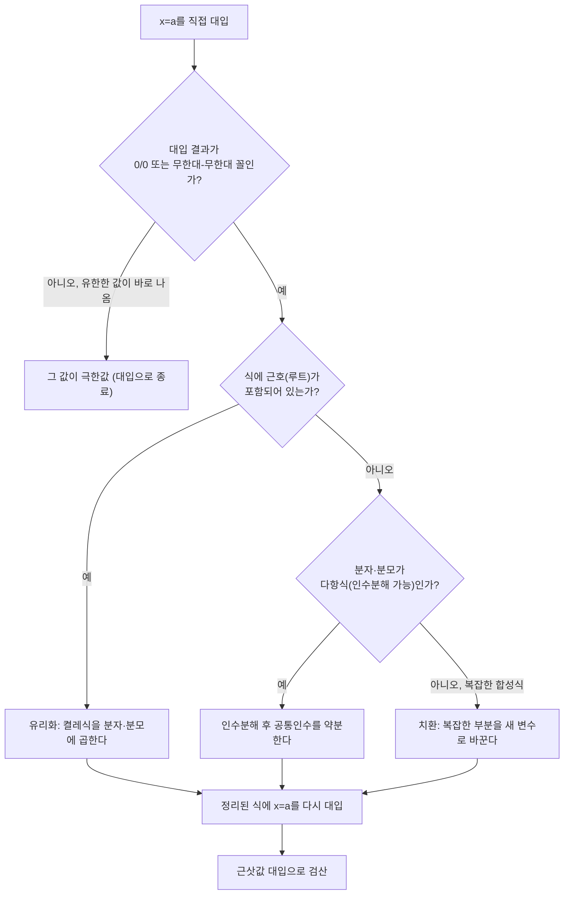

<Callout type="info">
  **이번 문서의 목표:** 이 파일을 다 읽으면 0/0 꼴 극한을 마주쳤을 때 인수분해·유리화·치환 중 어떤 기법을 써야 할지 판단하고, 각 기법을 대입부터 최종 답까지 빠짐없이 계산하고, 계산 결과를 근삿값 대입으로 검산할 수 있다.
</Callout>

## 지난 편 복습: 왜 계산 "기술"이 따로 필요한가

11편에서 함수의 극한을 좌극한·우극한으로 나눠 판단하는 법과 연속의 정의를 배웠다. 그런데 실제로 극한값을 **계산**하려고 $x=a$를 그대로 대입해보면, 시험에 자주 나오는 극한 문제 대부분은 $\dfrac{0}{0}$ 꼴이 되어 버린다. 예를 들어 $\displaystyle\lim_{x\to1}\dfrac{x^2-1}{x-1}$에 $x=1$을 그냥 대입하면 $\dfrac{0}{0}$이 나오는데, 이는 "값이 없다"는 뜻이 아니라 "이 형태로는 바로 알 수 없으니 식을 정리해야 한다"는 신호다. 이번 편은 이런 $\dfrac{0}{0}$ 꼴을 실제로 뚫는 세 가지 표준 절차 — 인수분해, 유리화, 치환 — 를 다룬다.

$\dfrac{0}{0}$이라는 표현 자체는 수학적으로 정의되지 않는 부정형(不定形, indeterminate form)이다. "정해지지 않은 형태"라는 뜻으로, 실제 극한값은 $0$일 수도, $2$일 수도, 무한대일 수도 있어서 식을 더 정리하기 전에는 알 수 없다는 의미다.

## 기법 선택 판단 흐름

먼저 전체 그림을 보자. 극한 문제를 만났을 때 어떤 절차를 밟아야 하는지는 다음 흐름을 따라가면 된다.

- 이 흐름은 절대적인 순서가 아니라 **판단 기준**이다. 근호와 인수분해가 동시에 필요한 문제도 있으며, 그런 경우 유리화를 먼저 해서 근호를 없앤 뒤 인수분해로 마무리하는 식으로 두 기법을 순서대로 조합한다.

## 기법 1: 인수분해로 처리하기

> **쉽게 말하면:** 분자와 분모를 곱셈 형태로 쪼개서, $x=a$일 때 둘 다 $0$이 되게 만드는 공통 인수 $(x-a)$를 찾아 약분한다.

### 왜 되는가

$\dfrac00$이 나오는 이유는 분자와 분모가 **똑같은 원인**(예: $(x-a)$라는 인수)으로 동시에 $0$이 되기 때문이다. 이 공통 원인을 분자·분모에서 각각 뽑아내 약분하면, 남은 식에는 더 이상 $0$을 만드는 원인이 없어서 $x=a$를 대입해도 안전하게 값이 나온다. 극한은 "$x=a$가 아닌 $x$"에서의 움직임만 보므로($x\to a$는 $x=a$ 자체를 포함하지 않는다), 약분하는 과정에서 $(x-a)$로 나누어도 문제가 없다.

### 계산 예시

$$
\lim_{x \to 3} \frac{x^2 - 9}{x - 3}
$$

**1단계 — 직접 대입해 부정형인지 확인한다.** $x=3$을 대입하면 분자는 $9-9=0$, 분모는 $3-3=0$이 되어 $\dfrac00$ 꼴이다. 인수분해가 필요하다.

**2단계 — 분자를 인수분해한다.** $x^2-9$는 제곱 차이 공식 $a^2-b^2=(a-b)(a+b)$를 적용하면 $(x-3)(x+3)$이다.

$$
\frac{x^2-9}{x-3} = \frac{(x-3)(x+3)}{x-3}
$$

**3단계 — 공통인수 $(x-3)$을 약분한다.** $x\neq 3$인 구간에서 극한을 보므로 약분이 허용된다.

$$
\frac{(x-3)(x+3)}{x-3} = x+3
$$

**4단계 — 정리된 식에 $x=3$을 대입한다.**

$$
\lim_{x \to 3} (x+3) = 3+3 = 6
$$

**검산.** $x=2.99$를 원래 식에 대입하면 $\dfrac{2.99^2-9}{2.99-3} = \dfrac{8.9401-9}{-0.01} = \dfrac{-0.0599}{-0.01} = 5.99$로 $6$에 매우 가깝다. $x=3.01$을 대입하면 $\dfrac{3.01^2-9}{3.01-3} = \dfrac{9.0601-9}{0.01} = \dfrac{0.0601}{0.01} = 6.01$로 역시 $6$에 근접한다. 양쪽에서 $6$을 향해 다가가는 것이 확인된다.

## 기법 2: 유리화로 처리하기

> **쉽게 말하면:** 근호(루트)가 있는 식은 켤레식(부호만 반대인 짝)을 분자와 분모에 똑같이 곱해서 근호를 없앤 뒤 인수분해·약분으로 넘어간다.

### 왜 필요한가

근호가 섞인 식은 그 자체로는 인수분해가 잘 안 된다. 하지만 $(\sqrt{A}-\sqrt{B})(\sqrt{A}+\sqrt{B}) = A-B$라는 성질(제곱 차이 공식의 근호 버전)을 이용하면, 근호가 있는 쪽에 그 켤레식을 곱해서 근호를 없앨 수 있다. 이때 분자에만 곱하면 식의 값이 바뀌어버리므로, **분모에도 똑같은 켤레식을 곱해 "1을 곱한 것"과 같은 효과**를 만들어야 한다.

### 계산 예시

$$
\lim_{x \to 0} \frac{\sqrt{x+4} - 2}{x}
$$

**1단계 — 직접 대입해 부정형인지 확인한다.** $x=0$을 대입하면 분자는 $\sqrt{4}-2 = 2-2=0$, 분모는 $0$이 되어 $\dfrac00$ 꼴이다.

**2단계 — 분자의 켤레식을 분자·분모에 곱한다.** $\sqrt{x+4}-2$의 켤레식은 $\sqrt{x+4}+2$다.

$$
\frac{\sqrt{x+4}-2}{x} \cdot \frac{\sqrt{x+4}+2}{\sqrt{x+4}+2} = \frac{(\sqrt{x+4})^2 - 2^2}{x(\sqrt{x+4}+2)}
$$

- $(\sqrt{x+4})^2 = x+4$: 근호를 제곱하면 근호 안의 식만 남는다
- 분자는 $(\sqrt{x+4}-2)(\sqrt{x+4}+2) = (\sqrt{x+4})^2 - 2^2$로, 제곱 차이 공식이 근호를 없애는 원리다

**3단계 — 분자를 정리한다.**

$$
\frac{(x+4) - 4}{x(\sqrt{x+4}+2)} = \frac{x}{x(\sqrt{x+4}+2)}
$$

**4단계 — 공통인수 $x$를 약분한다.**

$$
\frac{x}{x(\sqrt{x+4}+2)} = \frac{1}{\sqrt{x+4}+2}
$$

**5단계 — 정리된 식에 $x=0$을 대입한다.**

$$
\lim_{x \to 0} \frac{1}{\sqrt{x+4}+2} = \frac{1}{\sqrt{4}+2} = \frac{1}{2+2} = \frac{1}{4}
$$

**검산.** $x=0.01$을 원래 식에 대입하면 $\sqrt{4.01} \approx 2.0025$이므로 $\dfrac{2.0025-2}{0.01} = \dfrac{0.0025}{0.01} = 0.25$로 $\dfrac14=0.25$와 정확히 일치한다. $x=-0.01$을 대입하면 $\sqrt{3.99}\approx 1.99750$이므로 $\dfrac{1.99750-2}{-0.01} = \dfrac{-0.0025}{-0.01}=0.25$로 역시 일치한다.

## 기법 3: 치환으로 처리하기

> **쉽게 말하면:** 식이 복잡하게 얽혀 있을 때, 반복되거나 핵심이 되는 부분을 새 문자 하나로 바꿔서 단순한 극한 문제로 만든다.

### 왜 필요한가

$x \to \infty$나 $x \to a$ 형태가 아니라 $x \to a$일 때 $x$ 대신 다른 변수로 바꾸면 훨씬 익숙한 형태가 되는 경우가 있다. 특히 $x^{1/n}$ 같은 거듭제곱근이 섞인 식이나, 특정 조합이 반복되는 식에서 치환이 강력하다. **다만 치환할 때는 $x$의 범위가 바뀌면 새 변수의 범위도 함께 바뀐다는 것을 반드시 확인해야 한다** — 이것이 이 절 마지막에 나오는 흔한 실수다.

### 계산 예시

$$
\lim_{x \to 1} \frac{\sqrt[3]{x} - 1}{x - 1}
$$

- $\sqrt[3]{x}$: $x$의 세제곱근(cube root), 세 번 곱하면 $x$가 되는 수

**1단계 — 직접 대입해 부정형인지 확인한다.** $x=1$을 대입하면 분자는 $\sqrt[3]{1}-1=0$, 분모는 $0$이 되어 $\dfrac00$ 꼴이다. 세제곱근이 있어 인수분해가 바로 안 되므로 치환을 쓴다.

**2단계 — 세제곱근 부분을 새 변수로 치환한다.** $t = \sqrt[3]{x}$로 두면 $x = t^3$이다.

**3단계 — $x \to 1$이라는 조건을 $t$의 조건으로 바꾼다.** $x=t^3 \to 1$이므로 $t \to 1$이다(세제곱해서 $1$에 가까워지려면 $t$ 자신도 $1$에 가까워져야 한다). 여기서 $x$의 범위($1$ 근처)를 그대로 $t$의 범위($1$ 근처)로 바꿔 쓴 것이 치환의 핵심 단계다.

**4단계 — 식 전체를 $t$로 다시 쓴다.**

$$
\lim_{x \to 1} \frac{\sqrt[3]{x}-1}{x-1} = \lim_{t \to 1} \frac{t-1}{t^3-1}
$$

**5단계 — 분모를 인수분해한다.** $t^3-1$은 세제곱 차이 공식 $a^3-b^3=(a-b)(a^2+ab+b^2)$를 적용하면 $(t-1)(t^2+t+1)$이다.

$$
\lim_{t \to 1} \frac{t-1}{(t-1)(t^2+t+1)}
$$

**6단계 — 공통인수 $(t-1)$을 약분한다.**

$$
\lim_{t \to 1} \frac{1}{t^2+t+1}
$$

**7단계 — 정리된 식에 $t=1$을 대입한다.**

$$
\lim_{t \to 1} \frac{1}{t^2+t+1} = \frac{1}{1+1+1} = \frac{1}{3}
$$

**검산.** 원래 식에 $x=1.01$을 대입하면 $\sqrt[3]{1.01}\approx 1.00332$이므로 $\dfrac{1.00332-1}{1.01-1} = \dfrac{0.00332}{0.01} = 0.332$로 $\dfrac13\approx0.3333$에 가깝다. $x=0.99$를 대입하면 $\sqrt[3]{0.99}\approx0.99666$이므로 $\dfrac{0.99666-1}{0.99-1}=\dfrac{-0.00334}{-0.01}=0.334$로 역시 $\dfrac13$에 근접한다.

## 세 기법 비교

| 기법 | 신호(언제 쓰는가) | 핵심 동작 | 주의점 |
|------|-------------------|-----------|--------|
| 인수분해 | 분자·분모가 다항식이고 $\dfrac00$ 꼴 | 공통인수 $(x-a)$를 찾아 약분 | 인수분해 공식(제곱 차이, 세제곱 차이 등)을 정확히 적용 |
| 유리화 | 근호가 포함된 식이 $\dfrac00$ 꼴 | 켤레식을 분자·분모에 곱해 근호 제거 | 분모에도 반드시 같은 켤레식을 곱해야 값이 안 바뀐다 |
| 치환 | 거듭제곱근·합성식이 반복돼 복잡한 경우 | 복잡한 부분을 새 변수로 바꿔 단순화 | $x$의 범위를 새 변수의 범위로 정확히 바꿔야 한다 |

## 자주 틀리는 점

- **약분 전에 미리 $x=a$를 대입해버려 $0/0$을 보고 "극한이 없다"고 단정한다.** $\dfrac00$은 "정리가 더 필요하다"는 신호일 뿐, 극한이 존재하지 않는다는 뜻이 아니다. 인수분해·유리화·치환으로 정리한 뒤 다시 대입해야 한다.
- **유리화할 때 분모에는 켤레식을 곱하지 않는다.** 분자에만 곱하면 원래 식과 다른 값이 되어버린다. 분자·분모에 **똑같은** 켤레식을 곱해야 실질적으로 $1$을 곱한 것이 되어 식의 값이 보존된다.
- **치환 후 $x$의 범위를 새 변수의 범위로 바꾸는 것을 빠뜨린다.** $x \to a$였다고 해서 치환한 변수도 자동으로 같은 숫자로 가는 것이 아니라, 치환식 $t=g(x)$에 $x\to a$를 대입해 $t$가 실제로 어디로 가는지 다시 계산해야 한다. 예를 들어 $t=1/x$로 치환했다면 $x\to\infty$일 때 $t\to0$이지, $t\to\infty$가 아니다.
- **정의역을 확인하지 않고 약분한다.** 약분으로 사라진 인수 $(x-a)$가 원래 분모에 있었다는 것은 $x=a$가 원래 정의역에서 제외되어 있었다는 뜻이다. 정리된 식 $x+3$ 같은 결과가 $x=a$에서도 자연스럽게 값이 나온다고 해서, 원래 함수 자체가 $x=a$에서 정의된다고 착각하면 안 된다(11편의 제거가능 불연속과 연결되는 지점이다).
- **인수분해 공식을 잘못 기억한다.** $a^2-b^2=(a-b)(a+b)$와 $a^3-b^3=(a-b)(a^2+ab+b^2)$을 헷갈리기 쉽다. 특히 세제곱 차이 공식의 두 번째 인수는 $a^2+ab+b^2$이지 $(a+b)^2$가 아니다 — 전개해서 검산하는 습관을 들인다.

## 핵심 정리

- 극한 계산은 먼저 $x=a$를 직접 대입해 $\dfrac00$ 같은 부정형이 나오는지 확인하는 것에서 시작한다.
- 다항식이면 인수분해, 근호가 있으면 유리화, 복잡한 합성식이면 치환으로 정리한 뒤 다시 대입한다.
- 유리화는 켤레식을 분자·분모에 똑같이 곱해 근호를 없애는 방식이다.
- 치환은 $x$의 범위를 새 변수의 범위로 정확히 바꾸는 절차가 핵심이며, 이를 빠뜨리는 것이 가장 흔한 실수다.
- 모든 계산 결과는 목표값에 아주 가까운 수(예: $0.01$ 차이)를 원래 식에 대입해 근사값이 일치하는지 검산한다.

## 마무리 복습

<Quiz
  questionNumber={1}
  question="lim(x to 3) (x^2-9)/(x-3)의 값은?"
  options={['0', '3', '6', '극한이 존재하지 않는다']}
  correctAnswer={3}
  explanation="x^2-9를 (x-3)(x+3)으로 인수분해한 뒤 공통인수 (x-3)을 약분하면 x+3이 남는다. 여기에 x=3을 대입하면 3+3=6이다."
  optionExplanations={['약분 후 대입 과정에서 계산을 빠뜨린 오답이다.', '분모의 3을 그대로 답으로 쓴 오답이다.', '인수분해 후 약분하고 x=3을 대입해 6을 얻는 정확한 결과다.', '0/0 꼴이 나왔다고 극한이 없다고 잘못 판단한 경우다.']}
/>

<Quiz
  questionNumber={2}
  question="lim(x to 0) (sqrt(x+4)-2)/x를 유리화로 계산한 값은?"
  options={['1/4', '1/2', '4', '0']}
  correctAnswer={1}
  explanation="켤레식 sqrt(x+4)+2를 분자·분모에 곱하면 분자가 (x+4)-4=x가 되어 분모의 x와 약분된다. 남은 식 1/(sqrt(x+4)+2)에 x=0을 대입하면 1/(2+2)=1/4이다."
  optionExplanations={['켤레식을 곱해 근호를 제거하고 약분한 정확한 결과다.', '분모 계산에서 실수한 오답이다.', '분자·분모를 뒤집어 계산한 오답이다.', '약분 과정을 생략하고 잘못 판단한 오답이다.']}
/>

<Quiz
  questionNumber={3}
  question="lim(x to 1) (세제곱근(x)-1)/(x-1)을 t=세제곱근(x)로 치환할 때, x to 1은 t의 어떤 조건으로 바뀌는가?"
  options={['t to 1', 't to 0', 't to infinity', 't to -1']}
  correctAnswer={1}
  explanation="t=x의 세제곱근이므로 x=t^3이고, x가 1로 가면 t^3도 1로 가야 하므로 t 자신도 1로 가야 한다. 따라서 x to 1은 t to 1로 바뀐다."
  optionExplanations={['치환 관계 x=t^3에서 x가 1로 갈 때 t도 1로 가는 것이 정확한 대응이다.', 't가 0으로 가면 x=t^3도 0으로 가야 하므로 조건에 맞지 않는다.', 'x가 1이라는 유한한 값으로 가므로 t가 무한대로 갈 수 없다.', 't가 음수로 가면 x=t^3도 음수가 되어 x to 1과 맞지 않는다.']}
/>

<Quiz
  questionNumber={4}
  question="다음 중 극한 계산에서 유리화를 적용해야 할 신호로 가장 적절한 것은?"
  options={['분자·분모가 모두 다항식이고 대입 시 0/0이 나올 때', '식에 근호가 포함되어 있고 대입 시 0/0이 나올 때', '분모가 이미 0이 아닌 값으로 정리되어 있을 때', 'x가 무한대로 갈 때 분자·분모가 모두 상수일 때']}
  correctAnswer={2}
  explanation="유리화는 근호(루트)가 포함된 식이 직접 대입 시 0/0 꼴이 될 때, 켤레식을 곱해 근호를 없애기 위해 사용하는 기법이다."
  optionExplanations={['다항식이 0/0 꼴이면 유리화가 아니라 인수분해를 먼저 시도하는 것이 표준 절차다.', '근호가 있는 0/0 꼴이 유리화를 쓰는 전형적인 신호이므로 정답이다.', '이미 0이 아닌 값이면 부정형이 아니므로 별도 기법이 필요 없다.', '분자·분모가 상수면 애초에 부정형이 아니다.']}
/>

<Quiz
  questionNumber={5}
  question="치환을 이용한 극한 계산에서 가장 흔히 저지르는 실수는?"
  options={['공식을 아예 적용하지 않는 것', '치환 후 x의 범위를 새 변수의 범위로 바꾸지 않는 것', '분모를 인수분해하는 것', '대입 전에 미리 부정형인지 확인하는 것']}
  correctAnswer={2}
  explanation="치환할 때는 x가 특정 값으로 갈 때 새 변수가 어디로 가는지 치환식을 이용해 다시 계산해야 한다. 이를 생략하고 x의 조건을 그대로 새 변수에 옮기면 잘못된 조건으로 계산하게 된다."
  optionExplanations={['공식 미적용은 계산 자체가 진행되지 않으므로 흔한 실수라기보다 계산 중단이다.', '범위를 다시 계산하지 않고 그대로 옮기는 것이 치환에서 가장 흔한 실수이므로 정답이다.', '분모 인수분해는 치환 이후의 정상적인 후속 절차다.', '부정형 확인은 오히려 반드시 해야 하는 올바른 절차다.']}
/>

<Quiz
  questionNumber={6}
  question="lim(x to 2) (x^2-4)/(x-2)를 인수분해로 계산한 값은?"
  options={['0', '2', '4', '극한이 존재하지 않는다']}
  correctAnswer={3}
  explanation="x^2-4=(x-2)(x+2)로 인수분해한 뒤 공통인수 (x-2)를 약분하면 x+2가 남는다. x=2를 대입하면 2+2=4이다."
  optionExplanations={['약분 후 대입을 생략한 오답이다.', '분모의 값을 그대로 답으로 쓴 오답이다.', '인수분해와 약분, 대입을 정확히 수행한 결과다.', '0/0 꼴을 극한 부재로 잘못 해석한 경우다.']}
/>

<Quiz
  questionNumber={7}
  question="세제곱 차이 공식 a^3-b^3의 올바른 인수분해는?"
  options={['(a-b)(a^2+ab+b^2)', '(a-b)(a+b)^2', '(a-b)(a^2-ab+b^2)', '(a+b)(a^2-ab+b^2)']}
  correctAnswer={1}
  explanation="세제곱 차이 공식은 a^3-b^3=(a-b)(a^2+ab+b^2)이다. 가운데 항의 부호가 +ab라는 점이 핵심이며, 세제곱 합 공식 a^3+b^3=(a+b)(a^2-ab+b^2)와 부호가 반대이므로 혼동하지 않아야 한다."
  optionExplanations={['가운데 항이 +ab인 정확한 세제곱 차이 공식이다.', '(a+b)^2으로 잘못 전개한 오답이다.', '세제곱 합 공식의 두 번째 인수를 여기에 잘못 가져온 오답이다.', '첫 번째 인수를 (a+b)로 잘못 쓴 오답이다.']}
/>

## 참고 자료

- [고등학교 미적분 공식·개념 정리 자료](https://mathworld.wolfram.com) — 극한 계산의 표준 기법(인수분해, 유리화, 치환)과 인수분해 공식을 재구성하는 데 참고
- [수학 공식 – 고등학교 미적분](https://www.itl.nist.gov/div898/handbook/) — 극한 계산 절차와 부정형 처리 방식을 확인하는 데 참고
