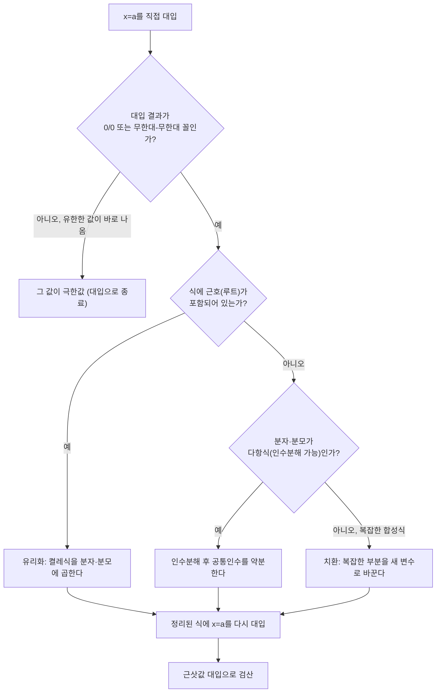

## 지난 편 복습: 왜 계산 "기술"이 따로 필요한가

11편에서 함수의 극한을 좌극한·우극한으로 나눠 판단하는 법과 연속의 정의를 배웠다. 예를 들어 $\displaystyle\lim_{x\to1}\dfrac{x^2-1}{x-1}$에 $x=1$을 그냥 대입하면 $\dfrac{0}{0}$이 나오는데, 이는 "값이 없다"는 뜻이 아니라 "이 형태로는 바로 알 수 없으니 식을 정리해야 한다"는 신호다.

$\dfrac{0}{0}$이라는 표현 자체는 수학적으로 정의되지 않는 부정형(不定形, indeterminate form)이다. "정해지지 않은 형태"라는 뜻으로, 실제 극한값은 $0$일 수도, $2$일 수도, 무한대일 수도 있어서 식을 더 정리하기 전에는 알 수 없다는 의미다.

## 기법 선택 판단 흐름

먼저 전체 그림을 보자. 극한 문제를 만났을 때 어떤 절차를 밟아야 하는지는 다음 흐름을 따라가면 된다.

```mermaid
flowchart TD
    A["x=a를 직접 대입"] --> B{"대입 결과가\n0/0 또는 무한대-무한대 꼴인가?"}
    B -->|아니오, 유한한 값이 바로 나옴| C["그 값이 극한값 (대입으로 종료)"]
    B -->|예| D{"식에 근호(루트)가\n포함되어 있는가?"}
    D -->|예| E["유리화: 켤레식을 분자·분모에 곱한다"]
    D -->|아니오| F{"분자·분모가\n다항식(인수분해 가능)인가?"}
    F -->|예| G["인수분해 후 공통인수를 약분한다"]
    F -->|아니오, 복잡한 합성식| H["치환: 복잡한 부분을 새 변수로 바꾼다"]
    E --> I["정리된 식에 x=a를 다시 대입"]
    G --> I
    H --> I
    I --> J["근삿값 대입으로 검산"]
```

- 이 흐름은 절대적인 순서가 아니라 **판단 기준**이다. 근호와 인수분해가 동시에 필요한 문제도 있으며, 그런 경우 유리화를 먼저 해서 근호를 없앤 뒤 인수분해로 마무리하는 식으로 두 기법을 순서대로 조합한다.

## 기법 1: 인수분해로 처리하기

### 왜 되는가

$\dfrac00$이 나오는 이유는 분자와 분모가 **똑같은 원인**(예: $(x-a)$라는 인수)으로 동시에 $0$이 되기 때문이다. 이 공통 원인을 분자·분모에서 각각 뽑아내 약분하면, 남은 식에는 더 이상 $0$을 만드는 원인이 없어서 $x=a$를 대입해도 안전하게 값이 나온다.

### 계산 예시

$$
\lim_{x \to 3} \frac{x^2 - 9}{x - 3}
$$

**1단계 — 직접 대입해 부정형인지 확인한다.** $x=3$을 대입하면 분자는 $9-9=0$, 분모는 $3-3=0$이 되어 $\dfrac00$ 꼴이다. 인수분해가 필요하다.

**2단계 — 분자를 인수분해한다.** $x^2-9$는 제곱 차이 공식 $a^2-b^2=(a-b)(a+b)$를 적용하면 $(x-3)(x+3)$이다.

$$
\frac{x^2-9}{x-3} = \frac{(x-3)(x+3)}{x-3}
$$

**3단계 — 공통인수 $(x-3)$을 약분한다.** $x\neq 3$인 구간에서 극한을 보므로 약분이 허용된다.

$$
\frac{(x-3)(x+3)}{x-3} = x+3
$$

**4단계 — 정리된 식에 $x=3$을 대입한다.**

$$
\lim_{x \to 3} (x+3) = 3+3 = 6
$$

**검산.** $x=2.99$를 원래 식에 대입하면 $\dfrac{2.99^2-9}{2.99-3} = \dfrac{8.9401-9}{-0.01} = \dfrac{-0.0599}{-0.01} = 5.99$로 $6$에 매우 가깝다. $x=3.01$을 대입하면 $\dfrac{3.01^2-9}{3.01-3} = \dfrac{9.0601-9}{0.01} = \dfrac{0.0601}{0.01} = 6.01$로 역시 $6$에 근접한다.

## 기법 2: 유리화로 처리하기

### 계산 예시

$$
\lim_{x \to 0} \frac{\sqrt{x+4} - 2}{x}
$$

**1단계 — 직접 대입해 부정형인지 확인한다.** $x=0$을 대입하면 분자는 $\sqrt{4}-2 = 2-2=0$, 분모는 $0$이 되어 $\dfrac00$ 꼴이다.

**2단계 — 분자의 켤레식을 분자·분모에 곱한다.** $\sqrt{x+4}-2$의 켤레식은 $\sqrt{x+4}+2$다.

$$
\frac{\sqrt{x+4}-2}{x} \cdot \frac{\sqrt{x+4}+2}{\sqrt{x+4}+2} = \frac{(\sqrt{x+4})^2 - 2^2}{x(\sqrt{x+4}+2)}
$$

- $(\sqrt{x+4})^2 = x+4$: 근호를 제곱하면 근호 안의 식만 남는다
- 분자는 $(\sqrt{x+4}-2)(\sqrt{x+4}+2) = (\sqrt{x+4})^2 - 2^2$로, 제곱 차이 공식이 근호를 없애는 원리다

**3단계 — 분자를 정리한다.**

$$
\frac{(x+4) - 4}{x(\sqrt{x+4}+2)} = \frac{x}{x(\sqrt{x+4}+2)}
$$

**4단계 — 공통인수 $x$를 약분한다.**

$$
\frac{x}{x(\sqrt{x+4}+2)} = \frac{1}{\sqrt{x+4}+2}
$$

**5단계 — 정리된 식에 $x=0$을 대입한다.**

$$
\lim_{x \to 0} \frac{1}{\sqrt{x+4}+2} = \frac{1}{\sqrt{4}+2} = \frac{1}{2+2} = \frac{1}{4}
$$

**검산.** $x=0.01$을 원래 식에 대입하면 $\sqrt{4.01} \approx 2.0025$이므로 $\dfrac{2.0025-2}{0.01} = \dfrac{0.0025}{0.01} = 0.25$로 $\dfrac14=0.25$와 정확히 일치한다. $x=-0.01$을 대입하면 $\sqrt{3.99}\approx 1.99750$이므로 $\dfrac{1.99750-2}{-0.01} = \dfrac{-0.0025}{-0.01}=0.25$로 역시 일치한다.

## 기법 3: 치환으로 처리하기

### 계산 예시

$$
\lim_{x \to 1} \frac{\sqrt[3]{x} - 1}{x - 1}
$$

- $\sqrt[3]{x}$: $x$의 세제곱근(cube root), 세 번 곱하면 $x$가 되는 수

**1단계 — 직접 대입해 부정형인지 확인한다.** $x=1$을 대입하면 분자는 $\sqrt[3]{1}-1=0$, 분모는 $0$이 되어 $\dfrac00$ 꼴이다. 세제곱근이 있어 인수분해가 바로 안 되므로 치환을 쓴다.

**2단계 — 세제곱근 부분을 새 변수로 치환한다.** $t = \sqrt[3]{x}$로 두면 $x = t^3$이다.

**3단계 — $x \to 1$이라는 조건을 $t$의 조건으로 바꾼다.** $x=t^3 \to 1$이므로 $t \to 1$이다(세제곱해서 $1$에 가까워지려면 $t$ 자신도 $1$에 가까워져야 한다). 여기서 $x$의 범위($1$ 근처)를 그대로 $t$의 범위($1$ 근처)로 바꿔 쓴 것이 치환의 핵심 단계다.

**4단계 — 식 전체를 $t$로 다시 쓴다.**

$$
\lim_{x \to 1} \frac{\sqrt[3]{x}-1}{x-1} = \lim_{t \to 1} \frac{t-1}{t^3-1}
$$

**5단계 — 분모를 인수분해한다.** $t^3-1$은 세제곱 차이 공식 $a^3-b^3=(a-b)(a^2+ab+b^2)$를 적용하면 $(t-1)(t^2+t+1)$이다.

$$
\lim_{t \to 1} \frac{t-1}{(t-1)(t^2+t+1)}
$$

**6단계 — 공통인수 $(t-1)$을 약분한다.**

$$
\lim_{t \to 1} \frac{1}{t^2+t+1}
$$

**7단계 — 정리된 식에 $t=1$을 대입한다.**

$$
\lim_{t \to 1} \frac{1}{t^2+t+1} = \frac{1}{1+1+1} = \frac{1}{3}
$$

**검산.** 원래 식에 $x=1.01$을 대입하면 $\sqrt[3]{1.01}\approx 1.00332$이므로 $\dfrac{1.00332-1}{1.01-1} = \dfrac{0.00332}{0.01} = 0.332$로 $\dfrac13\approx0.3333$에 가깝다. $x=0.99$를 대입하면 $\sqrt[3]{0.99}\approx0.99666$이므로 $\dfrac{0.99666-1}{0.99-1}=\dfrac{-0.00334}{-0.01}=0.334$로 역시 $\dfrac13$에 근접한다.

## 세 기법 비교

| 기법 | 신호(언제 쓰는가) | 핵심 동작 | 주의점 |
|------|-------------------|-----------|--------|
| 인수분해 | 분자·분모가 다항식이고 $\dfrac00$ 꼴 | 공통인수 $(x-a)$를 찾아 약분 | 인수분해 공식(제곱 차이, 세제곱 차이 등)을 정확히 적용 |
| 유리화 | 근호가 포함된 식이 $\dfrac00$ 꼴 | 켤레식을 분자·분모에 곱해 근호 제거 | 분모에도 반드시 같은 켤레식을 곱해야 값이 안 바뀐다 |
| 치환 | 거듭제곱근·합성식이 반복돼 복잡한 경우 | 복잡한 부분을 새 변수로 바꿔 단순화 | $x$의 범위를 새 변수의 범위로 정확히 바꿔야 한다 |

## 자주 틀리는 점

- **약분 전에 미리 $x=a$를 대입해버려 $0/0$을 보고 "극한이 없다"고 단정한다.** $\dfrac00$은 "정리가 더 필요하다"는 신호일 뿐, 극한이 존재하지 않는다는 뜻이 아니다. 인수분해·유리화·치환으로 정리한 뒤 다시 대입해야 한다.
- **유리화할 때 분모에는 켤레식을 곱하지 않는다.** 분자에만 곱하면 원래 식과 다른 값이 되어버린다. 분자·분모에 **똑같은** 켤레식을 곱해야 실질적으로 $1$을 곱한 것이 되어 식의 값이 보존된다.
- **치환 후 $x$의 범위를 새 변수의 범위로 바꾸는 것을 빠뜨린다.** $x \to a$였다고 해서 치환한 변수도 자동으로 같은 숫자로 가는 것이 아니라, 치환식 $t=g(x)$에 $x\to a$를 대입해 $t$가 실제로 어디로 가는지 다시 계산해야 한다. 예를 들어 $t=1/x$로 치환했다면 $x\to\infty$일 때 $t\to0$이지, $t\to\infty$가 아니다.
- **정의역을 확인하지 않고 약분한다.** 약분으로 사라진 인수 $(x-a)$가 원래 분모에 있었다는 것은 $x=a$가 원래 정의역에서 제외되어 있었다는 뜻이다. 정리된 식 $x+3$ 같은 결과가 $x=a$에서도 자연스럽게 값이 나온다고 해서, 원래 함수 자체가 $x=a$에서 정의된다고 착각하면 안 된다(11편의 제거가능 불연속과 연결되는 지점이다).

## 핵심 정리

- 극한 계산은 먼저 $x=a$를 직접 대입해 $\dfrac00$ 같은 부정형이 나오는지 확인하는 것에서 시작한다.
- 다항식이면 인수분해, 근호가 있으면 유리화, 복잡한 합성식이면 치환으로 정리한 뒤 다시 대입한다.
- 유리화는 켤레식을 분자·분모에 똑같이 곱해 근호를 없애는 방식이다.
- 치환은 $x$의 범위를 새 변수의 범위로 정확히 바꾸는 절차가 핵심이며, 이를 빠뜨리는 것이 가장 흔한 실수다.
- 모든 계산 결과는 목표값에 아주 가까운 수(예: $0.01$ 차이)를 원래 식에 대입해 근사값이 일치하는지 검산한다.

## 마무리 복습

<Quiz
  questionNumber={1}
  question={"lim(x to 3) (x^2-9)/(x-3)의 값은?"}
  options={["0","3","6","극한이 존재하지 않는다"]}
  correctAnswer={3}
  explanation={"x^2-9를 (x-3)(x+3)으로 인수분해한 뒤 공통인수 (x-3)을 약분하면 x+3이 남는다. 여기에 x=3을 대입하면 3+3=6이다."}
/>

<Quiz
  questionNumber={2}
  question={"lim(x to 0) (sqrt(x+4)-2)/x를 유리화로 계산한 값은?"}
  options={["1/4","1/2","4","0"]}
  correctAnswer={1}
  explanation={"켤레식 sqrt(x+4)+2를 분자·분모에 곱하면 분자가 (x+4)-4=x가 되어 분모의 x와 약분된다. 남은 식 1/(sqrt(x+4)+2)에 x=0을 대입하면 1/(2+2)=1/4이다."}
/>

<Quiz
  questionNumber={3}
  question={"lim(x to 1) (세제곱근(x)-1)/(x-1)을 t=세제곱근(x)로 치환할 때, x to 1은 t의 어떤 조건으로 바뀌는가?"}
  options={["t to 1","t to 0","t to infinity","t to -1"]}
  correctAnswer={1}
  explanation={"t=x의 세제곱근이므로 x=t^3이고, x가 1로 가면 t^3도 1로 가야 하므로 t 자신도 1로 가야 한다. 따라서 x to 1은 t to 1로 바뀐다."}
/>

## 참고 자료

- [고등학교 미적분 공식·개념 정리 자료](https://mathworld.wolfram.com) — 극한 계산의 표준 기법(인수분해, 유리화, 치환)과 인수분해 공식을 재구성하는 데 참고
- [수학 공식 – 고등학교 미적분](https://www.itl.nist.gov/div898/handbook/) — 극한 계산 절차와 부정형 처리 방식을 확인하는 데 참고
