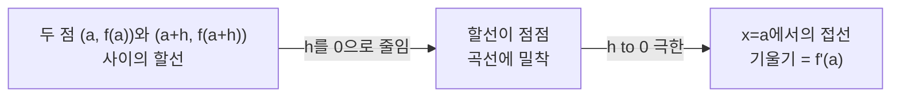

<Callout type="info">
  **이번 문서의 목표:** 이 파일을 다 읽으면 미분계수를 극한의 정의로 이해하고, 그것이 접선의 기울기라는 의미를 설명하고, 다항·지수·로그·삼각함수를 기본 공식으로 미분하고, 합성함수를 연쇄법칙으로 미분할 수 있다.
</Callout>

## 지난 편 복습: 극한에서 미분으로

11편에서 함수의 극한과 연속을, 12편에서 $\dfrac00$ 꼴 극한을 인수분해·유리화·치환으로 계산하는 절차를 배웠다. 이번 편에서 다루는 **미분**(微分, differentiation)은 사실 극한의 한 가지 특별한 활용이다. 미분은 "함수가 한 점에서 얼마나 가파르게 변하는가"를 극한을 이용해 숫자 하나로 정확히 표현하는 도구다. 12편에서 익힌 $\dfrac00$ 꼴 극한 계산 기술은 이번 편의 미분계수 정의를 실제로 계산할 때 그대로 재사용된다.

## 평균변화율: 미분의 출발점

> **쉽게 말하면:** 두 점 사이를 이은 직선(할선)의 기울기가 평균변화율이다.

### 왜 필요한가

자동차가 $2$시간 동안 $120\text{km}$를 이동했다면 평균 속도는 시속 $60\text{km}$다. 그런데 이 $60\text{km/h}$는 "평균"일 뿐, 출발 직후나 도착 직전의 **그 순간** 속도는 이보다 빠를 수도 느릴 수도 있다. 이렇게 "구간 전체에 걸친 평균적인 변화"와 "어느 한 순간의 변화"를 구분하려는 것이 미분의 출발점이다.

### 정의

함수 $f(x)$에서 $x$가 $a$에서 $a+h$로 변할 때의 **평균변화율**(average rate of change)은 다음과 같다.

$$
\frac{f(a+h) - f(a)}{h}
$$

- $a$: 시작하는 $x$값
- $h$: $x$가 변한 양(증분, increment). 양수일 수도 음수일 수도 있다
- $f(a+h)-f(a)$: $y$값이 변한 양
- 분자를 분모로 나눈 전체 식은 "$y$가 변한 양 나누기 $x$가 변한 양", 즉 변화의 비율이다

그래프 위에서 이 값은 두 점 $(a, f(a))$와 $(a+h, f(a+h))$를 잇는 직선(할선, secant line)의 기울기와 정확히 같다.

### 계산 예시

$f(x) = x^2$에서 $a=1$, $h=2$일 때의 평균변화율을 구해보자.

$$
\frac{f(1+2)-f(1)}{2} = \frac{f(3)-f(1)}{2} = \frac{9-1}{2} = 4
$$

- $f(3) = 3^2 = 9$, $f(1)=1^2=1$

$x=1$에서 $x=3$으로 변하는 동안 $y$는 평균적으로 $x$가 $1$ 늘어날 때마다 $4$씩 늘어난 셈이다.

## 미분계수: 순간변화율

> **쉽게 말하면:** 평균변화율에서 구간의 폭 $h$를 한없이 $0$에 가깝게 줄이면, "그 순간"의 변화율이 나온다. 이것이 미분계수다.

### 정의

함수 $f(x)$의 $x=a$에서의 **미분계수**(微分係數, derivative at a point)는 평균변화율의 $h \to 0$ 극한으로 정의된다.

$$
f'(a) = \lim_{h \to 0} \frac{f(a+h) - f(a)}{h}
$$

- $f'(a)$: "에프 프라임 에이", $f$를 미분해서 $x=a$에 대입한 값
- $h \to 0$: 구간의 폭을 한없이 $0$에 가깝게 줄인다는 뜻(단, $h=0$ 자체는 대입하지 않는다 — 분모가 $0$이 되어 정의되지 않기 때문이다)
- 이 극한이 존재할 때 $f$는 $x=a$에서 **미분가능**(differentiable)하다고 말한다

이 정의는 정확히 12편에서 다룬 $\dfrac00$ 꼴 극한이다. $h \to 0$일 때 분자 $f(a+h)-f(a)$도 $0$에 가까워지고 분모 $h$도 $0$에 가까워지므로, 직접 대입하면 $\dfrac00$이 나온다. 그래서 미분계수를 정의대로 계산할 때는 반드시 분자를 정리해 $h$라는 공통인수를 약분하는 절차를 거쳐야 한다 — 12편의 인수분해 기법이 그대로 쓰이는 지점이다.

> **비유:** 평균변화율이 "서울에서 부산까지 평균 속도"라면, 미분계수는 "지금 이 순간 계기판에 찍히는 속도"다. 계기판 속도는 이동한 거리를 이동한 시간으로 나눈 것인데, 그 시간 구간을 한없이 짧게 줄여나간 극한값이 바로 그 순간의 속도다.

### 계산 예시: 정의로 직접 미분계수 구하기

$f(x)=x^2$의 $x=1$에서의 미분계수를 정의대로 계산해보자.

$$
f'(1) = \lim_{h \to 0} \frac{f(1+h)-f(1)}{h} = \lim_{h \to 0} \frac{(1+h)^2 - 1^2}{h}
$$

**1단계 — 분자를 전개한다.** $(1+h)^2 = 1+2h+h^2$이므로

$$
\lim_{h \to 0} \frac{1+2h+h^2-1}{h} = \lim_{h \to 0} \frac{2h+h^2}{h}
$$

**2단계 — 분자에서 공통인수 $h$를 뽑아 약분한다.**

$$
\lim_{h \to 0} \frac{h(2+h)}{h} = \lim_{h \to 0} (2+h)
$$

**3단계 — $h=0$을 대입한다.**

$$
\lim_{h \to 0} (2+h) = 2+0 = 2
$$

따라서 $f'(1) = 2$다.

**검산.** $h=0.01$을 정의식에 직접 대입하면 $\dfrac{(1.01)^2-1}{0.01} = \dfrac{1.0201-1}{0.01} = \dfrac{0.0201}{0.01}=2.01$로 $2$에 매우 가깝다. $h=-0.01$을 대입하면 $\dfrac{(0.99)^2-1}{-0.01}=\dfrac{0.9801-1}{-0.01}=\dfrac{-0.0199}{-0.01}=1.99$로 역시 $2$에 근접한다.

## 접선의 기울기라는 의미

> **쉽게 말하면:** 미분계수 $f'(a)$는 그래프 위의 점 $(a, f(a))$에서 그 곡선에 딱 붙게 그은 접선의 기울기와 같다.

평균변화율이 두 점을 잇는 할선의 기울기였다면, $h \to 0$으로 두 점이 한없이 가까워지면 할선은 한 점에서 곡선에 닿는 접선(接線, tangent line)으로 변해간다. 이것이 미분계수를 기하학적으로 해석하는 방법이다.

이 해석을 이용하면 $x=1$에서 $f(x)=x^2$에 접하는 접선의 방정식도 바로 구할 수 있다. 접선은 점 $(1, f(1)) = (1,1)$을 지나고 기울기가 $f'(1)=2$인 직선이므로, 직선의 방정식 $y-y_1 = m(x-x_1)$을 이용하면

$$
y - 1 = 2(x-1)
$$

$$
y = 2x - 1
$$

이 접선은 $x=1$ 근처에서 원래 곡선 $y=x^2$와 거의 겹쳐 보일 만큼 딱 붙어 있다.

## 도함수: 모든 점에서의 미분계수를 한꺼번에

> **쉽게 말하면:** 특정 점 하나가 아니라 $x$ 자리에 아무 값이나 넣을 수 있게 만든 미분계수의 일반화가 도함수다.

$f'(a)$가 "점 $a$ 하나에서의" 미분계수였다면, $a$ 대신 변수 $x$를 그대로 남겨 함수 형태로 만든 것이 **도함수**(導函數, derivative function) $f'(x)$다.

$$
f'(x) = \lim_{h \to 0} \frac{f(x+h) - f(x)}{h}
$$

도함수를 한 번 구해두면, 이후에는 특정 $x$값을 대입하기만 하면 그 점에서의 미분계수를 바로 얻을 수 있다. 앞으로 소개하는 "기본 미분 공식"은 모두 이 정의식으로부터 유도된 도함수 결과를 미리 정리해둔 것이다.

## 다항함수의 기본 미분 공식

> **쉽게 말하면:** $x^n$ 꼴은 지수를 앞으로 끌어내리고 지수를 하나 줄이면 미분이 끝난다.

$$
(x^n)' = n x^{n-1}
$$

- $n$: 지수(거듭제곱의 횟수), 실수 전체에서 성립한다
- 지수를 계수 자리로 끌어내리고, 원래 지수에서 $1$을 뺀 것이 새 지수가 된다

상수함수와 상수배, 합의 미분은 다음 성질을 따른다.

$$
(c)' = 0 \qquad (cf(x))' = c f'(x) \qquad (f(x)+g(x))' = f'(x)+g'(x)
$$

- $c$는 상수(변하지 않는 값)이므로 미분하면 $0$이다(변화율이 없다)
- 상수배는 미분 밖으로 그대로 꺼낼 수 있다
- 합의 미분은 각 항을 따로 미분해서 더한 것과 같다

### 계산 예시

$f(x) = 3x^4 - 2x^2 + 5x - 7$을 미분하자. 각 항에 위 공식을 그대로 적용한다.

$$
f'(x) = 3(4x^3) - 2(2x) + 5(1) - 0
$$

- $3x^4$의 미분: 지수 $4$를 앞으로 끌어내려 $3 \times 4 x^{4-1} = 12x^3$
- $-2x^2$의 미분: $-2 \times 2x^{2-1} = -4x$
- $5x$의 미분: $x^1$의 미분은 $1 \times x^0 = 1$이므로 $5 \times 1 = 5$
- $-7$의 미분: 상수이므로 $0$

$$
f'(x) = 12x^3 - 4x + 5
$$

**검산 — 정의식으로 한 점을 확인한다.** $x=1$에서 도함수 공식으로 구한 값은 $f'(1) = 12(1)-4(1)+5 = 13$이다. 정의식으로도 확인해보자. $f(1)=3-2+5-7=-1$이고, $h=0.001$일 때 $f(1.001) = 3(1.001)^4 - 2(1.001)^2 + 5(1.001) - 7$을 계산하면 $(1.001)^4\approx1.004006$, $(1.001)^2\approx1.002001$이므로 $f(1.001)\approx 3(1.004006)-2(1.002001)+5.005-7 = 3.012018-2.004002+5.005-7=0.013016$이다. 따라서 $\dfrac{f(1.001)-f(1)}{0.001} = \dfrac{0.013016-(-1)}{0.001} = \dfrac{1.013016}{0.001}=13.016$로 공식으로 구한 $13$에 매우 가깝다.

## 지수함수의 미분

> **쉽게 말하면:** 밑이 $e$인 지수함수 $e^x$는 미분해도 자기 자신 그대로다. 밑이 다른 지수함수는 $\ln$(자연로그)이 곱해진다.

$$
(e^x)' = e^x \qquad (a^x)' = a^x \ln a
$$

- $e$: 자연상수(自然常數, Euler's number), 약 $2.71828\ldots$인 특별한 무한소수. $e^x$의 접선 기울기가 그 점의 함숫값과 항상 똑같아지는 유일한 밑이라는 성질 때문에 미적분에서 가장 자연스러운 밑으로 쓰인다
- $\ln a$: "로그 내추럴 에이", 밑이 $e$인 로그 $\log_e a$를 줄여 쓰는 표기(자연로그)
- $a$는 밑(base)이며 $a>0,\ a\neq1$이어야 한다

$e^x$가 미분해도 변하지 않는다는 성질은 지수함수를 미적분에서 가장 다루기 쉬운 함수로 만들어준다. 예를 들어 $f(x)=5e^x$를 미분하면 상수배 규칙에 따라 $f'(x)=5e^x$로, 형태가 그대로 유지된다.

## 로그함수의 미분

> **쉽게 말하면:** 자연로그 $\ln x$를 미분하면 $\dfrac1x$가 된다.

$$
(\ln x)' = \frac{1}{x} \qquad (x > 0)
$$

- $\ln x$는 $x>0$에서만 정의되므로, 미분한 결과 $\dfrac1x$도 $x>0$ 범위에서만 의미가 있다

### 계산 예시

$f(x) = 4\ln x$를 미분하면 상수배 규칙에 따라

$$
f'(x) = 4 \cdot \frac{1}{x} = \frac{4}{x}
$$

$x=2$에서의 미분계수는 $f'(2) = \dfrac42 = 2$다. **검산.** $h=0.001$일 때 $f(2.001) = 4\ln(2.001)$이고 $\ln(2.001)\approx0.693647$이므로 $f(2.001)\approx2.774588$이다. $f(2)=4\ln2\approx4(0.693147)=2.772589$이므로 $\dfrac{f(2.001)-f(2)}{0.001}\approx\dfrac{2.774588-2.772589}{0.001}=\dfrac{0.001999}{0.001}\approx1.999$로 공식값 $2$에 매우 가깝다.

## 삼각함수의 미분

> **쉽게 말하면:** $\sin x$를 미분하면 $\cos x$, $\cos x$를 미분하면 $-\sin x$다. 이 둘은 서로를 낳고 부호만 바뀌며 되돌아온다.

$$
(\sin x)' = \cos x \qquad (\cos x)' = -\sin x \qquad (\tan x)' = \frac{1}{\cos^2 x}
$$

- $\sin x$(사인): 단위원에서 각 $x$에 대응하는 점의 $y$좌표
- $\cos x$(코사인): 단위원에서 각 $x$에 대응하는 점의 $x$좌표
- $\tan x$(탄젠트): $\dfrac{\sin x}{\cos x}$로 정의되며, $\cos x=0$인 지점에서는 정의되지 않는다

$\cos x$를 미분하면 $-\sin x$로 **음의 부호**가 붙는다는 점이 가장 흔히 놓치는 부분이다. $\sin x$를 한 번 더 미분하면 $\cos x$가 나오고, $\cos x$를 한 번 더 미분하면 $-\sin x$가 나오며, 이를 계속하면 $\sin x \to \cos x \to -\sin x \to -\cos x \to \sin x$로 네 번 미분할 때마다 원래 함수로 돌아오는 순환 구조를 이룬다.

### 계산 예시

$f(x) = 3\sin x + \cos x$를 미분하면

$$
f'(x) = 3\cos x - \sin x
$$

$x=0$에서의 미분계수는 $f'(0) = 3\cos0 - \sin0 = 3(1)-0=3$이다.

## 연쇄법칙 기초 (chain rule)

> **쉽게 말하면:** 함수 안에 함수가 들어 있는 합성함수는, "바깥을 먼저 미분하고 안쪽을 그대로 둔 것"에 "안쪽을 미분한 것"을 곱한다.

### 왜 필요한가

$(3x+1)^2$을 미분하고 싶다고 하자. 이 식은 "$3x+1$이라는 안쪽 함수"를 "제곱하는 바깥 함수"에 넣은 합성함수(合成函數, composite function)다. 물론 이 예시는 전개해서 $9x^2+6x+1$로 만든 뒤 다항함수 공식으로 미분할 수도 있지만, $(3x+1)^{10}$처럼 전개가 현실적으로 어려운 경우에는 전개 없이 미분하는 방법이 반드시 필요하다.

### 정의와 공식

$y=f(u)$이고 $u=g(x)$일 때(즉 $y=f(g(x))$일 때), 다음이 성립한다.

$$
\frac{dy}{dx} = \frac{dy}{du} \cdot \frac{du}{dx}
$$

- $\dfrac{dy}{du}$: 바깥 함수 $f$를 안쪽 변수 $u$에 대해 미분한 것
- $\dfrac{du}{dx}$: 안쪽 함수 $g$를 $x$에 대해 미분한 것
- 두 도함수를 **곱한다**는 것이 연쇄법칙의 핵심이다. 마치 사슬(chain)의 고리 두 개가 이어지듯, $x$의 변화가 $u$를 거쳐 $y$까지 전달되는 비율을 두 단계로 쪼개 곱하는 것이다

함수 표기로는 $y=f(g(x))$의 도함수를 다음과 같이도 쓴다.

$$
y' = f'(g(x)) \cdot g'(x)
$$

- $f'(g(x))$: 바깥 함수를 미분한 뒤, 안쪽 함수 $g(x)$를 그대로 대입한 것("바깥 미분, 안쪽 그대로")
- $g'(x)$: 안쪽 함수를 미분한 것

> **비유:** 자동차 바퀴가 $1$바퀴 돌 때 기어가 $3$바퀴 돌고, 기어가 $1$바퀴 돌 때 엔진 축이 $2$바퀴 돈다면, 바퀴가 $1$바퀴 돌 때 엔진 축은 $3\times2=6$바퀴 돈다. 중간 단계(기어)를 거쳐 전달되는 비율들을 곱하는 것이 연쇄법칙과 똑같은 구조다.

### 계산 예시

$f(x) = (3x+1)^2$을 연쇄법칙으로 미분하자. $u = 3x+1$(안쪽), $y=u^2$(바깥)로 둔다.

**1단계 — 바깥 함수를 안쪽 변수 $u$에 대해 미분한다.** $y=u^2$이므로 $\dfrac{dy}{du} = 2u$

**2단계 — 안쪽 함수를 $x$에 대해 미분한다.** $u=3x+1$이므로 $\dfrac{du}{dx} = 3$

**3단계 — 두 도함수를 곱한다.**

$$
\frac{dy}{dx} = 2u \cdot 3 = 6u
$$

**4단계 — $u$를 원래 식 $3x+1$로 되돌린다.**

$$
f'(x) = 6(3x+1) = 18x+6
$$

**검산 — 전개해서 직접 미분한 결과와 비교한다.** $(3x+1)^2 = 9x^2+6x+1$을 다항함수 공식으로 미분하면 $f'(x) = 18x+6$이 되어, 연쇄법칙으로 구한 결과와 **정확히 일치**한다.

### 계산 예시: 지수함수와의 결합

$f(x) = e^{2x}$를 미분하자. $u=2x$(안쪽), $y=e^u$(바깥)로 둔다.

$$
\frac{dy}{du} = e^u \qquad \frac{du}{dx} = 2
$$

$$
f'(x) = e^u \cdot 2 = 2e^{2x}
$$

**검산.** $x=0$에서 공식값은 $f'(0) = 2e^0 = 2$다. 정의식으로 $h=0.001$일 때 $f(0.001)=e^{0.002}\approx1.002002$, $f(0)=e^0=1$이므로 $\dfrac{f(0.001)-f(0)}{0.001} \approx \dfrac{0.002002}{0.001}=2.002$로 공식값 $2$에 매우 가깝다.

## 기본 미분 공식 모음

| 함수 | 도함수 | 비고 |
|------|--------|------|
| $x^n$ | $nx^{n-1}$ | $n$은 임의의 실수 |
| $e^x$ | $e^x$ | 미분해도 자기 자신 |
| $a^x$ | $a^x \ln a$ | $a>0,\ a \neq 1$ |
| $\ln x$ | $\dfrac1x$ | $x>0$ |
| $\sin x$ | $\cos x$ | |
| $\cos x$ | $-\sin x$ | 음의 부호 주의 |
| $\tan x$ | $\dfrac{1}{\cos^2 x}$ | $\cos x \neq 0$ |

## 자주 틀리는 점

- **$\cos x$의 미분에서 음의 부호를 빠뜨린다.** $(\cos x)' = -\sin x$이지 $\sin x$가 아니다. $\sin$과 $\cos$가 서로 미분·적분 관계로 순환한다는 것을 외울 때 부호까지 함께 외워야 한다.
- **미분계수(한 점에서의 숫자)와 도함수(함수 전체)를 혼동한다.** $f'(1)$은 특정 숫자이고 $f'(x)$는 $x$ 자리에 아무 값이나 넣을 수 있는 함수다. 도함수를 구한 뒤 특정 값을 대입해야 미분계수가 나온다.
- **연쇄법칙에서 안쪽 함수의 도함수를 곱하는 것을 빠뜨린다.** $(3x+1)^2$을 미분할 때 $2(3x+1)$까지만 쓰고 안쪽 $3x+1$을 미분한 $3$을 곱하지 않으면 틀린다. "바깥 미분 곱하기 안쪽 미분"에서 곱하는 부분을 반드시 확인한다.
- **$a^x$과 $x^a$를 혼동해 미분 공식을 잘못 적용한다.** $a^x$(지수가 변수)은 $a^x\ln a$로 미분하고, $x^a$(밑이 변수)는 $ax^{a-1}$로 미분한다. 변수가 밑에 있는지 지수에 있는지를 먼저 확인해야 한다.
- **미분계수의 정의식에서 $h=0$을 바로 대입해 $\dfrac00$을 보고 계산을 포기한다.** 정의식은 반드시 분자를 전개·정리해 $h$라는 공통인수를 약분한 뒤에 $h=0$을 대입해야 한다(12편의 인수분해 절차와 동일한 발상).

## 핵심 정리

- 미분계수 $f'(a)$는 평균변화율 $\dfrac{f(a+h)-f(a)}{h}$의 $h\to0$ 극한이며, 기하학적으로는 $x=a$에서의 접선의 기울기다.
- 도함수 $f'(x)$는 미분계수를 모든 $x$에 대해 일반화한 함수다.
- 다항함수는 $(x^n)'=nx^{n-1}$, 지수함수는 $(e^x)'=e^x$, 로그함수는 $(\ln x)'=1/x$, 삼각함수는 $(\sin x)'=\cos x$와 $(\cos x)'=-\sin x$를 기본 공식으로 쓴다.
- 연쇄법칙은 합성함수를 "바깥 미분 곱하기 안쪽 미분"으로 처리하며, $\dfrac{dy}{dx}=\dfrac{dy}{du}\cdot\dfrac{du}{dx}$로 쓴다.
- 공식으로 구한 도함수는 정의식에 작은 $h$ 값을 대입해 근삿값이 맞는지, 또는 전개 후 직접 미분한 결과와 일치하는지 검산한다.

## 마무리 복습

<Quiz
  questionNumber={1}
  question="f(x)=x^2의 x=1에서의 미분계수를 정의식으로 계산한 값은?"
  options={['1', '2', '0', '정의역에 포함되지 않아 계산할 수 없다']}
  correctAnswer={2}
  explanation="f'(1)=lim(h to 0) [(1+h)^2-1]/h를 전개하면 (2h+h^2)/h가 되고, 공통인수 h를 약분하면 2+h가 남는다. h=0을 대입하면 2가 된다."
  optionExplanations={['전개나 약분 과정에서 계산을 잘못한 오답이다.', '분자를 전개하고 h를 약분한 뒤 h=0을 대입해 얻는 정확한 결과다.', '약분 전에 h=0을 대입해 상수항만 남긴 잘못된 계산이다.', 'x=1은 x^2의 정의역에 포함되므로 미분계수 계산에 문제가 없다.']}
/>

<Quiz
  questionNumber={2}
  question="f(x)=cos x를 미분한 도함수는?"
  options={['sin x', '-sin x', 'cos x', '-cos x']}
  correctAnswer={2}
  explanation="코사인의 미분 공식은 (cos x)'=-sin x이다. 사인과 코사인은 서로 미분 관계로 순환하지만 코사인을 미분할 때는 반드시 음의 부호가 붙는다."
  optionExplanations={['부호를 빠뜨린 오답으로, 사인의 미분과 혼동한 경우다.', '코사인 미분 공식의 음의 부호를 정확히 반영한 정답이다.', '미분이 아니라 원래 함수를 그대로 쓴 오답이다.', '사인의 두 번 미분 결과와 혼동한 오답이다.']}
/>

<Quiz
  questionNumber={3}
  question="f(x)=(3x+1)^2을 연쇄법칙으로 미분한 도함수는?"
  options={['2(3x+1)', '6(3x+1)', '3(3x+1)', '(3x+1)']}
  correctAnswer={2}
  explanation="바깥 함수 u^2을 u에 대해 미분하면 2u이고, 안쪽 함수 3x+1을 x에 대해 미분하면 3이다. 두 도함수를 곱하면 2u*3=6u이고 u를 되돌리면 6(3x+1)=18x+6이다."
  optionExplanations={['바깥 함수만 미분하고 안쪽 함수의 도함수 3을 곱하지 않은 오답이다.', '바깥 미분 2u와 안쪽 미분 3을 정확히 곱한 정답이다.', '안쪽 함수의 도함수만 남기고 바깥 함수의 미분을 반영하지 않은 오답이다.', '미분을 전혀 적용하지 않은 원래 안쪽 함수다.']}
/>

<Quiz
  questionNumber={4}
  question="다음 중 미분계수와 도함수의 관계를 옳게 설명한 것은?"
  options={['미분계수는 함수이고 도함수는 숫자다', '도함수에 특정 x값을 대입하면 그 점에서의 미분계수가 된다', '미분계수와 도함체는 항상 같은 값이다', '도함수는 오직 다항함수에서만 정의된다']}
  correctAnswer={2}
  explanation="도함수 f'(x)는 x 자리에 아무 값이나 넣을 수 있는 함수이고, 여기에 특정 값 a를 대입한 f'(a)가 그 점에서의 미분계수다."
  optionExplanations={['미분계수와 도함수의 역할이 서로 바뀐 설명이다.', '도함수에 값을 대입하면 미분계수가 된다는 관계를 정확히 설명한 정답이다.', '미분계수는 하나의 숫자, 도함수는 함수이므로 같은 개념이 아니다.', '지수·로그·삼각함수 등 다양한 함수에서도 도함수가 정의된다.']}
/>

<Quiz
  questionNumber={5}
  question="f(x)=e^(2x)를 연쇄법칙으로 미분한 결과는?"
  options={['e^(2x)', '2e^(2x)', 'e^x', '2xe^(2x-1)']}
  correctAnswer={2}
  explanation="바깥 함수 e^u를 u에 대해 미분하면 e^u이고, 안쪽 함수 2x를 x에 대해 미분하면 2이다. 두 값을 곱하면 e^u*2=2e^(2x)가 된다."
  optionExplanations={['안쪽 함수의 도함수 2를 곱하지 않은 오답이다.', '바깥 미분과 안쪽 미분을 정확히 곱한 정답이다.', '지수를 잘못 단순화한 오답이다.', '지수함수를 다항함수처럼 미분한 잘못된 접근이다.']}
/>

<Quiz
  questionNumber={6}
  question="x=1에서 y=x^2에 접하는 접선의 방정식은?"
  options={['y=x', 'y=2x-1', 'y=2x+1', 'y=x-1']}
  correctAnswer={2}
  explanation="f'(1)=2이고 점(1, f(1))=(1,1)을 지나므로 y-1=2(x-1)이 되어 정리하면 y=2x-1이다."
  optionExplanations={['기울기를 반영하지 않은 오답이다.', '기울기 2와 점 (1,1)을 정확히 반영한 접선의 방정식이다.', '상수항의 부호를 잘못 계산한 오답이다.', '기울기를 1로 잘못 계산한 오답이다.']}
/>

<Quiz
  questionNumber={7}
  question="f(x)=4ln x를 미분한 도함수는?"
  options={['4/x', '4x', 'ln x', '1/(4x)']}
  correctAnswer={1}
  explanation="자연로그의 미분 공식 (ln x)'=1/x에 상수배 규칙을 적용하면 4*(1/x)=4/x이다."
  optionExplanations={['상수배 규칙과 로그 미분 공식을 정확히 적용한 정답이다.', '미분이 아니라 원래 함수 형태를 곱한 오답이다.', '상수 4를 반영하지 않은 오답이다.', '상수 4를 분모로 잘못 옮긴 오답이다.']}
/>

## 참고 자료

- [미적분 I 교재 요약 PDF](https://www.itl.nist.gov/div898/handbook/) — 미분계수의 정의, 평균변화율과의 관계, 미분의 기하적 의미 확인에 참고
- [고등학교 미적분 공식·개념 정리 자료](https://mathworld.wolfram.com) — 다항·지수·로그·삼각함수의 기본 미분 공식과 연쇄법칙을 재구성하는 데 참고
