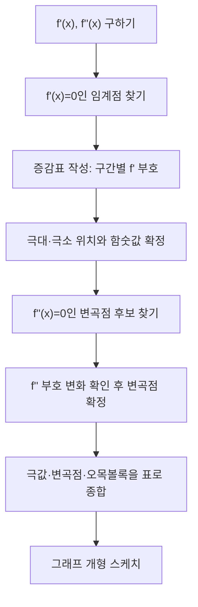

<Callout type="info">
  **이번 문서의 목표:** 이 파일을 다 읽으면 곱과 몫으로 이루어진 함수를 미분하고, 증감표를 스스로 그려 극값·변곡점을 판정하고, 그래프의 개형을 정확히 스케치하며, 관련 속도·최대최소 응용 문제를 실수 없이 풀 수 있다.
</Callout>

## 지난 편 복습: 왜 미분 "계산 절차"가 따로 필요한가

13편에서 미분계수(微分係數, derivative)의 정의와 다항함수·지수함수·로그함수·삼각함수의 기본 미분 공식, 그리고 합성함수를 미분하는 연쇄법칙(chain rule)까지 배웠다. 그런데 시험에 나오는 함수는 $x^2 \sin x$처럼 두 함수가 곱해져 있거나 $\dfrac{x^2+1}{x-1}$처럼 나뉘어 있는 경우가 훨씬 많다. 이런 함수는 기본 공식만으로는 바로 미분할 수 없다. 이번 편은 **곱과 몫을 미분하는 절차**, 미분을 여러 번 반복하는 **고차미분**, 그리고 미분값의 부호만으로 **곡선의 모양을 통째로 읽어내는 절차**(증가·감소, 극값, 변곡점, 그래프 개형)를 다룬다. 마지막으로 이 절차를 실제 상황(속도, 최대·최소)에 적용하는 응용까지 간다.

## 곱의 미분법 (product rule)

> **쉽게 말하면:** 두 함수를 곱한 것을 미분할 때는 "앞 미분 곱 뒤 그대로 + 앞 그대로 곱 뒤 미분"으로 두 항을 더한다.

### 왜 필요한가

$f(x) = x^2 \sin x$를 미분하고 싶다고 하자. $x^2$의 미분은 $2x$, $\sin x$의 미분은 $\cos x$라는 것은 이미 안다. 그런데 $f'(x)$가 단순히 $2x \cdot \cos x$는 아니다. 두 함수가 곱해진 상태로 동시에 변하기 때문에, 각 함수가 따로 변하는 효과를 **둘 다** 더해줘야 한다.

### 정의와 공식

두 함수 $f(x)$와 $g(x)$가 모두 미분 가능할 때, 곱 $f(x)g(x)$의 도함수는 다음과 같다.

$$
(fg)'(x) = f'(x)g(x) + f(x)g'(x)
$$

- $f'(x)$: $f$를 미분한 함수(도함수)
- $g(x)$: $g$를 그대로 둔 함수
- $f(x)$: $f$를 그대로 둔 함수
- $g'(x)$: $g$를 미분한 함수

> **비유:** 가로 길이 $f$, 세로 길이 $g$인 직사각형의 넓이가 $fg$다. 가로와 세로가 동시에 조금씩 늘어난다면, 넓이의 증가량은 "가로가 늘어난 만큼 곱하기 원래 세로"와 "원래 가로 곱하기 세로가 늘어난 만큼"을 더한 것과 같다. 이 두 조각의 합이 곱의 미분 공식이다.

### 계산 예시

$f(x) = x^2 \sin x$를 미분하자. $u = x^2$, $v = \sin x$로 두면 $u' = 2x$, $v' = \cos x$다.

$$
f'(x) = 2x \sin x + x^2 \cos x
$$

- $2x \sin x$: $u$를 미분하고 $v$는 그대로 둔 항
- $x^2 \cos x$: $u$는 그대로 두고 $v$를 미분한 항

**검산.** 곱의 미분법이 맞는지 확인하는 가장 확실한 방법은 정의(미분계수의 극한 정의)로 되짚는 것이지만, 시험 상황에서는 특정 값 하나를 대입해 좌우가 같은 값을 내는지 확인하는 것으로 충분한 안전장치가 된다. $x = 0$을 대입하면 $f'(0) = 2(0)\sin 0 + 0^2 \cos 0 = 0$이다. 원래 함수 $f(x) = x^2 \sin x$는 $x=0$ 근처에서 $x^2$에 눌려 매우 완만하게 $0$에서 출발하므로, 접선의 기울기가 $0$이라는 결과는 그래프의 모양과 어긋나지 않는다.

## 몫의 미분법 (quotient rule)

> **쉽게 말하면:** 분수 함수를 미분할 때는 "(분자 미분 곱 분모 − 분자 곱 분모 미분)을 분모 제곱으로 나눈다."

### 정의와 공식

$$
\left( \frac{f}{g} \right)'(x) = \frac{f'(x)g(x) - f(x)g'(x)}{[g(x)]^2} \quad (g(x) \neq 0)
$$

- 분자의 순서가 중요하다. $f'g - fg'$이지 $fg' - f'g$가 아니다 — 부호를 반대로 쓰는 것이 가장 흔한 실수다.
- 분모는 원래 분모를 **제곱**한 것이다.
- $g(x) \neq 0$인 구간에서만 성립한다. $g(x)=0$이 되는 지점은 애초에 $f/g$가 정의되지 않으므로 정의역에서 제외한다.

### 계산 예시

$f(x) = \dfrac{x^2+1}{x-1}$을 미분하자. 분자를 $u = x^2+1$, 분모를 $v = x-1$로 두면 $u' = 2x$, $v' = 1$이다.

$$
f'(x) = \frac{2x(x-1) - (x^2+1)(1)}{(x-1)^2}
$$

분자를 전개해 정리한다.

$$
f'(x) = \frac{2x^2 - 2x - x^2 - 1}{(x-1)^2} = \frac{x^2 - 2x - 1}{(x-1)^2}
$$

**검산 — 다른 방법으로 같은 답이 나오는지 확인.** 분수를 먼저 나눗셈으로 정리한 뒤 미분하면 몫의 미분법 없이도 같은 함수를 미분할 수 있다. $x^2+1$을 $x-1$로 나누면 몫이 $x+1$이고 나머지가 $2$다. 즉 $x^2+1 = (x-1)(x+1) + 2$이므로

$$
f(x) = x+1 + \frac{2}{x-1}
$$

이 식을 항별로 미분하면 $\dfrac{2}{x-1} = 2(x-1)^{-1}$의 미분은 $-2(x-1)^{-2}$이므로

$$
f'(x) = 1 - \frac{2}{(x-1)^2} = \frac{(x-1)^2 - 2}{(x-1)^2}
$$

분자를 전개하면 $(x-1)^2 - 2 = x^2 - 2x + 1 - 2 = x^2 - 2x - 1$이 되어, 몫의 미분법으로 구한 결과 $\dfrac{x^2-2x-1}{(x-1)^2}$와 **정확히 일치**한다. 이렇게 서로 다른 두 경로로 같은 결과가 나오면 계산이 맞다고 확신할 수 있다.

## 고차미분 (higher-order derivative)

> **쉽게 말하면:** 미분한 결과를 다시 한번 미분하면 2차미분, 또 한번 미분하면 3차미분이다. 미분을 반복하는 것뿐이다.

### 표기법

- $f'(x)$: 1차미분(도함수)
- $f''(x)$: 2차미분($f'$을 한 번 더 미분한 것)
- $f'''(x)$: 3차미분
- $f^{(n)}(x)$: $n$차미분 (프라임을 4개 이상 찍기 번거로울 때 괄호 숫자로 표기)

라이프니츠(Leibniz) 표기로는 $\dfrac{d^2y}{dx^2}$가 2차미분에 대응한다. 분모의 $dx^2$는 "$x$로 두 번 미분했다"는 뜻이지 $x$를 제곱했다는 뜻이 아니다.

### 계산 예시

$f(x) = x^3 - 3x^2 + 2$를 예로 들어, 이 함수는 이후 증가·감소·극값·변곡점을 다루는 절 전체에서 계속 재사용할 **기준 함수**다.

$$
f'(x) = 3x^2 - 6x
$$

$f'(x)$를 다시 미분한다.

$$
f''(x) = 6x - 6
$$

$f''(x)$를 다시 미분한다.

$$
f'''(x) = 6
$$

상수 $6$을 한 번 더 미분하면 $f^{(4)}(x) = 0$이 되고, 그 뒤로는 계속 $0$이다. 다항함수는 차수만큼 미분하면 상수가 되고, 그 다음부터는 전부 $0$이 되는 것이 특징이다.

### 2차미분의 의미: 오목·볼록

1차미분 $f'$의 부호는 함수가 증가하는지 감소하는지를 알려준다. 2차미분 $f''$의 부호는 그래프가 **위로 볼록(concave up, 오목)한지 아래로 볼록(concave down, 볼록)한지**를 알려준다. $f''(x) > 0$이면 그래프가 국그릇처럼 아래에서 위로 휘어지고(위로 오목), $f''(x) < 0$이면 산봉우리처럼 아래로 휘어진다(아래로 볼록). 이 성질은 뒤에서 변곡점을 판정할 때 그대로 쓰인다.

## 증가·감소 판정과 증감표 작성법

> **쉽게 말하면:** $f'(x)$의 부호가 양수인 구간에서는 함수가 증가하고, 음수인 구간에서는 감소한다. 이 부호를 표로 정리한 것이 증감표다.

### 원리

함수 $f$가 어떤 구간에서 미분 가능하고 그 구간에서 $f'(x) > 0$이면, 그 구간에서 $x$가 커질수록 $f(x)$도 커진다(증가). 반대로 $f'(x) < 0$이면 $x$가 커질수록 $f(x)$는 작아진다(감소). 미분계수는 접선의 기울기이므로, 기울기가 양수면 오른쪽으로 갈수록 위로 올라가고 음수면 내려간다는 직관과 정확히 일치한다.

### 증감표를 만드는 절차

기준 함수 $f(x) = x^3 - 3x^2 + 2$의 증감표를 실제로 만들어보자.

<Steps>

1. **$f'(x)$를 구한다.** $f'(x) = 3x^2 - 6x$
2. **$f'(x) = 0$이 되는 $x$를 찾는다(임계점, critical point).** $3x^2 - 6x = 3x(x-2) = 0$이므로 $x = 0$ 또는 $x = 2$
3. **임계점을 기준으로 실수축을 구간으로 나눈다.** $x < 0$, $0 < x < 2$, $x > 2$의 세 구간
4. **각 구간에서 대표값을 하나씩 뽑아 $f'$의 부호를 확인한다.** $x=-1$: $f'(-1) = 3(1) - 6(-1) = 3+6 = 9 > 0$. $x=1$: $f'(1) = 3(1) - 6(1) = -3 < 0$. $x=3$: $f'(3) = 3(9) - 6(3) = 27-18 = 9 > 0$
5. **부호를 표로 정리하고, 부호에 따라 화살표(증가는 위쪽 화살표, 감소는 아래쪽 화살표)를 붙인다.**

</Steps>

| 구간 | $x < 0$ | $x = 0$ | $0 < x < 2$ | $x = 2$ | $x > 2$ |
|------|---------|---------|-------------|---------|---------|
| $f'(x)$의 부호 | $+$ | $0$ | $-$ | $0$ | $+$ |
| $f(x)$의 증감 | 증가 | 극대 | 감소 | 극소 | 증가 |

증감표를 읽으면: $f$는 $x=0$까지 증가하다가 $x=0$에서 방향을 꺾어 $x=2$까지 감소하고, $x=2$에서 다시 방향을 꺾어 증가한다. 부호가 $+$에서 $-$로 바뀌는 지점($x=0$)이 **극대**이고, $-$에서 $+$로 바뀌는 지점($x=2$)이 **극소**다.

## 극값 판정: 1차 판정법과 2차 판정법

> **쉽게 말하면:** 극값(극대·극소)을 찾는 방법은 두 가지다. 증감표의 부호 변화를 보거나(1차 판정법), 2차미분의 부호를 바로 확인하거나(2차 판정법).

### 극값의 정의

**극대**(local maximum)는 그 점 근처에서 함숫값이 가장 큰 점, **극소**(local minimum)는 그 점 근처에서 함숫값이 가장 작은 점이다. "근처에서"라는 조건이 핵심이다 — 극대라고 해서 함수 전체에서 가장 큰 값(최댓값)이라는 뜻은 아니다. 예를 들어 $x=0$에서 극대라도, 더 멀리 있는 $x=10$에서 함숫값이 더 클 수 있다.

### 1차 판정법 (first derivative test)

증감표에서 $f'$의 부호가 **양수 → 음수**로 바뀌는 지점이 극대, **음수 → 양수**로 바뀌는 지점이 극소다. 기준 함수의 증감표를 그대로 읽으면 $x=0$은 극대, $x=2$는 극소다.

함숫값을 직접 계산해보자.

$$
f(0) = 0^3 - 3(0)^2 + 2 = 2
$$

$$
f(2) = 2^3 - 3(2)^2 + 2 = 8 - 12 + 2 = -2
$$

따라서 **극댓값은 $f(0) = 2$**, **극솟값은 $f(2) = -2$**다.

### 2차 판정법 (second derivative test)

$f'(a) = 0$인 지점 $a$에서, $f''(a) > 0$이면 그 점은 극소이고 $f''(a) < 0$이면 극대다(아래로 볼록한 바닥이면 극소, 위로 볼록한 꼭대기면 극대라는 직관 그대로다). $f''(a) = 0$이면 이 판정법으로는 알 수 없고 1차 판정법으로 돌아가야 한다.

기준 함수에서 $f''(x) = 6x-6$이므로,

$$
f''(0) = 6(0) - 6 = -6 < 0
$$

$f''(0) < 0$이므로 $x=0$은 극대다. 1차 판정법의 결론과 **정확히 일치**한다.

$$
f''(2) = 6(2) - 6 = 6 > 0
$$

$f''(2) > 0$이므로 $x=2$는 극소다. 이 역시 1차 판정법과 일치한다. 두 판정법이 서로 다른 경로로 같은 결론을 내렸으므로 계산이 맞다는 확신을 얻는다.

## 변곡점 판정 (inflection point)

> **쉽게 말하면:** 변곡점은 그래프가 오목에서 볼록으로, 또는 볼록에서 오목으로 휘어지는 방향이 바뀌는 지점이다.

### 정의와 판정 절차

변곡점은 $f''(x)$의 부호가 바뀌는 지점이다. 후보를 찾는 절차는 극값 판정과 매우 비슷하다.

<Steps>

1. **$f''(x) = 0$이 되는 $x$를 찾는다.** $f''(x) = 6x - 6 = 0 \Rightarrow x = 1$
2. **$x=1$ 좌우에서 $f''$의 부호를 확인한다.** $x=0$: $f''(0) = -6 < 0$. $x=2$: $f''(2) = 6 > 0$
3. **부호가 실제로 바뀌는지 확인한다.** 음수에서 양수로 바뀌었으므로 $x=1$은 변곡점이 맞다
4. **변곡점의 $y$좌표를 구한다.** $f(1) = 1 - 3 + 2 = 0$

</Steps>

**주의:** $f''(x) = 0$이라고 해서 무조건 변곡점인 것은 아니다. $f''$의 부호가 실제로 바뀌는지 반드시 확인해야 한다(예: $f(x) = x^4$은 $f''(0)=0$이지만 좌우 모두 $f''>0$이라 부호가 바뀌지 않으므로 변곡점이 아니다). 따라서 변곡점은 **$(1, 0)$**이다.

## 그래프 개형 스케치

> **쉽게 말하면:** 지금까지 구한 정보(증가·감소, 극값, 오목·볼록, 변곡점)를 한 그림에 모으면 그래프를 직접 계산하지 않고도 정확한 모양을 그릴 수 있다.

기준 함수 $f(x) = x^3 - 3x^2 + 2$에 대해 지금까지 구한 정보를 모으면 다음과 같다.

| 구간·지점 | 증가·감소 | 오목·볼록 | 비고 |
|-----------|-----------|-----------|------|
| $x < 0$ | 증가 | 아래로 볼록($f''<0$) | |
| $x = 0$ | 극대, $f(0)=2$ | | 극대점 $(0, 2)$ |
| $0 < x < 1$ | 감소 | 아래로 볼록 | |
| $x = 1$ | 감소 중 | 방향 전환 | 변곡점 $(1, 0)$ |
| $1 < x < 2$ | 감소 | 위로 볼록($f''>0$) | |
| $x = 2$ | 극소, $f(2)=-2$ | | 극소점 $(2, -2)$ |
| $x > 2$ | 증가 | 위로 볼록 | |

이 표를 그대로 따라가면: 왼쪽 멀리서 아래에서 올라오다가 $(0,2)$에서 봉우리를 만들고, $(1,0)$을 지나며 휘어지는 방향이 바뀌고, $(2,-2)$에서 골짜기를 만든 뒤 다시 오른쪽 위로 올라가는 3차함수 특유의 S자형 곡선이 된다.

## 관련 속도 응용 (related rates)

> **쉽게 말하면:** 서로 관련된 두 양(예: 반지름과 부피)이 동시에 시간에 따라 변할 때, 한 양의 변화 속도를 알면 다른 양의 변화 속도를 구할 수 있다.

### 문제

구형 풍선(공 모양 풍선)에 공기를 넣고 있다. 부피가 초당 $100\text{cm}^3$의 속도로 늘어나고 있을 때, 반지름이 $10\text{cm}$가 되는 순간 반지름은 초당 얼마의 속도로 늘어나는가?

### 풀이 절차

<Steps>

1. **관련된 두 양을 식으로 연결한다.** 구의 부피 공식은 $V = \dfrac{4}{3}\pi r^3$ ($V$는 부피, $r$은 반지름, $\pi$는 파이(원주율))
2. **양변을 시간 $t$에 대해 미분한다(연쇄법칙 사용).** $\dfrac{dV}{dt} = 4\pi r^2 \dfrac{dr}{dt}$
3. **문제에서 주어진 값을 대입한다.** $\dfrac{dV}{dt} = 100$, $r = 10$
4. **미지수 $\dfrac{dr}{dt}$에 대해 정리해 계산한다.**

</Steps>

$$
100 = 4\pi (10)^2 \frac{dr}{dt}
$$

$$
100 = 400\pi \cdot \frac{dr}{dt}
$$

$$
\frac{dr}{dt} = \frac{100}{400\pi} = \frac{1}{4\pi}
$$

$\dfrac{1}{4\pi} \approx \dfrac{1}{12.566} \approx 0.0796$이므로, 반지름은 초당 약 $0.08\text{cm}$의 속도로 늘어난다.

**결과 해석.** 부피는 일정한 속도($100\text{cm}^3$/초)로 늘어나지만, 반지름이 커질수록 겉넓이($4\pi r^2$)가 커지므로 같은 부피 증가량이 반지름에는 점점 더 적은 변화로 나타난다. 즉 풍선이 커질수록 반지름이 늘어나는 속도는 점점 느려진다 — $\dfrac{dr}{dt} = \dfrac{100}{4\pi r^2}$에서 $r$이 커지면 분모가 커지므로 값이 작아지는 것으로 확인된다.

## 최대·최소 응용 (optimization)

> **쉽게 말하면:** 조건이 걸린 상황에서 어떤 양을 최대(또는 최소)로 만드는 값을 찾을 때도 증감표·극값 판정을 그대로 쓴다.

### 문제

둘레가 $100\text{m}$인 직사각형 울타리를 만들 때, 넓이를 최대로 하는 가로·세로 길이와 그때의 최대 넓이를 구하라.

### 풀이 절차

<Steps>

1. **변수를 정하고 조건식을 세운다.** 가로를 $x$, 세로를 $y$라 하면 둘레 조건은 $2x + 2y = 100$
2. **조건식으로 한 변수를 다른 변수로 표현해, 목적식을 한 변수만의 함수로 만든다.** $y = 50 - x$이므로 넓이 $A(x) = xy = x(50-x) = 50x - x^2$
3. **목적식을 미분해 임계점을 찾는다.** $A'(x) = 50 - 2x$, $A'(x)=0 \Rightarrow x = 25$
4. **2차 판정법으로 최댓값인지 확인한다.** $A''(x) = -2 < 0$이므로 $x=25$는 극대(이 문제에서는 정의역 $0<x<50$ 전체에서 유일한 임계점이므로 최댓값이기도 하다)
5. **다른 변수와 목적값을 계산한다.** $y = 50-25=25$, $A(25) = 25 \times 25 = 625$

</Steps>

따라서 **가로 $25\text{m}$, 세로 $25\text{m}$인 정사각형일 때 넓이가 최대 $625\text{m}^2$**가 된다. 둘레가 고정된 직사각형 중에서는 정사각형의 넓이가 가장 크다는, 도형에서 익숙한 결과가 미분으로도 정확히 재현된다.

**검산.** $x=20$일 때 $A(20) = 20 \times 30 = 600$, $x=25$일 때 $A(25)=625$, $x=30$일 때 $A(30) = 30\times20=600$으로, $x=25$ 양옆의 값이 모두 $625$보다 작다. 극댓값이 실제로 주변보다 크다는 것이 직접 확인된다.

## 자주 틀리는 점

- **몫의 미분법에서 분자 순서를 거꾸로 쓴다.** $f'g - fg'$이 맞고, $fg' - f'g$로 쓰면 부호가 반대로 나온다. "미분되는 애가 먼저"라고 순서를 외워둔다.
- **$f'(x)=0$인 점을 전부 극값이라고 단정한다.** $f'(a)=0$은 극값의 **후보**일 뿐이다. 실제 부호가 바뀌는지(1차 판정법) 또는 $f''(a)\neq 0$인지(2차 판정법)를 반드시 확인해야 한다. 예를 들어 $f(x)=x^3$은 $f'(0)=0$이지만 $x=0$ 좌우에서 $f'$이 모두 양수라 극값이 아니다.
- **$f''(a)=0$을 무조건 변곡점이라고 단정한다.** 부호가 실제로 바뀌는지 확인하지 않으면 틀린다.
- **정의역을 고려하지 않고 증감표를 그린다.** 분모가 $0$이 되는 지점, 근호 안이 음수가 되는 지점처럼 애초에 정의되지 않는 $x$값은 증감표의 구간에서 제외해야 한다.
- **최대·최소 응용에서 임계점만 구하고 정의역 끝점(경계)을 확인하지 않는다.** 정의역이 닫힌 구간이면 양 끝점의 함숫값도 비교 대상에 넣어야 한다.

## 핵심 정리

- 곱의 미분법: $(fg)' = f'g+fg'$, 몫의 미분법: $(f/g)' = \dfrac{f'g-fg'}{g^2}$이며, 서로 다른 방법(예: 나눗셈 정리 후 미분)으로 재계산해 검산하는 습관을 들인다.
- 고차미분은 미분을 반복하는 것이며, $f''$의 부호는 오목·볼록을 결정한다.
- 증감표는 (1) $f'$ 구하기 → (2) $f'=0$인 임계점 찾기 → (3) 구간 나누기 → (4) 대표값으로 부호 확인 → (5) 표로 정리, 다섯 단계로 만든다.
- 극값은 1차 판정법(부호 변화)과 2차 판정법($f''$의 부호) 두 가지로 교차 검증할 수 있다.
- 변곡점은 $f''=0$ 후보 중 실제로 부호가 바뀌는 지점만 인정한다.
- 관련 속도와 최대·최소 응용 모두, 결국은 변수 사이의 관계식을 세우고 미분해 임계점을 찾는 같은 절차를 따른다.

## 마무리 복습

<Quiz
  questionNumber={1}
  question="f(x) = x^2 cos x를 곱의 미분법으로 미분한 결과로 옳은 것은?"
  options={['2x cos x - x^2 sin x', '2x cos x + x^2 sin x', '2x sin x - x^2 cos x', '-2x sin x']}
  correctAnswer={1}
  explanation="곱의 미분법 (fg)'=f'g+fg'에서 f=x^2, g=cos x로 두면 f'=2x, g'=-sin x이다. 따라서 f'g+fg' = 2x cos x + x^2(-sin x) = 2x cos x - x^2 sin x가 된다."
  optionExplanations={['f 미분×g + f×g 미분을 정확히 적용한 결과다.', 'g의 미분인 -sin x의 부호를 빠뜨려 더하기로 처리한 오답이다.', 'f와 g의 역할을 바꿔 계산한 오답이다.', '곱의 미분법 대신 각 함수를 따로 미분해 곱한 잘못된 접근이다.']}
/>

<Quiz
  questionNumber={2}
  question="f(x) = x/(x+1)을 몫의 미분법으로 미분하면?"
  options={['1/(x+1)^2', '-1/(x+1)^2', 'x/(x+1)^2', '1/(x+1)']}
  correctAnswer={1}
  explanation="몫의 미분법 (f/g)'=(f'g-fg')/g^2에서 f=x, g=x+1이므로 f'=1, g'=1이다. 분자는 1*(x+1) - x*1 = x+1-x = 1이 되어 결과는 1/(x+1)^2이다."
  optionExplanations={['분자가 (x+1)-x=1로 정리되는 것을 정확히 계산한 결과다.', '분자 계산에서 부호를 반대로 처리한 오답이다.', '분자를 정리하지 않고 x를 그대로 남긴 오답이다.', '분모를 제곱하지 않은 오답이다.']}
/>

<Quiz
  questionNumber={3}
  question="f(x) = x^3 - 3x^2 + 2에서 극댓값과 극솟값을 순서대로 짝지은 것은?"
  options={['극댓값 2(x=0), 극솟값 -2(x=2)', '극댓값 -2(x=2), 극솟값 2(x=0)', '극댓값 0(x=1), 극솟값 -2(x=2)', '극댓값 2(x=0), 극솟값 0(x=1)']}
  correctAnswer={1}
  explanation="f'(x)=3x^2-6x=3x(x-2)=0에서 x=0, 2가 임계점이다. 증감표로 부호를 확인하면 x=0에서 +에서 -로 바뀌어 극대이고 f(0)=2, x=2에서 -에서 +로 바뀌어 극소이고 f(2)=8-12+2=-2이다."
  optionExplanations={['증감표의 부호 변화를 정확히 반영한 결과다.', '극대와 극소를 서로 바꿔 답한 오답이다.', 'x=1은 변곡점이지 극값이 아니므로 틀렸다.', '극솟값 위치와 값을 잘못 계산한 오답이다.']}
/>

<Quiz
  questionNumber={4}
  question="f(x) = x^3 - 3x^2 + 2의 변곡점은?"
  options={['(1, 0)', '(0, 2)', '(2, -2)', '(1, -1)']}
  correctAnswer={1}
  explanation="f''(x)=6x-6=0에서 x=1이 후보이고, x=0에서 f''(0)=-6으로 음수, x=2에서 f''(2)=6으로 양수가 되어 부호가 실제로 바뀌므로 x=1은 변곡점이다. f(1)=1-3+2=0이므로 변곡점은 (1,0)이다."
  optionExplanations={['부호가 바뀌는 지점의 좌표를 정확히 계산한 결과다.', '이는 극댓값이 나오는 점이지 변곡점이 아니다.', '이는 극솟값이 나오는 점이지 변곡점이 아니다.', 'x좌표는 맞지만 f(1) 계산이 틀렸다.']}
/>

<Quiz
  questionNumber={5}
  question="구형 풍선의 부피가 초당 100cm^3로 늘어날 때, 반지름이 10cm인 순간 반지름의 증가 속도 dr/dt는? (V=4/3 파이 r^3)"
  options={['1/(4파이) cm/s', '1/(40파이) cm/s', '4파이 cm/s', '10/파이 cm/s']}
  correctAnswer={1}
  explanation="dV/dt=4파이r^2(dr/dt)에 dV/dt=100, r=10을 대입하면 100=400파이(dr/dt)이므로 dr/dt=100/(400파이)=1/(4파이)이다."
  optionExplanations={['식을 올바르게 세우고 정리한 결과다.', '분모 계산에서 자릿수를 잘못 옮긴 오답이다.', 'dV/dt와 dr/dt의 관계식을 뒤집어 계산한 오답이다.', 'r의 제곱을 반영하지 않은 오답이다.']}
/>

<Quiz
  questionNumber={6}
  question="둘레가 100m인 직사각형 중 넓이를 최대로 하는 가로 x, 세로 y의 값은?"
  options={['x=25, y=25', 'x=50, y=0', 'x=20, y=30', 'x=10, y=40']}
  correctAnswer={1}
  explanation="A(x)=x(50-x)=50x-x^2를 미분하면 A'(x)=50-2x이고 A'(x)=0에서 x=25이다. A''(x)=-2로 음수이므로 극대이며 y=50-25=25이다. 즉 정사각형일 때 넓이가 최대가 된다."
  optionExplanations={['임계점을 구하고 2차 판정법으로 확인한 정답이다.', 'y=0이면 넓이가 0이 되어 최대가 아니다.', 'A(20)=600으로 A(25)=625보다 작다.', 'A(10)=400으로 최댓값이 아니다.']}
/>

<Quiz
  questionNumber={7}
  question="증감표에서 f'(x)의 부호가 음수에서 양수로 바뀌는 지점은 무엇을 의미하는가?"
  options={['극소', '극대', '변곡점', '수직점근선']}
  correctAnswer={1}
  explanation="f'의 부호가 음수(감소)에서 양수(증가)로 바뀌면 함수가 내려가다가 다시 올라가는 골짜기 모양이 되므로 그 지점은 극소다."
  optionExplanations={['부호가 음에서 양으로 바뀌는 지점이 바로 극소의 정의이므로 정답이다.', '극대는 반대로 양에서 음으로 바뀌는 지점이다.', '변곡점은 이차미분의 부호가 바뀌는 지점으로 일차미분의 부호와는 별개다.', '수직점근선은 미분과 직접 관련 없는 정의역 문제다.']}
/>

## 참고 자료

- [고등학교 미적분 공식·개념 정리 자료](https://mathworld.wolfram.com) — 미분법(곱·몫의 미분), 고차미분, 극값·변곡점 판정 기법을 체계적으로 재구성하는 데 참고
- [미적분 I 교재 요약: 미분계수 정의와 기하적 의미](https://www.itl.nist.gov/div898/handbook/) — 미분의 기하적 의미와 함수 개형 분석의 기초 개념 확인에 참고
