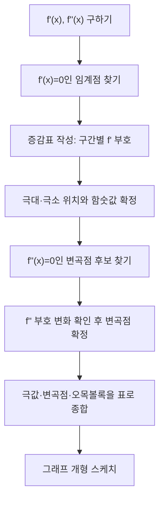

## 지난 편 복습: 왜 미분 "계산 절차"가 따로 필요한가

13편에서 미분계수(微分係數, derivative)의 정의와 다항함수·지수함수·로그함수·삼각함수의 기본 미분 공식, 그리고 합성함수를 미분하는 연쇄법칙(chain rule)까지 배웠다. 그런데 시험에 나오는 함수는 $x^2 \sin x$처럼 두 함수가 곱해져 있거나 $\dfrac{x^2+1}{x-1}$처럼 나뉘어 있는 경우가 훨씬 많다.

## 곱의 미분법 (product rule)

### 정의와 공식

두 함수 $f(x)$와 $g(x)$가 모두 미분 가능할 때, 곱 $f(x)g(x)$의 도함수는 다음과 같다.

$$
(fg)'(x) = f'(x)g(x) + f(x)g'(x)
$$

- $f'(x)$: $f$를 미분한 함수(도함수)
- $g(x)$: $g$를 그대로 둔 함수
- $f(x)$: $f$를 그대로 둔 함수
- $g'(x)$: $g$를 미분한 함수

### 계산 예시

$f(x) = x^2 \sin x$를 미분하자. $u = x^2$, $v = \sin x$로 두면 $u' = 2x$, $v' = \cos x$다.

$$
f'(x) = 2x \sin x + x^2 \cos x
$$

- $2x \sin x$: $u$를 미분하고 $v$는 그대로 둔 항
- $x^2 \cos x$: $u$는 그대로 두고 $v$를 미분한 항

**검산.** 곱의 미분법이 맞는지 확인하는 가장 확실한 방법은 정의(미분계수의 극한 정의)로 되짚는 것이지만, 시험 상황에서는 특정 값 하나를 대입해 좌우가 같은 값을 내는지 확인하는 것으로 충분한 안전장치가 된다. $x = 0$을 대입하면 $f'(0) = 2(0)\sin 0 + 0^2 \cos 0 = 0$이다.

## 몫의 미분법 (quotient rule)

### 정의와 공식

$$
\left( \frac{f}{g} \right)'(x) = \frac{f'(x)g(x) - f(x)g'(x)}{[g(x)]^2} \quad (g(x) \neq 0)
$$

- 분자의 순서가 중요하다. $f'g - fg'$이지 $fg' - f'g$가 아니다 — 부호를 반대로 쓰는 것이 가장 흔한 실수다.
- 분모는 원래 분모를 **제곱**한 것이다.
- $g(x) \neq 0$인 구간에서만 성립한다. $g(x)=0$이 되는 지점은 애초에 $f/g$가 정의되지 않으므로 정의역에서 제외한다.

### 계산 예시

$f(x) = \dfrac{x^2+1}{x-1}$을 미분하자. 분자를 $u = x^2+1$, 분모를 $v = x-1$로 두면 $u' = 2x$, $v' = 1$이다.

$$
f'(x) = \frac{2x(x-1) - (x^2+1)(1)}{(x-1)^2}
$$

분자를 전개해 정리한다.

$$
f'(x) = \frac{2x^2 - 2x - x^2 - 1}{(x-1)^2} = \frac{x^2 - 2x - 1}{(x-1)^2}
$$

**검산 — 다른 방법으로 같은 답이 나오는지 확인.** 분수를 먼저 나눗셈으로 정리한 뒤 미분하면 몫의 미분법 없이도 같은 함수를 미분할 수 있다. $x^2+1$을 $x-1$로 나누면 몫이 $x+1$이고 나머지가 $2$다. 즉 $x^2+1 = (x-1)(x+1) + 2$이므로

$$
f(x) = x+1 + \frac{2}{x-1}
$$

이 식을 항별로 미분하면 $\dfrac{2}{x-1} = 2(x-1)^{-1}$의 미분은 $-2(x-1)^{-2}$이므로

$$
f'(x) = 1 - \frac{2}{(x-1)^2} = \frac{(x-1)^2 - 2}{(x-1)^2}
$$

분자를 전개하면 $(x-1)^2 - 2 = x^2 - 2x + 1 - 2 = x^2 - 2x - 1$이 되어, 몫의 미분법으로 구한 결과 $\dfrac{x^2-2x-1}{(x-1)^2}$와 **정확히 일치**한다. 이렇게 서로 다른 두 경로로 같은 결과가 나오면 계산이 맞다고 확신할 수 있다.

## 고차미분 (higher-order derivative)

### 표기법

- $f'(x)$: 1차미분(도함수)
- $f''(x)$: 2차미분($f'$을 한 번 더 미분한 것)
- $f'''(x)$: 3차미분
- $f^{(n)}(x)$: $n$차미분 (프라임을 4개 이상 찍기 번거로울 때 괄호 숫자로 표기)

라이프니츠(Leibniz) 표기로는 $\dfrac{d^2y}{dx^2}$가 2차미분에 대응한다. 분모의 $dx^2$는 "$x$로 두 번 미분했다"는 뜻이지 $x$를 제곱했다는 뜻이 아니다.

### 계산 예시

$f(x) = x^3 - 3x^2 + 2$를 예로 들어, 이 함수는 이후 증가·감소·극값·변곡점을 다루는 절 전체에서 계속 재사용할 **기준 함수**다.

$$
f'(x) = 3x^2 - 6x
$$

$f'(x)$를 다시 미분한다.

$$
f''(x) = 6x - 6
$$

$f''(x)$를 다시 미분한다.

$$
f'''(x) = 6
$$

상수 $6$을 한 번 더 미분하면 $f^{(4)}(x) = 0$이 되고, 그 뒤로는 계속 $0$이다. 다항함수는 차수만큼 미분하면 상수가 되고, 그 다음부터는 전부 $0$이 되는 것이 특징이다.

### 2차미분의 의미: 오목·볼록

1차미분 $f'$의 부호는 함수가 증가하는지 감소하는지를 알려준다. 2차미분 $f''$의 부호는 그래프가 **위로 볼록(concave up, 오목)한지 아래로 볼록(concave down, 볼록)한지**를 알려준다.

## 증가·감소 판정과 증감표 작성법

### 원리

함수 $f$가 어떤 구간에서 미분 가능하고 그 구간에서 $f'(x) > 0$이면, 그 구간에서 $x$가 커질수록 $f(x)$도 커진다(증가). 반대로 $f'(x) < 0$이면 $x$가 커질수록 $f(x)$는 작아진다(감소).

### 증감표를 만드는 절차

기준 함수 $f(x) = x^3 - 3x^2 + 2$의 증감표를 실제로 만들어보자.

| 구간 | $x < 0$ | $x = 0$ | $0 < x < 2$ | $x = 2$ | $x > 2$ |
|------|---------|---------|-------------|---------|---------|
| $f'(x)$의 부호 | $+$ | $0$ | $-$ | $0$ | $+$ |
| $f(x)$의 증감 | 증가 | 극대 | 감소 | 극소 | 증가 |

증감표를 읽으면: $f$는 $x=0$까지 증가하다가 $x=0$에서 방향을 꺾어 $x=2$까지 감소하고, $x=2$에서 다시 방향을 꺾어 증가한다. 부호가 $+$에서 $-$로 바뀌는 지점($x=0$)이 **극대**이고, $-$에서 $+$로 바뀌는 지점($x=2$)이 **극소**다.

## 극값 판정: 1차 판정법과 2차 판정법

### 극값의 정의

**극대**(local maximum)는 그 점 근처에서 함숫값이 가장 큰 점, **극소**(local minimum)는 그 점 근처에서 함숫값이 가장 작은 점이다. 예를 들어 $x=0$에서 극대라도, 더 멀리 있는 $x=10$에서 함숫값이 더 클 수 있다.

### 1차 판정법 (first derivative test)

증감표에서 $f'$의 부호가 **양수 → 음수**로 바뀌는 지점이 극대, **음수 → 양수**로 바뀌는 지점이 극소다. 기준 함수의 증감표를 그대로 읽으면 $x=0$은 극대, $x=2$는 극소다.

함숫값을 직접 계산해보자.

$$
f(0) = 0^3 - 3(0)^2 + 2 = 2
$$

$$
f(2) = 2^3 - 3(2)^2 + 2 = 8 - 12 + 2 = -2
$$

따라서 **극댓값은 $f(0) = 2$**, **극솟값은 $f(2) = -2$**다.

### 2차 판정법 (second derivative test)

$f'(a) = 0$인 지점 $a$에서, $f''(a) > 0$이면 그 점은 극소이고 $f''(a) < 0$이면 극대다(아래로 볼록한 바닥이면 극소, 위로 볼록한 꼭대기면 극대라는 직관 그대로다). $f''(a) = 0$이면 이 판정법으로는 알 수 없고 1차 판정법으로 돌아가야 한다.

기준 함수에서 $f''(x) = 6x-6$이므로,

$$
f''(0) = 6(0) - 6 = -6 < 0
$$

$f''(0) < 0$이므로 $x=0$은 극대다. 1차 판정법의 결론과 **정확히 일치**한다.

$$
f''(2) = 6(2) - 6 = 6 > 0
$$

$f''(2) > 0$이므로 $x=2$는 극소다. 이 역시 1차 판정법과 일치한다. 두 판정법이 서로 다른 경로로 같은 결론을 내렸으므로 계산이 맞다는 확신을 얻는다.

## 변곡점 판정 (inflection point)

### 정의와 판정 절차

변곡점은 $f''(x)$의 부호가 바뀌는 지점이다. 후보를 찾는 절차는 극값 판정과 매우 비슷하다.

**주의:** $f''(x) = 0$이라고 해서 무조건 변곡점인 것은 아니다. $f''$의 부호가 실제로 바뀌는지 반드시 확인해야 한다(예: $f(x) = x^4$은 $f''(0)=0$이지만 좌우 모두 $f''>0$이라 부호가 바뀌지 않으므로 변곡점이 아니다). 따라서 변곡점은 **$(1, 0)$**이다.

## 그래프 개형 스케치

기준 함수 $f(x) = x^3 - 3x^2 + 2$에 대해 지금까지 구한 정보를 모으면 다음과 같다.

| 구간·지점 | 증가·감소 | 오목·볼록 | 비고 |
|-----------|-----------|-----------|------|
| $x < 0$ | 증가 | 아래로 볼록($f''<0$) | |
| $x = 0$ | 극대, $f(0)=2$ | | 극대점 $(0, 2)$ |
| $0 < x < 1$ | 감소 | 아래로 볼록 | |
| $x = 1$ | 감소 중 | 방향 전환 | 변곡점 $(1, 0)$ |
| $1 < x < 2$ | 감소 | 위로 볼록($f''>0$) | |
| $x = 2$ | 극소, $f(2)=-2$ | | 극소점 $(2, -2)$ |
| $x > 2$ | 증가 | 위로 볼록 | |

이 표를 그대로 따라가면: 왼쪽 멀리서 아래에서 올라오다가 $(0,2)$에서 봉우리를 만들고, $(1,0)$을 지나며 휘어지는 방향이 바뀌고, $(2,-2)$에서 골짜기를 만든 뒤 다시 오른쪽 위로 올라가는 3차함수 특유의 S자형 곡선이 된다.

```mermaid
flowchart TD
    A["f'(x), f''(x) 구하기"] --> B["f'(x)=0인 임계점 찾기"]
    B --> C["증감표 작성: 구간별 f' 부호"]
    C --> D["극대·극소 위치와 함숫값 확정"]
    D --> E["f''(x)=0인 변곡점 후보 찾기"]
    E --> F["f'' 부호 변화 확인 후 변곡점 확정"]
    F --> G["극값·변곡점·오목볼록을 표로 종합"]
    G --> H["그래프 개형 스케치"]
```

## 관련 속도 응용 (related rates)

### 문제

구형 풍선(공 모양 풍선)에 공기를 넣고 있다. 부피가 초당 $100\text{cm}^3$의 속도로 늘어나고 있을 때, 반지름이 $10\text{cm}$가 되는 순간 반지름은 초당 얼마의 속도로 늘어나는가?

### 풀이 절차

$$
100 = 4\pi (10)^2 \frac{dr}{dt}
$$

$$
100 = 400\pi \cdot \frac{dr}{dt}
$$

$$
\frac{dr}{dt} = \frac{100}{400\pi} = \frac{1}{4\pi}
$$

$\dfrac{1}{4\pi} \approx \dfrac{1}{12.566} \approx 0.0796$이므로, 반지름은 초당 약 $0.08\text{cm}$의 속도로 늘어난다.

**결과 해석.** 부피는 일정한 속도($100\text{cm}^3$/초)로 늘어나지만, 반지름이 커질수록 겉넓이($4\pi r^2$)가 커지므로 같은 부피 증가량이 반지름에는 점점 더 적은 변화로 나타난다. 즉 풍선이 커질수록 반지름이 늘어나는 속도는 점점 느려진다 — $\dfrac{dr}{dt} = \dfrac{100}{4\pi r^2}$에서 $r$이 커지면 분모가 커지므로 값이 작아지는 것으로 확인된다.

## 최대·최소 응용 (optimization)

### 문제

둘레가 $100\text{m}$인 직사각형 울타리를 만들 때, 넓이를 최대로 하는 가로·세로 길이와 그때의 최대 넓이를 구하라.

### 풀이 절차

따라서 **가로 $25\text{m}$, 세로 $25\text{m}$인 정사각형일 때 넓이가 최대 $625\text{m}^2$**가 된다. 둘레가 고정된 직사각형 중에서는 정사각형의 넓이가 가장 크다는, 도형에서 익숙한 결과가 미분으로도 정확히 재현된다.

**검산.** $x=20$일 때 $A(20) = 20 \times 30 = 600$, $x=25$일 때 $A(25)=625$, $x=30$일 때 $A(30) = 30\times20=600$으로, $x=25$ 양옆의 값이 모두 $625$보다 작다. 극댓값이 실제로 주변보다 크다는 것이 직접 확인된다.

## 자주 틀리는 점

- **몫의 미분법에서 분자 순서를 거꾸로 쓴다.** $f'g - fg'$이 맞고, $fg' - f'g$로 쓰면 부호가 반대로 나온다. "미분되는 애가 먼저"라고 순서를 외워둔다.
- **$f'(x)=0$인 점을 전부 극값이라고 단정한다.** $f'(a)=0$은 극값의 **후보**일 뿐이다. 실제 부호가 바뀌는지(1차 판정법) 또는 $f''(a)\neq 0$인지(2차 판정법)를 반드시 확인해야 한다. 예를 들어 $f(x)=x^3$은 $f'(0)=0$이지만 $x=0$ 좌우에서 $f'$이 모두 양수라 극값이 아니다.
- **$f''(a)=0$을 무조건 변곡점이라고 단정한다.** 부호가 실제로 바뀌는지 확인하지 않으면 틀린다.
- **정의역을 고려하지 않고 증감표를 그린다.** 분모가 $0$이 되는 지점, 근호 안이 음수가 되는 지점처럼 애초에 정의되지 않는 $x$값은 증감표의 구간에서 제외해야 한다.

## 핵심 정리

- 곱의 미분법: $(fg)' = f'g+fg'$, 몫의 미분법: $(f/g)' = \dfrac{f'g-fg'}{g^2}$이며, 서로 다른 방법(예: 나눗셈 정리 후 미분)으로 재계산해 검산하는 습관을 들인다.
- 고차미분은 미분을 반복하는 것이며, $f''$의 부호는 오목·볼록을 결정한다.
- 증감표는 (1) $f'$ 구하기 → (2) $f'=0$인 임계점 찾기 → (3) 구간 나누기 → (4) 대표값으로 부호 확인 → (5) 표로 정리, 다섯 단계로 만든다.
- 극값은 1차 판정법(부호 변화)과 2차 판정법($f''$의 부호) 두 가지로 교차 검증할 수 있다.
- 변곡점은 $f''=0$ 후보 중 실제로 부호가 바뀌는 지점만 인정한다.
- 관련 속도와 최대·최소 응용 모두, 결국은 변수 사이의 관계식을 세우고 미분해 임계점을 찾는 같은 절차를 따른다.

## 마무리 복습

<Quiz
  questionNumber={1}
  question={"f(x) = x^2 cos x를 곱의 미분법으로 미분한 결과로 옳은 것은?"}
  options={["2x cos x - x^2 sin x","2x cos x + x^2 sin x","2x sin x - x^2 cos x","-2x sin x"]}
  correctAnswer={1}
  explanation={"곱의 미분법 (fg)'=f'g+fg'에서 f=x^2, g=cos x로 두면 f'=2x, g'=-sin x이다. 따라서 f'g+fg' = 2x cos x + x^2(-sin x) = 2x cos x - x^2 sin x가 된다."}
/>

<Quiz
  questionNumber={2}
  question={"f(x) = x/(x+1)을 몫의 미분법으로 미분하면?"}
  options={["1/(x+1)^2","-1/(x+1)^2","x/(x+1)^2","1/(x+1)"]}
  correctAnswer={1}
  explanation={"몫의 미분법 (f/g)'=(f'g-fg')/g^2에서 f=x, g=x+1이므로 f'=1, g'=1이다. 분자는 1*(x+1) - x*1 = x+1-x = 1이 되어 결과는 1/(x+1)^2이다."}
/>

<Quiz
  questionNumber={3}
  question={"f(x) = x^3 - 3x^2 + 2에서 극댓값과 극솟값을 순서대로 짝지은 것은?"}
  options={["극댓값 2(x=0), 극솟값 -2(x=2)","극댓값 -2(x=2), 극솟값 2(x=0)","극댓값 0(x=1), 극솟값 -2(x=2)","극댓값 2(x=0), 극솟값 0(x=1)"]}
  correctAnswer={1}
  explanation={"f'(x)=3x^2-6x=3x(x-2)=0에서 x=0, 2가 임계점이다. 증감표로 부호를 확인하면 x=0에서 +에서 -로 바뀌어 극대이고 f(0)=2, x=2에서 -에서 +로 바뀌어 극소이고 f(2)=8-12+2=-2이다."}
/>

## 참고 자료

- [고등학교 미적분 공식·개념 정리 자료](https://mathworld.wolfram.com) — 미분법(곱·몫의 미분), 고차미분, 극값·변곡점 판정 기법을 체계적으로 재구성하는 데 참고
- [미적분 I 교재 요약: 미분계수 정의와 기하적 의미](https://www.itl.nist.gov/div898/handbook/) — 미분의 기하적 의미와 함수 개형 분석의 기초 개념 확인에 참고
