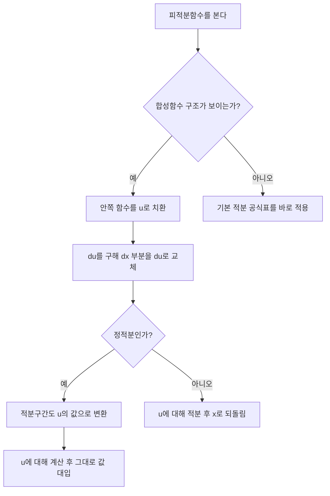

<Callout type="info">
  **이번 문서의 목표:** 이 파일을 다 읽으면 정적분을 넓이의 극한으로 이해하고, 부정적분을 구해 미분학의 기본정리로 정적분 값을 계산하며, 기본 적분 공식과 치환적분으로 다항·지수·로그·삼각함수를 적분할 수 있다.
</Callout>

## 왜 적분이 필요한가: 미분의 반대 방향

13~14편에서는 함수가 주어졌을 때 그 변화율(미분계수)을 구하는 방법을 배웠다. 이번 편부터는 **거꾸로** 간다. 변화율이나 넓이가 주어졌을 때, 원래 함수나 총량을 복원하는 도구가 **적분**(integral)이다. 적분에는 두 얼굴이 있다. 하나는 **정적분**(definite integral) — 그래프와 $x$축 사이의 넓이를 계산하는 도구다. 다른 하나는 **부정적분**(indefinite integral) — 미분해서 원래 함수가 나오게 하는 원시함수를 찾는 도구다. 이 둘이 서로 다른 이야기처럼 보이지만, **미적분학의 기본정리**(fundamental theorem of calculus)가 이 둘을 정확히 연결해준다는 것이 이번 편의 핵심이다.

## 정적분의 정의: 넓이와 합의 극한

> **쉽게 말하면:** 곡선 아래 넓이를 정확히 구하려면, 그 아래를 아주 얇은 직사각형 여러 개로 잘라 넓이를 더한 뒤, 직사각형을 무한히 얇게 만들어 극한을 취한다.

### 문제 상황

$f(x) = x^2$의 그래프와 $x$축, 그리고 $x=0$부터 $x=2$까지의 구간으로 둘러싸인 영역의 넓이를 구하고 싶다고 하자. 이 영역은 직사각형이나 삼각형이 아니라 곡선으로 휘어져 있어서, 초등적인 넓이 공식(가로×세로, $\frac12\times$밑변$\times$높이)을 바로 쓸 수 없다.

### 리만 합(Riemann sum)으로 근사하기

구간 $[0, 2]$를 폭이 같은 $n$개의 작은 구간으로 나누고, 각 작은 구간 위에 높이가 $f(x)$인 직사각형을 세운 뒤 그 넓이를 모두 더하면 전체 넓이를 **근사**할 수 있다. $n=4$로 나누어 직접 계산해보자. 구간 폭은 $\Delta x = \dfrac{2-0}{4} = 0.5$이고, 각 작은 구간의 오른쪽 끝점을 높이로 쓰면 $x = 0.5, 1, 1.5, 2$에서 $f(x) = 0.25, 1, 2.25, 4$다.

$$
\text{근사 넓이} = (0.25 + 1 + 2.25 + 4) \times 0.5 = 7.5 \times 0.5 = 3.75
$$

이 값 $3.75$는 실제 넓이보다 크게 나온다. $f(x)=x^2$이 증가하는 함수라서 각 조각의 **오른쪽** 끝점 높이를 쓰면 실제 곡선보다 더 높은 직사각형을 세우게 되기 때문이다. $n$을 $4, 40, 400, \dots$처럼 점점 늘려 직사각형을 더 잘게 자르면, 이 초과분은 점점 줄어들고 근사 넓이는 어떤 값으로 수렴한다.

### 정적분의 정의

이렇게 $n \to \infty$(구간의 개수를 한없이 늘림)로 보낼 때 리만 합이 수렴하는 값을 **정적분**이라 하고, 다음과 같이 표기한다.

$$
\int_a^b f(x)\,dx = \lim_{n \to \infty} \sum_{i=1}^{n} f(x_i)\,\Delta x
$$

- $\int$: 인테그럴(integral) 기호. 합을 뜻하는 알파벳 S를 길게 늘인 모양으로, "잘게 쪼개 다 더하라"는 뜻이다.
- $a$, $b$: 적분구간의 아래끝과 위끝(하한과 상한)
- $f(x)$: 피적분함수(적분되는 대상 함수)
- $dx$: $x$의 아주 작은 변화량(직사각형의 폭이 $0$에 한없이 가까워진 것)
- $\sum$: 시그마, 모두 더하라는 기호
- $\Delta x$: 각 작은 구간의 폭

이 정의에 따르면 $\int_0^2 x^2\,dx$는 $x^2$의 그래프와 $x$축, $x=0$과 $x=2$로 둘러싸인 영역의 정확한 넓이다. 뒤에서 기본 적분 공식으로 이 값을 직접 계산하면 $\dfrac{8}{3} \approx 2.667$이 나오는데, 앞서 $n=4$로 구한 근사값 $3.75$보다 작다는 것도 "오른쪽 끝점을 쓰면 과대 추정된다"는 설명과 들어맞는다.

## 부정적분과 원시함수

> **쉽게 말하면:** 미분해서 $f(x)$가 나오는 함수를 거꾸로 찾는 것이 부정적분이다.

### 정의

어떤 함수 $F(x)$를 미분했을 때 $f(x)$가 나온다면, 즉 $F'(x) = f(x)$라면, $F(x)$를 $f(x)$의 **원시함수(antiderivative)** 또는 **부정적분**이라 부른다. 표기는 다음과 같다.

$$
\int f(x)\,dx = F(x) + C
$$

- $C$: 적분상수(constant of integration). 상수를 미분하면 $0$이 되므로, $F(x)$에 어떤 상수를 더해도 미분하면 똑같이 $f(x)$가 나온다. 그래서 원시함수는 하나가 아니라 **무한히 많고**, 그 전체를 $C$로 뭉뚱그려 표기한다.

예를 들어 $f(x) = 2x$의 원시함수는 $F(x) = x^2$이지만, $x^2+1$, $x^2-5$, $x^2+100$도 모두 미분하면 $2x$가 되므로 전부 원시함수다. 그래서 $\int 2x\,dx = x^2 + C$라고 쓴다.

> **부정적분이라는 이름의 이유:** "부정(不定)"은 "정해지지 않았다"는 뜻이다. 적분상수 $C$가 어떤 값인지 정해지지 않은 채로 함수 전체(그래프가 위아래로 평행이동한 가족 전체)를 나타내기 때문에 부정적분이라 부른다. 반대로 정적분은 하한과 상한이 정해져 있어 값이 숫자 하나로 확정되므로 "정(定)적분"이다.

### 미적분학의 기본정리: 정적분과 부정적분의 연결

> **쉽게 말하면:** 정적분 값은, 부정적분(원시함수)을 구한 뒤 위끝을 대입한 값에서 아래끝을 대입한 값을 빼면 된다.

$f(x)$가 구간 $[a,b]$에서 연속이고 $F(x)$가 $f(x)$의 한 원시함수일 때,

$$
\int_a^b f(x)\,dx = F(b) - F(a)
$$

이 정리 덕분에 리만 합의 극한을 매번 계산하는 대신, **원시함수만 찾으면** 정적분을 대수적으로 빠르게 계산할 수 있다. 표기의 편의를 위해 $F(b)-F(a)$를 $\big[F(x)\big]_a^b$로 쓴다.

**계산 예시.** $\int_0^2 x^2\,dx$를 계산하자. $x^2$의 원시함수는 $\dfrac{x^3}{3}$이다(뒤에서 다룰 기본 공식으로 바로 확인 가능).

$$
\int_0^2 x^2\,dx = \left[ \frac{x^3}{3} \right]_0^2 = \frac{2^3}{3} - \frac{0^3}{3} = \frac{8}{3} - 0 = \frac{8}{3}
$$

앞서 리만 합으로 어림잡았던 값($n=4$일 때 $3.75$)이 실제 값 $\dfrac{8}{3}\approx 2.667$보다 크게 나왔던 것도, "오른쪽 끝점을 쓰면 증가함수에서는 과대 추정된다"는 설명과 일관된다.

## 기본 적분 공식

> **쉽게 말하면:** 미분 공식을 거꾸로 뒤집으면 적분 공식이 된다. 미분해서 무엇이 되는지를 거꾸로 떠올리면 적분 공식을 외우지 않아도 유도할 수 있다.

| 함수 | 부정적분 | 비고 |
|------|----------|------|
| $x^n$ | $\dfrac{x^{n+1}}{n+1} + C$ | $n \neq -1$ |
| $\dfrac{1}{x}$ | $\ln \lvert x \rvert + C$ | $x \neq 0$, $\ln$은 자연로그 |
| $e^x$ | $e^x + C$ | $e$는 자연로그의 밑 |
| $a^x$ ($a>0, a\neq 1$) | $\dfrac{a^x}{\ln a} + C$ | |
| $\sin x$ | $-\cos x + C$ | |
| $\cos x$ | $\sin x + C$ | |
| $\sec^2 x$ | $\tan x + C$ | |

이 표는 13편의 미분 공식표를 그대로 뒤집은 것이다. 예를 들어 $(\sin x)' = \cos x$였으므로 $\int \cos x\,dx = \sin x + C$이고, $(-\cos x)' = \sin x$였으므로 $\int \sin x\,dx = -\cos x + C$다. 부호가 헷갈릴 때는 "이 함수를 미분하면 정말 피적분함수가 나오는가"를 직접 미분해서 확인하는 것이 가장 확실하다.

### 계산 예시와 검산

$\int (3x^2 - 4x + 5)\,dx$를 계산하자. 다항식은 각 항을 따로 적분한다($x^n$ 공식 적용).

$$
\int (3x^2 - 4x + 5)\,dx = x^3 - 2x^2 + 5x + C
$$

- $3x^2$의 적분: $3 \times \dfrac{x^3}{3} = x^3$
- $-4x$의 적분: $-4 \times \dfrac{x^2}{2} = -2x^2$
- $5$의 적분: $5x$ ($5 = 5x^0$이므로 $5 \times \dfrac{x^1}{1} = 5x$)

**검산 — 반대 연산으로 확인.** 적분한 결과를 다시 미분해서 원래 피적분함수가 나오는지 확인한다.

$$
\frac{d}{dx}\left( x^3 - 2x^2 + 5x + C \right) = 3x^2 - 4x + 5
$$

미분한 결과가 원래 함수 $3x^2-4x+5$와 정확히 일치한다. 이 검산 절차(적분 → 미분 → 원식 확인)는 앞으로 모든 적분 문제에서 반드시 습관화해야 한다.

## 치환적분 기초 (substitution)

> **쉽게 말하면:** 복잡한 식 안에 덩어리(합성함수 구조)가 보이면, 그 덩어리를 새 문자 $u$로 치환해 간단한 적분으로 바꾼다.

### 원리

연쇄법칙(chain rule)으로 $\dfrac{d}{dx}\big[g(u(x))\big] = g'(u(x)) \cdot u'(x)$였다는 것을 12~13편에서 배웠다. 치환적분은 이 연쇄법칙을 거꾸로 적용하는 것이다. 피적분함수가 $u'(x)$와 $g'(u(x))$의 곱 형태로 보이면, $u = u(x)$로 치환해 적분을 단순화할 수 있다.

### 계산 절차

$\int 2x(x^2+1)^3\,dx$를 계산하자.

<Steps>

1. **치환할 덩어리를 정한다.** 괄호 안의 $x^2+1$을 $u$로 둔다. $u = x^2+1$
2. **$u$를 $x$로 미분해 $du$를 구한다.** $\dfrac{du}{dx} = 2x$이므로 $du = 2x\,dx$
3. **원래 식에서 $x$에 관한 부분을 $u$와 $du$로 전부 바꾼다.** $2x\,dx$가 정확히 $du$와 같으므로, $\int 2x(x^2+1)^3\,dx = \int u^3\,du$
4. **간단해진 식을 적분한다.** $\int u^3\,du = \dfrac{u^4}{4} + C$
5. **$u$를 원래 $x$의 식으로 되돌린다.** $u = x^2+1$이므로 $\dfrac{(x^2+1)^4}{4} + C$

</Steps>

$$
\int 2x(x^2+1)^3\,dx = \frac{(x^2+1)^4}{4} + C
$$

**검산 — 미분해서 원식으로 돌아오는지 확인.** 연쇄법칙으로 미분한다.

$$
\frac{d}{dx}\left[ \frac{(x^2+1)^4}{4} \right] = \frac{4(x^2+1)^3 \cdot 2x}{4} = 2x(x^2+1)^3
$$

미분 결과가 원래 피적분함수 $2x(x^2+1)^3$과 정확히 일치한다.

### 정적분에서의 치환: 적분구간도 함께 바꾼다

$\int_0^1 2x(x^2+1)^3\,dx$를 계산하자. 부정적분을 먼저 구해 상하한을 대입해도 되지만, 치환적분에서는 **적분구간을 $u$의 범위로 바꾸는 방법**도 있다.

<Steps>

1. **치환한다.** $u = x^2+1$, $du = 2x\,dx$
2. **적분구간을 $u$의 값으로 바꾼다.** $x=0$일 때 $u = 0^2+1=1$, $x=1$일 때 $u=1^2+1=2$
3. **$u$에 대한 정적분으로 다시 쓴다.** $\displaystyle\int_1^2 u^3\,du$
4. **계산한다.**

</Steps>

$$
\int_1^2 u^3\,du = \left[ \frac{u^4}{4} \right]_1^2 = \frac{2^4}{4} - \frac{1^4}{4} = \frac{16}{4} - \frac{1}{4} = \frac{15}{4}
$$

**검산 — 다른 방법(부정적분을 먼저 구하고 $x$의 상하한을 대입)으로 재계산.** 앞서 구한 부정적분 $\dfrac{(x^2+1)^4}{4}$에 $x=0$과 $x=1$을 직접 대입한다.

$$
\left[ \frac{(x^2+1)^4}{4} \right]_0^1 = \frac{(1+1)^4}{4} - \frac{(0+1)^4}{4} = \frac{16}{4} - \frac{1}{4} = \frac{15}{4}
$$

두 방법(적분구간을 $u$로 바꾸는 방법, $x$로 되돌린 뒤 대입하는 방법) 모두 $\dfrac{15}{4}$로 **정확히 일치**한다.

## 자주 틀리는 점

- **부정적분에 적분상수 $C$를 빠뜨린다.** $\int f(x)\,dx$의 답은 항상 $+C$로 끝나야 한다. 정적분은 $C$가 계산 과정에서 상쇄되어 사라지므로 $C$를 붙이지 않는다 — 이 둘을 혼동해 정적분 답에 $C$를 남기거나 부정적분 답에서 $C$를 빠뜨리는 실수가 흔하다.
- **$\int x^n\,dx$ 공식에서 $n=-1$인 경우를 놓친다.** $\dfrac{x^{n+1}}{n+1}$ 공식은 $n=-1$일 때 분모가 $0$이 되어 쓸 수 없다. $\int \dfrac{1}{x}\,dx = \ln\lvert x\rvert + C$라는 별도 공식을 써야 한다.
- **치환적분에서 $dx$를 $du$로 바꾸지 않고 그대로 둔다.** $u=u(x)$로 치환했으면 $dx$도 반드시 $du$와 $u'(x)$의 관계로 바꿔야 한다. 이 과정을 생략하면 남은 식에 여전히 $x$가 섞여 있어 $u$만의 적분이 되지 않는다.
- **정적분에서 치환할 때 적분구간을 바꾸지 않고 그대로 둔 채 $u$로 계산한다.** 적분구간은 $x$의 범위이므로, $u$로 치환했으면 구간도 $u$의 범위로 바꿔야 한다. 구간을 바꾸지 않으려면 계산 후 다시 $x$로 되돌린 뒤 원래 $x$의 상하한을 대입해야 한다.
- **정적분 값을 구하고 나서 그것을 곧바로 "넓이"라고 단정한다.** 함수값이 음수인 구간에서는 정적분이 음수가 되어 넓이와 다르다. 이 문제는 다음 편(16편)에서 부호와 구간 처리 절차로 자세히 다룬다.

## 핵심 정리

- 정적분 $\int_a^b f(x)\,dx$는 리만 합(직사각형 넓이의 합)의 극한으로 정의되며, $f(x)\geq0$인 구간에서는 곡선 아래 넓이와 같다.
- 부정적분 $\int f(x)\,dx = F(x)+C$는 미분해서 $f(x)$가 되는 원시함수 전체를 나타내며, 적분상수 $C$를 빠뜨리면 안 된다.
- 미적분학의 기본정리 $\int_a^b f(x)\,dx = F(b)-F(a)$가 정적분과 부정적분을 연결한다.
- 기본 적분 공식은 미분 공식표를 거꾸로 뒤집은 것이며, $x^n$ 공식은 $n=-1$일 때 예외로 $\ln\lvert x\rvert$를 쓴다.
- 치환적분은 연쇄법칙을 거꾸로 적용하는 것으로, 정적분이면 적분구간도 함께 바꿔야 한다.
- 적분 결과는 반드시 미분해서 원래 피적분함수로 돌아오는지 검산한다.

## 마무리 복습

<Quiz
  questionNumber={1}
  question="함수 f(x)=x^2이 증가함수일 때, 리만 합에서 각 구간의 오른쪽 끝점을 높이로 사용하면 실제 정적분 값과 비교해 어떻게 되는가?"
  options={['실제 값보다 크게 나온다', '실제 값보다 작게 나온다', '항상 정확히 같다', '비교할 수 없다']}
  correctAnswer={1}
  explanation="증가함수에서는 각 작은 구간의 오른쪽 끝점의 함숫값이 그 구간 안의 다른 값보다 크므로, 그 값을 높이로 쓴 직사각형은 실제 곡선보다 위로 튀어나와 넓이를 과대 추정한다. n=4로 계산한 예시에서도 근사값 3.75가 실제값 8/3(약 2.667)보다 컸다."
  optionExplanations={['오른쪽 끝점이 구간 내 최댓값이 되어 과대 추정이 발생하므로 정답이다.', '감소함수라면 작게 나오지만 증가함수에서는 크게 나온다.', 'n이 유한한 이상 일반적으로 정확히 같지 않다.', '증가함수라는 조건이 주어졌으므로 비교가 가능하다.']}
/>

<Quiz
  questionNumber={2}
  question="부정적분 결과에 적분상수 C를 반드시 붙이는 이유로 가장 적절한 것은?"
  options={['상수를 미분하면 0이 되어 원시함수가 무수히 많기 때문', '적분 공식을 외우기 쉽게 하기 위한 관례이기 때문', 'C가 있어야 미분학의 기본정리가 성립하기 때문', '정적분과 형태를 통일하기 위한 표기 규칙이기 때문']}
  correctAnswer={1}
  explanation="F(x)를 미분하면 f(x)가 나올 때, F(x)에 어떤 상수를 더해도 미분하면 상수항은 0이 되어 사라지므로 여전히 f(x)가 나온다. 따라서 원시함수는 하나가 아니라 상수만큼의 차이를 갖는 무한히 많은 함수 가족이며, 이를 C로 표현한다."
  optionExplanations={['상수의 미분이 0이 되는 성질이 정확한 이유다.', '단순한 관례가 아니라 수학적으로 반드시 필요한 표기다.', '기본정리는 정적분에서 C가 상쇄되는 원리이며 C의 필요성과는 다른 이야기다.', '단순 표기 통일이 아니라 원시함수의 개수가 무한하다는 사실을 반영한 것이다.']}
/>

<Quiz
  questionNumber={3}
  question="적분 ∫(3x^2-4x+5)dx의 결과로 옳은 것은?"
  options={['x^3-2x^2+5x+C', 'x^3-4x^2+5x+C', '3x^3-2x^2+5x+C', 'x^3-2x^2+C']}
  correctAnswer={1}
  explanation="각 항을 x^n 공식으로 적분하면 3x^2의 적분은 x^3, -4x의 적분은 -2x^2, 5의 적분은 5x이므로 x^3-2x^2+5x+C가 된다. 결과를 미분하면 3x^2-4x+5로 원래 식이 정확히 재현되어 검산된다."
  optionExplanations={['각 항을 정확히 적분하고 미분 검산으로 확인한 정답이다.', '-4x의 적분 계수 2를 반영하지 않은 오답이다.', '3x^2의 계수 3을 나누지 않고 그대로 남긴 오답이다.', '상수항 5x를 빠뜨린 오답이다.']}
/>

<Quiz
  questionNumber={4}
  question="∫(1/x)dx의 결과로 옳은 것은?"
  options={['ln|x| + C', 'x^0/0 + C', '1/x^2 + C (부호 반대)', '-1/x + C']}
  correctAnswer={1}
  explanation="x^n 공식 x^(n+1)/(n+1)은 n=-1일 때 분모가 0이 되어 사용할 수 없으므로, 1/x의 적분은 별도 공식인 ln|x|+C를 쓴다. 절댓값을 씌우는 이유는 x가 음수여도 로그의 진수 조건을 만족시키기 위해서다."
  optionExplanations={['n=-1 예외 공식을 정확히 적용한 정답이다.', 'n=-1에서는 분모가 0이 되어 이 공식 자체를 쓸 수 없다.', '1/x^2은 1/x를 미분한 결과이지 적분한 결과가 아니다.', '-1/x를 미분하면 1/x^2이 나와 원래 피적분함수와 다르다.']}
/>

<Quiz
  questionNumber={5}
  question="치환적분으로 ∫2x(x^2+1)^3 dx를 계산할 때 u=x^2+1로 두면 dx는 무엇으로 바뀌는가?"
  options={['du를 2x로 나눈 것', 'du 그대로', '2x du', 'du를 x로 나눈 것']}
  correctAnswer={1}
  explanation="u=x^2+1을 미분하면 du/dx=2x이므로 du=2x dx이다. 따라서 dx=du/(2x)이며, 원래 식의 2x dx가 정확히 du와 같아지므로 2x(x^2+1)^3 dx = u^3 du로 바뀐다."
  optionExplanations={['du=2xdx에서 dx를 분리하면 du/(2x)가 되어 정답이다.', 'du를 그대로 두면 2x가 남아 계수가 맞지 않는다.', '이는 du/dx=2x를 반대로 곱한 잘못된 변형이다.', 'du/dx는 x가 아니라 2x이므로 틀린 변형이다.']}
/>

<Quiz
  questionNumber={6}
  question="정적분 ∫0~1 2x(x^2+1)^3 dx의 값은?"
  options={['15/4', '16/4', '1/4', '15/2']}
  correctAnswer={1}
  explanation="u=x^2+1로 치환하면 x=0일 때 u=1, x=1일 때 u=2이므로 적분은 1~2에서 u^3 du가 된다. 계산하면 [u^4/4]는 16/4-1/4=15/4이며, 부정적분 (x^2+1)^4/4에 x=0,1을 직접 대입해도 같은 값 15/4가 나와 검산된다."
  optionExplanations={['적분구간을 u로 정확히 변환해 계산한 정답이다.', 'u=2에서의 값만 계산하고 u=1의 값을 빼지 않은 오답이다.', 'u=1에서의 값만 남기고 부호를 반대로 처리한 오답이다.', '분모 4를 잘못 나눈 계산 오류다.']}
/>

<Quiz
  questionNumber={7}
  question="미적분학의 기본정리에 따르면 정적분 ∫a~b f(x)dx의 값은 무엇으로 계산하는가?"
  options={['F(b)-F(a) (F는 f의 한 원시함수)', 'F(a)-F(b)', 'f(b)-f(a)', 'F(b)+F(a)']}
  correctAnswer={1}
  explanation="미적분학의 기본정리는 f의 원시함수 F를 이용해 정적분 값을 F(b)-F(a), 즉 위끝을 대입한 값에서 아래끝을 대입한 값을 뺀 것으로 계산할 수 있다는 정리다."
  optionExplanations={['기본정리의 정확한 형태다.', '순서가 뒤바뀌면 부호가 반대로 나온다.', 'f 자체가 아니라 원시함수 F에 대입해야 한다.', '빼는 것이지 더하는 것이 아니다.']}
/>

## 참고 자료

- [미적분 I 교재 요약: 미분·적분 핵심 개념](https://www.itl.nist.gov/div898/handbook/) — 정적분의 넓이 개념, 부정적분과 원시함수의 관계 정리에 참고
- [수학 공식 자료: 고등학교 미적분 적분 공식](https://mathworld.wolfram.com) — 기본 적분 공식표와 치환적분 기법을 독학사 범위에 맞게 재구성하는 데 참고
