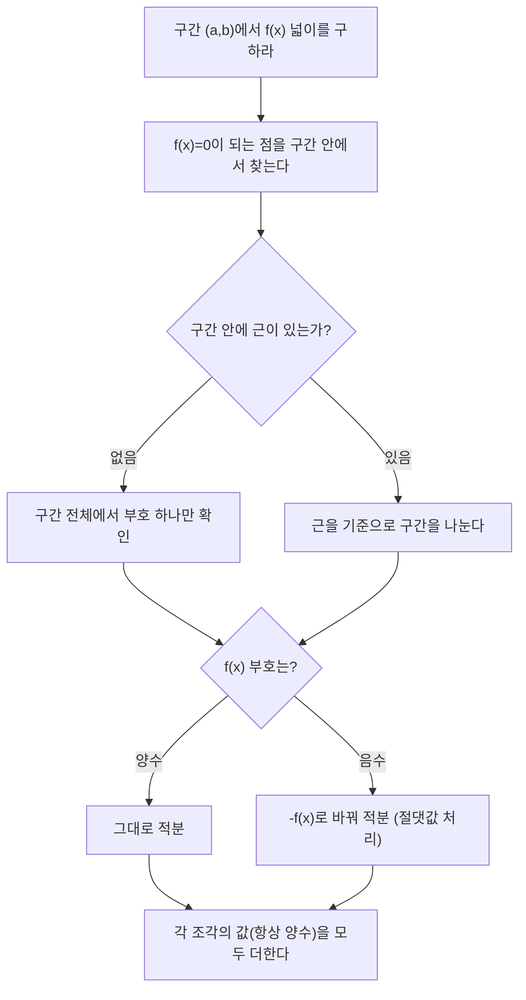

<Callout type="info">
  **이번 문서의 목표:** 이 파일을 다 읽으면 정적분을 정확한 절차로 계산하고, 함수의 부호가 바뀌는 구간을 스스로 나누어 넓이를 올바르게 구하며, 정적분 값을 그래프의 평균값·부호로 해석할 수 있다.
</Callout>

## 지난 편 복습과 이번 편의 목표

15편에서 정적분을 넓이의 극한으로 정의하고, 미적분학의 기본정리로 부정적분을 이용해 정적분을 계산하는 법, 그리고 치환적분을 배웠다. 하지만 15편의 마지막에서 짚었듯, **정적분 값이 항상 넓이와 같지는 않다.** 함수가 $x$축 아래로 내려가는 구간에서는 정적분 값이 음수가 되기 때문이다. 이번 편은 (1) 정적분을 실수 없이 계산하는 표준 절차, (2) 넓이를 구할 때 부호와 구간을 정확히 나누는 판단 기준, (3) 두 곡선 사이의 넓이 계산, (4) 정적분 값을 그래프의 평균값·부호로 해석하는 법을 다룬다.

## 정적분 계산 절차

> **쉽게 말하면:** 정적분은 "부정적분 구하기 → 위끝 대입 → 아래끝 대입 → 빼기"의 네 단계를 순서대로 밟으면 실수 없이 계산할 수 있다.

### 표준 절차

$\displaystyle\int_1^3 (3x^2 - 2x + 1)\,dx$를 계산하자.

<Steps>

1. **부정적분(원시함수)을 구한다.** $\int (3x^2-2x+1)\,dx = x^3 - x^2 + x + C$
2. **적분상수 $C$는 정적분에서 상쇄되므로 생략하고, $F(x) = x^3-x^2+x$로 둔다.**
3. **위끝을 대입한다.** $F(3) = 3^3 - 3^2 + 3 = 27 - 9 + 3 = 21$
4. **아래끝을 대입한다.** $F(1) = 1^3 - 1^2 + 1 = 1 - 1 + 1 = 1$
5. **위끝 대입값에서 아래끝 대입값을 뺀다.** $F(3) - F(1) = 21 - 1 = 20$

</Steps>

$$
\int_1^3 (3x^2-2x+1)\,dx = 20
$$

**검산 — 반대 연산(미분)으로 원식을 확인한다.** $F(x) = x^3-x^2+x$를 미분하면 $F'(x) = 3x^2-2x+1$이 되어, 처음 적분하려던 피적분함수와 정확히 일치한다. 원시함수 계산 자체가 맞았다는 것을 확인한 뒤에 상하한을 대입했으므로, 최종 값 $20$도 신뢰할 수 있다.

**적분상수 $C$가 상쇄되는 이유.** $F(x)+C$를 상하한에 대입하면 $\big[F(b)+C\big] - \big[F(a)+C\big] = F(b)-F(a)$가 되어 $C$가 자동으로 사라진다. 그래서 정적분을 계산할 때는 부정적분 단계에서 $C$를 아예 쓰지 않아도 된다.

## 부호와 구간을 나누는 판단 기준

> **쉽게 말하면:** 정적분은 $x$축 위쪽 넓이는 더하고 아래쪽 넓이는 뺀 "부호 있는 넓이"다. 진짜 넓이(항상 양수)를 구하려면 부호가 바뀌는 지점에서 구간을 잘라 각 조각을 양수로 바꾼 뒤 더해야 한다.

### 왜 구간을 나눠야 하는가

정적분의 정의(리만 합)를 다시 떠올려보자. $f(x) < 0$인 구간에서는 직사각형의 높이 $f(x_i)$ 자체가 음수이므로, 그 조각의 넓이 $f(x_i)\Delta x$도 음수로 더해진다. 즉 정적분은 $x$축 위쪽 부분은 양수로, 아래쪽 부분은 음수로 계산해 **합산**한 값이다. 이것을 "부호 있는 넓이(signed area)"라 부른다. 반면 우리가 일상적으로 말하는 "넓이"는 위든 아래든 상관없이 항상 양수로 세는 값이다. 이 둘을 구분하지 못하면 넓이 문제에서 반드시 틀린다.

### 구간을 나누는 절차

$f(x) = x^2 - 4$와 $x$축, $x=0$부터 $x=3$까지로 둘러싸인 영역의 **넓이**(정적분 값이 아니라 실제 넓이)를 구하자.

<Steps>

1. **$f(x) = 0$이 되는 지점(그래프가 $x$축과 만나는 점)을 구간 안에서 찾는다.** $x^2-4=0 \Rightarrow x = \pm 2$. 구간 $[0,3]$ 안에 있는 것은 $x=2$뿐이다.
2. **그 지점을 기준으로 구간을 나눈다.** $[0,2]$와 $[2,3]$
3. **각 구간에서 $f(x)$의 부호를 대표값으로 확인한다.** $x=1$: $f(1)=1-4=-3<0$. $x=2.5$: $f(2.5)=6.25-4=2.25>0$
4. **부호가 음수인 구간은 피적분함수에 음수 부호를 붙여(절댓값을 취해) 적분하고, 양수인 구간은 그대로 적분한다.**
5. **각 조각의 값(항상 양수)을 더한다.**

</Steps>

$[0,2]$ 구간에서 $f(x)<0$이므로 $-f(x) = 4-x^2$을 적분한다.

$$
\int_0^2 (4-x^2)\,dx = \left[ 4x - \frac{x^3}{3} \right]_0^2 = \left(8 - \frac{8}{3}\right) - 0 = \frac{16}{3}
$$

$[2,3]$ 구간에서 $f(x)>0$이므로 그대로 적분한다.

$$
\int_2^3 (x^2-4)\,dx = \left[ \frac{x^3}{3} - 4x \right]_2^3 = \left(9-12\right) - \left(\frac{8}{3}-8\right) = -3 - \left(-\frac{16}{3}\right) = \frac{7}{3}
$$

두 조각을 더한다.

$$
\text{넓이} = \frac{16}{3} + \frac{7}{3} = \frac{23}{3}
$$

**대조: 구간을 나누지 않고 그냥 정적분만 계산하면 어떻게 되는가.** 부호를 무시하고 $[0,3]$ 전체를 한 번에 적분하면

$$
\int_0^3 (x^2-4)\,dx = \left[ \frac{x^3}{3} - 4x \right]_0^3 = (9-12) - 0 = -3
$$

이 값 $-3$은 넓이가 아니라 "부호 있는 넓이"다. 실제로 $-3 = -\dfrac{16}{3} + \dfrac{7}{3} = -\dfrac{9}{3} = -3$으로, 아래쪽 조각을 음수로, 위쪽 조각을 양수로 그대로 더한 값과 정확히 일치한다. 즉 구간을 나눠 부호를 바로잡은 결과($\dfrac{23}{3}$)와 그냥 계산한 결과($-3$)가 서로 다른 것은 계산 실수가 아니라, **"넓이"와 "부호 있는 정적분 값"이 원래 다른 개념이기 때문**이다.

## 두 곡선 사이의 넓이

> **쉽게 말하면:** 두 곡선으로 둘러싸인 영역의 넓이는 "위에 있는 함수 − 아래에 있는 함수"를 교점 사이 구간에서 적분한 값이다.

### 절차

$y = x+2$(직선)와 $y=x^2$(포물선)으로 둘러싸인 영역의 넓이를 구하자.

<Steps>

1. **교점을 구한다(두 식을 연립).** $x+2 = x^2 \Rightarrow x^2-x-2=0 \Rightarrow (x-2)(x+1)=0 \Rightarrow x=-1, 2$
2. **교점 사이 구간에서 어느 함수가 위에 있는지 대표값으로 확인한다.** $x=0$: 직선값 $0+2=2$, 포물선값 $0^2=0$. 직선이 더 크므로 직선이 위, 포물선이 아래
3. **"위 함수 − 아래 함수"를 교점 사이 구간에서 적분한다.** $\displaystyle\int_{-1}^{2} \big[(x+2) - x^2\big]\,dx$
4. **정적분을 계산한다.**

</Steps>

피적분함수를 정리하면 $-x^2+x+2$이고, 원시함수는 $-\dfrac{x^3}{3}+\dfrac{x^2}{2}+2x$다.

$$
\int_{-1}^{2} (-x^2+x+2)\,dx = \left[ -\frac{x^3}{3} + \frac{x^2}{2} + 2x \right]_{-1}^{2}
$$

위끝 $x=2$를 대입한다.

$$
-\frac{8}{3} + \frac{4}{2} + 4 = -\frac{8}{3} + 2 + 4 = -\frac{8}{3} + 6 = \frac{10}{3}
$$

아래끝 $x=-1$을 대입한다.

$$
-\frac{-1}{3} + \frac{1}{2} + (-2) = \frac{1}{3} + \frac{1}{2} - 2 = \frac{2}{6}+\frac{3}{6}-\frac{12}{6} = -\frac{7}{6}
$$

두 값을 뺀다.

$$
\frac{10}{3} - \left(-\frac{7}{6}\right) = \frac{20}{6} + \frac{7}{6} = \frac{27}{6} = \frac{9}{2}
$$

따라서 넓이는 $\dfrac{9}{2}$다.

**검산 — 다른 방법(공식화된 지름길)으로 재계산.** 두 곡선의 차 $(x+2)-x^2 = -(x^2-x-2) = -(x-2)(x+1)$처럼, 위끝 $b$와 아래끝 $a$를 근으로 갖는 "$-($ x−a $)($ x−b $)$" 꼴로 정리되는 경우, 이 구간의 정적분은 항상 $\dfrac{(b-a)^3}{6}$이라는 지름길 공식이 성립한다. 여기서는 $a=-1$, $b=2$이므로 $b-a=3$이고,

$$
\frac{(b-a)^3}{6} = \frac{3^3}{6} = \frac{27}{6} = \frac{9}{2}
$$

앞서 상하한을 직접 대입해 구한 값과 **정확히 일치**한다.

## 그래프와 적분 값의 관계: 평균값과 부호 해석

> **쉽게 말하면:** 정적분을 구간의 길이로 나누면 그 구간에서 함수의 "평균 높이"가 나온다.

### 정적분의 평균값 정리 (mean value theorem for integrals)

$f(x)$가 구간 $[a,b]$에서 연속이면, 다음을 만족하는 $c$가 그 구간 안에 적어도 하나 존재한다.

$$
f(c) = \frac{1}{b-a}\int_a^b f(x)\,dx
$$

- 우변 $\dfrac{1}{b-a}\displaystyle\int_a^b f(x)\,dx$: 구간 $[a,b]$에서 $f$의 **평균값**. 정적분(부호 있는 넓이)을 구간의 폭으로 나눈 값이다.
- $c$: 그 평균값과 정확히 같은 함숫값을 갖는, 구간 안의 어떤 특정한 $x$값

> **비유:** 자동차로 $[a,b]$의 거리를 이동하는 동안 순간속도가 계속 바뀌었더라도, 이동 시간 동안 어느 한 순간에는 반드시 "평균속도"와 똑같은 순간속도를 냈던 때가 있다는 것과 같은 이야기다. 이 비유에서 순간속도가 $f(x)$, 평균속도가 정적분을 구간 길이로 나눈 값에 해당한다.

### 계산 예시

$f(x) = x^2$의 구간 $[0,3]$에서의 평균값과, 그 평균값을 실제로 갖는 $c$를 구하자.

$$
\int_0^3 x^2\,dx = \left[ \frac{x^3}{3} \right]_0^3 = \frac{27}{3} - 0 = 9
$$

평균값은 정적분을 구간 길이 $3-0=3$으로 나눈 값이다.

$$
\text{평균값} = \frac{9}{3} = 3
$$

이제 $f(c) = c^2 = 3$을 만족하는 $c$를 구간 $[0,3]$ 안에서 찾는다.

$$
c = \sqrt{3} \approx 1.732
$$

$\sqrt{3}\approx1.732$는 구간 $[0,3]$ 안에 있으므로, 이 $c$가 정적분의 평균값 정리가 보장하는 값이다.

**결과 해석.** $[0,2.5]$ 부근에서는 $f(x)=x^2$이 평균값 $3$보다 작은 구간이 더 넓고, $[2.5,3]$ 근처에서는 $f(x)$가 평균값보다 훨씬 크게 튀어 오른다. 이 "부족한 부분"과 "초과한 부분"이 정확히 상쇄되는 지점이 $c=\sqrt3$이며, 그 앞뒤로 그래프가 평균값보다 낮았다가 높아지는 구조를 갖는다.

### 부호 해석: 정적분 값의 의미 읽기

| 정적분 값 | 그래프에서의 의미 |
|-----------|-------------------|
| 양수 | $x$축 위쪽 넓이가 아래쪽 넓이보다 크다(순수 초과분이 양) |
| $0$ | $x$축 위쪽과 아래쪽 넓이가 정확히 같다(서로 상쇄) |
| 음수 | $x$축 아래쪽 넓이가 위쪽 넓이보다 크다 |

이 표를 앞서 계산한 $\displaystyle\int_0^3 (x^2-4)\,dx = -3$에 적용해 보면, 값이 음수라는 것은 $[0,2]$에서 $x$축 아래로 내려간 부분($\frac{16}{3}$)이 $[2,3]$에서 위로 올라온 부분($\frac{7}{3}$)보다 크다는 뜻으로 해석된다. 실제로 $\frac{16}{3} > \frac{7}{3}$이므로 이 해석은 계산 결과와 정확히 들어맞는다.

## 자주 틀리는 점

- **넓이를 구할 때 근을 찾지 않고 구간 전체를 한 번에 적분한다.** 함수가 구간 안에서 부호를 바꾸면 결과는 "부호 있는 넓이"이지 실제 넓이가 아니다. 반드시 $f(x)=0$이 되는 지점을 먼저 찾아 구간을 나눠야 한다.
- **두 곡선 사이 넓이에서 "위 함수 − 아래 함수"를 반대로 뺀다.** 교점 사이의 대표값으로 어느 함수가 위에 있는지 먼저 확인하지 않고 무작정 빼면 넓이가 음수로 나오거나 부호가 반대로 나온다. 넓이는 항상 (위 함수) − (아래 함수)로 계산해 양수가 나오도록 한다.
- **정적분의 평균값 정리에서 구한 $c$가 구간 밖으로 나온 것을 알아채지 못한다.** 방정식을 풀면 여러 해가 나올 수 있는데, 그중 구간 $[a,b]$ 안에 있는 해만 답으로 채택해야 한다.
- **상하한 대입 순서를 거꾸로 한다.** $F(b)-F(a)$이지 $F(a)-F(b)$가 아니다. 부호가 뒤바뀌면 넓이나 정적분 값이 반대 부호로 나온다.
- **교점 계산에서 이차방정식을 인수분해할 때 부호를 잘못 처리한다.** $(x-2)(x+1)=0$을 풀 때 근을 $x=-2, 1$처럼 부호를 반대로 적는 실수가 흔하다. 인수분해한 식에 근을 다시 대입해 $0$이 되는지 검산하는 습관을 들인다.

## 핵심 정리

- 정적분 계산은 (1) 부정적분 구하기 → (2) 위끝 대입 → (3) 아래끝 대입 → (4) 빼기의 절차로 통일하고, 결과를 미분해 원식으로 돌아오는지 검산한다.
- 정적분은 "부호 있는 넓이"이므로, 실제 넓이를 구하려면 $f(x)=0$이 되는 지점을 기준으로 구간을 나누고 음수 구간은 절댓값 처리 후 더한다.
- 두 곡선 사이 넓이는 교점을 구하고, 그 사이에서 위 함수에서 아래 함수를 뺀 것을 적분한다.
- 정적분의 평균값 정리는 정적분 값을 구간 길이로 나누면 그 함수의 평균값이 되고, 그 평균값과 같은 함숫값을 갖는 지점이 구간 안에 존재함을 보장한다.
- 정적분 값의 부호는 $x$축 위쪽과 아래쪽 넓이 중 어느 쪽이 더 큰지를 나타낸다.

## 마무리 복습

<Quiz
  questionNumber={1}
  question="정적분 계산의 표준 절차 순서로 옳은 것은?"
  options={['부정적분 구하기 - 위끝 대입 - 아래끝 대입 - 빼기', '위끝 대입 - 부정적분 구하기 - 아래끝 대입 - 더하기', '아래끝 대입 - 위끝 대입 - 부정적분 구하기 - 빼기', '부정적분 구하기 - 아래끝 대입 - 위끝 대입 - 더하기']}
  correctAnswer={1}
  explanation="미적분학의 기본정리에 따라 정적분은 원시함수 F(x)를 먼저 구한 뒤, 위끝 b를 대입한 값에서 아래끝 a를 대입한 값을 빼는 F(b)-F(a) 절차로 계산한다."
  optionExplanations={['기본정리의 절차를 정확히 나열한 정답이다.', '부정적분을 먼저 구해야 대입이 가능하므로 순서가 틀렸다.', '부정적분을 구하지 않고는 대입할 함수가 없으므로 순서가 틀렸다.', '빼기가 아니라 더하기로 서술해 틀렸다.']}
/>

<Quiz
  questionNumber={2}
  question="f(x)=x^2-4와 x축, x=0부터 x=3까지로 둘러싸인 영역의 실제 넓이는?"
  options={['23/3', '-3', '16/3', '7/3']}
  correctAnswer={1}
  explanation="f(x)=0이 되는 x=2를 기준으로 [0,2]와 [2,3]으로 나눈다. [0,2]에서 f(x)가 음수이므로 -(x^2-4)를 적분해 16/3, [2,3]에서 f(x)가 양수이므로 그대로 적분해 7/3이 나오고, 둘을 더하면 23/3이 실제 넓이다."
  optionExplanations={['부호를 나눠 절댓값 처리한 후 더한 정답이다.', '이는 구간을 나누지 않고 그대로 적분한 부호 있는 정적분 값이지 넓이가 아니다.', '[0,2] 구간의 값만 계산하고 [2,3] 구간을 더하지 않은 값이다.', '[2,3] 구간의 값만 계산하고 [0,2] 구간을 더하지 않은 값이다.']}
/>

<Quiz
  questionNumber={3}
  question="위 문제에서 구간을 나누지 않고 그대로 계산한 정적분 ∫0~3 (x^2-4)dx의 값이 음수로 나오는 이유는?"
  options={['x축 아래쪽 넓이가 위쪽 넓이보다 크기 때문', '적분 공식을 잘못 적용했기 때문', '상한과 하한을 반대로 대입했기 때문', 'x^2-4가 다항함수가 아니기 때문']}
  correctAnswer={1}
  explanation="[0,2]에서 아래쪽 넓이 16/3이 [2,3]에서 위쪽 넓이 7/3보다 크므로, 부호 있는 넓이인 정적분 값은 음수(-3)로 나온다. 이는 계산 오류가 아니라 정적분의 정의상 자연스러운 결과다."
  optionExplanations={['부호 있는 넓이의 정의를 정확히 설명한 정답이다.', '공식 자체는 올바르게 적용되었고 결과가 음수인 것은 정상이다.', '상하한 순서는 올바르게 대입되었다.', 'x^2-4는 다항함수가 맞고 이 사실은 부호와 무관하다.']}
/>

<Quiz
  questionNumber={4}
  question="y=x+2와 y=x^2으로 둘러싸인 영역의 넓이를 구할 때 적분해야 할 식은?"
  options={['(x+2)-x^2를 -1부터 2까지 적분', 'x^2-(x+2)를 -1부터 2까지 적분', '(x+2)-x^2를 0부터 2까지 적분', 'x^2+(x+2)를 -1부터 2까지 적분']}
  correctAnswer={1}
  explanation="두 식을 연립하면 교점은 x=-1, 2이고, 그 사이 대표값 x=0에서 직선값 2가 포물선값 0보다 크므로 직선이 위, 포물선이 아래다. 따라서 (위 함수)-(아래 함수)인 (x+2)-x^2를 교점 사이 -1부터 2까지 적분해야 한다."
  optionExplanations={['교점과 위아래 판정을 정확히 반영한 정답이다.', '위 함수에서 아래 함수를 빼야 하는데 순서가 반대로 되어 넓이가 음수로 나온다.', '적분구간의 아래끝이 교점 -1이 아니라 0으로 잘못 설정되었다.', '빼야 할 것을 더해 전혀 다른 값이 나온다.']}
/>

<Quiz
  questionNumber={5}
  question="f(x)=x^2의 구간 [0,3]에서 정적분의 평균값 정리를 만족하는 c의 값은?"
  options={['제곱근 3 (약 1.732)', '3', '9', '1.5']}
  correctAnswer={1}
  explanation="정적분 ∫0~3 x^2 dx=9를 구간 길이 3으로 나누면 평균값은 3이다. f(c)=c^2=3을 풀면 c=제곱근 3(약 1.732)이며 이는 구간 [0,3] 안에 있으므로 조건을 만족하는 c다."
  optionExplanations={['c^2=3을 정확히 풀어 구간 안의 해를 택한 정답이다.', '3은 c의 값이 아니라 f(c)의 평균값이다.', '9는 정적분의 값이지 c의 값이 아니다.', '구간의 중점일 뿐 f(c)=평균값 조건을 만족하지 않는다.']}
/>

<Quiz
  questionNumber={6}
  question="정적분 값이 0으로 계산되었다면 그래프에서 무엇을 의미하는가?"
  options={['x축 위쪽 넓이와 아래쪽 넓이가 정확히 같다', '함수가 그 구간에서 항상 0이다', '함수가 그 구간에서 정의되지 않는다', '적분이 불가능한 함수라는 뜻이다']}
  correctAnswer={1}
  explanation="정적분은 부호 있는 넓이의 합이므로, 값이 0이라는 것은 위쪽 넓이와 아래쪽 넓이가 서로 정확히 상쇄되었다는 뜻이지 함수값 자체가 0이라는 뜻은 아니다."
  optionExplanations={['부호 있는 넓이가 상쇄된 경우를 정확히 설명한 정답이다.', '함수값이 0이 아니어도 위아래 넓이가 같으면 정적분은 0이 될 수 있다.', '정의되지 않는 것과 정적분 값이 0인 것은 무관하다.', '적분 가능 여부와 정적분 값이 0인 것은 별개의 문제다.']}
/>

<Quiz
  questionNumber={7}
  question="두 곡선의 교점을 구하는 방정식 x^2-x-2=0을 인수분해하면?"
  options={['(x-2)(x+1)=0', '(x+2)(x-1)=0', '(x-2)(x-1)=0', '(x+2)(x+1)=0']}
  correctAnswer={1}
  explanation="곱이 -2이고 합이 -1이 되는 두 수는 -2와 1이므로 x^2-x-2=(x-2)(x+1)로 인수분해된다. 전개하면 x^2+x-2x-2=x^2-x-2로 원식과 일치해 검산된다."
  optionExplanations={['전개해 원식과 일치함을 검산한 정답이다.', '전개하면 x^2+x-2가 되어 부호가 다른 식이 나온다.', '전개하면 x^2-3x+2가 되어 원식과 다르다.', '전개하면 x^2+3x+2가 되어 원식과 다르다.']}
/>

## 참고 자료

- [수학 공식 자료: 고등학교 미적분 정적분·넓이 공식](https://mathworld.wolfram.com) — 정적분 계산 절차, 두 곡선 사이 넓이 공식, 부호 있는 넓이 개념을 재구성하는 데 참고
- [미적분 I 교재 요약: 미분·적분 핵심 개념](https://www.itl.nist.gov/div898/handbook/) — 정적분의 평균값 정리와 그래프 해석 개념 확인에 참고
