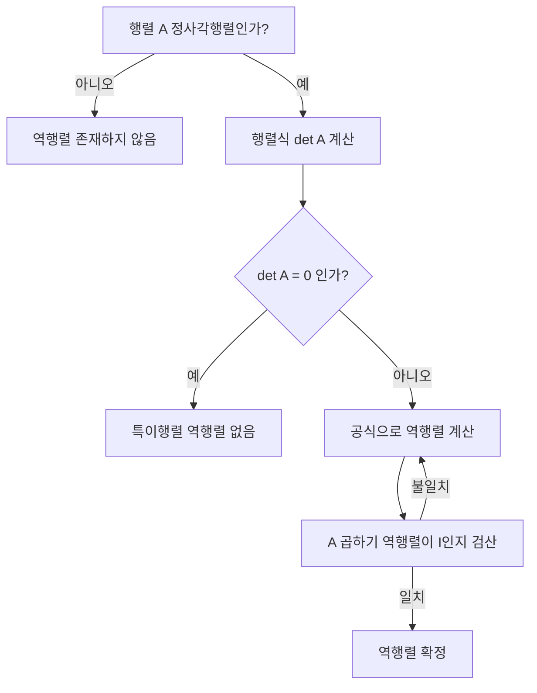

<Callout type="info">
  **이번 문서의 목표:** 행렬을 표기·읽는 법부터 덧셈·스칼라배·곱셈을 손으로 계산할 수 있게 하고, 역행렬이 존재하는 조건과 2×2 역행렬 공식을 검산까지 포함해 정확히 다룰 수 있게 한다.
</Callout>

## 행렬이 왜 필요한가

연립방정식을 풀 때를 생각해 보자.

$$
\begin{cases} 2x + y = 5 \\ x + y = 3 \end{cases}
$$

이 두 식을 풀면 $x=2$, $y=1$이 나온다. 그런데 미지수가 3개, 4개로 늘어나면 식을 하나씩 대입하고 소거하는 과정이 점점 번거로워진다. 이때 숫자들을 표(table) 형태로 가지런히 늘어놓고 표 전체를 하나의 대상처럼 다루면, 여러 식을 한 번에 정리하고 계산할 수 있다. 이렇게 숫자를 직사각형 모양으로 배열한 것이 **행렬**(matrix)이다.

> **쉽게 말하면:** 행렬은 숫자를 가로세로로 나란히 적어 놓은 "숫자 표"다. 표 전체를 하나의 수처럼 더하고 곱하는 규칙을 익히는 것이 이 편의 목표다.

행렬은 단순히 숫자를 보기 좋게 정리하는 도구가 아니다. 연립방정식, 좌표평면 위의 점을 이동·회전시키는 변환, 통계에서 여러 변수를 동시에 다루는 계산 등 다양한 곳에서 등장한다. 독학사 일반수학에서는 그중에서도 **행렬의 표기, 사칙연산에 해당하는 덧셈·스칼라배·곱셈, 그리고 역행렬**을 계산할 수 있는지를 주로 묻는다.

## 행렬의 정의와 표기

### 행렬이란 무엇인가

**행렬**(matrix)은 숫자(또는 문자)를 직사각형 모양으로 배열한 것이다. 가로줄을 **행**(row), 세로줄을 **열**(column)이라 부른다. 행이 $m$개, 열이 $n$개인 행렬을 "$m \times n$ 행렬"이라 하고, 이때 $m \times n$을 그 행렬의 **크기**(size) 또는 **차수**(order)라 한다.

$$
A = \begin{pmatrix} 1 & 2 & 3 \\ 4 & 5 & 6 \end{pmatrix}
$$

- $A$는 행이 2개, 열이 3개이므로 **2×3 행렬**이다.
- 행을 먼저, 열을 나중에 읽는다. "2행 3열"이라고 하면 항상 행의 개수가 먼저 온다. 이 순서를 거꾸로 외우는 것이 가장 흔한 실수이므로, "행(row)은 가로줄, **행부터** 읽는다"고 통째로 기억해 두자.

행렬을 이루는 각 숫자를 **성분**(entry, element)이라 하고, $i$번째 행과 $j$번째 열이 만나는 자리의 성분을 $a_{ij}$로 표기한다.

- $i$ (아이): 행 번호. 위에서부터 몇 번째 행인지.
- $j$ (제이): 열 번호. 왼쪽에서부터 몇 번째 열인지.
- $a_{ij}$: $i$행 $j$열의 성분.

위 행렬 $A$에서 $a_{12}$(에이 원 투, 1행 2열 성분)는 $2$이고, $a_{23}$(2행 3열 성분)는 $6$이다.

일반적으로 $m \times n$ 행렬은 다음과 같이 쓴다.

$$
A = \begin{pmatrix} a_{11} & a_{12} & \cdots & a_{1n} \\ a_{21} & a_{22} & \cdots & a_{2n} \\ \vdots & \vdots & \ddots & \vdots \\ a_{m1} & a_{m2} & \cdots & a_{mn} \end{pmatrix}
$$

- $a_{ij}$: $i$행 $j$열 성분 ($i = 1, 2, \dots, m$, $j = 1, 2, \dots, n$)
- 괄호는 대괄호 `[ ]`로 쓰기도 한다. 뜻은 같다.

### 특수한 모양의 행렬

| 이름 | 조건 | 예시 |
|------|------|------|
| 정사각행렬(square matrix) | 행의 개수와 열의 개수가 같음 ($m = n$) | $\begin{pmatrix} 1 & 2 \\ 3 & 4 \end{pmatrix}$ (2×2) |
| 행벡터(row vector) | 행이 1개 ($1 \times n$) | $\begin{pmatrix} 1 & 2 & 3 \end{pmatrix}$ |
| 열벡터(column vector) | 열이 1개 ($m \times 1$) | $\begin{pmatrix} 1 \\ 2 \\ 3 \end{pmatrix}$ |
| 영행렬(zero matrix) | 모든 성분이 0 | $\begin{pmatrix} 0 & 0 \\ 0 & 0 \end{pmatrix}$ |
| 단위행렬(identity matrix) | 정사각행렬이며 주대각선 성분이 1, 나머지가 0 | $\begin{pmatrix} 1 & 0 \\ 0 & 1 \end{pmatrix}$ |

**주대각선**(main diagonal)이란 정사각행렬에서 왼쪽 위부터 오른쪽 아래로 이어지는 대각선, 즉 $a_{11}, a_{22}, a_{33}, \dots$ 자리를 말한다. 단위행렬은 이 자리만 1이고 나머지는 전부 0인 행렬로, 보통 $I$(아이)로 표기한다. 크기를 강조할 때는 $I_2$, $I_3$처럼 아래첨자를 붙인다.

영행렬은 모든 성분이 0인 행렬로, 보통 $O$(오)로 표기한다. 일반 수의 세계에서 0이 "더해도 값이 변하지 않는 수"이듯, 영행렬은 "더해도 행렬이 변하지 않는 행렬" 역할을 한다. 단위행렬은 일반 수의 세계에서 1이 "곱해도 값이 변하지 않는 수"이듯, "곱해도 행렬이 변하지 않는 행렬" 역할을 한다. 이 대응 관계를 기억해 두면 뒤에서 나올 연산 규칙이 훨씬 자연스럽게 이해된다.

### 두 행렬이 같다는 것

두 행렬 $A$와 $B$가 **같다**(equal)고 하려면 다음 두 조건을 모두 만족해야 한다.

1. 크기가 같다 (행의 개수, 열의 개수가 각각 같다).
2. 대응하는 모든 성분이 같다. 즉 모든 $i, j$에 대해 $a_{ij} = b_{ij}$.

크기가 다르면 아무리 성분이 비슷해 보여도 절대 같은 행렬이 아니다. 예를 들어 $\begin{pmatrix} 1 & 2 \end{pmatrix}$(1×2)와 $\begin{pmatrix} 1 \\ 2 \end{pmatrix}$(2×1)은 숫자는 같지만 크기가 다르므로 서로 다른 행렬이다.

## 행렬의 덧셈과 뺄셈

### 정의

두 행렬 $A$, $B$의 **크기가 같을 때만** 덧셈을 정의할 수 있다. 같은 자리(행, 열이 같은 위치)의 성분끼리 더한다.

$$
A + B = \begin{pmatrix} a_{11} & a_{12} \\ a_{21} & a_{22} \end{pmatrix} + \begin{pmatrix} b_{11} & b_{12} \\ b_{21} & b_{22} \end{pmatrix} = \begin{pmatrix} a_{11}+b_{11} & a_{12}+b_{12} \\ a_{21}+b_{21} & a_{22}+b_{22} \end{pmatrix}
$$

뺄셈도 같은 자리끼리 빼면 된다. $A - B$는 $A + (-B)$, 즉 $B$의 모든 성분에 $-1$을 곱한 행렬을 더하는 것과 같다.

### 작은 예시

$$
A = \begin{pmatrix} 1 & 2 \\ 3 & 4 \end{pmatrix}, \quad B = \begin{pmatrix} 5 & 6 \\ 7 & 8 \end{pmatrix}
$$

$$
A + B = \begin{pmatrix} 1+5 & 2+6 \\ 3+7 & 4+8 \end{pmatrix} = \begin{pmatrix} 6 & 8 \\ 10 & 12 \end{pmatrix}
$$

$$
A - B = \begin{pmatrix} 1-5 & 2-6 \\ 3-7 & 4-8 \end{pmatrix} = \begin{pmatrix} -4 & -4 \\ -4 & -4 \end{pmatrix}
$$

### 자주 틀리는 점

- **크기가 다른 행렬은 아예 더할 수 없다.** "부족한 자리는 0으로 채워서" 더하는 규칙은 존재하지 않는다. 2×3 행렬과 3×2 행렬은 더할 수 없다.
- 덧셈은 교환법칙 $A+B=B+A$와 결합법칙 $(A+B)+C=A+(B+C)$가 성립한다. 이는 일반 수의 덧셈과 같아서 헷갈릴 위험은 적지만, 뒤에 나오는 곱셈에는 교환법칙이 성립하지 않는다는 점과 대비해서 기억해 두자.

## 스칼라배

### 정의

행렬이 아닌 하나의 숫자를 **스칼라**(scalar)라 한다. 스칼라 $k$를 행렬 $A$에 곱하는 **스칼라배**(scalar multiplication)는 $A$의 모든 성분에 $k$를 곱하는 연산이다.

$$
kA = k\begin{pmatrix} a_{11} & a_{12} \\ a_{21} & a_{22} \end{pmatrix} = \begin{pmatrix} ka_{11} & ka_{12} \\ ka_{21} & ka_{22} \end{pmatrix}
$$

- $k$: 스칼라(scalar). 행렬이 아닌 보통의 실수 하나.

### 작은 예시

$$
A = \begin{pmatrix} 1 & 2 \\ 3 & 4 \end{pmatrix}, \quad k = 3
$$

$$
3A = \begin{pmatrix} 3 \times 1 & 3 \times 2 \\ 3 \times 3 & 3 \times 4 \end{pmatrix} = \begin{pmatrix} 3 & 6 \\ 9 & 12 \end{pmatrix}
$$

> **비유:** 스칼라배는 사진을 확대·축소하는 것과 비슷하다. 사진(행렬) 안의 모든 점(성분)이 똑같은 비율로 커지거나 작아진다. $k=1$이면 원래 그대로, $k=-1$이면 상하좌우는 그대로 두고 부호만 뒤집힌다.

## 행렬의 곱셈

행렬 곱셈은 이 단원에서 가장 실수가 잦은 부분이다. 덧셈처럼 "같은 자리끼리 곱한다"고 생각하면 **틀린다.** 정확한 규칙을 순서대로 익히자.

### 곱셈이 가능한 조건

$A$가 $m \times n$ 행렬, $B$가 $p \times q$ 행렬일 때, $AB$를 계산하려면 **$A$의 열의 개수($n$)와 $B$의 행의 개수($p$)가 같아야 한다.** 즉 $n = p$일 때만 곱셈이 가능하고, 그 결과 $AB$는 $m \times q$ 행렬이 된다.

$$
(m \times n) \times (n \times q) = (m \times q)
$$

가운데 두 숫자($n$)가 서로 같아야 곱셈이 성립하고, 바깥쪽 두 숫자($m$, $q$)가 결과 행렬의 크기가 된다는 뜻이다.

### 곱셈의 계산 규칙 — 성분 하나씩

$AB$의 $i$행 $j$열 성분은, **$A$의 $i$행**과 **$B$의 $j$열**을 순서대로 짝지어 곱한 뒤 전부 더한 값이다.

$$
(AB)_{ij} = a_{i1}b_{1j} + a_{i2}b_{2j} + \cdots + a_{in}b_{nj}
$$

- $(AB)_{ij}$: 곱 $AB$의 $i$행 $j$열 성분.
- $a_{i1}, a_{i2}, \dots, a_{in}$: $A$의 $i$번째 행을 이루는 성분들.
- $b_{1j}, b_{2j}, \dots, b_{nj}$: $B$의 $j$번째 열을 이루는 성분들.

이 계산 방식을 흔히 "행 곱하기 열(row times column)"이라 부른다. $A$의 한 행을 가로로, $B$의 한 열을 세로로 놓고, 마주치는 자리끼리 곱해서 다 더하는 것이다.

### 2×2 곱셈 예시 — 전 과정

$$
A = \begin{pmatrix} 1 & 2 \\ 3 & 4 \end{pmatrix}, \quad B = \begin{pmatrix} 5 & 6 \\ 7 & 8 \end{pmatrix}
$$

$A$는 2×2, $B$는 2×2이므로 $A$의 열 개수(2)와 $B$의 행 개수(2)가 같아 곱셈이 가능하고, 결과는 2×2 행렬이다.

**1행 1열 성분** — $A$의 1행 $(1, 2)$과 $B$의 1열 $(5, 7)$을 곱해서 더한다.

$$
(AB)_{11} = 1 \times 5 + 2 \times 7 = 5 + 14 = 19
$$

**1행 2열 성분** — $A$의 1행 $(1, 2)$과 $B$의 2열 $(6, 8)$을 곱해서 더한다.

$$
(AB)_{12} = 1 \times 6 + 2 \times 8 = 6 + 16 = 22
$$

**2행 1열 성분** — $A$의 2행 $(3, 4)$과 $B$의 1열 $(5, 7)$을 곱해서 더한다.

$$
(AB)_{21} = 3 \times 5 + 4 \times 7 = 15 + 28 = 43
$$

**2행 2열 성분** — $A$의 2행 $(3, 4)$과 $B$의 2열 $(6, 8)$을 곱해서 더한다.

$$
(AB)_{22} = 3 \times 6 + 4 \times 8 = 18 + 32 = 50
$$

따라서

$$
AB = \begin{pmatrix} 19 & 22 \\ 43 & 50 \end{pmatrix}
$$

### 크기가 다른 행렬의 곱셈 예시 — 전 과정

$$
A = \begin{pmatrix} 1 & 2 & 3 \\ 4 & 5 & 6 \end{pmatrix} (2\times3), \quad B = \begin{pmatrix} 7 & 8 \\ 9 & 10 \\ 11 & 12 \end{pmatrix} (3\times2)
$$

$A$의 열 개수(3)와 $B$의 행 개수(3)가 같으므로 곱셈이 가능하고, 결과는 $2 \times 2$ 행렬이다.

**1행 1열 성분** — $A$의 1행 $(1,2,3)$과 $B$의 1열 $(7,9,11)$.

$$
(AB)_{11} = 1\times7 + 2\times9 + 3\times11 = 7+18+33 = 58
$$

**1행 2열 성분** — $A$의 1행 $(1,2,3)$과 $B$의 2열 $(8,10,12)$.

$$
(AB)_{12} = 1\times8 + 2\times10 + 3\times12 = 8+20+36 = 64
$$

**2행 1열 성분** — $A$의 2행 $(4,5,6)$과 $B$의 1열 $(7,9,11)$.

$$
(AB)_{21} = 4\times7 + 5\times9 + 6\times11 = 28+45+66 = 139
$$

**2행 2열 성분** — $A$의 2행 $(4,5,6)$과 $B$의 2열 $(8,10,12)$.

$$
(AB)_{22} = 4\times8 + 5\times10 + 6\times12 = 32+50+72 = 154
$$

따라서

$$
AB = \begin{pmatrix} 58 & 64 \\ 139 & 154 \end{pmatrix}
$$

이 경우 $BA$도 계산이 되는지 확인해 보자. $B$는 3×2, $A$는 2×3이므로 $B$의 열 개수(2)와 $A$의 행 개수(2)가 같아 $BA$도 계산할 수 있지만, 결과는 $3\times3$ 행렬이 되어 $AB$(2×2)와는 크기 자체가 다르다. 이것이 바로 다음 절에서 강조하는 "행렬 곱셈은 순서를 바꿀 수 없다"는 성질의 가장 분명한 증거다.

### 곱셈의 성질 — 특히 교환법칙이 깨진다

- **교환법칙이 성립하지 않는다:** 일반적으로 $AB \neq BA$이다. 심지어 위 예시처럼 한쪽은 계산이 되고 다른 쪽은 크기 자체가 다르게 나오는 경우도 흔하다. 두 행렬이 모두 정사각행렬이라 크기가 같더라도, 성분 값 자체가 달라지는 경우가 대부분이다.
- **결합법칙은 성립한다:** $(AB)C = A(BC)$.
- **분배법칙이 성립한다:** $A(B+C) = AB + AC$, $(A+B)C = AC + BC$.
- 단위행렬 $I$는 곱셈에서 항등원 역할을 한다: $AI = IA = A$ (크기가 맞을 때).

### 자주 틀리는 점

- **덧셈처럼 같은 자리끼리 곱하지 않는다.** $\begin{pmatrix}1&2\\3&4\end{pmatrix}\begin{pmatrix}5&6\\7&8\end{pmatrix}$를 $\begin{pmatrix}5&12\\21&32\end{pmatrix}$처럼 계산하면 완전히 틀린 답이다. 반드시 "행 곱하기 열, 곱해서 더하기" 규칙을 따라야 한다.
- **곱셈 순서를 바꾸면 안 된다.** 문제에서 $AB$를 물었는데 $BA$를 계산해서 답하는 실수가 매우 잦다. 어느 행렬이 앞에 오는지 항상 확인한다.
- **곱셈이 정의되는지부터 확인한다.** 앞 행렬의 열 개수와 뒤 행렬의 행 개수가 다르면 곱셈 자체가 성립하지 않는다. 계산을 시작하기 전에 크기부터 적어 두는 습관을 들이자.

## 역행렬의 의미와 존재 조건

### 왜 필요한가

일반 수에서 $2x = 6$을 풀 때 양변에 $2$의 역수 $\frac{1}{2}$을 곱해 $x=3$을 구한다. 행렬로 이루어진 방정식 $AX = B$를 풀 때도 같은 아이디어를 쓰고 싶다. 이때 필요한 것이 $A$의 "역수"에 해당하는 **역행렬**(inverse matrix)이다.

> **쉽게 말하면:** 역행렬은 원래 행렬과 곱했을 때 단위행렬 $I$가 되게 만드는 행렬이다. 일반 수에서 $a \times a^{-1} = 1$인 것과 같은 관계다.

### 정의

정사각행렬 $A$에 대해, $AA^{-1} = A^{-1}A = I$를 만족하는 행렬 $A^{-1}$(에이 인버스, $A$의 역행렬)이 존재하면 $A$를 **가역행렬**(invertible matrix) 또는 **정칙행렬**(regular matrix)이라 한다.

- $A^{-1}$: $A$의 역행렬. 위첨자 $-1$은 지수가 아니라 "역행렬"을 나타내는 기호다.
- $I$: 단위행렬. $A$와 크기가 같은 정사각행렬이어야 한다.

역행렬은 오직 **정사각행렬에서만** 정의된다. 행과 열의 개수가 다른 행렬(예: 2×3 행렬)은 애초에 역행렬을 가질 수 없다.

### 존재 조건

정사각행렬이라고 해서 항상 역행렬을 갖는 것은 아니다. 2×2 행렬 $A = \begin{pmatrix} a & b \\ c & d \end{pmatrix}$의 경우, **행렬식(determinant)** $ad - bc$의 값이 역행렬 존재 여부를 결정한다. 행렬식의 일반적인 성질과 3×3 이상으로의 확장은 다음 편(18편, 행렬식과 벡터 기초)에서 자세히 다루므로, 여기서는 2×2 역행렬 계산에 필요한 만큼만 사용한다.

$$
\det(A) = ad - bc
$$

- $\det(A)$: $A$의 행렬식. "디터미넌트 에이"라고 읽는다.

**$\det(A) \neq 0$일 때만** $A$는 역행렬을 가진다. $\det(A) = 0$이면 역행렬이 존재하지 않으며, 이런 행렬을 **특이행렬**(singular matrix)이라 부른다.

### 2×2 역행렬 공식

$\det(A) = ad-bc \neq 0$일 때,

$$
A^{-1} = \frac{1}{ad-bc}\begin{pmatrix} d & -b \\ -c & a \end{pmatrix}
$$

- 분자의 행렬: 원래 행렬에서 주대각선($a$, $d$) 두 성분의 자리를 서로 바꾸고, 나머지 두 성분($b$, $c$)의 부호를 반대로 바꾼 것.
- $\frac{1}{ad-bc}$: 행렬식의 역수를 전체 행렬에 스칼라배로 곱한다.

### 계산 예시 — 검산까지 전 과정

$$
A = \begin{pmatrix} 2 & 1 \\ 1 & 1 \end{pmatrix}
$$

**1단계 — 행렬식 계산**

$$
\det(A) = 2\times1 - 1\times1 = 2-1 = 1
$$

$\det(A) = 1 \neq 0$이므로 $A$는 역행렬을 가진다.

**2단계 — 공식에 대입**

$a=2$, $b=1$, $c=1$, $d=1$을 공식 $A^{-1} = \frac{1}{ad-bc}\begin{pmatrix} d & -b \\ -c & a \end{pmatrix}$에 대입한다.

$$
A^{-1} = \frac{1}{1}\begin{pmatrix} 1 & -1 \\ -1 & 2 \end{pmatrix} = \begin{pmatrix} 1 & -1 \\ -1 & 2 \end{pmatrix}
$$

**3단계 — 검산 ($AA^{-1} = I$인지 확인)**

$$
AA^{-1} = \begin{pmatrix} 2 & 1 \\ 1 & 1 \end{pmatrix}\begin{pmatrix} 1 & -1 \\ -1 & 2 \end{pmatrix}
$$

1행 1열: $2\times1 + 1\times(-1) = 2-1 = 1$
1행 2열: $2\times(-1) + 1\times2 = -2+2 = 0$
2행 1열: $1\times1 + 1\times(-1) = 1-1 = 0$
2행 2열: $1\times(-1) + 1\times2 = -1+2 = 1$

$$
AA^{-1} = \begin{pmatrix} 1 & 0 \\ 0 & 1 \end{pmatrix} = I
$$

검산 결과 단위행렬 $I$가 정확히 나왔으므로, 앞서 구한 $A^{-1} = \begin{pmatrix} 1 & -1 \\ -1 & 2 \end{pmatrix}$는 올바른 역행렬이다. 실전에서는 이렇게 곱셈 결과가 단위행렬인지 반드시 확인하는 습관을 들여야 계산 실수를 스스로 잡아낼 수 있다.

### 역행렬이 존재하지 않는 예시

$$
B = \begin{pmatrix} 2 & 4 \\ 1 & 2 \end{pmatrix}
$$

$$
\det(B) = 2\times2 - 4\times1 = 4-4 = 0
$$

$\det(B) = 0$이므로 $B$는 역행렬을 갖지 않는다(특이행렬). 이 행렬의 두 행 $(2,4)$와 $(1,2)$을 보면 $(2,4) = 2\times(1,2)$로, 한 행이 다른 행의 스칼라배 관계에 있다. 이렇게 두 행(또는 두 열)이 서로 비례하면 행렬식이 항상 0이 되어 역행렬이 존재하지 않는다는 점을 함께 기억해 두면 존재 조건을 직관적으로 판단하는 데 도움이 된다.

### 자주 틀리는 점

- **정사각행렬이 아닌데 역행렬을 구하려고 시도한다.** 2×3, 3×2처럼 행과 열의 개수가 다른 행렬은 역행렬 자체가 정의되지 않는다.
- **공식에서 $a$와 $d$의 자리를 바꾸는 것을 빠뜨린다.** $A^{-1}$의 분자 행렬은 주대각선을 맞바꾸고, 나머지 두 자리의 부호만 바꾸는 것이다. 네 성분 모두 부호를 바꾸는 것이 아니다.
- **$\det(A)=0$인지 확인하지 않고 공식부터 대입한다.** 분모가 0이 되는 경우를 놓치면 "역행렬이 존재하지 않는다"가 정답인 문제를 잘못된 수로 나눠 엉뚱한 답을 낸다.
- **역행렬을 구한 뒤 검산을 생략한다.** $AA^{-1}=I$가 되는지 확인하지 않으면, 대입 과정에서 부호 하나를 놓쳐도 알아채지 못한다.

## 개념 흐름 정리

## 핵심 정리

- 행렬은 숫자를 $m \times n$ 형태로 배열한 표이며, $a_{ij}$는 $i$행 $j$열 성분을 뜻한다.
- 덧셈·뺄셈은 크기가 같은 행렬끼리 같은 자리 성분을 더하고 빼며, 스칼라배는 모든 성분에 같은 수를 곱한다.
- 곱셈 $AB$는 앞 행렬의 열 개수와 뒤 행렬의 행 개수가 같아야 가능하며, "행 곱하기 열, 곱해서 더하기" 규칙으로 계산한다. $AB \neq BA$가 일반적이다.
- 정사각행렬 $A$는 $\det(A) \neq 0$일 때만 역행렬 $A^{-1}$을 가지며, 2×2 행렬은 $A^{-1} = \frac{1}{ad-bc}\begin{pmatrix} d & -b \\ -c & a \end{pmatrix}$로 구한다.
- 역행렬을 구한 뒤에는 $AA^{-1}=I$가 되는지 검산해 계산 실수를 스스로 확인한다.

## 마무리 복습

<Quiz
  questionNumber={1}
  question="3×2 행렬 A와 2×4 행렬 B가 있을 때, AB의 크기는 무엇인가?"
  options={['3×2', '2×4', '3×4', '4×3']}
  correctAnswer={3}
  explanation="A(3×2)와 B(2×4)를 곱할 때, 가운데 두 수(A의 열 2, B의 행 2)가 같으므로 곱셈이 가능하고, 결과 크기는 바깥쪽 두 수인 A의 행(3)과 B의 열(4)을 써서 3×4가 된다."
  optionExplanations={['행의 개수만 남긴 잘못된 크기다.', '열의 개수만 남긴 잘못된 크기다.', 'A의 행 개수와 B의 열 개수를 그대로 가져온 정답이다.', '순서를 반대로 계산한 크기다.']}
/>

<Quiz
  questionNumber={2}
  question="A = [[1,2],[3,4]], B = [[0,1],[1,0]]일 때 AB의 1행 1열 성분은 얼마인가?"
  options={['0', '1', '2', '3']}
  correctAnswer={3}
  explanation="AB의 1행 1열 성분은 A의 1행 (1,2)와 B의 1열 (0,1)을 곱해서 더한 값이다. 1×0 + 2×1 = 0+2 = 2이므로 정답은 2다."
  optionExplanations={['계산을 시작조차 하지 않은 값이다.', '두 번째 항만 계산하고 첫 항을 빠뜨린 값이다.', '1×0+2×1=2를 정확히 계산한 값이다.', '다른 자리 성분과 혼동한 값이다.']}
/>

<Quiz
  questionNumber={3}
  question="행렬 A = [[3,6],[1,2]]에 대한 설명으로 옳은 것은?"
  options={['det(A) = 0이므로 역행렬이 존재하지 않는다', 'det(A) = 6이므로 역행렬이 존재한다', 'A는 2×3 행렬이라 역행렬을 정의할 수 없다', 'A는 단위행렬이다']}
  correctAnswer={1}
  explanation="det(A) = 3×2 - 6×1 = 6-6 = 0이다. 행렬식이 0이므로 A는 특이행렬이며 역행렬이 존재하지 않는다. 실제로 A의 두 행 (3,6)과 (1,2)는 (3,6)=3×(1,2)로 서로 비례해 행렬식이 0이 되는 전형적인 경우다."
  optionExplanations={['det(A)=0을 정확히 계산해 역행렬이 없음을 판단한 정답이다.', '행렬식 계산에서 부호나 곱을 잘못 처리한 값이다.', 'A는 2×2 정사각행렬이므로 크기 때문에 역행렬을 정의할 수 없는 것이 아니다.', '단위행렬은 주대각선이 1, 나머지가 0인 행렬로 A와 다르다.']}
/>

<Quiz
  questionNumber={4}
  question="행렬 A = [[4,3],[3,2]]의 역행렬 A^-1은 무엇인가?"
  options={['[[2,-3],[-3,4]]', '[[2,3],[3,4]]', '[[-2,3],[3,-4]]', '[[4,-3],[-3,2]]']}
  correctAnswer={3}
  explanation="det(A) = 4×2 - 3×3 = 8-9 = -1이다. 공식 A^-1 = (1/det(A))[[d,-b],[-c,a]]에 대입하면 (1/-1)×[[2,-3],[-3,4]] = [[-2,3],[3,-4]]가 된다. 검산으로 확인하면, A 곱하기 [[-2,3],[3,-4]]의 1행1열은 4×(-2)+3×3=-8+9=1, 1행2열은 4×3+3×(-4)=12-12=0, 2행1열은 3×(-2)+2×3=-6+6=0, 2행2열은 3×3+2×(-4)=9-8=1이 되어 단위행렬이 정확히 나오므로 이 답이 옳다."
  optionExplanations={['det(A)=-1로 나누는 과정에서 부호를 반영하지 않은 값이다.', '주대각선을 맞바꾸지 않고 그대로 둔 값이다.', '검산까지 단위행렬이 되는 정답이다.', '분모(det)를 아예 곱하지 않은 값이다.']}
/>

<Quiz
  questionNumber={5}
  question="행렬 곱셈에 대한 설명 중 옳지 않은 것은?"
  options={['일반적으로 AB와 BA는 같지 않다', '단위행렬 I는 AI = IA = A를 만족한다', '행렬 곱셈은 같은 자리 성분끼리 곱하는 연산이다', 'A(BC) = (AB)C가 성립한다']}
  correctAnswer={3}
  explanation="행렬 곱셈은 같은 자리끼리 곱하는 것이 아니라, 앞 행렬의 행과 뒤 행렬의 열을 짝지어 곱한 뒤 더하는 연산이다(행 곱하기 열). 이 설명이 틀렸으므로 정답은 3번이다."
  optionExplanations={['행렬 곱셈은 교환법칙이 성립하지 않는 것이 맞는 설명이다.', '단위행렬의 성질을 올바르게 설명하고 있다.', '같은 자리끼리 곱한다는 설명은 틀렸다 — 행 곱하기 열 규칙을 따라야 한다.', '결합법칙은 행렬 곱셈에서 성립하는 성질이다.']}
/>

<Quiz
  questionNumber={6}
  question="영행렬 O와 단위행렬 I에 대한 설명으로 옳은 것은?"
  options={['O는 모든 성분이 1이다', 'I는 정사각행렬이 아니어도 정의된다', 'A + O = A가 항상 성립한다', 'A × O = A가 항상 성립한다']}
  correctAnswer={3}
  explanation="영행렬 O는 모든 성분이 0인 행렬로, 덧셈에서 항등원 역할을 하므로 A + O = A가 항상 성립한다(크기가 같을 때). O는 모든 성분이 0이지 1이 아니며, 단위행렬 I는 반드시 정사각행렬이어야 하고, A×O는 A가 아니라 영행렬이 된다."
  optionExplanations={['영행렬은 모든 성분이 0이지 1이 아니다.', '단위행렬은 주대각선 개념이 필요하므로 반드시 정사각행렬이어야 한다.', '영행렬은 덧셈의 항등원이므로 이 설명이 옳다.', 'A에 영행렬을 곱하면 결과는 A가 아니라 영행렬이 된다.']}
/>

## 참고 자료

- [독학사 일반수학 공부방법 블로그 안내](https://bdes.nile.or.kr) — 행렬·행렬식 등 주요 출제 단원을 확인하는 데 참고
- [Matrix Multiplication – Wolfram MathWorld](https://mathworld.wolfram.com/MatrixMultiplication.html) — 행렬 곱셈의 정의와 성질에 대한 수학적 1차 출처
