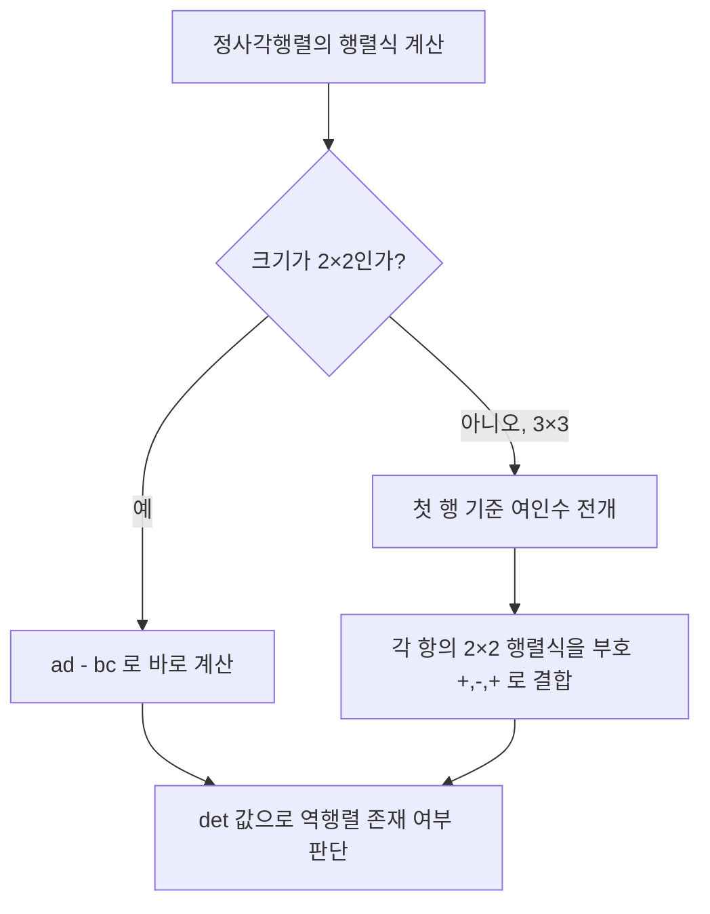

<Callout type="info">
  **이번 문서의 목표:** 2×2·3×3 행렬식을 손으로 정확히 계산하고 그 성질을 이해하며, 벡터를 성분으로 표기해 덧셈·스칼라배·내적을 계산할 수 있게 한다.
</Callout>

## 행렬식이 왜 필요한가

17편에서 2×2 행렬의 역행렬을 구할 때 $ad-bc$라는 값이 0인지 아닌지가 역행렬 존재 여부를 갈랐다. 이 $ad-bc$가 바로 **행렬식**(determinant)의 한 예다. 행렬식은 정사각행렬 하나에 대응하는 숫자 하나로, "이 행렬이 역행렬을 가지는가", "이 행렬이 나타내는 변환이 넓이나 부피를 몇 배로 바꾸는가" 같은 질문에 답을 준다.

> **쉽게 말하면:** 행렬식은 정사각행렬을 딱 하나의 숫자로 요약한 값이다. 이 값이 0이면 역행렬이 없고, 0이 아니면 역행렬이 있다.

이 편에서는 2×2와 3×3 행렬식을 계산하는 절차, 행렬식의 주요 성질을 다룬 뒤, 화살표로 크기와 방향을 나타내는 **벡터**(vector)의 정의와 기본 연산(합·스칼라배·내적)을 성분 계산 중심으로 정리한다. 행렬식과 벡터는 직접적인 선행 관계는 없지만, 둘 다 "숫자를 여러 개 묶어 하나의 대상으로 다루고 정해진 규칙으로 계산한다"는 점에서 이 단원의 한 축을 이룬다.

## 2×2 행렬식

### 정의와 계산

정사각행렬 $A = \begin{pmatrix} a & b \\ c & d \end{pmatrix}$의 행렬식은 다음과 같이 정의한다.

$$
\det(A) = \begin{vmatrix} a & b \\ c & d \end{vmatrix} = ad - bc
$$

- $\det(A)$ 또는 $|A|$: $A$의 행렬식. 괄호 $( )$ 대신 세로줄 $| \ |$을 쓰면 "이건 행렬이 아니라 그 행렬식(하나의 숫자)이다"라는 뜻이 된다.
- 계산 방법: 주대각선($a$와 $d$)의 곱에서, 다른 대각선($b$와 $c$)의 곱을 뺀다.

### 계산 예시

$$
A = \begin{pmatrix} 3 & 4 \\ 2 & 5 \end{pmatrix}
$$

$$
\det(A) = 3\times5 - 4\times2 = 15-8 = 7
$$

$\det(A) = 7 \neq 0$이므로 $A$는 역행렬을 갖는다(존재 조건은 17편 참조).

## 3×3 행렬식 — 여인수 전개

### 계산 절차

3×3 행렬의 행렬식은 2×2 행렬식으로 잘게 쪼개어 계산한다. 이 방법을 **여인수 전개(cofactor expansion)** 또는 **첫 행 전개**라 한다.

$$
A = \begin{pmatrix} a_{11} & a_{12} & a_{13} \\ a_{21} & a_{22} & a_{23} \\ a_{31} & a_{32} & a_{33} \end{pmatrix}
$$

1행을 기준으로 전개하면 다음과 같다.

$$
\det(A) = a_{11}\begin{vmatrix} a_{22} & a_{23} \\ a_{32} & a_{33} \end{vmatrix} - a_{12}\begin{vmatrix} a_{21} & a_{23} \\ a_{31} & a_{33} \end{vmatrix} + a_{13}\begin{vmatrix} a_{21} & a_{22} \\ a_{31} & a_{32} \end{vmatrix}
$$

- 각 항의 2×2 행렬식은, $a_{1j}$가 속한 **행과 열을 지우고 남은** 나머지 성분들로 만든다. 예를 들어 $a_{11}$의 짝은 1행과 1열을 지우고 남은 $\begin{pmatrix} a_{22} & a_{23} \\ a_{32} & a_{33} \end{pmatrix}$이다.
- 부호는 $+, -, +$ 순서로 번갈아 붙는다. 이 부호는 자리 $(1,1), (1,2), (1,3)$의 "행+열이 짝수면 +, 홀수면 -"라는 규칙(체스판처럼 $+,-,+,-,\dots$가 번갈아 나오는 무늬)에서 나온다.

### 계산 예시 — 전 과정

$$
M = \begin{pmatrix} 1 & 2 & 3 \\ 0 & 1 & 4 \\ 5 & 6 & 0 \end{pmatrix}
$$

**1단계 — 첫 행의 각 성분에 대응하는 2×2 행렬식을 만든다.**

$a_{11}=1$의 짝: 1행·1열을 지운 나머지

$$
\begin{vmatrix} 1 & 4 \\ 6 & 0 \end{vmatrix} = 1\times0 - 4\times6 = 0-24 = -24
$$

$a_{12}=2$의 짝: 1행·2열을 지운 나머지

$$
\begin{vmatrix} 0 & 4 \\ 5 & 0 \end{vmatrix} = 0\times0 - 4\times5 = 0-20 = -20
$$

$a_{13}=3$의 짝: 1행·3열을 지운 나머지

$$
\begin{vmatrix} 0 & 1 \\ 5 & 6 \end{vmatrix} = 0\times6 - 1\times5 = 0-5 = -5
$$

**2단계 — 부호 $+,-,+$를 붙여 더한다.**

$$
\det(M) = 1\times(-24) - 2\times(-20) + 3\times(-5)
$$

**3단계 — 각 항을 계산한다.**

$$
1\times(-24) = -24
$$

$$
-2\times(-20) = 40
$$

$$
3\times(-5) = -15
$$

**4단계 — 전부 더한다.**

$$
\det(M) = -24+40-15 = 1
$$

$\det(M) = 1$이므로 $M$은 역행렬을 갖는 정사각행렬이다.

### 행렬식의 성질

| 성질 | 내용 | 예시로 확인 |
|------|------|-------------|
| 삼각행렬 | 주대각선 위(또는 아래)가 전부 0인 삼각행렬의 행렬식은 주대각선 성분들의 곱 | $\begin{vmatrix} 2&5\\0&3 \end{vmatrix}=2\times3=6$ |
| 행(열) 교환 | 두 행(또는 두 열)을 서로 바꾸면 행렬식의 부호가 반대로 바뀐다 | $\begin{vmatrix} 1&2\\3&4 \end{vmatrix}=-2$, 행 교환 후 $\begin{vmatrix} 3&4\\1&2 \end{vmatrix}=2$ |
| 행(열)의 스칼라배 | 한 행(또는 열) 전체에 $k$를 곱하면 행렬식 전체도 $k$배가 된다 | $\begin{vmatrix} 2&4\\1&1 \end{vmatrix}=-2$는 $\begin{vmatrix} 1&2\\1&1 \end{vmatrix}=-1$의 2배 |
| 곱에 대한 성질 | $\det(AB) = \det(A)\det(B)$ | 두 행렬을 곱한 뒤 행렬식을 구한 값과, 각각의 행렬식을 곱한 값이 같다 |
| 단위행렬 | $\det(I) = 1$ | $I$는 곱해도 행렬을 바꾸지 않으므로 그 "배율"도 1이다 |
| 비례하는 행(열) | 한 행(또는 열)이 다른 행(또는 열)의 스칼라배이면 행렬식은 0 | 17편의 특이행렬 예시 $\begin{pmatrix} 2&4\\1&2 \end{pmatrix}$ 참고 |

곱에 대한 성질 $\det(AB) = \det(A)\det(B)$을 앞의 2×2 예시로 직접 확인해 보자. 17편에서 $A=\begin{pmatrix}1&2\\3&4\end{pmatrix}$, $B=\begin{pmatrix}5&6\\7&8\end{pmatrix}$의 곱을 $AB=\begin{pmatrix}19&22\\43&50\end{pmatrix}$로 구한 바 있다.

$$
\det(A) = 1\times4-2\times3 = 4-6 = -2
$$

$$
\det(B) = 5\times8-6\times7 = 40-42 = -2
$$

$$
\det(A)\det(B) = (-2)\times(-2) = 4
$$

$$
\det(AB) = 19\times50-22\times43 = 950-946 = 4
$$

$\det(AB)=4$와 $\det(A)\det(B)=4$가 정확히 일치한다. 이렇게 두 가지 방법으로 같은 값이 나오는지 확인하는 것도 유용한 검산 수단이다.

### 자주 틀리는 점

- **여인수 전개에서 부호를 빠뜨린다.** $+,-,+$ 순서를 잊고 전부 더하기만 하면 답이 틀린다.
- **지워야 할 행과 열을 잘못 고른다.** $a_{12}$의 짝을 만들 때는 1행과 **2열**을 지워야 하는데, 실수로 다른 열을 지우는 경우가 많다.
- **행(열) 교환 시 부호 반전을 잊는다.** 문제에서 행을 바꾼 행렬의 행렬식을 물으면, 원래 행렬식에 $-1$을 곱하는 것을 놓치기 쉽다.

## 벡터의 정의

### 왜 필요한가

행렬이 숫자를 표 형태로 묶은 것이라면, **벡터**(vector)는 크기와 방향을 함께 가지는 양을 숫자의 나열로 표현한 것이다. 예를 들어 "동쪽으로 3km, 북쪽으로 4km 이동했다"는 상황은 하나의 숫자로는 표현할 수 없지만, $(3, 4)$라는 순서쌍으로는 방향과 거리를 동시에 담을 수 있다.

> **쉽게 말하면:** 벡터는 "몇 칸 오른쪽으로, 몇 칸 위로"처럼 방향과 크기를 숫자 여러 개로 짝지어 나타낸 것이다.

### 성분 표기

평면 위의 벡터는 순서쌍 $(x, y)$로, 공간 위의 벡터는 순서쌍 $(x, y, z)$로 나타낸다. 이 각각의 숫자를 벡터의 **성분**(component)이라 한다. 벡터는 보통 화살표를 얹은 문자 $\vec{v}$ 또는 굵은 글씨 $\mathbf{v}$로 표기한다.

$$
\vec{v} = (v_1, v_2)
$$

- $\vec{v}$: 벡터 $v$. 화살표는 "크기와 방향을 가진 양"임을 나타낸다.
- $v_1, v_2$: 벡터의 성분(component). 각각 $x$축 방향, $y$축 방향의 이동량을 뜻한다.

벡터는 열벡터(세로로 배열한 $1$열짜리 행렬) 형태로도 쓸 수 있다.

$$
\vec{v} = \begin{pmatrix} v_1 \\ v_2 \end{pmatrix}
$$

이는 17편에서 배운 $m \times 1$ 크기의 행렬, 즉 열벡터와 형태가 같다. 벡터를 이렇게 쓰면 행렬 연산 규칙을 그대로 적용할 수 있다는 장점이 있다.

### 벡터와 스칼라의 구분

벡터는 크기와 방향을 함께 갖는 양이고, **스칼라**(scalar)는 방향 없이 크기만 갖는 하나의 수다. 예를 들어 "속도(velocity) 시속 60km, 북쪽 방향"은 벡터이지만, "속력(speed) 시속 60km"는 방향 정보가 없는 스칼라다. 이 둘을 구분하는 것이 벡터 개념의 출발점이다.

## 벡터의 합과 스칼라배

### 벡터의 합

두 벡터의 합은 **같은 자리(같은 성분끼리)** 더한다. 이는 행렬의 덧셈과 완전히 같은 규칙이다.

$$
\vec{a} + \vec{b} = (a_1, a_2) + (b_1, b_2) = (a_1+b_1, \ a_2+b_2)
$$

**작은 예시**

$$
\vec{a} = (2, 3), \quad \vec{b} = (4, -1)
$$

$$
\vec{a} + \vec{b} = (2+4, \ 3+(-1)) = (6, 2)
$$

> **비유:** 벡터의 합은 "동쪽으로 2칸, 북쪽으로 3칸 간 다음, 다시 동쪽으로 4칸, 남쪽으로 1칸 가는 것"을 하나의 이동으로 합친 결과와 같다. 최종적으로 동쪽 6칸, 북쪽 2칸을 이동한 셈이 된다.

### 벡터의 스칼라배

벡터의 스칼라배도 행렬의 스칼라배와 같은 규칙으로, 모든 성분에 같은 수를 곱한다.

$$
k\vec{a} = k(a_1, a_2) = (ka_1, \ ka_2)
$$

**작은 예시**

$$
\vec{a} = (2, 3), \quad k=3
$$

$$
3\vec{a} = (3\times2, \ 3\times3) = (6, 9)
$$

$k>0$이면 벡터의 방향은 그대로이고 크기만 $k$배가 된다. $k<0$이면 크기가 $|k|$배로 바뀌면서 방향이 정반대로 뒤집힌다. $k=0$이면 크기가 0인 벡터, 즉 **영벡터(zero vector)** $\vec{0}=(0,0)$가 된다.

## 벡터의 내적

### 왜 필요한가

두 벡터를 더하거나 스칼라를 곱하면 그 결과도 벡터다. 그런데 두 벡터가 "얼마나 같은 방향을 향하는지"를 하나의 숫자로 나타내고 싶을 때가 있다. 이때 쓰는 연산이 **내적**(dot product, 스칼라곱)이다. 벡터 두 개를 연산했는데 결과가 벡터가 아니라 하나의 숫자(스칼라)가 나오는 것이 내적의 가장 큰 특징이다.

> **쉽게 말하면:** 내적은 두 벡터를 넣으면 숫자 하나가 나오는 연산이다. 두 벡터가 비슷한 방향을 향할수록 큰 값이 나온다.

### 성분을 이용한 내적 계산

$$
\vec{a} \cdot \vec{b} = (a_1, a_2)\cdot(b_1, b_2) = a_1b_1 + a_2b_2
$$

- $\vec{a}\cdot\vec{b}$: $\vec{a}$와 $\vec{b}$의 내적. 두 벡터 사이의 점(dot)으로 표기해 "내적"임을 나타낸다.
- $a_1b_1$: 두 벡터의 $x$성분끼리의 곱.
- $a_2b_2$: 두 벡터의 $y$성분끼리의 곱.

공간벡터(성분이 3개)의 내적도 같은 방식으로 확장한다.

$$
\vec{a}\cdot\vec{b} = a_1b_1+a_2b_2+a_3b_3
$$

### 계산 예시

$$
\vec{a}=(1,2), \quad \vec{b}=(3,4)
$$

$$
\vec{a}\cdot\vec{b} = 1\times3 + 2\times4 = 3+8 = 11
$$

공간벡터 예시도 확인해 보자.

$$
\vec{a}=(1,0,2), \quad \vec{b}=(3,-1,4)
$$

$$
\vec{a}\cdot\vec{b} = 1\times3 + 0\times(-1) + 2\times4 = 3+0+8 = 11
$$

### 내적 값의 의미

내적 값의 부호는 두 벡터의 방향 관계를 알려준다.

| 내적 값 | 방향 관계 |
|---------|-----------|
| 양수 | 두 벡터가 대체로 같은 방향을 향함(사잇각이 90도보다 작음) |
| 0 | 두 벡터가 서로 수직(직각)임 |
| 음수 | 두 벡터가 대체로 반대 방향을 향함(사잇각이 90도보다 큼) |

예를 들어 $\vec{a}=(1,0)$과 $\vec{b}=(0,1)$의 내적은 $1\times0+0\times1=0$으로, 이는 두 벡터가 각각 $x$축, $y$축 방향을 가리키는 서로 수직인 벡터라는 사실과 정확히 일치한다.

### 자주 틀리는 점

- **내적의 결과를 벡터로 착각한다.** 내적은 항상 스칼라(숫자 하나)이지, $(x,y)$ 형태의 벡터가 아니다.
- **성분의 개수가 다른 벡터끼리 내적을 시도한다.** 평면벡터(성분 2개)와 공간벡터(성분 3개)는 내적을 정의할 수 없다. 성분 개수가 같은 벡터끼리만 계산한다.
- **벡터의 합과 내적을 혼동한다.** 합은 $(a_1+b_1, a_2+b_2)$처럼 결과가 벡터이고, 내적은 $a_1b_1+a_2b_2$처럼 결과가 숫자다. 기호도 $+$와 $\cdot$로 다르게 쓴다.

## 개념 흐름 정리

## 핵심 정리

- 2×2 행렬식은 $\det(A)=ad-bc$로 계산하고, 3×3 행렬식은 첫 행을 기준으로 여인수 전개하여 2×2 행렬식으로 쪼개 계산한다. 부호는 $+,-,+$ 순서로 번갈아 붙인다.
- 행렬식은 행(열) 교환 시 부호가 바뀌고, 한 행(열)의 스칼라배만큼 전체 값도 스칼라배되며, $\det(AB)=\det(A)\det(B)$가 성립한다.
- 벡터는 크기와 방향을 성분 $(v_1, v_2)$ 또는 $(v_1,v_2,v_3)$로 나타낸 양이며, 합과 스칼라배는 행렬과 같은 방식(같은 자리끼리)으로 계산한다.
- 내적 $\vec{a}\cdot\vec{b}=a_1b_1+a_2b_2(+a_3b_3)$은 결과가 스칼라이며, 그 부호로 두 벡터의 방향 관계(같은 방향·수직·반대 방향)를 판단할 수 있다.

## 마무리 복습

<Quiz
  questionNumber={1}
  question="행렬 A = [[2,3],[1,4]]의 행렬식 det(A)는 얼마인가?"
  options={['5', '8', '11', '-5']}
  correctAnswer={1}
  explanation="det(A) = ad-bc = 2×4 - 3×1 = 8-3 = 5이다. 주대각선(2,4)의 곱에서 다른 대각선(3,1)의 곱을 빼면 5가 나온다."
  optionExplanations={['2×4-3×1=8-3=5를 정확히 계산한 정답이다.', '두 곱을 빼지 않고 더한 값이다.', '곱셈 자체를 잘못 계산한 값이다.', '부호를 반대로 계산한 값이다.']}
/>

<Quiz
  questionNumber={2}
  question="행렬 M = [[2,0,1],[1,3,0],[0,1,2]]의 행렬식을 첫 행 기준으로 여인수 전개할 때, a12=0에 대응하는 항의 부호는 무엇인가?"
  options={['+', '-', '0이라 부호가 없다', '곱셈 순서에 따라 달라진다']}
  correctAnswer={2}
  explanation="첫 행 기준 여인수 전개의 부호는 자리 (1,1),(1,2),(1,3) 순서로 +,-,+가 번갈아 나온다. a12는 두 번째 자리이므로 부호는 -이다. 성분 값이 0이어도 부호 규칙 자체는 자리에 의해 정해지며 값과는 무관하다."
  optionExplanations={['(1,2) 자리는 -부호가 맞는 자리다.', '(1,1),(1,2),(1,3)의 부호는 +,-,+ 순서이므로 두 번째 자리는 -가 맞다.', '성분이 0이어도 부호 규칙은 자리에 따라 정해지므로 부호가 사라지지 않는다.', '부호는 성분의 자리로 정해지며 곱셈 순서와는 무관하다.']}
/>

<Quiz
  questionNumber={3}
  question="행렬 A의 두 행을 서로 바꾸어 얻은 행렬을 B라 할 때, det(A)=6이면 det(B)는 얼마인가?"
  options={['6', '-6', '0', '36']}
  correctAnswer={2}
  explanation="행렬식의 성질에 따르면, 두 행(또는 두 열)을 서로 바꾸면 행렬식의 부호가 반대로 바뀐다. det(A)=6이었으므로 행을 교환한 B의 행렬식은 -6이다."
  optionExplanations={['행 교환 시 부호가 바뀐다는 성질을 반영하지 않은 값이다.', '부호 반전 성질을 정확히 적용한 정답이다.', '행렬식이 0이 되는 경우는 행이 비례할 때이며, 단순 교환으로는 0이 되지 않는다.', 'det(A)를 제곱한 값으로, 행 교환 성질과는 무관하다.']}
/>

<Quiz
  questionNumber={4}
  question="벡터 a=(3,-2)와 b=(-1,5)의 합 a+b는 무엇인가?"
  options={['(2,3)', '(-3,-10)', '(4,-7)', '(2,7)']}
  correctAnswer={1}
  explanation="벡터의 합은 같은 자리 성분끼리 더한다. x성분은 3+(-1)=2, y성분은 -2+5=3이므로 a+b=(2,3)이다."
  optionExplanations={['3+(-1)=2, -2+5=3을 정확히 계산한 정답이다.', '덧셈이 아니라 곱셈으로 계산한 값이다.', '두 번째 성분에서 뺄셈을 잘못 적용한 값이다.', 'x성분 계산에서 부호를 잘못 처리한 값이다.']}
/>

<Quiz
  questionNumber={5}
  question="벡터 a=(2,1,-3)과 b=(1,4,2)의 내적 a·b는 얼마인가?"
  options={['0', '3', '9', '-3']}
  correctAnswer={1}
  explanation="내적은 성분끼리 곱해서 모두 더한다. a·b = 2×1 + 1×4 + (-3)×2 = 2+4-6 = 0이다. 내적이 0이므로 두 벡터는 서로 수직 관계에 있다."
  optionExplanations={['2+4-6=0을 정확히 계산한 정답이며, 두 벡터가 서로 수직임을 뜻한다.', '마지막 항의 부호를 반영하지 않은 값이다.', '곱을 모두 더하지 않고 부호를 잘못 처리한 값이다.', '계산 과정에서 부호를 반대로 처리한 값이다.']}
/>

<Quiz
  questionNumber={6}
  question="벡터와 내적에 대한 설명 중 옳지 않은 것은?"
  options={['벡터의 스칼라배에서 k가 0보다 작으면 방향이 반대로 바뀐다', '내적의 결과는 항상 스칼라(하나의 숫자)이다', '두 벡터의 내적이 0이면 두 벡터는 서로 수직이다', '벡터의 합의 결과는 스칼라이다']}
  correctAnswer={4}
  explanation="벡터의 합은 같은 자리 성분끼리 더한 것으로 그 결과도 벡터다. '벡터의 합의 결과는 스칼라이다'라는 설명이 틀렸으므로 정답은 4번이다. 나머지 설명은 모두 벡터·내적의 올바른 성질이다."
  optionExplanations={['스칼라가 음수이면 방향이 반대로 바뀐다는 설명은 옳다.', '내적의 결과가 스칼라라는 설명은 옳다.', '내적이 0이면 수직이라는 설명은 옳다.', '벡터의 합의 결과는 벡터이지 스칼라가 아니므로 이 설명이 틀렸다.']}
/>

## 참고 자료

- [독학사 일반수학 공부방법 블로그 안내](https://bdes.nile.or.kr) — 행렬·행렬식 등 주요 출제 단원을 확인하는 데 참고
- [Determinant – Wolfram MathWorld](https://mathworld.wolfram.com/Determinant.html) — 행렬식의 정의·여인수 전개·성질에 대한 수학적 1차 출처
- [Dot Product – Wolfram MathWorld](https://mathworld.wolfram.com/DotProduct.html) — 벡터 내적의 정의와 성질에 대한 수학적 1차 출처
