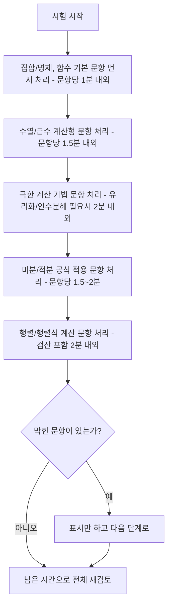

<Callout type="info">
  **이번 문서의 목표:** 독학사 1단계 일반수학 시험의 운영 구조(시간·형식·난이도)를 정확히 파악하고, 01~18편에서 배운 내용을 실제 시험장에서 시간 안에 정확히 풀어내는 구체적인 전략을 세울 수 있게 한다.
</Callout>

<Callout type="warning">
  이 문서에 나오는 **문항 수·배점·시행 시각 같은 회차별 세부 수치는 회차마다 공고로 확정**되며, 이 문서는 그 수치를 대신 확정하지 않는다. 수치가 필요한 부분마다 "공고 확인 필요"라고 표시했으니, 실제 응시 전에 반드시 국가평생교육진흥원 독학학위제 홈페이지의 해당 회차 시험요강을 확인해야 한다. 반면 시험 형식의 큰 틀(선택형 중심, 교양과정 수준)과 이 문서의 학습 전략은 여러 회차에 걸쳐 안정적으로 유지되는 정보이므로, 전략 부분은 그대로 활용해도 된다.
</Callout>

## 왜 이 편이 필요한가

01편부터 18편까지 집합과 명제부터 함수, 수열과 급수, 극한, 미분, 적분, 행렬과 벡터까지 독학사 1단계 일반수학의 개념과 계산 절차를 모두 다뤘다. 그런데 개념을 안다고 해서 시험에서 자동으로 좋은 점수가 나오는 것은 아니다. **정해진 시간 안에, 정해진 형식의 문제를, 실수 없이** 풀어야 점수로 이어진다.

> **쉽게 말하면:** 지금까지 쌓은 개념 실력을 실제 시험이라는 "제한 시간·제한 형식"의 틀에 맞춰 쓰는 법을 익히는 편이다.

이 편은 두 부분으로 나뉜다. 앞부분은 시험 자체의 운영 정보(시간, 문항 수, 형식, 난이도 기준, 출제 비율 경향)를 정리하고, 뒷부분은 그 정보를 바탕으로 한 실전 전략(시간 배분, 계산 실수를 줄이는 습관)을 다룬다.

## 독학학위제 1단계와 일반수학의 위치

**독학학위제**(독학사)는 국가평생교육진흥원이 시행하는 학위 취득 시험으로, 정규 대학에 다니지 않고도 스스로 공부해 학사 학위를 취득할 수 있게 하는 제도다. 전체 과정은 1단계(교양과정)부터 4단계(학위취득 종합시험)까지 이어지며, **일반수학은 1단계 교양과정 인정시험**의 선택 과목 중 하나다. 1단계에 응시하는 학습자는 여러 교양과목 중 일정 개수를 선택해 합격해야 다음 단계로 진행할 수 있다.

1단계 교양과정 인정시험은 **대학 교양 수준의 학력**을 확인하는 시험으로 설계되어 있다. 즉 전공 심화 수준의 어려운 증명이나 특수한 기법보다는, 고등학교 수학의 핵심 개념을 정확히 이해하고 표준적인 계산을 빠르고 정확하게 처리할 수 있는지를 주로 확인한다. 이 책의 01~18편이 "증명의 일반화"보다 "정의 → 표준 계산 절차 → 시험형 문제" 흐름에 집중한 이유도 여기에 있다.

## 시험 시간·문항 수·형식

### 문항 형식

독학사 1·2단계 인정시험은 **객관식(선택형) 위주**로 출제된다는 것이 공식 안내에서 확인되는 공통된 구조다. 일반수학도 이 틀을 따라 4지선다형 선택형 문항이 중심이며, 회차나 과목 운영 방식에 따라 일부 주관식(서술형) 문항이 섞일 수 있다.

| 항목 | 확인 가능한 내용 | 비고 |
|------|-------------------|------|
| 문항 형식 | 선택형(4지선다형) 위주 | 1·2단계 공통 안내 사항 |
| 문항당 목표 시간 | 선택형 약 1.5분, 서술형 포함 시 약 4분 | 과목별 안내에 기반한 참고 수치 |
| 전체 문항 수 | 공고 확인 필요 | 회차·과목 운영에 따라 달라질 수 있음 |
| 전체 시행 시간 | 공고 확인 필요 | 회차 시험요강에서 확정 |
| 합격 기준 | 과목별 60점 이상(백분율 환산 기준) | 독학사 전 단계 공통 원칙으로 알려져 있음 |

문항당 목표 시간을 "선택형 약 1.5분"으로 잡는다는 것은, 한 문제를 평균 1.5분 안에 풀 수 있어야 시간 안에 전체 문항을 소화할 수 있다는 뜻이다. 이 숫자는 절대적인 규정이라기보다, **얼마나 빠르게 계산해야 하는지 감을 잡는 기준**으로 활용하면 된다. 실제 전체 문항 수와 시행 시간은 회차마다 국가평생교육진흥원이 공지하는 시험요강 문서에 정확히 나오므로, 응시 신청 시점에 반드시 확인해야 한다.

### 시험 형식이 계산 훈련에 주는 의미

선택형이 중심이라는 것은 두 가지를 뜻한다.

1. **풀이 과정을 서술할 필요는 없지만, 정답 하나를 정확히 골라야 한다.** 중간에 부호를 놓치거나 계산을 한 단계 빠뜨리면 결과가 선택지에 없거나 다른 선택지와 헷갈리는 값이 나와, 시간을 다시 들여 처음부터 검토해야 하는 상황이 생긴다.
2. **선택지를 거꾸로 활용할 수 있다.** 예를 들어 이차방정식의 해를 구하는 문제라면, 직접 풀이가 막힐 때 선택지의 값을 원래 식에 대입해 맞는지 확인하는 방법도 유효한 전략이다. 단, 이는 보조 수단이며 표준 풀이 절차를 익히는 것이 우선이다.

## 평가 수준과 난이도 기준

앞서 언급했듯 1단계는 **대학 교양 수준**의 학력을 평가한다. 이는 다음과 같은 의미로 해석할 수 있다.

- 고등학교 수학 교육과정에서 다루는 개념과 계산 기법이 출제 범위의 뼈대를 이룬다.
- 정리의 엄밀한 증명(예: ε-δ 논법을 이용한 극한의 정의 증명)보다는, **정리를 계산에 적용하는 능력**을 확인한다.
- 난이도 기준은 "D학점 이상, 즉 60점 이상을 확보할 수 있는 수준"으로 설계된다고 알려져 있다. 이는 만점을 받기 위한 최상위 변별 문제보다, **기본 개념과 표준 계산을 정확히 익힌 학습자가 합격선을 넘을 수 있도록** 하는 데 초점을 둔 난이도 설계라는 뜻이다.

> **쉽게 말하면:** 만점보다 "합격선(60점)을 확실히 넘는 것"이 목표다. 어려운 문제 한두 개에 시간을 쏟기보다, 기본 개념 문제를 놓치지 않는 것이 훨씬 효율적이다.

이 관점은 뒤에 나올 시간 배분 전략과 바로 연결된다. 시험 전체에서 난이도가 낮은 문제부터 확실히 점수를 확보하고, 어려운 문제는 나중에 남은 시간으로 시도하는 순서가 합리적이다.

## 단원별 출제 비율 경향

정확한 회차별 출제 비율은 공식 출제기준 세부 평가영역 문서에서 확인해야 하지만(공고 확인 필요), 이 책의 목차 설계 단계에서 참고한 자료들(응시자 후기, 출제방향 안내)을 종합하면 다음과 같은 **경향**을 확인할 수 있다.

| 단원 묶음 | 이 책의 관련 편 | 경향 |
|-----------|------------------|------|
| 집합·명제, 함수 | 05–07편 | 시험 전반의 논리·해석 기초로, 단독 문항과 다른 단원 문제의 전제 조건으로 함께 출제되는 경우가 많음 |
| 수열·급수 | 08–09편 | 일반항·합 공식을 직접 계산하는 문항이 꾸준히 출제됨 |
| 극한·연속 | 10–12편 | 계산 기법(인수분해·유리화·치환)을 묻는 문항 비중이 높은 편으로 언급됨 |
| 미분과 활용 | 13–14편 | 기본 공식 적용과 그래프 해석(증가·감소·극값)을 함께 묻는 문항이 자주 나옴 |
| 적분과 활용 | 15–16편 | 정적분 계산과 넓이 응용이 결합된 문항이 나오는 경향 |
| 행렬·벡터 | 17–18편 | 응시자 후기에서 자주 언급되는 단원으로, 행렬식·역행렬 계산형 문항의 비중이 있는 것으로 파악됨 |

이 표는 **절대적인 출제 비율표가 아니라 학습 우선순위를 정하기 위한 참고 자료**임을 분명히 해 둔다. 특정 단원이 이번 회차에 몇 문항 나올지는 오직 해당 회차의 시험요강과 실제 출제로만 확인할 수 있다(공고 확인 필요). 다만 위 경향을 참고하면, 시간이 부족할 때 어느 단원을 우선 복습할지 판단하는 데 도움이 된다.

## 시간 배분 전략

### 전체 흐름 잡기

전체 문항 수와 시행 시간이 회차마다 다르므로(공고 확인 필요), 다음 원칙을 실제 회차에 맞춰 적용한다.

1. **시험지를 받으면 가장 먼저 전체 문항 수를 확인하고, 목표 페이스를 계산한다.** 예를 들어 전체 시행 시간이 $T$분이고 문항 수가 $n$개라면, 문항당 평균 시간은 $\frac{T}{n}$분이다. 이 값을 시험 시작과 동시에 어림잡아 두면, 중간에 시간이 부족한지 넉넉한지 스스로 점검할 수 있다.
2. **1회독에서는 확실히 아는 문제부터 처리한다.** 집합·명제, 수열의 일반항, 기본 미분·적분 공식 적용처럼 계산이 짧고 확실한 문항을 먼저 풀어 점수를 확보한다.
3. **막히는 문제는 표시만 해두고 다음 문제로 넘어간다.** 한 문제에 3분 이상 붙잡혀 있으면 전체 페이스가 무너진다. 표시해 둔 문제는 1회독이 끝난 뒤 남은 시간으로 다시 시도한다.
4. **마지막 5~10분은 답안 검토용으로 남긴다.** 특히 부호 실수가 잦은 극한·미분·행렬식 계산 문항을 우선 재검토한다.

### 단원별 체감 소요 시간 배분 예시

아래는 "18개 본론 단원 중 일부가 출제된다"는 가정 아래, 계산이 오래 걸리는 단원과 짧게 끝나는 단원을 구분해 시간을 배분하는 예시다. 실제 배점·문항 수는 회차 공고를 따른다(공고 확인 필요).

이 순서는 절대적인 규칙이 아니라, "짧게 끝나는 문항으로 먼저 점수를 확보하고, 계산이 긴 문항(극한 기법, 행렬식·역행렬 검산)에 남은 시간을 더 배정한다"는 원칙을 시각화한 것이다. 실제로는 시험지를 받은 순서대로 풀되, 어느 유형이 오래 걸리는지 스스로 파악해 두면 이 순서대로 재배치할 수 있다.

## 계산 실수를 줄이는 전략

앞서 여러 편에서 "자주 틀리는 점"을 각 단원마다 정리했다. 이 절에서는 단원을 가로질러 반복적으로 나타나는 실수 유형과, 그것을 줄이는 구체적인 습관을 정리한다.

### 반복되는 실수 유형

| 실수 유형 | 발생하는 단원 | 줄이는 습관 |
|-----------|----------------|-------------|
| 부호 실수 | 극한(좌극한·우극한), 미분(연쇄법칙), 행렬식(여인수 부호) | 부호가 바뀌는 지점마다 한 줄을 따로 떼어 적는다. 암산으로 넘어가지 않는다 |
| 정의역·조건 누락 | 함수(무리함수·로그함수), 부등식 | 식을 세우기 전에 "이 값이 성립하려면 무엇이 조건인가"를 먼저 적는다 |
| 공식 대입 순서 오류 | 행렬 곱셈(행×열), 역행렬 공식($a,d$ 위치 교환) | 공식을 먼저 문자 그대로 옮겨 적은 뒤 숫자를 대입한다. 암산으로 공식과 대입을 동시에 하지 않는다 |
| 계산 중간 생략 | 극한의 유리화·인수분해, 3×3 행렬식 전개 | 중간 단계를 한 줄씩 쓰는 습관을 시험에서도 유지한다. 시간이 아깝다고 건너뛰면 오히려 실수 검토에 더 많은 시간을 쓰게 된다 |
| 검산 생략 | 역행렬, 이차방정식의 해, 극한값 | 답을 구한 뒤 원래 식에 대입하거나(이차방정식), 원행렬과 곱해보는(역행렬) 검산을 습관화한다 |

### 실전 체크리스트

<Steps>

1. **문제를 끝까지 읽었는가?** "구하는 값이 무엇인지"를 정확히 확인한다. 예를 들어 극한값이 아니라 극한이 존재하지 않음을 보이는 문제인지 구분한다.
2. **필요한 공식을 먼저 문자로 적었는가?** 숫자를 바로 대입하지 않고, 공식을 그대로 옮겨 적은 뒤 대입한다.
3. **계산을 한 줄씩 진행했는가?** 두 단계를 한 번에 암산으로 처리하다가 실수하는 경우가 가장 많다.
4. **답이 선택지 중 하나와 일치하는가?** 일치하지 않으면 계산 과정을 다시 살펴야 한다는 신호다.
5. **검산이 가능한 문제라면 검산했는가?** 역행렬, 이차방정식의 근, 부정적분 등은 원래 식에 대입해 맞는지 확인할 수 있다.

</Steps>

### 자주 틀리는 점 (시험 운영 자체에 대한 오해)

- **문항 수·시행 시간을 지난 회차 기준으로 암기해서 그대로 적용한다.** 회차마다 공고가 갱신될 수 있으므로, 반드시 응시하는 회차의 최신 시험요강을 확인해야 한다.
- **만점을 목표로 어려운 문제에 시간을 몰아 쓴다.** 합격 기준은 60점이므로, 기본 문항을 놓치지 않는 전략이 더 효율적이다.
- **선택형이라 계산 과정을 생략해도 된다고 생각한다.** 서술을 안 할 뿐, 계산 자체를 생략하면 실수가 늘어난다. 시험지 여백에 중간 단계를 적는 습관은 시간을 아끼는 것이 아니라 정확도를 지키는 장치다.

## 핵심 정리

- 독학사 1단계 일반수학은 교양과정 인정시험으로, 대학 교양 수준의 학력을 확인하며 선택형(4지선다형) 문항이 중심이다.
- 문항당 목표 시간(선택형 약 1.5분)과 합격 기준(과목별 60점 이상)은 참고 가능한 정보이지만, 전체 문항 수·시행 시간은 회차 공고로 확정되므로 응시 전 반드시 확인해야 한다(공고 확인 필요).
- 단원별 출제 비율은 절대적인 수치가 아니라 학습 우선순위를 정하는 참고 경향으로 활용한다.
- 시간 배분은 "짧고 확실한 문항 먼저 → 표시해 둔 어려운 문항 → 마지막 검토" 순서를 기본으로 하고, 계산 실수는 부호·정의역·대입 순서·검산 습관으로 줄인다.

## 마무리 복습

<Quiz
  questionNumber={1}
  question="독학사 1단계 일반수학 시험의 문항 형식으로 알려진 것은 무엇인가?"
  options={['전부 서술형으로만 출제된다', '선택형(4지선다형) 위주로 출제된다', '실기 시험 형태로 진행된다', '구술면접으로 대체된다']}
  correctAnswer={2}
  explanation="독학사 1·2단계 인정시험은 공식 안내에 따라 객관식(선택형) 위주로 출제되는 것이 공통 구조다. 일부 회차에서 주관식이 섞일 수는 있으나 서술형만으로 구성되지는 않는다."
  optionExplanations={['서술형만으로 구성된다는 설명은 공식 안내와 다르다.', '선택형 위주라는 설명이 공식 안내와 일치하는 정답이다.', '독학사 일반수학은 실기 시험이 아니라 필기 시험이다.', '구술면접 형태로 진행되지 않는다.']}
/>

<Quiz
  questionNumber={2}
  question="이 문서에서 회차마다 반드시 공고로 재확인해야 한다고 강조한 항목이 아닌 것은?"
  options={['전체 문항 수', '전체 시행 시간', '시험 형식이 선택형 위주라는 큰 틀', '정확한 시행 일시']}
  correctAnswer={3}
  explanation="문항 수, 시행 시간, 시행 일시는 회차마다 공고로 확정되는 세부 수치이므로 반드시 재확인해야 한다. 반면 시험 형식이 선택형 위주라는 큰 틀은 여러 회차에 걸쳐 안정적으로 유지되는 정보로 이 문서에서 설명했다."
  optionExplanations={['문항 수는 공고 확인이 필요한 항목이다.', '시행 시간은 공고 확인이 필요한 항목이다.', '선택형 위주라는 큰 틀은 안정적으로 유지되는 정보라고 설명했으므로, 회차마다 재확인이 필요한 세부 수치와는 성격이 다르다.', '시행 일시는 공고 확인이 필요한 항목이다.']}
/>

<Quiz
  questionNumber={3}
  question="독학사 1단계의 난이도 설계 방향에 대한 설명으로 가장 적절한 것은?"
  options={['최상위권 변별을 위해 극도로 어려운 증명 문제를 중심으로 출제한다', '대학 교양 수준에서 합격선(60점 이상)을 확보할 수 있는 수준으로 설계된다', '중학교 수준 이하로 매우 쉽게 출제된다', '전공 심화 수준의 해석학 증명을 요구한다']}
  correctAnswer={2}
  explanation="1단계 교양과정 인정시험은 대학 교양 수준의 학력을 확인하며, 난이도는 D학점 이상(60점 이상)을 확보할 수 있는 수준으로 설계된다고 알려져 있다. 극도로 어려운 증명 문제 중심이거나 전공 심화 수준을 요구하지 않는다."
  optionExplanations={['1단계는 최상위 변별보다 합격선 확보에 초점을 둔 난이도로 설계된다.', '대학 교양 수준에서 합격선을 확보하도록 설계된다는 설명이 정확하다.', '중학교 수준 이하로 쉽다는 설명은 과도한 축소다.', '전공 심화 수준의 해석학 증명은 이 단계의 출제 범위가 아니다.']}
/>

<Quiz
  questionNumber={4}
  question="시간이 부족한 상황에서 권장되는 풀이 순서로 가장 적절한 것은?"
  options={['어려운 문제부터 풀어 만점을 노린다', '문제 번호 순서를 반드시 지켜 순서대로만 푼다', '확실히 아는 문제를 먼저 풀어 점수를 확보하고, 막히는 문제는 표시 후 나중에 재시도한다', '시간이 부족하면 마지막 문항부터 거꾸로 푼다']}
  correctAnswer={3}
  explanation="합격 기준이 60점인 시험 구조상, 확실한 문항으로 먼저 점수를 확보하고 막히는 문제는 표시해 둔 뒤 남은 시간에 재시도하는 순서가 효율적이다. 어려운 문제부터 풀거나 순서를 기계적으로 고정하는 것은 시간 관리에 불리하다."
  optionExplanations={['어려운 문제부터 풀면 시간 관리가 무너질 위험이 크다.', '문제 번호 순서를 반드시 지킬 필요는 없다.', '확실한 문항 우선, 막힌 문항은 표시 후 재시도하는 순서가 이 문서에서 권장하는 전략이다.', '푸는 순서를 거꾸로 하는 것 자체가 목적이 아니라, 확실한 문제부터 처리하는 것이 핵심이다.']}
/>

<Quiz
  questionNumber={5}
  question="다음 중 이 문서에서 소개한 계산 실수를 줄이는 습관으로 옳지 않은 것은?"
  options={['공식을 문자 그대로 먼저 적은 뒤 숫자를 대입한다', '역행렬이나 이차방정식의 해는 구한 뒤 원래 식에 대입해 검산한다', '시간을 아끼기 위해 계산 중간 단계는 최대한 생략하고 암산으로 처리한다', '부호가 바뀌는 지점은 별도의 줄로 적어 확인한다']}
  correctAnswer={3}
  explanation="이 문서는 계산 중간 단계를 생략하지 말고 한 줄씩 적는 것이 실수를 줄이는 습관이라고 강조했다. 암산으로 여러 단계를 한 번에 처리하는 것은 오히려 실수를 늘리는 원인으로 설명했으므로 옳지 않은 설명은 3번이다."
  optionExplanations={['공식을 먼저 문자로 적는 것은 이 문서가 권장하는 습관이다.', '검산을 습관화하는 것은 이 문서가 권장하는 습관이다.', '중간 단계를 생략하고 암산으로 처리하는 것은 실수를 줄이는 것이 아니라 늘리는 습관으로 설명되었다.', '부호 전환 지점을 별도로 적는 것은 이 문서가 권장하는 습관이다.']}
/>

<Quiz
  questionNumber={6}
  question="단원별 출제 비율 경향표에 대한 이 문서의 설명으로 옳은 것은?"
  options={['모든 회차에 그대로 적용되는 확정된 출제 비율표다', '학습 우선순위를 정하기 위한 참고 경향이며, 실제 비율은 회차 공고와 출제로 확인해야 한다', '행렬·벡터 단원은 이 표에서 출제되지 않는다고 명시했다', '집합·명제 단원은 시험에 전혀 출제되지 않는다']}
  correctAnswer={2}
  explanation="이 문서는 단원별 출제 비율 경향표가 절대적인 출제 비율표가 아니라 학습 우선순위를 정하기 위한 참고 자료이며, 실제 비율은 회차별 시험요강과 출제로만 확인할 수 있다고 명시했다."
  optionExplanations={['이 문서는 표가 확정된 수치가 아니라 참고 경향이라고 분명히 밝혔다.', '학습 우선순위를 위한 참고 자료라는 설명이 이 문서의 취지와 정확히 일치한다.', '행렬·벡터 단원도 표에 포함되어 출제 경향이 있는 것으로 언급되었다.', '집합·명제 단원도 표에 포함되어 다른 단원의 전제 조건으로 자주 출제된다고 언급되었다.']}
/>

## 참고 자료

- [국가평생교육진흥원 독학학위제](https://bdes.nile.or.kr) — 시험 회차, 시행 시간, 과목 구성 등 회차별 공고 확인
- [국가평생교육진흥원 교육통계·출제기준 안내](https://www.nile.or.kr) — 평가영역, 출제방향, 평가수준(교양과정 인정시험) 안내
