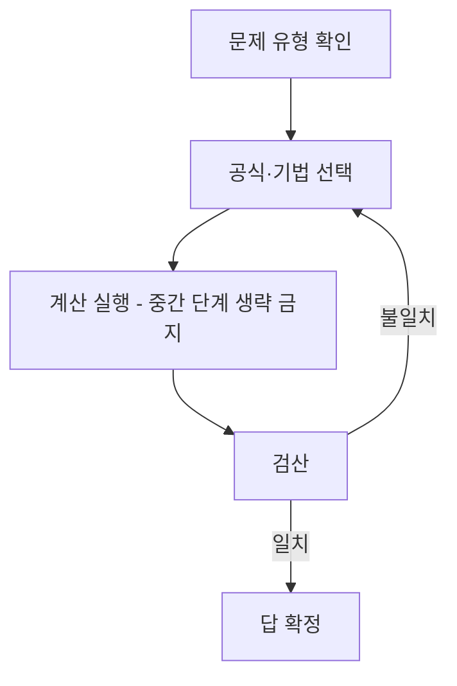

<Callout type="info">
  **이번 문서의 목표:** 이 문서를 다 읽고 나면 극한·미분·적분·수열·행렬의 표준 계산 유형을 실수 없이 반복해서 풀 수 있고, 답을 낸 뒤 스스로 검산해서 틀린 답을 걸러낼 수 있다.
</Callout>

08편부터 18편까지 개념과 공식을 하나씩 배웠다면, 이 편은 그 공식들을 **손이 기억할 때까지 반복**하는 자리다. 독학사 일반수학은 이론을 증명하라고 요구하지 않는다. 대신 정해진 계산을 **빠르고 정확하게** 해내는지를 묻는다. 그런데 실제 채점 결과를 보면 개념을 몰라서 틀리는 경우보다 부호를 빠뜨리거나, 정의역을 안 챙기거나, 마지막 자리에서 계산 실수를 하는 경우가 훨씬 많다. 그래서 이 편의 목표는 새로운 개념이 아니라 **정확도**다.

이 편은 단원별로 대표 유형을 하나씩 뽑아 전 과정을 풀이하고, 마지막에는 실제로 손으로 확인할 수 있는 체크리스트를 둔다.

## 연습 흐름

계산을 마치면 반드시 검산 단계로 돌아간다. 검산이 안 맞으면 답을 확정하지 말고 공식 선택부터 다시 짚어야 한다. 아래 각 문제도 이 흐름을 그대로 따른다.

## 극한 계산 연습

> **쉽게 말하면:** 극한은 분모가 0이 되는 형태(0/0)를 인수분해·유리화·통분으로 없앤 다음 대입한다.

**문제 1.** 다음 극한값을 구하라.

$$
\lim_{x \to 2} \frac{x^2 - 4}{x - 2}
$$

**풀이.** $x \to 2$를 그대로 대입하면 분모가 0이 되어 정의되지 않는다($0/0$ 꼴). 이럴 때는 분자를 인수분해해서 분모와 공통인수를 만든다.

$$
x^2 - 4 = (x-2)(x+2)
$$

- $(x-2)$: 분모와 같은 인수. 약분 대상
- $(x+2)$: 약분 후 남는 부분

$$
\frac{x^2-4}{x-2} = \frac{(x-2)(x+2)}{x-2} = x+2 \quad (x \neq 2)
$$

여기서 $x \neq 2$라는 조건이 붙는 이유를 짚어야 한다. 원래 함수는 $x=2$에서 정의되지 않는데(분모가 0), 약분한 함수 $x+2$는 $x=2$에서도 값이 있다. 극한은 $x=2$ **자체**가 아니라 $x=2$에 **한없이 가까워질 때**의 값을 묻는 것이므로, 약분 후 함수에 $x=2$를 대입해도 된다.

$$
\lim_{x \to 2} (x+2) = 2+2 = 4
$$

**검산.** $x$에 2에 아주 가까운 값 1.999를 넣어 확인한다. $\dfrac{1.999^2 - 4}{1.999 - 2} = \dfrac{-0.003999}{-0.001} = 3.999$로, 4에 매우 가깝다(검산 완료).

**문제 2.** 다음 극한값을 구하라.

$$
\lim_{x \to 0} \frac{\sqrt{x+4} - 2}{x}
$$

**풀이.** 분자에 근호(무리식)가 있고, $x \to 0$을 대입하면 $\dfrac{\sqrt{4}-2}{0} = \dfrac{0}{0}$ 꼴이 된다. 이런 경우는 분자를 **유리화**한다. 분자와 분모에 켤레식 $\sqrt{x+4}+2$를 곱한다.

- **유리화**(rationalization, 근호를 없애는 조작): 켤레식을 곱해 분자나 분모의 근호를 없애는 방법

$$
\frac{\sqrt{x+4}-2}{x} \cdot \frac{\sqrt{x+4}+2}{\sqrt{x+4}+2} = \frac{(x+4)-4}{x(\sqrt{x+4}+2)}
$$

분자의 $(\sqrt{x+4})^2 - 2^2 = (x+4) - 4 = x$가 되므로

$$
\frac{x}{x(\sqrt{x+4}+2)} = \frac{1}{\sqrt{x+4}+2} \quad (x \neq 0)
$$

$$
\lim_{x \to 0} \frac{1}{\sqrt{x+4}+2} = \frac{1}{\sqrt{4}+2} = \frac{1}{4}
$$

**검산.** $x = 0.001$을 원래 식에 대입한다. $\sqrt{4.001} \approx 2.00025$이므로 $\dfrac{2.00025-2}{0.001} = \dfrac{0.00025}{0.001} = 0.25$. $1/4 = 0.25$와 일치한다(검산 완료).

## 미분 계산 연습

> **쉽게 말하면:** 미분은 공식(거듭제곱·곱·몫·합성함수 규칙)을 순서대로 적용하는 조립 작업이다.

**문제 3.** 다음 함수를 미분하라.

$$
f(x) = (2x+1)^3 (x-3)
$$

**풀이.** 두 함수의 곱이므로 **곱의 미분법**(product rule)을 쓴다. $u = (2x+1)^3$, $v = x-3$로 놓으면 $(uv)' = u의 도함수와 v를 곱한 항 + uv'$이다.

- $u'$: 합성함수이므로 **연쇄법칙**(chain rule)이 필요하다. $u = (2x+1)^3$에서 바깥 함수는 세제곱, 안 함수는 $2x+1$

$$
u' = 3(2x+1)^2 \cdot (2x+1)' = 3(2x+1)^2 \cdot 2 = 6(2x+1)^2
$$

$v' = 1$이므로

$$
f'(x) = 6(2x+1)^2(x-3) + (2x+1)^3 \cdot 1
$$

공통인수 $(2x+1)^2$로 묶어 정리한다.

$$
f'(x) = (2x+1)^2\bigl[6(x-3) + (2x+1)\bigr] = (2x+1)^2(8x-17)
$$

- $6(x-3)+(2x+1) = 6x-18+2x+1 = 8x-17$: 괄호 안 정리 과정

**검산.** 공식으로 구한 값은 $f'(1) = (2\times1+1)^2(8\times1-17) = 3^2\times(-9) = 9\times(-9) = -81$이다. 이 값을 수치 미분(numerical differentiation, 아주 작은 구간의 평균변화율로 미분계수를 근사하는 방법)으로 검산한다. $f(1) = (2\times1+1)^3(1-3) = 3^3\times(-2) = 27\times(-2) = -54$이고, $f(1.001) = (2\times1.001+1)^3(1.001-3) = (3.002)^3\times(-1.999)$이다. $(3.002)^3 \approx 27.0540$이므로 $f(1.001) \approx 27.0540\times(-1.999) \approx -54.0809$이다.

$$
\frac{f(1.001)-f(1)}{0.001} = \frac{-54.0809-(-54)}{0.001} = \frac{-0.0809}{0.001} \approx -80.9
$$

공식으로 구한 $-81$과 소수점 첫째 자리까지 일치한다(수치 미분은 구간을 완전히 0으로 좁히지 못해 생기는 작은 근사 오차만 남는다. 검산 완료).

## 적분 계산 연습

> **쉽게 말하면:** 부정적분은 미분의 역연산이므로, 구한 답을 다시 미분해서 원래 피적분함수가 나오는지 확인하면 바로 검산이 된다.

**문제 4.** 다음 부정적분을 구하라.

$$
\int (3x^2 - 4x + 5)\,dx
$$

**풀이.** 항별로 거듭제곱 적분 공식 $\displaystyle\int x^n\,dx = \frac{x^{n+1}}{n+1}+C$ ($n \neq -1$)를 적용한다.

$$
\int 3x^2\,dx = 3 \cdot \frac{x^3}{3} = x^3
$$

$$
\int (-4x)\,dx = -4 \cdot \frac{x^2}{2} = -2x^2
$$

$$
\int 5\,dx = 5x
$$

세 결과를 더하고 적분상수 $C$(integration constant, 미분하면 0이 되어 사라지는 임의의 상수)를 붙인다.

$$
\int (3x^2-4x+5)\,dx = x^3 - 2x^2 + 5x + C
$$

**검산.** 구한 답을 다시 미분해서 원래 피적분함수가 나오는지 확인한다.

$$
\frac{d}{dx}(x^3-2x^2+5x+C) = 3x^2-4x+5
$$

원래 문제의 피적분함수와 정확히 일치한다(검산 완료).

**문제 5.** 다음 정적분을 구하라.

$$
\int_1^3 (2x-1)\,dx
$$

**풀이.** 먼저 부정적분을 구한다.

$$
\int (2x-1)\,dx = x^2 - x + C
$$

정적분은 상한을 대입한 값에서 하한을 대입한 값을 뺀다. 이때 $C$는 빼는 과정에서 상쇄되므로 정적분 계산에서는 생략한다.

$$
\Bigl[x^2-x\Bigr]_1^3 = (3^2-3) - (1^2-1)
$$

- $(3^2-3) = 9-3 = 6$: 상한 $x=3$을 대입한 값
- $(1^2-1) = 1-1 = 0$: 하한 $x=1$을 대입한 값

$$
6 - 0 = 6
$$

**검산.** 그래프로 보면 $y=2x-1$은 $x=1$일 때 $y=1$, $x=3$일 때 $y=5$인 직선이다. $x=1$부터 $x=3$까지 이 직선 아래의 넓이는 사다리꼴 넓이 공식 $\dfrac{(윗변+아랫변)\times높이}{2}$로도 구할 수 있다.

$$
\frac{(1+5)\times 2}{2} = \frac{12}{2} = 6
$$

정적분으로 구한 값 6과 정확히 일치한다(검산 완료).

## 수열 계산 연습

> **쉽게 말하면:** 등차·등비수열은 첫째항과 공차(또는 공비)만 알면 공식에 대입만 하면 되므로, 대입 순서를 틀리지 않는 것이 핵심이다.

**문제 6.** 첫째항이 5, 공차가 3인 등차수열의 제10항과 첫째항부터 제10항까지의 합을 구하라.

**풀이.** 등차수열의 일반항 공식은 $a_n = a_1 + (n-1)d$이다.

- $a_1$: 첫째항(5)
- $d$: 공차(3, 이웃한 두 항의 차)
- $n$: 항의 번호

$$
a_{10} = 5 + (10-1)\times 3 = 5+27 = 32
$$

합 공식은 $\displaystyle S_n = \frac{n(a_1+a_n)}{2}$이다.

$$
S_{10} = \frac{10\times(5+32)}{2} = \frac{10\times37}{2} = \frac{370}{2} = 185
$$

**검산.** 처음 세 항과 마지막 세 항을 직접 나열해 확인한다. 수열은 5, 8, 11, 14, ..., 32이다. 항이 10개이고 공차가 3이므로 마지막 항은 $5+9\times3=32$로 위 계산과 일치한다. 합은 첫 항과 끝 항을 짝지어 더하는 방식(가우스 방법)으로도 검산할 수 있다. $5+32=37$, 이런 쌍이 5개($10\div2$) 있으므로 $37\times5=185$로 동일하다(검산 완료).

## 행렬 계산 연습

> **쉽게 말하면:** 역행렬을 구했으면 원래 행렬과 곱해서 단위행렬이 나오는지 확인하는 것이 가장 확실한 검산이다.

**문제 7.** 행렬 $A = \begin{pmatrix} 2 & 1 \\ 5 & 3 \end{pmatrix}$의 역행렬을 구하라.

**풀이.** $2\times2$ 행렬 $\begin{pmatrix} a & b \\ c & d \end{pmatrix}$의 역행렬 공식은 다음과 같다.

$$
A^{-1} = \frac{1}{ad-bc}\begin{pmatrix} d & -b \\ -c & a \end{pmatrix}
$$

- $ad-bc$: **행렬식**(determinant, 역행렬이 존재하는지 판단하는 값). 0이면 역행렬이 존재하지 않는다

먼저 행렬식을 계산한다.

$$
ad-bc = 2\times3 - 1\times5 = 6-5 = 1
$$

행렬식이 0이 아니므로 역행렬이 존재한다. 공식에 대입한다.

$$
A^{-1} = \frac{1}{1}\begin{pmatrix} 3 & -1 \\ -5 & 2 \end{pmatrix} = \begin{pmatrix} 3 & -1 \\ -5 & 2 \end{pmatrix}
$$

**검산.** $AA^{-1}$이 단위행렬 $I$가 되는지 직접 곱해서 확인한다.

$$
AA^{-1} = \begin{pmatrix} 2 & 1 \\ 5 & 3 \end{pmatrix}\begin{pmatrix} 3 & -1 \\ -5 & 2 \end{pmatrix}
$$

각 성분을 하나씩 계산한다.

- $(1,1)$ 성분: $2\times3 + 1\times(-5) = 6-5 = 1$
- $(1,2)$ 성분: $2\times(-1) + 1\times2 = -2+2 = 0$
- $(2,1)$ 성분: $5\times3 + 3\times(-5) = 15-15 = 0$
- $(2,2)$ 성분: $5\times(-1) + 3\times2 = -5+6 = 1$

$$
AA^{-1} = \begin{pmatrix} 1 & 0 \\ 0 & 1 \end{pmatrix} = I
$$

단위행렬이 정확히 나왔다(검산 완료).

## 자주 틀리는 점

- **극한 계산 후 약분 조건($x \neq$ 값) 빼먹기.** 약분한 뒤 함수는 원래 함수와 정의역이 다르다는 점을 표시하지 않으면 감점 대상이 될 수 있다.
- **연쇄법칙에서 안 함수의 미분을 빼먹는 것.** $(2x+1)^3$을 미분할 때 $3(2x+1)^2$까지만 쓰고 안 함수의 미분 $\times 2$를 곱하지 않는 실수가 가장 흔하다.
- **정적분에서 적분상수 $C$를 상한·하한 계산에 남겨두는 것.** 정적분은 값이 상쇄되므로 $C$를 쓸 필요가 없는데, 습관적으로 남겨서 계산을 복잡하게 만드는 경우가 있다.
- **등차수열 공식에서 $(n-1)$을 $n$으로 잘못 쓰는 것.** 첫째항이 이미 $n=1$일 때의 값이므로, $n$번째 항까지 공차를 더하는 횟수는 $n-1$번이다.
- **역행렬 공식에서 $b$, $c$의 부호를 바꾸지 않는 것.** 공식은 대각선 $a$, $d$의 자리를 바꾸고, 반대각선 $b$, $c$에는 음수 부호를 붙인다.

## 계산 실수 점검 체크리스트

시험 중 답을 적기 전, 아래 항목을 손으로 하나씩 짚어 확인한다.

- [ ] **부호**: 뺄셈·음수 계수를 옮길 때 부호가 바뀌었는가? 특히 $-(x-3)$처럼 괄호 앞에 마이너스가 있을 때 괄호 안 부호를 전부 뒤집었는가?
- [ ] **정의역**: 분모가 0이 되는 값, 근호 안이 음수가 되는 값을 제외했는가? 약분한 뒤에도 원래 정의역 조건을 표시했는가?
- [ ] **연쇄법칙 누락**: 합성함수를 미분할 때 안 함수의 미분을 곱하는 것을 빠뜨리지 않았는가?
- [ ] **적분상수**: 부정적분에는 $+C$를 붙였는가? 정적분에는 $C$ 없이 상한·하한 값만 뺐는가?
- [ ] **등차·등비 지수**: $(n-1)$과 $n$, $n$과 $n+1$ 중 어느 것을 써야 하는지 문제의 "몇 번째 항"과 "몇 개의 항"을 구분해서 확인했는가?
- [ ] **행렬 곱셈 순서**: $AB$와 $BA$는 일반적으로 다르다. 문제에서 요구한 곱셈 순서대로 계산했는가?
- [ ] **반올림 자리수**: 문제나 보기에서 요구하는 소수점 자리수(예: 소수 둘째 자리)에 맞춰 반올림했는가? 중간 계산에서는 반올림하지 않고 마지막에만 반올림했는가?
- [ ] **검산**: 적분은 미분으로, 근은 원식 대입으로, 역행렬은 곱해서 단위행렬이 나오는지로 확인했는가?

## 핵심 정리

- 계산 실수는 개념을 몰라서가 아니라 **부호·정의역·연쇄법칙·적분상수** 네 곳에서 가장 많이 발생한다.
- 답을 낸 뒤에는 항상 역연산으로 검산한다 — 적분은 미분, 근은 원식 대입, 역행렬은 곱해서 단위행렬 확인.
- 체크리스트를 실전처럼 손으로 짚는 습관을 들이면 아는 문제를 계산 실수로 놓치는 일을 크게 줄일 수 있다.

## 마무리 복습

<Quiz
  questionNumber={1}
  question="lim(x→3) (x^2-9)/(x-3)의 값은?"
  options={['0', '3', '6', '9']}
  correctAnswer={3}
  explanation="분자를 (x-3)(x+3)으로 인수분해하면 (x-3)이 약분되어 x+3이 남는다. x=3을 대입하면 3+3=6이다."
  optionExplanations={['약분 후 x+3에 x=3을 대입하지 않고 분자만 0으로 본 경우다', '분모의 값을 그대로 답으로 쓴 경우다', '정답이다', '분자·분모를 약분하지 않고 원래 형태로 계산한 경우다']}
/>

<Quiz
  questionNumber={2}
  question="lim(x→0) (√(x+9)-3)/x의 값은?"
  options={['1/9', '1/6', '1/3', '1']}
  correctAnswer={2}
  explanation="분자와 분모에 켤레식 √(x+9)+3을 곱하면 분자가 (x+9)-9=x가 되어 x로 약분된다. 남는 식은 1/(√(x+9)+3)이며, x=0을 대입하면 1/(3+3)=1/6이다."
  optionExplanations={['약분 후 식의 분모를 9로 잘못 계산한 경우다', '정답이다', '켤레식을 곱하지 않고 직접 대입을 시도해 잘못된 값을 얻은 경우다', '약분 과정에서 분모의 3을 빠뜨린 경우다']}
/>

<Quiz
  questionNumber={3}
  question="f(x) = (x+2)^2 (x-1)을 미분하면 f'(1)의 값은?"
  options={['9', '18', '27', '36']}
  correctAnswer={1}
  explanation="곱의 미분법으로 u=(x+2)^2, v=(x-1)을 놓으면 u'=2(x+2), v'=1이며 f'(x) = u의 도함수와 v를 곱한 항+uv' = 2(x+2)(x-1) + (x+2)^2이다. x=1을 대입하면 u의 도함수와 v를 곱한 항 = 2×3×0 = 0이고 uv' = 3^2×1 = 9이므로 f'(1) = 0+9 = 9이다."
  optionExplanations={['정답이다', 'u프라임v 항을 0으로 계산하지 않고 다시 곱해 값이 커진 경우다', '(x+2)^2을 세제곱으로 잘못 취급해 계산한 경우다', '연쇄법칙을 두 번 적용하듯 계산해 값이 과도하게 커진 경우다']}
/>

<Quiz
  questionNumber={4}
  question="∫(4x^3 - 6x + 2)dx의 결과로 옳은 것은?"
  options={['x^4 - 3x^2 + 2x + C', '4x^4 - 3x^2 + 2x + C', 'x^4 - 6x^2 + 2x + C', 'x^4 - 3x^2 + C']}
  correctAnswer={1}
  explanation="항별로 적분한다. ∫4x^3dx = x^4, ∫(-6x)dx = -3x^2, ∫2dx = 2x이며 마지막에 +C를 붙인다. 합치면 x^4 - 3x^2 + 2x + C이다. 검산으로 이 식을 다시 미분하면 4x^3 - 6x + 2가 나와 원래 피적분함수와 일치한다."
  optionExplanations={['정답이다', '4x^3을 적분할 때 계수 4를 지우지 않고 남긴 경우다', '-6x를 적분할 때 계수를 2로 나누지 않은 경우다', '마지막 항 2x를 빠뜨린 경우다']}
/>

<Quiz
  questionNumber={5}
  question="정적분 ∫[1,4](3x^2)dx의 값은?"
  options={['48', '60', '63', '72']}
  correctAnswer={3}
  explanation="부정적분은 x^3이다. 상한 4를 대입하면 4^3=64, 하한 1을 대입하면 1^3=1이므로 64-1=63이다."
  optionExplanations={['상한만 대입하고 하한을 빼지 않은 경우와 다른 계산 오류가 겹친 값이다', '적분 계수 처리에서 실수가 있는 값이다', '정답이다', '4^3을 잘못 계산해 더 큰 값이 나온 경우다']}
/>

<Quiz
  questionNumber={6}
  question="첫째항 7, 공차 -2인 등차수열의 제15항은?"
  options={['-19', '-21', '-23', '-25']}
  correctAnswer={2}
  explanation="a_n = a_1 + (n-1)d이므로 a_15 = 7 + 14×(-2) = 7 - 28 = -21이다."
  optionExplanations={['(n-1) 대신 n을 그대로 곱해 14 대신 15를 곱한 경우와는 다른 값이다', '정답이다', '공차의 부호를 잘못 적용해 계산한 경우다', '항 번호 계산에서 1을 더 빼는 실수를 한 경우다']}
/>

<Quiz
  questionNumber={7}
  question="첫째항 3, 공차 4인 등차수열의 첫째항부터 제8항까지의 합은?"
  options={['108', '132', '136', '144']}
  correctAnswer={3}
  explanation="a_8 = 3 + 7×4 = 31이다. 합 공식 S_n = n(a_1+a_n)/2에 대입하면 S_8 = 8×(3+31)/2 = 8×34/2 = 272/2 = 136이다."
  optionExplanations={['항의 개수를 7로 잘못 넣은 경우다', 'a_8을 27로 잘못 계산해 합을 구한 경우다', '정답이다', '2로 나누는 것을 빠뜨려 두 배가 된 값이다']}
/>

<Quiz
  questionNumber={8}
  question="행렬 A = [[3,2],[4,3]]의 역행렬은?"
  options={['[[3,-2],[-4,3]]', '[[3,2],[4,3]]', '[[-3,2],[4,-3]]', '[[3,-4],[-2,3]]']}
  correctAnswer={1}
  explanation="행렬식은 3×3-2×4=9-8=1이다. 역행렬 공식에 따라 대각 성분(3,3)의 위치를 바꾸고 반대각 성분(2,4)에는 음수 부호를 붙이면 [[3,-2],[-4,3]]이 된다. 검산으로 원래 행렬과 곱하면 단위행렬이 나온다."
  optionExplanations={['정답이다', '부호를 전혀 바꾸지 않은 원래 행렬을 그대로 답으로 쓴 경우다', '대각 성분의 위치를 바꾸지 않고 부호만 바꾼 경우다', '행과 열을 서로 바꿔 배치한 경우다']}
/>

<Quiz
  questionNumber={9}
  question="행렬 A = [[1,2],[3,4]], B = [[2,0],[1,2]]일 때 AB의 (1,1) 성분은?"
  options={['2', '4', '6', '8']}
  correctAnswer={2}
  explanation="AB의 (1,1) 성분은 A의 1행과 B의 1열을 각각 곱해서 더한 값이다. 1×2 + 2×1 = 2+2 = 4이다."
  optionExplanations={['A의 1행과 B의 1열 중 한 항만 곱한 경우다', '정답이다', 'A의 1행과 B의 2열을 곱한 값과 혼동한 경우다', '두 항을 곱하지 않고 더하기만 한 경우다']}
/>

<Quiz
  questionNumber={10}
  question="극한 계산에서 분자·분모를 약분한 뒤 반드시 표시해야 하는 것은?"
  options={['근사값의 반올림 자리수', '원래 함수의 정의역에서 제외되는 x값', '약분에 사용한 인수분해 방법', '유리화에 사용한 켤레식']}
  correctAnswer={2}
  explanation="약분 전 함수는 분모가 0이 되는 x값에서 정의되지 않는다. 약분한 함수는 그 값에서도 정의되므로, 원래 함수와 같은 함수가 아니라는 것을 x≠(제외값) 형태로 표시해야 한다."
  optionExplanations={['극한 계산 자체와는 직접 관련이 없는 항목이다', '정답이다', '풀이 과정 설명에는 유용하지만 표시가 필수는 아니다', '풀이 과정 설명에는 유용하지만 표시가 필수는 아니다']}
/>

<Quiz
  questionNumber={11}
  question="정적분과 부정적분의 계산에서 가장 중요한 차이는?"
  options={['정적분은 적분상수 C가 필요 없다', '부정적분은 상한과 하한이 있다', '정적분은 미분 공식을 사용하지 않는다', '부정적분은 반드시 다항함수에만 적용된다']}
  correctAnswer={1}
  explanation="정적분은 상한과 하한을 대입해 빼는 과정에서 적분상수 C가 상쇄되어 사라지므로 계산에 포함할 필요가 없다. 부정적분은 상한·하한이 없는 함수 형태의 답이므로 반드시 +C를 붙여야 한다."
  optionExplanations={['정답이다', '상한·하한은 정적분에 있는 것이다', '정적분도 미분의 역연산인 적분 공식을 그대로 사용한다', '부정적분은 다항함수뿐 아니라 지수·로그·삼각함수 등에도 적용된다']}
/>

<Quiz
  questionNumber={12}
  question="다음 중 계산 실수를 줄이기 위한 검산 방법으로 옳지 않은 것은?"
  options={['부정적분의 답을 다시 미분해서 원래 식과 비교한다', '방정식의 근을 원래 식에 대입해 참인지 확인한다', '역행렬을 원래 행렬과 곱해 단위행렬이 나오는지 확인한다', '계산이 복잡할수록 검산을 생략하고 다음 문제로 넘어간다']}
  correctAnswer={4}
  explanation="계산이 복잡한 문제일수록 실수 가능성이 높으므로 검산이 더 필요하다. 검산을 생략하는 것은 정확도를 높이는 방법이 될 수 없다."
  optionExplanations={['적분의 올바른 검산 방법이다', '방정식 풀이의 올바른 검산 방법이다', '역행렬의 올바른 검산 방법이다', '정답이다']}
/>

## 참고 자료

- [고등학교 미적분 공식·개념 정리](https://mathworld.wolfram.com)
- [독학사 출제방향 안내(문항당 시간·난이도 기준)](https://www.nile.or.kr)
