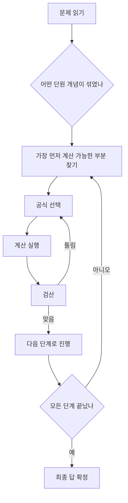

<Callout type="info">
  **이번 문서의 목표:** 이 문서를 다 읽으면 함수·수열·극한·미분이 한 문제에 섞여 나와도 어떤 공식을 먼저 골라야 하는지 판단하고, 끝까지 계산해 검산까지 마칠 수 있다.
</Callout>

실제 시험 문제는 "이것은 극한 문제, 저것은 미분 문제"처럼 단원이 표시되어 나오지 않는다. 문제 하나에 함수의 정의역, 수열의 일반항, 극한 계산, 미분 공식이 순서대로 얽혀 나오는 경우가 많다. 06편부터 14편까지 각 단원을 따로 배웠다면, 이 편에서는 그 단원들을 **한 문제 안에서 연결하는 훈련**을 한다. 핵심은 문제를 읽자마자 "이 문제는 어떤 순서로 풀어야 하는가"를 먼저 정하는 것이다.

## 풀이 경로 정하기

복합 문제는 한 번에 끝까지 계산하려 하지 말고, 위 흐름처럼 **한 단계씩 검산하며** 넘어가야 실수를 줄일 수 있다.

## 유형 1 — 함수와 수열의 결합

**문제 1.** 함수 $f(x) = 2x-1$이 있다. 수열 $\{a_n\}$이 $a_n = f(n)$으로 정의될 때, $a_1$부터 $a_{20}$까지의 합을 구하라.

**풀이.** 먼저 함수 $f$에 자연수를 대입해서 수열의 일반항을 구한다.

$$
a_n = f(n) = 2n-1
$$

$n=1, 2, 3$을 대입해 보면 $a_1=1$, $a_2=3$, $a_3=5$로, 첫째항이 1이고 공차가 2인 **등차수열**임을 알 수 있다.

- $a_1 = 1$: 첫째항
- $d = 2$: 공차(이웃한 항의 차, $a_2-a_1=3-1=2$)

합 공식 $S_n = \dfrac{n(a_1+a_n)}{2}$을 쓰기 위해 $a_{20}$을 먼저 구한다.

$$
a_{20} = 2\times20-1 = 39
$$

$$
S_{20} = \frac{20\times(1+39)}{2} = \frac{20\times40}{2} = \frac{800}{2} = 400
$$

**검산.** 등차수열의 합은 "홀수의 합"으로도 확인할 수 있다. $a_n=2n-1$은 1, 3, 5, ..., 39로 이어지는 **홀수의 나열**이며, 1부터 시작하는 연속한 홀수 $n$개의 합은 잘 알려진 공식으로 $n^2$이다. $n=20$이므로 $20^2=400$이다. 두 방법의 결과가 정확히 일치한다(검산 완료).

## 유형 2 — 함수의 정의역과 극한

**문제 2.** 함수 $f(x) = \dfrac{x^2-1}{x-1}$이 있다. $f$의 정의역과 $\displaystyle\lim_{x\to1} f(x)$를 각각 구하라.

**풀이.** 정의역부터 확인한다. 분모 $x-1$이 0이 되면 함수가 정의되지 않으므로 $x=1$은 정의역에서 제외된다.

$$
\text{정의역} = \{x \mid x \neq 1\}
$$

다음으로 극한을 구한다. $x\to1$일 때 분모가 0이 되므로 바로 대입할 수 없고, 분자를 인수분해해 약분해야 한다.

$$
f(x) = \frac{(x-1)(x+1)}{x-1} = x+1 \quad (x \neq 1)
$$

$$
\lim_{x\to1} f(x) = 1+1 = 2
$$

여기서 반드시 짚어야 할 점은, $f(x)$가 $x=1$에서 **정의되지 않지만** $x=1$로 **가까워질 때의 극한값은 2로 존재**한다는 것이다. 정의역에 없는 점이라고 해서 극한도 없는 것은 아니다.

**검산.** $x=1.01$을 원래 식에 대입한다. $\dfrac{1.01^2-1}{1.01-1} = \dfrac{0.0201}{0.01} = 2.01$로, 2에 매우 가깝다(검산 완료).

## 유형 3 — 극한을 이용한 미분계수 정의 확인

**문제 3.** 함수 $f(x) = x^2+3x$에 대해 극한의 정의를 이용해 $x=2$에서의 미분계수 $f'(2)$를 구하라.

**풀이.** 미분계수의 정의는 다음과 같다.

$$
f'(a) = \lim_{h\to0} \frac{f(a+h)-f(a)}{h}
$$

- $a$: 미분계수를 구할 지점(여기서는 2)
- $h$: 아주 작은 변화량(0에 한없이 가까워지는 값)

$a=2$를 대입하고 $f(2+h)$와 $f(2)$를 각각 계산한다.

$$
f(2+h) = (2+h)^2 + 3(2+h) = 4+4h+h^2+6+3h = h^2+7h+10
$$

$$
f(2) = 2^2+3\times2 = 4+6 = 10
$$

$$
f(2+h)-f(2) = (h^2+7h+10)-10 = h^2+7h
$$

$$
\frac{f(2+h)-f(2)}{h} = \frac{h^2+7h}{h} = h+7 \quad (h\neq0)
$$

$$
f'(2) = \lim_{h\to0}(h+7) = 7
$$

**검산.** 미분 공식 $\dfrac{d}{dx}(x^2+3x) = 2x+3$을 이용해 $x=2$를 대입한다. $2\times2+3=7$로, 극한의 정의로 구한 값과 정확히 일치한다(검산 완료). 이 문제는 "미분 공식이 왜 성립하는지"를 극한으로 직접 확인시켜 주는 유형이며, 시험에서도 공식 대입형과 정의형이 둘 다 나올 수 있다.

## 유형 4 — 함수·미분·수열이 함께 나오는 복합 문제

**문제 4.** 함수 $f(x) = x^3-3x^2+2$가 있다. 이 함수가 극값을 갖는 $x$값을 모두 구하고, 그 값들을 첫째항과 둘째항으로 하는 등차수열의 제5항을 구하라(단, 극값을 갖는 $x$값은 작은 값부터 순서대로 사용한다).

**풀이.** 먼저 극값을 찾는다. **극값**(extreme value, 함수가 커지다가 작아지거나 작아지다가 커지는 경계에서의 값)은 미분계수가 0이 되는 지점에서 후보가 생긴다.

$$
f'(x) = 3x^2-6x
$$

$f'(x)=0$을 풀어 후보를 찾는다.

$$
3x^2-6x = 3x(x-2) = 0 \implies x=0 \text{ 또는 } x=2
$$

$x=0$ 앞뒤에서 $f'(x)$의 부호가 양에서 음으로 바뀌므로 $x=0$에서 극대, $x=2$ 앞뒤에서 음에서 양으로 바뀌므로 $x=2$에서 극소임을 확인한다(부호 확인은 14편의 증가·감소 판정법을 그대로 사용한다).

작은 값부터 순서대로 놓으면 첫째항 $a_1=0$, 둘째항 $a_2=2$이다. 공차는 다음과 같다.

$$
d = a_2-a_1 = 2-0 = 2
$$

제5항을 구한다.

$$
a_5 = a_1+(5-1)d = 0+4\times2 = 8
$$

**검산.** 수열을 직접 나열하면 0, 2, 4, 6, 8이다. 다섯 번째 항이 8로 공식 결과와 일치한다(검산 완료). 극값 판정도 다시 확인하면, $f'(-1)=3(-1)^2-6(-1)=3+6=9>0$, $f'(1)=3-6=-3<0$이므로 $x=0$ 좌우에서 부호가 양에서 음으로 바뀌어 극대가 맞고, $f'(3)=27-18=9>0$이므로 $x=2$ 좌우에서 음에서 양으로 바뀌어 극소가 맞다(검산 완료).

## 자주 틀리는 점

- **극한 문제에서 정의역과 극한값을 혼동하는 것.** $x=1$에서 함수가 정의되지 않아도 그 근처로 다가갈 때의 극한값은 따로 존재할 수 있다는 점을 반드시 구분해야 한다.
- **미분계수 정의를 쓸 때 $h$로 나누기 전에 미리 $h=0$을 대입하는 것.** $\dfrac{f(a+h)-f(a)}{h}$는 $h$로 약분한 뒤에만 $h\to0$의 극한을 취할 수 있다. 약분하지 않고 $h=0$을 넣으면 $0/0$이 되어 계산이 안 된다.
- **극값을 판정할 때 $f'(x)=0$인 지점을 곧바로 극값으로 단정하는 것.** $f'(x)=0$은 극값의 **후보**일 뿐이며, 그 앞뒤에서 부호가 실제로 바뀌는지 확인해야 극대·극소가 확정된다(부호가 안 바뀌면 변곡점일 뿐 극값이 아니다).
- **복합 문제에서 함수식을 대입할 순서를 바꾸는 것.** 함수와 수열이 결합된 문제는 "함수에 자연수를 대입해 수열을 만드는 것"과 "수열의 결과를 다시 함수에 넣는 것"의 순서를 문제에서 요구한 그대로 지켜야 한다.

## 핵심 정리

- 복합 문제는 한 번에 끝까지 풀지 말고, 계산이 가능한 가장 작은 단위부터 순서대로 처리하며 매 단계 검산한다.
- 함수의 정의역에서 제외된 점이라도 그 점으로 다가가는 극한값은 따로 존재할 수 있다 — 정의역과 극한은 별개의 질문이다.
- 미분계수의 정의(극한을 이용한 정의)와 미분 공식은 같은 값을 내야 하며, 서로를 검산 도구로 쓸 수 있다.
- $f'(x)=0$은 극값의 후보일 뿐이고, 앞뒤 부호 변화를 확인해야 극대·극소가 확정된다.

## 마무리 복습

<Quiz
  questionNumber={1}
  question="f(x) = 3x+2이고 수열 a_n = f(n)일 때, a_1부터 a_15까지의 합은?"
  options={['360', '375', '390', '405']}
  correctAnswer={3}
  explanation="a_n = 3n+2이므로 a_1=5, 공차는 3이다. a_15 = 5+14×3 = 47이다. 합 공식 S_n=n(a_1+a_n)/2에 대입하면 S_15 = 15×(5+47)/2 = 15×52/2 = 390이다."
  optionExplanations={['a_15 계산에서 공차를 잘못 곱한 값이다', '항의 개수(n=15)를 잘못 적용한 값이다', '정답이다', 'a_15을 실제보다 크게 계산한 값이다']}
/>

<Quiz
  questionNumber={2}
  question="함수 f(x) = (x^2-4)/(x-2)의 정의역과 x→2에서의 극한값을 옳게 짝지은 것은?"
  options={['정의역 x≠2, 극한값 2', '정의역 모든 실수, 극한값 4', '정의역 x≠2, 극한값 4', '정의역 x≠-2, 극한값 4']}
  correctAnswer={3}
  explanation="분모가 0이 되는 x=2는 정의역에서 제외된다. 분자를 (x-2)(x+2)로 인수분해해 약분하면 x+2가 남고, x=2를 대입하면 극한값은 4이다."
  optionExplanations={['극한값 계산이 틀렸다', '정의역에서 x=2를 제외하지 않았다', '정답이다', '정의역에서 제외할 값을 잘못 지정했다']}
/>

<Quiz
  questionNumber={3}
  question="극한을 이용한 미분계수 정의 f'(a) = lim(h→0) [f(a+h)-f(a)]/h에서, 이 극한을 계산하기 전에 반드시 해야 하는 것은?"
  options={['h에 0을 바로 대입한다', '분자와 분모를 h로 약분할 수 있는 형태로 정리한다', 'a값을 다른 값으로 바꾼다', 'f(x)를 미분 공식으로 먼저 바꾼다']}
  correctAnswer={2}
  explanation="h로 나누기 전에 h=0을 대입하면 분모가 0이 되어 정의되지 않는다. 분자를 전개해 h로 약분 가능한 형태로 정리한 다음에 h→0의 극한을 취해야 한다."
  optionExplanations={['약분 전에 대입하면 0/0 꼴이 되어 계산할 수 없다', '정답이다', 'a는 문제에서 주어진 고정값이다', '정의를 이용하는 문제이므로 공식으로 바로 바꾸면 정의를 확인하는 목적에 맞지 않는다']}
/>

<Quiz
  questionNumber={4}
  question="함수 f(x) = x^3-3x^2+2에서 f'(x)=0이 되는 x값에 대한 설명으로 옳은 것은?"
  options={['그 값에서 항상 극댓값을 가진다', '그 값에서 항상 극솟값을 가진다', '그 값은 극값의 후보이며 부호 변화를 확인해야 확정된다', '그 값에서는 함수가 정의되지 않는다']}
  correctAnswer={3}
  explanation="f'(x)=0인 지점은 극값의 후보일 뿐이다. 그 앞뒤에서 f'(x)의 부호가 실제로 바뀌는지 확인해야 극대인지 극소인지, 혹은 극값이 아닌지가 확정된다."
  optionExplanations={['부호 변화를 확인하지 않고 단정할 수 없다', '부호 변화를 확인하지 않고 단정할 수 없다', '정답이다', '미분 가능하다는 것은 그 점에서 함수가 정의된다는 뜻이다']}
/>

<Quiz
  questionNumber={5}
  question="함수 f(x) = x^2-2x에서 극값을 갖는 x값은?"
  options={['x=-1', 'x=0', 'x=1', 'x=2']}
  correctAnswer={3}
  explanation="f'(x) = 2x-2이고 f'(x)=0을 풀면 x=1이다. x=1 좌우에서 f'(x)의 부호가 음에서 양으로 바뀌므로 x=1에서 극솟값을 가진다."
  optionExplanations={['미분계수가 -4로 0이 아니다', '미분계수가 -2로 0이 아니다', '정답이다', '미분계수가 2로 0이 아니다']}
/>

<Quiz
  questionNumber={6}
  question="수열 a_n = 2n-1의 첫째항부터 제10항까지의 합을 구하는 가장 빠른 방법은?"
  options={['각 항을 하나씩 나열해서 더한다', '연속한 n개의 홀수의 합은 n^2임을 이용한다', '등비수열 합 공식을 사용한다', '적분을 이용해 넓이로 계산한다']}
  correctAnswer={2}
  explanation="a_n=2n-1은 1부터 시작하는 연속한 홀수를 나열한 수열이다. 연속한 n개의 홀수의 합은 n^2이므로 n=10을 대입하면 100이다. 이는 등차수열 합 공식으로 구한 값과 항상 일치한다."
  optionExplanations={['틀린 방법은 아니지만 항이 많을수록 비효율적이다', '정답이다', '공차가 일정한 등차수열이므로 등비수열 공식은 적용할 수 없다', '이 문제는 이산적인 수열의 합이므로 적분과 직접 관련이 없다']}
/>

<Quiz
  questionNumber={7}
  question="함수 f(x) = x^2-1과 g(x) = x+1이 있을 때, x→-1에서 f(x)/g(x)의 극한값은?"
  options={['-2', '-1', '0', '2']}
  correctAnswer={1}
  explanation="f(x)/g(x) = (x-1)(x+1)/(x+1) = x-1 (x≠-1)로 약분된다. x=-1을 대입하면 -1-1=-2이다."
  optionExplanations={['정답이다', '약분 후 부호를 잘못 계산한 경우다', '분자·분모를 약분하지 않고 대입을 시도해 부정형이 된 경우와 혼동한 값이다', '부호를 반대로 계산한 경우다']}
/>

<Quiz
  questionNumber={8}
  question="함수 f(x) = x^3-3x에서 극댓값과 극솟값을 각각 첫째항, 둘째항으로 하는 등차수열의 공차는?"
  options={['-4', '-2', '2', '4']}
  correctAnswer={1}
  explanation="f'(x)=3x^2-3=0을 풀면 x=-1 또는 x=1이다. f(-1)=-1+3=2(극댓값), f(1)=1-3=-2(극솟값)이다. 첫째항 2, 둘째항 -2이므로 공차는 -2-2=-4이다."
  optionExplanations={['정답이다', '극값 계산에서 부호를 잘못 적용한 값이다', '극값 계산에서 실수가 있는 값이다', '공차의 부호를 반대로 계산한 값이다']}
/>

<Quiz
  questionNumber={9}
  question="극한 lim(x→0) (x^2+3x)/x의 값은?"
  options={['0', '1', '3', '정의되지 않는다']}
  correctAnswer={3}
  explanation="분자를 x(x+3)으로 인수분해하면 x로 약분되어 x+3이 남는다(x≠0). x=0을 대입하면 0+3=3이다."
  optionExplanations={['약분하지 않고 분자에 바로 대입해 얻은 값이다', '약분 과정에서 계수를 잘못 처리한 값이다', '정답이다', '약분하면 0/0 꼴이 사라지므로 극한값이 존재한다']}
/>

<Quiz
  questionNumber={10}
  question="복합 문제를 풀 때 권장되는 순서로 가장 적절한 것은?"
  options={['가장 어려워 보이는 부분부터 계산한다', '계산 가능한 가장 작은 단위부터 순서대로 계산하며 매 단계 검산한다', '모든 계산을 끝낸 뒤 마지막에 한 번만 검산한다', '문제에 나온 순서와 상관없이 익숙한 공식부터 적용한다']}
  correctAnswer={2}
  explanation="복합 문제는 여러 단원의 계산이 이어지므로, 한 단계에서 실수가 나면 이후 모든 계산이 틀어진다. 계산 가능한 가장 작은 단위부터 순서대로 처리하고 매 단계 검산해야 오류를 빨리 발견할 수 있다."
  optionExplanations={['순서를 무시하면 앞선 단계의 오류를 놓치기 쉽다', '정답이다', '마지막에만 검산하면 어느 단계에서 틀렸는지 찾기 어렵다', '문제의 논리적 순서를 무시하면 계산이 꼬일 수 있다']}
/>

<Quiz
  questionNumber={11}
  question="함수 f(x) = 2x^2-x의 x=1에서의 미분계수를 정의로 구할 때, f(1+h)-f(1)을 전개한 결과는?"
  options={['2h^2+3h', '2h^2-h', 'h^2+3h', '2h^2+h']}
  correctAnswer={1}
  explanation="f(1+h) = 2(1+h)^2-(1+h) = 2(1+2h+h^2)-1-h = 2+4h+2h^2-1-h = 2h^2+3h+1이다. f(1) = 2-1 = 1이므로 f(1+h)-f(1) = 2h^2+3h+1-1 = 2h^2+3h이다."
  optionExplanations={['정답이다', '전개 과정에서 h의 계수를 잘못 정리한 값이다', '상수항 처리에서 실수가 있는 값이다', '2h^2의 계수는 맞지만 h의 계수를 잘못 계산한 값이다']}
/>

<Quiz
  questionNumber={12}
  question="다음 중 극값 판정 절차로 옳은 것은?"
  options={['f(x)=0을 풀어 나온 x값을 극값으로 본다', '도함수가 0이 되는 x값을 구하고 그 앞뒤에서 도함수의 부호 변화를 확인한다', '이계도함수의 값만 보고 극값 여부를 바로 결정한다', '함수의 정의역 양 끝점을 항상 극값으로 본다']}
  correctAnswer={2}
  explanation="극값 후보는 도함수가 0이 되는 지점에서 나오며, 그 앞뒤에서 도함수의 부호가 실제로 바뀌는지 확인해야 극대·극소가 확정된다."
  optionExplanations={['f(x)=0은 함수의 근을 구하는 것으로 극값과 다른 문제다', '정답이다', '이계도함수를 보조적으로 쓸 수 있지만 이 편에서는 부호 변화 확인법을 기본으로 다룬다', '정의역의 끝점은 별도로 판단해야 하며 항상 극값인 것은 아니다']}
/>

## 참고 자료

- [고등학교 미적분 공식·개념 정리](https://mathworld.wolfram.com)
- [독학학위제 출제유형·평가영역 안내](https://bdes.nile.or.kr)
