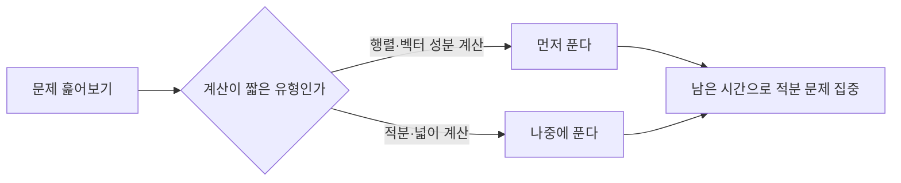

15편부터 18편까지 적분과 행렬·행렬식·벡터를 각각 배웠다. 이 편에서는 적분 문제와 행렬·벡터 문제를 번갈아 풀면서 **시간 배분 감각**을 기르고, 두 영역에서 각각 가장 자주 나오는 함정을 짚는다.

## 시간 관리 원칙

적분·행렬·벡터는 풀이의 중간 계산을 기록하며 연습한다. 적분 문제는 계산 단계가 많아 시간이 걸리기 쉽고, 행렬·벡터 문제는 계산 자체는 짧지만 순서를 잘못 잡으면 처음부터 다시 풀어야 한다. 따라서 다음 순서를 권장한다.

행렬·벡터 성분 계산처럼 **정해진 공식에 숫자만 넣으면 되는 문제**를 먼저 처리해 시간을 절약하고, 남은 시간을 계산 단계가 긴 적분 문제에 쓰는 것이 효율적이다.

## 유형 1 — 정적분으로 넓이 구하기

**문제 1.** 함수 $y=x^2$의 그래프와 $x$축, 직선 $x=0$, $x=3$으로 둘러싸인 부분의 넓이를 구하라.

**풀이.** $x=0$부터 $x=3$까지 구간에서 $y=x^2 \geq 0$이므로 넓이는 정적분 값과 같다.

$$
\int_0^3 x^2\,dx = \left[\frac{x^3}{3}\right]_0^3
$$

- $\dfrac{x^3}{3}$: $x^2$의 부정적분(거듭제곱 적분 공식 적용)

$$
\left[\frac{x^3}{3}\right]_0^3 = \frac{3^3}{3} - \frac{0^3}{3} = \frac{27}{3} - 0 = 9
$$

**검산.** 넓이를 아주 잘게 쪼갠 직사각형들의 합으로 근사해 확인할 수 있다. 구간을 3등분(폭 1씩)해서 오른쪽 끝값으로 높이를 잡으면 $1^2\times1 + 2^2\times1 + 3^2\times1 = 1+4+9=14$로 실제 넓이 9보다 크게 나오는데, 이는 함수가 증가하는 구간에서 오른쪽 끝값을 쓰면 항상 실제 넓이보다 과대평가되기 때문이다(반대로 왼쪽 끝값을 쓰면 $0+1+4=5$로 과소평가된다).

## 유형 2 — 두 곡선 사이의 넓이

**문제 2.** 함수 $y=x^2$와 $y=2x$로 둘러싸인 부분의 넓이를 구하라.

**풀이.** 먼저 두 함수가 만나는 점(교점)을 구한다. $x^2 = 2x$를 정리하면 $x^2-2x=0$, $x(x-2)=0$이므로 $x=0$ 또는 $x=2$이다.

$0$과 $2$ 사이에서 어느 함수가 위에 있는지 확인한다. 중간값 $x=1$을 대입하면 $y=2x$는 $2$, $y=x^2$은 $1$이므로 $y=2x$가 위에 있다. 두 곡선 사이의 넓이는 (위쪽 함수 − 아래쪽 함수)를 교점 사이에서 적분한다.

$$
\int_0^2 (2x - x^2)\,dx = \left[x^2 - \frac{x^3}{3}\right]_0^2
$$

$$
\left[x^2-\frac{x^3}{3}\right]_0^2 = \left(2^2 - \frac{2^3}{3}\right) - 0 = 4 - \frac{8}{3}
$$

$$
4 - \frac{8}{3} = \frac{12}{3} - \frac{8}{3} = \frac{4}{3}
$$

**검산.** 부호를 반대로($x^2-2x$) 적분하면 음수가 나와야 한다. $\displaystyle\int_0^2 (x^2-2x)\,dx = \left[\frac{x^3}{3}-x^2\right]_0^2 = \left(\frac{8}{3}-4\right)-0 = -\frac{4}{3}$로, 부호만 반대이고 크기는 $\dfrac{4}{3}$로 같다.

## 유형 3 — 행렬의 곱셈과 연립방정식

**문제 3.** 연립방정식 $\begin{cases} 2x+y=5 \\ x-y=1 \end{cases}$을 행렬을 이용해 풀어라.

**풀이.** 연립방정식을 행렬 형태 $AX=B$로 쓴다.

$$
\begin{pmatrix} 2 & 1 \\ 1 & -1 \end{pmatrix}\begin{pmatrix} x \\ y \end{pmatrix} = \begin{pmatrix} 5 \\ 1 \end{pmatrix}
$$

- $A = \begin{pmatrix} 2 & 1 \\ 1 & -1 \end{pmatrix}$: 계수행렬
- $X = \begin{pmatrix} x \\ y \end{pmatrix}$: 미지수 벡터
- $B = \begin{pmatrix} 5 \\ 1 \end{pmatrix}$: 상수항 벡터

$X = A^{-1}B$로 풀기 위해 먼저 $A$의 역행렬을 구한다. 행렬식은 다음과 같다.

$$
\det(A) = 2\times(-1) - 1\times1 = -2-1 = -3
$$

역행렬 공식에 대입한다.

$$
A^{-1} = \frac{1}{-3}\begin{pmatrix} -1 & -1 \\ -1 & 2 \end{pmatrix} = \begin{pmatrix} \tfrac{1}{3} & \tfrac{1}{3} \\ \tfrac{1}{3} & -\tfrac{2}{3} \end{pmatrix}
$$

이제 $X=A^{-1}B$를 계산한다.

$$
X = \begin{pmatrix} \tfrac{1}{3} & \tfrac{1}{3} \\ \tfrac{1}{3} & -\tfrac{2}{3} \end{pmatrix}\begin{pmatrix} 5 \\ 1 \end{pmatrix} = \begin{pmatrix} \tfrac{1}{3}\times5+\tfrac{1}{3}\times1 \\ \tfrac{1}{3}\times5+(-\tfrac{2}{3})\times1 \end{pmatrix} = \begin{pmatrix} 2 \\ 1 \end{pmatrix}
$$

따라서 $x=2$, $y=1$이다.

**검산.** 원래 연립방정식에 직접 대입한다. 첫 번째 식 $2x+y = 2\times2+1 = 5$로 일치하고, 두 번째 식 $x-y = 2-1 = 1$로 일치한다(검산 완료).

## 유형 4 — 벡터의 내적과 크기

**문제 4.** 벡터 $\vec{a} = (3, 4)$, $\vec{b} = (1, -2)$가 있을 때, 두 벡터의 **내적**(inner product, 두 벡터를 곱해서 하나의 숫자로 만드는 연산)과 $\vec{a}$의 크기를 구하라.

**풀이.** 내적은 성분끼리 곱해서 더한다.

$$
\vec{a} \cdot \vec{b} = 3\times1 + 4\times(-2) = 3-8 = -5
$$

벡터의 크기(길이)는 각 성분의 제곱을 더해 제곱근을 씌운다.

$$
|\vec{a}| = \sqrt{3^2+4^2} = \sqrt{9+16} = \sqrt{25} = 5
$$

**검산.** 벡터 $(3,4)$는 직각삼각형의 밑변 3, 높이 4에 해당하는 위치벡터로 볼 수 있다. 피타고라스 정리로 빗변의 길이를 구하면 $\sqrt{3^2+4^2}=5$로 벡터의 크기와 정확히 같다 — $(3,4,5)$는 잘 알려진 직각삼각형 세 변의 비율이므로 계산이 맞다는 것을 바로 확인할 수 있다(검산 완료).

## 유형 5 — 적분과 벡터가 함께 나오는 복합 문제

**문제 5.** 함수 $f(x)=2x+1$에 대해 $\displaystyle\int_0^2 f(x)\,dx$의 값을 구하고, 이 값을 첫 번째 성분으로, 행렬 $\begin{pmatrix}1&2\\0&1\end{pmatrix}$의 행렬식 값을 두 번째 성분으로 하는 벡터 $\vec{v}$의 크기를 구하라.

**풀이.** 먼저 정적분을 계산한다.

$$
\int_0^2 (2x+1)\,dx = \left[x^2+x\right]_0^2 = (4+2)-0 = 6
$$

다음으로 행렬식을 계산한다.

$$
\det\begin{pmatrix}1&2\\0&1\end{pmatrix} = 1\times1 - 2\times0 = 1
$$

벡터는 $\vec{v}=(6,1)$이며, 크기는 다음과 같다.

$$
|\vec{v}| = \sqrt{6^2+1^2} = \sqrt{36+1} = \sqrt{37}
$$

$\sqrt{37}$은 정수로 딱 떨어지지 않으므로 소수 둘째 자리까지 반올림하면 $\sqrt{37} \approx 6.08$이다.

**검산.** $6^2=36$, $6.1^2=37.21$이므로 $\sqrt{37}$은 6과 6.1 사이에 있고, 6.08의 제곱은 $6.08^2=36.9664$로 37에 매우 가깝다(검산 완료). 정적분 부분도 다시 확인하면, $f(x)=2x+1$은 $x=0$에서 1, $x=2$에서 5인 직선이므로 사다리꼴 넓이 공식으로 $\dfrac{(1+5)\times2}{2}=6$이 나와 정적분 결과와 일치한다(검산 완료).

## 자주 틀리는 점

- **두 곡선 사이의 넓이에서 위·아래 함수를 바꿔 빼는 것.** 반드시 중간값을 대입해 어느 함수가 위에 있는지 먼저 확인한 뒤 (위쪽 − 아래쪽) 순서로 적분해야 한다. 순서를 바꾸면 넓이가 음수로 나오므로, 음수가 나오면 바로 순서를 의심해야 한다.
- **역행렬 공식에서 행렬식이 음수일 때 부호 처리를 빠뜨리는 것.** $\dfrac{1}{\det(A)}$를 곱하는 과정에서 $\det(A)$가 음수이면 모든 성분의 부호가 한 번 더 바뀐다는 것을 잊기 쉽다.
- **내적의 결과가 음수로 나오면 계산이 틀렸다고 오해하는 것.** 내적은 두 벡터 사이의 각도에 따라 음수가 될 수 있으며, 각이 90도보다 크면 내적이 음수가 되는 것이 정상이다.
- **벡터의 크기를 구할 때 제곱근을 씌우지 않고 제곱의 합만 답으로 쓰는 것.** $|\vec{a}| = \sqrt{a_1^2+a_2^2}$에서 마지막 제곱근을 빠뜨리는 실수가 흔하다.

## 핵심 정리

- 두 곡선 사이의 넓이는 교점을 먼저 구하고, 중간값으로 위·아래 함수를 확인한 뒤 (위쪽 − 아래쪽)를 적분한다.
- 연립방정식은 행렬 $AX=B$ 형태로 바꾸고 $X=A^{-1}B$로 풀며, 답은 반드시 원래 방정식에 대입해 검산한다.
- 벡터의 내적은 음수가 될 수 있고, 크기는 항상 제곱근을 씌운 양수다.
- 계산이 짧게 끝나는 행렬·벡터 성분 계산을 먼저 처리하고, 단계가 긴 적분 문제에 남은 시간을 쓰는 것이 시간 관리에 유리하다.

## 마무리 복습

<Quiz
  questionNumber={1}
  question={"함수 y=x^2의 그래프와 x축, 직선 x=0, x=2로 둘러싸인 부분의 넓이는?"}
  options={["4/3","2","8/3","4"]}
  correctAnswer={3}
  explanation={"정적분 ∫[0,2]x^2dx = [x^3/3]에서 상한 2를 대입하면 8/3, 하한 0을 대입하면 0이므로 8/3-0 = 8/3이다."}
/>

<Quiz
  questionNumber={2}
  question={"함수 y=x^2와 y=4x로 둘러싸인 부분의 넓이는?"}
  options={["16/3","32/3","8","64/3"]}
  correctAnswer={2}
  explanation={"교점은 x^2=4x에서 x(x-4)=0이므로 x=0, 4이다. 0과 4 사이에서 y=4x가 위에 있으므로 ∫[0,4](4x-x^2)dx = [2x^2-x^3/3]에서 상한 4 대입 시 32-64/3=32/3, 하한 0에서 0이므로 넓이는 32/3이다."}
/>

<Quiz
  questionNumber={3}
  question={"연립방정식 3x+2y=8, x-y=1을 행렬로 풀 때 계수행렬의 행렬식은?"}
  options={["-5","-3","3","5"]}
  correctAnswer={1}
  explanation={"계수행렬은 [[3,2],[1,-1]]이다. 행렬식은 3×(-1)-2×1=-3-2=-5이다."}
/>

## 참고 자료

- [고등학교 미적분 공식·개념 정리](https://mathworld.wolfram.com)
- [독학사 출제방향 안내(문항당 시간·난이도 기준)](https://www.nile.or.kr)
