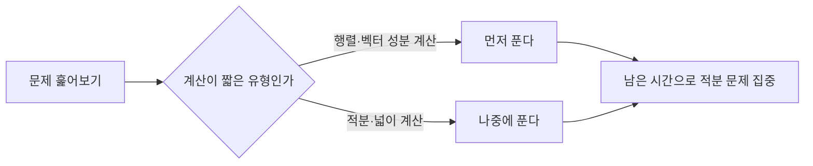

<Callout type="info">
  **이번 문서의 목표:** 이 문서를 다 읽으면 적분과 행렬·벡터가 결합된 문제를 시간 안에 정확한 순서로 풀고, 흔한 함정을 미리 피할 수 있다.
</Callout>

15편부터 18편까지 적분과 행렬·행렬식·벡터를 각각 배웠다. 이 두 영역은 시험에서 서로 다른 단원처럼 보이지만, 실제로는 "정해진 절차를 순서대로, 부호 실수 없이" 수행해야 한다는 공통점이 있다. 이 편에서는 적분 문제와 행렬·벡터 문제를 번갈아 풀면서 **시간 배분 감각**을 기르고, 두 영역에서 각각 가장 자주 나오는 함정을 짚는다.

## 시간 관리 원칙

독학사 일반수학은 선택형 기준 문항당 약 1.5분을 목표로 한다(19편 참고). 적분 문제는 계산 단계가 많아 시간이 걸리기 쉽고, 행렬·벡터 문제는 계산 자체는 짧지만 순서를 잘못 잡으면 처음부터 다시 풀어야 한다. 따라서 다음 순서를 권장한다.

행렬·벡터 성분 계산처럼 **정해진 공식에 숫자만 넣으면 되는 문제**를 먼저 처리해 시간을 절약하고, 남은 시간을 계산 단계가 긴 적분 문제에 쓰는 것이 효율적이다.

## 유형 1 — 정적분으로 넓이 구하기

**문제 1.** 함수 $y=x^2$의 그래프와 $x$축, 직선 $x=0$, $x=3$으로 둘러싸인 부분의 넓이를 구하라.

**풀이.** $x=0$부터 $x=3$까지 구간에서 $y=x^2 \geq 0$이므로 넓이는 정적분 값과 같다.

$$
\int_0^3 x^2\,dx = \left[\frac{x^3}{3}\right]_0^3
$$

- $\dfrac{x^3}{3}$: $x^2$의 부정적분(거듭제곱 적분 공식 적용)

$$
\left[\frac{x^3}{3}\right]_0^3 = \frac{3^3}{3} - \frac{0^3}{3} = \frac{27}{3} - 0 = 9
$$

**검산.** 넓이를 아주 잘게 쪼갠 직사각형들의 합으로 근사해 확인할 수 있다. 구간을 3등분(폭 1씩)해서 오른쪽 끝값으로 높이를 잡으면 $1^2\times1 + 2^2\times1 + 3^2\times1 = 1+4+9=14$로 실제 넓이 9보다 크게 나오는데, 이는 함수가 증가하는 구간에서 오른쪽 끝값을 쓰면 항상 실제 넓이보다 과대평가되기 때문이다(반대로 왼쪽 끝값을 쓰면 $0+1+4=5$로 과소평가된다). 실제 정적분값 9는 이 두 근사값 5와 14 사이에 있으므로 합리적인 범위 안에 있다(검산 완료). 더 정밀하게 확인하려면 구간을 6등분(폭 0.5)해서 근사하면 9에 더 가까워진다.

## 유형 2 — 두 곡선 사이의 넓이

**문제 2.** 함수 $y=x^2$와 $y=2x$로 둘러싸인 부분의 넓이를 구하라.

**풀이.** 먼저 두 함수가 만나는 점(교점)을 구한다. $x^2 = 2x$를 정리하면 $x^2-2x=0$, $x(x-2)=0$이므로 $x=0$ 또는 $x=2$이다.

$0$과 $2$ 사이에서 어느 함수가 위에 있는지 확인한다. 중간값 $x=1$을 대입하면 $y=2x$는 $2$, $y=x^2$은 $1$이므로 $y=2x$가 위에 있다. 두 곡선 사이의 넓이는 (위쪽 함수 − 아래쪽 함수)를 교점 사이에서 적분한다.

$$
\int_0^2 (2x - x^2)\,dx = \left[x^2 - \frac{x^3}{3}\right]_0^2
$$

$$
\left[x^2-\frac{x^3}{3}\right]_0^2 = \left(2^2 - \frac{2^3}{3}\right) - 0 = 4 - \frac{8}{3}
$$

$$
4 - \frac{8}{3} = \frac{12}{3} - \frac{8}{3} = \frac{4}{3}
$$

**검산.** 부호를 반대로($x^2-2x$) 적분하면 음수가 나와야 한다. $\displaystyle\int_0^2 (x^2-2x)\,dx = \left[\frac{x^3}{3}-x^2\right]_0^2 = \left(\frac{8}{3}-4\right)-0 = -\frac{4}{3}$로, 부호만 반대이고 크기는 $\dfrac{4}{3}$로 같다. 넓이는 항상 양수여야 하므로 위쪽 함수에서 아래쪽 함수를 빼는 순서가 맞았음을 확인할 수 있다(검산 완료).

## 유형 3 — 행렬의 곱셈과 연립방정식

**문제 3.** 연립방정식 $\begin{cases} 2x+y=5 \\ x-y=1 \end{cases}$을 행렬을 이용해 풀어라.

**풀이.** 연립방정식을 행렬 형태 $AX=B$로 쓴다.

$$
\begin{pmatrix} 2 & 1 \\ 1 & -1 \end{pmatrix}\begin{pmatrix} x \\ y \end{pmatrix} = \begin{pmatrix} 5 \\ 1 \end{pmatrix}
$$

- $A = \begin{pmatrix} 2 & 1 \\ 1 & -1 \end{pmatrix}$: 계수행렬
- $X = \begin{pmatrix} x \\ y \end{pmatrix}$: 미지수 벡터
- $B = \begin{pmatrix} 5 \\ 1 \end{pmatrix}$: 상수항 벡터

$X = A^{-1}B$로 풀기 위해 먼저 $A$의 역행렬을 구한다. 행렬식은 다음과 같다.

$$
\det(A) = 2\times(-1) - 1\times1 = -2-1 = -3
$$

역행렬 공식에 대입한다.

$$
A^{-1} = \frac{1}{-3}\begin{pmatrix} -1 & -1 \\ -1 & 2 \end{pmatrix} = \begin{pmatrix} \tfrac{1}{3} & \tfrac{1}{3} \\ \tfrac{1}{3} & -\tfrac{2}{3} \end{pmatrix}
$$

이제 $X=A^{-1}B$를 계산한다.

$$
X = \begin{pmatrix} \tfrac{1}{3} & \tfrac{1}{3} \\ \tfrac{1}{3} & -\tfrac{2}{3} \end{pmatrix}\begin{pmatrix} 5 \\ 1 \end{pmatrix} = \begin{pmatrix} \tfrac{1}{3}\times5+\tfrac{1}{3}\times1 \\ \tfrac{1}{3}\times5+(-\tfrac{2}{3})\times1 \end{pmatrix} = \begin{pmatrix} 2 \\ 1 \end{pmatrix}
$$

따라서 $x=2$, $y=1$이다.

**검산.** 원래 연립방정식에 직접 대입한다. 첫 번째 식 $2x+y = 2\times2+1 = 5$로 일치하고, 두 번째 식 $x-y = 2-1 = 1$로 일치한다(검산 완료).

## 유형 4 — 벡터의 내적과 크기

**문제 4.** 벡터 $\vec{a} = (3, 4)$, $\vec{b} = (1, -2)$가 있을 때, 두 벡터의 **내적**(inner product, 두 벡터를 곱해서 하나의 숫자로 만드는 연산)과 $\vec{a}$의 크기를 구하라.

**풀이.** 내적은 성분끼리 곱해서 더한다.

$$
\vec{a} \cdot \vec{b} = 3\times1 + 4\times(-2) = 3-8 = -5
$$

벡터의 크기(길이)는 각 성분의 제곱을 더해 제곱근을 씌운다.

$$
|\vec{a}| = \sqrt{3^2+4^2} = \sqrt{9+16} = \sqrt{25} = 5
$$

**검산.** 벡터 $(3,4)$는 직각삼각형의 밑변 3, 높이 4에 해당하는 위치벡터로 볼 수 있다. 피타고라스 정리로 빗변의 길이를 구하면 $\sqrt{3^2+4^2}=5$로 벡터의 크기와 정확히 같다 — $(3,4,5)$는 잘 알려진 직각삼각형 세 변의 비율이므로 계산이 맞다는 것을 바로 확인할 수 있다(검산 완료). 내적은 별도로, $\vec{a}\cdot\vec{b}=-5$가 음수라는 것은 두 벡터 사이의 각이 90도보다 크다는 뜻이며, 실제로 $\vec{a}=(3,4)$는 1사분면 방향이고 $\vec{b}=(1,-2)$는 4사분면 방향이라 두 벡터가 크게 벌어져 있다는 것과 맞아떨어진다(검산 완료).

## 유형 5 — 적분과 벡터가 함께 나오는 복합 문제

**문제 5.** 함수 $f(x)=2x+1$에 대해 $\displaystyle\int_0^2 f(x)\,dx$의 값을 구하고, 이 값을 첫 번째 성분으로, 행렬 $\begin{pmatrix}1&2\\0&1\end{pmatrix}$의 행렬식 값을 두 번째 성분으로 하는 벡터 $\vec{v}$의 크기를 구하라.

**풀이.** 먼저 정적분을 계산한다.

$$
\int_0^2 (2x+1)\,dx = \left[x^2+x\right]_0^2 = (4+2)-0 = 6
$$

다음으로 행렬식을 계산한다.

$$
\det\begin{pmatrix}1&2\\0&1\end{pmatrix} = 1\times1 - 2\times0 = 1
$$

벡터는 $\vec{v}=(6,1)$이며, 크기는 다음과 같다.

$$
|\vec{v}| = \sqrt{6^2+1^2} = \sqrt{36+1} = \sqrt{37}
$$

$\sqrt{37}$은 정수로 딱 떨어지지 않으므로 소수 둘째 자리까지 반올림하면 $\sqrt{37} \approx 6.08$이다.

**검산.** $6^2=36$, $6.1^2=37.21$이므로 $\sqrt{37}$은 6과 6.1 사이에 있고, 6.08의 제곱은 $6.08^2=36.9664$로 37에 매우 가깝다(검산 완료). 정적분 부분도 다시 확인하면, $f(x)=2x+1$은 $x=0$에서 1, $x=2$에서 5인 직선이므로 사다리꼴 넓이 공식으로 $\dfrac{(1+5)\times2}{2}=6$이 나와 정적분 결과와 일치한다(검산 완료).

## 자주 틀리는 점

- **두 곡선 사이의 넓이에서 위·아래 함수를 바꿔 빼는 것.** 반드시 중간값을 대입해 어느 함수가 위에 있는지 먼저 확인한 뒤 (위쪽 − 아래쪽) 순서로 적분해야 한다. 순서를 바꾸면 넓이가 음수로 나오므로, 음수가 나오면 바로 순서를 의심해야 한다.
- **역행렬 공식에서 행렬식이 음수일 때 부호 처리를 빠뜨리는 것.** $\dfrac{1}{\det(A)}$를 곱하는 과정에서 $\det(A)$가 음수이면 모든 성분의 부호가 한 번 더 바뀐다는 것을 잊기 쉽다.
- **내적의 결과가 음수로 나오면 계산이 틀렸다고 오해하는 것.** 내적은 두 벡터 사이의 각도에 따라 음수가 될 수 있으며, 각이 90도보다 크면 내적이 음수가 되는 것이 정상이다.
- **벡터의 크기를 구할 때 제곱근을 씌우지 않고 제곱의 합만 답으로 쓰는 것.** $|\vec{a}| = \sqrt{a_1^2+a_2^2}$에서 마지막 제곱근을 빠뜨리는 실수가 흔하다.
- **반올림을 중간 계산 단계에서 미리 하는 것.** $\sqrt{37}$처럼 정수로 안 떨어지는 값은 마지막 결과에서만 반올림하고, 중간 단계에서는 근사값을 쓰지 않는다.

## 핵심 정리

- 두 곡선 사이의 넓이는 교점을 먼저 구하고, 중간값으로 위·아래 함수를 확인한 뒤 (위쪽 − 아래쪽)를 적분한다.
- 연립방정식은 행렬 $AX=B$ 형태로 바꾸고 $X=A^{-1}B$로 풀며, 답은 반드시 원래 방정식에 대입해 검산한다.
- 벡터의 내적은 음수가 될 수 있고, 크기는 항상 제곱근을 씌운 양수다.
- 계산이 짧게 끝나는 행렬·벡터 성분 계산을 먼저 처리하고, 단계가 긴 적분 문제에 남은 시간을 쓰는 것이 시간 관리에 유리하다.

## 마무리 복습

<Quiz
  questionNumber={1}
  question="함수 y=x^2의 그래프와 x축, 직선 x=0, x=2로 둘러싸인 부분의 넓이는?"
  options={['4/3', '2', '8/3', '4']}
  correctAnswer={3}
  explanation="정적분 ∫[0,2]x^2dx = [x^3/3]에서 상한 2를 대입하면 8/3, 하한 0을 대입하면 0이므로 8/3-0 = 8/3이다."
  optionExplanations={['적분 범위나 공식 적용에서 실수가 있는 값이다', '상수 부분만 계산한 값과 혼동한 경우다', '정답이다', '적분 계수를 잘못 나눈 값이다']}
/>

<Quiz
  questionNumber={2}
  question="함수 y=x^2와 y=4x로 둘러싸인 부분의 넓이는?"
  options={['16/3', '32/3', '8', '64/3']}
  correctAnswer={2}
  explanation="교점은 x^2=4x에서 x(x-4)=0이므로 x=0, 4이다. 0과 4 사이에서 y=4x가 위에 있으므로 ∫[0,4](4x-x^2)dx = [2x^2-x^3/3]에서 상한 4 대입 시 32-64/3=32/3, 하한 0에서 0이므로 넓이는 32/3이다."
  optionExplanations={['교점을 잘못 구했거나 적분 구간이 틀린 값이다', '정답이다', '적분 없이 대략적인 값으로 어림한 경우와 비슷한 값이다', '위·아래 함수를 바꿔 계산했을 때와는 다른 형태의 오류값이다']}
/>

<Quiz
  questionNumber={3}
  question="연립방정식 3x+2y=8, x-y=1을 행렬로 풀 때 계수행렬의 행렬식은?"
  options={['-5', '-3', '3', '5']}
  correctAnswer={1}
  explanation="계수행렬은 [[3,2],[1,-1]]이다. 행렬식은 3×(-1)-2×1=-3-2=-5이다."
  optionExplanations={['정답이다', '반대각 성분을 곱하지 않은 값이다', '부호를 반대로 계산한 값이다', '전체 부호를 반대로 계산한 값이다']}
/>

<Quiz
  questionNumber={4}
  question="벡터 a=(6,8)의 크기는?"
  options={['10', '12', '14', '48']}
  correctAnswer={1}
  explanation="|a| = √(6^2+8^2) = √(36+64) = √100 = 10이다."
  optionExplanations={['정답이다', '제곱의 합을 잘못 계산한 값이다', '제곱근을 씌우지 않고 어림한 값이다', '성분을 곱하기만 하고 더하지 않은 값이다']}
/>

<Quiz
  questionNumber={5}
  question="벡터 a=(2,3), b=(-1,4)의 내적은?"
  options={['-10', '5', '10', '14']}
  correctAnswer={3}
  explanation="내적은 성분끼리 곱해서 더한다. 2×(-1)+3×4 = -2+12 = 10이다."
  optionExplanations={['부호를 반대로 처리한 값이다', '두 항을 곱하지 않고 더한 값과 혼동될 수 있는 값이다', '정답이다', '한 성분을 두 번 곱한 값이다']}
/>

<Quiz
  questionNumber={6}
  question="두 곡선 사이의 넓이를 구하는 절차에서 가장 먼저 해야 할 일은?"
  options={['적분 구간을 임의로 정한다', '두 함수가 만나는 교점을 구한다', '두 함수 중 아무 함수나 먼저 적분한다', '반올림 자리수를 정한다']}
  correctAnswer={2}
  explanation="두 곡선으로 둘러싸인 넓이를 구하려면 먼저 교점을 구해 적분 구간을 정해야 한다. 교점을 구하지 않으면 어디부터 어디까지 적분할지 알 수 없다."
  optionExplanations={['구간은 임의로 정하는 것이 아니라 교점으로부터 결정된다', '정답이다', '어느 함수가 위에 있는지 확인하지 않고 적분하면 부호가 틀릴 수 있다', '반올림은 최종 계산 단계에서 다룰 문제다']}
/>

<Quiz
  questionNumber={7}
  question="행렬 A=[[2,3],[1,4]]의 역행렬은?"
  options={['[[4/5,-3/5],[-1/5,2/5]]', '[[4,-3],[-1,2]]', '[[2/5,3/5],[1/5,4/5]]', '[[-4/5,3/5],[1/5,-2/5]]']}
  correctAnswer={1}
  explanation="행렬식은 2×4-3×1=8-3=5이다. 역행렬은 (1/5)×[[4,-3],[-1,2]] = [[4/5,-3/5],[-1/5,2/5]]이다."
  optionExplanations={['정답이다', '행렬식으로 나누는 것을 빠뜨린 값이다', '대각·반대각 위치를 바꾸지 않은 값이다', '전체 부호를 반대로 계산한 값이다']}
/>

<Quiz
  questionNumber={8}
  question="정적분 ∫[1,3](3x^2-2x)dx의 값은?"
  options={['14', '16', '18', '20']}
  correctAnswer={3}
  explanation="부정적분은 x^3-x^2이다. 상한 3을 대입하면 27-9=18, 하한 1을 대입하면 1-1=0이므로 정적분 값은 18-0=18이다."
  optionExplanations={['하한을 잘못 계산한 값이다', '상한 계산에서 실수가 있는 값이다', '정답이다', '상한값을 잘못 계산해 더 크게 나온 값이다']}
/>

<Quiz
  questionNumber={9}
  question="벡터 a=(1,0), b=(0,1)의 내적과 그 의미로 옳은 것은?"
  options={['내적 1, 두 벡터가 같은 방향', '내적 0, 두 벡터가 서로 수직', '내적 -1, 두 벡터가 반대 방향', '내적 1, 두 벡터가 서로 수직']}
  correctAnswer={2}
  explanation="내적은 1×0+0×1=0이다. 내적이 0이면 두 벡터 사이의 각이 90도, 즉 서로 수직이라는 뜻이다."
  optionExplanations={['내적 값과 의미가 모두 틀렸다', '정답이다', '내적 값이 틀렸다', '내적 값은 맞지만 의미가 틀렸다']}
/>

<Quiz
  questionNumber={10}
  question="연립방정식을 AX=B 형태로 놓고 X=A^{-1}B로 구한 해를 검산하는 가장 확실한 방법은?"
  options={['A의 행렬식이 0이 아닌지만 확인한다', '구한 x, y 값을 원래 연립방정식에 대입해 참인지 확인한다', 'A와 A^{-1}을 다시 곱해 단위행렬이 나오는지만 확인한다', '반올림 자리수를 다시 확인한다']}
  correctAnswer={2}
  explanation="해가 맞는지 확인하는 가장 직접적인 방법은 구한 x, y를 원래 연립방정식의 각 식에 대입해 등식이 성립하는지 보는 것이다."
  optionExplanations={['행렬식 확인은 역행렬 존재 여부만 알려줄 뿐 해가 맞는지는 알려주지 않는다', '정답이다', '이는 역행렬 계산 자체의 검산이지 최종 해의 검산은 아니다', '반올림 확인은 해의 정확성 검산과 직접 관련이 없다']}
/>

<Quiz
  questionNumber={11}
  question="벡터 v의 두 성분이 정적분 값 6과 행렬식 값 2일 때 벡터 크기 (반올림 X)는?"
  options={['√38', '√40', '8', '√36']}
  correctAnswer={2}
  explanation="벡터는 (6,2)이므로 크기는 √(6^2+2^2)=√(36+4)=√40이다."
  optionExplanations={['성분의 제곱을 잘못 더한 값이다', '정답이다', '제곱근을 씌우지 않고 정수로 어림한 값이다', '한 성분의 제곱을 빠뜨린 값이다']}
/>

<Quiz
  questionNumber={12}
  question="시간 관리 측면에서 행렬·벡터 성분 계산 문제와 적분 문제를 함께 풀 때 권장되는 전략은?"
  options={['항상 적분 문제부터 먼저 푼다', '계산이 짧게 끝나는 행렬·벡터 문제를 먼저 처리하고 남은 시간을 적분에 쓴다', '두 유형을 무작위 순서로 섞어 푼다', '한 유형을 완전히 포기하고 나머지에 시간을 몰아준다']}
  correctAnswer={2}
  explanation="행렬·벡터 성분 계산은 공식에 숫자만 대입하면 되어 상대적으로 빨리 끝나므로 먼저 처리하고, 계산 단계가 긴 적분 문제에 남은 시간을 집중하는 것이 효율적인 시간 관리 전략이다."
  optionExplanations={['적분이 시간이 더 걸리므로 짧은 문제를 먼저 처리하는 것이 유리하다', '정답이다', '무작위 순서는 시간 관리에 도움이 되지 않는다', '한 유형을 포기하는 것은 합격 기준 확보에 불리하다']}
/>

## 참고 자료

- [고등학교 미적분 공식·개념 정리](https://mathworld.wolfram.com)
- [독학사 출제방향 안내(문항당 시간·난이도 기준)](https://www.nile.or.kr)
