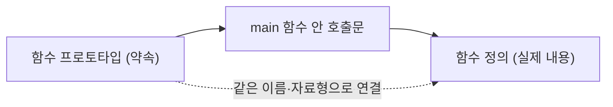

<Callout type="info">
  **이번 문서의 목표:** 이 파일을 다 읽으면 아무 C 소스 코드를 봐도 어디부터 어디까지가 한 덩어리(문)인지, 중괄호가 무엇을 묶는지, 왜 세미콜론이 있고 없고에 따라 컴파일 결과가 달라지는지, 그리고 변수·함수 이름을 지을 때 어떤 규칙을 지켜야 하는지 스스로 설명할 수 있다.
</Callout>

## 왜 문법 기호부터 익혀야 하는가

01편에서 확인했듯 이 시험은 지필(紙筆) 시험이라, 시험장에서는 컴파일러가 오류를 대신 짚어 주지 않습니다. 사람이 눈으로 코드를 읽으면서 "이 줄이 왜 문법 오류인지", "이 중괄호가 어디서 끝나는지"를 스스로 판단해야 합니다. 그런데 정작 많은 입문자가 변수나 반복문 같은 "내용"은 열심히 공부하면서, 세미콜론·중괄호·주석 같은 "표기법"은 대충 넘어갑니다. 이 표기법을 정확히 모르면 06편 이후에 나오는 모든 코드에서 "이게 왜 안 되는지" 매번 헷갈리게 되므로, 여기서 먼저 뼈대만 확실히 잡아 둡니다.

> **쉽게 말하면:** 이 편은 한글을 배우기 전에 띄어쓰기와 문장부호 규칙부터 익히는 단계와 같습니다. 내용을 몰라도 최소한 "문장이 어디서 끝나는지"는 구분할 수 있어야 합니다.

## 1. C 소스 파일의 전체 구조

C 소스 파일(source file, 사람이 작성하는 `.c` 확장자의 텍스트 파일)은 보통 다음과 같은 순서로 구성됩니다.

```c
#include <stdio.h>

int add(int a, int b);

int main(void) {
    int result = add(3, 4);
    printf("result = %d\n", result);
    return 0;
}

int add(int a, int b) {
    return a + b;
}
```

```text
result = 7
```

이 짧은 코드 안에 C 소스 파일의 핵심 구성 요소가 모두 들어 있습니다.

| 구성 요소 | 이 예제에서의 위치 | 역할 |
|-----------|---------------------|------|
| 전처리기 지시문 | `#include <stdio.h>` | 컴파일 전에 다른 파일 내용을 끌어와 붙이라는 지시. 15편에서 깊게 다룬다 |
| 함수 프로토타입(선언) | `int add(int a, int b);` | "이런 이름과 매개변수, 반환 자료형을 가진 함수가 나중에 정의되어 있다"고 미리 알려 주는 문장 |
| main 함수 | `int main(void) { ... }` | 프로그램이 실행을 시작하는 지점 |
| 함수 정의 | `int add(int a, int b) { ... }` | 프로토타입에서 약속한 함수의 실제 내용(몸체) |

이 파일이 컴파일러(compiler, 사람이 쓴 소스 코드를 컴퓨터가 실행할 수 있는 기계어로 바꿔 주는 프로그램)를 거쳐 실행 파일이 되는 과정, 그리고 `#include`가 정확히 무슨 일을 하는지는 06편에서 컴파일 흐름 전체를 다룰 때 이어서 설명합니다. 여기서는 "코드가 저 네 종류의 조각으로 나뉜다"는 큰 틀만 잡아 둡니다.

## 2. main 함수 — 실행이 시작되는 자리

C로 만든 프로그램은 아무리 코드가 길어도 실행은 항상 `main`이라는 이름의 함수에서 시작합니다. 이 예제의 `int main(void)`을 뜯어 보면 다음과 같습니다.

- `int`: 이 함수가 실행을 마치고 돌려주는 값의 자료형(반환 자료형)이 정수(integer)라는 뜻입니다.
- `main`: 함수의 이름입니다. 이 이름은 프로그램의 시작점이라는 특별한 의미를 가지므로 다른 이름으로 바꿀 수 없습니다.
- `void`: 이 함수가 매개변수(parameter, 함수를 호출할 때 전달받는 값)를 받지 않는다는 뜻입니다. 여기서 `void`는 "비어 있음"을 명시적으로 표시하는 키워드입니다.
- `return 0;`: 함수를 종료하며 운영체제에 0이라는 값을 돌려줍니다. 관례적으로 0은 "정상 종료", 0이 아닌 값은 "비정상 종료"를 뜻합니다.

> **쉽게 말하면:** `main` 함수는 건물의 정문입니다. 건물 안에 방(다른 함수)이 아무리 많아도, 방문객(운영체제)은 항상 정문으로 먼저 들어와야 합니다.

**자주 틀리는 점**: `main` 함수가 여러 개 있거나 아예 없는 코드, 혹은 `main`의 철자를 `Main`처럼 대문자로 바꾼 코드를 보여 주고 "이 코드가 정상적으로 컴파일되는가"를 묻는 문제가 자주 나옵니다. C는 대소문자를 구분하는 언어이므로 `Main`은 `main`과 완전히 다른 이름이며, 이 경우 프로그램의 시작점을 찾지 못해 컴파일(정확히는 링크) 오류가 발생합니다.

## 3. 함수 프로토타입 — 미리 하는 약속

앞의 예제에서 `add` 함수는 `main` 함수보다 아래쪽에 정의되어 있는데도 `main` 함수 안에서 먼저 호출됩니다. 이것이 가능한 이유는 `main` 함수 정의 앞에 다음 줄이 있었기 때문입니다.

```c
int add(int a, int b);
```

이 문장을 **함수 프로토타입**(function prototype, 함수 원형이라고도 함)이라고 부릅니다. 프로토타입은 함수의 몸체(중괄호로 둘러싸인 실제 실행 코드) 없이, 함수의 이름·반환 자료형·매개변수 목록만 미리 컴파일러에게 알려 주는 문장입니다. 컴파일러는 소스 코드를 위에서 아래로 읽어 나가기 때문에, `add`라는 이름이 등장했을 때 그것이 무엇인지 미리 알아야 `main` 함수 안의 호출문을 올바르게 해석할 수 있습니다.



> **쉽게 말하면:** 프로토타입은 회의 시작 전에 나눠 주는 "발표자 소개 카드"입니다. 카드에는 발표자의 이름과 어떤 주제로 몇 분간 말할지만 적혀 있고, 실제 발표 내용(함수 몸체)은 나중에 그 사람 차례가 되었을 때 나옵니다.

프로토타입이 없어도 함수가 호출되기 전에 함수 정의 자체가 먼저 나오면 컴파일에 문제가 없습니다. 즉 프로토타입은 "함수 정의보다 호출이 먼저 나오는 경우"에 반드시 필요한 장치입니다. 이 규칙은 10편에서 함수를 본격적으로 다룰 때 다시 확인합니다.

## 4. 식과 문 — C 코드를 끊어 읽는 단위

C 코드를 읽을 때 가장 먼저 구분해야 하는 두 단위가 **식**(expression)과 **문**(statement)입니다.

- **식**(expression): 계산되어 하나의 값을 만들어 내는 코드 조각입니다. 예를 들어 `3 + 4`, `a * b`, `add(3, 4)`는 모두 식입니다. 식은 그 자체로는 아직 "실행 지시"가 완성되지 않은 상태입니다.
- **문**(statement): 식의 끝에 세미콜론(`;`)을 붙여서 만든, "이 계산을 실제로 수행하라"는 완성된 지시문입니다. `int result = add(3, 4);`가 문의 예입니다.

세미콜론은 그래서 "여기까지가 한 문장이다"를 컴파일러에게 알려 주는 마침표 역할을 합니다. 세미콜론이 빠지면 컴파일러는 다음 줄까지 같은 문장으로 이어서 읽으려 하다가 문법 오류를 냅니다.

```c
int x = 3
int y = 4;
```

```text
컴파일 오류: 세미콜론이 없어 "int x = 3"과 "int y = 4;"가
한 문장처럼 잘못 이어져 해석됩니다.
```

**자주 틀리는 점**: 중괄호로 감싼 블록(예: `if` 문의 몸체, 함수 몸체) 뒤에는 세미콜론을 붙이지 않지만, 변수 선언·대입·함수 호출처럼 세미콜론으로 끝나는 문 앞뒤로는 반드시 세미콜론이 있어야 합니다. "중괄호로 끝나면 항상 세미콜론이 필요 없다"고 일반화하면, 구조체 정의처럼 중괄호 뒤에도 세미콜론이 필요한 경우(14편에서 확인)를 놓치게 됩니다.

## 5. 중괄호 — 코드를 하나의 덩어리로 묶는 표기

중괄호(`{`와 `}`)는 여러 개의 문을 하나의 **블록**(block)으로 묶는 역할을 합니다. 함수의 몸체, `if` 문이나 반복문 안에서 실행할 여러 줄의 코드가 모두 이 중괄호 블록 안에 들어갑니다.

```c
int main(void) {
    int score = 85;
    if (score >= 60) {
        printf("합격\n");
    }
    return 0;
}
```

```text
합격
```

이 코드에서 중괄호는 두 겹으로 쓰였습니다. 바깥쪽 중괄호는 `main` 함수 전체의 몸체를 묶고, 안쪽 중괄호는 `if` 문의 조건이 참일 때 실행할 코드 덩어리를 묶습니다. 중괄호는 이렇게 겹쳐 쓸 수 있으며, 반드시 **열고 닫는 짝이 맞아야** 합니다. 짝이 하나라도 어긋나면 컴파일러는 함수나 블록의 끝을 잘못 판단해 뒤따르는 코드 전체를 엉뚱하게 해석합니다.

> **쉽게 말하면:** 중괄호는 서류를 묶는 클립입니다. 클립 하나(중괄호 한 쌍)가 여러 장의 서류(여러 줄의 문)를 하나의 묶음으로 만들어 주며, 클립을 여러 개 겹쳐 쓰면(중첩) 묶음 안에 더 작은 묶음을 만들 수 있습니다.

## 6. 주석 — 컴파일러가 무시하는 사람을 위한 메모

**주석**(comment)은 컴파일러가 코드로 취급하지 않고 그냥 건너뛰는 부분으로, 코드를 읽는 사람을 위한 설명을 남기는 데 씁니다. C는 두 가지 주석 표기법을 제공합니다.

```c
// 한 줄 주석: 이 줄의 끝까지만 주석 처리된다
int total = 0;

/* 여러 줄 주석:
   슬래시-별표로 시작해서
   별표-슬래시로 끝날 때까지 전부 주석 처리된다 */
int count = 0;
```

여러 줄 주석은 시작 표시(슬래시 다음에 별표)와 끝 표시(별표 다음에 슬래시)가 정확히 짝을 이뤄야 하며, **여러 줄 주석을 다시 여러 줄 주석으로 겹쳐 쓸 수 없습니다.** 즉 이미 여러 줄 주석으로 감싸 놓은 코드 안에, 끝 표시가 없는 채로 또 다른 여러 줄 주석 시작 표시가 들어가면, 컴파일러는 맨 처음 만나는 끝 표시에서 주석이 끝났다고 판단해 버려 의도와 다르게 코드 일부가 살아나거나 오류가 납니다. 시험에서는 이런 "주석 안에 주석이 겹친 코드"를 보여 주고 실제로 주석 처리되는 범위를 묻는 문제가 나올 수 있습니다.

## 7. 식별자 규칙 — 이름을 지을 때 지켜야 하는 것

**식별자**(identifier)는 변수, 함수, 상수 등에 붙이는 이름입니다. C에서 식별자를 지을 때 지켜야 하는 규칙은 다음과 같습니다.

| 규칙 | 허용 예 | 위반 예 |
|------|---------|---------|
| 영문자·숫자·밑줄(`_`)만 사용 | `total_score`, `count1` | `total-score`(하이픈 사용 불가) |
| 숫자로 시작할 수 없음 | `_1st`, `value2` | `1st_value` |
| 대소문자를 구분함 | `Score`와 `score`는 서로 다른 식별자 | `Score`를 `score`와 같은 이름으로 착각 |
| 예약어(키워드)는 식별자로 쓸 수 없음 | `myInt`, `whileCount` | `int`, `while`을 변수 이름으로 사용 |

여기서 **예약어**(keyword)란 `int`, `if`, `while`, `return`처럼 C 언어 자체가 특별한 의미로 미리 정해 둔 단어를 뜻합니다. 예약어는 문법적으로 이미 역할이 정해져 있으므로 변수나 함수 이름으로 다시 쓸 수 없습니다. 어떤 예약어가 있는지, 그리고 각 예약어의 영문·한글 대응은 03편에서 자료형·연산자와 함께 표로 정리합니다.

**자주 틀리는 점**: 식별자에 밑줄은 허용되지만 하이픈(`-`)은 허용되지 않는다는 점을 자주 헷갈립니다. `total-score`처럼 하이픈이 들어간 이름은 컴파일러가 "total 빼기 score"라는 뺄셈 식으로 잘못 해석하여 오류를 냅니다. 또한 C는 대소문자를 구분하므로, `Total`과 `total`을 같은 변수로 착각해 서로 다른 두 변수를 실수로 만들어 버리는 것도 시험에서 자주 나오는 함정입니다.

## 핵심 정리

- C 소스 파일은 전처리기 지시문, 함수 프로토타입, `main` 함수, 함수 정의로 구성되며 실행은 항상 `main` 함수에서 시작한다.
- 함수 프로토타입은 함수 정의보다 호출이 먼저 나올 때, 이름·반환 자료형·매개변수를 미리 컴파일러에게 알려 주는 약속이다.
- 식은 값을 만들어 내는 코드 조각이고, 문은 식 끝에 세미콜론을 붙여 완성한 실행 지시이며, 세미콜론 누락은 컴파일 오류로 이어진다.
- 중괄호는 여러 문을 하나의 블록으로 묶으며 열고 닫는 짝이 반드시 맞아야 한다.
- 식별자는 영문자·숫자·밑줄만 쓸 수 있고 숫자로 시작할 수 없으며, 대소문자를 구분하고, 예약어는 식별자로 쓸 수 없다.

## 마무리 복습

<Quiz
  questionNumber={1}
  question="다음 중 C 소스 파일의 구성 요소와 역할을 바르게 짝지은 것은?"
  options={['함수 프로토타입은 함수의 실제 실행 코드를 담고 있다.', 'main 함수는 프로그램 실행이 시작되는 지점이다.', '전처리기 지시문은 프로그램 실행 중에 매번 다시 해석된다.', '함수 정의는 함수의 이름과 매개변수만 미리 알려 주는 문장이다.']}
  correctAnswer={2}
  explanation="main 함수는 C 프로그램의 실행이 시작되는 지점이며, 함수 프로토타입은 실행 코드 없이 이름과 자료형만 미리 알려 주는 약속에 해당한다."
  optionExplanations={['함수 프로토타입은 실행 코드가 없는 약속이며, 실제 실행 코드는 함수 정의에 있다.', '정답. main 함수는 실행이 시작되는 지점이다.', '전처리기 지시문은 컴파일 전 단계에서 처리되는 것으로, 06편에서 자세히 다룬다.', '이름과 매개변수만 미리 알려 주는 것은 함수 프로토타입이며, 함수 정의는 실제 실행 코드(몸체)를 포함한다.']}
/>

<Quiz
  questionNumber={2}
  question="함수 프로토타입에 대한 설명으로 옳지 않은 것은?"
  options={['함수 정의보다 호출이 먼저 나올 때 필요하다.', '함수의 이름, 반환 자료형, 매개변수 목록을 미리 알려 준다.', '프로토타입 자체에 함수의 실제 실행 코드가 포함되어 있다.', '컴파일러가 소스 코드를 위에서 아래로 읽기 때문에 필요한 장치다.']}
  correctAnswer={3}
  explanation="함수 프로토타입은 이름·반환 자료형·매개변수만 미리 알려 주는 약속일 뿐이며, 실제 실행 코드(함수 몸체)는 포함하지 않는다."
  optionExplanations={['옳은 설명이다. 정의보다 호출이 먼저 나올 때 프로토타입이 필요하다.', '옳은 설명이다. 프로토타입은 이름·반환 자료형·매개변수 목록을 알려 준다.', '옳지 않은 설명이므로 정답이다. 실제 실행 코드는 함수 정의에 있으며 프로토타입에는 없다.', '옳은 설명이다. 컴파일러가 위에서 아래로 읽어 나가기 때문에 미리 알려 줄 필요가 있다.']}
/>

<Quiz
  questionNumber={3}
  question="다음 중 세미콜론과 중괄호 사용에 대한 설명으로 가장 적절한 것은?"
  options={['세미콜론은 식을 완성된 문으로 만드는 역할을 한다.', '중괄호는 항상 하나만 쓸 수 있고 중첩할 수 없다.', '함수 몸체를 감싸는 중괄호 뒤에는 항상 세미콜론을 붙여야 한다.', '세미콜론이 없어도 컴파일러는 항상 문의 끝을 올바르게 추측한다.']}
  correctAnswer={1}
  explanation="세미콜론은 식의 끝에 붙어 이를 실제로 실행하라는 완성된 문으로 만드는 표기이며, 이것이 빠지면 컴파일러가 문의 경계를 잘못 해석할 수 있다."
  optionExplanations={['정답. 세미콜론은 식을 완성된 문으로 만드는 표기다.', '중괄호는 필요에 따라 여러 겹으로 중첩해서 쓸 수 있다.', '함수 몸체를 감싸는 중괄호 뒤에는 세미콜론을 붙이지 않는다.', '세미콜론이 빠지면 컴파일러가 다음 줄까지 같은 문으로 잘못 이어 읽어 오류를 낼 수 있다.']}
/>

<Quiz
  questionNumber={4}
  question="C의 주석 표기법에 대한 설명으로 옳지 않은 것은?"
  options={['한 줄 주석은 슬래시 두 개로 시작해 그 줄의 끝까지만 적용된다.', '여러 줄 주석은 시작 표시와 끝 표시가 정확히 짝을 이뤄야 한다.', '여러 줄 주석 안에 또 다른 여러 줄 주석을 중첩해서 사용할 수 있다.', '주석으로 처리된 부분은 컴파일러가 코드로 취급하지 않고 건너뛴다.']}
  correctAnswer={3}
  explanation="여러 줄 주석은 중첩해서 사용할 수 없다. 이미 열려 있는 여러 줄 주석 안에 또 다른 시작 표시가 들어가면 맨 처음 만나는 끝 표시에서 주석이 종료된 것으로 해석되어 의도와 다른 결과가 발생할 수 있다."
  optionExplanations={['옳은 설명이다. 한 줄 주석은 그 줄의 끝까지만 적용된다.', '옳은 설명이다. 여러 줄 주석은 시작과 끝 표시의 짝이 맞아야 한다.', '옳지 않은 설명이므로 정답이다. 여러 줄 주석은 중첩할 수 없다.', '옳은 설명이다. 주석 처리된 부분은 컴파일 대상에서 제외된다.']}
/>

<Quiz
  questionNumber={5}
  question="다음 중 C의 식별자 규칙을 위반한 예로 가장 적절한 것은?"
  options={['변수 이름을 total_score로 짓는다.', '변수 이름을 total-score로 짓는다.', '변수 이름을 count1로 짓는다.', '변수 이름을 Score로 짓고 별도로 score라는 이름도 사용한다.']}
  correctAnswer={2}
  explanation="식별자에는 영문자, 숫자, 밑줄만 쓸 수 있고 하이픈은 사용할 수 없다. total-score는 컴파일러가 total 빼기 score라는 뺄셈 식으로 잘못 해석할 수 있는 잘못된 식별자다."
  optionExplanations={['밑줄을 사용한 정상적인 식별자다.', '정답. 하이픈은 식별자에 사용할 수 없으며 뺄셈 연산으로 잘못 해석될 수 있다.', '숫자로 시작하지 않고 영문자와 숫자만 사용한 정상적인 식별자다.', 'C는 대소문자를 구분하므로 Score와 score는 서로 다른 식별자이며 규칙 위반이 아니다.']}
/>

<Quiz
  questionNumber={6}
  question="C 소스 파일의 일반적인 구성 순서에 대한 설명으로 가장 적절한 것은?"
  options={['전처리기 지시문은 보통 소스 파일의 가장 위쪽에 위치한다.', '함수 프로토타입은 항상 main 함수보다 뒤에 위치해야 한다.', '함수 정의는 반드시 전처리기 지시문보다 앞에 와야 한다.', 'main 함수는 파일의 가장 마지막에만 위치할 수 있다.']}
  correctAnswer={1}
  explanation="전처리기 지시문(예: #include)은 관례상 소스 파일의 가장 위쪽에 위치하며, 그 아래로 함수 프로토타입, main 함수, 함수 정의가 이어진다."
  optionExplanations={['정답. 전처리기 지시문은 보통 소스 파일 맨 위에 위치한다.', '함수 프로토타입은 호출보다 먼저 등장해야 하므로 main 함수보다 앞에 두는 것이 일반적이다.', '함수 정의는 전처리기 지시문보다 앞에 와야 한다는 규칙은 없으며, 오히려 전처리기 지시문이 위쪽에 오는 것이 관례다.', 'main 함수는 다른 함수 정의보다 앞이나 뒤 어디에도 올 수 있으며, 프로토타입만 갖춰지면 위치가 고정되어 있지 않다.']}
/>

<Quiz
  questionNumber={7}
  question="다음 중 C의 식별자 규칙을 지킨 올바른 식별자는?"
  options={['while', '_count', '2nd_value', 'my-var']}
  correctAnswer={2}
  explanation="_count는 밑줄로 시작하고 영문자만 이어져 식별자 규칙을 지킨 올바른 이름이다. while은 예약어이고, 2nd_value는 숫자로 시작하며, my-var는 하이픈을 포함해 규칙을 위반한다."
  optionExplanations={['while은 반복문을 위한 예약어이므로 식별자로 사용할 수 없다.', '정답. _count는 밑줄로 시작하고 영문자로만 이어져 있어 식별자 규칙을 지킨다.', '2nd_value는 숫자로 시작하므로 식별자 규칙을 위반한다.', 'my-var는 하이픈을 포함하고 있어 컴파일러가 뺄셈 식으로 잘못 해석할 수 있는 잘못된 식별자다.']}
/>

## 참고 자료

- [국가평생교육진흥원 독학학위제](https://bdes.nile.or.kr)
