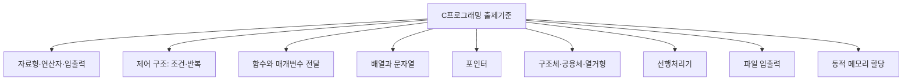

<Callout type="info">
  **이번 문서의 목표:** 이 파일을 다 읽으면 독학사 학위제도 안에서 2단계 C프로그래밍이 어떤 시험인지 한 문장으로 설명할 수 있고, 출제기준 문서를 받았을 때 어느 부분을 먼저 봐야 하는지, 뒤에 나올 26개 편이 어떤 순서로 이 시험을 대비하는지 스스로 지도를 그릴 수 있다.
</Callout>

## 왜 시험 구조부터 알아야 하는가

C 언어를 처음 배우는 사람이 흔히 저지르는 실수는 "일단 문법책을 처음부터 끝까지 읽고 보자"는 접근입니다. 그런데 독학사(獨學士)는 대학 강의를 듣지 않고도 학위를 딸 수 있게 국가가 운영하는 시험 제도이기 때문에, 채점 기준이 정해진 출제기준 문서에 명확히 묶여 있습니다. 문법을 아무리 넓게 알아도 출제기준에 없는 영역에 시간을 쏟으면 비효율적이고, 반대로 출제기준에 있는 영역을 얕게 알면 합격선을 넘기 어렵습니다. 그래서 코드를 한 줄이라도 쓰기 전에 이 시험이 무엇을 묻는 시험인지부터 정확히 파악하는 것이 가장 효율적인 첫걸음입니다.

> **쉽게 말하면:** 이 편은 지도 없이 낯선 도시를 걷는 대신, 먼저 지도를 펴서 "여기가 어디이고 어디로 가야 하는지"를 확인하는 단계입니다.

## 1. 독학사 학위제도란 무엇인가

**독학사**(獨學學位制, 정식 명칭은 독학에 의한 학위취득제도)는 국가평생교육진흥원(National Institute for Lifelong Education, 줄여서 국평원 또는 NILE)이 주관하는 시험으로, 정규 대학에 다니지 않아도 정해진 시험 단계를 순서대로 통과하면 학사 학위를 받을 수 있는 제도입니다. 국가평생교육진흥원이라는 이름 자체가 "국가가 평생 동안의 교육을 진흥한다"는 뜻이며, 이 기관이 시험 문제 출제부터 채점, 학위 수여까지 관리합니다.

독학사는 총 4단계로 구성됩니다.

| 단계 | 이름 | 내용 |
|------|------|------|
| 1단계 | 교양과정 인정시험 | 전공과 무관하게 공통으로 요구되는 교양 과목(국어, 영어, 일반수학 등) |
| 2단계 | 전공기초과정 인정시험 | 해당 전공의 기초가 되는 과목(컴퓨터과학 전공이면 C프로그래밍, 컴퓨터구조 등) |
| 3단계 | 전공심화과정 인정시험 | 전공기초 위에 쌓는 심화 과목(자료구조, 운영체제, 프로그래밍언어론 등) |
| 4단계 | 학위취득 종합시험 | 학위 수여 직전 마지막 종합 시험 |

이 표에서 알 수 있듯이 **C프로그래밍은 2단계, 즉 전공기초과정에 속합니다.** 전공기초라는 위치가 중요한 이유는 난이도와 출제 성격을 결정하기 때문입니다. 전공기초 단계는 "이 전공을 계속 공부하기 위한 최소한의 도구를 갖췄는가"를 묻는 단계이므로, 지나치게 지엽적인 문법 조항보다는 **핵심 개념을 정확히 이해했는지, 그리고 코드를 읽고 결과를 예측할 수 있는지**를 확인하는 문제가 중심이 됩니다.

> **쉽게 말하면:** 독학사는 4층짜리 건물입니다. C프로그래밍은 2층(전공기초)에 있는 과목이며, 2층을 통과해야 3층(전공심화: 자료구조·운영체제 등)으로 올라갈 자격이 생깁니다.

**자주 틀리는 점**: "2단계니까 쉬운 시험이다"라고 단정하면 안 됩니다. 2단계는 1단계보다 전공 색채가 강해지는 단계일 뿐, 절대적인 난이도가 낮다는 뜻은 아닙니다. 특히 C프로그래밍은 포인터·동적 메모리처럼 개념적으로 까다로운 주제를 포함하고 있어, 단계 숫자만 보고 준비 강도를 낮추면 안 됩니다.

## 2. 시험 방식과 문항 형태

독학사 각 단계 시험은 공고마다 세부 사항이 달라질 수 있으므로, 정확한 회차별 문항 수·시험 시간·합격 기준은 항상 **국가평생교육진흥원 공고 확인이 필요**합니다. 다만 여러 회차에 걸쳐 공통적으로 유지되어 온 큰 틀은 다음과 같습니다.

- 문제 형식은 **4지선다형 객관식**이 중심입니다. 이 사이트의 `Quiz` 구성 요소가 보기 4개, 정답 1개 형태를 취하는 이유도 이 실제 시험 형식에 맞춘 것입니다.
- 한 과목의 문제 안에는 **단순 암기형**(정의를 아는지 묻는 문제), **이해·비교형**("옳지 않은 것을 고르시오"처럼 여러 개념을 구분하는 문제), **적용형**(코드를 보고 결과를 예측하거나 오류를 찾는 문제)이 섞여 나옵니다. C프로그래밍은 특히 적용형 비중이 높은 과목입니다.
- 시험은 **지필**(紙筆, 종이와 펜을 쓰는 방식) 시험입니다. 즉 컴퓨터 앞에서 코드를 직접 실행해 보며 푸는 것이 아니라, 종이에 인쇄된 코드를 눈으로 읽고 실행 결과를 머릿속으로 추적해서 답해야 합니다. 이 점이 이 과목의 학습 방향을 결정짓는 가장 중요한 사실입니다. 05편에서 배울 메모리 모델이나 09편 이후의 "한 줄씩 실행 추적" 습관은 전부 이 지필 시험 환경을 겨냥한 훈련입니다.

> **쉽게 말하면:** 이 시험은 "컴파일러가 있으면 풀 수 있는 문제"가 아니라 "컴파일러 없이도 사람이 손으로 코드를 따라가며 풀 수 있는 문제"를 목표로 훈련해야 하는 시험입니다.

## 3. 출제기준 문서 읽는 법

**출제기준**(出題基準)이란 국가평생교육진흥원이 각 과목마다 "어떤 영역에서, 어떤 수준으로 문제를 낼 것인지" 미리 공개해 둔 공식 문서입니다. 이 문서는 보통 큰 영역(대단원) 아래 세부 항목(중단원, 소단원)을 나열하는 형태로 되어 있습니다. 예를 들어 C프로그래밍 출제기준은 다음과 같은 큰 틀로 구성되어 있다고 볼 수 있습니다(정확한 최신 항목·배점은 공고 확인 필요).

출제기준 문서를 읽을 때는 다음 순서로 접근하는 것이 효율적입니다.

<Steps>

### 대단원 목록을 먼저 훑는다

세부 설명을 읽기 전에 대단원 이름만 쭉 나열해 보고, "내가 지금 무엇을 모르는지" 스스로 점검합니다. 이 문서(뒤에 이어지는 06~22편)는 위 그림의 9개 대단원을 순서대로 다룹니다.

### 각 대단원의 세부 항목을 확인한다

같은 대단원 안에서도 "개념을 아는 정도로 충분한 항목"과 "직접 코드를 써 보고 결과를 예측할 수 있어야 하는 항목"이 섞여 있습니다. 예를 들어 포인터 영역은 정의를 아는 것만으로는 부족하고, 배열과의 관계·함수 인자로 넘기는 방식까지 손코딩 수준으로 다룰 수 있어야 합니다.

### 이전 회차 기출 경향과 대조한다

출제기준은 "낼 수 있는 범위"를 정해 둔 것이고, 실제로 어떤 항목이 자주 나오는지는 기출 경향을 함께 봐야 감이 잡힙니다. 23~27편에서 이 감각을 기출·모의 문제로 직접 훈련합니다.

</Steps>

**자주 틀리는 점**: 출제기준에 나열된 항목 이름만 외우고 "이건 배웠다"고 착각하는 경우가 많습니다. 예를 들어 출제기준에 "포인터"라는 한 단어만 적혀 있어도, 실제 시험에서는 포인터 선언, 배열과의 관계, 함수 인자 전달, 이중 포인터, 동적 메모리와의 연결까지 폭넓게 묻습니다. 항목 이름의 폭이 좁아 보인다고 깊이까지 얕을 것이라 판단하면 안 됩니다.

## 4. 평가 수준 — 전공기초과정이 요구하는 이해의 깊이

국가평생교육진흥원은 단계별로 요구하는 평가 수준을 다르게 정의합니다. 전공기초과정(2단계)은 "전공심화(3단계)로 나아가기 위한 기본기를 실제로 다룰 줄 아는가"를 확인하는 단계로, 다음 세 가지 능력을 함께 요구한다고 볼 수 있습니다.

| 요구 능력 | 구체적으로 묻는 것 | C프로그래밍에서의 예 |
|-----------|---------------------|----------------------|
| 개념 이해 | 용어의 정의와 개념 간 차이를 정확히 아는가 | 배열과 포인터의 차이, 값 전달과 주소 전달의 차이 |
| 코드 해석 | 주어진 코드를 읽고 실행 결과를 예측할 수 있는가 | 반복문 중첩 실행 후 최종 출력값 |
| 오류 판별 | 잘못된 코드나 잘못된 개념 설명을 골라낼 수 있는가 | 배열 경계를 벗어난 접근, 잘못된 free 사용 |

이 세 능력은 뒤에 나올 편들의 구성과 그대로 대응됩니다. 06~09편은 "개념 이해"의 기초를 다지고, 10~20편은 "코드 해석" 능력을 함수·배열·포인터·구조체·파일·동적 메모리로 확장하며, 21편은 "오류 판별" 능력만 따로 떼어 집중 훈련합니다.

> **쉽게 말하면:** 이 시험은 "정의를 아는가"에서 멈추지 않고 "그 정의를 실제 코드에 적용해서 무슨 일이 벌어지는지 맞힐 수 있는가"까지 확인합니다. 그래서 이 문서 시리즈도 정의를 말하고 끝내지 않고 반드시 코드와 실행 결과를 붙여서 설명합니다.

## 5. 이 시리즈 27개 편의 전체 지도

앞으로 이어질 편들은 크게 세 구간으로 나뉩니다.

| 구간 | 편 번호 | 목적 |
|------|---------|------|
| 선행 | 01–05 | 시험 구조, C 문법 표기법, 자료형·연산자·키워드 영문 용어, 표준 입출력 용어, 메모리 모델 큰 그림을 먼저 정리 |
| 본론 | 06–22 | 실제 출제기준 9개 대단원을 문법 → 제어 → 함수 → 배열·포인터 → 구조체·전처리·파일·동적 메모리 → 라이브러리·오류 분석 → 영문 용어 순서로 심화 |
| 기출·모의 | 23–27 | 대단원별 기출·유형 문제 묶음(23–25편)과 전 범위 모의고사(26–27편)로 실전 감각 훈련 |

이 지도에서 지금 읽고 있는 01편이 하는 역할은 "본론에 들어가기 전에 왜 이 순서로 배우는지 납득시키는 것"입니다. 02~04편은 이어서 C 문법을 읽기 위한 표기법과 용어를 정리하고, 05편에서 메모리 모델의 큰 그림을 그린 뒤 06편부터 본격적인 문법·개념 학습이 시작됩니다.

## 핵심 정리

- 독학사는 1~4단계로 구성된 학위 취득 제도이며, C프로그래밍은 2단계(전공기초과정)에 속한다.
- 시험은 지필 4지선다형 객관식이 중심이며, 특히 C프로그래밍은 코드를 눈으로 읽고 결과를 예측하는 적용형 문제 비중이 높다.
- 출제기준 문서는 대단원 목록을 먼저 훑고, 세부 항목의 실제 요구 깊이를 기출 경향과 함께 확인하며 읽어야 한다.
- 전공기초과정의 평가 수준은 개념 이해, 코드 해석, 오류 판별 세 가지를 함께 요구하며, 이 시리즈의 구성도 이 세 능력에 맞춰 짜여 있다.
- 회차별 문항 수·시험 시간·합격 기준은 공고마다 달라질 수 있으므로 항상 최신 공고 확인이 필요하다.

## 마무리 복습

<Quiz
  questionNumber={1}
  question="독학사 학위제도의 단계 구성과 C프로그래밍의 위치에 대한 설명으로 가장 적절한 것은?"
  options={['C프로그래밍은 4단계 학위취득 종합시험에 속한다.', 'C프로그래밍은 2단계 전공기초과정에 속한다.', '독학사는 전공 구분 없이 모든 과목이 동일한 단계에서 출제된다.', '1단계를 거치지 않아도 2단계 응시 자격에는 아무 영향이 없다.']}
  correctAnswer={2}
  explanation="독학사는 1단계 교양과정, 2단계 전공기초과정, 3단계 전공심화과정, 4단계 학위취득 종합시험으로 구성되며, C프로그래밍은 2단계 전공기초과정 과목이다."
  optionExplanations={['4단계는 학위 수여 직전의 종합시험이며 개별 전공 기초 과목이 아니다.', '정답. C프로그래밍은 전공기초과정인 2단계에 속한다.', '독학사는 단계별로 교양·전공기초·전공심화·종합시험 성격이 다르게 구분되어 있다.', '독학사는 단계를 순서대로 통과해야 하는 구조이므로 이전 단계 이수 여부가 응시 자격과 무관하다고 보기 어렵다.']}
/>

<Quiz
  questionNumber={2}
  question="독학사 C프로그래밍 시험 방식에 대한 설명으로 옳지 않은 것은?"
  options={['시험은 지필 방식으로 진행되며 컴퓨터로 코드를 직접 실행하며 풀지 않는다.', '문제 형식은 4지선다형 객관식이 중심이다.', '코드를 읽고 실행 결과를 예측하는 적용형 문제 비중이 높은 편이다.', '회차별 문항 수와 시험 시간은 모든 회차에서 항상 동일하게 고정되어 있다.']}
  correctAnswer={4}
  explanation="회차별 문항 수, 시험 시간, 합격 기준 등은 공고마다 달라질 수 있으므로 항상 최신 공고를 확인해야 하며, 모든 회차에서 항상 동일하게 고정되어 있다고 단정할 수 없다."
  optionExplanations={['옳은 설명이다. 독학사는 지필 시험이며 컴파일러 실행 없이 코드를 눈으로 읽고 풀어야 한다.', '옳은 설명이다. 독학사 시험은 4지선다형 객관식이 중심이다.', '옳은 설명이다. C프로그래밍은 코드 해석·결과 예측형 문제 비중이 높다.', '옳지 않은 설명이므로 정답이다. 세부 사항은 공고마다 달라질 수 있어 확인이 필요하다.']}
/>

<Quiz
  questionNumber={3}
  question="출제기준 문서를 읽는 방법으로 가장 적절한 것은?"
  options={['대단원 이름만 외우면 세부 항목의 출제 깊이까지 자동으로 파악된다.', '대단원 목록을 먼저 훑은 뒤 세부 항목의 실제 요구 깊이를 기출 경향과 함께 확인한다.', '출제기준은 참고용일 뿐이므로 시험 준비에서 우선순위를 둘 필요가 없다.', '세부 항목이 한 단어로만 적혀 있으면 그 항목은 얕게 출제된다고 단정할 수 있다.']}
  correctAnswer={2}
  explanation="출제기준은 대단원을 먼저 훑어 전체 구조를 파악한 뒤, 세부 항목이 실제로 얼마나 깊게 출제되는지는 기출 경향과 함께 확인하는 것이 효율적이다."
  optionExplanations={['대단원 이름만으로는 세부 항목의 실제 출제 깊이를 알기 어렵다.', '정답. 전체 구조 파악 후 기출 경향과 대조하는 방식이 효율적이다.', '출제기준은 실제 출제 범위를 정한 공식 문서이므로 시험 준비의 핵심 기준이다.', '항목 이름이 짧다고 해서 실제 출제 깊이가 얕다고 단정할 수 없다. 예를 들어 포인터라는 한 단어가 폭넓고 깊게 출제될 수 있다.']}
/>

<Quiz
  questionNumber={4}
  question="독학사 2단계(전공기초과정)의 평가 수준이 요구하는 능력으로 가장 거리가 먼 것은?"
  options={['용어의 정의와 개념 간 차이를 정확히 아는 것', '주어진 코드를 읽고 실행 결과를 예측하는 것', '잘못된 코드나 개념 설명을 판별해 내는 것', '실제 기업의 대규모 시스템을 설계하고 배포하는 것']}
  correctAnswer={4}
  explanation="전공기초과정은 개념 이해, 코드 해석, 오류 판별 능력을 요구하는 단계이며, 대규모 시스템 설계·배포는 전공기초 단계에서 요구하는 능력의 범위를 벗어난다."
  optionExplanations={['전공기초과정이 요구하는 개념 이해 능력에 해당한다.', '전공기초과정이 요구하는 코드 해석 능력에 해당한다.', '전공기초과정이 요구하는 오류 판별 능력에 해당한다.', '정답. 이는 전공심화 이후 실무 영역에 가까운 능력으로, 전공기초과정의 평가 범위를 벗어난다.']}
/>

<Quiz
  questionNumber={5}
  question="이 시리즈의 26편 이후(23~27편)와 06~22편의 관계를 가장 바르게 설명한 것은?"
  options={['23~27편은 06~22편과 전혀 무관한 새로운 범위를 다룬다.', '23~27편은 06~22편에서 다룬 대단원을 바탕으로 기출·모의 형태로 실전 감각을 훈련한다.', '06~22편을 읽지 않아도 23~27편만으로 전체 출제기준을 대체할 수 있다.', '23~27편은 선행 편(01~05)의 내용만 반복해서 다룬다.']}
  correctAnswer={2}
  explanation="23~25편은 본론(06~22편)에서 다룬 대단원별 기출·유형 문제 묶음이고, 26~27편은 전 범위 모의고사로, 모두 본론에서 학습한 내용을 실전 감각으로 훈련하는 구간이다."
  optionExplanations={['23~27편은 본론에서 다룬 대단원을 근거로 구성된 기출·모의 문제 묶음이다.', '정답. 기출·모의 구간은 본론에서 다룬 내용을 실전 형태로 훈련하는 역할을 한다.', '기출·모의 문제만으로는 개념 설명이 충분하지 않으므로 본론 학습이 선행되어야 한다.', '23~27편은 선행 편이 아니라 본론에서 다룬 대단원별 기출·모의 문제로 구성된다.']}
/>

<Quiz
  questionNumber={6}
  question="출제기준 문서에 대한 설명으로 옳지 않은 것은?"
  options={['출제기준은 국가평생교육진흥원이 과목마다 어떤 영역에서 어떤 수준으로 문제를 낼지 미리 공개한 공식 문서다.', '출제기준은 보통 대단원 아래 세부 항목을 나열하는 형태로 되어 있다.', '출제기준에 적힌 항목 이름의 폭이 좁으면 실제 출제 깊이도 항상 얕다.', '정확한 최신 항목과 배점은 공고 확인이 필요하다.']}
  correctAnswer={3}
  explanation="항목 이름이 한 단어처럼 짧게 적혀 있어도 실제로는 폭넓고 깊게 출제될 수 있으므로, 항목 이름의 폭만 보고 출제 깊이를 얕다고 단정할 수 없다."
  optionExplanations={['옳은 설명이다. 출제기준은 국가평생교육진흥원이 공개하는 공식 문서다.', '옳은 설명이다. 출제기준은 대단원 아래 세부 항목을 나열하는 형태다.', '정답. 포인터처럼 한 단어로 적힌 항목도 폭넓고 깊게 출제될 수 있어 이름의 폭과 출제 깊이는 별개다.', '옳은 설명이다. 회차 공고마다 세부 사항이 달라질 수 있어 최신 공고 확인이 필요하다.']}
/>

<Quiz
  questionNumber={7}
  question="이 시리즈 27개 편의 구간 구분에 대한 설명으로 가장 적절한 것은?"
  options={['선행 구간(01–05편)은 시험 구조·문법 표기·용어·메모리 모델 개관을 다룬다.', '본론 구간(06–22편)은 출제기준 9개 대단원과 무관한 내용을 다룬다.', '기출·모의 구간(23–27편)은 선행 구간(01–05편) 내용만 반복한다.', '이 시리즈는 구간 구분 없이 무작위 순서로 편성되어 있다.']}
  correctAnswer={1}
  explanation="선행 구간(01–05편)은 시험 구조, C 문법 표기법, 자료형·연산자·키워드 영문 용어, 표준 입출력 용어, 메모리 모델 큰 그림을 정리하는 구간이다."
  optionExplanations={['정답. 선행 구간은 본론에 들어가기 전 시험 구조와 표기법·용어·메모리 모델 개관을 정리한다.', '본론 구간(06–22편)은 출제기준 9개 대단원을 순서대로 다루는 구간이다.', '기출·모의 구간(23–27편)은 본론에서 다룬 대단원별 기출·유형 문제와 전 범위 모의고사로 구성된다.', '이 시리즈는 선행·본론·기출·모의 세 구간으로 목적에 맞게 순서대로 편성되어 있다.']}
/>

## 참고 자료

- [국가평생교육진흥원 독학학위제](https://bdes.nile.or.kr)
