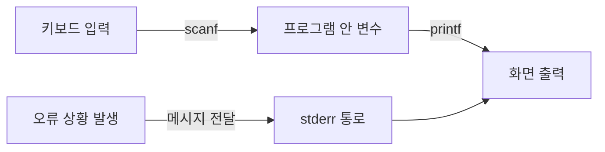

<Callout type="info">
  **이번 문서의 목표:** 이 파일을 다 읽으면 "표준 입출력"이라는 말이 정확히 무엇을 가리키는지, `scanf`와 `printf`의 이름이 왜 그렇게 붙었는지, 포맷 문자열의 `%d` 같은 표기가 무슨 뜻인지 설명할 수 있고, 입출력 코드에서 자주 나오는 실수 유형을 미리 짚어 둘 수 있다.
</Callout>

## 왜 입출력 용어를 먼저 정리하는가

C 코드 예제는 거의 대부분 화면에 무언가를 출력하거나 키보드로 값을 입력받는 코드로 시작합니다. 06편부터 본격적으로 등장할 코드들도 결과를 확인하기 위해 `printf`를 계속 사용하므로, 이 함수들의 이름 뜻과 기본 규칙을 미리 알아 두지 않으면 정작 배우려는 핵심 개념(자료형, 제어문, 함수)에 집중하기 전에 `printf`와 `scanf`의 기본 사용법에서부터 막히게 됩니다.

> **쉽게 말하면:** 이 편은 앞으로 나올 모든 예제 코드에서 반복해서 쓰일 "입력받기·출력하기" 도구의 사용 설명서를 미리 읽어 두는 단계입니다.

## 1. 표준 입출력이란 무엇인가

**표준 입출력**(standard I/O, Input/Output의 줄임말)은 프로그램이 외부와 데이터를 주고받는 가장 기본적인 통로를 가리킵니다. C에서는 이 통로를 세 가지로 구분합니다.

| 이름 | 영문 풀이 | 뜻 | 기본 연결 대상 |
|------|-----------|-----|----------------|
| `stdin` | standard input(표준 입력) | 프로그램이 값을 입력받는 통로 | 키보드 |
| `stdout` | standard output(표준 출력) | 프로그램이 값을 내보내는 통로 | 화면(콘솔) |
| `stderr` | standard error(표준 오류) | 오류 메시지를 내보내는 별도 통로 | 화면(콘솔) |

`stdin`, `stdout`, `stderr`은 모두 이름 끝에 "스트림"이라는 개념이 숨어 있습니다. **스트림**(stream, 흐름)이란 데이터가 순서대로 흘러가는 통로를 추상화한 개념으로, 키보드 입력이든 파일 읽기든 C에서는 모두 이 스트림이라는 동일한 방식으로 다룹니다. 이 개념은 16편에서 파일 입출력을 배울 때 `FILE` 포인터와 함께 다시 이어집니다. 지금은 "표준 입출력도 결국 스트림의 한 종류"라는 것만 기억해 두면 됩니다.

**자주 틀리는 점**: `stdout`과 `stderr`을 같은 것으로 착각하기 쉽지만, 이 둘은 기본적으로 같은 화면에 출력되어 겉으로 구분이 안 될 뿐 서로 다른 통로입니다. 정상적인 출력은 `stdout`으로, 오류 메시지는 `stderr`로 분리해서 보내는 것이 관례이며, 이렇게 나누어 두면 나중에 출력 결과와 오류 메시지를 서로 다른 곳으로 따로 저장하는 것도 가능해집니다(구체적인 방법은 이 과목의 범위를 넘어서므로 다루지 않습니다).

## 2. printf — 서식화된 출력

`printf`라는 이름은 print(출력하다)와 formatted(서식화된)의 f를 합친 것으로, "형식을 지정해서 출력한다"는 뜻입니다. 즉 단순히 값을 화면에 찍는 것이 아니라, 값을 어떤 모양(정수인지, 실수인지, 몇 자리로 맞출지 등)으로 보여 줄지 지정할 수 있는 함수입니다.

```c
#include <stdio.h>

int main(void) {
    int age = 20;
    double height = 172.5;
    printf("나이: %d, 키: %.1lf\n", age, height);
    return 0;
}
```

```text
나이: 20, 키: 172.5
```

이 코드의 `"나이: %d, 키: %.1lf\n"`처럼 큰따옴표로 감싼 문자열을 **포맷 문자열**(format string, 서식 문자열)이라고 부릅니다. 포맷 문자열 안의 `%d`, `%lf` 같은 표기를 **변환 지정자**(conversion specifier, 흔히 서식 지정자라고도 함)라고 하며, 이는 뒤따르는 인자를 어떤 자료형으로 해석해서 어떤 모양으로 출력할지 정하는 표시입니다.

| 변환 지정자 | 대응 자료형 | 뜻 |
|-------------|-------------|-----|
| `%d` | `int` | 10진 정수로 출력 |
| `%f` | `float` (printf에서는 `double`로 처리됨) | 실수를 소수점 표기로 출력 |
| `%lf` | `double` | `%f`와 같은 모양이지만 `double` 값을 위해 관례적으로 사용 |
| `%c` | `char` | 문자 하나로 출력 |
| `%s` | 문자열(char 배열) | 문자열로 출력 |
| `\n` | newline(개행문자) | 줄바꿈 |

**자주 틀리는 점**: 포맷 문자열의 변환 지정자와 실제 인자의 자료형이 맞지 않으면(예: 정수를 `%s`로 출력하려 하는 경우), 컴파일은 되더라도 실행 시 예측할 수 없는 값이 출력되거나 프로그램이 비정상 종료될 수 있습니다. 이런 "포맷과 자료형 불일치" 문제는 21편의 오류 분석 편에서 다시 집중적으로 다룹니다.

## 3. scanf — 서식화된 입력

`scanf`는 scan(훑어 읽다)과 formatted의 f를 합친 이름으로, "정해진 형식대로 입력을 읽어 들인다"는 뜻입니다. `printf`가 값을 내보낸다면 `scanf`는 값을 받아들이는 짝입니다.

```c
#include <stdio.h>

int main(void) {
    int score;
    printf("점수를 입력하세요: ");
    scanf("%d", &score);
    printf("입력한 점수: %d\n", score);
    return 0;
}
```

```text
점수를 입력하세요: 90
입력한 점수: 90
```

이 코드에서 눈여겨봐야 할 부분은 `scanf("%d", &score)`에서 `score` 앞에 붙은 `&` 기호입니다. `&`는 **주소 연산자**(address-of operator)로, 변수가 메모리에 저장된 위치(주소)를 가져오는 연산자입니다. `scanf`는 입력받은 값을 변수에 직접 저장하기 위해 그 변수의 "주소"를 알아야 하므로, 일반 변수를 넘길 때는 반드시 `&`를 붙여야 합니다. `&`와 주소, 그리고 이 개념이 포인터로 이어지는 과정은 05편의 메모리 모델 개관과 12편의 포인터 기초에서 훨씬 깊게 다룹니다. 지금은 "`scanf`에 일반 변수를 넘길 때는 앞에 `&`를 붙인다"는 사용 규칙만 확실히 기억해 두면 됩니다.

> **쉽게 말하면:** `printf`는 "상자 안의 내용물을 보여 달라"는 요청이라 상자 이름(변수)만 알려 주면 되지만, `scanf`는 "상자 안에 내용물을 넣어 달라"는 요청이라 상자가 정확히 어디에 있는지(주소)까지 알려 줘야 합니다.

**자주 틀리는 점**: `scanf`에서 `&`를 빠뜨리는 실수는 가장 흔한 입문자 오류 중 하나입니다. `&`가 없으면 `scanf`는 변수의 값(예: 쓰레기 값)을 주소로 착각해 엉뚱한 메모리 위치에 값을 쓰려고 시도하게 되어, 컴파일 경고는 뜰 수 있어도 실행 시 예기치 않은 동작(비정상 종료 포함)으로 이어질 수 있습니다. 다만 뒤에서 배울 문자열(`char` 배열)을 `scanf`로 읽을 때는 배열 이름 자체가 이미 주소로 취급되므로 `&`를 붙이지 않는데, 이 예외는 11편에서 배열과 포인터의 관계를 배운 뒤에 자연스럽게 이해됩니다.

## 4. 표준 입출력 함수 흐름 한눈에 보기



이 그림에서 강조하고 싶은 것은 `scanf`와 `printf`가 방향이 반대인 짝 함수라는 점입니다. `scanf`는 키보드(또는 `stdin`)에서 값을 읽어 프로그램 안의 변수에 저장하는 함수이고, `printf`는 반대로 프로그램 안의 값을 화면(`stdout`)으로 내보내는 함수입니다. 오류 메시지는 별도로 `stderr` 통로를 거치지만 기본 설정에서는 결국 같은 화면에 나타납니다.

## 5. 입출력에서 자주 발생하는 오류 패턴 개관

앞으로 이 시리즈에서 반복해서 만나게 될 입출력 관련 오류 패턴을 미리 목록으로 정리해 둡니다. 각 항목의 구체적인 코드 예시와 해결 방법은 표시된 편에서 다룹니다.

| 오류 패턴 | 간단한 설명 | 자세히 다루는 편 |
|-----------|--------------|-------------------|
| 변환 지정자와 자료형 불일치 | `%d`로 실수를 출력하는 등 포맷과 실제 자료형이 맞지 않음 | 21편 |
| `scanf`에서 `&` 누락 | 일반 변수를 넘길 때 주소 연산자를 빠뜨림 | 21편 |
| 입력 버퍼에 남은 개행 문자 처리 | `scanf`로 숫자를 읽은 뒤 문자를 읽으면 이전 입력의 개행 문자가 남아 있어 예상과 다르게 읽힘 | 19, 21편 |
| 문자열 입력 시 버퍼 크기 초과 | 배열 크기보다 긴 문자열을 입력받아 메모리를 침범함 | 11, 19, 21편 |

> **쉽게 말하면:** 입출력 코드는 문법이 단순해 보이지만, "무엇을 어떤 모양으로 주고받을지"를 정확히 맞추지 않으면 조용히 틀린 값이 나오는 경우가 많습니다. 그래서 이 시리즈에서는 출력 결과를 항상 코드 바로 아래에 함께 보여 주어, 예상과 실제가 다른 지점을 바로 확인할 수 있게 합니다.

## 핵심 정리

- 표준 입출력은 `stdin`(표준 입력), `stdout`(표준 출력), `stderr`(표준 오류) 세 가지 통로로 구분되며, 셋 다 스트림이라는 공통 개념으로 다뤄진다.
- `printf`는 서식을 지정해 값을 출력하는 함수이며, 포맷 문자열 안의 변환 지정자(`%d`, `%lf`, `%c`, `%s` 등)가 출력 모양을 결정한다.
- `scanf`는 서식을 지정해 값을 입력받는 함수이며, 일반 변수를 넘길 때는 주소 연산자 `&`를 반드시 붙여야 한다(단 배열·문자열은 예외).
- 변환 지정자와 자료형 불일치, `&` 누락, 입력 버퍼에 남은 개행 문자, 버퍼 크기 초과는 시험에서 반복해서 나오는 입출력 오류 패턴이다.

## 마무리 복습

<Quiz
  questionNumber={1}
  question="표준 입출력의 세 가지 통로에 대한 설명으로 옳지 않은 것은?"
  options={['stdin은 표준 입력을 뜻하며 기본적으로 키보드와 연결된다.', 'stdout은 표준 출력을 뜻하며 기본적으로 화면과 연결된다.', 'stderr는 표준 오류를 뜻하며 stdout과 항상 완전히 동일한 통로다.', 'stdin, stdout, stderr는 모두 스트림이라는 공통 개념으로 다뤄진다.']}
  correctAnswer={3}
  explanation="stdout과 stderr는 기본적으로 같은 화면에 나타나 겉으로 구분이 안 될 뿐, 정상 출력과 오류 메시지를 위한 서로 다른 통로다."
  optionExplanations={['옳은 설명이다. stdin은 표준 입력이며 기본적으로 키보드에 연결된다.', '옳은 설명이다. stdout은 표준 출력이며 기본적으로 화면에 연결된다.', '옳지 않은 설명이므로 정답이다. stderr는 stdout과 별도의 통로다.', '옳은 설명이다. 셋 다 스트림이라는 공통 개념으로 다뤄진다.']}
/>

<Quiz
  questionNumber={2}
  question="printf의 포맷 문자열과 변환 지정자에 대한 설명으로 가장 적절한 것은?"
  options={['%d는 실수를 출력할 때 사용하는 변환 지정자다.', '%s는 문자열을 출력할 때 사용하는 변환 지정자다.', '변환 지정자와 실제 인자의 자료형이 달라도 항상 올바른 값이 출력된다.', 'printf는 형식을 지정할 수 없고 값을 있는 그대로만 출력한다.']}
  correctAnswer={2}
  explanation="%s는 문자열을 출력할 때 사용하는 변환 지정자이며, printf는 이름 그대로 서식을 지정해서 출력하는 함수다."
  optionExplanations={['%d는 정수를 출력할 때 사용하는 변환 지정자다.', '정답. %s는 문자열 출력에 사용하는 변환 지정자다.', '변환 지정자와 자료형이 일치하지 않으면 예측할 수 없는 값이 출력되거나 프로그램이 비정상 종료될 수 있다.', 'printf는 formatted(서식화된)라는 이름 그대로 출력 형식을 지정할 수 있는 함수다.']}
/>

<Quiz
  questionNumber={3}
  question="scanf로 일반 변수에 값을 입력받을 때 변수 이름 앞에 & 기호를 붙이는 이유로 가장 적절한 것은?"
  options={['& 기호는 단순한 장식이며 없어도 프로그램 동작에 차이가 없다.', '& 기호는 변수의 자료형을 문자열로 바꾸는 연산자다.', '& 기호는 주소 연산자로, scanf가 값을 저장할 변수의 메모리 위치를 알려 준다.', '& 기호는 변수의 값을 두 배로 만드는 연산자다.']}
  correctAnswer={3}
  explanation="&는 주소 연산자로, scanf가 입력받은 값을 해당 변수의 메모리 위치에 직접 저장할 수 있도록 변수의 주소를 전달하는 역할을 한다."
  optionExplanations={['& 기호가 없으면 scanf가 엉뚱한 메모리 위치에 값을 쓰려고 시도해 예기치 않은 동작이 발생할 수 있다.', '& 기호는 자료형 변환과 관련이 없는 주소 연산자다.', '정답. & 기호는 주소 연산자로, 변수의 메모리 위치를 scanf에 전달한다.', '& 기호는 값을 두 배로 만드는 연산과 관련이 없다.']}
/>

<Quiz
  questionNumber={4}
  question="다음 중 scanf 사용에서 & 기호를 붙이지 않아도 되는 경우로 가장 적절한 것은?"
  options={['int형 변수 하나에 정수를 입력받는 경우', 'double형 변수 하나에 실수를 입력받는 경우', '문자열을 저장하는 char 배열에 문자열을 입력받는 경우', 'char형 변수 하나에 문자 하나를 입력받는 경우']}
  correctAnswer={3}
  explanation="배열 이름은 그 자체로 이미 주소로 취급되므로, 문자열을 저장하는 char 배열에 scanf로 입력받을 때는 배열 이름 앞에 & 기호를 붙이지 않는다."
  optionExplanations={['int형 일반 변수는 & 기호를 붙여 주소를 전달해야 한다.', 'double형 일반 변수도 & 기호를 붙여 주소를 전달해야 한다.', '정답. 배열 이름은 이미 주소로 취급되므로 & 기호를 붙이지 않는다.', 'char형 일반 변수도 & 기호를 붙여 주소를 전달해야 한다.']}
/>

<Quiz
  questionNumber={5}
  question="입출력에서 자주 발생하는 오류 패턴에 대한 설명으로 옳지 않은 것은?"
  options={['포맷 문자열의 변환 지정자와 실제 자료형이 다르면 예상과 다른 값이 출력될 수 있다.', 'scanf로 숫자를 읽은 후 문자를 읽으면 이전 입력의 개행 문자가 남아 있어 예상과 다르게 읽힐 수 있다.', '배열 크기보다 긴 문자열을 입력받으면 메모리를 침범하는 문제가 생길 수 있다.', '입출력 관련 오류는 문법 자체가 복잡해서 발생하는 것이며 서식과 자료형을 맞추는 것과는 관련이 없다.']}
  correctAnswer={4}
  explanation="입출력 오류는 문법의 복잡성보다는 서식(변환 지정자)과 실제 자료형, 버퍼 상태를 정확히 맞추지 못해서 발생하는 경우가 대부분이다."
  optionExplanations={['옳은 설명이다. 변환 지정자와 자료형 불일치는 흔한 오류 패턴이다.', '옳은 설명이다. 입력 버퍼에 남은 개행 문자는 흔한 오류 패턴이다.', '옳은 설명이다. 버퍼 크기를 초과한 문자열 입력은 흔한 오류 패턴이다.', '옳지 않은 설명이므로 정답이다. 입출력 오류는 대부분 서식·자료형·버퍼 상태를 맞추지 못해 발생한다.']}
/>

<Quiz
  questionNumber={6}
  question="표준 입출력에서 스트림 개념에 대한 설명으로 가장 적절한 것은?"
  options={['스트림은 데이터가 순서대로 흘러가는 통로를 추상화한 개념이다.', '스트림은 키보드 입력에만 적용되고 파일 입출력에는 적용되지 않는다.', 'stdin, stdout, stderr는 스트림 개념과 무관한 별도의 자료형이다.', '스트림은 C 표준에 없는 개념이며 특정 컴파일러에서만 지원한다.']}
  correctAnswer={1}
  explanation="스트림은 데이터가 순서대로 흘러가는 통로를 추상화한 개념으로, 키보드 입력이든 파일 읽기든 C에서는 모두 이 동일한 방식으로 다룬다."
  optionExplanations={['정답. 스트림은 데이터가 순서대로 흘러가는 통로를 추상화한 개념이다.', '스트림은 키보드 입력뿐 아니라 파일 입출력에도 동일하게 적용되는 개념이다.', 'stdin, stdout, stderr는 모두 스트림이라는 공통 개념으로 다뤄지는 통로다.', '스트림은 표준 입출력을 포함해 C에서 일반적으로 쓰이는 개념이다.']}
/>

<Quiz
  questionNumber={7}
  question="scanf로 숫자를 읽은 뒤 문자를 읽으면 예상과 다르게 읽히는 오류 패턴의 원인으로 가장 적절한 것은?"
  options={['변환 지정자와 자료형이 일치하지 않기 때문이다.', '이전 입력에서 남은 개행 문자가 입력 버퍼에 남아 있기 때문이다.', 'scanf에 주소 연산자를 두 번 사용했기 때문이다.', 'stdout과 stderr를 혼동했기 때문이다.']}
  correctAnswer={2}
  explanation="숫자를 입력받은 뒤 이어서 문자를 입력받으면, 앞서 입력한 숫자 뒤에 눌렀던 엔터 키의 개행 문자가 입력 버퍼에 그대로 남아 있다가 다음 문자 입력으로 잘못 읽히는 경우가 자주 발생한다."
  optionExplanations={['변환 지정자와 자료형 불일치는 서로 다른 오류 패턴으로, 이 상황의 직접적인 원인이 아니다.', '정답. 입력 버퍼에 남은 개행 문자가 다음 입력으로 잘못 읽히는 것이 이 오류의 원인이다.', '주소 연산자를 두 번 사용하는 것은 이 문서에서 다룬 오류 패턴이 아니다.', 'stdout과 stderr 혼동은 출력 통로에 관한 문제로, 입력 버퍼 문제와는 관련이 없다.']}
/>

## 참고 자료

- [국가평생교육진흥원 독학학위제](https://bdes.nile.or.kr)
