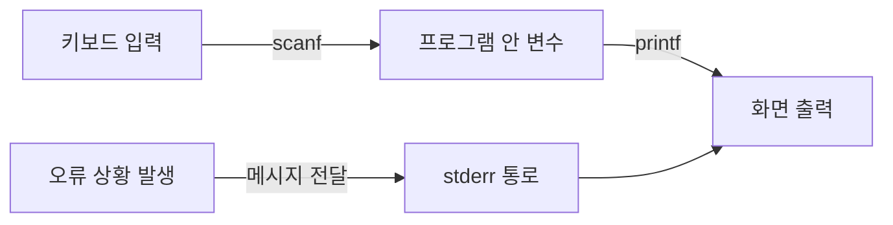

## 왜 입출력 용어를 먼저 정리하는가

C 코드 예제는 거의 대부분 화면에 무언가를 출력하거나 키보드로 값을 입력받는 코드로 시작합니다. 05편부터 본격적으로 등장할 코드들도 결과를 확인하기 위해 `printf`를 계속 사용하므로, 이 함수들의 이름 뜻과 기본 규칙을 미리 알아 두지 않으면 정작 배우려는 핵심 개념(자료형, 제어문, 함수)에 집중하기 전에 `printf`와 `scanf`의 기본 사용법에서부터 막히게 됩니다.

## 1. 표준 입출력이란 무엇인가

**표준 입출력**(standard I/O, Input/Output의 줄임말)은 프로그램이 외부와 데이터를 주고받는 가장 기본적인 통로를 가리킵니다. C에서는 이 통로를 세 가지로 구분합니다.

| 이름 | 영문 풀이 | 뜻 | 기본 연결 대상 |
|------|-----------|-----|----------------|
| `stdin` | standard input(표준 입력) | 프로그램이 값을 입력받는 통로 | 키보드 |
| `stdout` | standard output(표준 출력) | 프로그램이 값을 내보내는 통로 | 화면(콘솔) |
| `stderr` | standard error(표준 오류) | 오류 메시지를 내보내는 별도 통로 | 화면(콘솔) |

`stdin`, `stdout`, `stderr`은 모두 이름 끝에 "스트림"이라는 개념이 숨어 있습니다. **스트림**(stream, 흐름)이란 데이터가 순서대로 흘러가는 통로를 추상화한 개념으로, 키보드 입력이든 파일 읽기든 C에서는 모두 이 스트림이라는 동일한 방식으로 다룹니다.

**자주 틀리는 점**: `stdout`과 `stderr`을 같은 것으로 착각하기 쉽지만, 이 둘은 기본적으로 같은 화면에 출력되어 겉으로 구분이 안 될 뿐 서로 다른 통로입니다. 정상적인 출력은 `stdout`으로, 오류 메시지는 `stderr`로 분리해서 보내는 것이 관례이며, 이렇게 나누어 두면 나중에 출력 결과와 오류 메시지를 서로 다른 곳으로 따로 저장하는 것도 가능해집니다(구체적인 방법은 이 과목의 범위를 넘어서므로 다루지 않습니다).

## 2. printf — 서식화된 출력

`printf`라는 이름은 print(출력하다)와 formatted(서식화된)의 f를 합친 것으로, "형식을 지정해서 출력한다"는 뜻입니다. 즉 단순히 값을 화면에 찍는 것이 아니라, 값을 어떤 모양(정수인지, 실수인지, 몇 자리로 맞출지 등)으로 보여 줄지 지정할 수 있는 함수입니다.

```c
#include <stdio.h>

int main(void) {
    int age = 20;
    double height = 172.5;
    printf("나이: %d, 키: %.1lf\n", age, height);
    return 0;
}
```

```text
나이: 20, 키: 172.5
```

이 코드의 `"나이: %d, 키: %.1lf\n"`처럼 큰따옴표로 감싼 문자열을 **포맷 문자열**(format string, 서식 문자열)이라고 부릅니다. 포맷 문자열 안의 `%d`, `%lf` 같은 표기를 **변환 지정자**(conversion specifier, 흔히 서식 지정자라고도 함)라고 하며, 이는 뒤따르는 인자를 어떤 자료형으로 해석해서 어떤 모양으로 출력할지 정하는 표시입니다.

| 변환 지정자 | 대응 자료형 | 뜻 |
|-------------|-------------|-----|
| `%d` | `int` | 10진 정수로 출력 |
| `%f` | `float` (printf에서는 `double`로 처리됨) | 실수를 소수점 표기로 출력 |
| `%lf` | `double` | `%f`와 같은 모양이지만 `double` 값을 위해 관례적으로 사용 |
| `%c` | `char` | 문자 하나로 출력 |
| `%s` | 문자열(char 배열) | 문자열로 출력 |
| `\n` | newline(개행문자) | 줄바꿈 |

**자주 틀리는 점**: 포맷 문자열의 변환 지정자와 실제 인자의 자료형이 맞지 않으면(예: 정수를 `%s`로 출력하려 하는 경우), 컴파일은 되더라도 실행 시 예측할 수 없는 값이 출력되거나 프로그램이 비정상 종료될 수 있습니다. 이런 "포맷과 자료형 불일치" 문제는 20편의 오류 분석 편에서 다시 집중적으로 다룹니다.

## 3. scanf — 서식화된 입력

`scanf`는 scan(훑어 읽다)과 formatted의 f를 합친 이름으로, "정해진 형식대로 입력을 읽어 들인다"는 뜻입니다. `printf`가 값을 내보낸다면 `scanf`는 값을 받아들이는 짝입니다.

```c
#include <stdio.h>

int main(void) {
    int score;
    printf("점수를 입력하세요: ");
    scanf("%d", &score);
    printf("입력한 점수: %d\n", score);
    return 0;
}
```

```text
점수를 입력하세요: 90
입력한 점수: 90
```

이 코드에서 눈여겨봐야 할 부분은 `scanf("%d", &score)`에서 `score` 앞에 붙은 `&` 기호입니다. `&`는 **주소 연산자**(address-of operator)로, 변수가 메모리에 저장된 위치(주소)를 가져오는 연산자입니다.

**자주 틀리는 점**: `scanf`에서 `&`를 빠뜨리는 실수는 가장 흔한 입문자 오류 중 하나입니다. `&`가 없으면 `scanf`는 변수의 값(예: 쓰레기 값)을 주소로 착각해 엉뚱한 메모리 위치에 값을 쓰려고 시도하게 되어, 컴파일 경고는 뜰 수 있어도 실행 시 예기치 않은 동작(비정상 종료 포함)으로 이어질 수 있습니다.

## 4. 표준 입출력 함수 흐름 한눈에 보기


```mermaid
graph LR
  KB[키보드 입력] -->|scanf| VAR["프로그램 안 변수"]
  VAR -->|printf| SC[화면 출력]
  ERR["오류 상황 발생"] -->|메시지 전달| STDERR[stderr 통로]
  STDERR --> SC
```

이 그림에서 강조하고 싶은 것은 `scanf`와 `printf`가 방향이 반대인 짝 함수라는 점입니다. `scanf`는 키보드(또는 `stdin`)에서 값을 읽어 프로그램 안의 변수에 저장하는 함수이고, `printf`는 반대로 프로그램 안의 값을 화면(`stdout`)으로 내보내는 함수입니다.

## 5. 입출력에서 자주 발생하는 오류 패턴 개관

앞으로 이 시리즈에서 반복해서 만나게 될 입출력 관련 오류 패턴을 미리 목록으로 정리해 둡니다. 각 항목의 구체적인 코드 예시와 해결 방법은 표시된 편에서 다룹니다.

| 오류 패턴 | 간단한 설명 | 자세히 다루는 편 |
|-----------|--------------|-------------------|
| 변환 지정자와 자료형 불일치 | `%d`로 실수를 출력하는 등 포맷과 실제 자료형이 맞지 않음 | 20편 |
| `scanf`에서 `&` 누락 | 일반 변수를 넘길 때 주소 연산자를 빠뜨림 | 20편 |
| 입력 버퍼에 남은 개행 문자 처리 | `scanf`로 숫자를 읽은 뒤 문자를 읽으면 이전 입력의 개행 문자가 남아 있어 예상과 다르게 읽힘 | 18, 20편 |
| 문자열 입력 시 버퍼 크기 초과 | 배열 크기보다 긴 문자열을 입력받아 메모리를 침범함 | 10, 18, 20편 |

## 핵심 정리

- 표준 입출력은 `stdin`(표준 입력), `stdout`(표준 출력), `stderr`(표준 오류) 세 가지 통로로 구분되며, 셋 다 스트림이라는 공통 개념으로 다뤄진다.
- `printf`는 서식을 지정해 값을 출력하는 함수이며, 포맷 문자열 안의 변환 지정자(`%d`, `%lf`, `%c`, `%s` 등)가 출력 모양을 결정한다.
- `scanf`는 서식을 지정해 값을 입력받는 함수이며, 일반 변수를 넘길 때는 주소 연산자 `&`를 반드시 붙여야 한다(단 배열·문자열은 예외).
- 변환 지정자와 자료형 불일치, `&` 누락, 입력 버퍼에 남은 개행 문자, 버퍼 크기 초과는 시험에서 반복해서 나오는 입출력 오류 패턴이다.

## 마무리 복습

<Quiz
  questionNumber={1}
  question={"표준 입출력의 세 가지 통로에 대한 설명으로 옳지 않은 것은?"}
  options={["stdin은 표준 입력을 뜻하며 기본적으로 키보드와 연결된다.","stdout은 표준 출력을 뜻하며 기본적으로 화면과 연결된다.","stderr는 표준 오류를 뜻하며 stdout과 항상 완전히 동일한 통로다.","stdin, stdout, stderr는 모두 스트림이라는 공통 개념으로 다뤄진다."]}
  correctAnswer={3}
  explanation={"stdout과 stderr는 기본적으로 같은 화면에 나타나 겉으로 구분이 안 될 뿐, 정상 출력과 오류 메시지를 위한 서로 다른 통로다."}
/>

<Quiz
  questionNumber={2}
  question={"printf의 포맷 문자열과 변환 지정자에 대한 설명으로 가장 적절한 것은?"}
  options={["%d는 실수를 출력할 때 사용하는 변환 지정자다.","%s는 문자열을 출력할 때 사용하는 변환 지정자다.","변환 지정자와 실제 인자의 자료형이 달라도 항상 올바른 값이 출력된다.","printf는 형식을 지정할 수 없고 값을 있는 그대로만 출력한다."]}
  correctAnswer={2}
  explanation={"%s는 문자열을 출력할 때 사용하는 변환 지정자이며, printf는 이름 그대로 서식을 지정해서 출력하는 함수다."}
/>

<Quiz
  questionNumber={3}
  question={"scanf로 일반 변수에 값을 입력받을 때 변수 이름 앞에 & 기호를 붙이는 이유로 가장 적절한 것은?"}
  options={["& 기호는 단순한 장식이며 없어도 프로그램 동작에 차이가 없다.","& 기호는 변수의 자료형을 문자열로 바꾸는 연산자다.","& 기호는 주소 연산자로, scanf가 값을 저장할 변수의 메모리 위치를 알려 준다.","& 기호는 변수의 값을 두 배로 만드는 연산자다."]}
  correctAnswer={3}
  explanation={"&는 주소 연산자로, scanf가 입력받은 값을 해당 변수의 메모리 위치에 직접 저장할 수 있도록 변수의 주소를 전달하는 역할을 한다."}
/>

## 참고 자료

- [국가평생교육진흥원 독학학위제](https://bdes.nile.or.kr)
