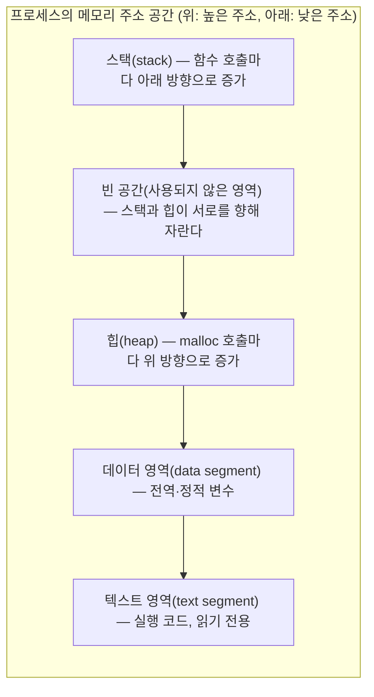
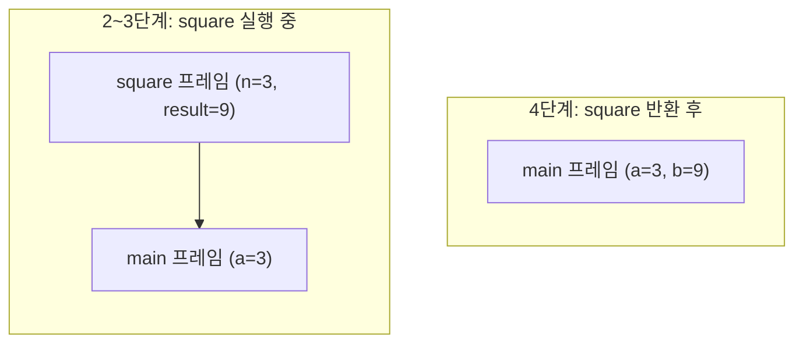

<Callout type="info">
  **이번 문서의 목표:** 이 파일을 다 읽으면 C 프로그램의 메모리가 텍스트·데이터·힙·스택 네 영역으로 나뉘는 이유와 각 영역에 어떤 변수가 저장되는지 설명하고, 함수 호출 시 스택 프레임이 쌓이고 사라지는 과정을 그림으로 그릴 수 있다.
</Callout>

## 왜 메모리 모델을 먼저 알아야 하는가

C 언어는 다른 언어보다 **메모리를 직접 다루는 정도가 훨씬 크다.** 자바(Java)나 파이썬(Python)은 변수가 실제로 메모리 어디에 저장되는지 몰라도 프로그램을 짤 수 있지만, C는 포인터(pointer)·배열(array)·동적 메모리 할당(dynamic memory allocation) 같은 핵심 문법 자체가 "메모리 주소가 어떻게 배치되는가"라는 그림 없이는 이해가 되지 않는다. 독학사 2단계 C프로그래밍 시험에서 포인터·배열·함수 호출·동적 할당 문제가 어렵게 느껴지는 가장 큰 이유도, 코드 한 줄이 메모리의 어느 위치를 건드리는지 머릿속에 그림이 그려지지 않기 때문이다.

이번 편은 12편(포인터), 17편(동적 메모리), 10편(함수)에서 각각 깊게 다룰 내용의 **지도(map)** 역할만 한다. 실제 문법과 연산은 해당 편에서 배우고, 여기서는 "메모리가 이렇게 나뉘어 있고, 변수마다 사는 동네가 다르다"는 큰 그림만 확실히 잡고 넘어간다.

> **쉽게 말하면:** 메모리 모델은 프로그램이 실행되는 동안 쓰는 메모리를 용도별로 나눈 아파트 단지 배치도다. 어떤 변수가 어느 동(棟)에 사는지 알아야 나중에 포인터로 그 집 주소를 찾아갈 수 있다.

## 프로세스가 실행될 때 메모리는 네 구역으로 나뉜다

C 프로그램을 컴파일하고 실행하면 운영체제는 그 실행 중인 프로그램(이를 **프로세스**, process라 부른다)에게 메모리 공간을 할당한다. 이 공간은 관례적으로 다음 네 영역으로 나뉜다.

| 영역 | 영문 이름 | 저장하는 내용 | 크기 결정 시점 |
|------|-----------|---------------|----------------|
| 텍스트 영역 | text segment (code segment) | 컴파일된 명령어(기계어) 코드 자체 | 컴파일 시점에 고정, 읽기 전용 |
| 데이터 영역 | data segment | 초기화된 전역·정적 변수(initialized data), 초기화되지 않은 전역·정적 변수(BSS) | 컴파일 시점에 크기 고정 |
| 힙 | heap | `malloc` 등으로 실행 중 동적으로 요청한 메모리 | 실행 중 늘었다 줄었다 함 |
| 스택 | stack | 함수 호출 시 생기는 지역 변수, 매개변수, 복귀 주소 | 함수 호출·반환마다 늘었다 줄었다 함 |

이 네 영역이 실제 주소 공간에서 어떻게 배치되는지를 그림으로 보면 다음과 같다(대부분의 시스템에서 관례적으로 이렇게 그린다).



이 그림에서 시험에 자주 나오는 포인트 두 가지를 짚는다.

1. **스택은 위(높은 주소)에서 아래(낮은 주소) 방향으로 자란다.** 함수를 호출할 때마다 스택 영역이 낮은 주소 쪽으로 늘어난다.
2. **힙은 아래(낮은 주소)에서 위(높은 주소) 방향으로 자란다.** `malloc`으로 메모리를 요청할 때마다 힙이 높은 주소 쪽으로 늘어난다.

두 영역이 서로 반대 방향으로 자라며 가운데 빈 공간을 향해 다가가는 구조이기 때문에, 스택과 힙 중 어느 하나가 지나치게 커지면 둘이 충돌한다. 지역 변수를 지나치게 많이 쓰거나 재귀 호출이 끝나지 않으면 **스택 오버플로**(stack overflow)가 발생하는데, 이는 스택이 자라다가 힙이나 다른 영역을 침범하는 상황을 말한다.

## 변수는 저장되는 위치에 따라 성격이 완전히 달라진다

같은 "변수"라도 어디에 선언했는지에 따라 저장되는 영역이 다르고, 그에 따라 **생존 기간**(lifetime)과 **접근 범위**(scope)가 달라진다. 아래 표로 정리한다.

| 변수 종류 | 저장 영역 | 생존 기간 | 예시 |
|-----------|-----------|-----------|------|
| 지역 변수(local variable) | 스택 | 함수가 호출되어 있는 동안만 | 함수 내부에 선언한 `int x` |
| 전역 변수(global variable) | 데이터 영역 | 프로그램 시작부터 종료까지 | 함수 바깥에 선언한 `int count` |
| 정적 변수(static variable) | 데이터 영역 | 프로그램 시작부터 종료까지 | 함수 내부에 `static int cnt` |
| 동적 할당 메모리 | 힙 | 프로그래머가 `free`를 호출할 때까지 | `malloc(sizeof(int) * 10)`으로 얻은 메모리 |
| 문자열 리터럴 | 텍스트 영역(읽기 전용) | 프로그램 시작부터 종료까지 | `"hello"` 같은 큰따옴표 문자열 |

```c
#include <stdio.h>

int global_count = 0;          /* 전역 변수 — 데이터 영역 */

void increase(void) {
    static int call_count = 0; /* 정적 변수 — 데이터 영역, 함수가 끝나도 값 유지 */
    int local_x = 10;          /* 지역 변수 — 스택, 함수가 끝나면 사라짐 */

    call_count++;
    global_count += local_x;
    printf("call_count=%d, global_count=%d\n", call_count, global_count);
}

int main(void) {
    increase();
    increase();
    increase();
    return 0;
}
```

```text
call_count=1, global_count=10
call_count=2, global_count=20
call_count=3, global_count=30
```

이 출력을 보면 `call_count`는 함수가 세 번 호출되는 동안 값이 계속 누적되지만(정적 변수, 데이터 영역에 딱 하나만 존재), `local_x`는 매번 함수가 호출될 때마다 스택에 새로 생겼다가 함수가 끝나면 사라진다. 만약 `static`을 빼고 `int call_count = 0`으로 지역 변수로 선언했다면, 매번 호출될 때마다 값이 0으로 초기화되어 항상 `call_count=1`만 출력됐을 것이다.

> **자주 틀리는 점:** "정적(static) 변수는 정적 영역에 있으니 값이 안 바뀐다"고 오해하기 쉽다. 정적 변수는 **저장 위치가 프로그램 실행 내내 고정**되어 있다는 뜻이지, **값이 고정**되어 있다는 뜻이 아니다. 위 예시처럼 정적 변수도 값은 계속 바뀐다. 다만 함수가 끝나도 그 값이 유지된다는 점이 지역 변수와의 차이다.

## 함수 호출과 스택 프레임

함수를 호출할 때마다 스택에는 **스택 프레임**(stack frame)이라는 하나의 덩어리가 쌓인다. 스택 프레임에는 다음 정보가 담긴다.

- **매개변수(parameter)**: 호출하는 쪽에서 넘겨준 값
- **복귀 주소(return address)**: 함수 실행이 끝나면 되돌아갈 코드 위치
- **지역 변수(local variable)**: 함수 내부에서 선언한 변수
- (경우에 따라) 이전 스택 프레임을 가리키는 정보

함수가 다른 함수를 호출하면 새 스택 프레임이 그 위에 쌓이고, 함수가 끝나 `return`하면 그 함수의 스택 프레임은 통째로 사라진다(pop). 이 원리를 다음 코드로 확인해 보자.

```c
#include <stdio.h>

int square(int n) {
    int result = n * n;   /* square의 지역 변수 */
    return result;
}

int main(void) {
    int a = 3;
    int b = square(a);    /* square 호출 — 새 스택 프레임 생성 */
    printf("b=%d\n", b);
    return 0;
}
```

```text
b=9
```

이 코드가 실행되는 동안 스택이 쌓이고 사라지는 순서를 표로 추적하면 다음과 같다.

| 단계 | 스택에 쌓인 프레임(아래부터 위로) | 설명 |
|------|-----------------------------------|------|
| 1 | `main` (a=3) | main이 실행을 시작하고 지역 변수 a를 스택에 만든다 |
| 2 | `main` (a=3), `square` (n=3) | `square(a)` 호출로 square의 프레임이 main 위에 쌓인다. 인자 a의 값 3이 복사되어 매개변수 n에 전달된다 |
| 3 | `main` (a=3), `square` (n=3, result=9) | square 내부에서 result가 계산되어 스택에 저장된다 |
| 4 | `main` (a=3, b=9) | square가 return하며 square의 프레임이 스택에서 사라지고(pop), 반환값 9가 main의 b에 저장된다 |



이 흐름에서 핵심은 **`square` 함수의 매개변수 n에는 a의 값 3이 그대로 복사되어 전달**된다는 점이다. 이를 값에 의한 전달(pass by value)이라 부르며, 10편(함수)과 13편(포인터와 함수)에서 이 전달 방식이 배열·포인터를 넘길 때 어떻게 달라지는지 깊게 다룬다. 지금은 "함수를 호출할 때마다 스택에 새 프레임이 쌓이고, 함수가 끝나면 그 프레임이 통째로 사라진다"는 그림만 기억하면 된다.

> **자주 틀리는 점:** 함수가 끝난 뒤에도 그 함수의 지역 변수 주소를 계속 쓸 수 있다고 착각하는 경우가 있다. 예를 들어 `square` 함수가 `result`의 **주소**를 반환해 버리면, `square`의 스택 프레임은 함수 종료와 동시에 사라지므로 그 주소에 있던 값은 더 이상 유효하지 않다. 이런 실수를 **댕글링 포인터**(dangling pointer)라 하며 17편에서 자세히 다룬다.

## 포인터·배열·동적 메모리, 지금은 역할만 미리 본다

이번 편의 메모리 지도 위에서 앞으로 배울 세 가지 개념이 각각 어떤 역할을 하는지 미리 짚어 둔다.

- **포인터(pointer)**: 메모리 주소 자체를 값으로 저장하는 변수다. 스택에 있는 변수의 주소든, 힙에 있는 동적 메모리의 주소든 가리킬 수 있다. 자세한 문법은 12편에서 배운다.
- **배열(array)**: 같은 자료형의 값을 연속된 메모리 공간에 나란히 저장한 것이다. 지역 변수로 선언하면 스택에, 전역으로 선언하면 데이터 영역에, `malloc`으로 만들면 힙에 자리 잡는다. 11편에서 자세히 배운다.
- **동적 메모리 할당(dynamic memory allocation)**: `malloc`, `calloc`, `realloc` 같은 함수로 실행 중에 필요한 만큼 힙 메모리를 요청하고, 다 쓰면 `free`로 반납하는 것이다. 스택과 달리 함수가 끝나도 저절로 사라지지 않으므로 프로그래머가 직접 관리해야 한다. 17편에서 자세히 배운다.

이 세 가지가 왜 시험에서 늘 함께 나오는지도 이 그림으로 설명된다. 포인터는 "주소를 담는 그릇"이고, 배열과 동적 메모리는 "주소로 찾아갈 수 있는 실제 데이터 덩어리"이기 때문에, 결국 포인터 문제 대부분은 "이 포인터가 스택의 어느 변수를 가리키는가, 아니면 힙의 어느 블록을 가리키는가"를 묻는 문제로 귀결된다.

## 핵심 정리

- 프로세스의 메모리는 텍스트(코드)·데이터(전역·정적)·힙(동적 할당)·스택(지역 변수·함수 호출 정보) 네 영역으로 나뉜다.
- 스택은 높은 주소에서 낮은 주소로, 힙은 낮은 주소에서 높은 주소로 자라며 서로를 향해 다가간다.
- 지역 변수는 스택에, 전역·정적 변수는 데이터 영역에, `malloc`으로 얻은 메모리는 힙에 저장된다. 정적 변수는 값이 고정되는 것이 아니라 저장 위치와 생존 기간이 프로그램 전체로 고정되는 것이다.
- 함수를 호출할 때마다 매개변수·복귀 주소·지역 변수를 담은 스택 프레임이 쌓이고, 함수가 끝나면 그 프레임이 통째로 사라진다.
- 함수 종료 후 사라진 스택 프레임의 지역 변수 주소를 계속 쓰면 댕글링 포인터 문제가 생긴다.

## 마무리 복습

<Quiz
  questionNumber={1}
  question="C 프로그램의 메모리 영역 중 함수 호출 시 매개변수와 지역 변수, 복귀 주소가 저장되는 영역은?"
  options={['텍스트 영역', '데이터 영역', '스택', '힙']}
  correctAnswer={3}
  explanation="함수가 호출될 때마다 매개변수, 지역 변수, 복귀 주소를 담은 스택 프레임이 쌓이는 영역은 스택이다. 함수가 끝나면 그 프레임은 사라진다."
  optionExplanations={['텍스트 영역은 컴파일된 명령어 코드 자체가 저장되는 읽기 전용 영역이다.', '데이터 영역은 전역 변수와 정적 변수가 저장되는 영역이다.', '정답이다. 스택은 함수 호출 정보와 지역 변수가 쌓였다가 함수 종료 시 사라지는 영역이다.', '힙은 malloc 등으로 실행 중 동적으로 요청한 메모리가 저장되는 영역이다.']}
/>

<Quiz
  questionNumber={2}
  question="스택과 힙이 메모리 주소 공간에서 자라는 방향에 대한 설명으로 옳은 것은?"
  options={['둘 다 낮은 주소에서 높은 주소로 자란다', '스택은 낮은 주소에서 높은 주소로, 힙은 높은 주소에서 낮은 주소로 자란다', '스택은 높은 주소에서 낮은 주소로, 힙은 낮은 주소에서 높은 주소로 자란다', '둘 다 높은 주소에서 낮은 주소로 자란다']}
  correctAnswer={3}
  explanation="관례적으로 스택은 높은 주소에서 낮은 주소 방향으로, 힙은 낮은 주소에서 높은 주소 방향으로 자라며 두 영역이 서로를 향해 다가간다."
  optionExplanations={['스택과 힙은 서로 반대 방향으로 자란다.', '방향이 반대로 설명되어 있다.', '정답이다. 스택은 높은 주소에서 낮은 주소로, 힙은 낮은 주소에서 높은 주소로 자란다.', '방향이 반대로 설명되어 있다.']}
/>

<Quiz
  questionNumber={3}
  question="함수 내부에서 static으로 선언한 변수에 대한 설명으로 옳은 것은?"
  options={['함수가 호출될 때마다 값이 0으로 초기화된다', '스택에 저장되며 함수가 끝나면 사라진다', '데이터 영역에 저장되며 함수가 끝나도 값이 유지된다', '값이 절대 바뀌지 않는 상수가 된다']}
  correctAnswer={3}
  explanation="함수 내부의 static 변수는 데이터 영역에 저장되어 함수 호출이 끝나도 값이 유지되며, 다음 호출 시 이전 값을 그대로 이어받는다."
  optionExplanations={['정적 변수는 최초 한 번만 초기화되고, 이후 호출에서는 이전 값을 그대로 유지한다.', '정적 변수는 스택이 아니라 데이터 영역에 저장된다.', '정답이다. 정적 변수는 데이터 영역에 저장되어 프로그램 종료 시까지 값이 유지된다.', '정적 변수도 값은 계속 바뀔 수 있다. 고정되는 것은 저장 위치와 생존 기간이다.']}
/>

<Quiz
  questionNumber={4}
  question="전역 변수와 지역 변수의 차이에 대한 설명으로 옳지 않은 것은?"
  options={['전역 변수는 데이터 영역에, 지역 변수는 스택에 저장된다', '전역 변수는 프로그램 종료까지, 지역 변수는 함수 실행 동안만 존재한다', '지역 변수는 함수가 다시 호출되면 스택에 새로 만들어진다', '전역 변수와 지역 변수는 저장 영역만 다를 뿐 생존 기간은 동일하다']}
  correctAnswer={4}
  explanation="전역 변수는 프로그램 시작부터 종료까지 생존하지만, 지역 변수는 함수가 호출되어 있는 동안에만 존재한다. 저장 영역뿐 아니라 생존 기간도 다르므로 이 설명은 옳지 않다."
  optionExplanations={['전역 변수는 데이터 영역, 지역 변수는 스택에 저장되므로 옳은 설명이다.', '전역 변수와 지역 변수의 생존 기간 차이를 정확히 설명하고 있으므로 옳다.', '함수가 호출될 때마다 스택에 그 함수의 지역 변수가 새로 생기므로 옳은 설명이다.', '정답이다. 저장 영역뿐 아니라 생존 기간도 서로 다르므로 이 설명이 옳지 않다.']}
/>

<Quiz
  questionNumber={5}
  question="함수가 반환된 후 그 함수의 지역 변수였던 메모리의 주소를 계속 참조할 때 발생할 수 있는 문제는?"
  options={['스택 오버플로', '댕글링 포인터', '메모리 누수', '무한 루프']}
  correctAnswer={2}
  explanation="함수가 반환되면 그 함수의 스택 프레임은 통째로 사라지므로, 그 안의 지역 변수 주소를 가리키던 포인터는 더 이상 유효하지 않은 메모리를 가리키게 된다. 이를 댕글링 포인터라 한다."
  optionExplanations={['스택 오버플로는 스택이 과도하게 자라 다른 영역을 침범하는 상황이다.', '정답이다. 이미 사라진 스택 프레임의 주소를 계속 참조하는 것이 댕글링 포인터다.', '메모리 누수는 힙에서 할당한 메모리를 free하지 않아 계속 남아 있는 문제로, 이 상황과 다르다.', '무한 루프는 반복문이 종료 조건을 만족하지 못해 계속 도는 상황으로 이 문제와 무관하다.']}
/>

<Quiz
  questionNumber={6}
  question="다음 중 힙(heap) 영역에 저장되는 메모리는?"
  options={['함수 내부에서 선언한 지역 변수', '전역으로 선언한 배열', 'malloc 함수 호출로 할당받은 메모리', '컴파일된 명령어 코드']}
  correctAnswer={3}
  explanation="malloc, calloc 등으로 실행 중에 동적으로 요청한 메모리는 힙 영역에 저장되며, 프로그래머가 명시적으로 free를 호출할 때까지 유지된다."
  optionExplanations={['지역 변수는 스택에 저장된다.', '전역 배열은 데이터 영역에 저장된다.', '정답이다. malloc으로 할당받은 메모리는 힙에 저장되며 free할 때까지 유지된다.', '컴파일된 명령어 코드는 텍스트 영역에 저장된다.']}
/>

## 참고 자료

- [국가평생교육진흥원 독학학위제](https://bdes.nile.or.kr)
- [cppreference.com - C 언어 메모리 관리 개요](https://en.cppreference.com/w/c/memory)
