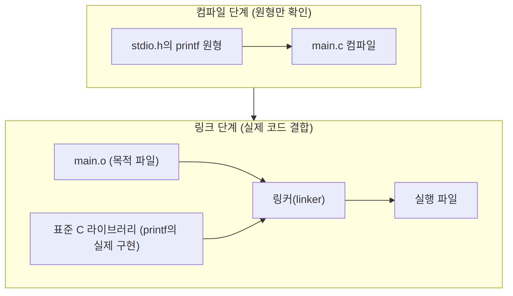

## 왜 컴파일 과정을 알아야 하는가

1편에서 C 소스 파일의 겉모습(함수, 세미콜론, 중괄호)을 훑어봤다면, 이번 편은 그 텍스트 파일이 **어떻게 실제로 실행되는 프로그램이 되는지**를 다룬다. 독학사 시험에서는 "다음 중 컴파일 과정에 해당하지 않는 것은?", "헤더 파일을 포함하지 않으면 어떤 오류가 나는가?" 같은 문제로 이 흐름을 직접 묻는다.

## 컴파일 과정 네 단계

C 소스 파일(`.c` 파일)이 실행 파일이 되기까지는 크게 네 단계를 거친다.


| 단계 | 영문 | 처리 내용 | 산출물 |
|------|------|-----------|--------|
| 1. 전처리 | preprocessing | `#include`로 헤더 파일 내용을 그대로 삽입, `#define` 매크로를 실제 값으로 치환, 조건부 컴파일 지시문 처리 | 전처리된 소스 코드 |
| 2. 컴파일 | compilation | 전처리된 C 코드를 문법적으로 분석해 어셈블리어(assembly language) 코드로 번역 | 어셈블리 코드 (`.s`) |
| 3. 어셈블 | assembly | 어셈블리 코드를 기계어(machine code)로 변환 | 목적 파일 (object file, `.o` 또는 `.obj`) |
| 4. 링크 | linking | 여러 목적 파일과 표준 라이브러리 함수(예: `printf`)의 실제 코드를 하나로 결합 | 실행 파일 (executable) |

이 중 시험에서 가장 자주 묻는 것은 **1단계 전처리와 2단계 컴파일의 구분**이다. `#include <stdio.h>`는 컴파일이 아니라 **전처리 단계에서** 헤더 파일의 내용을 그 자리에 그대로 복사해 붙여 넣는 작업이다. 즉 `#include`가 실행되는 시점에는 아직 문법 검사조차 시작되지 않은 상태다.

> **자주 틀리는 점:** `#include <stdio.h>`를 "printf 함수를 실행 파일에 넣어 주는 문장"으로 오해하기 쉽다. 실제로 이 문장은 **printf의 원형(prototype)이 선언된 헤더 파일의 텍스트를 그대로 복사해 붙여 넣을 뿐**이다. printf의 실제 실행 코드는 4단계 링크 단계에서 표준 라이브러리(standard library)로부터 연결된다. 헤더 파일에는 "이런 함수가 있다"는 선언만 있고, 실제 함수 본문(구현)은 컴파일된 라이브러리 파일 안에 들어 있다.

## 번역 단위: 컴파일러가 한 번에 보는 범위

**번역 단위**(translation unit)는 전처리가 끝난 뒤 컴파일러가 한 번에 처리하는 코드 덩어리를 말한다. 하나의 `.c` 파일에 그 파일이 `#include`로 끌어들인 모든 헤더 파일의 내용이 합쳐진 것이 하나의 번역 단위다.

```c
#include <stdio.h>   /* stdio.h의 내용이 여기에 그대로 삽입된다 */

int main(void) {
    printf("hello\n");
    return 0;
}
```

전처리가 끝난 뒤 컴파일러 눈에 보이는 코드는 실제로는 `stdio.h`에 선언된 수백 줄의 함수 원형 뒤에 위 `main` 함수가 이어 붙은 형태다. 여러 개의 `.c` 파일로 나뉜 프로젝트라면, 각 `.c` 파일이 각각 하나의 번역 단위가 되고, 이 여러 목적 파일들이 4단계 링크에서 하나로 합쳐진다.

## main 함수: 프로그램의 시작점이자 종료 신호

C 프로그램은 반드시 `main`이라는 이름의 함수를 하나 가져야 하며, 운영체제는 프로그램을 실행할 때 가장 먼저 이 `main` 함수를 호출한다. `main` 함수가 `return`으로 값을 돌려주면, 그 값이 운영체제에게 "프로그램이 어떻게 끝났는지"를 알리는 **종료 상태**(exit status)가 된다.

```c
#include <stdio.h>

int main(void) {
    printf("작업을 시작합니다.\n");
    /* 여기서 어떤 작업이 실패했다고 가정 */
    printf("작업이 실패했습니다.\n");
    return 1;   /* 0이 아닌 값 — 비정상 종료를 의미 */
}
```

```text
작업을 시작합니다.
작업이 실패했습니다.
```

관례적으로 **0은 정상 종료, 0이 아닌 값은 비정상 종료**(오류 발생)를 의미한다. 셸(shell)이나 배치(batch) 스크립트에서 이전 프로그램이 성공했는지 실패했는지 판단할 때 이 반환값을 사용하기 때문에, `return 0;`을 습관적으로 빠뜨리지 않는 것이 중요하다.

| 반환값 | 의미 |
|--------|------|
| `0` | 정상 종료 |
| `0`이 아닌 값(예: `1`, `-1`) | 비정상 종료, 오류 코드로 활용 가능 |

> **자주 틀리는 점:** `main` 함수의 반환형을 `void`로 쓰면 컴파일러에 따라 경고나 오류가 날 수 있다. 독학사 시험에서 표준을 따르는 정답은 `int main(void)`이며, `void main(void)`는 표준 C에서 정의되지 않은 형태로 취급된다는 점을 기억해야 한다.

## 헤더 파일 포함과 링크의 관계

헤더 파일(header file, `.h` 확장자)에는 함수의 **원형**(prototype)만 들어 있다. 원형은 "이 함수의 이름, 매개변수 자료형, 반환 자료형이 무엇인지"만 알려주는 선언이며, 함수가 실제로 어떻게 동작하는지(함수 본문)는 담고 있지 않다.

```c
/* stdio.h 안에 들어 있는 내용의 일부를 흉내 낸 것 */
int printf(const char *format, ...);
```

컴파일러는 `main.c`를 컴파일할 때 이 원형만 보고 "printf라는 함수는 존재하며, 이런 형태로 호출된다"는 사실만 확인한다. 실제 `printf`가 화면에 글자를 출력하는 구체적인 코드는 표준 C 라이브러리(standard C library, 예: `libc`)라는 이미 컴파일된 파일 안에 들어 있으며, 이 실제 코드와 우리가 작성한 `main.c`의 목적 파일을 하나로 묶는 작업이 바로 **4단계 링크**(linking)다.



만약 헤더 파일을 포함하지 않고 `printf`를 사용하면 컴파일러는 그 함수의 원형을 모르기 때문에 경고 또는 오류를 낸다. 반대로 원형을 알고 있어도 실제 구현이 있는 라이브러리와 링크되지 않으면 **링크 오류**(linker error, undefined reference)가 발생한다.

## 손코딩으로 흐름 확인하기

다음 코드를 보고 어떤 단계에서 어떤 처리가 일어나는지 손으로 추적해 보자.

```c
#define PI 3
#include <stdio.h>

int main(void) {
    int radius = 2;
    int area = PI * radius * radius;
    printf("area=%d\n", area);
    return 0;
}
```

```text
area=12
```

| 단계 | 이 코드에 일어나는 일 |
|------|------------------------|
| 전처리 | `#define PI 3`에 의해 코드 안의 모든 `PI`가 문자 그대로 `3`으로 치환된다. `#include <stdio.h>`의 내용이 삽입된다 |
| 컴파일 | `int area = 3 * radius * radius;`가 문법적으로 올바른지 검사되고 어셈블리 코드로 번역된다 |
| 어셈블 | 어셈블리 코드가 기계어 목적 파일로 변환된다 |
| 링크 | `printf`의 실제 구현이 포함된 라이브러리와 결합되어 실행 파일이 만들어진다 |
| 실행 | `main`이 호출되어 `radius=2`, `area = 3*2*2 = 12`가 계산되고 출력된다 |

`#define`이 **전처리 단계에서 단순 문자열 치환**으로 처리된다는 점이 핵심이다. `PI`는 변수가 아니라 코드 자체를 바꿔치기하는 매크로(macro)이므로, 컴파일러가 문법 검사를 시작하는 시점에는 이미 `PI`라는 이름 자체가 코드에 남아 있지 않다. 매크로의 자세한 함정(괄호 누락 등)은 14편에서 다룬다.

## 핵심 정리

- C 소스 코드는 전처리 → 컴파일 → 어셈블 → 링크의 네 단계를 거쳐 실행 파일이 된다.
- `#include`는 컴파일이 아니라 전처리 단계에서 헤더 파일의 내용을 그대로 복사해 삽입하는 작업이다.
- 헤더 파일에는 함수의 원형(선언)만 있고, 실제 구현은 링크 단계에서 라이브러리로부터 결합된다.
- `main` 함수는 프로그램의 시작점이며, 반환값 0은 정상 종료, 0이 아닌 값은 비정상 종료를 의미한다.
- `#define` 매크로는 전처리 단계에서 코드 안의 이름을 그대로 문자열 치환하는 방식으로 처리된다.

## 마무리 복습

<Quiz
  questionNumber={1}
  question={"C 소스 코드가 실행 파일이 되기까지 거치는 순서로 옳은 것은?"}
  options={["컴파일 → 전처리 → 어셈블 → 링크","전처리 → 컴파일 → 어셈블 → 링크","전처리 → 어셈블 → 컴파일 → 링크","링크 → 전처리 → 컴파일 → 어셈블"]}
  correctAnswer={2}
  explanation={"C 소스 코드는 전처리(헤더·매크로 처리) 후 컴파일(어셈블리 코드로 번역), 어셈블(기계어 목적 파일 생성), 링크(라이브러리와 결합) 순서로 실행 파일이 된다."}
/>

<Quiz
  questionNumber={2}
  question={"#include stdio.h에 대한 설명으로 옳은 것은?"}
  options={["printf 함수의 실제 실행 코드를 실행 파일에 직접 삽입한다","전처리 단계에서 stdio.h 파일의 내용을 소스 코드 자리에 그대로 복사해 넣는다","링크 단계에서만 처리되는 지시문이다","main 함수가 실행될 때마다 매번 다시 처리된다"]}
  correctAnswer={2}
  explanation={"#include는 전처리 단계에서 헤더 파일의 텍스트 내용을 그 위치에 그대로 복사해 삽입하는 지시문이다. 실제 함수 구현은 링크 단계에서 라이브러리로부터 결합된다."}
/>

<Quiz
  questionNumber={3}
  question={"main 함수의 반환값에 대한 설명으로 옳지 않은 것은?"}
  options={["0은 정상 종료를 의미하는 관례적인 값이다","0이 아닌 값은 비정상 종료나 오류 코드로 활용될 수 있다","main의 반환값은 운영체제나 셸에 종료 상태를 알려준다","main의 반환형은 항상 void로 선언해야 표준에 맞다"]}
  correctAnswer={4}
  explanation={"표준 C에서 main의 반환형은 int이며, 0은 정상 종료, 0이 아닌 값은 비정상 종료를 의미하는 관례를 따른다. void main은 표준 형태가 아니므로 이 설명은 옳지 않다."}
/>

## 참고 자료

- [국가평생교육진흥원 독학학위제](https://bdes.nile.or.kr)
- [cppreference.com - 프로그램 빌드 과정(Compilation)](https://en.cppreference.com/w/c/language/translation_phases)
