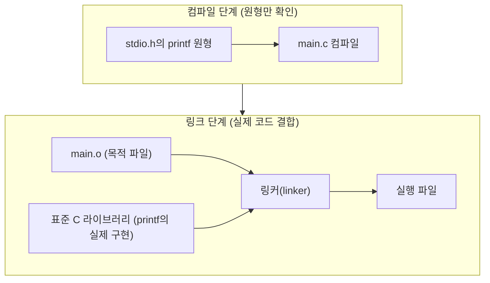

<Callout type="info">
  **이번 문서의 목표:** 이 파일을 다 읽으면 C 소스 코드가 실행 파일이 되기까지 거치는 전처리·컴파일·어셈블·링크 네 단계를 순서대로 설명하고, main 함수의 반환값과 헤더 포함이 왜 필요한지 답할 수 있다.
</Callout>

## 왜 컴파일 과정을 알아야 하는가

2편에서 C 소스 파일의 겉모습(함수, 세미콜론, 중괄호)을 훑어봤다면, 이번 편은 그 텍스트 파일이 **어떻게 실제로 실행되는 프로그램이 되는지**를 다룬다. 독학사 시험에서는 "다음 중 컴파일 과정에 해당하지 않는 것은?", "헤더 파일을 포함하지 않으면 어떤 오류가 나는가?" 같은 문제로 이 흐름을 직접 묻는다. 또한 이 흐름을 알아야 15편(선행처리기)의 `#include`, `#define`이 "언제, 어느 단계에서" 처리되는지 정확히 이해할 수 있다.

> **쉽게 말하면:** 컴파일 과정은 사람이 읽는 한국어 조리법(소스 코드)을 기계가 그대로 따라 할 수 있는 동작 순서(기계어)로 번역하는 4단계 번역 공정이다.

## 컴파일 과정 네 단계

C 소스 파일(`.c` 파일)이 실행 파일이 되기까지는 크게 네 단계를 거친다.


| 단계 | 영문 | 처리 내용 | 산출물 |
|------|------|-----------|--------|
| 1. 전처리 | preprocessing | `#include`로 헤더 파일 내용을 그대로 삽입, `#define` 매크로를 실제 값으로 치환, 조건부 컴파일 지시문 처리 | 전처리된 소스 코드 |
| 2. 컴파일 | compilation | 전처리된 C 코드를 문법적으로 분석해 어셈블리어(assembly language) 코드로 번역 | 어셈블리 코드 (`.s`) |
| 3. 어셈블 | assembly | 어셈블리 코드를 기계어(machine code)로 변환 | 목적 파일 (object file, `.o` 또는 `.obj`) |
| 4. 링크 | linking | 여러 목적 파일과 표준 라이브러리 함수(예: `printf`)의 실제 코드를 하나로 결합 | 실행 파일 (executable) |

이 중 시험에서 가장 자주 묻는 것은 **1단계 전처리와 2단계 컴파일의 구분**이다. `#include <stdio.h>`는 컴파일이 아니라 **전처리 단계에서** 헤더 파일의 내용을 그 자리에 그대로 복사해 붙여 넣는 작업이다. 즉 `#include`가 실행되는 시점에는 아직 문법 검사조차 시작되지 않은 상태다.

> **자주 틀리는 점:** `#include <stdio.h>`를 "printf 함수를 실행 파일에 넣어 주는 문장"으로 오해하기 쉽다. 실제로 이 문장은 **printf의 원형(prototype)이 선언된 헤더 파일의 텍스트를 그대로 복사해 붙여 넣을 뿐**이다. printf의 실제 실행 코드는 4단계 링크 단계에서 표준 라이브러리(standard library)로부터 연결된다. 헤더 파일에는 "이런 함수가 있다"는 선언만 있고, 실제 함수 본문(구현)은 컴파일된 라이브러리 파일 안에 들어 있다.

## 번역 단위: 컴파일러가 한 번에 보는 범위

**번역 단위**(translation unit)는 전처리가 끝난 뒤 컴파일러가 한 번에 처리하는 코드 덩어리를 말한다. 하나의 `.c` 파일에 그 파일이 `#include`로 끌어들인 모든 헤더 파일의 내용이 합쳐진 것이 하나의 번역 단위다.

```c
#include <stdio.h>   /* stdio.h의 내용이 여기에 그대로 삽입된다 */

int main(void) {
    printf("hello\n");
    return 0;
}
```

전처리가 끝난 뒤 컴파일러 눈에 보이는 코드는 실제로는 `stdio.h`에 선언된 수백 줄의 함수 원형 뒤에 위 `main` 함수가 이어 붙은 형태다. 여러 개의 `.c` 파일로 나뉜 프로젝트라면, 각 `.c` 파일이 각각 하나의 번역 단위가 되고, 이 여러 목적 파일들이 4단계 링크에서 하나로 합쳐진다.

## main 함수: 프로그램의 시작점이자 종료 신호

C 프로그램은 반드시 `main`이라는 이름의 함수를 하나 가져야 하며, 운영체제는 프로그램을 실행할 때 가장 먼저 이 `main` 함수를 호출한다. `main` 함수가 `return`으로 값을 돌려주면, 그 값이 운영체제에게 "프로그램이 어떻게 끝났는지"를 알리는 **종료 상태**(exit status)가 된다.

```c
#include <stdio.h>

int main(void) {
    printf("작업을 시작합니다.\n");
    /* 여기서 어떤 작업이 실패했다고 가정 */
    printf("작업이 실패했습니다.\n");
    return 1;   /* 0이 아닌 값 — 비정상 종료를 의미 */
}
```

```text
작업을 시작합니다.
작업이 실패했습니다.
```

관례적으로 **0은 정상 종료, 0이 아닌 값은 비정상 종료**(오류 발생)를 의미한다. 셸(shell)이나 배치(batch) 스크립트에서 이전 프로그램이 성공했는지 실패했는지 판단할 때 이 반환값을 사용하기 때문에, `return 0;`을 습관적으로 빠뜨리지 않는 것이 중요하다. C 표준에서는 `main`의 반환형을 명시하지 않고 함수 끝에 도달하면(구식 컴파일러 기준) 정의되지 않은 값이 반환될 수 있으므로, 항상 `return` 문을 명시적으로 써 주는 것이 안전하다.

| 반환값 | 의미 |
|--------|------|
| `0` | 정상 종료 |
| `0`이 아닌 값(예: `1`, `-1`) | 비정상 종료, 오류 코드로 활용 가능 |

> **자주 틀리는 점:** `main` 함수의 반환형을 `void`로 쓰면 컴파일러에 따라 경고나 오류가 날 수 있다. 독학사 시험에서 표준을 따르는 정답은 `int main(void)`이며, `void main(void)`는 표준 C에서 정의되지 않은 형태로 취급된다는 점을 기억해야 한다.

## 헤더 파일 포함과 링크의 관계

헤더 파일(header file, `.h` 확장자)에는 함수의 **원형**(prototype)만 들어 있다. 원형은 "이 함수의 이름, 매개변수 자료형, 반환 자료형이 무엇인지"만 알려주는 선언이며, 함수가 실제로 어떻게 동작하는지(함수 본문)는 담고 있지 않다.

```c
/* stdio.h 안에 들어 있는 내용의 일부를 흉내 낸 것 */
int printf(const char *format, ...);
```

컴파일러는 `main.c`를 컴파일할 때 이 원형만 보고 "printf라는 함수는 존재하며, 이런 형태로 호출된다"는 사실만 확인한다. 실제 `printf`가 화면에 글자를 출력하는 구체적인 코드는 표준 C 라이브러리(standard C library, 예: `libc`)라는 이미 컴파일된 파일 안에 들어 있으며, 이 실제 코드와 우리가 작성한 `main.c`의 목적 파일을 하나로 묶는 작업이 바로 **4단계 링크**(linking)다.



만약 헤더 파일을 포함하지 않고 `printf`를 사용하면 컴파일러는 그 함수의 원형을 모르기 때문에 경고 또는 오류를 낸다. 반대로 원형을 알고 있어도 실제 구현이 있는 라이브러리와 링크되지 않으면 **링크 오류**(linker error, undefined reference)가 발생한다. 이 둘의 차이는 21편(오류 분석)에서 컴파일 오류와 링크 오류를 구분하는 문제로 다시 등장한다.

## 손코딩으로 흐름 확인하기

다음 코드를 보고 어떤 단계에서 어떤 처리가 일어나는지 손으로 추적해 보자.

```c
#define PI 3
#include <stdio.h>

int main(void) {
    int radius = 2;
    int area = PI * radius * radius;
    printf("area=%d\n", area);
    return 0;
}
```

```text
area=12
```

| 단계 | 이 코드에 일어나는 일 |
|------|------------------------|
| 전처리 | `#define PI 3`에 의해 코드 안의 모든 `PI`가 문자 그대로 `3`으로 치환된다. `#include <stdio.h>`의 내용이 삽입된다 |
| 컴파일 | `int area = 3 * radius * radius;`가 문법적으로 올바른지 검사되고 어셈블리 코드로 번역된다 |
| 어셈블 | 어셈블리 코드가 기계어 목적 파일로 변환된다 |
| 링크 | `printf`의 실제 구현이 포함된 라이브러리와 결합되어 실행 파일이 만들어진다 |
| 실행 | `main`이 호출되어 `radius=2`, `area = 3*2*2 = 12`가 계산되고 출력된다 |

`#define`이 **전처리 단계에서 단순 문자열 치환**으로 처리된다는 점이 핵심이다. `PI`는 변수가 아니라 코드 자체를 바꿔치기하는 매크로(macro)이므로, 컴파일러가 문법 검사를 시작하는 시점에는 이미 `PI`라는 이름 자체가 코드에 남아 있지 않다. 매크로의 자세한 함정(괄호 누락 등)은 15편에서 다룬다.

## 핵심 정리

- C 소스 코드는 전처리 → 컴파일 → 어셈블 → 링크의 네 단계를 거쳐 실행 파일이 된다.
- `#include`는 컴파일이 아니라 전처리 단계에서 헤더 파일의 내용을 그대로 복사해 삽입하는 작업이다.
- 헤더 파일에는 함수의 원형(선언)만 있고, 실제 구현은 링크 단계에서 라이브러리로부터 결합된다.
- `main` 함수는 프로그램의 시작점이며, 반환값 0은 정상 종료, 0이 아닌 값은 비정상 종료를 의미한다.
- `#define` 매크로는 전처리 단계에서 코드 안의 이름을 그대로 문자열 치환하는 방식으로 처리된다.

## 마무리 복습

<Quiz
  questionNumber={1}
  question="C 소스 코드가 실행 파일이 되기까지 거치는 순서로 옳은 것은?"
  options={['컴파일 → 전처리 → 어셈블 → 링크', '전처리 → 컴파일 → 어셈블 → 링크', '전처리 → 어셈블 → 컴파일 → 링크', '링크 → 전처리 → 컴파일 → 어셈블']}
  correctAnswer={2}
  explanation="C 소스 코드는 전처리(헤더·매크로 처리) 후 컴파일(어셈블리 코드로 번역), 어셈블(기계어 목적 파일 생성), 링크(라이브러리와 결합) 순서로 실행 파일이 된다."
  optionExplanations={['전처리가 컴파일보다 먼저 일어나야 매크로 치환 결과를 컴파일러가 검사할 수 있다.', '정답이다. 전처리 → 컴파일 → 어셈블 → 링크 순서가 표준적인 흐름이다.', '컴파일이 어셈블보다 먼저 일어나야 어셈블리 코드가 만들어질 수 있다.', '링크는 목적 파일이 만들어진 뒤 가장 마지막에 일어나는 단계다.']}
/>

<Quiz
  questionNumber={2}
  question="#include stdio.h에 대한 설명으로 옳은 것은?"
  options={['printf 함수의 실제 실행 코드를 실행 파일에 직접 삽입한다', '전처리 단계에서 stdio.h 파일의 내용을 소스 코드 자리에 그대로 복사해 넣는다', '링크 단계에서만 처리되는 지시문이다', 'main 함수가 실행될 때마다 매번 다시 처리된다']}
  correctAnswer={2}
  explanation="#include는 전처리 단계에서 헤더 파일의 텍스트 내용을 그 위치에 그대로 복사해 삽입하는 지시문이다. 실제 함수 구현은 링크 단계에서 라이브러리로부터 결합된다."
  optionExplanations={['헤더 파일에는 함수 원형만 있고, 실제 실행 코드는 링크 단계에서 결합된다.', '정답이다. 전처리 단계에서 헤더 파일 내용이 그대로 복사, 삽입된다.', '#include는 전처리 단계에서 처리되며 링크 단계와는 다른 단계다.', '전처리는 컴파일 이전에 한 번 처리되는 것이지 실행 중에 반복 처리되지 않는다.']}
/>

<Quiz
  questionNumber={3}
  question="main 함수의 반환값에 대한 설명으로 옳지 않은 것은?"
  options={['0은 정상 종료를 의미하는 관례적인 값이다', '0이 아닌 값은 비정상 종료나 오류 코드로 활용될 수 있다', 'main의 반환값은 운영체제나 셸에 종료 상태를 알려준다', 'main의 반환형은 항상 void로 선언해야 표준에 맞다']}
  correctAnswer={4}
  explanation="표준 C에서 main의 반환형은 int이며, 0은 정상 종료, 0이 아닌 값은 비정상 종료를 의미하는 관례를 따른다. void main은 표준 형태가 아니므로 이 설명은 옳지 않다."
  optionExplanations={['0을 정상 종료로 보는 것은 널리 통용되는 관례이므로 옳은 설명이다.', '0이 아닌 값을 오류 코드로 활용하는 것은 실제로 널리 쓰이는 방식이므로 옳은 설명이다.', '셸 스크립트 등에서 이전 프로그램의 성공, 실패 여부를 반환값으로 판단하므로 옳은 설명이다.', '정답이다. 표준 C에서 main의 올바른 반환형은 int이며 void main은 표준 형태가 아니다.']}
/>

<Quiz
  questionNumber={4}
  question="헤더 파일과 링크의 관계에 대한 설명으로 옳은 것은?"
  options={['헤더 파일에는 함수의 실제 구현 코드가 들어 있어 링크가 필요 없다', '헤더 파일은 함수의 원형만 담고 있고, 실제 구현은 링크 단계에서 라이브러리로부터 결합된다', '링크는 전처리보다 먼저 일어나는 단계다', '헤더 파일을 포함하지 않아도 링크 단계에서 자동으로 원형을 찾아준다']}
  correctAnswer={2}
  explanation="헤더 파일에는 함수 이름, 매개변수, 반환형을 알려주는 원형(선언)만 들어 있으며, 실제 함수의 동작 코드는 이미 컴파일된 표준 라이브러리 파일 안에 있다가 링크 단계에서 목적 파일과 결합된다."
  optionExplanations={['헤더 파일에는 원형만 있고 실제 구현은 별도의 라이브러리 파일에 있다.', '정답이다. 헤더는 원형만, 실제 구현 결합은 링크 단계의 역할이다.', '링크는 전처리, 컴파일, 어셈블을 모두 거친 뒤 가장 마지막에 일어난다.', '헤더 파일을 포함하지 않으면 컴파일러가 함수 원형을 몰라 오류나 경고가 발생할 수 있다.']}
/>

<Quiz
  questionNumber={5}
  question="다음 코드에서 #define PI 3이 처리되는 방식으로 옳은 것은?"
  options={['PI는 실행 중에 값이 바뀔 수 있는 변수로 취급된다', '컴파일 단계에서 PI라는 이름의 상수 심볼로 등록되어 타입 검사를 받는다', '전처리 단계에서 코드 안의 PI가 모두 문자 그대로 3으로 치환된다', 'PI는 링크 단계에서 라이브러리 상수와 결합된다']}
  correctAnswer={3}
  explanation="#define으로 정의한 매크로는 전처리 단계에서 코드 안의 해당 이름을 지정된 문자열로 그대로 치환하는 방식으로 처리되며, 변수나 심볼이 아니다."
  optionExplanations={['매크로는 변수가 아니라 전처리 단계의 단순 문자열 치환 대상이다.', '매크로는 컴파일러가 인식하는 타입을 가진 심볼이 아니라 전처리기가 치환하는 텍스트일 뿐이다.', '정답이다. 전처리 단계에서 PI라는 텍스트가 3이라는 텍스트로 그대로 치환된다.', '매크로 치환은 링크 이전인 전처리 단계에서 끝난다.']}
/>

<Quiz
  questionNumber={6}
  question="번역 단위(translation unit)에 대한 설명으로 옳은 것은?"
  options={['하나의 프로젝트 전체를 의미하며 파일 개수와 무관하다', '전처리가 끝난 뒤 컴파일러가 한 번에 처리하는, 헤더 내용이 삽입된 하나의 코드 덩어리를 의미한다', '실행 파일이 만들어진 이후의 최종 산출물을 의미한다', '어셈블리 코드로 번역되기 전의 원본 소스 파일만을 의미하며 헤더는 포함하지 않는다']}
  correctAnswer={2}
  explanation="번역 단위는 하나의 .c 파일에 그 파일이 include한 모든 헤더 파일의 내용이 전처리 단계에서 합쳐진, 컴파일러가 한 번에 처리하는 코드 덩어리를 말한다."
  optionExplanations={['번역 단위는 파일마다 하나씩 만들어지며 프로젝트 전체를 하나로 묶는 개념이 아니다.', '정답이다. 전처리가 끝난 뒤 헤더 내용까지 포함된 코드 덩어리가 번역 단위다.', '실행 파일은 여러 목적 파일이 링크된 최종 산출물로 번역 단위와는 다른 개념이다.', '번역 단위에는 include된 헤더 파일의 내용도 포함된다.']}
/>

## 참고 자료

- [국가평생교육진흥원 독학학위제](https://bdes.nile.or.kr)
- [cppreference.com - 프로그램 빌드 과정(Compilation)](https://en.cppreference.com/w/c/language/translation_phases)
