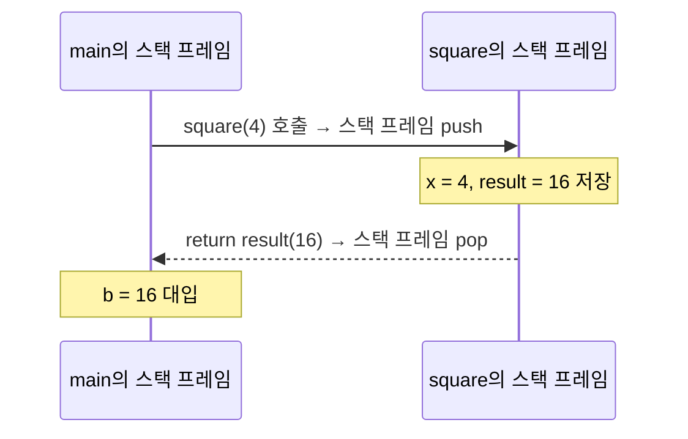

<Callout type="info">
  **이번 문서의 목표:** 함수 선언과 정의, 프로토타입의 관계를 정확히 구분하고, C가 인자를 값으로 전달한다는 사실이 실제로 어떤 결과를 만드는지, 함수를 호출할 때마다 스택 프레임이 어떻게 쌓이고 정리되는지 그림과 표로 설명할 수 있게 된다.
</Callout>

## 왜 함수가 필요한가

같은 계산(예: 두 수 중 더 큰 값 찾기, 합계 구하기)을 프로그램 여러 곳에서 반복해야 한다고 가정해 봅시다. 매번 같은 코드를 복사해 붙이면 코드가 길어지고, 나중에 로직을 수정할 때 모든 복사본을 하나하나 고쳐야 합니다. **함수**(function, 함수)는 이런 반복되는 작업을 이름 붙인 하나의 단위로 묶어, 필요할 때마다 그 이름을 불러(호출, call) 재사용하는 문법입니다.

> **쉽게 말하면:** 함수는 "레시피"입니다. 레시피를 한 번 적어 두면, 그 요리가 필요할 때마다 처음부터 다시 설명하지 않고 레시피 이름만 부르면 됩니다.

06편에서 이미 `main` 함수를 다뤘습니다. 사실 C 프로그램은 `main`이라는 특별한 함수 하나로 시작해서, 그 안에서 다른 함수들을 호출하며 진행되는 구조입니다. 이번 편에서는 사용자가 직접 함수를 만들고 호출하는 방법과, 그 과정에서 메모리가 어떻게 움직이는지를 다룹니다.

## 1. 함수 선언·정의·프로토타입 — 세 용어의 차이

독학사 시험에서 세 용어를 헷갈리게 묻는 문제가 자주 나옵니다. 아래 표로 먼저 구분합니다.

| 용어 | 의미 | 예시 |
|------|------|------|
| 함수 정의(definition) | 함수의 이름·매개변수·반환형과 함께 **실제 실행할 코드(본문)** 까지 작성한 것 | `int add(int a, int b) { return a + b; }` |
| 함수 선언(declaration) | 함수의 이름·매개변수·반환형만 컴파일러에게 알려주는 것(본문 없음) | `int add(int a, int b);` |
| 함수 프로토타입(prototype) | 함수 정의보다 **먼저** 컴파일러에게 함수의 존재를 알리기 위한 선언. 실무에서는 선언과 사실상 같은 뜻으로 쓰인다 | `int add(int, int);`(매개변수 이름 생략 가능) |

### 프로토타입이 왜 필요한가

C 컴파일러는 소스 코드를 **위에서 아래로 한 번** 읽으면서 해석합니다. 만약 `main` 함수 안에서 `add`라는 함수를 호출하는데, `add`의 정의가 `main`보다 **아래**에 있다면, 컴파일러는 `add`를 호출하는 시점에 아직 `add`가 무엇인지(매개변수 개수·형, 반환형) 모르는 상태입니다.

```c
#include <stdio.h>

int add(int a, int b);   /* 프로토타입: add의 존재를 미리 알림 */

int main(void) {
    int result = add(3, 4);
    printf("%d\n", result);
    return 0;
}

int add(int a, int b) {   /* 실제 정의는 main보다 뒤에 위치 */
    return a + b;
}
```

```text
7
```

프로토타입 한 줄이 `main`보다 위에 있으므로, 컴파일러는 `add(3, 4)`를 만나는 순간 "정수 두 개를 받아 정수를 반환하는 함수가 있다"는 사실을 이미 알고 있어 문제없이 컴파일됩니다. **자주 틀리는 점:** 프로토타입 없이 함수를 자신의 정의보다 먼저 호출하면, 컴파일러에 따라 경고 또는 오류가 발생하거나(특히 매개변수 형이 다르면), 잘못된 방식으로 인자를 해석해 예상과 다른 결과가 나올 수 있습니다.

## 2. 값 전달(pass by value) — C 함수 호출의 기본 원칙

C에서 함수에 인자를 넘기면, **인자 값의 복사본**이 함수 안의 매개변수에 전달됩니다. 이를 **값에 의한 전달**(pass by value, 값 전달)이라고 부릅니다.

```c
#include <stdio.h>

void addOne(int n) {
    n = n + 1;
    printf("함수 안 n: %d\n", n);
}

int main(void) {
    int x = 5;
    addOne(x);
    printf("함수 밖 x: %d\n", x);
    return 0;
}
```

```text
함수 안 n: 6
함수 밖 x: 5
```

| 시점 | main의 x | addOne의 n | 설명 |
|------|----------|-------------|------|
| addOne(x) 호출 직전 | 5 | (아직 없음) | x의 값 5가 복사되어 전달 준비 |
| addOne 진입 직후 | 5 | 5 | n은 x와 값만 같을 뿐 **서로 다른 메모리 공간** |
| n = n + 1 실행 후 | 5 | 6 | n만 바뀌고 x는 그대로 |
| addOne 종료 후 | 5 | (메모리 해제됨) | x는 애초에 영향받은 적이 없음 |

**해석:** `n`은 `x`의 값을 복사해 받은 **완전히 별개의 변수**입니다. `addOne` 함수 안에서 `n`을 아무리 바꿔도, 함수를 호출한 쪽의 `x`는 전혀 영향을 받지 않습니다. 이것이 "값 전달"의 핵심입니다.

> **쉽게 말하면:** 함수를 부를 때 원본을 건네주는 것이 아니라 **원본을 복사한 사본**을 건네줍니다. 함수 안에서 사본을 아무리 고쳐도 원본은 그대로입니다.

**자주 틀리는 점:** "함수에 변수를 넘기면 그 변수가 함수 안에서 바뀐 대로 함수 밖에서도 바뀐다"고 착각하는 경우가 매우 흔합니다. C에서 함수 호출만으로는 호출한 쪽의 변수를 바꿀 수 없습니다. 호출한 쪽의 원본 변수를 바꾸려면 **주소를 전달해 포인터로 접근**해야 하며, 이는 12~13편에서 다룹니다.

### return의 역할

`return`은 함수 실행을 즉시 종료하고, 지정한 값을 호출한 자리로 돌려줍니다. `return`을 만나면 그 아래 남은 코드는 실행되지 않습니다. 반환형이 `void`인 함수는 값을 돌려주지 않으며, `return;`(값 없이)으로 중간에 함수를 끝내거나, 함수 끝까지 도달하면 자동으로 종료됩니다.

## 3. 지역 변수와 전역 변수의 범위

**지역 변수**(local variable, 지역 변수)는 함수(또는 블록) 안에서 선언되어, 그 함수(블록)가 실행되는 동안에만 존재하고 함수가 끝나면 사라집니다. **전역 변수**(global variable, 전역 변수)는 함수 밖에서 선언되어, 프로그램이 실행되는 내내 존재하며 모든 함수에서 접근할 수 있습니다.

```c
#include <stdio.h>

int counter = 0;   /* 전역 변수 */

void increase(void) {
    int counter = 100;   /* 지역 변수: 전역 변수와 이름만 같은 별개의 변수 */
    counter++;
    printf("함수 안 counter: %d\n", counter);
}

int main(void) {
    increase();
    printf("함수 밖 counter: %d\n", counter);
    return 0;
}
```

```text
함수 안 counter: 101
함수 밖 counter: 0
```

**해석:** `increase` 함수 안에서 `int counter = 100;`으로 **같은 이름의 지역 변수**를 새로 선언했습니다. 이렇게 되면 함수 안에서 `counter`를 쓸 때는 바깥의 전역 변수가 아니라 **가장 가까운 범위(scope, 스코프)의 지역 변수가 우선**됩니다. 이 현상을 **가리기**(shadowing, 섀도잉)라고 부릅니다. 함수 안의 `counter++`는 지역 변수 101을 만들 뿐, 전역 변수 `counter`는 여전히 0으로 남습니다.

**자주 틀리는 점:** 지역 변수가 전역 변수와 이름이 같으면, 그 지역 변수의 범위 안에서는 전역 변수에 **접근할 수 없게 가려집니다**(사라지는 것이 아니라 가려질 뿐입니다). 시험에서는 이런 이름 충돌 코드를 주고 "각 `counter`가 가리키는 것이 무엇인가"를 묻습니다.

## 4. 함수 호출과 스택 프레임

06편·05편에서 스택(stack) 영역의 큰 그림을 소개했습니다. 이제 함수가 호출될 때 스택에 정확히 무슨 일이 일어나는지 살펴봅니다.

함수가 호출될 때마다, 그 함수를 위한 **스택 프레임**(stack frame, 스택 프레임)이 스택 영역에 새로 쌓입니다(push). 스택 프레임에는 그 함수의 매개변수, 지역 변수, 그리고 함수가 끝난 뒤 되돌아갈 위치(복귀 주소)가 저장됩니다. 함수가 끝나면 그 스택 프레임은 통째로 제거됩니다(pop).

```c
#include <stdio.h>

int square(int x) {
    int result = x * x;
    return result;
}

int main(void) {
    int a = 4;
    int b = square(a);
    printf("%d\n", b);
    return 0;
}
```



| 실행 시점 | 스택에 쌓인 프레임 | 각 프레임의 지역 변수 |
|-----------|----------------------|------------------------|
| main 시작 직후 | main | a(값 미정) |
| a = 4 실행 후 | main | a = 4 |
| square(a) 호출 순간 | main, square | main: a = 4 / square: x = 4 |
| result = x * x 실행 후 | main, square | main: a = 4 / square: x = 4, result = 16 |
| square 종료(return 직후) | main | main: a = 4, b = 16 |

**해석:** `square(a)`를 호출하는 순간 `square`만을 위한 새 스택 프레임이 스택 맨 위에 쌓입니다. 이 프레임 안의 `x`, `result`는 `square`가 실행되는 동안에만 존재하는 지역 변수입니다. `return result;`가 실행되면 그 값(16)이 호출한 자리로 전달되고, `square`의 스택 프레임은 **완전히 제거**됩니다. 이후 `main`에서 `x`나 `result`라는 이름의 변수에 접근하는 것은 불가능합니다(애초에 `main`의 스택 프레임에는 그런 변수가 없었기 때문입니다).

### 재귀 호출 시 스택 프레임이 쌓이는 모습

함수가 자기 자신을 호출하는 것을 **재귀**(recursion, 재귀)라고 합니다. 재귀 호출은 호출할 때마다 **매번 새로운 스택 프레임**이 별도로 쌓인다는 점을 이해하면 헷갈리지 않습니다.

```c
int factorial(int n) {
    if (n <= 1) {
        return 1;
    }
    return n * factorial(n - 1);
}
```

`factorial(3)`을 호출하면 스택에는 다음과 같이 프레임이 쌓입니다.

| 호출 깊이 | 쌓이는 프레임 | 그 프레임의 n | 반환을 기다리는 식 |
|-----------|----------------|----------------|----------------------|
| 1 | factorial(3) | 3 | `3 * factorial(2)`의 결과 대기 |
| 2 | factorial(2) | 2 | `2 * factorial(1)`의 결과 대기 |
| 3 | factorial(1) | 1 | `n <= 1`이므로 즉시 1 반환 |

가장 안쪽(`factorial(1)`)부터 값이 확정되며 스택 프레임이 하나씩 제거(pop)되고, 그 값을 이용해 바깥쪽 호출이 순서대로 완료됩니다: `factorial(1)`이 1을 반환 → `factorial(2)`가 `2 * 1 = 2`를 반환 → `factorial(3)`이 `3 * 2 = 6`을 반환합니다.

**자주 틀리는 점:** 재귀 함수의 각 호출은 **서로 다른 스택 프레임**을 가지므로, `n`이라는 같은 이름의 변수라도 호출 깊이마다 값이 다른 별개의 변수입니다. "재귀 호출에서 n을 바꾸면 이전 호출의 n도 바뀐다"는 것은 잘못된 생각입니다. 또한 `if (n <= 1) return 1;`처럼 재귀를 멈추는 조건(기저 조건, base case)이 없으면 스택 프레임이 무한히 쌓이다가 메모리가 고갈되는 **스택 오버플로**(stack overflow, 스택 오버플로)가 발생합니다.

## 핵심 정리

- 함수 정의는 본문 포함, 함수 선언(프로토타입)은 본문 없이 존재만 알림. 프로토타입은 호출보다 먼저 나와야 한다.
- C는 인자를 값으로 전달한다. 함수 안에서 매개변수를 바꿔도 호출한 쪽의 원본 변수는 바뀌지 않는다.
- 지역 변수는 함수(블록) 실행 동안만 존재하고, 전역 변수는 프로그램 실행 내내 존재한다.
- 지역 변수와 전역 변수의 이름이 같으면 지역 변수가 전역 변수를 가린다(shadowing).
- 함수를 호출할 때마다 그 함수만의 스택 프레임이 push되고, 함수가 끝나면 pop되어 사라진다.
- 재귀 호출은 호출마다 별도의 스택 프레임을 쌓으며, 기저 조건이 없으면 스택 오버플로가 발생한다.

## 마무리 복습

<Quiz
  questionNumber={1}
  question="함수 프로토타입에 대한 설명으로 옳은 것은?"
  options={['함수의 실행 코드(본문)까지 포함한 완전한 정의다', '함수의 이름·매개변수·반환형만 컴파일러에게 미리 알리는 선언이다', '반드시 함수 정의보다 뒤에 위치해야 한다', 'main 함수에서만 사용할 수 있다']}
  correctAnswer={2}
  explanation="프로토타입은 함수의 본문 없이 이름·매개변수·반환형만으로 컴파일러에게 함수의 존재를 미리 알리는 선언이며, 함수가 호출되는 지점보다 먼저 나와야 한다."
  optionExplanations={['본문까지 포함하면 프로토타입이 아니라 정의다', '정답. 본문 없이 존재만 알리는 선언이 프로토타입이다', '실제로는 호출보다 먼저(정의보다 앞) 위치시키는 것이 프로토타입을 쓰는 목적이다', '프로토타입은 어떤 함수를 호출하는 위치에서든 필요에 따라 사용할 수 있다']}
/>

<Quiz
  questionNumber={2}
  question="다음 코드를 실행하면 함수 밖 x에는 어떤 값이 출력되는가? (함수 addOne은 매개변수 n을 n+1로 바꾸고, main에서 x=5로 addOne(x)를 호출한 뒤 x를 출력)"
  options={['4', '5', '6', '컴파일 오류']}
  correctAnswer={2}
  explanation="C는 인자를 값으로 전달하므로 addOne 안의 n은 x의 값을 복사한 별개의 변수다. n을 아무리 바꿔도 호출한 쪽의 x는 영향을 받지 않아 그대로 5가 출력된다."
  optionExplanations={['x가 감소할 근거가 없다', '정답. 값 전달이므로 함수 안에서 n을 바꿔도 원본 x는 바뀌지 않는다', 'n이 6이 되는 것과 x가 6이 되는 것은 별개다. n의 변화는 x에 영향을 주지 않는다', '값 전달은 문법적으로 완전히 유효한 호출이라 오류가 아니다']}
/>

<Quiz
  questionNumber={3}
  question="지역 변수와 전역 변수의 이름이 같을 때 함수 안에서 그 이름을 사용하면 어떤 변수가 우선하는가?"
  options={['항상 전역 변수가 우선한다', '항상 지역 변수가 우선하며 전역 변수는 그 범위 안에서 가려진다', '컴파일 오류가 발생해 실행할 수 없다', '두 변수의 값이 자동으로 합쳐진다']}
  correctAnswer={2}
  explanation="같은 이름의 지역 변수가 선언된 범위 안에서는 지역 변수가 우선 적용되고, 전역 변수는 그 범위 안에서 가려진다(shadowing). 이는 문법 오류가 아니라 정상적으로 컴파일·실행된다."
  optionExplanations={['이름이 겹치면 더 좁은 범위인 지역 변수가 우선한다', '정답. 지역 변수가 전역 변수를 가리는 shadowing 현상이다', '이름이 같은 지역 변수 선언 자체는 유효한 문법이라 오류가 아니다', '두 변수는 서로 다른 메모리 공간에 독립적으로 존재하며 합쳐지지 않는다']}
/>

<Quiz
  questionNumber={4}
  question="함수를 호출할 때마다 새로 생성되고, 함수가 끝나면 제거되는 메모리 단위로 매개변수·지역 변수·복귀 주소를 담는 것은?"
  options={['힙 블록', '스택 프레임', '전역 데이터 영역', '레지스터 파일']}
  correctAnswer={2}
  explanation="함수가 호출될 때마다 그 함수 전용 스택 프레임이 스택 영역에 push되고, 함수가 끝나면 pop되어 사라진다. 매개변수, 지역 변수, 복귀 주소가 여기에 저장된다."
  optionExplanations={['힙 블록은 malloc 등으로 프로그래머가 직접 요청해 할당하는 메모리로 함수 호출과 자동으로 연결되지 않는다', '정답. 함수 호출마다 쌓이고 제거되는 단위가 스택 프레임이다', '전역 데이터 영역은 프로그램 실행 내내 유지되며 함수 호출마다 새로 생기지 않는다', '레지스터는 CPU 내부의 초고속 저장 공간으로 스택 프레임의 개념과는 다르다']}
/>

<Quiz
  questionNumber={5}
  question="factorial(3)을 재귀로 호출할 때, factorial(1)의 스택 프레임에 대한 설명으로 옳은 것은?"
  options={['factorial(3)의 스택 프레임과 완전히 같은 메모리 공간을 공유한다', 'factorial(2), factorial(3)과는 별개의 독립된 스택 프레임을 갖는다', '재귀 호출에서는 스택 프레임이 생성되지 않는다', 'factorial(1)이 반환되면 factorial(2)와 factorial(3)의 프레임도 함께 사라진다']}
  correctAnswer={2}
  explanation="재귀 호출도 일반 함수 호출과 마찬가지로 호출할 때마다 새로운 스택 프레임이 별도로 생성된다. factorial(1)의 n=1은 factorial(2)의 n=2, factorial(3)의 n=3과 완전히 독립된 변수다."
  optionExplanations={['각 호출은 서로 다른 독립된 스택 프레임을 가지며 메모리 공간을 공유하지 않는다', '정답. 재귀 호출도 매번 독립된 스택 프레임을 새로 쌓는다', '재귀 호출도 함수 호출이므로 동일하게 스택 프레임이 생성된다', 'factorial(1)이 반환되면 그 프레임만 제거되고, factorial(2)의 계산이 이어서 진행된다']}
/>

<Quiz
  questionNumber={6}
  question="재귀 함수에 기저 조건(base case)이 없을 때 발생할 수 있는 문제로 가장 적절한 것은?"
  options={['컴파일 시점에 바로 오류로 잡힌다', '스택 프레임이 무한히 쌓이다가 스택 오버플로가 발생한다', '함수가 항상 0을 반환한다', '전역 변수가 모두 초기화된다']}
  correctAnswer={2}
  explanation="재귀를 멈추는 조건이 없으면 함수가 자기 자신을 계속 호출하며 스택 프레임이 끝없이 push되고, 결국 스택 영역의 메모리가 고갈되어 스택 오버플로가 발생한다."
  optionExplanations={['기저 조건 누락은 실행 시점에 무한 재귀로 나타나는 문제이며 컴파일 오류가 아니다', '정답. 스택 프레임이 계속 쌓이며 스택 영역이 고갈되는 것이 스택 오버플로다', '무한 재귀는 정상적인 반환값을 만들지 못하고 프로그램이 비정상 종료된다', '기저 조건 누락과 전역 변수 초기화는 관련이 없다']}
/>

## 참고 자료

- 국가평생교육진흥원 독학학위제: https://bdes.nile.or.kr
