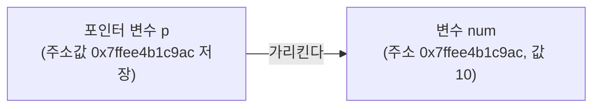

<Callout type="info">
  **이번 문서의 목표:** 포인터 변수가 저장하는 것이 정확히 무엇인지, `&`와 `*` 연산자가 각각 무슨 일을 하는지 메모리 주소 그림으로 이해하고, 배열 이름이 포인터처럼 동작하는 원리와 그 예외를 구분해 포인터·배열 혼합 문제를 정확히 풀 수 있게 된다.
</Callout>

## 왜 포인터가 필요한가

10편에서 C 함수는 인자를 **값으로 전달**하기 때문에, 함수 안에서 매개변수를 바꿔도 호출한 쪽의 원본 변수는 바뀌지 않는다는 것을 확인했습니다. 그런데 만약 함수가 호출한 쪽의 변수를 **직접 바꿔야** 한다면 어떻게 해야 할까요? 값이 아니라 그 변수가 **저장된 위치**(주소)를 넘겨주면 됩니다. 이 "메모리 주소를 저장하는 변수"가 바로 **포인터**(pointer, 포인터)입니다.

> **쉽게 말하면:** 일반 변수가 "값 자체를 담는 상자"라면, 포인터는 "다른 상자가 어디 있는지 적어 놓은 쪽지"입니다.

포인터는 독학사 C프로그래밍에서 가장 어렵게 느껴지는 동시에 **출제 비중이 가장 높은** 주제입니다. 배열, 함수 인자, 문자열, 구조체, 동적 메모리(13~17편)가 모두 포인터 개념 위에 세워져 있으므로, 이번 편에서 기초를 확실히 다져야 합니다.

## 1. 메모리 주소와 변수

컴퓨터의 메모리는 한 칸(보통 1바이트)마다 고유한 번호가 매겨진 거대한 서랍장과 같습니다. 이 번호를 **주소**(address, 주소)라고 부릅니다. 변수를 선언하면 컴퓨터는 그 자료형의 크기만큼 메모리를 확보하고, 그 확보된 공간의 시작 주소를 변수 이름과 연결합니다.

```c
int num = 10;
printf("%d\n", num);        /* num에 저장된 값 */
printf("%p\n", (void *)&num); /* num이 저장된 주소 */
```

```text
10
0x7ffee4b1c9ac
```

`%p`는 주소 값을 출력하는 서식입니다(실제 출력되는 주소 값은 실행할 때마다 달라집니다). `&`(앰퍼샌드) 연산자를 변수 앞에 붙이면 **그 변수가 저장된 메모리 주소**를 얻습니다. 이를 **주소 연산자**(address-of operator, 주소 연산자)라고 부릅니다.

| 개념 | num (일반 변수) | &num (num의 주소) |
|------|-------------------|---------------------|
| 저장하는 것 | 정수 값 10 | num이 위치한 메모리 주소(예: 0x7ffee4b1c9ac) |
| 자료형 | `int` | `int *`(int를 가리키는 포인터형) |

## 2. 포인터 변수 선언·초기화와 역참조

포인터 변수는 **다른 변수의 주소를 저장**하는 변수입니다. 선언 문법은 자료형 뒤에 `*`를 붙입니다.

```c
int num = 10;
int *p = &num;   /* p는 num의 주소를 저장하는 int형 포인터 */

printf("%d\n", num);    /* 10 */
printf("%d\n", *p);     /* 10: p가 가리키는 곳의 값 */
printf("%p\n", (void *)p);  /* num의 주소와 같은 값 */
```

```text
10
10
0x7ffee4b1c9ac
```

| 변수 | 저장하는 값 | 의미 |
|------|-------------|------|
| `num` | 10 | 정수 값 자체 |
| `p` | num의 주소 (예: 0x7ffee4b1c9ac) | num이 어디 있는지 가리키는 화살표 |
| `*p` | 10 | p가 가리키는 곳(num의 위치)에 실제로 들어 있는 값 |



`*`(에스터리스크)는 두 곳에서 다른 의미로 쓰여 헷갈리기 쉽습니다.

- **선언할 때**: `int *p;`의 `*`는 "p는 포인터 변수다"라는 **자료형의 일부**입니다.
- **선언 이후 식에서**: `*p`의 `*`는 "p가 가리키는 곳으로 가서 그 안의 값을 꺼내라"는 **역참조 연산자**(dereference operator, 역참조 연산자)입니다.

> **쉽게 말하면:** `&`는 "이 변수의 주소를 알려줘"이고, `*`(역참조)는 "이 주소에 가서 그 안의 값을 보여줘"입니다. 서로 정반대 방향으로 움직입니다.

### 포인터를 통해 원본 값 바꾸기

```c
void addOne(int *n) {
    *n = *n + 1;
}

int main(void) {
    int x = 5;
    addOne(&x);
    printf("%d\n", x);
    return 0;
}
```

```text
6
```

**해석:** 10편의 `addOne(int n)`과 달리, 이번에는 `x`의 **주소**(`&x`)를 넘겼습니다. 함수 안의 `n`은 `x`의 주소를 저장한 포인터이므로, `*n = *n + 1;`은 "`n`이 가리키는 곳(바로 `x`가 있는 자리)의 값을 1 늘려라"는 뜻입니다. 이번에는 `x` 자신의 메모리 공간을 직접 수정했으므로, 함수가 끝난 뒤에도 `x`는 6으로 바뀌어 있습니다. **자주 틀리는 점:** "포인터를 함수에 넘기면 자동으로 원본이 바뀐다"가 아니라, 함수 안에서 **역참조(`*`)로 그 주소에 실제로 접근해 값을 써야만** 원본이 바뀝니다. 포인터 자체를 그냥 읽기만 하면 원본은 바뀌지 않습니다.

## 3. 배열 이름과 포인터의 관계

11편에서 배열은 메모리에 연속으로 배치된다고 배웠습니다. 이 성질 때문에 C에서는 **배열 이름이 대부분의 상황에서 그 배열의 첫 번째 요소를 가리키는 포인터처럼 동작**합니다.

```c
int arr[3] = {10, 20, 30};
printf("%p\n", (void *)arr);       /* 배열의 시작 주소 */
printf("%p\n", (void *)&arr[0]);   /* arr[0]의 주소 */
```

```text
0x7ffee4b1c990
0x7ffee4b1c990
```

두 출력이 완전히 같습니다. 즉 `arr`이라는 이름 자체가 `&arr[0]`과 **같은 값**(주소)을 나타냅니다.

### 포인터 산술 — 주소 이동은 자료형 크기만큼

```c
int arr[3] = {10, 20, 30};
int *p = arr;   /* 배열 이름 arr을 포인터에 대입 */

printf("%d\n", *p);       /* 10 */
printf("%d\n", *(p + 1)); /* 20 */
printf("%d\n", *(p + 2)); /* 30 */
```

```text
10
20
30
```

| 식 | 의미 | 실제 주소 계산(int가 4바이트일 때) | 가리키는 값 |
|-----|------|--------------------------------------|--------------|
| `p` | arr의 시작 주소 | 예: 1000 | arr[0] = 10 |
| `p + 1` | p보다 int 한 칸(4바이트) 뒤 주소 | 1000 + 1×4 = 1004 | arr[1] = 20 |
| `p + 2` | p보다 int 두 칸(8바이트) 뒤 주소 | 1000 + 2×4 = 1008 | arr[2] = 30 |

**자주 틀리는 점:** `p + 1`은 "주소값에 숫자 1을 더한 것"이 아니라 "**p가 가리키는 자료형의 크기만큼** 다음 요소로 이동"한 것입니다. `int *`에서 `p + 1`은 실제 주소가 4(또는 컴파일러의 `int` 크기)만큼 증가하고, `double *`이었다면 8만큼 증가합니다. 이를 **포인터 산술**(pointer arithmetic, 포인터 산술)이라고 합니다. 이 규칙 덕분에 `*(p + i)`는 `arr[i]`와 **완전히 같은 값**을 가리키며, 실제로 C 컴파일러는 `arr[i]`라는 표기를 내부적으로 `*(arr + i)`로 처리합니다.

### 배열 이름과 포인터 변수의 결정적 차이

배열 이름이 포인터처럼 동작한다고 해서 배열 이름이 곧 포인터 변수인 것은 아닙니다. 결정적인 차이가 하나 있습니다.

```c
int arr[3] = {10, 20, 30};
int *p = arr;

p = p + 1;    /* 정상: 포인터 변수는 다른 주소를 다시 담을 수 있다 */
arr = arr + 1; /* 오류! 배열 이름은 상수 취급되어 재대입 불가능 */
```

**자주 틀리는 점:** `p`는 포인터 **변수**이므로 값을 계속 바꿔 다른 곳을 가리키게 할 수 있지만, `arr`은 컴파일 시점에 "이 배열이 시작하는 주소"로 고정된 **상수와 같은 성격**을 가져 `arr = arr + 1;`처럼 재대입할 수 없습니다. 배열 이름은 "포인터처럼 값을 읽을 수 있지만, 포인터처럼 다시 대입받을 수는 없는" 특수한 존재입니다. 시험에서는 이 둘을 같은 것으로 착각하게 만드는 오류 찾기 문제가 자주 나옵니다.

## 4. 포인터로 문자열 접근하기

11편에서 문자열은 널 종료 char 배열이라고 배웠습니다. 문자열은 char 배열이므로, 배열 이름-포인터 관계가 문자열에도 그대로 적용됩니다.

```c
char str[] = "Hi!";
char *p = str;

while (*p != '\0') {
    printf("%c", *p);
    p++;
}
printf("\n");
```

```text
Hi!
```

| 반복 | p가 가리키는 문자 | *p 값 | *p != '\0'? | 동작 |
|------|----------------------|--------|--------------|------|
| 1 | str[0] | `H` | 참 | 출력 후 p++ |
| 2 | str[1] | `i` | 참 | 출력 후 p++ |
| 3 | str[2] | `!` | 참 | 출력 후 p++ |
| 4 | str[3] | `\0` | 거짓 | 반복 종료 |

**해석:** `p`는 처음에 `str[0]`(문자 `H`)을 가리키다가, `p++`가 실행될 때마다 **char 한 칸(1바이트)씩** 다음 문자로 이동합니다. `*p`가 널 문자 `'\0'`이 되는 순간 조건이 거짓이 되어 반복이 멈춥니다. 이것이 바로 `strlen`, `printf`의 `%s`가 내부적으로 문자열의 끝을 찾는 방식과 같은 원리입니다.

### char 배열과 char 포인터의 차이

```c
char a[] = "Hi!";   /* 배열: 문자들을 담을 새 메모리를 직접 확보 */
char *b = "Hi!";    /* 포인터: 문자열 리터럴이 저장된 곳의 주소만 저장 */

a[0] = 'X';   /* 정상: a는 직접 확보한 메모리라 내용을 바꿀 수 있다 */
b[0] = 'X';   /* 위험: 문자열 리터럴은 읽기 전용 영역이라 수정이 정의되지 않은 동작 */
```

**자주 틀리는 점:** `char a[] = "Hi!";`는 `"Hi!"`의 내용을 **복사해 새 메모리 공간**(배열)에 담지만, `char *b = "Hi!";`는 `"Hi!"`가 프로그램의 읽기 전용 영역에 저장된 뒤 `b`가 그 **주소만** 가리킵니다. 겉모습이 비슷해 보여도, `b`가 가리키는 내용을 수정하려 하면 정의되지 않은 동작(많은 환경에서 프로그램이 비정상 종료)이 발생합니다. 반면 `a`는 자기 소유의 메모리이므로 자유롭게 내용을 바꿀 수 있습니다.

## 핵심 정리

- `&변수`는 그 변수의 메모리 주소를, `*포인터`(역참조)는 그 포인터가 가리키는 위치의 값을 얻는다.
- 포인터를 함수에 넘길 때 원본을 바꾸려면 함수 안에서 반드시 역참조로 그 주소에 값을 써야 한다.
- 배열 이름은 대부분의 상황에서 첫 요소의 주소(`&arr[0]`)와 같은 값으로 동작한다.
- 포인터에 정수를 더하면(포인터 산술) 그 자료형의 크기만큼 주소가 이동하며, `arr[i]`는 `*(arr + i)`와 같다.
- 배열 이름은 포인터처럼 읽을 수 있지만, 포인터 변수와 달리 재대입은 불가능하다.
- `char 배열 = "문자열"`은 내용을 복사해 수정 가능한 메모리를 만들지만, `char 포인터 = "문자열"`은 읽기 전용 리터럴의 주소만 가리켜 수정하면 위험하다.

## 마무리 복습

<Quiz
  questionNumber={1}
  question="다음 중 & 연산자와 * 연산자(역참조)의 관계를 옳게 설명한 것은?"
  options={['& 연산자와 * 연산자는 완전히 같은 동작을 한다', '&는 변수의 주소를 얻고, *(역참조)는 포인터가 가리키는 위치의 값을 얻는 서로 반대 방향의 연산이다', '&는 값을 얻고, *는 주소를 얻는다', '두 연산자는 포인터 선언 시에만 사용할 수 있다']}
  correctAnswer={2}
  explanation="&는 변수 앞에 붙여 그 변수의 메모리 주소를 얻는 연산자이고, *(역참조)는 포인터 앞에 붙여 그 포인터가 가리키는 위치에 저장된 값을 얻는 연산자다. 두 연산은 서로 반대 방향으로 동작한다."
  optionExplanations={['&는 주소를 얻고 *는 값을 얻는 서로 다른 동작이다', '정답. 주소를 얻는 것과 값을 얻는 것은 서로 반대 방향의 연산이다', '설명이 서로 뒤바뀌었다. &가 주소, *가 값이다', '&는 임의의 변수에, *는 포인터 변수에 대해 식에서도 자유롭게 사용할 수 있다']}
/>

<Quiz
  questionNumber={2}
  question="함수 안에서 포인터 매개변수를 통해 호출한 쪽의 원본 변수 값을 실제로 바꾸려면 무엇이 필요한가?"
  options={['포인터 매개변수를 선언만 하면 자동으로 바뀐다', '포인터 자체의 값(주소)만 출력하면 된다', '역참조 연산자(*)로 포인터가 가리키는 위치에 실제로 값을 대입해야 한다', '포인터에 다른 변수의 주소를 다시 대입하면 된다']}
  correctAnswer={3}
  explanation="포인터를 넘겨받는 것만으로는 원본이 바뀌지 않는다. 함수 안에서 *포인터 = 새값; 처럼 역참조로 그 주소에 직접 값을 써야 호출한 쪽의 원본 변수가 실제로 바뀐다."
  optionExplanations={['포인터를 매개변수로 선언한 것만으로는 아무 값도 바뀌지 않는다', '주소를 출력하는 것은 값을 읽는 행위일 뿐 원본을 바꾸지 않는다', '정답. 역참조로 그 주소에 실제로 값을 써야 원본이 바뀐다', '포인터가 다른 곳을 가리키게 바꾸는 것은 원래 가리키던 변수와 무관해지는 동작이다']}
/>

<Quiz
  questionNumber={3}
  question="int arr[3] = {10, 20, 30}; 일 때 arr과 &arr[0]의 관계로 옳은 것은?"
  options={['서로 전혀 다른 값을 나타낸다', '두 표현 모두 배열의 첫 번째 요소가 저장된 같은 주소를 나타낸다', 'arr은 주소이고 &arr[0]은 값이다', '&arr[0]은 컴파일 오류를 일으킨다']}
  correctAnswer={2}
  explanation="배열 이름 arr은 대부분의 상황에서 그 배열의 첫 번째 요소를 가리키는 주소로 동작하며, 이는 &arr[0]과 정확히 같은 값이다."
  optionExplanations={['두 표현은 정확히 같은 주소값을 나타낸다', '정답. arr과 &arr[0]은 같은 주소를 가리킨다', 'arr과 &arr[0] 둘 다 주소를 나타내는 표현이다', '&arr[0]은 정상적으로 컴파일되는 유효한 식이다']}
/>

<Quiz
  questionNumber={4}
  question="int *p = arr; (arr은 int 배열)일 때, p + 1이 실제로 이동하는 주소 거리는? (int는 4바이트로 가정)"
  options={['1바이트', '4바이트', 'arr 배열 전체의 크기만큼', '포인터 크기(플랫폼에 따라 다름)만큼']}
  correctAnswer={2}
  explanation="포인터 산술에서 p + 1은 p가 가리키는 자료형(int, 4바이트)의 크기만큼 주소를 이동시킨다. 따라서 4바이트만큼 뒤로 이동한 주소를 가리킨다."
  optionExplanations={['포인터 산술은 바이트 1을 더하는 것이 아니라 가리키는 자료형의 크기를 기준으로 이동한다', '정답. int 한 칸의 크기인 4바이트만큼 이동한다', '배열 전체 크기가 아니라 요소 하나의 크기만큼 이동한다', '포인터 변수 자체의 크기가 아니라 포인터가 가리키는 대상 자료형의 크기가 이동 거리를 결정한다']}
/>

<Quiz
  questionNumber={5}
  question="배열 이름과 포인터 변수의 차이에 대한 설명으로 옳은 것은?"
  options={['배열 이름도 포인터 변수처럼 자유롭게 다른 주소를 재대입할 수 있다', '배열 이름은 포인터처럼 값을 읽을 수 있지만, 다른 주소로 재대입할 수는 없다', '포인터 변수는 재대입이 불가능하지만 배열 이름은 가능하다', '배열 이름과 포인터 변수는 완전히 동일해 아무 차이가 없다']}
  correctAnswer={2}
  explanation="배열 이름은 그 배열이 시작하는 주소로 컴파일 시점에 고정되어, 포인터처럼 읽을 수는 있지만 arr = arr + 1;처럼 다른 값을 다시 대입할 수는 없다. 반면 포인터 변수는 다른 주소를 계속 다시 담을 수 있다."
  optionExplanations={['배열 이름은 상수처럼 취급되어 재대입이 불가능하다', '정답. 읽기는 가능하지만 재대입은 불가능한 것이 배열 이름의 특징이다', '실제로는 정반대로, 포인터 변수는 재대입이 가능하고 배열 이름은 불가능하다', '재대입 가능 여부라는 결정적인 차이가 존재한다']}
/>

<Quiz
  questionNumber={6}
  question="char a[] = 'Hi'로 배열에 문자열을 담은 경우와 char b에 문자열 리터럴의 주소만 저장한 포인터의 차이로 옳은 것은?"
  options={['두 경우 모두 내용을 자유롭게 수정할 수 있다', 'a는 직접 확보한 메모리라 내용을 수정할 수 있지만, b는 읽기 전용 리터럴을 가리켜 수정하면 위험하다', 'a는 수정할 수 없고 b는 자유롭게 수정할 수 있다', '두 선언 모두 컴파일 오류를 일으킨다']}
  correctAnswer={2}
  explanation="배열 a는 문자열 리터럴의 내용을 복사해 자신만의 메모리 공간에 저장하므로 내용을 자유롭게 바꿀 수 있다. 반면 포인터 b는 프로그램의 읽기 전용 영역에 있는 문자열 리터럴의 주소만 가리키므로, 그 내용을 수정하려 하면 정의되지 않은 동작이 발생할 수 있다."
  optionExplanations={['b가 가리키는 문자열 리터럴은 읽기 전용 영역이라 수정하면 위험하다', '정답. 배열은 자기 소유의 메모리, 포인터는 읽기 전용 리터럴의 주소만 가리킨다', '설명이 서로 뒤바뀌었다. 수정 가능한 쪽은 a다', '두 선언 모두 문법적으로 유효해 정상적으로 컴파일된다']}
/>

<Quiz
  questionNumber={7}
  question={"다음 코드처럼 반복할 때, 반복이 멈추는 시점은?\n\n```c\nchar str[] = 'Hi!';\nchar *p = str;\nwhile (*p != '\\0') {\n  p++;\n}\n```"}
  options={['p가 str의 마지막 문자(느낌표)를 가리킬 때', 'p가 널 문자(문자열의 끝 표시)를 가리킬 때', '반복문은 조건이 항상 참이라 멈추지 않는다', 'p가 str[0]으로 되돌아왔을 때']}
  correctAnswer={2}
  explanation="문자열은 널 문자로 끝나므로, p가 한 칸씩 이동하며 가리키는 문자가 널 문자가 되는 순간 조건 *p != 널문자가 거짓이 되어 반복이 종료된다. 느낌표는 문자열의 마지막 실제 글자일 뿐 반복을 멈추는 기준이 아니다."
  optionExplanations={['느낌표는 문자열의 마지막 실제 글자이며, 반복은 그 다음 칸의 널 문자에서 멈춘다', '정답. 널 문자를 만나는 순간 조건이 거짓이 되어 반복이 끝난다', '문자열은 반드시 널 문자로 끝나므로 조건은 유한한 시점에 거짓이 된다', 'p는 증가만 할 뿐 처음 위치로 되돌아가지 않는다']}
/>

## 참고 자료

- 국가평생교육진흥원 독학학위제: https://bdes.nile.or.kr
