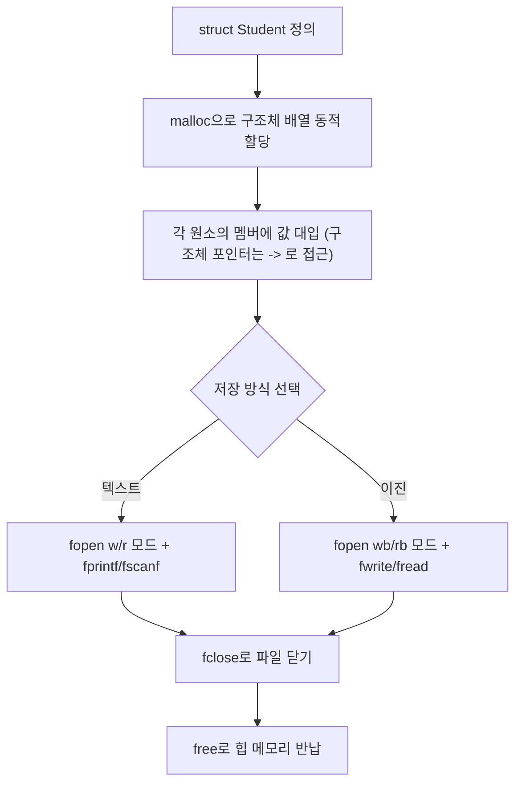

<Callout type="info">
  **이번 문서의 목표:** 이 파일을 다 읽으면 구조체(struct)를 가리키는 포인터로 멤버에 접근할 수 있고, `malloc`으로 구조체 배열을 동적으로 만들 수 있으며, 그 구조체 배열을 텍스트 파일과 이진 파일 양쪽으로 저장·복원하는 레코드(record) 처리 프로그램을 직접 손코딩할 수 있다.
</Callout>

## 왜 세 가지를 한 편에서 묶는가

14편에서 구조체를, 16편에서 파일 입출력을, 17편에서 동적 메모리를 각각 따로 배웠습니다. 그런데 독학사 시험이 실제로 좋아하는 문제 유형은 이 세 가지를 **하나의 프로그램 안에서 동시에** 쓰는 형태입니다. 예를 들어 "학생 정보를 구조체로 표현하고, 학생 수만큼 동적으로 배열을 만들어, 그 배열 전체를 파일에 저장했다가 다시 읽어 온다"는 시나리오는 회원 명부, 성적표, 재고 관리 같은 실제 프로그램의 축소판입니다. 이런 통합 문제를 풀려면 세 개념을 순서대로 연결하는 감각이 필요합니다.

> **쉽게 말하면:** 구조체는 "정보를 담는 서식(양식) 한 장", 동적 할당은 "필요한 만큼 서식 용지를 미리 뽑아 두는 것", 파일 입출력은 "그 서식 뭉치를 캐비닛(디스크)에 넣었다가 나중에 다시 꺼내는 것"입니다.

## 1. 구조체 포인터 복습과 확장

14편에서 구조체 변수의 멤버는 점(`.`) 연산자로 접근한다고 배웠습니다. 구조체를 가리키는 **포인터**를 통해 멤버에 접근할 때는 화살표(`->`) 연산자를 씁니다.

```c
struct Student {
    char name[20];
    int score;
};

struct Student s = {"Kim", 90};
struct Student *p = &s;

printf("%s\n", p->name);
printf("%d\n", p->score);
```

```text
Kim
90
```

`p->name`은 `(*p).name`을 줄여 쓴 것입니다. 먼저 `*p`로 포인터가 가리키는 구조체 전체를 얻은 뒤, 그 구조체의 `name` 멤버에 점 연산자로 접근한다는 뜻입니다. `(*p).name`에서 괄호를 빼먹고 `*p.name`이라고 쓰면, 연산자 우선순위 규칙(08편)에 따라 점(`.`) 연산자가 별표(`*`)보다 먼저 묶여 `*(p.name)`으로 해석되어 버립니다. 이는 포인터가 아닌 `p` 자체의 `name` 멤버에 접근하려는 것으로 해석되어 컴파일 오류가 납니다. 이 우선순위 함정 때문에, 아예 `->` 연산자를 표준 표기로 정해 놓은 것입니다.

| 접근 대상 | 연산자 | 예시 |
|---|---|---|
| 구조체 변수 자체 | 점(`.`) | `s.score` |
| 구조체 포인터가 가리키는 대상 | 화살표(`->`) | `p->score` |
| 점 연산자로 풀어 쓴 동치 표현 | 점 + 역참조 | `(*p).score` |

## 2. 구조체 배열을 함수 인자로 넘기기

13편에서 배운 대로, 배열은 함수 인자로 넘기면 첫 원소의 주소만 전달됩니다. 구조체 배열도 동일합니다.

```c
struct Student {
    char name[20];
    int score;
};

void printAll(struct Student *arr, int n) {
    for (int i = 0; i < n; i++) {
        printf("%s %d\n", arr[i].name, arr[i].score);
    }
}

int main(void) {
    struct Student list[2] = {{"Kim", 90}, {"Lee", 85}};
    printAll(list, 2);
    return 0;
}
```

```text
Kim 90
Lee 85
```

`printAll` 함수의 매개변수를 `struct Student *arr`로 받았지만, 함수 안에서는 `arr[i].name`처럼 배열 표기와 점 연산자를 그대로 쓸 수 있습니다. `arr`가 포인터이면서도 배열처럼 인덱싱할 수 있는 이유는 12편에서 배운 배열-포인터 관계 때문이고, `arr[i]`가 구조체 하나(`*(arr + i)`)이므로 거기에 점 연산자로 멤버 접근을 하는 것입니다.

## 3. 구조체 배열을 동적으로 만들기

학생 수를 실행 중에 입력받는다면, 17편에서 배운 `malloc`으로 구조체 배열을 만듭니다.

```c
#include <stdio.h>
#include <stdlib.h>

struct Student {
    char name[20];
    int score;
};

int main(void) {
    int n = 2;
    struct Student *list = (struct Student *)malloc(n * sizeof(struct Student));

    if (list == NULL) {
        return 1;
    }

    strcpy(list[0].name, "Kim");
    list[0].score = 90;
    strcpy(list[1].name, "Lee");
    list[1].score = 85;

    for (int i = 0; i < n; i++) {
        printf("%s %d\n", list[i].name, list[i].score);
    }

    free(list);
    return 0;
}
```

```text
Kim 90
Lee 85
```

**한 줄씩 실행 추적**

| 줄 | 실행 내용 | list가 가리키는 힙 상태 |
|---|---|---|
| `malloc(n * sizeof(struct Student))` | 구조체 2개분의 바이트를 힙에서 요청 | list → 힙의 새 블록(구조체 2칸) |
| `strcpy(list[0].name, "Kim")` | 0번째 구조체의 name 멤버에 문자열 복사 | list[0].name = "Kim" |
| `list[0].score = 90;` | 0번째 구조체의 score 멤버에 대입 | list[0].score = 90 |
| `list[1]...` (동일 패턴) | 1번째 구조체 채움 | list[1] = \{"Lee", 85\} |
| 반복문으로 출력 | 두 구조체를 순서대로 출력 | 그대로 |
| `free(list)` | 힙 블록 전체를 한 번에 반납 | 블록 회수 |

`sizeof(struct Student)`는 구조체 하나 전체의 바이트 크기입니다. 14편에서 다룬 대로 구조체 내부에는 정렬(alignment)로 인한 빈 공간(패딩, padding)이 들어갈 수 있으므로, 이 값은 항상 `sizeof`로 직접 구해야 하며 멤버 크기를 손으로 더해 어림잡으면 안 됩니다.

## 4. 텍스트 파일에 구조체 배열 저장하기

16편에서 배운 `fprintf`/`fscanf`로 구조체를 한 줄씩 텍스트로 저장할 수 있습니다.

```c
#include <stdio.h>

struct Student {
    char name[20];
    int score;
};

int main(void) {
    struct Student list[2] = {{"Kim", 90}, {"Lee", 85}};

    FILE *fp = fopen("students.txt", "w");
    if (fp == NULL) {
        return 1;
    }

    for (int i = 0; i < 2; i++) {
        fprintf(fp, "%s %d\n", list[i].name, list[i].score);
    }
    fclose(fp);

    struct Student loaded[2];
    fp = fopen("students.txt", "r");
    for (int i = 0; i < 2; i++) {
        fscanf(fp, "%s %d", loaded[i].name, &loaded[i].score);
    }
    fclose(fp);

    for (int i = 0; i < 2; i++) {
        printf("%s %d\n", loaded[i].name, loaded[i].score);
    }
    return 0;
}
```

```text
Kim 90
Lee 85
```

`students.txt` 파일의 실제 내용은 다음과 같은 텍스트입니다.

```text
Kim 90
Lee 85
```

**자주 틀리는 점**: `fscanf(fp, "%s", loaded[i].name)`에서 `loaded[i].name`은 배열이므로 이미 배열의 시작 주소를 나타내 앞에 `&`를 붙이지 않습니다. 반면 `loaded[i].score`는 `int` 멤버이므로 `&loaded[i].score`처럼 주소 연산자가 필요합니다. 이는 04편·16편에서 배운 "`scanf`류 함수는 항상 저장할 곳의 주소를 받는다"는 원칙이 구조체 멤버에도 그대로 적용되는 사례입니다. 배열 멤버와 값 멤버를 헷갈려 `&`를 실수로 넣거나 빼는 것이 이 유형의 대표적인 오답입니다.

## 5. 이진 파일로 구조체 배열 저장하기 — fwrite/fread

텍스트 파일은 사람이 읽기 편하지만, 숫자를 문자로 바꿨다가 다시 숫자로 바꾸는 변환 과정에서 느려지고, 부동소수점처럼 정확한 값 보존이 중요한 데이터에서는 손실이 생길 수 있습니다. 구조체를 메모리에 있는 그대로(바이트 단위로) 저장하는 방법이 **이진 파일**(binary file) 입출력이며, `fwrite`/`fread` 함수를 씁니다.

```c
size_t fwrite(const void *ptr, size_t size, size_t nmemb, FILE *stream);
size_t fread(void *ptr, size_t size, size_t nmemb, FILE *stream);
```

- `ptr`: 읽거나 쓸 데이터가 있는 메모리 주소.
- `size`: 원소 하나의 바이트 크기(보통 `sizeof(struct Student)`).
- `nmemb`: 원소 개수.
- `stream`: `fopen`으로 연 파일 포인터. 이진 모드로 열려면 `"wb"`(쓰기, binary), `"rb"`(읽기, binary)처럼 모드 문자열에 `b`를 붙입니다.
- 반환값: **실제로 읽거나 쓴 원소의 개수**. 요청한 `nmemb`보다 작게 반환되면 파일 끝에 도달했거나 오류가 발생한 것입니다.

```c
#include <stdio.h>

struct Student {
    char name[20];
    int score;
};

int main(void) {
    struct Student list[2] = {{"Kim", 90}, {"Lee", 85}};

    FILE *fp = fopen("students.bin", "wb");
    fwrite(list, sizeof(struct Student), 2, fp);
    fclose(fp);

    struct Student loaded[2];
    fp = fopen("students.bin", "rb");
    size_t count = fread(loaded, sizeof(struct Student), 2, fp);
    fclose(fp);

    printf("%zu\n", count);
    for (int i = 0; i < 2; i++) {
        printf("%s %d\n", loaded[i].name, loaded[i].score);
    }
    return 0;
}
```

```text
2
Kim 90
Lee 85
```

| 구분 | 텍스트 파일(fprintf/fscanf) | 이진 파일(fwrite/fread) |
|------|-----------------------------|---------------------------|
| 저장 형태 | 사람이 읽을 수 있는 문자 | 메모리 내용을 그대로 바이트로 저장 |
| 변환 과정 | 숫자 ↔ 문자 변환 필요 | 변환 없이 그대로 복사 |
| 파일 열기 모드 | `"w"`, `"r"` | `"wb"`, `"rb"` |
| 구조체 전체 저장 | 멤버별로 형식 문자열을 맞춰 따로 처리 | `fwrite`/`fread` 한 번 호출로 구조체 전체 처리 가능 |
| 사람이 텍스트 편집기로 확인 | 가능 | 불가능(깨진 문자로 보임) |

**자주 틀리는 점**: `fwrite(list, sizeof(struct Student), 2, fp)`에서 `sizeof(struct Student)`와 `2`의 순서를 바꿔 `fwrite(list, 2, sizeof(struct Student), fp)`처럼 쓰는 실수가 잦습니다. 두 값을 곱한 총 바이트 수만 맞으면 실행 결과가 우연히 같아 보일 수도 있지만, `fread`의 반환값(실제로 읽은 원소 개수)을 이용해 파일 끝을 판단하는 코드에서는 두 인자의 의미가 정확히 지켜져야 합니다. "원소 하나의 크기"와 "원소 개수"의 자리를 바꾸지 않는다고 기억해 두세요.

## 6. 통합 흐름 정리



이 흐름에서 시험이 자주 확인하는 지점은 **순서**입니다. `malloc`으로 만든 구조체 배열은 사용이 끝나면 반드시 `free`해야 하고, `fopen`으로 연 파일은 반드시 `fclose`로 닫아야 합니다. 파일을 닫지 않으면 버퍼(16편)에 남아 있던 내용이 디스크에 완전히 반영되지 않을 수 있고, 힙 메모리를 반납하지 않으면 17편에서 배운 메모리 누수로 이어집니다.

## 핵심 정리

- 구조체 포인터의 멤버 접근은 `->` 연산자를 쓰며, 이는 `(*p).멤버`를 줄여 쓴 것과 같다. `*p.멤버`처럼 괄호 없이 쓰면 연산자 우선순위 때문에 의도와 다르게 해석된다.
- 구조체 배열의 크기는 항상 `sizeof(struct 구조체이름)`으로 구하며, 손으로 멤버 크기를 더해 어림잡지 않는다.
- 텍스트 파일 저장은 `fprintf`/`fscanf`로 멤버별로 형식을 맞춰 처리하고, 이진 파일 저장은 `fwrite`/`fread`로 구조체 전체를 바이트 그대로 다룬다.
- `fwrite`/`fread`의 인자 순서는 `(데이터 주소, 원소 크기, 원소 개수, 파일 포인터)`이며, 반환값은 실제로 처리한 원소 개수다.
- `malloc`으로 할당한 구조체 배열은 `free`로, `fopen`으로 연 파일은 `fclose`로 반드시 정리한다.

## 마무리 복습

<Quiz
  questionNumber={1}
  question="구조체 포인터 p가 가리키는 구조체의 score 멤버에 접근하는 올바른 표현이 아닌 것은?"
  options={['p->score', '(*p).score', '*p.score', '두 표현 p->score와 (*p).score는 서로 동일하다']}
  correctAnswer={3}
  explanation="점 연산자가 별표보다 우선순위가 높아 *p.score는 *(p.score)로 해석되어 포인터가 아닌 p 자체의 멤버에 접근하려는 잘못된 표현이 된다."
  optionExplanations={['화살표 연산자로 올바르게 멤버에 접근하는 표현이다.', '역참조 후 점 연산자로 접근하는 올바른 동치 표현이다.', '정답. 연산자 우선순위 때문에 의도와 다르게 해석되는 잘못된 표현이다.', 'p->score와 (*p).score는 실제로 완전히 동일한 의미다.']}
/>

<Quiz
  questionNumber={2}
  question="malloc(n * sizeof(struct Student))로 구조체 배열을 할당할 때 sizeof(struct Student)를 쓰는 이유로 가장 적절한 것은?"
  options={['구조체 이름의 글자 수를 세기 위해서다.', '구조체 내부에 정렬로 인한 여백이 생길 수 있어 멤버 크기를 손으로 더한 값과 다를 수 있기 때문이다.', 'malloc은 sizeof 없이는 아예 컴파일되지 않기 때문이다.', 'struct 키워드가 붙은 타입은 무조건 4바이트로 고정되기 때문이다.']}
  correctAnswer={2}
  explanation="구조체는 정렬(alignment) 때문에 멤버 크기의 단순 합과 실제 전체 크기가 다를 수 있어, sizeof로 정확한 전체 크기를 구해야 한다."
  optionExplanations={['sizeof는 이름의 글자 수가 아니라 타입의 바이트 크기를 구한다.', '정답. 정렬로 인한 여백 때문에 sizeof로 정확한 크기를 구해야 한다.', 'sizeof 없이도 크기를 직접 숫자로 써서 컴파일할 수는 있지만 이식성이 떨어질 뿐이다.', '구조체 크기는 멤버 구성에 따라 달라지며 4바이트로 고정되지 않는다.']}
/>

<Quiz
  questionNumber={3}
  question="구조체 배열을 텍스트 파일에서 fscanf로 읽어 올 때, char 배열 멤버 name과 int 멤버 score를 읽는 방식에 대한 설명으로 옳은 것은?"
  options={['name과 score 모두 앞에 & 연산자를 붙여야 한다.', 'name은 배열이므로 & 없이 그대로 쓰고, score는 & 연산자를 붙여야 한다.', 'name과 score 모두 & 연산자를 붙이지 않는다.', 'fscanf는 구조체 멤버를 읽을 수 없으므로 fread만 사용해야 한다.']}
  correctAnswer={2}
  explanation="배열 이름은 이미 첫 원소의 주소를 나타내므로 &를 붙이지 않고, int 멤버는 값 자체를 저장하므로 주소를 얻기 위해 &를 붙여야 한다."
  optionExplanations={['배열 멤버 name에는 &를 붙이지 않아야 한다.', '정답. 배열은 & 없이, 값 멤버는 &를 붙인다.', 'int 멤버 score는 & 연산자가 필요하다.', 'fscanf로도 형식 문자열을 맞추면 멤버별로 읽어 올 수 있다.']}
/>

<Quiz
  questionNumber={4}
  question="다음 중 fwrite 함수 사용법으로 올바른 것은?"
  options={['fwrite(list, sizeof(struct Student), 2, fp);', 'fwrite(fp, list, 2, sizeof(struct Student));', 'fwrite(list, 2, fp);', 'fwrite(sizeof(struct Student), list, 2, fp);']}
  correctAnswer={1}
  explanation="fwrite의 인자 순서는 (데이터 주소, 원소 크기, 원소 개수, 파일 포인터)이므로, list, sizeof(struct Student), 2, fp 순서가 올바르다."
  optionExplanations={['정답. 데이터 주소, 원소 크기, 원소 개수, 파일 포인터 순서가 올바르다.', '파일 포인터가 첫 번째 인자로 잘못 놓였다.', '인자 개수가 부족하며 원소 크기가 빠져 있다.', '원소 크기와 데이터 주소의 순서가 뒤바뀌었다.']}
/>

<Quiz
  questionNumber={5}
  question="이진 파일(binary file) 입출력과 텍스트 파일 입출력의 차이에 대한 설명으로 옳지 않은 것은?"
  options={['이진 파일은 메모리 내용을 변환 없이 그대로 저장한다.', '텍스트 파일은 사람이 읽을 수 있는 문자로 저장되어 편집기로 열어 확인할 수 있다.', '이진 파일을 열 때는 fopen 모드 문자열에 b를 붙인다.', '이진 파일과 텍스트 파일은 저장되는 바이트 내용이 완전히 동일하다.']}
  correctAnswer={4}
  explanation="텍스트 파일은 숫자를 문자로 변환해 저장하지만 이진 파일은 메모리의 바이트를 그대로 저장하므로, 같은 데이터라도 두 방식의 실제 바이트 내용은 서로 다르다."
  optionExplanations={['옳은 설명이다. 이진 파일은 변환 없이 그대로 저장한다.', '옳은 설명이다. 텍스트 파일은 사람이 읽을 수 있다.', '옳은 설명이다. wb, rb처럼 b를 붙여 이진 모드로 연다.', '옳지 않은 설명이므로 정답이다. 두 방식은 저장되는 바이트 내용이 서로 다르다.']}
/>

<Quiz
  questionNumber={6}
  question="malloc으로 만든 구조체 배열과 fopen으로 연 파일을 프로그램 종료 전에 처리하는 방법으로 가장 적절한 것은?"
  options={['구조체 배열은 그냥 두고 파일만 fclose하면 된다.', '구조체 배열은 free로, 파일은 fclose로 각각 반납·정리해야 한다.', '파일을 fclose하면 malloc으로 할당한 메모리도 자동으로 해제된다.', '프로그램이 끝나기 전에는 free나 fclose를 호출할 필요가 없다.']}
  correctAnswer={2}
  explanation="malloc으로 할당한 힙 메모리는 free로, fopen으로 연 파일은 fclose로 각각 별도로 정리해야 하며, 한쪽을 처리한다고 다른 쪽이 자동으로 처리되지 않는다."
  optionExplanations={['free를 생략하면 메모리 누수가 발생할 수 있다.', '정답. 메모리와 파일은 각각 free와 fclose로 따로 정리한다.', 'fclose와 free는 서로 다른 자원을 다루므로 하나가 다른 하나를 대신하지 않는다.', '정리하지 않으면 메모리 누수나 파일 버퍼 미반영 문제가 생길 수 있다.']}
/>

## 참고 자료

- [cppreference - fwrite, fread](https://en.cppreference.com/w/c/io/fwrite)
- [GNU C Library Manual - I/O on Streams](https://www.gnu.org/software/libc/manual/html_node/I_002fO-on-Streams.html)
