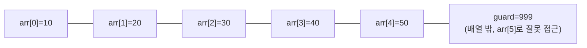
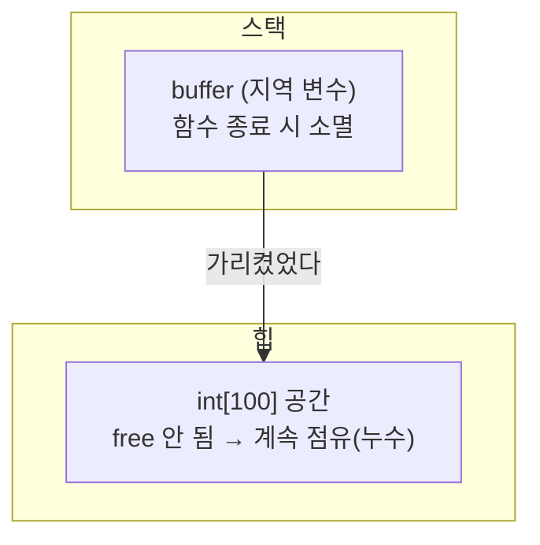

<Callout type="info">
  **이번 문서의 목표:** 컴파일 오류·런타임 오류·논리 오류를 구분하고, 시험에 자주 나오는 오류 찾기형 코드를 한 줄씩 실행 추적하며 원인을 정확히 짚어낼 수 있다.
</Callout>

## 오류를 세 갈래로 나누는 이유

### 왜 필요한가

독학사 C프로그래밍 시험에는 "다음 코드의 문제점은 무엇인가", "이 코드를 컴파일하면 어떤 일이 벌어지는가"를 묻는 오류 찾기형 문제가 꾸준히 나온다. 이런 문제를 풀려면 먼저 오류가 **언제, 어떻게 드러나는지**부터 구분해야 한다. 같은 실수라도 컴파일 시점에 걸리는지, 실행 중에야 터지는지, 아니면 프로그램은 멀쩡히 끝나지만 결과만 틀리는지에 따라 대처 방법과 시험 문항의 정답 근거가 완전히 달라지기 때문이다.

> **쉽게 말하면:** 컴파일 오류는 "문장 자체가 틀려서" 번역기(컴파일러)가 아예 통과시켜주지 않는 것이고, 런타임 오류는 "문장은 맞는데 실행 중 사고가 나는 것", 논리 오류는 "사고 없이 끝까지 실행은 되는데 답이 틀린 것"이다.

### 정의와 비교

**컴파일 오류**(compile error, compile-time error)는 소스 코드를 기계어로 번역하는 컴파일(compile) 단계에서 문법 규칙을 어겨 번역 자체가 중단되는 오류다. 6편에서 다룬 것처럼 C 소스는 전처리 → 컴파일 → 어셈블 → 링크 과정을 거쳐 실행 파일이 되는데, 컴파일 오류는 이 중 컴파일 단계를 통과하지 못해 실행 파일 자체가 만들어지지 않는다.

**런타임 오류**(runtime error, 실행 시간 오류)는 컴파일은 정상적으로 끝나 실행 파일이 만들어졌지만, 프로그램을 실제로 실행하는 도중에 운영체제나 하드웨어가 감지한 비정상 상황 때문에 프로그램이 강제로 종료되거나 예측 불가능한 동작을 보이는 오류다. 배열 경계를 벗어난 접근, 널(null) 포인터 역참조, 0으로 나누기 등이 대표적이다.

**논리 오류**(logic error)는 컴파일도 되고 실행도 끝까지 되지만, 프로그래머가 의도한 것과 다른 결과가 나오는 오류다. 컴파일러도 운영체제도 이를 "오류"로 감지하지 못하기 때문에 세 종류 중 가장 찾기 어렵다.

| 구분 | 발생 시점 | 컴파일러가 잡아주는가 | 대표 사례 |
| --- | --- | --- | --- |
| 컴파일 오류 | 컴파일 단계 | 그렇다(빌드 실패) | 세미콜론 누락, 선언 안 된 변수 사용, 괄호 짝 불일치 |
| 런타임 오류 | 실행 중 | 아니다(실행은 시작됨) | 배열 범위 초과, 널 포인터 역참조, 0으로 나누기 |
| 논리 오류 | 실행은 정상 종료 | 아니다(결과만 틀림) | 조건식 부등호 반대, 반복 횟수 하나 어긋남(off-by-one) |

<Callout type="warning">
  **자주 틀리는 점**: "실행 파일이 만들어졌다"는 사실만으로 "오류가 없다"고 단정하는 것이 가장 흔한 함정이다. 실행 파일이 생성되었어도 런타임 오류나 논리 오류가 숨어 있을 수 있다. 반대로 "프로그램이 끝까지 실행되어 아무 메시지도 없이 종료됐다"는 것도 결과가 맞다는 뜻은 아니다 — 논리 오류는 원래 조용히 틀린 값을 낸다.
</Callout>

## 선언·타입 관련 오류

### 왜 필요한가

C는 정적 타입(static type) 언어이므로, 7편에서 배운 것처럼 모든 변수는 사용 전에 자료형을 선언해야 한다. 이 규칙을 어기면 대부분 컴파일 오류로 즉시 드러나지만, 형 변환(type conversion)이 자동으로 일어나는 경우에는 컴파일은 통과하면서도 값이 예상과 다르게 잘림(truncation)이 발생해 논리 오류로 이어지기도 한다.

> **쉽게 말하면:** 선언·타입 오류는 "이 상자에 원래 담을 수 없는 걸 억지로 넣거나, 상자를 아예 준비하지 않고 쓰려는" 실수다.

### 코드로 확인하기 — 선언 누락

```c
#include <stdio.h>

int main(void) {
    total = 10 + 20;
    printf("%d\n", total);
    return 0;
}
```

이 코드는 `total`이라는 변수를 어떤 자료형으로도 선언하지 않은 채 바로 대입하고 있다. 컴파일러는 `total`이라는 이름을 어디서도 찾을 수 없으므로 "선언되지 않은 식별자(undeclared identifier)"라는 컴파일 오류를 내고 번역을 중단한다. 실행 파일 자체가 생성되지 않으므로, 이 코드는 애초에 실행되지 않는다.

**고친 코드**

```c
#include <stdio.h>

int main(void) {
    int total = 10 + 20;
    printf("%d\n", total);
    return 0;
}
```

```text
30
```

### 코드로 확인하기 — 암묵적 형 변환으로 인한 값 손실

```c
#include <stdio.h>

int main(void) {
    int score = 1000000;
    short small_score = score;
    printf("%d\n", small_score);
    return 0;
}
```

이 코드는 컴파일이 **통과**된다. `int`보다 표현 범위가 좁은 `short`(대개 16비트, 범위는 -32768부터 32767까지)에 그보다 큰 값을 대입하는 것은 문법적으로 허용되는 암묵적 형 변환(implicit conversion)이기 때문이다. 하지만 결과는 프로그래머의 의도와 다르다.

| 단계 | 내용 | 값 |
| --- | --- | --- |
| 1 | `score`에 1000000 저장 | `score = 1000000` |
| 2 | `short`는 16비트라 표현 가능한 값의 개수가 65536가지뿐 | 65536으로 나눈 나머지 개념으로 잘림 |
| 3 | 1000000을 65536으로 나눈 나머지 계산 | $1000000 \bmod 65536 = 16960$ |
| 4 | 16960은 short의 양수 최댓값(32767)보다 작으므로 그대로 양수로 해석 | `small_score = 16960` |

$$
1000000 \bmod 65536 = 16960
$$

- $\bmod$: 나머지 연산(modulo), 앞의 수를 뒤의 수로 나눈 나머지를 구한다
- $65536$: `short`(16비트)로 표현 가능한 값의 가짓수, $2^{16}$

```text
16960
```

이처럼 큰 자료형의 값을 작은 자료형에 대입하면 상위 비트가 잘려나가는 현상을 **오버플로에 의한 값 손실**이라고 부른다. 컴파일러는 이를 문법 오류로 보지 않으므로(경고만 낼 수 있다), 시험에서는 "이 코드는 컴파일 오류가 난다"는 보기가 오답으로 자주 등장한다 — 정답은 "컴파일은 되지만 의도와 다른 값이 출력된다"는 논리 오류 쪽이다.

<Callout type="warning">
  **자주 틀리는 점**: 형 변환으로 값이 잘리는 상황을 컴파일 오류라고 착각하는 경우가 많다. C 컴파일러는 암묵적 형 변환을 문법적으로 허용하므로, 값 손실은 **런타임에 계산된 결과가 틀리는 논리적 문제**이지 컴파일이 막히는 문제가 아니다.
</Callout>

## 포인터·배열 경계 오류

### 왜 필요한가

5편과 12편에서 배운 것처럼, C는 배열의 경계를 실행 중에 검사해주지 않는다. 배열 `arr[5]`가 있을 때 `arr[5]`나 `arr[-1]`에 접근해도 컴파일러도 실행 환경도 이를 막지 않는다. 이 특성이 C를 빠르게 만들지만, 동시에 시험에서 가장 즐겨 묻는 런타임 오류의 원천이기도 하다.

> **쉽게 말하면:** 배열은 정해진 칸 수만큼만 준비된 사물함인데, C는 "몇 번 칸까지 있는지" 스스로 확인해주지 않는다. 없는 칸 번호를 부르면 남의 사물함(다른 변수의 메모리)을 건드리게 된다.

### 코드로 확인하기 — 배열 경계 초과

```c
#include <stdio.h>

int main(void) {
    int arr[5] = {10, 20, 30, 40, 50};
    int guard = 999;

    for (int i = 0; i <= 5; i++) {
        printf("arr[%d] = %d\n", i, arr[i]);
    }

    printf("guard = %d\n", guard);
    return 0;
}
```

이 코드의 반복문 조건은 `i <= 5`다. `arr`는 인덱스 0부터 4까지만 유효한데, 조건이 `i < 5`가 아니라 `i <= 5`로 되어 있어 `i`가 5일 때도 반복문 몸체가 한 번 더 실행된다. 이런 실수를 **경계값 하나가 어긋난 오류**(off-by-one error)라고 부른다.

메모리에서 `arr`의 5개 칸 바로 뒤에 `guard`가 배치되어 있다고 가정하면(실제 배치는 컴파일러·환경마다 다를 수 있다), `arr[5]`에 접근하는 순간 `arr`의 몫이 아닌 `guard`의 메모리를 읽게 된다.



| i | 조건 i&nbsp;&lt;=&nbsp;5 | 접근 위치 | 결과 |
| --- | --- | --- | --- |
| 0 | 참 | arr[0] | 10 출력 |
| 1 | 참 | arr[1] | 20 출력 |
| 2 | 참 | arr[2] | 30 출력 |
| 3 | 참 | arr[3] | 40 출력 |
| 4 | 참 | arr[4] | 50 출력 |
| 5 | 참(문제!) | arr[5] | 배열 밖, 우연히 옆 메모리 값을 읽음 |
| 6 | 거짓 | - | 반복 종료 |

```text
arr[0] = 10
arr[1] = 20
arr[2] = 30
arr[3] = 40
arr[4] = 50
arr[5] = 999
guard = 999
```

이 실행 결과는 컴파일러와 메모리 배치에 따라 달라질 수 있는 **미정의 동작**(undefined behavior)이다. 위 출력은 `guard`가 `arr` 바로 뒤에 배치된 한 가지 경우를 보여준 것일 뿐, 실제 시험 문제에서는 "정확히 어떤 값이 나온다"고 단정하기보다 "배열 경계를 벗어나 어떤 값이 나올지 예측할 수 없다"는 점 자체가 정답 근거가 되는 경우가 많다.

<Callout type="warning">
  **자주 틀리는 점**: "배열 인덱스를 벗어나면 컴파일 오류가 난다"는 보기는 항상 틀렸다. C는 배열 경계를 컴파일 시점은 물론 실행 시점에도 검사하지 않으므로, 경계 초과는 **런타임에 벌어지는 미정의 동작**이지 컴파일 오류가 아니다.
</Callout>

### 코드로 확인하기 — 널 포인터 역참조

```c
#include <stdio.h>

int main(void) {
    int *p = NULL;
    printf("%d\n", *p);
    return 0;
}
```

`p`는 아무것도 가리키지 않는다는 뜻의 **널 포인터**(null pointer, 값이 0인 포인터)로 초기화되어 있다. 그런데 `*p`로 역참조(dereference, 포인터가 가리키는 곳의 값을 읽는 연산)를 시도하면, 운영체제가 "주소 0번지는 접근이 허용되지 않는 영역"이라고 판단해 프로그램을 강제로 종료시킨다(대표적으로 세그멘테이션 오류, segmentation fault). 이 역시 컴파일은 문제없이 통과되고, 실행 중에야 비정상 종료되는 런타임 오류다.

## 동적 메모리 오류: 메모리 누수와 잘못된 free

### 왜 필요한가

17편에서 배운 `malloc`/`free`는 힙(heap) 영역의 메모리를 프로그래머가 직접 관리하게 해준다. 그런데 "직접 관리한다"는 것은 "관리 실수도 프로그래머 책임"이라는 뜻이다. 자동으로 회수해주는 지역 변수와 달리, 힙 메모리는 `free`를 호출하지 않으면 프로그램이 끝날 때까지(또는 운영체제가 회수할 때까지) 계속 점유된 채로 남는다.

> **쉽게 말하면:** malloc으로 빌린 메모리는 도서관에서 빌린 책과 같다. 다 읽고 free로 반납하지 않으면 그 책은 계속 "대출 중"으로 남아 다른 사람이 못 빌린다. 반대로 이미 반납한 책을 또 반납하려 하거나, 반납한 책을 계속 읽으려 하면 사고가 난다.

### 코드로 확인하기 — 메모리 누수

```c
#include <stdio.h>
#include <stdlib.h>

void make_leak(void) {
    int *buffer = (int *)malloc(sizeof(int) * 100);
    if (buffer == NULL) {
        return;
    }
    buffer[0] = 42;
    printf("%d\n", buffer[0]);
    /* free(buffer)를 호출하지 않고 함수가 끝난다 */
}

int main(void) {
    make_leak();
    return 0;
}
```

`make_leak` 함수 안에서 `malloc`으로 힙에 `int` 100개짜리 공간을 확보한 뒤, 그 주소를 가리키는 지역 변수 `buffer`에 저장했다. 함수가 끝나면 지역 변수 `buffer`는 스택(stack)에서 사라지지만, `buffer`가 가리키던 **힙 메모리 자체는 사라지지 않는다.** `free(buffer)`를 호출하지 않았으므로, 그 100개의 `int` 공간은 아무도 가리키지 못하는 채로 계속 점유된 상태로 남는다. 이를 **메모리 누수**(memory leak)라고 한다.



```text
42
```

프로그램이 짧게 한 번 실행되고 끝난다면 메모리 누수는 눈에 띄지 않을 수 있다. 하지만 `make_leak` 같은 함수가 서버 프로그램처럼 반복해서 호출된다면, 호출할 때마다 힙 메모리가 조금씩 계속 늘어나 결국 시스템 메모리를 고갈시킬 수 있다.

### 코드로 확인하기 — 이중 해제와 댕글링 포인터

```c
#include <stdio.h>
#include <stdlib.h>

int main(void) {
    int *p = (int *)malloc(sizeof(int));
    *p = 100;
    printf("%d\n", *p);

    free(p);
    printf("%d\n", *p);  /* 이미 해제된 메모리를 다시 읽음 */
    free(p);             /* 이미 해제된 메모리를 또 해제함 */

    return 0;
}
```

`free(p)`가 호출되는 순간 `p`가 가리키던 힙 메모리는 운영체제(정확히는 메모리 할당 라이브러리)에 반납된다. 하지만 `p`라는 포인터 변수 자체의 값(주소)은 지워지지 않고 그대로 남아 있다. 이렇게 **가리키는 대상은 이미 해제되었는데 포인터 변수만 예전 주소를 그대로 들고 있는 상태**를 **댕글링 포인터**(dangling pointer, 매달린 포인터)라고 부른다.

| 시점 | p의 값 | p가 가리키는 메모리 상태 | `*p` 접근 결과 |
| --- | --- | --- | --- |
| `malloc` 직후 | 주소 A | 사용 중(내 것) | 정상 접근, 100 |
| `free(p)` 직후 | 여전히 주소 A(댕글링) | 반납됨(내 것 아님) | 미정의 동작 — 우연히 100이 남아있을 수도, 다른 값일 수도 있음 |
| 두 번째 `free(p)` | 여전히 주소 A | 이미 반납된 것을 또 반납 시도 | 이중 해제(double free), 대부분 프로그램 비정상 종료 |

댕글링 포인터를 통해 `*p`를 읽거나 쓰는 것, 그리고 같은 포인터에 `free`를 두 번 호출하는 **이중 해제**(double free)는 모두 미정의 동작이며, 컴파일 시점에는 전혀 검출되지 않는 대표적인 런타임 오류다.

<Callout type="warning">
  **자주 틀리는 점**: "free를 호출하면 포인터 변수도 자동으로 NULL이 된다"고 착각하는 경우가 많다. `free(p)`는 `p`가 가리키던 **메모리를 반납**할 뿐, `p` 자체의 값은 그대로 남는다(댕글링 포인터가 된다). 실수를 막으려면 `free(p)` 직후 `p = NULL;`을 직접 대입하는 습관이 필요하다.
</Callout>

## 제어문·함수 호출 논리 오류

### 왜 필요한가

컴파일도 되고 크래시(crash, 비정상 종료)도 없이 끝까지 실행되지만 결과가 틀린 경우가 실전 시험에서는 가장 흔하다. 9편의 제어문과 10편의 함수 호출 규칙을 정확히 알아야 이런 논리 오류를 잡아낼 수 있다.

> **쉽게 말하면:** 논리 오류는 "문법 시험은 통과했지만 산수를 잘못한" 상태다. 컴퓨터는 시키는 대로 정확히 실행했을 뿐이고, 잘못된 건 애초의 지시(코드) 자체다.

### 코드로 확인하기 — 반복 횟수 하나 어긋남

```c
#include <stdio.h>

int main(void) {
    int sum = 0;
    for (int i = 1; i < 10; i++) {
        sum += i;
    }
    printf("%d\n", sum);
    return 0;
}
```

이 코드는 "1부터 10까지의 합"을 구하려는 의도로 보이지만, 조건이 `i < 10`이라서 `i`가 10이 되는 순간 반복문을 빠져나간다. 즉 실제로 더해지는 값은 1부터 9까지다.

| i | 조건 i&nbsp;&lt;&nbsp;10 | sum(반복 전) | sum(i 더한 후) |
| --- | --- | --- | --- |
| 1 | 참 | 0 | 1 |
| 2 | 참 | 1 | 3 |
| 3 | 참 | 3 | 6 |
| 4 | 참 | 6 | 10 |
| 5 | 참 | 10 | 15 |
| 6 | 참 | 15 | 21 |
| 7 | 참 | 21 | 28 |
| 8 | 참 | 28 | 36 |
| 9 | 참 | 36 | 45 |
| 10 | 거짓 | - | 반복 종료 |

```text
45
```

$$
1+2+3+\cdots+9 = \frac{9 \times 10}{2} = 45
$$

- $\frac{9 \times 10}{2}$: 1부터 9까지 등차수열 합 공식 $\frac{n(n+1)}{2}$에 $n=9$를 대입한 값

1부터 10까지의 합(정답 55)을 원했다면 조건을 `i <= 10`으로 고쳐야 한다. 이처럼 반복 경계를 하나 잘못 잡는 실수를 **off-by-one 오류**라고 하며, 배열 인덱싱뿐 아니라 합계·개수 세기 문제에서도 시험에 자주 등장한다.

### 코드로 확인하기 — 값 전달 함수에서 원본이 안 바뀌는 착각

```c
#include <stdio.h>

void increase(int n) {
    n = n + 1;
}

int main(void) {
    int x = 5;
    increase(x);
    printf("%d\n", x);
    return 0;
}
```

10편과 13편에서 다룬 것처럼, C의 함수 인자 전달은 기본적으로 **값에 의한 전달**(call by value)이다. `increase(x)`를 호출하면 `x`의 값 5가 복사되어 매개변수 `n`에 전달될 뿐, `n`은 `x`와는 별개의 메모리 공간(스택 프레임 안의 지역 변수)이다. `increase` 함수 안에서 `n`을 아무리 바꿔도 `main`의 `x`에는 영향을 주지 않는다.

| 호출 단계 | main의 x | increase의 n |
| --- | --- | --- |
| 호출 전 | 5 | (존재하지 않음) |
| 호출 직후(값 복사) | 5 | 5 |
| `n = n + 1;` 실행 후 | 5(변화 없음) | 6 |
| 함수 종료(n 소멸) | 5 | (스택에서 제거됨) |

```text
5
```

`x`를 실제로 바꾸고 싶다면, 13편에서 배운 것처럼 `x`의 **주소**를 넘겨 포인터 매개변수로 받아야 한다.

```c
void increase(int *n) {
    *n = *n + 1;
}
/* 호출부: increase(&x); */
```

<Callout type="warning">
  **자주 틀리는 점**: "함수에 변수를 넘기면 함수 안에서 값을 바꿀 수 있다"는 전제 자체가 C에서는 기본적으로 틀렸다. 포인터(주소)를 명시적으로 넘기지 않는 한, C의 인자 전달은 항상 값 복사이며 원본은 절대 바뀌지 않는다.
</Callout>

## 핵심 정리

- 컴파일 오류는 번역 단계에서 문법을 어겨 실행 파일 자체가 만들어지지 않는 오류이고, 런타임 오류는 실행 중 비정상 상황으로 강제 종료되는 오류이며, 논리 오류는 끝까지 실행되지만 결과가 틀리는 오류다.
- 큰 자료형의 값을 작은 자료형에 대입하는 것은 컴파일 오류가 아니라, 값이 잘려 예상과 다른 결과를 내는 논리적 문제다.
- 배열 경계 초과와 널 포인터 역참조는 컴파일 시점에 전혀 검출되지 않는 대표적인 런타임 오류(미정의 동작)다.
- 메모리 누수는 malloc한 메모리를 free하지 않아 계속 점유되는 문제이고, 댕글링 포인터·이중 해제는 이미 free된 메모리를 다시 접근하거나 다시 해제하는 문제다.
- 반복 경계를 하나 잘못 잡는 off-by-one 오류와, 값에 의한 전달(call by value)을 오해해 원본이 바뀔 것으로 착각하는 것은 시험에 반복 출제되는 대표 논리 오류다.

## 마무리 복습

<Quiz
  questionNumber={1}
  question="컴파일 오류·런타임 오류·논리 오류에 대한 설명으로 옳지 않은 것은?"
  options={['컴파일 오류가 있으면 실행 파일 자체가 생성되지 않는다.', '런타임 오류는 컴파일은 통과하지만 실행 중 비정상 상황이 발생하는 오류다.', '논리 오류는 프로그램이 끝까지 실행되므로 항상 결과가 올바르다.', '배열 경계를 벗어난 접근은 컴파일 시점에 검출되지 않는 경우가 많다.']}
  correctAnswer={3}
  explanation="논리 오류는 프로그램이 끝까지 정상적으로 실행되지만, 프로그래머가 의도한 것과 다른 결과가 나오는 오류다. 끝까지 실행된다는 것과 결과가 올바르다는 것은 전혀 다른 이야기이므로 이 설명이 옳지 않다."
  optionExplanations={['컴파일 오류는 번역 자체를 중단시키므로 실행 파일이 만들어지지 않는다는 것은 옳은 설명이다.', '런타임 오류의 정의와 정확히 일치하는 옳은 설명이다.', '끝까지 실행되는 것과 결과가 맞는 것은 별개이므로 이 설명이 옳지 않아 정답이다.', 'C는 배열 경계를 컴파일 시점에 검사하지 않으므로 옳은 설명이다.']}
/>

본문 앞서 나온 `int score = 1000000;`을 `short small_score = score;`에 대입하고 `small_score`를 출력하는 코드를 다시 떠올려보자.

<Quiz
  questionNumber={2}
  question="int형 1000000을 short형 변수에 대입한 뒤 그 값을 출력하는 코드를 컴파일·실행했을 때 결과로 가장 적절한 것은?"
  options={['컴파일 오류가 발생해 실행 파일이 만들어지지 않는다.', '컴파일은 되지만 short가 표현할 수 있는 범위를 넘는 값이 잘려 1000000과 다른 값이 출력된다.', '실행 중 세그멘테이션 오류로 프로그램이 강제 종료된다.', '아무 값도 출력되지 않고 프로그램이 무한 대기한다.']}
  correctAnswer={2}
  explanation="int에서 short로의 대입은 문법적으로 허용되는 암묵적 형 변환이므로 컴파일은 정상적으로 통과한다. 다만 short가 표현할 수 있는 범위를 벗어난 값이 잘려(1000000을 65536으로 나눈 나머지인 16960) 원래 값과 다른 값이 출력된다."
  optionExplanations={['암묵적 형 변환은 문법 오류가 아니므로 컴파일은 정상적으로 통과한다.', '값이 잘려 다른 값이 출력된다는 설명이 정확하므로 정답이다.', '이 코드에는 배열이나 포인터 접근이 없어 세그멘테이션 오류가 날 이유가 없다.', '무한 루프나 대기를 유발할 코드가 없다.']}
/>

<Quiz
  questionNumber={3}
  question="malloc으로 확보한 힙 메모리를 free하지 않고 함수가 종료되었을 때 일어나는 현상은?"
  options={['해당 메모리가 자동으로 스택 영역으로 이동한다.', '해당 메모리는 아무도 가리키지 못한 채 계속 점유되는 메모리 누수가 발생한다.', '프로그램이 즉시 컴파일 오류로 종료된다.', '다음 malloc 호출 시 자동으로 재사용된다.']}
  correctAnswer={2}
  explanation="malloc으로 확보한 힙 메모리는 free를 호출하기 전까지 프로그램이 종료될 때까지 계속 점유된 상태로 남는다. 이를 가리키던 지역 포인터 변수가 함수 종료로 사라지면, 그 메모리는 더 이상 어디에서도 접근할 수 없는 채로 낭비되는데 이를 메모리 누수라고 한다."
  optionExplanations={['힙 메모리는 스택으로 자동 이동하지 않는다. 스택과 힙은 서로 다른 관리 방식을 가진 별개의 영역이다.', 'free하지 않은 힙 메모리가 계속 점유되어 낭비되는 현상이 메모리 누수의 정확한 정의이므로 정답이다.', '메모리 누수는 컴파일 단계와 무관한 실행 중 자원 관리 문제이며 컴파일 오류를 일으키지 않는다.', 'free 없이 방치된 메모리는 자동으로 재사용되지 않는다. 명시적으로 반납해야 다시 할당 가능해진다.']}
/>

<Quiz
  questionNumber={4}
  question="free(p) 호출 직후 p에 대한 설명으로 가장 적절한 것은?"
  options={['p는 자동으로 NULL로 초기화된다.', 'p가 가리키던 메모리는 반납되었지만 p 자체의 주소값은 그대로 남아 댕글링 포인터가 된다.', 'p가 가리키던 메모리 내용이 즉시 0으로 초기화되어 안전하게 재사용된다.', 'free(p)는 컴파일 오류를 일으켜 실행되지 않는다.']}
  correctAnswer={2}
  explanation="free(p)는 p가 가리키던 힙 메모리를 시스템에 반납할 뿐, p라는 포인터 변수 자체의 값(주소)은 바꾸지 않는다. 따라서 p는 이미 반납된 메모리를 여전히 가리키는 댕글링 포인터가 되며, 이를 통한 접근이나 재해제는 미정의 동작을 유발한다."
  optionExplanations={['free는 포인터 변수의 값을 자동으로 NULL로 바꿔주지 않는다. NULL 대입은 프로그래머가 직접 해야 한다.', 'p 자체의 값은 그대로 남아 이미 해제된 메모리를 계속 가리키는 댕글링 포인터가 된다는 설명이 정확하므로 정답이다.', 'free는 메모리 내용을 0으로 초기화해주지 않으며, 그 내용을 다시 읽는 것 자체가 미정의 동작이다.', 'free(p) 자체는 정상적인 라이브러리 함수 호출이므로 컴파일 오류를 일으키지 않는다.']}
/>

본문 앞서 나온, sum을 0으로 시작해 i가 1부터 9까지(반복 조건이 10 미만인 동안) 더해가는 for문 코드를 다시 떠올려보자.

<Quiz
  questionNumber={5}
  question="sum을 0으로 시작해 i가 1부터 9까지(반복 조건이 10 미만인 동안) 1씩 늘려가며 sum에 더하는 코드를 실행했을 때 출력되는 값은?"
  options={['45', '46', '55', '10']}
  correctAnswer={1}
  explanation="반복 조건이 10 미만이므로 i는 1부터 9까지만 더해진다. 1부터 9까지의 합은 등차수열 합 공식 n(n+1)/2에 n=9를 대입한 45이다."
  optionExplanations={['1부터 9까지의 합인 45가 정확한 결과이므로 정답이다.', '46은 45에서 1을 더 더한 값으로, 반복 경계를 잘못 계산했을 때 나올 수 있는 오답이다.', '55는 1부터 10까지의 합으로, 조건을 10 이하로 착각했을 때 나오는 값이다.', '10은 반복 횟수를 그대로 답한 것으로 합계 계산이 아니다.']}
/>

본문 앞서 나온, increase 함수가 매개변수 n을 1 증가시키고 main에서 x를 5로 두고 increase(x)를 호출하는 코드를 다시 떠올려보자.

<Quiz
  questionNumber={6}
  question="increase(int n) 함수가 n을 1 증가시키기만 하고, main에서 x를 5로 두고 increase(x)를 호출한 뒤 x를 출력하는 코드를 실행하면 x 값으로 옳은 것은?"
  options={['5', '6', '4', '컴파일 오류가 발생한다']}
  correctAnswer={1}
  explanation="increase 함수는 값에 의한 전달(call by value)로 x의 값 5를 복사받아 매개변수 n에 저장할 뿐이다. 함수 안에서 n을 1 증가시켜도 이는 n이라는 별개의 지역 변수에만 영향을 주므로, main의 x는 5 그대로 유지된다."
  optionExplanations={['값에 의한 전달이므로 함수 호출 후에도 x는 원래 값 5를 그대로 유지하며, 이것이 정답이다.', '함수 안에서 n이 6이 되었을 뿐 main의 x는 영향을 받지 않으므로 6은 오답이다.', '이 코드에는 x를 감소시키는 연산이 없다.', '이 코드는 문법적으로 문제가 없으며 값에 의한 전달을 정상적으로 사용한 코드이므로 컴파일 오류가 나지 않는다.']}
/>

## 참고 자료

- [ISO/IEC 9899 C 언어 표준 관련 자료 - cppreference.com Undefined Behavior](https://en.cppreference.com/w/c/language/behavior)
- [국가평생교육진흥원 독학학위제](https://bdes.nile.or.kr)
