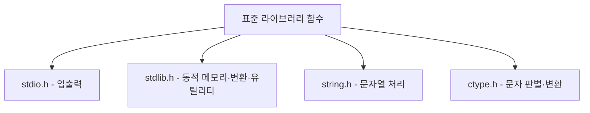

<Callout type="info">
  **이번 문서의 목표:** 이 파일을 다 읽으면 `stdio.h`, `stdlib.h`, `string.h`, `ctype.h` 네 헤더에 흩어져 있던 함수들을 "이 헤더에는 이런 일을 하는 함수들이 모여 있다"는 지도로 정리해 부를 수 있고, 처음 보는 시험 지문에 등장한 함수라도 이름과 헤더만 보고 대략 어떤 일을 하는지 추론할 수 있다.
</Callout>

## 왜 헤더별로 다시 묶어 정리하는가

지금까지 06~19편에서 배운 함수들은 각 개념(입출력, 동적 메모리, 문자열)에 필요할 때마다 하나씩 소개되었습니다. 그런데 실제 독학사 시험 지문은 "다음 중 `<string.h>`에 선언된 함수가 아닌 것은?"이나 "다음 함수 중 반환형이 `void*`인 것은?"처럼, **여러 헤더의 함수를 한 문제 안에서 섞어** 묻는 경우가 많습니다. 이런 문제에 대응하려면 함수 하나하나의 사용법뿐 아니라, "이 함수가 어느 헤더 소속이고, 어떤 성격의 함수 무리에 속하는가"까지 함께 기억해 두어야 합니다.

> **쉽게 말하면:** 지금까지는 요리법(각 편의 예제)을 하나씩 배웠다면, 이 편은 그 요리에 쓴 도구들을 부엌 서랍별로(헤더별로) 다시 정리해 "이 서랍을 열면 이런 도구들이 있다"는 지도를 만드는 과정입니다.



## 1. stdio.h — 표준 입출력

04편에서 표준 입출력의 개념(stdin, stdout)을, 16편에서 파일 입출력을 배웠습니다. 이 두 흐름에서 쓰인 함수들이 모두 `<stdio.h>`에 모여 있습니다.

| 함수 | 시그니처 | 반환값 | 다룬 편 |
|---|---|---|---|
| `printf` | `int printf(const char *format, ...);` | 출력한 문자 수(실패 시 음수) | 04 |
| `scanf` | `int scanf(const char *format, ...);` | 성공적으로 읽어 들인 항목 수 | 04 |
| `fopen` | `FILE *fopen(const char *filename, const char *mode);` | 성공 시 FILE 포인터, 실패 시 NULL | 16 |
| `fclose` | `int fclose(FILE *stream);` | 성공 시 0, 실패 시 EOF | 16 |
| `fprintf` | `int fprintf(FILE *stream, const char *format, ...);` | 출력한 문자 수 | 16, 18 |
| `fscanf` | `int fscanf(FILE *stream, const char *format, ...);` | 성공적으로 읽어 들인 항목 수 | 16, 18 |
| `fwrite` | `size_t fwrite(const void *ptr, size_t size, size_t nmemb, FILE *stream);` | 실제로 쓴 원소 개수 | 18 |
| `fread` | `size_t fread(void *ptr, size_t size, size_t nmemb, FILE *stream);` | 실제로 읽은 원소 개수 | 18 |

`printf`와 `scanf`의 반환값이 정수라는 점은 자주 간과됩니다. `printf`는 화면에 출력한 문자 개수를(오류 시 음수), `scanf`는 형식 문자열에 지정한 항목 중 몇 개를 성공적으로 읽었는지를 돌려줍니다. 예를 들어 `scanf("%d %d", &a, &b)`를 호출했는데 사용자가 숫자를 하나만 입력하고 엔터를 눌렀다면, 반환값은 1이 되어 "두 값을 모두 읽지 못했다"는 것을 코드에서 확인할 수 있습니다. 이 반환값을 `if (scanf(...) != 2) { ... }`처럼 검사하는 것이 입력 오류에 대비하는 정석입니다.

## 2. stdlib.h — 동적 메모리·변환·유틸리티

17편에서 다룬 동적 메모리 함수와, 문자열-숫자 변환 함수가 모두 `<stdlib.h>`에 있습니다.

| 함수 | 시그니처 | 반환값 | 다룬 편 |
|---|---|---|---|
| `malloc` | `void *malloc(size_t size);` | 성공 시 주소, 실패 시 NULL | 17 |
| `calloc` | `void *calloc(size_t nmemb, size_t size);` | 성공 시 0으로 초기화된 주소, 실패 시 NULL | 17 |
| `realloc` | `void *realloc(void *ptr, size_t size);` | 성공 시 (재배치될 수도 있는) 주소, 실패 시 NULL | 17 |
| `free` | `void free(void *ptr);` | 없음(void) | 17 |
| `atoi` | `int atoi(const char *str);` | 문자열을 정수로 변환한 값 | 신규 |
| `atof` | `double atof(const char *str);` | 문자열을 실수로 변환한 값 | 신규 |
| `exit` | `void exit(int status);` | 반환하지 않음(프로그램 즉시 종료) | 신규 |

`atoi`(ASCII to integer)와 `atof`(ASCII to float)는 사용자가 문자열로 입력한 값을 계산에 쓰기 위해 숫자로 바꿀 때 씁니다.

```c
#include <stdio.h>
#include <stdlib.h>

int main(void) {
    char input[] = "123";
    int n = atoi(input);
    printf("%d\n", n + 1);
    return 0;
}
```

```text
124
```

**자주 틀리는 점**: `atoi("123") + 1`을 계산하는 문제에서, `"123"`이 문자열(char 배열)이라는 것을 놓치고 `123 + 1`처럼 숫자 자체를 더한다고 착각하는 학생은 드물지만, 반대로 `atoi`가 변환에 실패했을 때(숫자로 시작하지 않는 문자열 등) **0을 반환**한다는 규칙을 모르는 경우가 많습니다. `atoi("abc")`는 0을 반환하며, 이는 "변환할 수 없다"는 오류 신호가 아니라 그냥 정상적인 반환값 0이므로, 입력값이 실제로 `"0"`이었는지 변환 실패였는지 `atoi`만으로는 구분할 수 없다는 한계가 있습니다.

`exit(int status)`는 `main` 함수의 `return`과 비슷하게 프로그램을 끝내지만, `main`이 아닌 다른 함수 안에서 호출해도 그 즉시 프로그램 전체가 종료된다는 차이가 있습니다. 관례적으로 `exit(0)`은 정상 종료, `exit(1)`처럼 0이 아닌 값은 비정상 종료를 나타냅니다.

## 3. string.h — 문자열 처리

19편에서 다룬 함수들을 포함해, `<string.h>`에는 문자열을 다루는 함수들이 모여 있습니다.

| 함수 | 시그니처 | 반환값 | 다룬 편 |
|---|---|---|---|
| `strlen` | `size_t strlen(const char *s);` | 글자 수(널 문자 제외) | 19 |
| `strcpy` | `char *strcpy(char *dest, const char *src);` | dest | 19 |
| `strncpy` | `char *strncpy(char *dest, const char *src, size_t n);` | dest | 19 |
| `strcat` | `char *strcat(char *dest, const char *src);` | dest | 19 |
| `strcmp` | `int strcmp(const char *s1, const char *s2);` | 음수/0/양수 | 19 |
| `strchr` | `char *strchr(const char *s, int c);` | 찾은 위치의 포인터, 없으면 NULL | 신규 |
| `strstr` | `char *strstr(const char *haystack, const char *needle);` | 찾은 부분 문자열의 시작 포인터, 없으면 NULL | 신규 |

`strchr`은 문자열 `s` 안에서 문자 `c`가 **처음** 나타나는 위치의 포인터를 찾고, `strstr`은 문자열 `haystack`(건초더미) 안에서 부분 문자열 `needle`(바늘)이 처음 나타나는 위치를 찾습니다. 두 함수 모두 못 찾으면 `NULL`을 반환합니다.

```c
#include <stdio.h>
#include <string.h>

int main(void) {
    char s[] = "Hello, World!";
    char *p = strchr(s, 'W');
    if (p != NULL) {
        printf("%s\n", p);
    }
    return 0;
}
```

```text
World!
```

`strchr`이 찾은 위치의 포인터를 그대로 `printf("%s", p)`에 넘기면, 그 위치부터 널 문자까지가 출력됩니다. 이는 12편에서 배운 "포인터는 배열의 특정 위치를 가리킬 수 있고, `%s`는 그 위치부터 널 문자까지 출력한다"는 원리를 그대로 활용한 것입니다.

## 4. ctype.h — 문자 판별·변환

문자 하나가 숫자인지, 알파벳인지, 대문자인지를 판별하거나 대소문자를 바꿀 때는 `<ctype.h>`의 함수를 씁니다.

| 함수 | 시그니처 | 반환값 | 용도 |
|---|---|---|---|
| `isdigit` | `int isdigit(int c);` | 참이면 0이 아닌 값, 거짓이면 0 | 숫자 문자인지 판별 |
| `isalpha` | `int isalpha(int c);` | 참이면 0이 아닌 값, 거짓이면 0 | 알파벳 문자인지 판별 |
| `isupper` | `int isupper(int c);` | 참이면 0이 아닌 값, 거짓이면 0 | 대문자인지 판별 |
| `tolower` | `int tolower(int c);` | 소문자로 바꾼 문자 코드(대문자가 아니면 그대로) | 소문자로 변환 |
| `toupper` | `int toupper(int c);` | 대문자로 바꾼 문자 코드(소문자가 아니면 그대로) | 대문자로 변환 |

이 함수들은 인자와 반환값 타입이 모두 `int`라는 점이 독특합니다. `char`가 아니라 `int`를 쓰는 이유는, 문자 코드 값의 범위를 문자 집합 전체(음수인 EOF 값까지 포함)로 넓게 다루기 위한 표준의 설계입니다. 하지만 실제로 쓸 때는 `isdigit('5')`처럼 문자 하나를 그대로 넘기면 됩니다.

```c
#include <stdio.h>
#include <ctype.h>

int main(void) {
    char c = 'a';
    if (isalpha(c)) {
        printf("%c\n", toupper(c));
    }
    return 0;
}
```

```text
A
```

**한 줄씩 실행 추적**

| 줄 | 실행 내용 | 값 |
|---|---|---|
| `char c = 'a';` | c에 문자 'a' 저장 | c = 'a' |
| `isalpha(c)` | c가 알파벳인지 판별 | 참(0이 아닌 값) |
| `toupper(c)` | c를 대문자로 변환 | 'A' |
| `printf("%c\n", ...)` | 문자 하나로 출력 | A |

## 5. 헤더별 함수 성격 요약

| 헤더 | 성격 | 대표 함수 |
|---|---|---|
| `stdio.h` | 화면·파일 입출력 | printf, scanf, fopen, fread |
| `stdlib.h` | 동적 메모리, 문자열-숫자 변환, 프로그램 종료 | malloc, free, atoi, exit |
| `string.h` | 문자열 조작·검색·비교 | strlen, strcpy, strcmp, strchr |
| `ctype.h` | 문자 하나 단위의 판별·변환 | isdigit, isalpha, toupper |

이 표를 외울 때 핵심은 "이 함수가 다루는 대상이 무엇인가"라는 기준으로 헤더를 구분하는 것입니다. `stdio.h`는 "입출력 장치·파일"을, `stdlib.h`는 "메모리와 프로그램 실행 자체"를, `string.h`는 "문자열 전체"를, `ctype.h`는 "문자 하나"를 다룬다는 감각을 잡아 두면, 처음 보는 함수 이름이 나와도 어느 헤더 소속일지 추론할 수 있습니다. 예를 들어 반환형이 `void*`이고 이름에 "메모리를 다룬다"는 느낌이 있으면 `stdlib.h` 소속일 가능성이 크고, 인자가 문자열 두 개(`const char *`)이면 `string.h` 소속일 가능성이 큽니다.

## 6. 시험 지문에서 자주 섞여 나오는 함정

| 함정 유형 | 예시 | 정답 근거 |
|---|---|---|
| 헤더 오분류 | `strlen`이 `<stdlib.h>`에 선언되어 있다고 서술 | `strlen`은 `<string.h>` 소속이다 |
| 반환형 오해 | `free`가 해제한 바이트 수를 반환한다고 서술 | `free`의 반환형은 `void`로 반환값이 없다 |
| 반환값 절댓값 오해 | `strcmp`가 항상 -1, 0, 1만 반환한다고 서술 | 표준은 부호만 보장하며 절댓값은 구현에 따라 다르다 |
| atoi 실패 처리 오해 | `atoi`가 변환 실패 시 특별한 오류 코드를 반환한다고 서술 | 변환 실패 시에도 0을 반환할 뿐 별도 오류 신호는 없다 |
| ctype 인자 타입 오해 | `isdigit`의 인자와 반환형이 모두 `char`라고 서술 | 표준 시그니처는 인자와 반환형 모두 `int`다 |

## 핵심 정리

- `stdio.h`는 화면·파일 입출력, `stdlib.h`는 동적 메모리·변환·프로그램 종료, `string.h`는 문자열 전체 조작, `ctype.h`는 문자 하나 단위의 판별·변환을 담당한다.
- `printf`와 `scanf`는 각각 출력한 문자 수와 성공적으로 읽은 항목 수를 정수로 반환하므로, 이 반환값으로 입출력 성공 여부를 검사할 수 있다.
- `atoi`는 변환 실패 시에도 0을 반환하므로, 이 값만으로는 "입력이 정말 0이었는지"와 "변환에 실패했는지"를 구분할 수 없다.
- `strchr`, `strstr`은 찾는 대상이 없으면 `NULL`을 반환하며, 찾으면 그 위치부터의 포인터를 돌려준다.
- `ctype.h`의 판별·변환 함수들은 인자와 반환형이 모두 `int`로 선언되어 있다.

## 마무리 복습

<Quiz
  questionNumber={1}
  question="다음 중 stdio.h가 아니라 stdlib.h에 선언되어 있는 함수는?"
  options={['printf', 'fopen', 'malloc', 'fscanf']}
  correctAnswer={3}
  explanation="malloc은 동적 메모리 할당 함수로 stdlib.h에 선언되어 있으며, 나머지 세 함수는 모두 stdio.h에 선언된 입출력 함수다."
  optionExplanations={['printf는 stdio.h에 선언된 표준 출력 함수다.', 'fopen은 stdio.h에 선언된 파일 열기 함수다.', '정답. malloc은 stdlib.h 소속이다.', 'fscanf는 stdio.h에 선언된 파일 입력 함수다.']}
/>

<Quiz
  questionNumber={2}
  question="scanf 함수의 반환값에 대한 설명으로 가장 적절한 것은?"
  options={['항상 0을 반환하며 성공 여부를 알 수 없다.', '형식 문자열에 지정한 항목 중 성공적으로 읽어 들인 개수를 반환한다.', '읽어 들인 바이트 수를 반환한다.', '입력이 끝나면 항상 EOF 상수만 반환한다.']}
  correctAnswer={2}
  explanation="scanf는 형식 문자열에 지정된 변환 지정자 중 몇 개를 성공적으로 읽었는지를 정수로 반환하며, 이를 이용해 입력이 예상대로 이루어졌는지 검사할 수 있다."
  optionExplanations={['scanf는 성공적으로 읽은 항목 수를 반환하며 항상 0이 아니다.', '정답. 성공적으로 읽어 들인 항목 개수를 반환한다.', '바이트 수가 아니라 항목(변환에 성공한 지정자) 개수를 반환한다.', '입력 끝에 도달하면 EOF를 반환할 수 있지만 일반적으로는 읽은 항목 수를 반환한다.']}
/>

<Quiz
  questionNumber={3}
  question="atoi(abc) 를 호출했을 때의 동작으로 옳은 것은? (abc는 숫자로 시작하지 않는 문자열이다)"
  options={['프로그램이 즉시 비정상 종료된다.', '변환할 수 없다는 특별한 오류 코드를 반환한다.', '변환에 실패한 경우에도 0을 반환하며, 이는 입력이 정말 0인 경우와 구분되지 않는다.', 'atoi는 숫자로 시작하지 않는 문자열을 인자로 받을 수 없어 컴파일 오류가 난다.']}
  correctAnswer={3}
  explanation="atoi는 변환할 수 없는 문자열을 만나면 0을 반환할 뿐 별도의 오류 코드를 제공하지 않으므로, 이 반환값만으로는 실제 입력이 0이었는지 변환 실패였는지 구분할 수 없다."
  optionExplanations={['atoi 호출 자체가 프로그램을 종료시키지 않는다.', 'atoi에는 별도의 오류 코드 반환 기능이 없다.', '정답. 변환 실패 시에도 0을 반환하여 실제 0 입력과 구분되지 않는다.', 'atoi는 런타임 함수이며 이런 입력에도 컴파일 오류를 일으키지 않는다.']}
/>

<Quiz
  questionNumber={4}
  question="strchr(s, W) 함수 호출에 대한 설명으로 가장 적절한 것은? (s는 문자열이고 W는 찾을 문자다)"
  options={['s 안에 W가 없으면 s의 시작 주소를 그대로 반환한다.', 's 안에서 W가 처음 나타나는 위치의 포인터를 반환하며, 없으면 NULL을 반환한다.', 's 안에 W가 몇 번 나타나는지 개수를 정수로 반환한다.', 'strchr은 문자가 아니라 부분 문자열을 찾는 함수다.']}
  correctAnswer={2}
  explanation="strchr은 문자열 s 안에서 문자 c가 처음 나타나는 위치의 포인터를 반환하며, 찾지 못하면 NULL을 반환한다."
  optionExplanations={['찾지 못하면 시작 주소가 아니라 NULL을 반환한다.', '정답. 처음 나타나는 위치의 포인터를 반환하며 없으면 NULL이다.', 'strchr은 개수가 아니라 위치의 포인터를 반환한다.', '부분 문자열을 찾는 함수는 strstr이고, strchr은 문자 하나를 찾는다.']}
/>

<Quiz
  questionNumber={5}
  question="isdigit, isalpha, toupper 같은 ctype.h 함수들의 인자와 반환형에 대한 설명으로 옳은 것은?"
  options={['인자와 반환형이 모두 char로 선언되어 있다.', '인자와 반환형이 모두 int로 선언되어 있다.', '인자는 char, 반환형은 int로 선언되어 있다.', '인자는 int, 반환형은 char로 선언되어 있다.']}
  correctAnswer={2}
  explanation="ctype.h의 문자 판별·변환 함수들은 문자 코드 값의 범위를 넓게 다루기 위해 인자와 반환형을 모두 int로 선언한다."
  optionExplanations={['표준 시그니처는 char가 아니라 int를 사용한다.', '정답. 인자와 반환형 모두 int로 선언되어 있다.', '인자도 int로 선언되어 있어 이 설명은 틀렸다.', '반환형도 int로 선언되어 있어 이 설명은 틀렸다.']}
/>

<Quiz
  questionNumber={6}
  question="다음 중 함수와 소속 헤더의 연결이 옳지 않은 것은?"
  options={['strcmp - string.h', 'free - stdlib.h', 'toupper - ctype.h', 'fwrite - string.h']}
  correctAnswer={4}
  explanation="fwrite는 파일 입출력을 담당하는 함수로 string.h가 아니라 stdio.h에 선언되어 있다."
  optionExplanations={['strcmp는 string.h에 선언된 문자열 비교 함수로 옳은 연결이다.', 'free는 stdlib.h에 선언된 동적 메모리 해제 함수로 옳은 연결이다.', 'toupper는 ctype.h에 선언된 문자 변환 함수로 옳은 연결이다.', '정답. fwrite는 stdio.h 소속이며 string.h가 아니다.']}
/>

<Quiz
  questionNumber={7}
  question="exit 함수에 대한 설명으로 가장 적절한 것은?"
  options={['main 함수 안에서만 호출할 수 있다.', 'main이 아닌 다른 함수 안에서 호출해도 그 즉시 프로그램 전체가 종료된다.', 'exit를 호출하면 호출한 함수로 제어가 돌아온 뒤 프로그램이 종료된다.', 'exit(0)과 exit(1)은 완전히 동일하게 정상 종료를 의미한다.']}
  correctAnswer={2}
  explanation="exit는 어느 함수에서 호출되든 그 즉시 프로그램 전체를 종료시키며, 호출한 함수로 제어가 돌아오지 않는다."
  optionExplanations={['exit는 main이 아닌 다른 함수 안에서도 호출할 수 있다.', '정답. 호출 위치와 상관없이 즉시 프로그램 전체가 종료된다.', 'exit 호출 후에는 호출한 함수로 제어가 돌아오지 않는다.', '관례적으로 exit(0)은 정상 종료, 0이 아닌 값은 비정상 종료를 나타낸다.']}
/>

## 참고 자료

- [cppreference - C Standard Library headers](https://en.cppreference.com/w/c/header)
- [GNU C Library Manual](https://www.gnu.org/software/libc/manual/)
