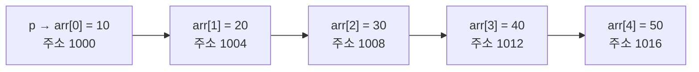

<Callout type="warning">
  **재구성 출제 고지:** 이 문제집은 국가평생교육진흥원 독학학위제 2단계 C프로그래밍 출제기준(배열·문자열, 포인터 영역)의 평가 범위와 문항 유형을 분석해 새로 구성한 **재구성 문항**입니다. 실제 기출 문항을 그대로 옮긴 것이 아닙니다. 회차별 정확한 문항 수·시험 시간은 시행처 공고를 확인해야 하며, 여기서는 22문항을 표준 분량으로 구성했습니다.
</Callout>

## 출제 범위와 문항 배분

| 영역 | 문항 수 | 문항 번호 | 관련 편 |
| --- | --- | --- | --- |
| 배열 기초와 초기화 | 3 | 1–3 | 10 |
| 문자열과 char 배열 | 4 | 4–7 | 10 |
| 포인터 기초: 주소·역참조·배열과의 관계 | 5 | 8–12 | 11 |
| 포인터와 함수: 인자 전달·스택 프레임 | 5 | 13–17 | 12, 09 |
| 문자열 라이브러리 함수 | 5 | 18–22 | 18 |

이 영역은 독학사 C프로그래밍에서 오답률이 가장 높은 부분입니다. 배열 이름과 포인터의 관계, 함수에 배열·포인터를 넘길 때 실제로 무엇이 전달되는지, 문자열의 끝을 표시하는 널 문자(널 종료 문자, `\0`)가 어디에 있는지를 눈으로 직접 추적하는 습관이 필요합니다.

## 배열 기초와 초기화 (1–3)

### 문제 1

```c
#include <stdio.h>

int main(void) {
    int arr[6] = {2, 4, 6, 8, 10, 12};
    int sum = 0;
    for (int i = 0; i < 6; i += 2) {
        sum += arr[i];
    }
    printf("%d\n", sum);
    return 0;
}
```

### 문제 2

```c
#include <stdio.h>

int main(void) {
    int arr[5] = {1, 2};
    printf("%d %d\n", arr[2], arr[4]);
    return 0;
}
```

### 문제 3

```c
#include <stdio.h>

int main(void) {
    char str[] = "Hi";
    printf("%d\n", (int)sizeof(str));
    return 0;
}
```

## 문자열과 char 배열 (4–7)

### 문제 4

```c
#include <stdio.h>
#include <string.h>

int main(void) {
    char str[10] = "Hi";
    printf("%d %d\n", (int)strlen(str), (int)sizeof(str));
    return 0;
}
```

### 문제 5

```c
#include <stdio.h>

int main(void) {
    char str[10] = "Hello";
    printf("%d\n", str[5]);
    return 0;
}
```

### 문제 6

```c
#include <stdio.h>

void printSize(char arr[]) {
    printf("%d\n", (int)sizeof(arr));
}

int main(void) {
    char str[10] = "Hello";
    printf("%d ", (int)sizeof(str));
    printSize(str);
    return 0;
}
```

(64비트 환경, 포인터 크기 8바이트 기준)

### 문제 7

```c
char a[10] = "Hello";
char b[10];
```

위 두 배열이 선언되어 있다고 할 때, 다음 네 문장 중 하나를 실행하면 컴파일 오류가 발생한다.

## 포인터 기초: 주소·역참조·배열과의 관계 (8–12)

### 문제 8

```c
#include <stdio.h>

int main(void) {
    int x = 10;
    int *p = &x;
    *p = 20;
    printf("%d %d\n", x, *p);
    return 0;
}
```

배열 이름이 포인터로 변환되는 과정과 포인터 연산의 관계는 다음 그림처럼 이해하면 편합니다. `int arr[5] = {10, 20, 30, 40, 50};`이고 `int *p = arr;`일 때, p는 arr의 첫 원소를 가리키고 `p + n`은 그로부터 int 크기만큼 n칸 이동한 주소를 뜻합니다.



int형 크기가 4바이트인 환경에서는 `p + 1`이 실제 주소로는 4바이트 뒤로 이동합니다. 포인터에 정수를 더할 때는 그 자료형의 크기만큼 주소가 이동한다는 점이 이 그림의 핵심입니다.

### 문제 9

```c
#include <stdio.h>

int main(void) {
    int arr[5] = {10, 20, 30, 40, 50};
    int *p = arr;
    printf("%d %d\n", *(p + 3), *p + 3);
    return 0;
}
```

### 문제 11

### 문제 17

```c
#include <stdio.h>

int square(int n) {
    int result = n * n;
    return result;
}

int main(void) {
    int a = 3;
    int b = square(a);
    int c = square(b);
    printf("%d\n", c);
    return 0;
}
```

함수가 호출될 때마다 새로 만들어지는 스택 프레임(stack frame)의 상태를 표로 추적하면 다음과 같습니다.

| 호출 순서 | 호출식 | 매개변수 n | 지역변수 result | 반환값 | 대입된 변수 |
| --- | --- | --- | --- | --- | --- |
| 1 | square(a) | 3 | 9 | 9 | b = 9 |
| 2 | square(b) | 9 | 81 | 81 | c = 81 |

### 문제 20

```c
#include <stdio.h>
#include <string.h>

int main(void) {
    char dest[20] = "Foo";
    strcat(dest, "Bar");
    printf("%s\n", dest);
    return 0;
}
```

### 문제 21

### 문제 22

```c
#include <stdio.h>
#include <string.h>

int main(void) {
    char dest[10];
    strncpy(dest, "HelloWorld", 5);
    dest[5] = '\0';
    printf("%s\n", dest);
    return 0;
}
```

## 확인 문제

<Quiz
  questionNumber={1}
  question={"위 코드를 실행했을 때 출력되는 값은?"}
  options={["18","42","24","30"]}
  correctAnswer={1}
  explanation={"반복문은 i가 0, 2, 4일 때만 실행되므로 arr[0]=2, arr[2]=6, arr[4]=10이 더해진다. 따라서 sum은 2+6+10=18이다."}
/>

<Quiz
  questionNumber={2}
  question={"위 코드를 실행했을 때 출력되는 값은?"}
  options={["0 0","1 2","2 0","알 수 없는 쓰레기 값이 출력된다"]}
  correctAnswer={1}
  explanation={"배열을 초기화 리스트로 선언할 때 지정한 값보다 원소 수가 많으면, 명시하지 않은 나머지 원소는 모두 0으로 초기화된다. 따라서 arr[2]와 arr[4]는 모두 0이다."}
/>

<Quiz
  questionNumber={3}
  question={"위 코드를 실행했을 때 출력되는 값은?"}
  options={["3","2","4","1"]}
  correctAnswer={1}
  explanation={"문자열 리터럴 Hi로 배열을 초기화하면 문자 H, i 두 개에 문자열의 끝을 표시하는 널 문자(널 종료 문자, NUL)가 자동으로 추가되어 배열 크기는 3바이트가 된다. sizeof는 배열 전체의 바이트 수를 반환하므로 3이 출력된다."}
/>


## 참고 자료

- [cppreference.com - C 언어 배열·포인터·문자열 레퍼런스](https://en.cppreference.com/w/c/language)
- [국가평생교육진흥원 독학학위제](https://bdes.nile.or.kr)
