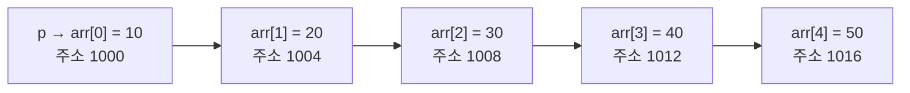

<Callout type="warning">
  **재구성 출제 고지:** 이 문제집은 국가평생교육진흥원 독학학위제 2단계 C프로그래밍 출제기준(배열·문자열, 포인터 영역)의 평가 범위와 문항 유형을 분석해 새로 구성한 **재구성 문항**입니다. 실제 기출 문항을 그대로 옮긴 것이 아닙니다. 회차별 정확한 문항 수·시험 시간은 시행처 공고를 확인해야 하며, 여기서는 22문항을 표준 분량으로 구성했습니다.
</Callout>

## 출제 범위와 문항 배분

| 영역 | 문항 수 | 문항 번호 | 관련 편 |
| --- | --- | --- | --- |
| 배열 기초와 초기화 | 3 | 1–3 | 11 |
| 문자열과 char 배열 | 4 | 4–7 | 11 |
| 포인터 기초: 주소·역참조·배열과의 관계 | 5 | 8–12 | 12 |
| 포인터와 함수: 인자 전달·스택 프레임 | 5 | 13–17 | 13, 10 |
| 문자열 라이브러리 함수 | 5 | 18–22 | 19 |

이 영역은 독학사 C프로그래밍에서 오답률이 가장 높은 부분입니다. 배열 이름과 포인터의 관계, 함수에 배열·포인터를 넘길 때 실제로 무엇이 전달되는지, 문자열의 끝을 표시하는 널 문자(널 종료 문자, `\0`)가 어디에 있는지를 눈으로 직접 추적하는 습관이 필요합니다. 각 문제마다 변수와 메모리 상태를 손으로 그려보고 정답을 확인하세요.

## 배열 기초와 초기화 (1–3)

### 문제 1

```c
#include <stdio.h>

int main(void) {
    int arr[6] = {2, 4, 6, 8, 10, 12};
    int sum = 0;
    for (int i = 0; i < 6; i += 2) {
        sum += arr[i];
    }
    printf("%d\n", sum);
    return 0;
}
```

<Quiz
  questionNumber={1}
  question="위 코드를 실행했을 때 출력되는 값은?"
  options={['18', '42', '24', '30']}
  correctAnswer={1}
  explanation="반복문은 i가 0, 2, 4일 때만 실행되므로 arr[0]=2, arr[2]=6, arr[4]=10이 더해진다. 따라서 sum은 2+6+10=18이다."
  optionExplanations={['짝수 인덱스(0, 2, 4)의 값만 정확히 더한 값이므로 정답이다.', '42는 반복문의 증가 조건을 무시하고 배열의 모든 원소(2+4+6+8+10+12)를 더했을 때 나오는 값이다.', '24는 반대로 홀수 인덱스(1, 3, 5)의 값을 더했을 때 나오는 값으로, 시작점을 잘못 잡은 오답이다.', '30은 인덱스 증가 폭이나 반복 범위를 다르게 적용했을 때 나올 수 있는 값이다.']}
/>

### 문제 2

```c
#include <stdio.h>

int main(void) {
    int arr[5] = {1, 2};
    printf("%d %d\n", arr[2], arr[4]);
    return 0;
}
```

<Quiz
  questionNumber={2}
  question="위 코드를 실행했을 때 출력되는 값은?"
  options={['0 0', '1 2', '2 0', '알 수 없는 쓰레기 값이 출력된다']}
  correctAnswer={1}
  explanation="배열을 초기화 리스트로 선언할 때 지정한 값보다 원소 수가 많으면, 명시하지 않은 나머지 원소는 모두 0으로 초기화된다. 따라서 arr[2]와 arr[4]는 모두 0이다."
  optionExplanations={['초기화 리스트에 없는 나머지 원소가 0으로 채워진다는 규칙을 정확히 반영한 정답이다.', 'arr[0]과 arr[1]에만 해당하는 값(1, 2)이며 arr[2]와 arr[4]의 값이 아니다.', '앞서 지정한 값이 반복된다고 착각한 오답으로, 명시하지 않은 원소는 이전 값을 복사하지 않는다.', '초기화 리스트를 일부만 사용해도 나머지는 쓰레기 값이 아니라 항상 0으로 초기화된다는 규칙을 놓친 오답이다.']}
/>

### 문제 3

```c
#include <stdio.h>

int main(void) {
    char str[] = "Hi";
    printf("%d\n", (int)sizeof(str));
    return 0;
}
```

<Quiz
  questionNumber={3}
  question="위 코드를 실행했을 때 출력되는 값은?"
  options={['3', '2', '4', '1']}
  correctAnswer={1}
  explanation="문자열 리터럴 Hi로 배열을 초기화하면 문자 H, i 두 개에 문자열의 끝을 표시하는 널 문자(널 종료 문자, NUL)가 자동으로 추가되어 배열 크기는 3바이트가 된다. sizeof는 배열 전체의 바이트 수를 반환하므로 3이 출력된다."
  optionExplanations={['문자 2개에 널 문자 1개를 더한 3바이트가 정확한 배열 크기이므로 정답이다.', '2는 strlen처럼 널 문자를 제외한 글자 수를 셌을 때 나오는 값이지 sizeof의 결과가 아니다.', '4는 널 문자를 두 번 더하는 등 잘못 계산했을 때 나올 수 있는 값이다.', '1은 이 배열의 크기와 무관한 값이다.']}
/>

## 문자열과 char 배열 (4–7)

### 문제 4

```c
#include <stdio.h>
#include <string.h>

int main(void) {
    char str[10] = "Hi";
    printf("%d %d\n", (int)strlen(str), (int)sizeof(str));
    return 0;
}
```

<Quiz
  questionNumber={4}
  question="위 코드를 실행했을 때 출력되는 값은?"
  options={['2 10', '10 2', '2 2', '10 10']}
  correctAnswer={1}
  explanation="strlen은 문자열의 실제 내용 길이(널 문자를 제외한 문자 개수)를 세므로 Hi는 2를 반환한다. sizeof(str)는 배열을 선언할 때 지정한 전체 크기인 10을 그대로 반환하며, 배열에 실제로 몇 글자가 들어 있는지와 무관하다."
  optionExplanations={['strlen은 실제 문자 수(2), sizeof는 선언된 배열 전체 크기(10)를 각각 정확히 반영한 정답이다.', '두 함수의 값이 서로 바뀐 오답이다.', 'strlen과 sizeof가 항상 같은 값을 반환한다고 착각한 오답이다.', '두 함수 모두 배열의 선언 크기만 반환한다고 착각한 오답이다.']}
/>

### 문제 5

```c
#include <stdio.h>

int main(void) {
    char str[10] = "Hello";
    printf("%d\n", str[5]);
    return 0;
}
```

<Quiz
  questionNumber={5}
  question="위 코드를 실행했을 때 출력되는 값은?"
  options={['0', '5', '72', '오류가 발생한다']}
  correctAnswer={1}
  explanation="Hello는 H, e, l, l, o 다섯 글자이며, str[5] 위치에는 문자열의 끝을 나타내는 널 문자(NUL)가 자동으로 채워진다. 널 문자의 아스키(ASCII) 코드 값은 0이므로, 정수로 출력하면 0이 나온다."
  optionExplanations={['문자열 끝에 자동으로 채워지는 널 문자의 아스키 코드 값이 0이므로 정답이다.', '5는 문자열의 길이일 뿐 str[5] 위치에 저장된 값이 아니다.', '72는 대문자 H의 아스키 코드 값으로, str[5]와는 무관하다.', '문자 배열의 크기(10)가 문자열 길이(5)보다 커서 str[5]는 배열 범위 안의 유효한 접근이므로 오류가 발생하지 않는다.']}
/>

### 문제 6

```c
#include <stdio.h>

void printSize(char arr[]) {
    printf("%d\n", (int)sizeof(arr));
}

int main(void) {
    char str[10] = "Hello";
    printf("%d ", (int)sizeof(str));
    printSize(str);
    return 0;
}
```

(64비트 환경, 포인터 크기 8바이트 기준)

<Quiz
  questionNumber={6}
  question="64비트 환경(포인터 크기 8바이트)에서 위 코드를 실행했을 때 출력되는 값은?"
  options={['10 8', '10 10', '8 8', '5 5']}
  correctAnswer={1}
  explanation="main 함수 안의 str은 실제 배열이므로 sizeof(str)은 선언된 크기인 10을 그대로 반환한다. 하지만 배열을 함수의 매개변수로 선언하면 컴파일러는 이를 배열의 첫 원소를 가리키는 포인터로 취급(배열의 포인터 붕괴, decay)한다. 따라서 printSize 함수 안의 arr은 실제로는 포인터이므로, sizeof(arr)은 배열 전체 크기가 아니라 포인터 하나의 크기인 8을 반환한다."
  optionExplanations={['main에서는 배열 전체 크기(10), 함수 안에서는 배열이 포인터로 붕괴되어 포인터 크기(8)가 나온다는 것을 정확히 반영한 정답이다.', '함수 매개변수로 넘어간 배열도 원래 배열 크기를 그대로 유지한다고 착각한 오답이다.', 'main에서도 배열이 포인터처럼 취급된다고 착각한 오답이다.', '두 값 모두 문자열의 실제 글자 수(strlen 결과)와 혼동한 오답이다.']}
/>

### 문제 7

```c
char a[10] = "Hello";
char b[10];
```

위 두 배열이 선언되어 있다고 할 때, 다음 네 문장 중 하나를 실행하면 컴파일 오류가 발생한다.

<Quiz
  questionNumber={7}
  question="다음 중 컴파일 오류가 발생하는 코드로 옳은 것은?"
  options={['strcpy(b, a);', 'b = a;', 'printf("%s", a);', 'int len = strlen(a);']}
  correctAnswer={2}
  explanation="배열은 포인터와 달리 이름 자체가 상수처럼 취급되어(수정할 수 없는 값, non-modifiable lvalue) 다른 배열을 통째로 대입할 수 없다. b = a;처럼 배열끼리 직접 대입 연산자를 사용하려고 하면 컴파일 오류가 발생하며, 배열 내용을 복사하려면 반드시 strcpy 같은 함수를 사용해야 한다."
  optionExplanations={['strcpy 함수를 이용한 문자열 복사는 올바른 문법이다.', '배열 이름은 수정할 수 없는 값이므로 배열끼리 대입 연산자를 사용할 수 없어 컴파일 오류가 발생한다. 이것이 정답이다.', '형식 지정자로 문자 배열을 출력하는 것은 올바른 문법이다.', 'strlen으로 문자열 길이를 구하는 것은 올바른 문법이다.']}
/>

## 포인터 기초: 주소·역참조·배열과의 관계 (8–12)

### 문제 8

```c
#include <stdio.h>

int main(void) {
    int x = 10;
    int *p = &x;
    *p = 20;
    printf("%d %d\n", x, *p);
    return 0;
}
```

<Quiz
  questionNumber={8}
  question="위 코드를 실행했을 때 출력되는 값은?"
  options={['20 20', '10 20', '20 10', '10 10']}
  correctAnswer={1}
  explanation="p는 x의 주소를 저장하는 포인터이므로 *p는 x가 저장된 메모리를 가리킨다. *p = 20;은 그 메모리에 20을 저장하는 것과 같아서 x 자체의 값도 20으로 바뀐다. 따라서 x와 *p 모두 20이 출력된다."
  optionExplanations={['p가 x의 주소를 가리키므로 *p=20이 x의 값도 바꾼다는 것을 정확히 반영한 정답이다.', 'x는 바뀌지 않고 *p만 20이 되었다고 착각한 오답이다. p가 x를 가리키므로 두 값은 항상 같다.', '*p는 원래 값 10 그대로이고 x만 20으로 바뀌었다고 착각한 오답으로, 포인터와 변수의 관계를 반대로 이해했다.', '*p = 20; 대입이 아예 반영되지 않았다고 본 오답이다.']}
/>

배열 이름이 포인터로 변환되는 과정과 포인터 연산의 관계는 다음 그림처럼 이해하면 편합니다. `int arr[5] = {10, 20, 30, 40, 50};`이고 `int *p = arr;`일 때, p는 arr의 첫 원소를 가리키고 `p + n`은 그로부터 int 크기만큼 n칸 이동한 주소를 뜻합니다.



int형 크기가 4바이트인 환경에서는 `p + 1`이 실제 주소로는 4바이트 뒤로 이동합니다. 포인터에 정수를 더할 때는 그 자료형의 크기만큼 주소가 이동한다는 점이 이 그림의 핵심입니다.

### 문제 9

```c
#include <stdio.h>

int main(void) {
    int arr[5] = {10, 20, 30, 40, 50};
    int *p = arr;
    printf("%d %d\n", *(p + 3), *p + 3);
    return 0;
}
```

<Quiz
  questionNumber={9}
  question="위 코드를 실행했을 때 출력되는 값은?"
  options={['40 13', '13 40', '43 40', '40 43']}
  correctAnswer={1}
  explanation="배열 이름 arr은 첫 원소를 가리키는 포인터로 자동 변환되어 p에 저장된다. *(p + 3)은 p가 가리키는 주소에서 int 세 칸 뒤로 이동한 위치를 역참조하는 것으로 arr[3]과 완전히 같은 의미이며 값은 40이다. 반면 *p + 3은 연산자 우선순위상 역참조(*)가 덧셈보다 먼저 적용되어 *p, 즉 arr[0]인 10을 먼저 구한 뒤 3을 더하므로 13이 된다."
  optionExplanations={['*(p+3)=arr[3]=40, *p+3=arr[0]+3=13이라는 계산을 정확히 구분한 정답이다.', '두 값의 계산 순서를 서로 바꾼 오답이다.', '*(p+3)의 결과에 실수로 3을 더한 오답이다.', '*p+3의 결과를 *(p+3)의 결과에 3을 더한 값으로 잘못 계산한 오답이다.']}
/>

### 문제 10

```c
#include <stdio.h>

int main(void) {
    int x = 5;
    int *p = &x;
    int **pp = &p;
    **pp = 100;
    printf("%d\n", x);
    return 0;
}
```

<Quiz
  questionNumber={10}
  question="위 코드를 실행했을 때 출력되는 값은?"
  options={['100', '5', '0', '컴파일 오류가 발생한다']}
  correctAnswer={1}
  explanation="pp는 p의 주소를 저장하는 이중 포인터(포인터를 가리키는 포인터)다. *pp는 p, 즉 x의 주소를 의미하고, **pp는 그 주소를 다시 역참조해 x 자체를 가리킨다. 따라서 **pp = 100;은 x에 직접 100을 대입하는 것과 같다."
  optionExplanations={['**pp가 x를 가리키므로 x가 100으로 바뀐다는 것을 정확히 반영한 정답이다.', '이중 포인터를 통한 대입이 원본 변수에 반영되지 않는다고 착각한 오답이다.', 'x가 초기화되지 않았다고 착각한 오답으로, int x = 5;에서 이미 초기화되었다.', '이중 포인터 선언과 역참조는 C에서 유효한 문법이므로 컴파일 오류가 아니다.']}
/>

### 문제 11

<Quiz
  questionNumber={11}
  question="int arr[5]와 int *p가 이미 선언되어 있다고 할 때, 다음 중 컴파일 오류가 발생하는 코드로 옳은 것은?"
  options={['p = arr;', 'arr[2] = 5;', 'arr = p;', 'p = arr + 2;']}
  correctAnswer={3}
  explanation="배열 이름 arr은 그 배열의 시작 주소를 나타내는 값으로 취급되지만, 포인터 변수처럼 다른 주소를 다시 대입할 수 있는 저장 공간이 아니다. 즉 arr은 수정할 수 없는 값(non-modifiable lvalue)이므로 arr = p;처럼 배열 이름에 새로운 주소를 대입하려고 하면 컴파일 오류가 발생한다."
  optionExplanations={['p는 일반 포인터 변수이므로 배열의 주소를 대입받을 수 있어 올바른 문법이다.', '배열의 특정 인덱스에 값을 대입하는 것은 정상적인 문법이다.', 'arr은 상수처럼 취급되어 새로운 주소를 대입할 수 없으므로 컴파일 오류가 발생한다. 이것이 정답이다.', '포인터 변수에 배열의 주소에 정수를 더한 값을 대입하는 것은 정상적인 포인터 연산이다.']}
/>

### 문제 12

<Quiz
  questionNumber={12}
  question="다음 중 정의되지 않은 동작(undefined behavior)을 일으킬 가능성이 가장 큰 것은?"
  options={['초기화하지 않은 포인터 변수를 선언한 직후 곧바로 역참조해 값을 읽는다', '어떤 변수의 주소를 담은 포인터를 역참조해 그 변수의 값을 읽는다', '배열의 유효한 인덱스 범위 안에서 원소에 접근한다', '유효한 주소를 가리키는 포인터를 통해 새로운 값을 대입한다']}
  correctAnswer={1}
  explanation="포인터를 선언만 하고 초기화하지 않으면 그 포인터는 어떤 유효한 메모리 주소를 가리키는지 전혀 보장할 수 없는 쓰레기 값을 담고 있다. 이런 포인터를 역참조하면 프로그램이 접근해서는 안 되는 메모리를 건드리게 되어 충돌이나 예측할 수 없는 동작으로 이어질 수 있다."
  optionExplanations={['초기화하지 않은 포인터는 어떤 주소를 가리키는지 알 수 없으므로 역참조 시 정의되지 않은 동작을 일으킬 가능성이 가장 크다. 이것이 정답이다.', '유효한 변수의 주소를 담은 포인터를 역참조하는 것은 안전한 정상적인 사용법이다.', '배열의 유효 범위 안에서 접근하는 것은 안전한 정상적인 사용법이다.', '유효한 주소에 값을 대입하는 것은 안전한 정상적인 사용법이다.']}
/>

## 포인터와 함수: 인자 전달·스택 프레임 (13–17)

### 문제 13

```c
#include <stdio.h>

void swap(int *a, int *b) {
    int temp = *a;
    *a = *b;
    *b = temp;
}

int main(void) {
    int x = 1, y = 2;
    swap(&x, &y);
    printf("%d %d\n", x, y);
    return 0;
}
```

<Quiz
  questionNumber={13}
  question="위 코드를 실행했을 때 출력되는 값은?"
  options={['2 1', '1 2', '1 1', '2 2']}
  correctAnswer={1}
  explanation="swap 함수는 x와 y의 주소를 매개변수로 받아, 그 주소가 가리키는 실제 메모리의 값을 서로 맞바꾼다. a와 b는 각각 x와 y를 가리키는 포인터이므로, *a와 *b를 통한 값 교환은 main의 x, y에도 그대로 반영된다. 따라서 x는 2, y는 1이 된다."
  optionExplanations={['포인터를 통해 실제 값이 교환되어 x=2, y=1이 되는 것이 정확한 결과이므로 정답이다.', '교환이 전혀 일어나지 않았다고 본 오답이다. 포인터로 전달했기 때문에 값에 의한 전달과 달리 실제 값이 바뀐다.', 'x만 바뀌고 y는 바뀌지 않았다고 착각한 오답이다.', 'y만 바뀌고 x는 바뀌지 않았다고 착각한 오답이다.']}
/>

### 문제 14

```c
#include <stdio.h>

void addOne(int arr[], int size) {
    for (int i = 0; i < size; i++) {
        arr[i] += 1;
    }
}

int main(void) {
    int nums[3] = {1, 2, 3};
    addOne(nums, 3);
    printf("%d %d %d\n", nums[0], nums[1], nums[2]);
    return 0;
}
```

<Quiz
  questionNumber={14}
  question="위 코드를 실행했을 때 출력되는 값은?"
  options={['2 3 4', '1 2 3', '3 4 5', '0 1 2']}
  correctAnswer={1}
  explanation="배열을 함수 인자로 넘기면 배열 전체가 복사되는 것이 아니라 첫 원소의 주소(포인터)가 전달된다. 따라서 addOne 함수 안에서 arr[i]를 수정하면 main의 nums 배열과 동일한 메모리를 수정하는 것이므로, 함수 호출이 끝난 뒤에도 변경 사항이 그대로 유지된다."
  optionExplanations={['배열이 주소로 전달되어 원본 배열의 각 원소에 1씩 더해진 결과이므로 정답이다.', '함수 호출이 원본 배열에 영향을 주지 않는다고 착각한 오답이다. 배열은 값 전달이 아니라 주소 전달과 같은 효과를 낸다.', '1을 두 번 더했을 때 나올 수 있는 값이다.', '더하기 대신 빼기를 적용했을 때 나올 수 있는 값이다.']}
/>

### 문제 15

<Quiz
  questionNumber={15}
  question="다음 중 포인터가 가리키는 대상의 값은 바꿀 수 있지만, 포인터 자신이 다른 주소를 가리키도록 다시 대입할 수는 없는 선언은?"
  options={['const int *p;', 'int * const p;', 'const int * const p;', 'int *p;']}
  correctAnswer={2}
  explanation="const의 위치가 핵심이다. int * const p;는 포인터 p 자신이 상수(const)이므로 다른 주소로 재대입할 수 없지만, p가 가리키는 int 값은 자유롭게 바꿀 수 있다. 반대로 const int *p;는 포인터가 가리키는 대상이 상수라 그 값은 바꿀 수 없지만, p 자신은 다른 주소를 가리키도록 재대입할 수 있다."
  optionExplanations={['가리키는 대상이 const이므로 값은 바꿀 수 없고, 포인터 자신은 재대입할 수 있어 문제의 조건과 반대다.', '포인터 자신이 const이므로 재대입은 불가능하지만 가리키는 값은 바꿀 수 있어 문제의 조건과 정확히 일치한다. 이것이 정답이다.', '가리키는 대상과 포인터 자신이 모두 const라서 값도 재대입도 둘 다 불가능하다.', '아무 제약이 없는 일반 포인터로, 값도 바꿀 수 있고 재대입도 가능해 문제의 조건과 다르다.']}
/>

### 문제 16

```c
int *createDangling(void) {
    int local = 10;
    return &local;
}
```

<Quiz
  questionNumber={16}
  question="위 함수에 대한 설명으로 가장 적절한 것은?"
  options={['지역 변수 local의 주소를 반환하지만, 함수가 끝나면 그 메모리 공간은 더 이상 유효하지 않아 위험한 코드다', '지역 변수를 반환했으므로 항상 안전하게 10이라는 값을 사용할 수 있다', '이 코드는 반드시 컴파일 오류를 일으켜 실행 파일이 만들어지지 않는다', 'local을 static으로 선언하지 않아도 함수가 끝난 뒤에도 값이 계속 유지된다']}
  correctAnswer={1}
  explanation="local은 함수 안에서 선언된 지역 변수이므로 스택(stack) 영역에 저장되며, 함수 실행이 끝나면 그 메모리 공간은 더 이상 유효한 것으로 보장되지 않는다. 이 함수는 이미 해제된 스택 공간의 주소를 반환하는 것이므로, 이렇게 반환된 포인터를 역참조하면 예측할 수 없는 값을 읽거나 프로그램이 비정상 종료될 수 있는 댕글링 포인터(dangling pointer) 문제가 발생한다."
  optionExplanations={['지역 변수의 메모리가 함수 종료 후 더 이상 유효하지 않다는 것을 정확히 설명한 정답이다.', '함수가 끝나면 그 메모리가 재사용될 수 있어 항상 안전하다고 볼 수 없다.', '문법적으로는 포인터를 반환하는 정상적인 함수이므로 컴파일 오류가 아니다.', 'static으로 선언하지 않은 지역 변수는 함수 종료와 함께 수명이 끝난다.']}
/>

### 문제 17

```c
#include <stdio.h>

int square(int n) {
    int result = n * n;
    return result;
}

int main(void) {
    int a = 3;
    int b = square(a);
    int c = square(b);
    printf("%d\n", c);
    return 0;
}
```

함수가 호출될 때마다 새로 만들어지는 스택 프레임(stack frame)의 상태를 표로 추적하면 다음과 같습니다.

| 호출 순서 | 호출식 | 매개변수 n | 지역변수 result | 반환값 | 대입된 변수 |
| --- | --- | --- | --- | --- | --- |
| 1 | square(a) | 3 | 9 | 9 | b = 9 |
| 2 | square(b) | 9 | 81 | 81 | c = 81 |

<Quiz
  questionNumber={17}
  question="위 코드를 실행했을 때 출력되는 값은?"
  options={['81', '9', '729', '18']}
  correctAnswer={1}
  explanation="square 함수는 호출될 때마다 새로운 스택 프레임이 생성되어, 그 호출에서만 유효한 매개변수 n과 지역변수 result를 갖는다. 첫 번째 호출 square(a)는 n=3으로 시작해 result=9를 반환하고 b에 대입된다. 두 번째 호출 square(b)는 n=9로 시작해 result=81을 반환하고 c에 대입되어, 최종적으로 c인 81이 출력된다."
  optionExplanations={['두 번째 호출에서 9의 제곱인 81이 반환되어 c에 저장된 값이므로 정답이다.', '9는 첫 번째 호출의 반환값(b)일 뿐 최종 출력값이 아니다.', '한 번 더 제곱을 적용했다고 착각했을 때 나올 수 있는 값이다.', '9를 두 번 더한 값으로, 제곱 대신 곱셈이 아닌 덧셈을 적용했을 때 나올 수 있는 값이다.']}
/>

## 문자열 라이브러리 함수 (18–22)

### 문제 18

<Quiz
  questionNumber={18}
  question="char dest[5];가 선언되어 있다고 할 때, 다음 중 버퍼 오버플로(buffer overflow) 위험이 있는 코드로 가장 적절한 것은?"
  options={['strcpy(dest, "Hi");', 'strcpy(dest, "Hello");', 'strcpy(dest, "");', 'strcpy(dest, "OK");']}
  correctAnswer={2}
  explanation="dest는 5바이트 크기의 배열이다. 문자열 Hello는 H, e, l, l, o 다섯 글자에 문자열의 끝을 표시하는 널 종료 문자(NUL)까지 더해 총 6바이트가 필요하다. 이는 dest의 크기 5바이트를 초과하므로, strcpy는 그 초과분을 dest 뒤의 다른 메모리 영역에 덮어써 버퍼 오버플로를 일으킬 수 있다."
  optionExplanations={['Hi는 널 문자를 포함해 3바이트만 필요해 5바이트 배열에 안전하게 들어간다.', 'Hello는 널 문자를 포함해 6바이트가 필요한데 dest는 5바이트뿐이라 버퍼 오버플로가 발생할 수 있다. 이것이 정답이다.', '빈 문자열은 널 문자 1바이트만 필요해 안전하다.', 'OK는 널 문자를 포함해 3바이트만 필요해 5바이트 배열에 안전하게 들어간다.']}
/>

### 문제 19

```c
#include <stdio.h>
#include <string.h>

int main(void) {
    char a[] = "apple";
    char b[] = "applesauce";
    printf("%d\n", strncmp(a, b, 5));
    return 0;
}
```

<Quiz
  questionNumber={19}
  question="위 코드를 실행했을 때 strncmp가 반환하는 값에 대한 설명으로 가장 적절한 것은?"
  options={['0을 반환한다', '양수 값을 반환한다', '음수 값을 반환한다', '컴파일 오류가 발생한다']}
  correctAnswer={1}
  explanation="strncmp는 두 문자열의 앞에서부터 최대 n개의 문자만 비교한다. a의 전체 apple(5글자)과 b의 앞 5글자 apple은 완전히 같으므로, 5글자까지만 비교하는 strncmp(a, b, 5)는 두 문자열이 같다고 판단해 0을 반환한다. b의 나머지 부분인 sauce는 비교 대상에 포함되지 않는다."
  optionExplanations={['앞 5글자가 완전히 같으므로 strncmp가 0을 반환하는 것이 정답이다.', 'b가 a보다 길다고 해서 양수를 반환하는 것은 아니다. 비교 범위가 5글자로 제한되어 있다.', '비교된 5글자 범위 안에서는 두 문자열에 차이가 없으므로 음수가 나올 이유가 없다.', 'strncmp는 표준 문자열 함수이므로 이 호출은 정상적으로 컴파일된다.']}
/>

### 문제 20

```c
#include <stdio.h>
#include <string.h>

int main(void) {
    char dest[20] = "Foo";
    strcat(dest, "Bar");
    printf("%s\n", dest);
    return 0;
}
```

<Quiz
  questionNumber={20}
  question="위 코드를 실행했을 때 출력되는 값은?"
  options={['FooBar', 'Foo Bar', 'BarFoo', 'Foo']}
  correctAnswer={1}
  explanation="strcat은 dest 문자열의 끝, 즉 널 종료 문자가 있던 위치부터 두 번째 인자의 내용을 이어 붙인다. Foo의 널 문자 위치에서부터 Bar를 이어 붙이면 FooBar가 되고, 그 뒤에 새로운 널 문자가 추가된다."
  optionExplanations={['Foo 뒤에 Bar가 공백 없이 그대로 이어 붙는 것이 strcat의 정확한 동작이므로 정답이다.', 'strcat은 두 문자열 사이에 공백을 자동으로 넣어주지 않는다.', 'strcat은 두 번째 인자를 첫 번째 인자 뒤에 붙이는 것이지 앞에 붙이는 것이 아니다.', '이어 붙이기가 실행되지 않았다고 본 오답이다. strcat 호출 이후 dest의 내용은 실제로 바뀐다.']}
/>

### 문제 21

<Quiz
  questionNumber={21}
  question="strcmp 함수의 반환값에 대한 설명으로 옳지 않은 것은?"
  options={['두 문자열의 내용이 완전히 같으면 정확히 0을 반환한다', 'C 표준은 반환값의 부호(양수, 음수, 0)만 보장하고, 정확한 크기는 구현에 따라 다를 수 있다', '첫 번째 문자열이 사전순으로 두 번째 문자열보다 앞서면 항상 -1을 반환한다고 표준에 정해져 있다', '첫 번째 문자열이 사전순으로 두 번째 문자열보다 뒤서면 0보다 큰 값을 반환한다']}
  correctAnswer={3}
  explanation="문자열이 같으면 0을 반환한다는 것, 표준이 반환값의 정확한 크기가 아니라 부호만 보장한다는 것, 뒤서는 경우 양수를 반환한다는 것은 모두 옳다. 문제는 3번이다. C 표준은 앞서는 경우 0보다 작은 값을 반환한다고만 규정할 뿐, 그 값이 항상 -1이라고 정하지 않는다. 실제 반환값은 비교한 문자의 아스키 코드 차이 등 구현에 따라 다른 음수 값이 나올 수 있다."
  optionExplanations={['같은 문자열을 비교하면 0을 반환한다는 것은 정확한 설명이다.', '표준이 부호만 보장한다는 것은 정확한 설명이다.', '표준은 부호만 보장할 뿐 반환값이 항상 -1이라고 정하지 않으므로, 이 설명은 옳지 않다. 이것이 정답이다.', '뒤서는 경우 양수를 반환한다는 것은 정확한 설명이다.']}
/>

### 문제 22

```c
#include <stdio.h>
#include <string.h>

int main(void) {
    char dest[10];
    strncpy(dest, "HelloWorld", 5);
    dest[5] = '\0';
    printf("%s\n", dest);
    return 0;
}
```

<Quiz
  questionNumber={22}
  question="위 코드를 실행했을 때 출력되는 값은?"
  options={['Hello', 'HelloWorld', 'Hell', '알 수 없는 값이 출력된다']}
  correctAnswer={1}
  explanation="strncpy(dest, HelloWorld, 5)는 원본 문자열의 앞 5글자인 Hello만 dest에 복사한다. 다만 strncpy는 복사한 문자 수가 지정한 n(5)과 같을 때 널 종료 문자를 자동으로 추가하지 않는다는 특징이 있어, 이 코드에서는 다음 줄인 dest[5] = 0;으로 직접 널 문자를 채워 문자열을 안전하게 마무리했다. 따라서 printf로 출력하면 Hello까지만 출력된다."
  optionExplanations={['앞 5글자만 복사하고 직접 널 문자를 채워 안전하게 종료했으므로 Hello가 정확히 출력된다. 이것이 정답이다.', 'strncpy는 지정한 개수(5)만큼만 복사하므로 원본 전체인 HelloWorld가 그대로 복사되지 않는다.', '5글자를 모두 복사했으므로 Hell처럼 한 글자가 빠지지 않는다.', '수동으로 널 문자를 채워 문자열이 올바르게 종료되었으므로 예측 불가능한 값이 아니라 정해진 문자열이 출력된다.']}
/>

## 참고 자료

- [cppreference.com - C 언어 배열·포인터·문자열 레퍼런스](https://en.cppreference.com/w/c/language)
- [국가평생교육진흥원 독학학위제](https://bdes.nile.or.kr)
