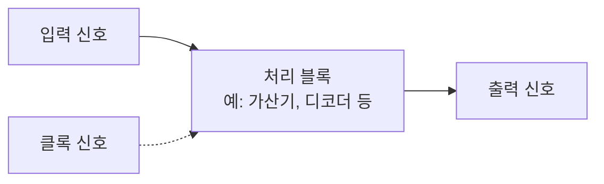

<Callout type="info">
  **이번 문서의 목표:** 이 파일을 다 읽으면 아날로그 신호와 디지털 신호가 근본적으로 무엇이 다른지 설명할 수 있고, 비트·워드·버스라는 단위를 구분해 쓸 수 있으며, 앞으로 나올 회로 블록도(block diagram)의 화살표와 굵은 선이 무엇을 뜻하는지 읽을 수 있다.
</Callout>

## 왜 신호 이야기가 마지막 선행 편인가

01~03편에서 집합·명제·불 대수라는 **수학적 언어**를 준비했다면, 이 편은 그 언어가 실제 전자회로에서 **어떻게 물리적으로 구현되는지**를 시험 수준에서 연결하는 자리입니다. 05편부터는 곧바로 본론(진법 변환, 불 대수, 카르노맵)으로 들어가므로, "0과 1이라는 숫자가 실제로는 전압의 어떤 상태를 가리키는가", "비트 여러 개를 묶어 부르는 워드·버스라는 말은 무엇인가"를 미리 정리해 두지 않으면 조합회로·순차회로 편에서 등장하는 블록도(입출력을 사각형과 화살표로 그린 그림)를 읽을 때마다 낯선 단어에 걸리게 됩니다.

> **쉽게 말하면:** 이 편은 "숫자 0과 1이 회로 안에서 실제로 무엇인지"를 연결하는 다리입니다.

## 1. 아날로그 신호와 디지털 신호 — 연속과 이산의 차이

**아날로그 신호**(analog signal)는 시간에 따라 값이 **연속적으로** 변하는 신호입니다. 예를 들어 실제 온도계가 가리키는 온도, 마이크가 받아들이는 소리의 세기는 특정 두 값 사이의 모든 중간값을 다 가질 수 있습니다. 25.0도와 25.1도 사이에도 25.03도, 25.071도처럼 무한히 많은 중간값이 존재합니다.

**디지털 신호**(digital signal)는 값이 정해진 몇 개의 **이산적인**(discrete, 뚝뚝 끊어진) 단계 중 하나만 가질 수 있는 신호입니다. 논리회로에서 다루는 디지털 신호는 그중에서도 가장 단순한 경우로, 값이 **딱 두 단계**(0 또는 1)만 존재합니다.

| 구분 | 아날로그 신호 | 디지털 신호(논리회로) |
|------|----------------|--------------------------|
| 값의 형태 | 연속적인 범위의 모든 값 | 정해진 두 단계(0, 1) 중 하나 |
| 대표 예시 | 온도, 소리의 세기, 아날로그 시계의 초침 | 스위치의 켜짐/꺼짐, 디지털 논리회로의 신호선 |
| 잡음(noise)에 대한 특징 | 잡음이 섞이면 원래 값과 구분이 어려움 | 두 단계만 구분하면 되므로 어느 정도 잡음은 무시 가능 |
| 회로 설계 | 값의 정밀한 크기 자체를 다루는 회로 필요 | 두 상태만 구분하면 되므로 상대적으로 단순한 회로 가능 |

02편에서 "왜 회로가 2진수를 쓰는가"를 다뤘던 이유가 바로 이 표의 마지막 줄과 연결됩니다. 디지털 신호는 정확한 전압값 자체가 중요한 것이 아니라 "어느 범위에 속하는가"만 판단하면 되므로, 약간의 잡음이 섞여도 오판할 가능성이 낮습니다.

> **쉽게 말하면:** 아날로그는 미끄럼틀처럼 값이 부드럽게 이어지는 것이고, 디지털은 계단처럼 정해진 칸에만 발을 디딜 수 있는 것입니다. 계단은 발이 조금 삐끗해도 "몇 번째 칸인지"는 여전히 명확히 구분됩니다.

**자주 틀리는 점**: "디지털 신호는 항상 두 단계(0, 1)만 있다"고 일반화하면 안 됩니다. 논리회로에서 다루는 디지털 신호가 두 단계인 것이지, 디지털 신호라는 개념 자체는 세 단계 이상의 이산 신호도 포함할 수 있습니다. 다만 이 과목의 범위에서는 "디지털 = 2진 논리값 0/1"로 좁혀서 다뤄도 무방합니다.

## 2. 비트·워드·버스 — 신호를 세는 단위

**비트**(bit, binary digit의 줄임말)는 0 또는 1 하나를 담을 수 있는 정보의 최소 단위입니다. 이름 자체가 "2진 숫자(binary digit)"를 줄인 말로, 01~03편에서 다룬 불 변수 하나가 물리적으로 갖는 정보량이 바로 1비트입니다.

비트 여러 개를 묶어 부르는 단위도 시험에서 자주 등장합니다.

| 단위 | 비트 수 | 비고 |
|------|---------|------|
| 비트(bit) | 1 | 정보의 최소 단위 |
| 니블(nibble) | 4 | 16진수 한 자리를 표현하는 데 필요한 비트 수(02편의 $2^4 = 16$ 참고) |
| 바이트(byte) | 8 | 문자 하나를 표현하는 데 흔히 쓰이는 전통적 단위 |
| 워드(word) | 시스템마다 다름(예: 16, 32, 64) | 컴퓨터가 한 번에 처리하는 기본 데이터 묶음 단위 |

**워드**(word)는 정확히 몇 비트라고 못박을 수 없다는 점이 특징입니다. 같은 "워드"라는 말도 시스템의 설계에 따라 16비트일 수도, 32비트일 수도, 64비트일 수도 있습니다. 이 과목에서는 워드의 정확한 크기를 암기하는 것보다, "여러 개의 비트를 하나의 의미 있는 묶음으로 처리할 때 그 묶음을 워드라 부른다"는 개념만 이해하면 됩니다.

**버스**(bus)는 여러 개의 신호선을 한데 묶어, 여러 비트의 데이터를 동시에 주고받는 통로입니다. 예를 들어 8비트짜리 데이터를 한 번에 옮기려면 신호선이 8개 필요한데, 이 8개의 선을 묶어 "8비트 버스"라고 부릅니다. 블록도에서 버스는 다음처럼 그려지는 경우가 많습니다.

이 그림에서 화살표 위에 굵게 표시하거나 "8비트"처럼 숫자를 함께 적어 두면, 그 화살표 하나가 실제로는 신호선 여러 개(이 예시에서는 8개)를 대표한다는 뜻입니다. 이 표기법은 22편의 레지스터·시프트 레지스터 편에서 데이터가 한 번에 여러 비트씩 이동하는 그림을 그릴 때 계속 사용됩니다.

> **쉽게 말하면:** 비트가 "실 한 가닥"이라면, 버스는 그 실 여러 가닥을 하나의 케이블로 묶은 것입니다. 케이블 하나(버스)로 여러 가닥(비트)의 신호를 동시에 보낼 수 있습니다.

## 3. 논리 0과 1의 전압 레벨 — 시험 수준의 직관

디지털 신호가 실제 전자회로에서 구현될 때, 논리값 0과 1은 특정 **전압의 범위**로 대응됩니다. 정확한 전압 수치와 회로 종류별 세부 규격(TTL, CMOS 등의 전기적 특성)은 전자공학·컴퓨터구조의 심화 영역이라 이 과목의 범위를 넘어서므로, 여기서는 시험에서 요구하는 수준의 **개념적 대응 관계**만 정리합니다.

| 논리값 | 전형적인 전압 상태(개념 수준) | 직관 |
|--------|-----------------------------------|------|
| 논리 1 (High) | 상대적으로 높은 전압 | 스위치가 켜져 있는 상태 |
| 논리 0 (Low) | 상대적으로 낮은 전압(0볼트에 가까움) | 스위치가 꺼져 있는 상태 |
| 정의되지 않은 구간 | 높은 전압과 낮은 전압 사이의 애매한 영역(금지 영역) | 회로가 0인지 1인지 확실히 판단할 수 없는 구간 |

여기서 중요한 것은 "높은 전압"과 "낮은 전압" 사이에 **금지 영역**(forbidden region)이 존재한다는 개념입니다. 실제 전압은 잡음이나 부품 특성 때문에 항상 정확히 두 값 중 하나로만 딱 떨어지지 않고 약간씩 흔들립니다. 그래서 회로 설계자는 "이 전압 이상이면 확실히 1로 인식하고, 이 전압 이하면 확실히 0으로 인식하며, 그 사이는 판단을 보류한다"는 식으로 여유 구간을 둡니다. 이 여유 구간 덕분에 어느 정도의 잡음이 섞여도 논리값을 오판하지 않는 것이며, 이것이 1절에서 언급한 "디지털 신호가 잡음에 강하다"는 성질의 실제 근거입니다.

> **쉽게 말하면:** 신호등의 빨간불과 초록불 사이에 노란불이 있는 것과 비슷합니다. 노란불(금지 영역)이 있기 때문에 "지금이 정지 신호인지 진행 신호인지" 애매한 순간에 섣불리 판단하지 않고 넘어갈 수 있습니다.

**자주 틀리는 점**: "논리 1은 항상 정확히 5볼트, 논리 0은 항상 정확히 0볼트다"처럼 특정 숫자를 절대적인 것으로 암기하면 안 됩니다. 실제 전압 기준값은 사용하는 회로 소자(부품)의 종류에 따라 달라지며, 이 과목의 출제 수준에서는 "높은 전압=1, 낮은 전압=0이라는 대응 관계와 그 사이에 금지 영역이 있다"는 개념만 정확히 알면 충분합니다.

## 4. 디지털 시스템 블록도 읽는 법

논리회로 교재와 기출문제에는 실제 게이트 기호를 그리기 전에, 전체 시스템을 사각형과 화살표로 단순화한 **블록도**(block diagram)가 먼저 등장하는 경우가 많습니다. 블록도는 세부 구현을 감추고 "무엇이 무엇으로 연결되는가"라는 큰 그림만 보여주는 도구입니다.

블록도를 읽을 때 확인해야 할 세 가지 약속은 다음과 같습니다.

1. **사각형(박스)**: 하나의 기능 단위를 나타냅니다. 박스 안의 회로가 정확히 어떤 게이트로 구성되는지는 그리지 않고, "이 박스는 이런 입력을 받아 이런 출력을 낸다"는 동작만 표현합니다.
2. **실선 화살표**: 일반적인 신호(데이터)의 흐름 방향을 나타냅니다. 화살표가 가리키는 쪽이 신호를 받는 쪽입니다.
3. **점선 화살표 또는 별도로 표시된 선**: 클록(clock, 순차회로의 동작 타이밍을 맞추는 주기적 신호) 같은 제어 신호를 데이터 흐름과 구분해 표시할 때 자주 쓰입니다. 클록 신호 자체는 18편 플립플롭 편부터 본격적으로 다룹니다.

이 편에서는 블록도의 "읽는 규칙"만 확실히 잡아 둡니다. 실제로 박스 안에 어떤 게이트 조합이 들어가는지는 09편(불 대수·게이트)부터, 클록에 따라 박스의 출력이 어떻게 바뀌는지는 18편(플립플롭)부터 구체적으로 다룹니다.

> **쉽게 말하면:** 블록도는 "자동차 정비 설명서의 전체 배치도"와 같습니다. 엔진 내부 부품 하나하나를 그리지 않고, "연료통에서 엔진으로, 엔진에서 바퀴로 힘이 전달된다"는 큰 흐름만 보여 주는 것입니다.

## 핵심 정리

- 아날로그 신호는 값이 연속적으로 변하고, 디지털 신호(이 과목의 범위)는 0과 1이라는 두 이산적인 단계만 가진다.
- 비트는 정보의 최소 단위(0 또는 1)이고, 니블(4비트)·바이트(8비트)·워드(시스템마다 다름)는 비트를 묶어 세는 단위이며, 버스는 여러 비트를 동시에 주고받는 통로다.
- 논리 1은 상대적으로 높은 전압, 논리 0은 상대적으로 낮은 전압에 대응하며, 그 사이의 금지 영역이 잡음에 대한 오판을 막아준다.
- 블록도는 세부 게이트 구현을 감추고 입출력 흐름만 사각형과 화살표로 표현하며, 클록 같은 제어 신호는 데이터 흐름과 구분해 표시하는 경우가 많다.

## 마무리 복습

<Quiz
  questionNumber={1}
  question="아날로그 신호와 디지털 신호의 차이를 설명한 것으로 가장 적절한 것은?"
  options={['아날로그 신호는 두 단계로만 값을 가지며 디지털 신호는 연속적인 값을 가진다', '아날로그 신호는 값이 연속적으로 변하고 디지털 신호(이 과목 범위)는 0과 1의 두 이산적인 값만 가진다', '두 신호 모두 항상 동일한 방식으로 표현된다', '디지털 신호는 반드시 소리 신호만을 의미한다']}
  correctAnswer={2}
  explanation="아날로그 신호는 값이 연속적으로 변하는 반면, 이 과목에서 다루는 디지털 신호는 0과 1이라는 정해진 두 단계 중 하나의 값만 가진다."
  optionExplanations={['설명이 아날로그와 디지털의 정의를 서로 바꿔 놓았다.', '정답. 연속적인 값과 이산적인 두 값이라는 차이가 핵심이다.', '두 신호는 값을 표현하는 방식이 근본적으로 다르다.', '디지털 신호는 소리뿐 아니라 다양한 정보를 0과 1로 표현하는 방식 전반을 가리킨다.']}
/>

<Quiz
  questionNumber={2}
  question="디지털 신호가 아날로그 신호보다 잡음에 상대적으로 강한 이유로 가장 적절한 것은?"
  options={['디지털 신호는 전압을 전혀 사용하지 않기 때문이다', '디지털 신호는 두 단계만 구분하면 되므로 약간의 잡음이 섞여도 값을 오판할 가능성이 낮기 때문이다', '디지털 신호는 항상 아날로그 신호보다 전압이 높기 때문이다', '디지털 신호는 소리로만 전달되기 때문이다']}
  correctAnswer={2}
  explanation="디지털 신호는 정확한 전압값이 아니라 어느 범위(높음/낮음)에 속하는지만 판단하면 되므로, 약간의 잡음이 섞여도 논리값을 오판할 가능성이 낮다."
  optionExplanations={['디지털 신호도 전압을 이용해 구현되며 전압 자체를 쓰지 않는 것은 아니다.', '정답. 두 단계만 구분하면 되는 구조가 잡음에 대한 여유를 만들어 준다.', '전압의 높고 낮음은 회로 종류에 따라 다르며 디지털이 항상 더 높다고 단정할 수 없다.', '디지털 신호는 소리뿐 아니라 다양한 형태의 정보를 표현하는 데 쓰인다.']}
/>

<Quiz
  questionNumber={3}
  question="비트, 니블, 바이트의 관계를 바르게 설명한 것은?"
  options={['1바이트는 4비트이고 1니블은 8비트이다', '1니블은 4비트이고 1바이트는 8비트이다', '1비트는 4니블이고 1바이트는 2니블이다', '니블과 바이트는 항상 같은 비트 수를 가진다']}
  correctAnswer={2}
  explanation="니블은 4비트, 바이트는 8비트로 정의되는 단위이며, 1바이트는 2개의 니블로 이루어진다."
  optionExplanations={['니블과 바이트의 비트 수가 서로 바뀌어 있다.', '정답. 니블은 4비트, 바이트는 8비트이다.', '비트는 1개의 정보 단위이므로 니블보다 클 수 없다.', '니블(4비트)과 바이트(8비트)는 서로 다른 비트 수를 가진다.']}
/>

<Quiz
  questionNumber={4}
  question="버스(bus)에 대한 설명으로 가장 적절한 것은?"
  options={['버스는 하나의 비트만 전달할 수 있는 단일 신호선이다', '버스는 여러 개의 신호선을 묶어 여러 비트의 데이터를 동시에 주고받는 통로다', '버스는 클록 신호를 대체하는 개념이다', '버스는 아날로그 신호 전용 통로를 의미한다']}
  correctAnswer={2}
  explanation="버스는 여러 신호선을 하나로 묶어, 여러 비트의 데이터를 동시에 전달하는 통로를 뜻한다."
  optionExplanations={['버스는 오히려 여러 신호선을 묶은 것이지 단일 신호선이 아니다.', '정답. 버스는 여러 비트를 동시에 실어 나르는 신호선 묶음이다.', '클록은 타이밍을 맞추는 신호이며 버스와는 별개의 개념이다.', '버스는 디지털 회로에서 여러 비트의 디지털 데이터를 전달하는 통로로 주로 쓰인다.']}
/>

<Quiz
  questionNumber={5}
  question="논리 1과 논리 0에 대응하는 전압 관계, 그리고 그 사이의 금지 영역에 대한 설명으로 옳은 것은?"
  options={['논리 1과 논리 0 사이에는 항상 명확히 구분되는 전압만 존재하며 애매한 구간은 없다', '높은 전압은 논리 1, 낮은 전압은 논리 0에 대응하며 그 사이에는 판단을 보류하는 금지 영역이 있다', '논리 0이 논리 1보다 항상 높은 전압을 가진다', '금지 영역은 논리회로에서 아무 의미가 없는 설계 오류다']}
  correctAnswer={2}
  explanation="논리 1은 상대적으로 높은 전압, 논리 0은 상대적으로 낮은 전압에 대응하며, 그 사이에는 판단을 보류하는 금지 영역이 존재해 잡음에 대한 오판을 줄여준다."
  optionExplanations={['실제로는 두 전압 상태 사이에 판단을 보류하는 금지 영역이 존재한다.', '정답. 높은 전압은 1, 낮은 전압은 0에 대응하며 그 사이에 금지 영역이 있다.', '일반적으로 논리 1이 논리 0보다 높은 전압에 대응한다.', '금지 영역은 설계 오류가 아니라 잡음에 대한 오판을 막기 위한 의도적인 여유 구간이다.']}
/>

<Quiz
  questionNumber={6}
  question="디지털 시스템 블록도를 읽는 방법으로 가장 적절한 것은?"
  options={['사각형 박스는 반드시 게이트 하나만을 의미한다', '실선 화살표는 신호의 흐름 방향을, 사각형은 하나의 기능 단위를 나타낸다', '블록도에는 클록 신호를 표시할 수 없다', '블록도는 게이트 수준의 세부 구현을 항상 전부 드러내야 한다']}
  correctAnswer={2}
  explanation="블록도에서 사각형은 하나의 기능 단위를 나타내고, 실선 화살표는 신호가 흐르는 방향을 나타낸다. 세부 게이트 구현은 감추고 큰 흐름만 보여주는 것이 블록도의 목적이다."
  optionExplanations={['박스는 게이트 하나가 아니라 여러 게이트로 구성될 수 있는 하나의 기능 단위를 나타낸다.', '정답. 박스는 기능 단위, 화살표는 신호 흐름 방향을 나타낸다.', '클록 같은 제어 신호도 점선 등으로 구분해 블록도에 표시할 수 있다.', '블록도는 오히려 세부 구현을 감추고 큰 흐름만 단순하게 보여주는 도구다.']}
/>

## 참고 자료

- [국가평생교육진흥원 독학학위제](https://bdes.nile.or.kr)
