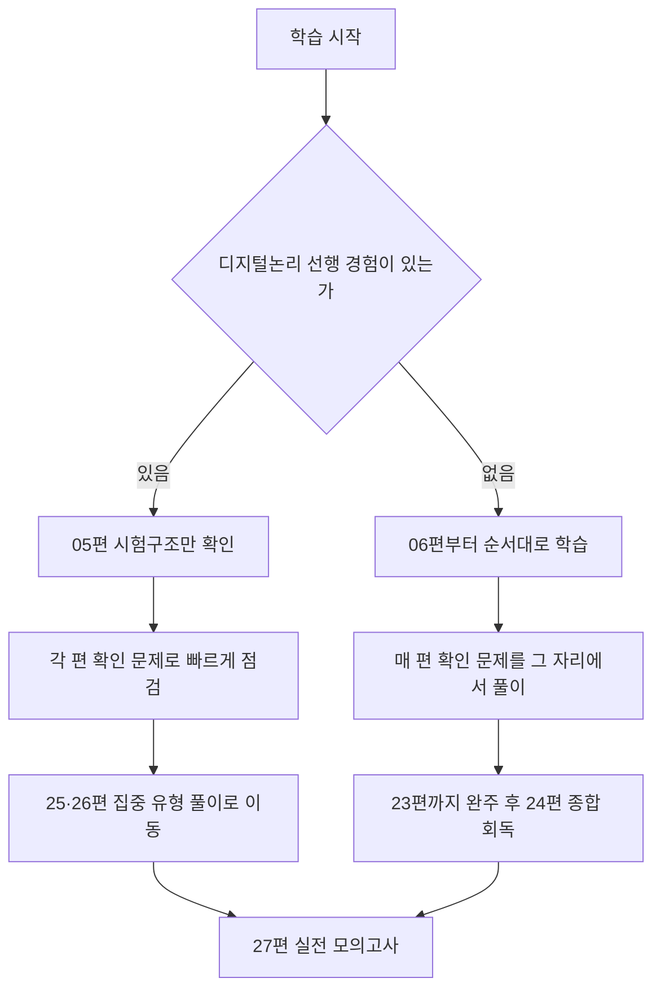

<Callout type="info">
  **이번 문서의 목표:** 이 문서를 다 읽으면 독학사 2단계라는 시험 제도 안에서 논리회로 과목이 어떤 위치에 있는지 설명하고, 출제범위가 어떤 영역으로 나뉘는지 큰 그림으로 파악하며, 남은 학습 시간을 영역별 비중에 맞춰 배분하는 자기만의 전략을 세울 수 있다.
</Callout>

## 왜 시험 구조부터 먼저 알아야 하는가

논리회로 개념을 배우기 전에 시험 구조부터 짚는 이유가 있다. 학습 시간은 한정되어 있는데, 어떤 영역이 몇 문제나 나오는지, 어떤 형식으로 채점되는지 모른 채 공부하면 **정작 배점이 큰 영역에 시간을 충분히 쓰지 못하는 실수**를 하기 쉽다. 반대로 시험의 전체 그림을 먼저 그려 두면, 이후 06편부터 이어지는 개념 학습 하나하나가 "전체 중 어느 부분을 채우는 조각인지" 스스로 위치를 잡을 수 있다.

> **쉽게 말하면:** 지도를 보지 않고 여행을 떠나면 중요한 곳을 놓치기 쉽다. 이 문서는 논리회로 시험이라는 여행의 지도를 먼저 펼쳐 보는 자리다.

## 독학사 제도 안에서 2단계가 갖는 위치

**독학사**(독학에 의한 학위취득시험, 정식 명칭은 독학학위제)는 대학에 다니지 않고도 스스로 공부해 학사 학위를 딸 수 있도록 국가가 운영하는 시험 제도다. 이 제도를 관리하는 기관은 **국가평생교육진흥원**(National Institute for Lifelong Education, 평생교육을 진흥하기 위해 설립된 국가 기관)이며, 줄여서 국평원이라고도 부른다.

독학사는 총 4단계로 구성된 시험을 순서대로 통과해야 학위를 받을 수 있다.

| 단계 | 명칭 | 시험 성격 |
|------|------|-----------|
| 1단계 | 교양과정 인정시험 | 전공과 무관한 대학 교양 수준 |
| 2단계 | 전공기초과정 인정시험 | 전공의 기초 개념을 다지는 과목 |
| 3단계 | 전공심화과정 인정시험 | 전공의 심화 이론·응용 |
| 4단계 | 학위취득 종합시험 | 학사 학위 수여를 결정하는 종합 시험 |

**논리회로**는 이 표에서 **2단계 전공기초과정**에 속하는 과목이다. 컴퓨터과학·컴퓨터공학 계열 전공자가 이후 3단계·4단계에서 다룰 컴퓨터구조, 디지털 시스템 설계의 기초 체력을 다지는 자리이며, 그만큼 **암기보다 원리를 이해했는지를 확인하는 문항**이 중심이 된다는 점을 기억해 두자. 이 성격은 05편 이후 모든 개념 설명에서 계속 강조할 것이다.

> **쉽게 말하면:** 2단계는 "전공을 본격적으로 시작하기 전에, 기초 체력이 있는지" 확인하는 관문이다.

## 논리회로 과목의 출제범위 개관

이 시리즈는 국가평생교육진흥원이 공개하는 과목별 평가영역을 근거로, 논리회로 과목의 출제범위를 다음과 같은 큰 영역으로 나누어 구성했다. 각 영역이 이 시리즈의 어느 편에서 다루어지는지 함께 표시한다.

| 영역 | 핵심 내용 | 관련 편 |
|------|-----------|---------|
| 수 체계와 코드 | 2·8·10·16진 변환, BCD·그레이·여분3 코드, 보수·패리티 | 06–08 |
| 불 대수와 간소화 | 불 대수 법칙, 표준형, 카르노맵, 퀴인-맥클러스키 | 09–13 |
| 조합논리회로 | 설계 절차, 가산기·감산기, 비교기·인코더·디코더·MUX, ROM·PLA | 14–17 |
| 순차논리회로 | 래치·플립플롭, 여기표·타이밍, 상태도 설계, 카운터·레지스터 | 18–22 |
| 기억장치 개요 | RAM·ROM 분류, 주소·용량 계산 | 23 |

이 영역 구분은 01_학습방향.md에서 정한 학습 목표와 정확히 대응한다. 즉 이 시리즈를 순서대로 따라가면, 자연스럽게 공식 출제범위 전체를 훑게 되도록 설계되어 있다. 다만 **국가평생교육진흥원의 세부 출제기준은 학년도·공고에 따라 조정될 수 있으므로, 실제 응시 학년도의 최신 공고를 반드시 별도로 확인해야 한다.** 이 문서를 포함한 모든 편에서 "공고 확인 필요"라는 표시가 붙은 부분은 이런 이유 때문이다.

## 객관식 4지선다 형식과 배점

독학사 시험은 원칙적으로 **객관식 4지선다형**으로 출제된다. 즉 하나의 문제에 보기 ①~④번 네 개가 주어지고, 그중 하나(또는 옳지 않은 것 하나)를 고르는 방식이다. 다만 4단계 학위취득 종합시험에서는 과목에 따라 주관식·서술형이 함께 출제되기도 하는데, 논리회로가 속한 2단계 전공기초과정은 **객관식 4지선다 위주**로 알려져 있다.

일반적으로 한 과목의 시험 시간은 30분 내외, 문항 수는 20문항 내외로 운영되는 경우가 많다고 알려져 있으나, **정확한 문항 수·배점·시간은 응시 회차의 공식 공고문에서 확인해야 한다(공고 확인 필요)**. 이 시리즈에서는 이 불확실성을 감안해, 뒤에 이어질 기출·모의 편(24~27편)에서 문항 수를 넉넉히 준비해 다양한 형식에 대비할 수 있게 구성했다.

문항 유형은 크게 세 가지로 나뉜다.

- **정의·개념 확인형**: "다음 중 그레이 코드에 대한 설명으로 옳은 것은?"처럼 개념을 정확히 아는지 묻는다.
- **옳지 않은 것 고르기형**: 보기 네 개 중 세 개는 옳고 하나만 틀린 진술을 찾는 유형이다. 독학사가 학문형 시험을 지향하기 때문에 이 유형이 특히 자주 나온다. 네 보기를 각각 참·거짓으로 판정하는 습관이 필요하다.
- **손계산형**: 진법 변환, 불 대수 간소화, 카르노맵, 플립플롭 여기표, 상태표 설계처럼 **직접 계산하거나 표를 채워야 답이 나오는 유형**이다. 이 시리즈가 "DEEP"을 표방하며 계산 과정을 생략하지 않는 이유가 여기에 있다.

> **쉽게 말하면:** 보기 하나가 정답인 문제도 있지만, "이 중 틀린 설명을 찾아라"처럼 네 개를 전부 검토해야 풀리는 문제도 많다. 그래서 개념 하나를 배울 때 "무엇이 맞는가"뿐 아니라 "무엇이 자주 틀리게 서술되는가"까지 함께 익혀야 한다.

## 출제 영역별 비중과 시간 배분 전략

01_학습방향.md에서 이 시리즈는 학습 비중을 **개념·이론 35퍼센트(35%), 유형 문제 풀이 35퍼센트(35%), 기출·모의 30퍼센트(30%**)로 설계했다. 이 비중을 실제 학습 계획에 어떻게 반영할지 표로 정리한다.

| 학습 단계 | 비중 | 이 시리즈의 해당 편 | 학습 방법 |
|-----------|------|----------------------|-----------|
| 개념·이론 | 35% | 06–23편 | 정의를 읽고 손계산 예제를 직접 따라 푼다 |
| 유형 문제 풀이 | 35% | 각 편 말미 확인 문제 + 25·26편 | 개념 학습 직후 바로 같은 유형을 반복 연습한다 |
| 기출·모의 | 30% | 24·27편 | 실전과 동일한 시간 제한을 두고 통째로 푼다 |

시간이 부족한 학습자를 위한 전략도 함께 제시한다. 이미 대학이나 다른 경로에서 디지털논리 과목을 수강한 적이 있다면, 06~23편의 개념 설명은 훑어보는 수준으로 빠르게 넘기고 각 편 말미의 확인 문제와 25·26편의 집중 유형 세트로 바로 진입해도 좋다. 반대로 전자·컴퓨터 계열을 처음 접하는 학습자라면, 순서를 건너뛰지 말고 06편부터 22편까지 순서대로 따라가는 것을 권장한다. 이 흐름은 다음과 같이 나눠볼 수 있다.

## 손계산형 문제에 접근하는 공통 순서

이 시리즈 전체에서 반복해서 강조할 손계산 접근법을 미리 소개한다. 진법 변환이든 카르노맵이든 플립플롭 설계든, 다음 순서를 지키면 실수를 크게 줄일 수 있다.

<Steps>

### 1단계: 문제가 묻는 최종 형태를 확인한다

"2진수로 답하라"인지 "16진수로 답하라"인지, "최소 SOP로 답하라"인지처럼 최종적으로 어떤 형태의 답을 요구하는지 먼저 확인한다.

### 2단계: 중간 계산을 표나 단계별로 모두 적는다

암산으로 건너뛰지 않고, 나눗셈이든 카르노맵 묶음이든 상태표든 **중간 과정을 눈에 보이게 적는다.** 시험장에서는 답만 보고 채점하지만, 학습 단계에서는 과정을 생략하면 실수의 원인을 찾을 수 없다.

### 3단계: 자주 틀리는 패턴과 대조한다

각 편 끝에는 "자주 틀리는 점"이 정리되어 있다. 계산을 마치면 이 목록과 내 풀이를 대조해, 같은 실수를 반복하지 않는지 확인한다.

### 4단계: 검산한다

진법 변환이면 답을 다시 원래 진법으로 되돌려 원래 숫자가 나오는지, 회로 설계면 입력 몇 가지를 대입해 출력이 진리표와 맞는지 확인한다.

</Steps>

## 자주 틀리는 점

- **시험 형식을 확인하지 않고 무작정 암기부터 시작하는 실수**: 배점과 문항 수는 응시 회차 공고에 따라 달라질 수 있으므로, 학습 초반에 반드시 최신 공고를 확인하는 습관을 들여야 한다(공고 확인 필요).
- **"옳지 않은 것을 고르라"는 문제에서 보기 하나만 보고 답을 정하는 실수**: 네 보기를 모두 검토해 각각의 참·거짓을 판단한 뒤 답을 정해야 한다.
- **개념 학습만 반복하고 손계산 연습을 미루는 실수**: 논리회로는 계산형 문항 비중이 매우 높은 과목이므로, 개념을 읽은 직후 반드시 같은 자리에서 손으로 계산해 보는 습관이 필요하다.
- **이미 아는 내용이라고 선행 편을 전부 건너뛰는 실수**: 05편에서 확인한 시험 구조와 06편 이후의 표기 관습(자리값, 진법 기호 등)은 뒤에서 계속 재사용되므로, 최소한 표기 관습만은 가볍게라도 확인하고 넘어가는 것이 안전하다.

## 핵심 정리

- 독학사는 1~4단계로 구성되며, 논리회로는 전공의 기초 개념을 확인하는 **2단계 전공기초과정** 과목이다.
- 출제범위는 수 체계와 코드(06~08), 불 대수와 간소화(09~13), 조합논리회로(14~17), 순차논리회로(18~22), 기억장치 개요(23)로 나뉜다.
- 시험은 객관식 4지선다 위주이며, 정의 확인형·옳지 않은 것 고르기형·손계산형 세 유형이 반복 출제된다. 정확한 문항 수·시간·배점은 응시 회차의 공식 공고를 확인해야 한다.
- 학습은 개념·이론 35퍼센트, 유형 문제 풀이 35퍼센트, 기출·모의 30퍼센트 비중으로 배분하는 것을 권장한다.

## 마무리 복습

<Quiz
  questionNumber={1}
  question="독학사 시험 단계 중 논리회로 과목이 속한 단계와 그 성격으로 옳은 것은?"
  options={['1단계 교양과정, 전공과 무관한 교양 수준이다', '2단계 전공기초과정, 전공의 기초 개념을 다진다', '3단계 전공심화과정, 전공 이론의 응용을 다룬다', '4단계 학위취득 종합시험, 학위 수여를 결정하는 종합 시험이다']}
  correctAnswer={2}
  explanation="논리회로는 독학사 2단계 전공기초과정에 속하는 과목으로, 이후 전공 심화를 위한 기초 개념 이해를 확인한다."
  optionExplanations={['1단계는 전공과 무관한 대학 교양 수준 시험으로 논리회로는 여기 속하지 않는다.', '정답. 논리회로는 전공의 기초를 다지는 2단계 전공기초과정 과목이다.', '3단계는 전공심화과정으로 논리회로보다 심화된 전공 과목이 배치되는 단계다.', '4단계는 학위취득 종합시험으로 전 과정을 마친 뒤 치르는 종합 시험이다.']}
/>

<Quiz
  questionNumber={2}
  question="독학사 논리회로 시험의 일반적인 출제 형식에 대한 설명으로 옳은 것은?"
  options={['모든 문항이 서술형으로만 출제된다', '객관식 4지선다형이 원칙이며, 정확한 문항 수와 배점은 응시 회차 공고를 확인해야 한다', '문항 수와 배점은 모든 회차에서 완전히 동일하게 고정되어 있다', '진법 변환 같은 계산형 문제는 출제되지 않는다']}
  correctAnswer={2}
  explanation="독학사 2단계는 객관식 4지선다형이 원칙이며, 실제 문항 수와 배점은 응시 회차의 공식 공고에 따라 달라질 수 있으므로 확인이 필요하다."
  optionExplanations={['논리회로가 속한 2단계 전공기초과정은 서술형이 아닌 객관식 4지선다 위주로 알려져 있다.', '정답. 객관식 4지선다형이 원칙이며 세부 사항은 공고 확인이 필요하다.', '문항 수·배점은 응시 회차 공고에 따라 달라질 수 있어 완전히 고정되어 있다고 단정할 수 없다.', '논리회로는 손계산형 문항 비중이 높은 과목으로, 진법 변환·간소화 같은 계산형 문제가 자주 출제된다.']}
/>

<Quiz
  questionNumber={3}
  question="이 시리즈가 제시하는 학습 비중 배분으로 옳은 것은?"
  options={['개념·이론 100퍼센트로만 학습한다', '개념·이론 35퍼센트, 유형 문제 풀이 35퍼센트, 기출·모의 30퍼센트다', '기출·모의만 100퍼센트 반복한다', '개념·이론과 기출·모의만 각각 50퍼센트씩 배분하고 유형 문제 풀이는 생략한다']}
  correctAnswer={2}
  explanation="01_학습방향에서 제시한 비중은 개념·이론 35퍼센트, 유형 문제 풀이 35퍼센트, 기출·모의 30퍼센트다."
  optionExplanations={['개념만 학습하고 문제 풀이·기출을 생략하면 손계산형 문항에 대비할 수 없다.', '정답. 세 단계에 각각 35퍼센트, 35퍼센트, 30퍼센트 비중을 두는 것이 이 시리즈의 설계다.', '기출·모의만 반복하면 기초 개념 이해 없이 유형만 암기하게 되어 응용 문제에 취약해진다.', '유형 문제 풀이를 생략하면 개념과 기출 사이의 간격을 메우기 어렵다.']}
/>

<Quiz
  questionNumber={4}
  question="옳지 않은 것을 고르는 유형의 문제를 풀 때 가장 바람직한 접근으로 옳은 것은?"
  options={['보기 1번이 그럴듯해 보이면 바로 선택한다', '네 개 보기를 모두 검토해 각각 참·거짓을 판정한 뒤 답을 정한다', '가장 짧은 보기를 정답으로 추정한다', '보기를 읽지 않고 직관으로 답한다']}
  correctAnswer={2}
  explanation="독학사는 학문형 시험을 지향해 옳지 않은 것 고르기 유형이 자주 출제되므로, 보기 네 개를 모두 검토해 참·거짓을 판정하는 습관이 필요하다."
  optionExplanations={['첫 보기만 보고 판단하면 실제로 틀린 보기를 놓칠 수 있다.', '정답. 네 보기를 모두 검토해야 옳지 않은 것을 정확히 찾을 수 있다.', '보기의 길이는 정답 여부와 아무 관련이 없다.', '직관에만 의존하면 개념 간 미세한 차이를 구분하지 못해 틀리기 쉽다.']}
/>

<Quiz
  questionNumber={5}
  question="이 시리즈의 출제범위 영역 구분 중 조합논리회로 영역에 해당하는 내용으로 옳은 것은?"
  options={['진법 변환과 BCD 코드', '카르노맵을 이용한 불 함수 간소화', '가산기·감산기·비교기·인코더·디코더·멀티플렉서', '플립플롭의 여기표와 상태도 설계']}
  correctAnswer={3}
  explanation="가산기·감산기·비교기·인코더·디코더·멀티플렉서는 조합논리회로 영역(14~17편)에서 다루는 대표 회로다."
  optionExplanations={['진법 변환과 BCD 코드는 수 체계와 코드 영역(06~08편)에 해당한다.', '카르노맵 간소화는 불 대수와 간소화 영역(09~13편)에 해당한다.', '정답. 가산기·감산기·비교기·인코더·디코더·멀티플렉서는 조합논리회로 영역이다.', '플립플롭 여기표·상태도 설계는 순차논리회로 영역(18~22편)에 해당한다.']}
/>

<Quiz
  questionNumber={6}
  question="손계산형 문제에 접근하는 공통 순서로 옳은 것은?"
  options={['암산으로 빠르게 답만 낸 뒤 검산 없이 제출한다', '최종 답 형태 확인 후 중간 계산을 모두 적고 자주 틀리는 패턴과 대조한 뒤 검산한다', '문제를 끝까지 읽지 않고 첫 줄만 보고 계산을 시작한다', '검산은 시간 낭비이므로 생략한다']}
  correctAnswer={2}
  explanation="최종 답의 형태를 먼저 확인하고, 중간 계산을 표나 단계별로 모두 남기고, 자주 틀리는 패턴과 대조한 뒤 검산하는 순서가 실수를 줄이는 공통 접근법이다."
  optionExplanations={['암산으로 건너뛰면 중간 실수의 원인을 찾을 수 없다.', '정답. 최종 형태 확인, 중간 계산 기록, 패턴 대조, 검산의 순서를 지키면 실수를 줄일 수 있다.', '문제를 끝까지 읽지 않으면 요구하는 답의 형태를 놓칠 수 있다.', '검산은 계산 실수를 걸러내는 마지막 안전장치이므로 생략해서는 안 된다.']}
/>

## 참고 자료

- [국가평생교육진흥원 독학학위제](https://bdes.nile.or.kr) — 독학사 단계 구성, 평가수준, 시험방법(객관식 4지선다) 등 공식 학습정보를 확인할 수 있는 자료.
