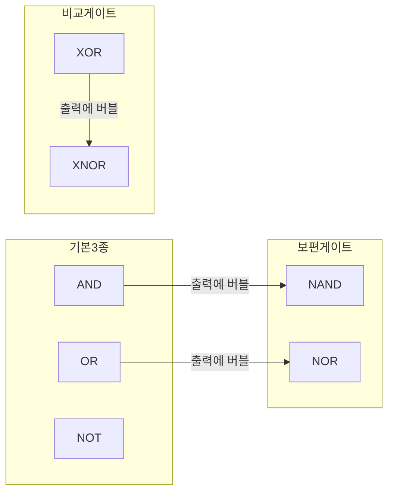

## 왜 불 대수가 필요한가

03편에서 불 변수(Boolean variable)는 0 또는 1 두 값만 가진다는 것, AND·OR·NOT 세 기본 연산과 진리표(truth table)를 읽는 법을 배웠다. 진리표는 함수의 동작을 빠짐없이 보여주지만, 그 자체로는 회로를 어떻게 만들지 알려주지 않는다.

문제는 같은 동작을 하는 논리식이 여러 가지 형태로 존재한다는 점이다. 예를 들어 $A + AB$ 라는 식과 $A$ 라는 식은 완전히 같은 동작을 한다(뒤에서 직접 증명한다).

독학사 논리회로 시험에서는 "다음 식을 간소화하면?"이라는 유형이 자주 나오는데, 답만 맞히는 게 아니라 **어떤 법칙을 어떤 순서로 적용했는지**를 스스로 검증할 수 있어야 실수 없이 정답을 고를 수 있다. 그래서 이 편에서는 모든 간소화 예제마다 적용한 법칙 이름을 한 줄씩 적는다.

## 불 대수의 기본 법칙 12가지

불 대수는 일반 대수(덧셈·곱셈)와 형태는 비슷하지만 값이 0과 1 두 개뿐이라는 점에서 다르게 동작하는 법칙이 섞여 있다. 아래 표에서 `+`는 OR(논리합), `·`는 AND(논리곱, 종종 생략해서 $AB$로 씀), `'`는 NOT(보수, complement)을 뜻한다.

| 번호 | 법칙 이름(영문) | OR 형태 | AND 형태 |
|---|---|---|---|
| 1 | 항등법칙(identity law) | $A + 0 = A$ | $A \cdot 1 = A$ |
| 2 | 영원법칙(null law) | $A + 1 = 1$ | $A \cdot 0 = 0$ |
| 3 | 멱등법칙(idempotent law) | $A + A = A$ | $A \cdot A = A$ |
| 4 | 보수법칙(complement law) | $A + A' = 1$ | $A \cdot A' = 0$ |
| 5 | 교환법칙(commutative law) | $A + B = B + A$ | $AB = BA$ |
| 6 | 결합법칙(associative law) | $(A+B)+C = A+(B+C)$ | $(AB)C = A(BC)$ |
| 7 | 분배법칙(distributive law) | $A(B+C) = AB + AC$ | $A+BC = (A+B)(A+C)$ |
| 8 | 흡수법칙(absorption law) | $A + AB = A$ | $A(A+B) = A$ |
| 9 | 이중부정(double negation, involution) | $(A')' = A$ | — |
| 10 | 드모르간 법칙 1(De Morgan's law) | $(A+B)' = A' \cdot B'$ | — |
| 11 | 드모르간 법칙 2(De Morgan's law) | $(AB)' = A' + B'$ | — |
| 12 | 흡수법칙 변형(absorption variant) | $A + A'B = A + B$ | $A(A'+B) = AB$ |

이 중 낯선 것은 두 가지다. **분배법칙의 AND-형태**($A+BC=(A+B)(A+C)$)는 일반 대수에는 없는 규칙이다(일반 대수에서 $a+bc$는 $(a+b)(a+c)$와 같지 않다).

### 진리표로 직접 검증하기: 드모르간 법칙

법칙을 외우기 전에 진리표로 왜 성립하는지 확인하는 습관이 시험에서 실수를 줄여준다. $(A+B)' = A'B'$ 를 검증해보자.

| A | B | A+B | (A+B)' | A' | B' | A'B' |
|---|---|---|---|---|---|---|
| 0 | 0 | 0 | 1 | 1 | 1 | 1 |
| 0 | 1 | 1 | 0 | 1 | 0 | 0 |
| 1 | 0 | 1 | 0 | 0 | 1 | 0 |
| 1 | 1 | 1 | 0 | 0 | 0 | 0 |

$(A+B)'$ 열과 $A'B'$ 열이 네 행 모두 정확히 일치한다. 두 논리식의 진리표가 모든 입력 조합에서 완전히 같으면, 그 두 식은 **논리적으로 동일**(logically equivalent)하다고 말한다. 불 대수의 모든 법칙은 이런 식으로 진리표를 대조해서 증명된 것이다.

### 자주 틀리는 점: 드모르간 법칙 적용 실수

- $(AB)'$ 를 $A'B'$ 로 잘못 계산하는 경우가 가장 많다. 올바른 결과는 $A' + B'$ 다(AND가 OR로 바뀐다는 것을 빠뜨리면 안 된다).
- 세 변수 이상일 때도 규칙은 그대로 확장된다. $(A+B+C)' = A'B'C'$, $(ABC)' = A'+B'+C'$ 이다. 변수가 늘어나도 "연산자를 뒤집고 각 변수에 보수를 붙인다"는 원리는 동일하다.
- 분배법칙의 AND-형태($A+BC=(A+B)(A+C)$)를 아예 없는 규칙이라 생각하고 못 쓰는 경우가 있다. 진리표로 검증해보면 $A=1$일 때 좌변은 1, 우변은 $(1)(1)=1$로 같고, $A=0$일 때 좌변은 $BC$, 우변은 $(B)(C)=BC$로 같아서 항상 성립한다.

## 법칙을 줄마다 적용해 간소화하기: 예제 1

다음 식을 간소화해보자.

$$
F = A'BC + A'BC' + AB
$$

**결과 해석**: 원래 식은 3항 AND-OR 구조라 3입력 AND 게이트 2개, 2입력 AND 게이트 1개, 3입력 OR 게이트 1개가 필요했다. 간소화된 결과 $F=B$는 게이트가 **전혀 필요 없다**.

## 법칙을 줄마다 적용해 간소화하기: 예제 2 — 흡수법칙 유도

흡수법칙 $A + AB = A$ (표의 8번)를 그냥 외우면 "왜 그런지"를 놓치기 쉽다. 기본 법칙만으로 유도해보자.

이렇게 유도 과정을 한 번 손으로 짚어보면, 흡수법칙 자체를 몰라도 항등·분배·영원법칙만으로 즉석에서 재현할 수 있다. 시험 중 법칙 이름이 헷갈릴 때 이 방법이 안전망이 된다.

### 자주 틀리는 점: 간소화 도중 법칙을 건너뛰기

- 여러 단계를 암산으로 한 번에 처리하다가 부호나 항을 빠뜨리는 실수가 가장 흔하다. **한 줄에 법칙 하나씩** 적용하는 습관을 들이면 검산이 쉬워진다.
- 분배법칙을 "묶는 방향"으로만 알고 "펼치는 방향"($A(B+C) \to AB+AC$)은 놓치는 경우가 있다. 간소화 문제는 두 방향을 모두 자유롭게 오가야 풀린다.
- 흡수법칙 변형($A + A'B = A+B$, 표의 12번)을 흡수법칙 원형($A+AB=A$)과 혼동해 잘못 적용하는 경우가 많다. 변형은 **보수가 붙어 있을 때**만 쓰는 규칙이다.

## 기본 논리게이트 7종: 기호와 진리표

03편에서 AND·OR·NOT 세 가지를 다뤘다. 이번에는 실제 회로 설계·시험에서 반드시 나오는 4가지를 추가해 총 7종을 정리한다. 게이트 기호는 실제 시험에서 그림으로 나오므로, 여기서는 모양의 특징을 말로 정확히 짚어둔다.

### AND 게이트 — 모두 1이어야 1

| A | B | Y = AB |
|---|---|---|
| 0 | 0 | 0 |
| 0 | 1 | 0 |
| 1 | 0 | 0 |
| 1 | 1 | 1 |

기호는 평평한 왼쪽 변에 둥근 오른쪽 끝(D자 모양)을 가진다. 생활 비유로는 "출입문 두 개를 모두 통과해야만 방에 들어갈 수 있는" 조건과 같다.

### OR 게이트 — 하나라도 1이면 1

| A | B | Y = A+B |
|---|---|---|
| 0 | 0 | 0 |
| 0 | 1 | 1 |
| 1 | 0 | 1 |
| 1 | 1 | 1 |

기호는 왼쪽이 오목하게 파인 방패 모양이다. "두 스위치 중 하나만 눌러도 불이 켜지는" 회로가 OR의 비유다.

### NOT 게이트 — 값을 뒤집는다

| A | Y = A' |
|---|---|
| 0 | 1 |
| 1 | 0 |

삼각형 기호 끝에 작은 원(버블, bubble)이 붙는다. 이 버블은 이후 NAND·NOR·XNOR 기호에서도 "보수를 취한다"는 뜻으로 계속 등장한다.

### NAND 게이트 — AND에 버블을 붙인 것

**NAND**(Not-AND)는 AND 뒤에 NOT을 붙인 것과 같다. 기호는 AND 게이트와 똑같이 생기고 출력 끝에만 버블이 붙는다.

$$
Y = (AB)'
$$

| A | B | AB | Y = (AB)' |
|---|---|---|---|
| 0 | 0 | 0 | 1 |
| 0 | 1 | 0 | 1 |
| 1 | 0 | 0 | 1 |
| 1 | 1 | 1 | 0 |

### NOR 게이트 — OR에 버블을 붙인 것

**NOR**(Not-OR)는 OR 뒤에 NOT을 붙인 것이다.

$$
Y = (A+B)'
$$

| A | B | A+B | Y = (A+B)' |
|---|---|---|---|
| 0 | 0 | 0 | 1 |
| 0 | 1 | 1 | 0 |
| 1 | 0 | 1 | 0 |
| 1 | 1 | 1 | 0 |

### XOR 게이트 — 서로 다르면 1

**XOR**(eXclusive OR, 배타적 논리합)은 두 입력이 서로 다를 때만 1이 된다. 기호는 OR 기호 왼쪽에 곡선이 하나 더 그어진 모양이다.

$$
Y = A \oplus B = AB' + A'B
$$

| A | B | Y = A⊕B |
|---|---|---|
| 0 | 0 | 0 |
| 0 | 1 | 1 |
| 1 | 0 | 1 |
| 1 | 1 | 0 |

### XNOR 게이트 — 같으면 1

**XNOR**(eXclusive NOR)는 XOR의 보수, 즉 두 입력이 서로 같을 때 1이 된다("일치 검사" 회로로도 불린다).

$$
Y = (A \oplus B)' = AB + A'B'
$$

| A | B | Y = (A⊕B)' |
|---|---|---|
| 0 | 0 | 1 |
| 0 | 1 | 0 |
| 1 | 0 | 0 |
| 1 | 1 | 1 |

## NAND와 NOR가 "보편 게이트"라 불리는 이유

**보편 게이트**(universal gate)란 그 게이트 하나만으로 AND·OR·NOT 세 가지 기본 연산을 모두 구현할 수 있는 게이트를 말한다. NAND와 NOR가 여기에 해당한다. NAND로 세 연산을 만드는 방법은 다음과 같다.

| 만들고 싶은 연산 | NAND만으로 구성하는 방법 | 검증 |
|---|---|---|
| NOT A | A와 A를 같은 NAND의 두 입력에 넣는다 | $(AA)' = A'$ (멱등법칙으로 $AA=A$이므로 $(AA)'=A'$) |
| A AND B | NAND 출력을 다시 NOT(=자기 자신을 NAND)한다 | $((AB)')' = AB$ (이중부정) |
| A OR B | A, B 각각을 NOT한 뒤 NAND에 넣는다 | $(A'B')' = A+B$ (드모르간 법칙) |

세 번째 줄이 드모르간 법칙의 실제 응용 사례다. $A'$와 $B'$를 NAND에 넣으면 $(A'B')'$이 되는데, 드모르간 법칙에 의해 이는 $A+B$와 같다.

### 자주 틀리는 점

- NAND와 NOR는 교환법칙은 성립하지만 **결합법칙은 성립하지 않는다**. $(A \text{ NAND } B) \text{ NAND } C$ 는 $A \text{ NAND } (B \text{ NAND } C)$ 와 다르다. AND·OR만 결합법칙이 성립한다.
- XOR을 "OR인데 조금 다른 것" 정도로 어림잡아 계산하다가 $A=B=1$인 경우를 놓치는 실수가 많다. XOR은 두 입력이 **같으면 반드시 0**이다.
- 버블(작은 원)이 게이트의 입력 쪽에 붙는지 출력 쪽에 붙는지 혼동하면 안 된다. NAND·NOR·XNOR·NOT은 모두 **출력 쪽**에 버블이 붙어 "연산 후 결과를 뒤집는다"는 뜻을 나타낸다.

## 핵심 정리

- 불 대수 12가지 기본 법칙(항등·영원·멱등·보수·교환·결합·분배·흡수·이중부정·드모르간 등) 각각의 정확한 이름과 수식을 구분해서 말할 수 있어야 하며, 간소화 과정에서는 한 줄마다 어떤 법칙을 적용했는지 명시해야 실수를 줄일 수 있다.
- 분배법칙의 AND-형태($A+BC=(A+B)(A+C)$)와 드모르간 법칙(괄호를 풀며 연산자가 뒤집히고 각 변수에 보수가 붙음)은 특히 자주 틀리는 지점이다.
- 기본 게이트는 AND·OR·NOT 3종에 NAND·NOR·XOR·XNOR 4종을 더해 총 7종이며, NAND·NOR는 그 자체만으로 AND·OR·NOT을 전부 구현할 수 있는 보편 게이트(universal gate)다.

## 마무리 복습

<Quiz
  questionNumber={1}
  question={"분배법칙(distributive law)의 두 가지 형태 중, 일반 대수에는 존재하지 않고 불 대수에서만 성립하는 형태는?"}
  options={["A(B+C) = AB + AC","A + BC = (A+B)(A+C)","A + B = B + A","(AB)C = A(BC)"]}
  correctAnswer={2}
  explanation={"일반 대수에서 a+bc는 (a+b)(a+c)와 같지 않지만, 값이 0과 1뿐인 불 대수에서는 A+BC=(A+B)(A+C)가 항상 성립한다. 이는 진리표로 직접 확인할 수 있다."}
/>

<Quiz
  questionNumber={2}
  question={"드모르간 법칙(De Morgan's law)에 따라 (AB)'을 올바르게 전개한 것은?"}
  options={["A′B′","A′ + B′","AB","(A′)(B′)′"]}
  correctAnswer={2}
  explanation={"드모르간 법칙에 의해 괄호를 풀면 AND가 OR로 바뀌고 각 변수에 보수가 붙으므로 (AB)' = A' + B'가 된다."}
/>

<Quiz
  questionNumber={3}
  question={"F = A + A'B를 간소화한 결과와 이때 적용되는 법칙으로 옳은 것은?"}
  options={["F = A, 멱등법칙","F = A + B, 흡수법칙 변형","F = AB, 분배법칙","F = A′B, 보수법칙"]}
  correctAnswer={2}
  explanation={"흡수법칙의 변형(A + A'B = A + B)을 적용하면 F = A + B로 간소화된다. 이는 A = A(B+B')로 늘린 뒤 분배·보수·항등법칙을 순서대로 적용해도 같은 결과가 나온다."}
/>

## 참고 자료

- [국가평생교육진흥원 독학학위제 - 평가영역](https://bdes.nile.or.kr)
- [IEEE Standards](https://standards.ieee.org)
