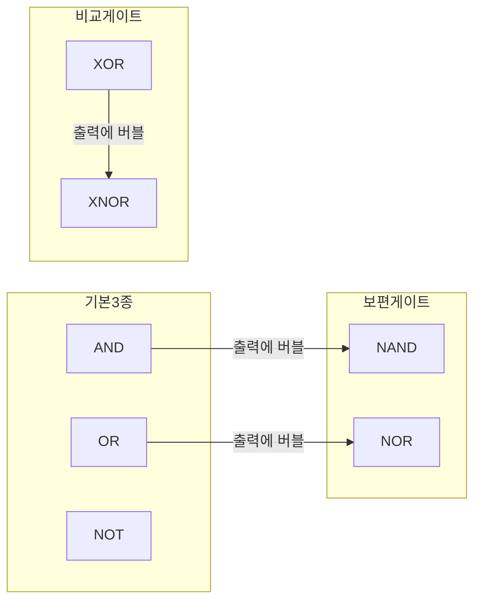

<Callout type="info">
  **이번 문서의 목표:** 이 파일을 다 읽으면 불 대수(Boolean algebra) 기본 법칙의 이름과 수식을 구분해서 말할 수 있고, 그 법칙을 한 줄씩 적용해 논리식을 손으로 간소화할 수 있으며, AND·OR·NOT·NAND·NOR·XOR·XNOR 7가지 게이트의 진리표를 그릴 수 있다.
</Callout>

## 왜 불 대수가 필요한가

03편에서 불 변수(Boolean variable)는 0 또는 1 두 값만 가진다는 것, AND·OR·NOT 세 기본 연산과 진리표(truth table)를 읽는 법을 배웠다. 진리표는 함수의 동작을 빠짐없이 보여주지만, 그 자체로는 회로를 어떻게 만들지 알려주지 않는다. 논리식(logic expression)으로 옮기면 게이트를 몇 개 써야 하는지, 어떤 게이트를 골라야 하는지 계산할 수 있다.

문제는 같은 동작을 하는 논리식이 여러 가지 형태로 존재한다는 점이다. 예를 들어 $A + AB$ 라는 식과 $A$ 라는 식은 완전히 같은 동작을 한다(뒤에서 직접 증명한다). 그런데 앞의 식은 게이트가 2개(OR, AND) 필요하고 뒤의 식은 게이트가 0개, 즉 그냥 배선만 있으면 된다. **불 대수**(Boolean algebra)는 이렇게 형태가 다르지만 동작이 같은 두 식을 서로 바꿔 쓸 수 있게 해주는 대수적 규칙의 집합이다. 이 규칙들을 순서대로 적용하면 복잡한 식을 게이트 수가 더 적은 식으로 바꿀 수 있는데, 이 작업을 **간소화**(minimization)라고 부른다.

> **쉽게 말하면:** 불 대수는 "이 모양의 식은 항상 저 모양의 식과 똑같이 동작한다"는 교환 규칙표다. 그 규칙을 순서대로 쓰면 복잡한 식을 더 짧은 식으로 바꿀 수 있다.

독학사 논리회로 시험에서는 "다음 식을 간소화하면?"이라는 유형이 자주 나오는데, 답만 맞히는 게 아니라 **어떤 법칙을 어떤 순서로 적용했는지**를 스스로 검증할 수 있어야 실수 없이 정답을 고를 수 있다. 그래서 이 편에서는 모든 간소화 예제마다 적용한 법칙 이름을 한 줄씩 적는다.

## 불 대수의 기본 법칙 12가지

> **쉽게 말하면:** 아래 표의 각 줄은 "왼쪽 식은 항상 오른쪽 식과 같다"는 뜻이다. 나중에 간소화할 때 이 표의 이름을 그대로 인용하게 된다.

불 대수는 일반 대수(덧셈·곱셈)와 형태는 비슷하지만 값이 0과 1 두 개뿐이라는 점에서 다르게 동작하는 법칙이 섞여 있다. 아래 표에서 `+`는 OR(논리합), `·`는 AND(논리곱, 종종 생략해서 $AB$로 씀), `'`는 NOT(보수, complement)을 뜻한다.

| 번호 | 법칙 이름(영문) | OR 형태 | AND 형태 |
|---|---|---|---|
| 1 | 항등법칙(identity law) | $A + 0 = A$ | $A \cdot 1 = A$ |
| 2 | 영원법칙(null law) | $A + 1 = 1$ | $A \cdot 0 = 0$ |
| 3 | 멱등법칙(idempotent law) | $A + A = A$ | $A \cdot A = A$ |
| 4 | 보수법칙(complement law) | $A + A' = 1$ | $A \cdot A' = 0$ |
| 5 | 교환법칙(commutative law) | $A + B = B + A$ | $AB = BA$ |
| 6 | 결합법칙(associative law) | $(A+B)+C = A+(B+C)$ | $(AB)C = A(BC)$ |
| 7 | 분배법칙(distributive law) | $A(B+C) = AB + AC$ | $A+BC = (A+B)(A+C)$ |
| 8 | 흡수법칙(absorption law) | $A + AB = A$ | $A(A+B) = A$ |
| 9 | 이중부정(double negation, involution) | $(A')' = A$ | — |
| 10 | 드모르간 법칙 1(De Morgan's law) | $(A+B)' = A' \cdot B'$ | — |
| 11 | 드모르간 법칙 2(De Morgan's law) | $(AB)' = A' + B'$ | — |
| 12 | 흡수법칙 변형(absorption variant) | $A + A'B = A + B$ | $A(A'+B) = AB$ |

이 중 낯선 것은 두 가지다. **분배법칙의 AND-형태**($A+BC=(A+B)(A+C)$)는 일반 대수에는 없는 규칙이다(일반 대수에서 $a+bc$는 $(a+b)(a+c)$와 같지 않다). 이는 값이 0과 1뿐이라서 성립하는 불 대수 고유의 성질이다. **드모르간 법칙**(De Morgan's law)은 OR과 AND, 그리고 보수를 서로 바꿔주는 규칙으로, "괄호를 풀면서 연산자가 뒤집히고 각 변수에 보수가 붙는다"고 외운다.

### 진리표로 직접 검증하기: 드모르간 법칙

법칙을 외우기 전에 진리표로 왜 성립하는지 확인하는 습관이 시험에서 실수를 줄여준다. $(A+B)' = A'B'$ 를 검증해보자.

| A | B | A+B | (A+B)' | A' | B' | A'B' |
|---|---|---|---|---|---|---|
| 0 | 0 | 0 | 1 | 1 | 1 | 1 |
| 0 | 1 | 1 | 0 | 1 | 0 | 0 |
| 1 | 0 | 1 | 0 | 0 | 1 | 0 |
| 1 | 1 | 1 | 0 | 0 | 0 | 0 |

$(A+B)'$ 열과 $A'B'$ 열이 네 행 모두 정확히 일치한다. 두 논리식의 진리표가 모든 입력 조합에서 완전히 같으면, 그 두 식은 **논리적으로 동일**(logically equivalent)하다고 말한다. 불 대수의 모든 법칙은 이런 식으로 진리표를 대조해서 증명된 것이다.

### 자주 틀리는 점: 드모르간 법칙 적용 실수

- $(AB)'$ 를 $A'B'$ 로 잘못 계산하는 경우가 가장 많다. 올바른 결과는 $A' + B'$ 다(AND가 OR로 바뀐다는 것을 빠뜨리면 안 된다).
- 세 변수 이상일 때도 규칙은 그대로 확장된다. $(A+B+C)' = A'B'C'$, $(ABC)' = A'+B'+C'$ 이다. 변수가 늘어나도 "연산자를 뒤집고 각 변수에 보수를 붙인다"는 원리는 동일하다.
- 분배법칙의 AND-형태($A+BC=(A+B)(A+C)$)를 아예 없는 규칙이라 생각하고 못 쓰는 경우가 있다. 진리표로 검증해보면 $A=1$일 때 좌변은 1, 우변은 $(1)(1)=1$로 같고, $A=0$일 때 좌변은 $BC$, 우변은 $(B)(C)=BC$로 같아서 항상 성립한다.

## 법칙을 줄마다 적용해 간소화하기: 예제 1

> **쉽게 말하면:** 간소화는 한 번에 답이 나오는 게 아니라, 법칙을 하나씩 적용해 식을 조금씩 짧게 만들어가는 과정이다.

다음 식을 간소화해보자.

$$
F = A'BC + A'BC' + AB
$$

<Steps>

### 1단계: 공통 인수로 묶는다

$A'BC$와 $A'BC'$에는 $A'B$가 공통으로 들어 있다. 분배법칙(distributive law)을 거꾸로 적용해(공통 인수를 밖으로 꺼내는 방향) 묶는다.

$$
F = A'B(C + C') + AB
$$

### 2단계: 보수법칙을 적용한다

$C + C' = 1$은 보수법칙(complement law)이다.

$$
F = A'B \cdot 1 + AB
$$

### 3단계: 항등법칙을 적용한다

$A'B \cdot 1 = A'B$는 항등법칙(identity law)이다.

$$
F = A'B + AB
$$

### 4단계: 다시 공통 인수로 묶는다

이번에는 $B$가 공통이다. 분배법칙(distributive law)을 적용한다.

$$
F = B(A' + A)
$$

### 5단계: 보수법칙을 적용한다

$A' + A = 1$은 보수법칙(complement law)이다.

$$
F = B \cdot 1
$$

### 6단계: 항등법칙을 적용해 마무리한다

$B \cdot 1 = B$는 항등법칙(identity law)이다.

$$
F = B
$$

</Steps>

**결과 해석**: 원래 식은 3항 AND-OR 구조라 3입력 AND 게이트 2개, 2입력 AND 게이트 1개, 3입력 OR 게이트 1개가 필요했다. 간소화된 결과 $F=B$는 게이트가 **전혀 필요 없다**. 입력 $B$를 그대로 배선만 연결하면 끝이다. 이렇게 극단적으로 줄어드는 경우가 실제로 존재하며, 시험에서는 이런 함정을 통해 "식을 끝까지 정리했는지"를 확인한다.

## 법칙을 줄마다 적용해 간소화하기: 예제 2 — 흡수법칙 유도

흡수법칙 $A + AB = A$ (표의 8번)를 그냥 외우면 "왜 그런지"를 놓치기 쉽다. 기본 법칙만으로 유도해보자.

<Steps>

### 1단계: A에 1을 곱해도 값이 그대로다

항등법칙(identity law)의 역방향인 $A = A \cdot 1$을 이용해 $A$를 인위적으로 늘린다.

$$
A + AB = A \cdot 1 + AB
$$

### 2단계: 공통 인수 A로 묶는다

분배법칙(distributive law)을 적용한다.

$$
A \cdot 1 + AB = A(1 + B)
$$

### 3단계: 영원법칙을 적용한다

$1 + B = 1$은 영원법칙(null law)이다(OR 연산에서 한쪽이 이미 1이면 결과는 항상 1이다).

$$
A(1+B) = A \cdot 1
$$

### 4단계: 항등법칙으로 마무리한다

$$
A \cdot 1 = A
$$

</Steps>

이렇게 유도 과정을 한 번 손으로 짚어보면, 흡수법칙 자체를 몰라도 항등·분배·영원법칙만으로 즉석에서 재현할 수 있다. 시험 중 법칙 이름이 헷갈릴 때 이 방법이 안전망이 된다.

### 자주 틀리는 점: 간소화 도중 법칙을 건너뛰기

- 여러 단계를 암산으로 한 번에 처리하다가 부호나 항을 빠뜨리는 실수가 가장 흔하다. **한 줄에 법칙 하나씩** 적용하는 습관을 들이면 검산이 쉬워진다.
- 분배법칙을 "묶는 방향"으로만 알고 "펼치는 방향"($A(B+C) \to AB+AC$)은 놓치는 경우가 있다. 간소화 문제는 두 방향을 모두 자유롭게 오가야 풀린다.
- 흡수법칙 변형($A + A'B = A+B$, 표의 12번)을 흡수법칙 원형($A+AB=A$)과 혼동해 잘못 적용하는 경우가 많다. 변형은 **보수가 붙어 있을 때**만 쓰는 규칙이다.

## 기본 논리게이트 7종: 기호와 진리표

> **쉽게 말하면:** 게이트(gate)는 불 대수의 연산 하나하나를 실제 전자 부품으로 구현한 것이다. 식으로 쓰면 연산자고, 회로도로 그리면 게이트다.

03편에서 AND·OR·NOT 세 가지를 다뤘다. 이번에는 실제 회로 설계·시험에서 반드시 나오는 4가지를 추가해 총 7종을 정리한다. 게이트 기호는 실제 시험에서 그림으로 나오므로, 여기서는 모양의 특징을 말로 정확히 짚어둔다.

### AND 게이트 — 모두 1이어야 1

| A | B | Y = AB |
|---|---|---|
| 0 | 0 | 0 |
| 0 | 1 | 0 |
| 1 | 0 | 0 |
| 1 | 1 | 1 |

기호는 평평한 왼쪽 변에 둥근 오른쪽 끝(D자 모양)을 가진다. 생활 비유로는 "출입문 두 개를 모두 통과해야만 방에 들어갈 수 있는" 조건과 같다.

### OR 게이트 — 하나라도 1이면 1

| A | B | Y = A+B |
|---|---|---|
| 0 | 0 | 0 |
| 0 | 1 | 1 |
| 1 | 0 | 1 |
| 1 | 1 | 1 |

기호는 왼쪽이 오목하게 파인 방패 모양이다. "두 스위치 중 하나만 눌러도 불이 켜지는" 회로가 OR의 비유다.

### NOT 게이트 — 값을 뒤집는다

| A | Y = A' |
|---|---|
| 0 | 1 |
| 1 | 0 |

삼각형 기호 끝에 작은 원(버블, bubble)이 붙는다. 이 버블은 이후 NAND·NOR·XNOR 기호에서도 "보수를 취한다"는 뜻으로 계속 등장한다.

### NAND 게이트 — AND에 버블을 붙인 것

**NAND**(Not-AND)는 AND 뒤에 NOT을 붙인 것과 같다. 기호는 AND 게이트와 똑같이 생기고 출력 끝에만 버블이 붙는다.

$$
Y = (AB)'
$$

| A | B | AB | Y = (AB)' |
|---|---|---|---|
| 0 | 0 | 0 | 1 |
| 0 | 1 | 0 | 1 |
| 1 | 0 | 0 | 1 |
| 1 | 1 | 1 | 0 |

### NOR 게이트 — OR에 버블을 붙인 것

**NOR**(Not-OR)는 OR 뒤에 NOT을 붙인 것이다.

$$
Y = (A+B)'
$$

| A | B | A+B | Y = (A+B)' |
|---|---|---|---|
| 0 | 0 | 0 | 1 |
| 0 | 1 | 1 | 0 |
| 1 | 0 | 1 | 0 |
| 1 | 1 | 1 | 0 |

### XOR 게이트 — 서로 다르면 1

**XOR**(eXclusive OR, 배타적 논리합)은 두 입력이 서로 다를 때만 1이 된다. 기호는 OR 기호 왼쪽에 곡선이 하나 더 그어진 모양이다.

$$
Y = A \oplus B = AB' + A'B
$$

| A | B | Y = A⊕B |
|---|---|---|
| 0 | 0 | 0 |
| 0 | 1 | 1 |
| 1 | 0 | 1 |
| 1 | 1 | 0 |

### XNOR 게이트 — 같으면 1

**XNOR**(eXclusive NOR)는 XOR의 보수, 즉 두 입력이 서로 같을 때 1이 된다("일치 검사" 회로로도 불린다).

$$
Y = (A \oplus B)' = AB + A'B'
$$

| A | B | Y = (A⊕B)' |
|---|---|---|
| 0 | 0 | 1 |
| 0 | 1 | 0 |
| 1 | 0 | 0 |
| 1 | 1 | 1 |

## NAND와 NOR가 "보편 게이트"라 불리는 이유

> **쉽게 말하면:** NAND 하나만 충분히 있으면 AND·OR·NOT을 전부 만들 수 있다. 그래서 실제 반도체 칩은 NAND(또는 NOR) 하나만 대량 생산해 회로를 구성하는 경우가 많다.

**보편 게이트**(universal gate)란 그 게이트 하나만으로 AND·OR·NOT 세 가지 기본 연산을 모두 구현할 수 있는 게이트를 말한다. NAND와 NOR가 여기에 해당한다. NAND로 세 연산을 만드는 방법은 다음과 같다.

| 만들고 싶은 연산 | NAND만으로 구성하는 방법 | 검증 |
|---|---|---|
| NOT A | A와 A를 같은 NAND의 두 입력에 넣는다 | $(AA)' = A'$ (멱등법칙으로 $AA=A$이므로 $(AA)'=A'$) |
| A AND B | NAND 출력을 다시 NOT(=자기 자신을 NAND)한다 | $((AB)')' = AB$ (이중부정) |
| A OR B | A, B 각각을 NOT한 뒤 NAND에 넣는다 | $(A'B')' = A+B$ (드모르간 법칙) |

세 번째 줄이 드모르간 법칙의 실제 응용 사례다. $A'$와 $B'$를 NAND에 넣으면 $(A'B')'$이 되는데, 드모르간 법칙에 의해 이는 $A+B$와 같다. 즉 **NAND 게이트 배치만으로 OR 게이트의 동작을 만들어낸 것**이다. 이 원리 덕분에 실제 집적회로(IC) 생산에서는 게이트 종류를 통일해 제조 공정을 단순화할 수 있다.

### 자주 틀리는 점

- NAND와 NOR는 교환법칙은 성립하지만 **결합법칙은 성립하지 않는다**. $(A \text{ NAND } B) \text{ NAND } C$ 는 $A \text{ NAND } (B \text{ NAND } C)$ 와 다르다. AND·OR만 결합법칙이 성립한다.
- XOR을 "OR인데 조금 다른 것" 정도로 어림잡아 계산하다가 $A=B=1$인 경우를 놓치는 실수가 많다. XOR은 두 입력이 **같으면 반드시 0**이다.
- 버블(작은 원)이 게이트의 입력 쪽에 붙는지 출력 쪽에 붙는지 혼동하면 안 된다. NAND·NOR·XNOR·NOT은 모두 **출력 쪽**에 버블이 붙어 "연산 후 결과를 뒤집는다"는 뜻을 나타낸다.

## 핵심 정리

- 불 대수 12가지 기본 법칙(항등·영원·멱등·보수·교환·결합·분배·흡수·이중부정·드모르간 등) 각각의 정확한 이름과 수식을 구분해서 말할 수 있어야 하며, 간소화 과정에서는 한 줄마다 어떤 법칙을 적용했는지 명시해야 실수를 줄일 수 있다.
- 분배법칙의 AND-형태($A+BC=(A+B)(A+C)$)와 드모르간 법칙(괄호를 풀며 연산자가 뒤집히고 각 변수에 보수가 붙음)은 특히 자주 틀리는 지점이다.
- 기본 게이트는 AND·OR·NOT 3종에 NAND·NOR·XOR·XNOR 4종을 더해 총 7종이며, NAND·NOR는 그 자체만으로 AND·OR·NOT을 전부 구현할 수 있는 보편 게이트(universal gate)다.

## 마무리 복습

<Quiz
  questionNumber={1}
  question="분배법칙(distributive law)의 두 가지 형태 중, 일반 대수에는 존재하지 않고 불 대수에서만 성립하는 형태는?"
  options={['A(B+C) = AB + AC', 'A + BC = (A+B)(A+C)', 'A + B = B + A', '(AB)C = A(BC)']}
  correctAnswer={2}
  explanation="일반 대수에서 a+bc는 (a+b)(a+c)와 같지 않지만, 값이 0과 1뿐인 불 대수에서는 A+BC=(A+B)(A+C)가 항상 성립한다. 이는 진리표로 직접 확인할 수 있다."
  optionExplanations={['이는 일반 대수의 분배법칙과 동일한 형태(곱셈이 덧셈에 분배)로, 불 대수에만 있는 특수한 형태가 아니다', '정답이다. AND가 OR에 분배되는 이 형태는 일반 대수에는 없는 불 대수 고유의 성질이다', '이것은 교환법칙에 대한 설명이다', '이것은 결합법칙에 대한 설명이다']}
/>

<Quiz
  questionNumber={2}
  question="드모르간 법칙(De Morgan's law)에 따라 (AB)'을 올바르게 전개한 것은?"
  options={['A′B′', 'A′ + B′', 'AB', '(A′)(B′)′']}
  correctAnswer={2}
  explanation="드모르간 법칙에 의해 괄호를 풀면 AND가 OR로 바뀌고 각 변수에 보수가 붙으므로 (AB)' = A' + B'가 된다."
  optionExplanations={['AND를 OR로 바꾸지 않고 그대로 둔 잘못된 전개다. 이는 (A+B) 전체를 보수 취했을 때의 결과다', '정답이다. AND가 OR로 바뀌고 각 변수에 보수가 붙는다', '보수를 전혀 적용하지 않은 원래 AND 식과 같아 틀렸다', '불필요하게 복잡한 형태이며 드모르간 법칙의 결과와 일치하지 않는다']}
/>

<Quiz
  questionNumber={3}
  question="F = A + A'B를 간소화한 결과와 이때 적용되는 법칙으로 옳은 것은?"
  options={['F = A, 멱등법칙', 'F = A + B, 흡수법칙 변형', 'F = AB, 분배법칙', 'F = A′B, 보수법칙']}
  correctAnswer={2}
  explanation="흡수법칙의 변형(A + A'B = A + B)을 적용하면 F = A + B로 간소화된다. 이는 A = A(B+B')로 늘린 뒤 분배·보수·항등법칙을 순서대로 적용해도 같은 결과가 나온다."
  optionExplanations={['A + A′B는 A 하나로 줄어들지 않는다. B가 남는다', '정답이다. 흡수법칙 변형에 의해 A + A′B = A + B다', '이 식은 곱셈(AND) 형태가 아니라 덧셈(OR) 형태로 남는다', '보수법칙은 A와 A′이 함께 있을 때 곱하거나 더하는 경우에 적용되며 이 식의 최종 결과가 아니다']}
/>

<Quiz
  questionNumber={4}
  question="NAND 게이트만 사용해서 NOT 게이트를 만드는 방법으로 옳은 것은?"
  options={['NAND의 두 입력에 각각 A와 0을 연결한다', 'NAND의 두 입력에 모두 A를 연결한다', 'NAND의 두 입력에 각각 A와 1을 연결한다', 'NAND 두 개를 직렬로 연결하고 입력은 A와 B를 따로 넣는다']}
  correctAnswer={2}
  explanation="NAND의 두 입력에 같은 신호 A를 넣으면 (AA)'가 되는데, 멱등법칙에 의해 AA=A이므로 결과는 A'가 되어 NOT 게이트와 동일하게 동작한다."
  optionExplanations={['이 경우 (A·0)′ = 1이 되어 입력과 무관하게 항상 1을 출력하므로 NOT이 아니다', '정답이다. 두 입력을 같게 묶으면 멱등법칙에 의해 NAND가 NOT처럼 동작한다', '이 경우 (A·1)′ = A′가 되어 결과적으로는 NOT과 같아 보이지만, 표준적으로 가르치는 방법은 두 입력을 A로 묶는 방식이며 이 보기는 항등법칙 경로를 거친 변형이다', '이는 서로 다른 두 입력을 그대로 사용하는 구성으로 NOT 게이트가 아니라 NAND 자체의 동작이다']}
/>

<Quiz
  questionNumber={5}
  question="XOR 게이트에 대한 설명으로 옳지 않은 것은?"
  options={['두 입력이 서로 다를 때 출력이 1이다', '두 입력이 모두 1이면 출력은 0이다', '두 입력이 모두 0이면 출력은 1이다', 'XOR의 보수를 취하면 XNOR가 된다']}
  correctAnswer={3}
  explanation="XOR은 두 입력이 서로 다를 때만 1이다. 두 입력이 모두 0이면 서로 같으므로 출력은 0이며, 1이라는 설명은 옳지 않다."
  optionExplanations={['옳은 설명이다. XOR의 정의 그대로다', '옳은 설명이다. 두 입력이 같으면(모두 1 포함) 출력은 0이다', '정답이다(옳지 않은 설명). 두 입력이 모두 0이면 서로 같으므로 출력은 0이어야 하는데 1이라고 잘못 서술했다', '옳은 설명이다. XNOR는 정의상 XOR의 보수다']}
/>

<Quiz
  questionNumber={6}
  question="NAND 게이트와 NOR 게이트에 대해 결합법칙(associative law)이 성립하지 않는 이유를 가장 잘 설명한 것은?"
  options={['NAND와 NOR는 교환법칙조차 성립하지 않기 때문이다', '연산 결과에 보수(NOT)가 씌워져 있어 괄호 위치를 바꾸면 어느 단계에서 보수가 적용되는지가 달라지기 때문이다', 'NAND와 NOR는 입력이 2개를 초과할 수 없기 때문이다', '결합법칙은 원래 OR 연산에만 정의되는 개념이기 때문이다']}
  correctAnswer={2}
  explanation="AND와 OR는 결합법칙이 성립하지만, NAND·NOR는 매번 결과에 보수를 씌우므로 (A NAND B) NAND C와 A NAND (B NAND C)에서 보수가 적용되는 시점과 범위가 달라져 서로 다른 결과가 나올 수 있다."
  optionExplanations={['NAND와 NOR는 두 입력을 바꿔도 결과가 같으므로 교환법칙은 성립한다', '정답이다. 매 단계마다 보수가 끼어들어 괄호 위치에 따라 결과가 달라진다', '입력 개수 제한은 결합법칙 성립 여부와 직접적인 관련이 없다', '결합법칙은 AND에도 정의되며 OR에만 국한된 개념이 아니다']}
/>

## 참고 자료

- [국가평생교육진흥원 독학학위제 - 평가영역](https://bdes.nile.or.kr)
- [IEEE Standards](https://standards.ieee.org)
