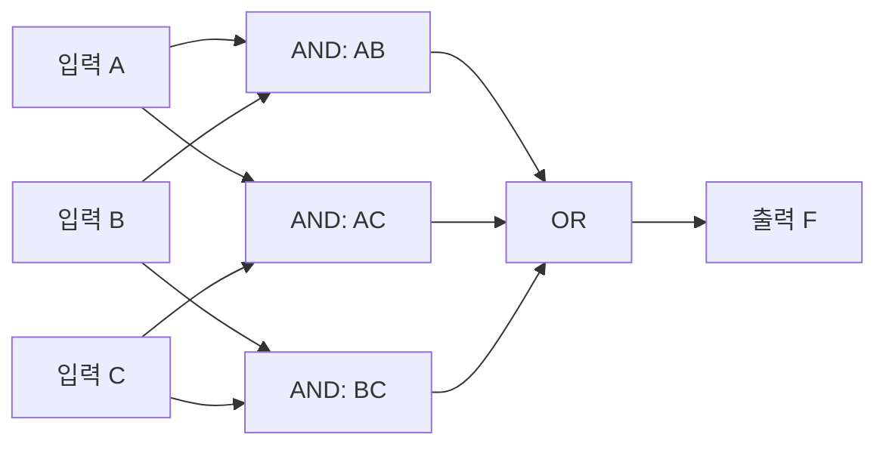

<Callout type="info">
  **이번 문서의 목표:** 이 문서를 다 읽으면 조합회로와 순차회로를 구분하는 기준을 설명하고, 말로 주어진 설계 문제에서 진리표를 뽑아 불 함수를 세우고 간소화해 회로도까지 그리는 절차를 순서대로 적용할 수 있다.
</Callout>

## 왜 "조합"과 "순차"를 나누는가

09편부터 13편까지는 개별 게이트와 불 함수 간소화를 다뤘다. 이제부터는 그 게이트들을 실제로 "조합해서" 쓸모 있는 회로를 만드는 단계로 넘어간다. 그런데 디지털 회로는 크게 두 갈래로 나뉜다. 하나는 이번 편부터 다룰 **조합논리회로**(combinational logic circuit)이고, 다른 하나는 18편 이후에 다룰 **순차논리회로**(sequential logic circuit)다. 이 둘을 명확히 구분하지 못하면 시험에서 "다음 중 조합회로가 아닌 것은?" 같은 문제를 틀리기 쉽고, 이후 회로 설계 절차 자체가 어느 쪽에 해당하는지 헷갈리게 된다.

**조합논리회로**는 **현재 입력값만으로 출력이 즉시 결정되는 회로**다. 과거에 어떤 입력이 있었는지, 지금이 어떤 "상태"인지는 전혀 영향을 주지 않는다. 반면 **순차논리회로**는 현재 입력뿐 아니라 **과거의 상태(기억된 값**)까지 함께 고려해 출력이 결정되는 회로다. 순차회로는 내부에 정보를 저장하는 소자(18편에서 배울 플립플롭)를 가지고 있어야 하며, 그래서 "기억 능력이 있는 회로"라고도 부른다.

> **쉽게 말하면:** 조합회로는 "지금 입력이 무엇이냐"만 보고 답을 내는 계산기이고, 순차회로는 "지금까지 무슨 일이 있었냐"까지 기억해서 답을 내는 회로다.

생활 속 비유로는, 조합회로는 자동판매기의 "지금 넣은 금액과 누른 버튼만 보고 즉시 상품을 내보내는 부분"과 같고, 순차회로는 "지금까지 넣은 금액을 누적해서 기억하고 있다가 충분히 모이면 상품을 내보내는 부분"과 같다. 조합회로에는 "누적"이라는 개념 자체가 없다.

## 조합회로와 순차회로 구분 기준 정리

<table>
<thead><tr><th>구분 기준</th><th>조합논리회로</th><th>순차논리회로</th></tr></thead>
<tbody>
<tr><td>출력을 결정하는 요소</td><td>현재 입력값뿐</td><td>현재 입력값 + 과거 상태(기억값)</td></tr>
<tr><td>내부 기억 소자</td><td>없음</td><td>있음(플립플롭 등)</td></tr>
<tr><td>같은 입력을 넣었을 때</td><td>항상 같은 출력</td><td>내부 상태에 따라 다른 출력이 나올 수 있음</td></tr>
<tr><td>대표 예시</td><td>가산기, 비교기, 디코더, 멀티플렉서</td><td>카운터, 레지스터, 상태머신</td></tr>
<tr><td>클럭(clock) 신호 필요 여부</td><td>일반적으로 불필요</td><td>대부분 클럭 신호로 동작 시점을 맞춤</td></tr>
</tbody>
</table>

이번 편과 15, 16, 17편에서 다룰 가산기·감산기·비교기·인코더·디코더·멀티플렉서·ROM/PLA/PAL은 모두 조합논리회로다. 이 회로들은 입력이 바뀌는 순간 출력도 즉시(회로의 물리적 지연시간만큼만 늦게) 바뀌며, 회로 안에 "이전에 무슨 입력이 들어왔었는지"를 기억하는 부분이 전혀 없다는 공통점을 가진다.

> **자주 틀리는 점:** "조합회로에는 클럭이 절대 없다"고 암기하면 안 된다. 정확한 기준은 **기억 소자(과거 상태를 저장하는 부분)의 유무**다. 클럭 신호는 순차회로에서 상태를 언제 갱신할지 맞추는 용도로 흔히 쓰이지만, 클럭 신호 자체의 존재 여부가 구분 기준은 아니다.

## 조합논리회로 설계 절차 (시험형 5단계)

말로 주어진 설계 문제를 실제 회로도까지 완성하는 절차는 항상 다음 다섯 단계를 따른다. 독학사 시험에서는 이 절차 중 일부 단계(진리표 작성, 불 함수 도출, 간소화)만 떼어 물어보는 경우가 많으므로, 전체 흐름 속에서 각 단계가 어떤 입력과 출력을 주고받는지 명확히 알아두어야 한다.

<Steps>

1. **문제 정의: 입력과 출력을 명확히 한다.** 몇 개의 입력 변수가 있는지, 각 입력이 무엇을 의미하는지, 출력은 몇 개이고 각각 무엇을 뜻하는지 문장에서 뽑아낸다. 입력 변수의 개수 $n$이 정해지면 진리표의 행 개수는 $2^n$개로 정해진다.
2. **진리표 작성: 모든 입력 조합에 대한 출력을 채운다.** 입력 변수의 모든 조합(2진수로 0부터 $2^n-1$까지)을 빠짐없이 나열하고, 문제 조건에 따라 각 행의 출력값을 채운다.
3. **불 함수 도출: 진리표에서 SOP 또는 POS를 뽑는다.** 10편에서 배운 대로, 출력이 1인 행들의 최소항을 모두 더하면 표준 SOP가 되고, 출력이 0인 행들의 최대항을 모두 곱하면 표준 POS가 된다.
4. **간소화: 카르노맵이나 퀴인-맥클러스키로 최소식을 구한다.** 표준형은 게이트 수가 많아 비효율적이므로, 11~13편에서 배운 방법으로 최소 SOP 또는 최소 POS를 구한다.
5. **회로도 작성: 최소식을 게이트로 옮긴다.** 간소화된 식에 등장하는 각 리터럴과 연산자를 AND·OR·NOT(또는 필요하면 NAND·NOR) 게이트로 바꾸어 회로도를 그린다. 입력 변수 각각에서 출발해 최종 출력까지 신호가 이어지는지 확인한다.

</Steps>

## 설계 절차 실전 적용: 다수결 회로

이제 실제 문제 하나를 처음부터 끝까지 다섯 단계로 풀어본다.

**문제**: 세 명의 위원 $A$, $B$, $C$가 찬성(1) 또는 반대(0)에 투표한다. **과반수(2명 이상)가 찬성**하면 출력 $F$가 1이 되는 회로를 설계하라.

**1단계 — 문제 정의**: 입력은 $A$, $B$, $C$ 세 개(각 위원의 찬반), 출력은 $F$ 하나(과반수 찬성 여부)다. 입력이 3개이므로 진리표는 $2^3 = 8$행이다.

**2단계 — 진리표 작성**: 세 입력 중 1(찬성)이 2개 이상이면 $F=1$이 되도록 채운다.

| A | B | C | 찬성 인원 | F |
|---|---|---|---|---|
| 0 | 0 | 0 | 0명 | 0 |
| 0 | 0 | 1 | 1명 | 0 |
| 0 | 1 | 0 | 1명 | 0 |
| 0 | 1 | 1 | 2명 | 1 |
| 1 | 0 | 0 | 1명 | 0 |
| 1 | 0 | 1 | 2명 | 1 |
| 1 | 1 | 0 | 2명 | 1 |
| 1 | 1 | 1 | 3명 | 1 |

**3단계 — 불 함수 도출**: 출력이 1인 행은 $011, 101, 110, 111$, 즉 최소항 번호로 3, 5, 6, 7이다. 표준 SOP는 다음과 같다.

$$
F = \bar{A}BC + A\bar{B}C + AB\bar{C} + ABC
$$

**4단계 — 간소화**: 이 함수를 3변수 카르노맵에 배치하면(가로축 $BC$를 $00, 01, 11, 10$ 순서, 세로축 $A$를 $0, 1$ 순서로 그린다), 1이 채워지는 칸은 $A=0,BC=11$(최소항 3), $A=1,BC=01$(최소항 5), $A=1,BC=11$(최소항 7), $A=1,BC=10$(최소항 6)이다. 이 네 칸을 두 개의 2칸 묶음으로 짝지어 보면 다음과 같이 간소화된다.

- 최소항 (3, 7)을 묶으면 $A$가 0과 1로 바뀌고 $B=1, C=1$은 고정 → $BC$
- 최소항 (5, 7)을 묶으면 $B$가 0과 1로 바뀌고 $A=1, C=1$은 고정 → $AC$
- 최소항 (6, 7)을 묶으면 $C$가 0과 1로 바뀌고 $A=1, B=1$은 고정 → $AB$

세 묶음을 합치면 최소 SOP는 다음과 같다.

$$
F = AB + AC + BC
$$

원래 표준 SOP는 4개 항, 각 항마다 3개 리터럴(총 12리터럴 + AND 게이트 4개 + OR 게이트 1개)이 필요했지만, 최소식은 3개 항, 각 항마다 2개 리터럴(총 6리터럴 + AND 게이트 3개 + OR 게이트 1개)로 절반 가까이 줄었다. 이렇게 간소화 단계를 거치면 실제 게이트 개수와 배선이 크게 줄어든다.

**5단계 — 회로도 작성**: 최소식 $F = AB + AC + BC$는 AND 게이트 3개(각각 $AB$, $AC$, $BC$를 계산)와 OR 게이트 1개(세 결과를 더함)로 구현된다.

이 회로는 흔히 **다수결 회로**(majority circuit) 또는 **다수결 게이트**라고 부르며, 15편에서 배울 전가산기(full adder) 내부의 캐리 출력 계산에도 똑같은 형태($AB + BC_{in} + AC_{in}$)로 다시 등장한다.

> **쉽게 말하면:** 다수결 회로는 "세 입력 중 두 개 이상이 짝을 이루어 1이면 출력도 1"이 되는 회로이며, 세 쌍의 AND 결과를 OR로 합치는 형태로 항상 표현된다.

## 간소화가 항상 유일하지 않을 수도 있다는 점

카르노맵에서 묶는 방법에 따라 서로 다른(하지만 리터럴 개수는 같은) 최소식이 나올 수도 있다. 예를 들어 위 예제에서 최소항 (3,7)을 (2,3) 대신 (3,7)로 묶은 것처럼, 어떤 묶음을 선택하느냐에 따라 겉보기 식이 달라 보일 수 있다. 하지만 **리터럴 총 개수와 항의 개수가 같다면 두 식은 논리적으로 동일**하며, 시험에서는 선택지에 있는 여러 형태의 식이 모두 참일 수 있으니 항상 진리표로 검산해 판단해야 한다.

## 자주 틀리는 점

- **조합회로 여부를 "게이트만 있으면 조합회로"로 단순화하는 실수**: 플립플롭 같은 기억 소자가 전혀 없어야 조합회로다. 게이트만으로 이루어진 회로라도 그 출력이 되먹임(피드백)되어 회로 내부에 상태를 저장하는 구조라면 순차회로로 분류될 수 있다(19편에서 다루는 래치가 그런 예다).
- **진리표를 만들 때 입력 조합을 빠뜨리는 실수**: 입력이 $n$개면 반드시 $2^n$행을 모두 채워야 한다. 문제 조건에 없는 조합이라고 임의로 행을 생략하면 안 되고, 그런 경우는 12편에서 배운 don't care로 표시해야 한다.
- **표준 SOP를 최종 답으로 제출하는 실수**: 표준형은 검산용 중간 단계일 뿐, 실제 회로 설계의 최종 답은 반드시 간소화(4단계)를 거친 최소식이어야 한다.
- **간소화된 식의 리터럴을 세지 않고 회로도를 그리는 실수**: 회로도를 그리기 전에 최소식에 등장하는 리터럴과 연산자 개수를 세어, 필요한 게이트 개수(AND 게이트 개수 = 곱항 개수, OR 게이트 입력 개수 = 항의 개수)를 먼저 파악하면 실수를 줄일 수 있다.

## 핵심 정리

- 조합논리회로는 현재 입력값만으로 출력이 정해지는 회로이고, 순차논리회로는 과거 상태(기억값)까지 함께 고려하는 회로다.
- 조합회로 설계는 문제 정의 → 진리표 작성 → 불 함수 도출(표준 SOP/POS) → 간소화(카르노맵 또는 퀴인-맥클러스키) → 회로도 작성의 다섯 단계를 항상 같은 순서로 따른다.
- 다수결 회로 예제에서 표준 SOP $\bar{A}BC + A\bar{B}C + AB\bar{C} + ABC$는 간소화를 거쳐 $AB + AC + BC$가 되며, 이 형태는 이후 전가산기의 캐리 출력에도 그대로 재사용된다.
- 카르노맵 묶음 선택에 따라 겉보기 식이 달라 보여도 리터럴·항 개수가 같으면 논리적으로 동일한 식이다.

## 마무리 복습

<Quiz
  questionNumber={1}
  question="조합논리회로와 순차논리회로를 구분하는 가장 정확한 기준은?"
  options={['클럭 신호가 있는지 여부', '게이트의 개수가 많은지 여부', '과거 상태를 기억하는 소자가 있는지 여부', '입력 변수가 3개를 넘는지 여부']}
  correctAnswer={3}
  explanation="조합회로는 현재 입력만으로 출력이 정해지고 기억 소자가 없다. 순차회로는 플립플롭 같은 기억 소자를 이용해 과거 상태까지 함께 반영한다는 점이 핵심 구분 기준이다."
  optionExplanations={['클럭 신호는 순차회로에서 흔히 쓰이지만, 클럭 유무 자체가 절대적 구분 기준은 아니다.', '게이트 개수는 회로의 복잡도를 나타낼 뿐 조합·순차 구분과는 무관하다.', '정답. 기억 소자의 유무가 두 회로를 가르는 본질적인 기준이다.', '입력 변수 개수는 조합·순차 구분과 관계없다.']}
/>

<Quiz
  questionNumber={2}
  question="조합논리회로 설계 절차에서 진리표 작성 다음 단계는?"
  options={['회로도 작성', '카르노맵 간소화', '불 함수(표준 SOP 또는 POS) 도출', '문제 정의']}
  correctAnswer={3}
  explanation="설계 절차는 문제 정의, 진리표 작성, 불 함수 도출, 간소화, 회로도 작성 순서다. 진리표를 채운 다음에는 그 표에서 표준 SOP 또는 POS 형태의 불 함수를 뽑아내는 단계가 온다."
  optionExplanations={['회로도 작성은 간소화까지 끝난 마지막 단계이므로 순서를 건너뛴 오답이다.', '카르노맵 간소화는 불 함수를 먼저 도출한 다음에 하는 단계다.', '정답. 진리표 다음은 표준형 불 함수를 도출하는 단계다.', '문제 정의는 진리표 작성보다 앞선 첫 단계이므로 오답이다.']}
/>

<Quiz
  questionNumber={3}
  question="다수결 회로(세 입력 중 2개 이상이 1이면 출력 1)의 최소 SOP로 옳은 것은?"
  options={['AB + AC + BC', 'A + B + C', 'ABC', 'A xor B xor C']}
  correctAnswer={1}
  explanation="세 입력 중 두 개 이상이 1이 되는 경우를 카르노맵으로 간소화하면 세 쌍(AB, AC, BC)의 AND 결과를 OR로 합친 AB + AC + BC가 된다."
  optionExplanations={['정답. 두 개 이상이 1인 조건을 정확히 표현한 최소식이다.', 'A + B + C는 하나라도 1이면 1이 되는 식으로, 과반수 조건과 다르다(예: A=1,B=0,C=0에서도 1이 되어 틀림).', 'ABC는 세 명 모두 찬성해야만 1이 되므로 과반수 조건보다 훨씬 좁은 조건이다.', 'XOR 조합은 홀수 개가 1일 때 1이 되는 함수로, 과반수 조건과 다르다(예: 세 명 모두 찬성이면 다수결은 1이지만 XOR 결과는 상황에 따라 다르게 계산된다).']}
/>

<Quiz
  questionNumber={4}
  question="입력 변수가 4개인 조합회로의 진리표는 몇 개의 행을 가져야 하는가?"
  options={['4행', '8행', '16행', '32행']}
  correctAnswer={3}
  explanation="입력 변수가 n개면 각 변수가 0 또는 1의 두 가지 값을 가지므로 총 조합의 수는 2의 n제곱이다. n=4이므로 2의 4제곱인 16행이 필요하다."
  optionExplanations={['4행은 입력 변수 2개일 때의 행 수(2의 2제곱)다.', '8행은 입력 변수 3개일 때의 행 수(2의 3제곱)다.', '정답. 2의 4제곱은 16이므로 16행이 필요하다.', '32행은 입력 변수 5개일 때의 행 수(2의 5제곱)다.']}
/>

<Quiz
  questionNumber={5}
  question="표준 SOP 대신 반드시 간소화 단계를 거쳐야 하는 이유로 가장 적절한 것은?"
  options={['표준 SOP는 진리표와 일치하지 않기 때문에', '표준 SOP는 대체로 게이트 수와 리터럴 수가 많아 비효율적이기 때문에', '표준 SOP는 don t care를 표현할 수 없기 때문에', '표준 SOP는 카르노맵으로 그릴 수 없기 때문에']}
  correctAnswer={2}
  explanation="표준 SOP는 진리표와 항상 정확히 일치하지만, 출력이 1인 모든 최소항을 하나도 빠짐없이 나열하기 때문에 항의 개수와 리터럴 개수가 많아진다. 간소화는 이 비효율을 줄여 실제 회로에 쓸 게이트 수를 최소화하는 과정이다."
  optionExplanations={['표준 SOP는 정의상 진리표와 정확히 일치하는 식이므로 이 설명은 틀렸다.', '정답. 표준 SOP는 정확하지만 비효율적이라 간소화가 필요하다.', 'don t care 표현 가능 여부는 표준 SOP냐 간소화된 식이냐와 무관하며, 두 형태 모두 별도로 처리할 수 있다.', '표준 SOP도 카르노맵에 그대로 표시할 수 있다(1이 나오는 모든 칸을 채우는 것이 곧 표준 SOP의 시각화다).']}
/>

<Quiz
  questionNumber={6}
  question="조합논리회로 설계 절차에서 회로도를 그리기 직전 단계는?"
  options={['진리표 작성', '문제 정의', '간소화(최소식 도출)', '표준 SOP 도출']}
  correctAnswer={3}
  explanation="다섯 단계 순서는 문제 정의, 진리표 작성, 불 함수(표준형) 도출, 간소화, 회로도 작성이다. 회로도를 그리기 바로 전 단계는 카르노맵이나 퀴인-맥클러스키로 최소식을 구하는 간소화 단계다."
  optionExplanations={['진리표 작성은 두 번째 단계로, 회로도 작성보다 훨씬 앞선다.', '문제 정의는 첫 번째 단계다.', '정답. 간소화를 거친 최소식이 곧바로 회로도로 옮겨진다.', '표준 SOP 도출은 간소화보다 앞선 단계다.']}
/>

## 참고 자료

- [국가평생교육진흥원 독학학위제](https://bdes.nile.or.kr) — 독학사 논리회로 과목 평가영역·출제범위 공식 안내.
- [IEEE Standards Association](https://standards.ieee.org) — 디지털 논리 설계 관련 표준화 자료를 확인할 수 있는 공신력 있는 기관 자료.
