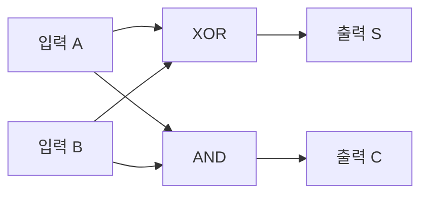
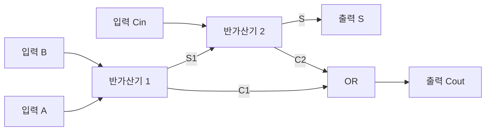
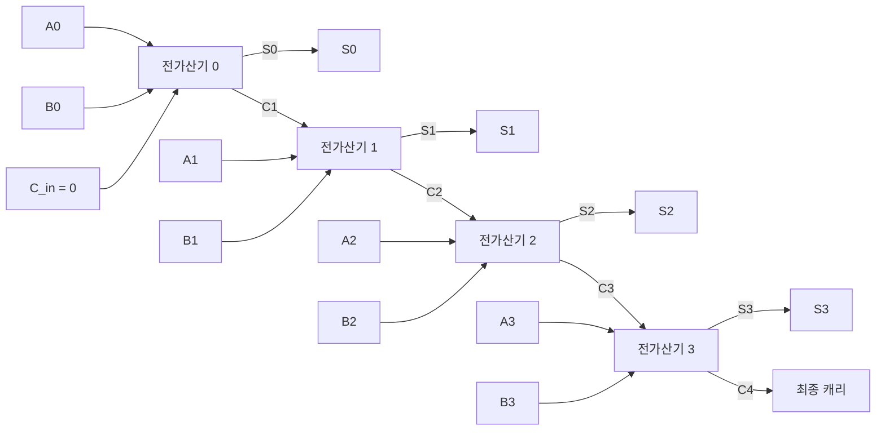

<Callout type="info">
  **이번 문서의 목표:** 이 문서를 다 읽으면 반가산기·전가산기의 진리표에서 합·캐리 식을 직접 유도하고, 여러 개의 전가산기를 연결한 병렬 가산기로 다중 비트 덧셈을 계산하며, 2의 보수를 이용한 뺄셈과 오버플로 판정까지 실제 숫자로 검산할 수 있다.
</Callout>

## 왜 회로로 덧셈을 해야 하는가

08편에서 2의 보수를 이용하면 뺄셈을 덧셈으로 바꿀 수 있다는 것을 배웠다. 그런데 컴퓨터 내부에서 실제로 "숫자 두 개를 더한다"는 연산은 어떤 회로가 담당할까? 이번 편에서는 14편에서 배운 조합논리회로 설계 절차(진리표 → 불 함수 → 간소화 → 회로도)를 **덧셈이라는 구체적인 문제**에 그대로 적용해, 컴퓨터의 산술연산장치(ALU, Arithmetic Logic Unit)의 핵심 부품인 **가산기**(adder)를 처음부터 설계해 본다.

> **쉽게 말하면:** 가산기는 "2진수 두 자리를 더해서 합과 자리올림을 동시에 계산하는 회로"이며, 이 작은 회로를 여러 개 이어붙이면 여러 자리 숫자 전체를 더하는 회로가 된다.

## 반가산기: 자리올림 입력이 없는 가장 단순한 덧셈

**반가산기**(half adder)는 두 개의 1비트 입력 $A$, $B$를 더해 **합**(Sum, $S$)과 **자리올림**(Carry, $C$)을 출력하는 가장 단순한 덧셈 회로다. "반"(half)이라는 이름이 붙은 이유는, 뒤에서 배울 전가산기와 달리 **이전 자리에서 넘어온 자리올림을 입력으로 받지 않기** 때문이다. 즉 온전한 다중 비트 덧셈의 "절반" 기능만 한다는 뜻이다.

10진수 덧셈에서 $1+1=2$가 되어 자리올림이 발생하듯, 2진수 덧셈에서도 $1+1=10_{(2)}$(2진수로 10, 즉 십진수 2)이 되어 자리올림이 발생한다. 이를 진리표로 정리한다.

| A | B | S(합) | C(자리올림) |
|---|---|---|---|
| 0 | 0 | 0 | 0 |
| 0 | 1 | 1 | 0 |
| 1 | 0 | 1 | 0 |
| 1 | 1 | 0 | 1 |

이 진리표를 14편의 설계 절차대로 분석한다. 출력이 두 개($S$와 $C$)이므로 각각 따로 불 함수를 도출한다.

$S$가 1인 행은 $(A,B) = (0,1), (1,0)$이다. 표준 SOP는 $S = \bar{A}B + A\bar{B}$이며, 이는 09편에서 배운 XOR의 정의(두 입력이 다를 때만 1)와 정확히 같다. 따라서 다음처럼 XOR로 바로 쓸 수 있다.

$$
S = A \oplus B
$$

$C$가 1인 행은 $(A,B) = (1,1)$ 하나뿐이므로 표준 SOP가 곧 최소식이다.

$$
C = AB
$$

즉 반가산기는 **XOR 게이트 하나(합 계산)와 AND 게이트 하나(자리올림 계산**)로 완성된다.

## 전가산기: 자리올림 입력까지 받는 실전용 가산기

실제 다중 비트 덧셈에서는 맨 오른쪽(최하위) 자리를 제외한 모든 자리가, 자기보다 오른쪽 자리에서 넘어온 자리올림을 함께 더해야 한다. 이를 위해 입력이 3개(더할 두 값 $A$, $B$와 이전 자리에서 넘어온 캐리 $C_{in}$)인 **전가산기**(full adder)를 만든다.

| A | B | $C_{in}$ | S(합) | $C_{out}$(자리올림) |
|---|---|---|---|---|
| 0 | 0 | 0 | 0 | 0 |
| 0 | 0 | 1 | 1 | 0 |
| 0 | 1 | 0 | 1 | 0 |
| 0 | 1 | 1 | 0 | 1 |
| 1 | 0 | 0 | 1 | 0 |
| 1 | 0 | 1 | 0 | 1 |
| 1 | 1 | 0 | 0 | 1 |
| 1 | 1 | 1 | 1 | 1 |

**합 $S$의 도출**: $S$가 1인 행은 1개 입력만 1이거나(001, 010, 100) 세 입력 모두 1인 경우(111)다. 이는 "1의 개수가 홀수일 때 1"이 되는 패턴으로, 세 입력의 XOR과 정확히 같다.

$$
S = A \oplus B \oplus C_{in}
$$

**자리올림 $C_{out}$의 도출**: $C_{out}$이 1인 행은 011, 101, 110, 111이다. 표준 SOP는 다음과 같다.

$$
C_{out} = \bar{A}BC_{in} + A\bar{B}C_{in} + AB\bar{C_{in}} + ABC_{in}
$$

이 식은 14편에서 다룬 **다수결 회로**의 진리표와 완전히 같은 패턴(입력 3개 중 2개 이상이 1이면 출력 1)이다. 실제로 카르노맵으로 간소화하면 다음처럼 세 쌍의 AND를 OR로 묶은 형태가 나온다.

$$
C_{out} = AB + BC_{in} + AC_{in}
$$

전가산기는 이렇게 반가산기 두 개와 OR 게이트 하나로도 구현할 수 있다. 첫 번째 반가산기가 $A$와 $B$를 더해 중간 합 $S_1 = A \oplus B$와 중간 캐리 $C_1 = AB$를 만들고, 두 번째 반가산기가 $S_1$과 $C_{in}$을 더해 최종 합 $S = S_1 \oplus C_{in}$과 중간 캐리 $C_2 = S_1 \cdot C_{in}$을 만든 뒤, $C_1$과 $C_2$를 OR로 합쳐 $C_{out} = C_1 + C_2$를 얻는다.

> **쉽게 말하면:** 전가산기는 "반가산기 두 개를 연달아 쓰고, 두 반가산기에서 나온 자리올림을 OR로 합친 것"이다. 반가산기가 전가산기의 부품이 되는 구조다.

## 병렬 가산기: 여러 비트를 한 번에 더하기

여러 자리의 2진수를 동시에 더하려면 전가산기 여러 개를 옆으로 이어 붙인다. 이때 **각 전가산기의 자리올림 출력 $C_{out}$을 바로 다음 자리(한 단계 위) 전가산기의 자리올림 입력 $C_{in}$에 연결**하는 방식을 **리플 캐리(ripple carry, 파도처럼 넘실거리며 전달되는 자리올림) 가산기**라고 부른다.

이 그림은 4비트 리플 캐리 가산기다. 최하위 자리(0번째)의 $C_{in}$은 보통 0으로 고정하고, 각 자리의 계산 결과가 다음 자리로 넘어가면서 계산이 왼쪽으로 퍼져 나간다.

**실제 숫자로 계산해 보기**: $A = 0110$(십진수 6), $B = 0011$(십진수 3)을 더해 본다.

| 자리(오른쪽부터) | A | B | $C_{in}$ | S | $C_{out}$ |
|---|---|---|---|---|---|
| 0번째 | 0 | 1 | 0 | 1 | 0 |
| 1번째 | 1 | 1 | 0 | 0 | 1 |
| 2번째 | 1 | 0 | 1 | 0 | 1 |
| 3번째 | 0 | 0 | 1 | 1 | 0 |

결과는 $S = 1001_{(2)}$이며, 이는 십진수로 $8+1=9$다. 실제로 $6+3=9$이므로 계산이 정확히 맞아떨어진다.

> **자주 틀리는 점:** 자리올림을 더할 때 자리를 착각해 옆 열이 아니라 같은 열에 더하는 실수가 흔하다. 반드시 **한 자리 아래(오른쪽)에서 넘어온 $C_{out}$이 그 위(왼쪽) 자리의 $C_{in}$이 된다**는 방향을 기억해야 한다.

**전파 지연**(propagation delay)이라는 문제도 함께 알아두어야 한다. 리플 캐리 가산기는 자리올림이 0번째 자리부터 순서대로 전달되어야 최종 결과가 확정되므로, 비트 수가 많아질수록(예: 32비트, 64비트) 맨 마지막 자리의 결과가 나올 때까지 기다려야 하는 시간이 길어진다. 이 지연을 줄이기 위해 실제 CPU에서는 **캐리 예측 가산기**(carry look-ahead adder) 같은 더 빠른 구조를 쓰지만, 그 세부 회로는 독학사 논리회로 출제범위를 넘어서므로 "리플 캐리보다 빠른 대안이 존재한다" 정도만 알아두면 충분하다.

## 2의 보수를 이용한 감산기

08편에서 배운 **2의 보수**(원래 수를 반전(1의 보수)한 뒤 1을 더한 값)를 이용하면, 별도의 뺄셈 회로 없이 **가산기 하나로 덧셈과 뺄셈을 모두 처리**할 수 있다. 원리는 $A - B = A + (-B)$이고, $-B$는 $B$의 2의 보수로 표현된다는 성질을 이용하는 것이다.

$B$의 2의 보수를 만드는 과정(모든 비트를 반전한 뒤 1을 더함)은 회로로 만들면 **모든 $B$ 비트를 XOR 게이트에 통과시키고, 이 XOR 게이트들에 공통으로 연결된 제어선을 1로 설정한 뒤, 최하위 자리 가산기의 $C_{in}$도 1로 설정**하는 방식으로 구현할 수 있다. XOR 게이트는 한쪽 입력이 1이면 다른 쪽 입력을 반전하는 성질(9편에서 배운 $X \oplus 1 = \bar{X}$)을 이용해, 제어선이 1일 때는 $B$를 모두 반전(1의 보수)시키고, 이어서 $C_{in}=1$을 더해 2의 보수를 완성한다. 제어선이 0이면 $B$는 그대로 통과하고 $C_{in}=0$이 되어 평범한 덧셈이 된다.

**실제 숫자로 검산**: 4비트 2의 보수 체계(표현 범위 $-8$ ~ $+7$)에서 $5 - 3$을 계산해 본다.

1. $5$의 2진 표현: $0101$
2. $3$의 2진 표현: $0011$, 이를 1의 보수로 반전하면 $1100$
3. $1100$에 1을 더해 2의 보수(즉 $-3$)를 만든다: $1100 + 1 = 1101$
4. $5 + (-3)$을 계산: $0101 + 1101$

자리별 덧셈을 진행한다.

| 자리 | A | B | $C_{in}$ | S | $C_{out}$ |
|---|---|---|---|---|---|
| 0번째 | 1 | 1 | 0 | 0 | 1 |
| 1번째 | 0 | 0 | 1 | 1 | 0 |
| 2번째 | 1 | 1 | 0 | 0 | 1 |
| 3번째 | 0 | 1 | 1 | 0 | 1 |

결과는 $S = 0010_{(2)}$이며, 이는 십진수 2다. 최상위 자리에서 나온 $C_{out}=1$은 4비트를 벗어난 자리이므로 버린다(이 버려지는 캐리를 활용하는 방법은 다음 절에서 오버플로 판정과 함께 설명한다). $5-3=2$이므로 계산이 정확히 일치한다.

> **쉽게 말하면:** 뺄셈 회로를 따로 만들 필요 없이, 빼려는 수를 2의 보수로 바꾼 다음 그냥 더하기만 하면 가산기가 자동으로 뺄셈까지 처리해 준다.

## 오버플로 검사

**오버플로**(overflow)는 계산 결과가 정해진 비트 수로 표현할 수 있는 범위를 벗어나는 현상이다. 4비트 2의 보수 체계는 $-8$부터 $+7$까지만 표현할 수 있으므로, 이 범위를 벗어나는 계산은 잘못된 결과를 만든다.

2의 보수 덧셈에서 오버플로를 판정하는 가장 간단한 규칙은 **최상위 비트(부호 비트) 자리로 들어가는 캐리($C_{n-1}$)와 최상위 비트에서 나가는 캐리($C_n$)를 XOR한 값**이 1이면 오버플로가 발생했다고 보는 것이다.

$$
\text{Overflow} = C_{n-1} \oplus C_n
$$

**실제 숫자로 검산**: 4비트 범위(최댓값 $+7$)에서 $5 + 4$를 계산해, 범위를 벗어나는 상황을 만들어 본다. $5 = 0101$, $4 = 0100$.

| 자리 | A | B | $C_{in}$ | S | $C_{out}$ |
|---|---|---|---|---|---|
| 0번째 | 1 | 0 | 0 | 1 | 0 |
| 1번째 | 0 | 0 | 0 | 0 | 0 |
| 2번째 | 1 | 1 | 0 | 0 | 1 |
| 3번째(부호 비트) | 0 | 0 | 1 | 1 | 0 |

결과는 $S = 1001_{(2)}$인데, 부호 비트(맨 왼쪽)가 1이므로 이 값은 음수로 해석되어 십진수로 $-7$이 된다. 그러나 실제 정답은 $5+4=9$로 양수여야 하므로, 명백히 틀린 결과다. 이때 최상위 비트로 들어간 캐리는 $C_{in}$(3번째 자리의 $C_{in}$) $=1$이고, 최상위 비트에서 나간 캐리는 $C_{out}$(3번째 자리의 $C_{out}$) $=0$이므로, 오버플로 판정식은 $1 \oplus 0 = 1$이 되어 **오버플로가 정확히 감지**된다.

또 다른 간단한 판정 방법으로, "**두 입력의 부호가 같은데 결과의 부호가 다르면 오버플로**"라는 규칙도 있다. 위 예제에서 두 입력 $5$와 $4$는 모두 양수(부호 비트 0)인데, 결과의 부호 비트는 1(음수)이므로 이 규칙으로도 오버플로가 감지된다. 반대로 **부호가 다른 두 수를 더하는 경우(즉 뺄셈에 해당하는 상황)에는 오버플로가 절대 발생하지 않는다**는 점도 함께 기억해 둔다.

> **자주 틀리는 점:** 오버플로를 "최상위 자리에서 캐리가 발생하면 무조건 오버플로"라고 착각하는 경우가 많다. 앞의 $5-3$ 예제에서도 최상위 자리 $C_{out}=1$이 발생했지만 오버플로는 아니었다. 반드시 **부호 비트로 들어가는 캐리와 나가는 캐리를 XOR**해서 판정해야 하며, 부호 없는(unsigned) 수의 덧셈에서는 오버플로 판정 기준 자체가 다르다는 점(부호 없는 수는 최상위 캐리 발생 자체가 곧 오버플로다)도 구분해야 한다.

## 자주 틀리는 점 (종합)

- **반가산기와 전가산기를 입력 개수로 구분하지 못하는 실수**: 반가산기는 입력 2개(자리올림 입력 없음), 전가산기는 입력 3개(이전 자리올림 포함)다.
- **전가산기의 합 식을 AND·OR만으로 잘못 유도하는 실수**: 합 $S$는 세 입력의 XOR($A \oplus B \oplus C_{in}$)이며, 이는 카르노맵으로 묶어도 더 간단한 AND-OR 형태로 줄어들지 않는 특수한 패턴이다.
- **리플 캐리 가산기에서 자리올림 방향을 반대로 연결하는 실수**: 반드시 하위 자리의 $C_{out}$이 상위 자리의 $C_{in}$으로 이어져야 한다.
- **2의 보수 뺄셈에서 1을 더하는 단계를 빠뜨리는 실수**: 1의 보수(비트 반전)만 하고 1을 더하지 않으면 2의 보수가 되지 않아 계산이 틀어진다.
- **부호 있는 수와 부호 없는 수의 오버플로 판정 기준을 혼동하는 실수**: 부호 있는(2의 보수) 수는 부호 비트로 들어가고 나가는 캐리의 XOR로, 부호 없는 수는 최상위 자리의 캐리 발생 자체로 오버플로를 판정한다.

## 핵심 정리

- 반가산기는 XOR(합)과 AND(자리올림) 게이트로 만들며, 자리올림 입력을 받지 않는다.
- 전가산기는 세 입력의 XOR로 합을, 다수결 패턴($AB+BC_{in}+AC_{in}$)으로 자리올림을 계산하며, 반가산기 두 개와 OR 게이트 하나로도 구성할 수 있다.
- 리플 캐리 가산기는 전가산기를 여러 개 이어 붙여 다중 비트 덧셈을 하며, 하위 자리의 캐리 출력이 상위 자리의 캐리 입력으로 전달된다.
- 2의 보수를 이용하면 별도의 감산기 없이 가산기 하나로 덧셈과 뺄셈을 모두 처리할 수 있다.
- 부호 있는 수의 오버플로는 부호 비트로 들어가는 캐리와 나가는 캐리를 XOR해서 판정하며, 최상위 자리 캐리 발생 자체만으로는 판단할 수 없다.

## 마무리 복습

<Quiz
  questionNumber={1}
  question="반가산기와 전가산기의 가장 근본적인 차이는?"
  options={['반가산기는 게이트를 쓰지 않는다', '전가산기는 이전 자리에서 넘어온 자리올림을 입력으로 받는다', '반가산기는 8비트, 전가산기는 16비트만 처리한다', '전가산기는 순차논리회로다']}
  correctAnswer={2}
  explanation="반가산기는 두 입력만 더하며 이전 자리의 자리올림을 받지 않는다. 전가산기는 여기에 이전 자리에서 넘어온 자리올림 입력을 추가로 받아 세 입력을 더한다."
  optionExplanations={['반가산기도 XOR·AND 게이트로 구성되므로 틀린 설명이다.', '정답. 자리올림 입력의 유무가 두 회로의 핵심 차이다.', '비트 수 제한은 반가산기·전가산기의 정의와 무관하다.', '전가산기는 현재 입력만으로 출력이 정해지는 조합논리회로이지 순차논리회로가 아니다.']}
/>

<Quiz
  questionNumber={2}
  question="전가산기에서 합(S)을 계산하는 식으로 옳은 것은?"
  options={['A AND B', 'A OR B OR Cin', 'A XOR B XOR Cin', 'A AND B AND Cin']}
  correctAnswer={3}
  explanation="전가산기의 합은 세 입력 중 1의 개수가 홀수일 때 1이 되는 패턴이며, 이는 A, B, Cin 세 입력의 XOR과 정확히 일치한다."
  optionExplanations={['AND는 두 입력이 모두 1일 때만 1이 되는 연산으로, 합의 패턴과 다르다.', 'OR는 하나라도 1이면 1이 되어, 세 입력 모두 1인 경우도 1이 되지만 실제 합은 1이 되어 우연히 맞을 수 있으나 다른 조합(예: 두 개만 1)에서 OR과 XOR 결과가 달라 오답이다.', '정답. 세 입력의 XOR이 전가산기의 합을 정확히 표현한다.', 'AND는 세 입력 모두 1일 때만 1이 되어, 나머지 홀수 개 조합에서 합과 일치하지 않는다.']}
/>

<Quiz
  questionNumber={3}
  question="4비트 리플 캐리 가산기에서 1번째 자리(두 번째 전가산기)의 Cin은 어디서 오는가?"
  options={['0번째 자리의 Cout', '3번째 자리의 Cout', '항상 고정된 0', '입력 B의 최상위 비트']}
  correctAnswer={1}
  explanation="리플 캐리 가산기는 하위 자리의 자리올림 출력(Cout)이 바로 위 자리의 자리올림 입력(Cin)으로 이어지는 구조다. 1번째 자리 바로 아래는 0번째 자리이므로, 0번째 자리의 Cout이 1번째 자리의 Cin이 된다."
  optionExplanations={['정답. 하위 자리(0번째)의 자리올림 출력이 다음 자리(1번째)의 자리올림 입력이 된다.', '3번째 자리는 1번째보다 상위 자리이므로 아직 계산되지 않은 값이라 연결될 수 없다.', '고정된 0은 오직 맨 처음(0번째 자리)의 Cin에만 해당한다.', '입력 B의 비트는 자리올림과 무관한 별개의 입력이다.']}
/>

<Quiz
  questionNumber={4}
  question="2의 보수를 이용해 A - B를 계산하는 올바른 절차는?"
  options={['B를 그대로 A에 더한다', 'B의 1의 보수(비트 반전)를 구해 A에 더한다', 'B의 1의 보수를 구하고 1을 더한 뒤 A에 더한다', 'A와 B를 각각 반전한 뒤 더한다']}
  correctAnswer={3}
  explanation="2의 보수 뺄셈은 B의 모든 비트를 반전(1의 보수)한 뒤 1을 더해 2의 보수(즉 -B)를 만들고, 이를 A에 더하는 방식으로 이루어진다."
  optionExplanations={['B를 그대로 더하면 덧셈이지 뺄셈이 되지 않는다.', '1의 보수만 구하고 1을 더하지 않으면 2의 보수가 완성되지 않아 결과가 틀어진다.', '정답. 비트 반전 후 1을 더해 2의 보수를 만든 다음 A에 더해야 올바른 뺄셈이 된다.', 'A까지 반전하면 전혀 다른 계산이 되어 원하는 뺄셈을 얻을 수 없다.']}
/>

<Quiz
  questionNumber={5}
  question="4비트 2의 보수 체계에서 5 + 4를 계산했을 때 결과가 1001(십진수로 해석하면 -7)이 나왔다. 오버플로 발생 여부를 올바르게 판정하는 방법은?"
  options={['최상위 자리에서 캐리가 나왔는지만 확인한다', '부호 비트로 들어가는 캐리와 나가는 캐리를 XOR해서 확인한다', '결과가 짝수인지 홀수인지 확인한다', '입력 두 수의 크기를 비교한다']}
  correctAnswer={2}
  explanation="부호 있는 수의 오버플로는 최상위(부호) 비트로 들어가는 캐리와 그 자리에서 나가는 캐리를 XOR한 값으로 판정한다. 이 예제에서는 두 캐리가 서로 달라 XOR 결과가 1이 되어 오버플로가 정확히 감지된다."
  optionExplanations={['최상위 자리 캐리 발생 여부만으로는 부호 있는 수의 오버플로를 정확히 판정할 수 없다(캐리가 나와도 오버플로가 아닌 경우가 있다).', '정답. 부호 비트로 들어가고 나가는 두 캐리의 XOR이 오버플로 판정의 정확한 기준이다.', '결과의 짝수·홀수 여부는 오버플로와 아무 관련이 없다.', '입력 크기 비교는 뺄셈에서 결과 부호를 예측하는 데 쓰일 수는 있어도 오버플로 판정 기준은 아니다.']}
/>

<Quiz
  questionNumber={6}
  question="두 개의 반가산기와 OR 게이트 하나로 전가산기를 구성할 때, 최종 자리올림 Cout을 얻는 방법은?"
  options={['첫 번째 반가산기의 캐리만 사용한다', '두 번째 반가산기의 캐리만 사용한다', '첫 번째와 두 번째 반가산기의 캐리를 OR로 합친다', '첫 번째와 두 번째 반가산기의 합을 OR로 합친다']}
  correctAnswer={3}
  explanation="전가산기는 반가산기 두 개를 순서대로 연결해 최종 합을 만들고, 각 반가산기에서 나온 두 개의 캐리(중간 캐리)를 OR 게이트로 합쳐서 최종 자리올림 Cout을 만든다."
  optionExplanations={['첫 번째 반가산기의 캐리만으로는 두 번째 반가산기 단계에서 발생하는 자리올림을 놓치게 된다.', '두 번째 반가산기의 캐리만으로는 첫 번째 단계에서 발생하는 자리올림을 놓치게 된다.', '정답. 두 반가산기에서 나온 캐리를 OR로 합쳐야 모든 경우의 자리올림이 빠짐없이 반영된다.', '합(S) 신호는 최종 출력 S를 만드는 데 쓰이는 값이지 자리올림 계산과는 별개다.']}
/>

## 참고 자료

- [국가평생교육진흥원 독학학위제](https://bdes.nile.or.kr) — 독학사 논리회로 과목 평가영역·출제범위 공식 안내.
- [IEEE Standards Association](https://standards.ieee.org) — 디지털 논리 설계 관련 표준화 자료를 확인할 수 있는 공신력 있는 기관 자료.
