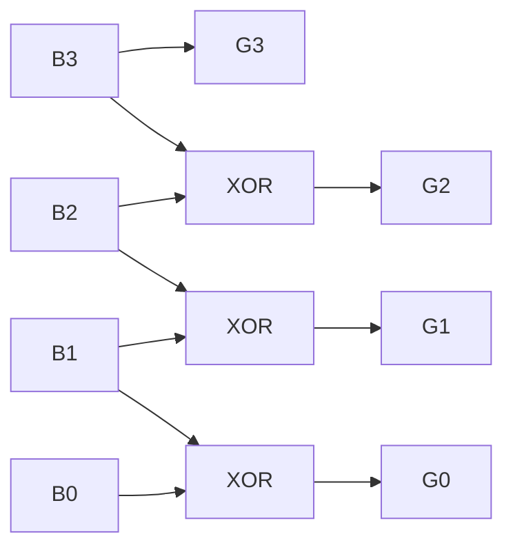

<Callout type="info">
  **이번 문서의 목표:** 이 문서를 다 읽으면 크기 비교기·인코더·디코더·멀티플렉서·디멀티플렉서 각각의 진리표와 최소식을 도출하고, 실제 선택 신호·입력값을 대입해 출력을 계산하며, 이진-그레이 코드 변환 회로의 구조를 설명할 수 있다.
</Callout>

## 이번 편에서 다루는 회로들의 공통점

14편에서 배운 대로, 이번 편에서 다루는 크기 비교기·인코더·디코더·멀티플렉서·디멀티플렉서는 모두 **현재 입력값만으로 출력이 정해지는 조합논리회로**다. 각 회로는 겉보기에 서로 다른 일을 하는 것 같지만, 사실 컴퓨터 내부에서 "어떤 값을 고르거나(선택), 어떤 신호를 다른 형태로 바꾸는(변환)" 매우 자주 쓰이는 기본 부품들이다. 예를 들어 CPU가 여러 레지스터 중 하나를 골라 버스에 실어 보낼 때는 멀티플렉서가, 여러 인터럽트 요청 중 우선순위가 가장 높은 것을 고를 때는 인코더가, 메모리 주소 한 개를 특정 메모리 칩 하나로 연결할 때는 디코더가 사용된다.

> **쉽게 말하면:** 이번 편의 회로들은 "여러 개 중 하나를 고르거나(멀티플렉서·인코더), 하나를 여러 개 중 하나로 펼치거나(디멀티플렉서·디코더), 두 값의 크기를 비교하는(비교기)" 실용적인 조합회로 모음이다.

## 크기 비교기: 두 수의 대소 관계 판정

**크기 비교기**(magnitude comparator)는 두 2진수를 입력받아 "어느 쪽이 더 큰지, 혹은 같은지"를 판정하는 회로다.

### 1비트 비교기

가장 단순한 형태는 1비트씩 비교하는 경우다. 입력 $A$, $B$ 각각 1비트에 대해, 세 가지 출력 $A gt B$, $A=B$, $A t B$를 만든다.

| A | B | $A \gt B$ | A=B | $A \lt B$ |
|---|---|---|---|---|
| 0 | 0 | 0 | 1 | 0 |
| 0 | 1 | 0 | 0 | 1 |
| 1 | 0 | 1 | 0 | 0 |
| 1 | 1 | 0 | 1 | 0 |

각 출력의 최소식을 도출한다.

- $A=B$가 1인 행은 $(0,0)$과 $(1,1)$이다. 이는 09편에서 배운 XNOR(두 입력이 같을 때만 1)의 정의와 정확히 같다. $A=B$를 판정하는 식은 $\overline{A \oplus B}$다.
- $A gt B$가 1인 행은 $(1,0)$뿐이다. $A$가 1이고 $B$가 0이어야 하므로 식은 $A\bar{B}$다.
- $A t B$가 1인 행은 $(0,1)$뿐이다. 식은 $\bar{A}B$다.

### 다중 비트 비교기: 자릿수가 큰 쪽부터 비교

여러 비트로 이루어진 두 수를 비교할 때는, 10진수를 손으로 비교할 때와 같은 방식을 그대로 회로로 옮긴다. **가장 높은 자리(최상위 비트)부터 비교해서 이미 대소가 갈리면 그 결과가 최종 답이 되고, 두 비트가 같으면 그 다음 자리로 내려가 비교를 이어간다.**

2비트 수 $A = A_1A_0$, $B = B_1B_0$를 비교하는 경우를 예로 든다. $A gt B$가 되는 조건은 다음 둘 중 하나다.

1. 최상위 비트에서 이미 $A_1 > B_1$인 경우: $A_1\bar{B_1}$
2. 최상위 비트가 같고($A_1 = B_1$), 그 다음 비트에서 $A_0 > B_0$인 경우: $(A_1 \odot B_1) \cdot A_0\bar{B_0}$ (여기서 $\odot$는 XNOR, 즉 "두 비트가 같음"을 뜻하는 기호다)

$$
(A>B) = A_1\bar{B_1} + (A_1 \odot B_1)A_0\bar{B_0}
$$

**실제 숫자로 검산**: $A=10_{(2)}=2$, $B=01_{(2)}=1$을 비교한다. $A_1=1, B_1=0$이므로 최상위 비트에서 이미 $A_1\bar{B_1}=1 \cdot 1=1$이 되어 조건 1이 성립하고, $A gt B$가 1로 판정된다. 실제로 $2>1$이므로 정확하다.

다른 예로 $A=01_{(2)}=1$, $B=00_{(2)}=0$을 비교한다. 최상위 비트는 $A_1=0, B_1=0$으로 같으므로 조건 1은 0이다. $A_1 \odot B_1 = 1$(둘 다 0으로 같음)이고, 최하위 비트에서 $A_0=1, B_0=0$이므로 $A_0\bar{B_0}=1$이다. 따라서 조건 2가 $1 \cdot 1=1$이 되어 $A>B=1$로 판정된다. 실제로 $1>0$이므로 정확하다.

> **자주 틀리는 점:** 각 자리를 독립적으로 비교해서 단순히 더하거나 곱하는 실수가 흔하다. 반드시 **상위 자리가 같을 때만 하위 자리 비교 결과를 반영**해야 한다("상위 자리가 같음"을 보장하는 XNOR 항을 곱해야 한다). 이 조건을 빠뜨리면, 예를 들어 상위 자리에서 이미 $A t B$로 판정 났는데도 하위 자리 비교 때문에 잘못된 결과가 나올 수 있다.

## 인코더: 여러 입력 중 켜진 것의 번호를 출력

**인코더**(encoder)는 여러 개의 입력선 중 정확히 하나만 1(활성화)일 때, 그 입력의 "번호"를 2진수로 압축해 출력하는 회로다. 예를 들어 8개의 입력 중 5번 입력선만 1이면, 인코더는 이를 3비트 2진수 $101_{(2)}$로 바꾸어 출력한다.

### 4-to-2 인코더

4개의 입력($I_0, I_1, I_2, I_3$) 중 하나만 1일 때, 그 번호를 2비트($Y_1, Y_0$)로 출력하는 인코더의 진리표는 다음과 같다.

| $I_3$ | $I_2$ | $I_1$ | $I_0$ | $Y_1$ | $Y_0$ |
|---|---|---|---|---|---|
| 0 | 0 | 0 | 1 | 0 | 0 |
| 0 | 0 | 1 | 0 | 0 | 1 |
| 0 | 1 | 0 | 0 | 1 | 0 |
| 1 | 0 | 0 | 0 | 1 | 1 |

이 표에서 출력식을 뽑으면 $Y_1 = I_2 + I_3$(2번 또는 3번 입력이 켜지면 상위 비트가 1), $Y_0 = I_1 + I_3$(1번 또는 3번 입력이 켜지면 하위 비트가 1)가 된다.

### 우선순위 인코더: 여러 입력이 동시에 켜지는 현실 문제

기본 인코더의 치명적인 약점은 **입력이 정확히 하나만 켜져 있다는 가정**이다. 실제로는 여러 인터럽트 요청이 동시에 들어오는 것처럼, 두 개 이상의 입력이 동시에 1이 되는 상황이 흔하다. 이를 해결하는 것이 **우선순위 인코더**(priority encoder)로, **번호가 더 높은(또는 미리 정해둔 우선순위가 더 높은) 입력을 우선해서 인코딩**한다.

| $I_3$ | $I_2$ | $I_1$ | $I_0$ | $Y_1$ | $Y_0$ | 비고 |
|---|---|---|---|---|---|---|
| 1 | X | X | X | 1 | 1 | $I_3$이 최우선 |
| 0 | 1 | X | X | 1 | 0 | $I_3$이 0일 때만 $I_2$ 확인 |
| 0 | 0 | 1 | X | 0 | 1 | $I_3, I_2$가 0일 때만 $I_1$ 확인 |
| 0 | 0 | 0 | 1 | 0 | 0 | 나머지가 모두 0일 때만 $I_0$ 확인 |

표에서 `X`는 12편에서 배운 don't care와 비슷하지만 여기서는 조금 다른 의미로 쓰인다. "이 자리의 값과 무관하게, 왼쪽에 있는 더 높은 우선순위 입력이 이미 1이므로 이 입력의 값은 결과에 영향을 주지 않는다"는 뜻이다. 예를 들어 $I_3=1$이면 $I_2, I_1, I_0$이 무엇이든 항상 $Y_1Y_0=11$이 출력된다.

> **쉽게 말하면:** 우선순위 인코더는 "여러 사람이 동시에 손을 들어도, 가장 앞자리(가장 번호가 높은) 사람의 요청만 먼저 처리한다"는 규칙을 회로로 만든 것이다.

## 디코더: 2진수 번호를 받아 해당 출력선 하나만 켜기

**디코더**(decoder)는 인코더와 정반대의 일을 한다. $n$비트 2진수 입력을 받아, $2^n$개의 출력선 중 그 번호에 해당하는 출력선 **하나만** 1로 켜고 나머지는 모두 0으로 만든다.

### 2-to-4 디코더

2비트 입력 $A_1A_0$을 받아 4개의 출력 $Y_0, Y_1, Y_2, Y_3$ 중 하나만 켜는 디코더의 진리표는 다음과 같다(활성화를 위한 인에이블 입력 $E$가 1일 때만 동작한다고 가정한다).

| E | $A_1$ | $A_0$ | $Y_3$ | $Y_2$ | $Y_1$ | $Y_0$ |
|---|---|---|---|---|---|---|
| 0 | X | X | 0 | 0 | 0 | 0 |
| 1 | 0 | 0 | 0 | 0 | 0 | 1 |
| 1 | 0 | 1 | 0 | 0 | 1 | 0 |
| 1 | 1 | 0 | 0 | 1 | 0 | 0 |
| 1 | 1 | 1 | 1 | 0 | 0 | 0 |

각 출력식은 입력 조합을 그대로 AND로 묶은 최소항 형태다. $Y_0 = E\bar{A_1}\bar{A_0}$, $Y_1 = E\bar{A_1}A_0$, $Y_2 = EA_1\bar{A_0}$, $Y_3 = EA_1A_0$. **디코더의 각 출력은 그 자체로 하나의 최소항(minterm)에 대응**한다는 점이 중요한 특징이다. 이 성질 때문에 디코더는 "임의의 진리표를 표준 SOP 형태로 그대로 구현하는 부품"으로도 활용된다(원하는 출력이 1이 되어야 하는 최소항에 해당하는 디코더 출력선들을 OR 게이트로 묶으면 어떤 불 함수도 만들 수 있다).

> **자주 틀리는 점:** 인코더와 디코더의 입출력 방향을 반대로 기억하는 실수가 매우 흔하다. **인코더는 "여러 입력 → 압축된 번호 출력"이고, 디코더는 "압축된 번호 입력 → 여러 출력 중 하나 켜짐**"이다. 이름 자체가 "부호화(인코드)"와 "부호 풀기(디코드)"라는 반대 방향을 가리킨다는 점을 생각하면 헷갈리지 않는다.

## 멀티플렉서(MUX): 여러 입력 중 선택 신호로 하나를 고름

**멀티플렉서**(multiplexer, 다중화기, 흔히 MUX라고 줄여 부른다)는 여러 개의 데이터 입력 중, 별도의 **선택 신호**(select line)가 지정하는 하나만 골라 출력으로 내보내는 회로다.

### 4-to-1 MUX

데이터 입력 4개($I_0, I_1, I_2, I_3$)와 2비트 선택 신호($S_1, S_0$)를 가진 4-to-1 MUX의 동작은 다음과 같다.

| $S_1$ | $S_0$ | 출력 |
|---|---|---|
| 0 | 0 | $I_0$ |
| 0 | 1 | $I_1$ |
| 1 | 0 | $I_2$ |
| 1 | 1 | $I_3$ |

출력식은 각 데이터 입력에 그 입력이 선택되는 조건(최소항)을 곱해서 모두 더한 형태다.

$$
Y = \bar{S_1}\bar{S_0}I_0 + \bar{S_1}S_0I_1 + S_1\bar{S_0}I_2 + S_1S_0I_3
$$

**실제 값 대입**: $I_0=0, I_1=1, I_2=0, I_3=1$이고 선택 신호 $S_1S_0=10$이라면, 표에 따라 $I_2$가 선택되어야 하므로 출력은 0이어야 한다. 식에 대입하면 $S_1\bar{S_0}I_2 = 1 \cdot 1 \cdot 0 = 0$이고 나머지 항은 모두 $S_1, S_0$ 조건이 맞지 않아 0이 되므로, $Y=0$이 나와 정확히 일치한다.

> **쉽게 말하면:** MUX는 "여러 채널 중 리모컨(선택 신호)이 가리키는 채널 하나만 화면(출력)에 내보내는 텔레비전"과 같다.

## 디멀티플렉서(DEMUX): 하나의 입력을 여러 출력 중 하나로 분배

**디멀티플렉서**(demultiplexer, DEMUX)는 MUX와 정반대로, **하나의 데이터 입력을 선택 신호가 지정하는 출력선 하나로만** 내보내고 나머지 출력선은 0으로 만드는 회로다. 1-to-4 DEMUX는 데이터 입력 $D$ 하나와 선택 신호 $S_1, S_0$을 받아, $S_1S_0$이 가리키는 출력 $Y_0 \sim Y_3$ 중 하나에만 $D$ 값을 그대로 전달한다.

$$
Y_0 = \bar{S_1}\bar{S_0}D, \quad Y_1 = \bar{S_1}S_0D, \quad Y_2 = S_1\bar{S_0}D, \quad Y_3 = S_1S_0D
$$

이 식의 형태는 앞서 본 2-to-4 디코더의 출력식과 거의 같다. 실제로 **DEMUX는 인에이블 입력 자리에 데이터 $D$를 넣은 디코더와 동일한 구조**다. 이 점 때문에 "디코더 겸용 DEMUX"라는 부품이 실제로 존재하며, 인에이블 핀에 상수 1을 넣으면 순수 디코더로, 데이터 신호를 넣으면 DEMUX로 동작한다.

## 코드 변환 회로: 이진-그레이 코드 변환

07편에서 배운 **그레이 코드**(인접한 두 값이 정확히 1비트만 달라지는 코드)로 일반 이진수를 바꾸는 변환 회로도 대표적인 조합논리회로다. $n$비트 이진수 $B_{n-1}B_{n-2}\cdots B_0$을 그레이 코드 $G_{n-1}G_{n-2}\cdots G_0$로 바꾸는 규칙은 다음과 같다.

$$
G_{n-1} = B_{n-1}
$$

$$
G_i = B_{i+1} \oplus B_i \quad (i = n-2, \ldots, 0)
$$

즉 **최상위 비트는 그대로 두고, 그 아래 각 자리는 자신과 바로 위 자리를 XOR한 값**이 된다. 이 규칙은 "인접한 이진수 두 값은 항상 어떤 자리에서 자리올림이 발생해 여러 비트가 한꺼번에 바뀔 수 있지만, XOR로 만든 그레이 코드는 그 변화를 정확히 한 비트 차이로 압축한다"는 원리에 기반한다.

**실제 숫자로 검산**: 이진수 $1010_{(2)}$을 그레이 코드로 바꿔 본다. $B_3B_2B_1B_0 = 1010$.

- $G_3 = B_3 = 1$
- $G_2 = B_3 \oplus B_2 = 1 \oplus 0 = 1$
- $G_1 = B_2 \oplus B_1 = 0 \oplus 1 = 1$
- $G_0 = B_1 \oplus B_0 = 1 \oplus 0 = 1$

따라서 그레이 코드는 $1111$이다. 회로로는 XOR 게이트 3개(최상위 비트를 제외한 나머지 각 자리마다 하나씩)만 있으면 몇 비트든 변환할 수 있다.

> **자주 틀리는 점:** 그레이 코드 변환에서 모든 자리를 이웃한 이진수 비트끼리 XOR한다고 생각하면서 최상위 비트까지 XOR하려는 실수가 있다. **최상위 비트는 XOR 없이 그대로 옮긴다**는 점을 놓치면 안 된다(최상위 비트보다 한 자리 위는 존재하지 않으므로 XOR할 대상이 없다).

## 이번 편 회로 요약 비교

<table>
<thead><tr><th>회로</th><th>입력</th><th>출력</th><th>핵심 동작</th></tr></thead>
<tbody>
<tr><td>크기 비교기</td><td>두 수 A, B</td><td>A&gt;B, A=B, A&lt;B</td><td>대소 관계 판정, 상위 자리부터 비교</td></tr>
<tr><td>인코더</td><td>$2^n$개 입력선(하나만 활성)</td><td>n비트 번호</td><td>활성 입력의 번호를 압축</td></tr>
<tr><td>우선순위 인코더</td><td>$2^n$개 입력선(여러 개 활성 가능)</td><td>n비트 번호</td><td>가장 우선순위 높은 입력만 인코딩</td></tr>
<tr><td>디코더</td><td>n비트 번호(+ 인에이블)</td><td>$2^n$개 출력선(하나만 활성)</td><td>번호에 해당하는 출력선 하나만 켬</td></tr>
<tr><td>멀티플렉서(MUX)</td><td>$2^n$개 데이터 + n비트 선택</td><td>1개 출력</td><td>선택 신호가 가리키는 입력을 그대로 출력</td></tr>
<tr><td>디멀티플렉서(DEMUX)</td><td>1개 데이터 + n비트 선택</td><td>$2^n$개 출력</td><td>선택 신호가 가리키는 출력에만 데이터 전달</td></tr>
</tbody>
</table>

## 자주 틀리는 점 (종합)

- **다중 비트 비교기에서 상위 자리 동률 조건(XNOR)을 곱하지 않는 실수**: 하위 자리 비교는 반드시 상위 자리가 같을 때만 유효하다.
- **인코더에 입력이 여러 개 동시에 켜질 수 있다는 점을 간과하는 실수**: 기본 인코더는 입력이 하나만 켜진다는 전제가 있으므로, 실전에서는 우선순위 인코더를 써야 한다.
- **인코더와 디코더의 입출력 방향을 뒤바꿔 기억하는 실수**: 인코더는 여러 입력을 압축하고, 디코더는 압축된 값을 여러 출력으로 펼친다.
- **MUX 선택 신호의 비트 순서를 반대로 대입하는 실수**: $S_1S_0=10$과 $S_1S_0=01$은 서로 다른 입력을 선택하므로, 어느 비트가 더 높은 자리인지 반드시 표기와 맞춰 확인해야 한다.
- **그레이 코드 변환에서 최상위 비트까지 XOR하려는 실수**: 최상위 비트는 원래 이진수 값을 그대로 옮긴다.

## 핵심 정리

- 크기 비교기는 상위 자리부터 비교하며, 하위 자리 비교는 상위 자리가 같을 때만(XNOR 조건) 반영한다.
- 인코더는 여러 입력을 번호로 압축하고(입력 하나만 활성 가정), 우선순위 인코더는 여러 입력이 동시에 켜져도 우선순위가 높은 것만 인코딩한다.
- 디코더는 번호를 받아 해당 출력선 하나만 켜며, 각 출력은 하나의 최소항에 대응한다.
- 멀티플렉서는 선택 신호로 여러 입력 중 하나를 고르고, 디멀티플렉서는 하나의 입력을 선택 신호가 지정하는 출력으로 분배한다(DEMUX는 인에이블 자리에 데이터를 넣은 디코더와 구조가 같다).
- 이진-그레이 코드 변환은 최상위 비트를 그대로 두고, 나머지 자리는 자신과 바로 위 자리를 XOR해서 만든다.

## 마무리 복습

<Quiz
  questionNumber={1}
  question="2비트 크기 비교기에서 상위 비트가 같을 때, 하위 비트 비교 결과를 최종 판정에 반영하는 방법은?"
  options={['하위 비트 비교 결과를 그대로 최종 출력으로 쓴다', '상위 비트가 같음을 나타내는 XNOR 항과 하위 비트 비교 결과를 AND로 곱한다', '상위 비트 결과와 하위 비트 결과를 OR로 더한다', '하위 비트는 무시하고 상위 비트 결과만 사용한다']}
  correctAnswer={2}
  explanation="하위 자리 비교는 상위 자리가 같을 때만 의미가 있으므로, 상위 자리가 같음을 뜻하는 XNOR 항을 하위 비교 결과와 AND로 곱해야 올바른 최종 판정이 된다."
  optionExplanations={['상위 비트가 다를 때도 하위 비트만으로 판정하면 틀린 결과가 나올 수 있다.', '정답. XNOR로 동률 조건을 확인한 뒤 하위 비교 결과를 AND로 결합해야 한다.', 'OR로 더하면 상위 비트가 이미 다른 경우와 하위 비트 비교가 뒤섞여 잘못된 결과가 나온다.', '상위 비트가 같을 때는 하위 비트가 최종 결과를 결정해야 하므로 무시하면 안 된다.']}
/>

<Quiz
  questionNumber={2}
  question="기본 인코더(우선순위 인코더가 아닌)의 전제 조건은?"
  options={['입력이 항상 짝수 개만큼 켜진다', '입력 중 정확히 하나만 활성화된다', '입력이 전혀 켜지지 않아도 정상 동작한다', '선택 신호가 반드시 함께 있어야 한다']}
  correctAnswer={2}
  explanation="기본 인코더는 여러 입력선 중 정확히 하나만 1이라는 전제 아래 설계된다. 이 전제가 깨지면(두 개 이상 동시에 켜지면) 출력이 애매해지므로 우선순위 인코더가 필요하다."
  optionExplanations={['짝수 개라는 조건은 인코더의 전제가 아니다.', '정답. 정확히 하나의 입력만 활성화된다는 것이 기본 인코더의 전제다.', '입력이 전혀 켜지지 않으면 어떤 출력을 내야 할지 정의되지 않아 정상 동작을 보장하지 못한다.', '선택 신호는 멀티플렉서·디멀티플렉서의 구성 요소이며 인코더에는 해당하지 않는다.']}
/>

<Quiz
  questionNumber={3}
  question="디코더와 인코더의 관계를 올바르게 설명한 것은?"
  options={['둘 다 여러 입력을 번호로 압축한다', '디코더는 번호 입력을 받아 여러 출력 중 하나만 켜고, 인코더는 여러 입력 중 활성 입력의 번호를 출력한다', '둘 다 번호를 받아 여러 출력 중 하나를 켠다', '디코더는 순차논리회로이고 인코더는 조합논리회로다']}
  correctAnswer={2}
  explanation="디코더는 압축된 번호를 입력받아 그에 해당하는 출력선 하나만 켜고, 인코더는 반대로 여러 입력선 중 활성화된 것의 번호를 압축해서 출력한다. 두 회로는 서로 정반대 방향의 변환을 수행한다."
  optionExplanations={['입력을 번호로 압축하는 쪽은 인코더뿐이다. 디코더는 반대로 번호를 입력받는다.', '정답. 디코더는 번호에서 출력선으로, 인코더는 입력선에서 번호로 서로 반대 방향의 변환을 한다.', '번호를 받아 출력선을 켜는 쪽은 디코더뿐이다.', '둘 다 조합논리회로이며 기억 소자가 없다.']}
/>

<Quiz
  questionNumber={4}
  question="4-to-1 MUX에서 선택 신호 S1=1, S0=0일 때 출력되는 데이터 입력은?"
  options={['I0', 'I1', 'I2', 'I3']}
  correctAnswer={3}
  explanation="4-to-1 MUX의 선택 신호 대응표에서 S1S0=10일 때는 I2가 선택되어 출력된다."
  optionExplanations={['I0은 S1S0=00일 때 선택된다.', 'I1은 S1S0=01일 때 선택된다.', '정답. S1S0=10일 때 I2가 선택된다.', 'I3은 S1S0=11일 때 선택된다.']}
/>

<Quiz
  questionNumber={5}
  question="1-to-4 디멀티플렉서(DEMUX)와 2-to-4 디코더의 구조적 관계로 옳은 것은?"
  options={['서로 완전히 무관한 별개의 회로다', 'DEMUX는 디코더의 인에이블 입력 자리에 데이터 신호를 넣은 것과 같은 구조다', 'DEMUX는 디코더보다 항상 출력선이 두 배 많다', '디코더는 DEMUX와 달리 순차논리회로다']}
  correctAnswer={2}
  explanation="1-to-4 DEMUX의 출력식은 2-to-4 디코더의 출력식과 형태가 같으며, 디코더의 인에이블 입력 자리에 상수 1 대신 데이터 신호를 넣으면 그대로 DEMUX로 동작한다."
  optionExplanations={['두 회로의 출력식 형태가 사실상 같으므로 무관하다는 설명은 틀렸다.', '정답. 인에이블 자리에 데이터를 넣으면 디코더가 DEMUX로 동작한다.', '출력선 개수는 둘 다 입력 비트 수에 따라 2의 n제곱으로 같다.', '두 회로 모두 조합논리회로로, 기억 소자가 없다.']}
/>

<Quiz
  questionNumber={6}
  question="이진수 1100을 그레이 코드로 변환한 결과는?"
  options={['1100', '1010', '0110', '1000']}
  correctAnswer={2}
  explanation="G3=B3=1, G2=B3 XOR B2=1 XOR 1=0, G1=B2 XOR B1=1 XOR 0=1, G0=B1 XOR B0=0 XOR 0=0이므로 그레이 코드는 1010이다."
  optionExplanations={['원래 이진수를 그대로 옮긴 값으로, 변환을 적용하지 않은 오답이다.', '정답. 최상위 비트는 그대로 두고 나머지 자리를 순서대로 XOR하면 1010이 된다.', 'XOR 계산 순서를 반대로(아래에서 위로) 적용한 오답이다.', '최하위 비트 계산에서 XOR 대신 AND를 적용한 것과 같은 오답이다.']}
/>

## 참고 자료

- [국가평생교육진흥원 독학학위제](https://bdes.nile.or.kr) — 독학사 논리회로 과목 평가영역·출제범위 공식 안내.
- [IEEE Standards Association](https://standards.ieee.org) — 디지털 논리 설계 관련 표준화 자료를 확인할 수 있는 공신력 있는 기관 자료.
