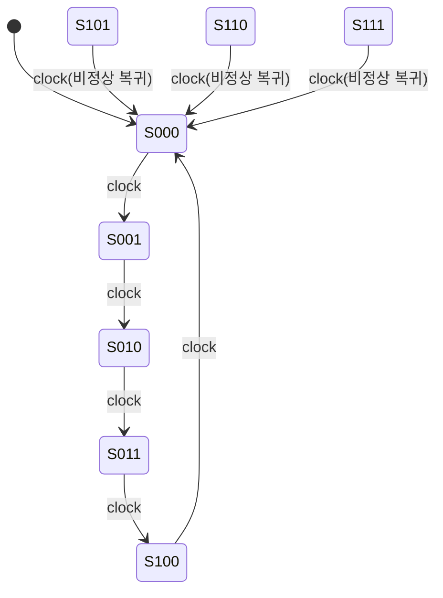

## 왜 카운터를 "설계"까지 해야 할까

09편(컴퓨터구조 쪽에서 다룬 순서논리회로) 수준에서는 카운터를 "T 플립플롭을 나란히 연결해 클록마다 값이 하나씩 늘어나는 회로"로 직관적으로만 이해하고 넘어갔다. 하지만 독학사 시험에서 실제로 자주 나오는 문제는 "2진수 0부터 7까지 세는 카운터"처럼 딱 떨어지는 경우가 아니라, **모드 5, 모드 6, BCD(모드 10)처럼 2의 거듭제곱이 아닌 임의의 개수를 세는 카운터**를 JK 플립플롭으로 직접 설계하라는 유형이다.

## 비동기 카운터와 동기 카운터: 구조부터 다시 정리

**비동기 카운터**(asynchronous counter, 리플 카운터ripple counter라고도 부른다)는 가장 하위 비트를 담당하는 플립플롭만 외부 클록을 직접 받고, 그 위의 비트들은 바로 아래 비트의 출력(주로 $Q$가 1에서 0으로 떨어지는 순간)을 자신의 클록 입력으로 사용한다. 회로 구성이 단순해서(추가 게이트가 거의 필요 없다) 이해하기는 쉽지만, 클록 신호가 마치 물결(ripple)처럼 한 비트씩 순서대로 전파되므로, 비트 수가 늘어날수록 **전파 지연(propagation delay)이 계속 누적**된다.

**동기 카운터**(synchronous counter)는 모든 플립플롭이 **같은 클록선**에 동시에 연결되어, 클록이 뛰는 순간 모든 비트가 한꺼번에 바뀐다. 다만 "다음 상태가 무엇이 되어야 하는가"를 각 플립플롭이 미리 알고 있어야 하므로, 비트 사이의 관계를 계산하는 **추가 논리 게이트**가 필요하다.

| 구분 | 비동기(리플) 카운터 | 동기 카운터 |
|---|---|---|
| 클록 연결 | 뒷 비트가 앞 비트의 출력을 클록으로 사용 | 모든 플립플롭이 같은 클록을 동시에 공유 |
| 회로 복잡도 | 단순(추가 게이트 거의 불필요) | 상대적으로 복잡(J, K 입력을 만드는 게이트 필요) |
| 속도 | 비트 수가 늘수록 전파 지연 누적 | 모든 비트가 동시에 바뀌어 상대적으로 빠름 |
| 임의 순서(모드 5, 6 등) 설계 | 구현이 번거로움 | 여기표 기반 절차로 체계적으로 설계 가능 |

<Callout type="warning">
  시험 함정: "리플 카운터는 회로가 단순하므로 항상 동기 카운터보다 빠르다"는 진술은 틀렸다. 회로 단순함과 동작 속도는 별개다. 리플 카운터는 비트마다 전파 지연이 누적되어, 비트 수가 많아질수록 오히려 동기 카운터보다 느려진다.
</Callout>

## 동기 카운터 설계 절차: 여기표를 거꾸로 사용한다

동기 카운터 설계는 19편에서 다룬 일반적인 순차회로 설계 절차(상태도 → 상태표 → 플립플롭 입력방정식 → 출력방정식)를 그대로 따르되, **카운터는 출력이 곧 상태(Q값 자체)** 이므로 별도의 출력 논리를 만들 필요가 없다는 점이 단순화 포인트다. 절차는 다음과 같다.

<Callout type="warning">
  시험 함정: 카르노맵을 그릴 때 **무관 항(X)을 실제 회로에 존재하지 않는 상태**로 착각해서 임의로 무시하면 안 된다. 무관 항은 "그 입력 조합이 나타날 일이 없거나 나타나도 결과가 상관없다"는 뜻일 뿐, 셀 자체는 여전히 카르노맵 위에 존재하며 0 또는 1 중 간소화에 유리한 값을 자유롭게 선택해 채워 넣어야 한다.
</Callout>

## 완성된 mod-5 카운터의 회로 구성

위에서 구한 여섯 개의 입력방정식($J_2, K_2, J_1, K_1, J_0, K_0$)을 JK 플립플롭 3개의 입력에 각각 연결하면 mod-5 동기 카운터가 완성된다. $K_2 = 1$과 $K_0 = 1$은 항상 1이 걸려 있는 상수 입력이므로 별도의 게이트 없이 전원(논리 1)에 바로 연결하면 되고, 나머지 네 입력만 AND·OR 게이트로 구현하면 된다.

**결과 해석**: 상태도를 보면 정상 경로 5개 상태($000$~$100$)가 하나의 순환 고리를 이루고, 나머지 비정상 상태 3개($101$, $110$, $111$)는 모두 화살표 하나로 곧장 $000$으로 흡수된다. 이렇게 **비정상 상태에서 정상 경로까지 한 클록 안에 도달**하도록 만드는 것을 자기 보정(self-correcting) 설계라고 하며, 만약 비정상 상태들끼리 서로를 가리키며 순환하는 별도의 고리가 생겨 버리면(예: $101 \to 110 \to 101 \to \cdots$) 카운터가 정상 경로로 절대 돌아오지 못하는 **잠금(lockout)** 상태에 빠진다.

## 모듈러 카운터 개수와 필요 비트 수

| 모드(N) | 필요 최소 비트 수 $n$ | 전체 상태 $2^n$ | 비정상(잉여) 상태 수 |
|---|---|---|---|
| 3 | 2 | 4 | 1 |
| 5 | 3 | 8 | 3 |
| 6 | 3 | 8 | 2 |
| 10(BCD) | 4 | 16 | 6 |

BCD 카운터(모드 10, 0000~1001을 반복)처럼 실제 시험에 자주 등장하는 카운터도 정확히 같은 절차(상태표 → 여기표 대입 → 카르노맵 간소화)로 설계하며, 다만 비정상 상태가 6개(1010~1111)로 늘어나 카르노맵의 무관 항이 훨씬 많아진다는 점만 다르다.

## 핵심 정리

- 비동기(리플) 카운터는 뒤 비트가 앞 비트의 출력을 클록으로 삼아 회로는 단순하지만 전파 지연이 누적되고, 동기 카운터는 모든 비트가 같은 클록을 공유해 빠르지만 입력 논리를 계산해야 한다.
- 동기 카운터 설계는 (1) 세고 싶은 순서로 상태표 작성 → (2) 각 비트 전이를 플립플롭 여기표에 대입 → (3) 카르노맵으로 J, K(또는 D, T) 입력방정식 간소화 → (4) 게이트로 구현하는 4단계 절차를 따른다.
- 모드 N 카운터는 $2^n \geq N$을 만족하는 최소 $n$비트로 만들며, 남는 $2^n - N$개의 비정상 상태는 자기 보정(다음 클록에 정상 경로로 복귀) 설계로 처리한다.
- 비정상 상태끼리 서로를 순환 참조하면 카운터가 정상 경로로 영영 돌아오지 못하는 잠금(lockout) 상태가 되므로, 설계 후에는 모든 비정상 상태의 다음 상태를 추적해 잠금 여부를 반드시 확인해야 한다.

## 마무리 복습

<Quiz
  questionNumber={1}
  question={"비동기(리플) 카운터에 대한 설명으로 옳지 않은 것은?"}
  options={["뒤 비트 플립플롭의 클록 입력으로 앞 비트의 출력을 사용한다","비트 수가 늘어날수록 전파 지연이 누적된다","모든 플립플롭이 동일한 클록선에 동시에 연결된다","동기 카운터에 비해 추가 게이트가 거의 필요 없어 회로가 단순하다"]}
  correctAnswer={3}
  explanation={"옳지 않은 설명을 고르는 문제다. 모든 플립플롭이 같은 클록선에 동시에 연결되는 것은 동기 카운터의 특징이다."}
/>

<Quiz
  questionNumber={2}
  question={"0, 1, 2, 3, 4 다섯 개의 상태를 순환하는 mod-5 카운터를 만들 때 필요한 최소 플립플롭 개수는?"}
  options={["2개","3개","4개","5개"]}
  correctAnswer={2}
  explanation={"5개의 상태를 표현하려면 2^n &gt;= 5를 만족하는 최소 n이 필요하다. 2비트로는 2^2=4개 상태밖에 만들 수 없어 부족하고, 3비트면 2^3=8개 상태로 5개를 모두 표현할 수 있다."}
/>

<Quiz
  questionNumber={3}
  question={"mod-5 카운터(3비트, 000~100 정상 순환)에서 비정상 상태 101이 다음 클록에 000으로 이동하도록 설계하는 이유로 가장 적절한 것은?"}
  options={["회로의 게이트 수를 늘리기 위해서다","전원 투입 시나 잡음으로 비정상 상태에 빠지더라도 정상 순환 경로로 자동 복귀시키기 위해서다","JK 플립플롭 대신 D 플립플롭을 쓰기 위해서다","카운터의 모드를 8로 바꾸기 위해서다"]}
  correctAnswer={2}
  explanation={"비정상 상태를 정상 경로의 시작점(000)으로 되돌리도록 설계하는 것은, 회로가 어떤 이유로든 잉여 상태에 놓이더라도 다음 클록에 바로 정상 순환으로 복귀하게 만드는 자기 보정(self-correcting) 설계이기 때문이다."}
/>

## 참고 자료

- [국가평생교육진흥원 독학학위제 - 과목별 평가영역](https://bdes.nile.or.kr/nile/study/nStudy2_1.do)
- [국가평생교육진흥원 독학학위제 - 출제방향/수준](https://bdes.nile.or.kr/nile/study/nStudy1_1.do)
