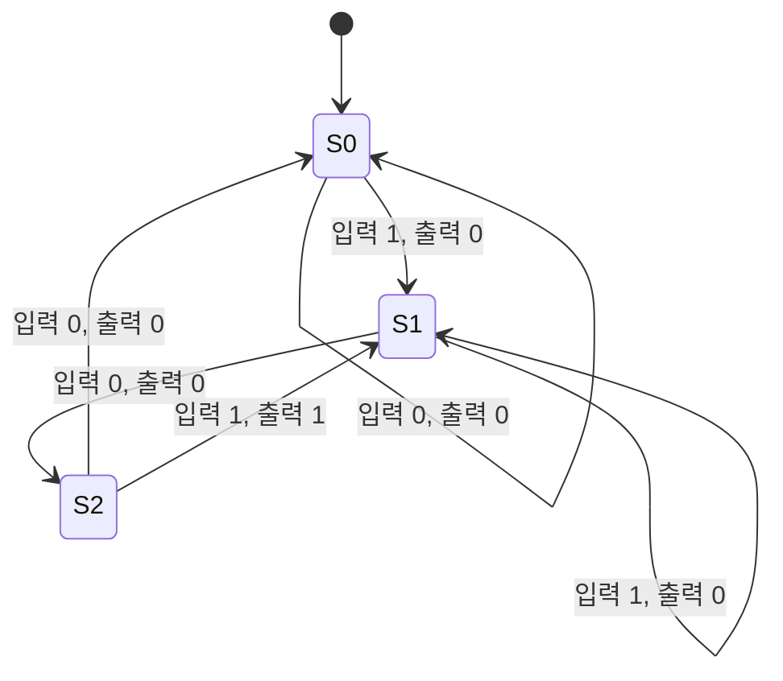

<Callout type="info">
  **이번 문서의 목표:** 이 파일을 다 읽으면 요구사항을 상태도로 표현하고, 상태표·여기표·카르노맵 간소화를 거쳐 플립플롭 입력 논리식과 출력 논리식까지 스스로 유도할 수 있다.
</Callout>

## 왜 순차회로는 "설계 절차"가 정해져 있을까

14편에서 배운 조합논리회로 설계 절차(입출력 정의 → 진리표 → 간소화 → 회로도)는 "지금 입력이 뭐냐"만 처리하면 되므로 비교적 단순했다. 그런데 18편에서 다뤘듯 순차논리회로는 **과거의 결과(상태)를 기억**해야 하므로, "지금 어떤 상태에 있고, 지금 무슨 입력이 들어왔을 때, 다음에 어떤 상태로 가고 무엇을 출력할 것인가"까지 함께 설계해야 한다. 이 복잡함을 감당하기 위해 순차회로 설계는 다음과 같은 고정된 절차를 따른다.

> **쉽게 말하면:** 순차회로 설계는 "문제 상황을 상태들의 지도(상태도)로 그리고, 그 지도를 숫자표(상태표)로 바꾼 뒤, 플립플롭에 넣을 정확한 입력값을 여기표로 뽑아내고, 마지막으로 그 값을 최소한의 게이트로 만드는 식(카르노맵 간소화)까지 구하는" 네 단계 여정이다.

<Steps>

1. **상태도 작성**: 문제 상황을 분석해 필요한 상태(state)와 상태 간 전이(transition)를 그림으로 그린다.
2. **상태표 작성**: 상태도를 표로 바꾸고, 각 상태에 이진 코드(0과 1의 조합)를 배정한다(상태 할당, state assignment).
3. **여기표를 이용한 플립플롭 입력 논리 도출**: 18편에서 배운 여기표를 이용해, 각 플립플롭에 어떤 입력을 넣어야 원하는 상태 전이가 일어나는지 정리한다.
4. **카르노맵 간소화 및 회로 완성**: 각 플립플롭 입력과 출력을 현재 상태·입력의 함수로 간소화해 최종 논리식과 회로도를 얻는다.

</Steps>

이번 편에서는 이 네 단계를 하나의 완결된 예제(연속된 두 비트 "101"을 검출하는 회로)를 통해 처음부터 끝까지 직접 따라가 본다. 여기서 익힌 절차는 21편의 카운터 설계, 22편의 레지스터 설계에도 그대로 재사용된다.

## Mealy 기계와 Moore 기계: 출력을 언제 결정하는가

> **쉽게 말하면:** Moore 기계는 "지금 어떤 상태에 있느냐"만으로 출력을 정하고, Mealy 기계는 "지금 상태 + 지금 입력"을 함께 봐서 출력을 정한다.

순차회로는 출력을 결정하는 방식에 따라 두 가지로 나뉜다.

| 구분 | Moore 기계 | Mealy 기계 |
|---|---|---|
| 출력 결정 기준 | 현재 상태만 | 현재 상태 + 현재 입력 |
| 출력 변화 시점 | 클록 에지에 맞춰 상태가 바뀔 때 | 입력이 바뀌는 즉시(클록과 무관하게 바뀔 수 있음) |
| 상태 개수(같은 동작 기준) | 보통 더 많이 필요 | 보통 더 적게 필요 |
| 상태도 표기 | 출력을 상태 안에 표기 | 출력을 상태 전이 화살표 위에 표기 |

이번 편의 예제는 **Mealy 기계**로 설계한다. "직전 두 비트가 101이었는가"를 판단하려면 세 번째 비트(마지막 1)가 들어오는 바로 그 순간 출력이 즉시 1이 되어야 자연스러운데, 이는 "현재 상태 + 현재 입력"으로 출력을 정하는 Mealy 방식과 잘 맞기 때문이다.

<Callout type="warning">
  시험 함정: "Moore 기계는 Mealy 기계보다 항상 상태 개수가 적다"는 진술은 사실과 반대다. 일반적으로 **Mealy 기계가 같은 동작을 더 적은 상태로 구현**할 수 있는데, 이는 Mealy가 출력 결정에 입력이라는 추가 정보를 쓸 수 있어 상태를 더 세분화하지 않아도 되기 때문이다.
</Callout>

## 1단계 — 요구사항 분석과 상태도 작성

**문제**: 1비트씩 직렬로 입력되는 비트열에서, **가장 최근 3비트가 "101"과 일치하는 순간마다** 출력 $Z$를 1로 만드는 회로를 설계하라(겹침 허용, overlapping — 예: "10101"이 들어오면 "101"이 두 번 검출되어야 한다).

**작은 예시**: 입력이 순서대로 $1, 0, 1, 0, 1$이 들어온다고 하자. 세 번째 비트(1)가 들어온 순간 직전 세 비트 "101"이 완성되어 $Z=1$이 되고, 다섯 번째 비트(1)가 들어온 순간에도 직전 세 비트("101", 3~5번째 비트)가 다시 완성되어 $Z=1$이 된다.

이 요구사항을 만족하려면 "지금까지 들어온 비트 중 얼마나 패턴에 가까운 접두사(prefix)가 이어지고 있는가"를 기억해야 한다. 필요한 상태는 다음 세 가지다.

- **$S_0$(초기 상태)**: 지금까지 패턴과 무관하거나, 패턴이 시작되지 않은 상태.
- **$S_1$**: 직전 입력이 "1"이어서, "101"의 첫 글자와 일치하는 상태.
- **$S_2$**: 직전 두 입력이 "10"이어서, "101"의 앞 두 글자와 일치하는 상태.

각 상태에서 새 입력 $X$가 들어왔을 때 어디로 가는지, 그리고 그 순간 무엇을 출력하는지 하나씩 따져보자.

- $S_0$에서 $X=0$: 여전히 패턴과 무관 → $S_0$ 유지, 출력 0.
- $S_0$에서 $X=1$: "1"이 시작됨 → $S_1$로 이동, 출력 0.
- $S_1$에서 $X=0$: "10"이 됨 → $S_2$로 이동, 출력 0.
- $S_1$에서 $X=1$: "11"이 됨(마지막 비트는 여전히 "1") → $S_1$ 유지, 출력 0.
- $S_2$에서 $X=0$: "100"이 됨(패턴과 무관하게 리셋) → $S_0$으로 이동, 출력 0.
- $S_2$에서 $X=1$: "101"이 완성됨 → 출력 1, 그리고 마지막 비트가 "1"이므로 다음 검출을 위해 $S_1$로 이동(겹침 허용).

### 상태도(mermaid)

## 2단계 — 상태표 작성과 상태 할당

> **쉽게 말하면:** 상태표는 상태도의 화살표들을 표 한 장에 옮겨 적은 것이고, 상태 할당은 $S_0, S_1, S_2$ 같은 이름에 실제 이진수 값을 매기는 작업이다.

상태가 3개이므로, 이를 구분하려면 최소 $\lceil \log_2 3 \rceil = 2$비트, 즉 플립플롭 2개($Q_1, Q_0$)가 필요하다. 2비트로 표현 가능한 조합은 00, 01, 10, 11 네 가지인데 상태는 3개뿐이므로, 하나(11)는 **사용하지 않는 상태**(unused state)로 남는다. 이 사용하지 않는 상태는 12편에서 배운 don't care(무관항)로 처리해 간소화에 활용한다.

| 상태 이름 | $Q_1$ | $Q_0$ |
|---|---|---|
| $S_0$ | 0 | 0 |
| $S_1$ | 0 | 1 |
| $S_2$ | 1 | 0 |
| (미사용) | 1 | 1 |

이제 상태도의 모든 화살표를 이 이진 코드로 바꿔 상태표로 정리한다.

| 현재 상태 $Q_1 Q_0$ | 입력 $X$ | 다음 상태 $Q_1' Q_0'$ | 출력 $Z$ |
|---|---|---|---|
| 00 ($S_0$) | 0 | 00 ($S_0$) | 0 |
| 00 ($S_0$) | 1 | 01 ($S_1$) | 0 |
| 01 ($S_1$) | 0 | 10 ($S_2$) | 0 |
| 01 ($S_1$) | 1 | 01 ($S_1$) | 0 |
| 10 ($S_2$) | 0 | 00 ($S_0$) | 0 |
| 10 ($S_2$) | 1 | 01 ($S_1$) | 1 |
| 11 (미사용) | 0 | d d (무관) | d |
| 11 (미사용) | 1 | d d (무관) | d |

<Callout type="warning">
  시험 함정: "미사용 상태는 회로에 절대 나타나지 않으므로 신경 쓸 필요가 없다"는 생각은 위험하다. 전원이 켜지는 순간의 초기값 오류나 잡음(noise)으로 실제 회로가 우연히 미사용 상태에 들어갈 수 있기 때문에, 실무에서는 미사용 상태에서 정상 상태로 돌아오는 "복구 경로"를 추가로 설계하기도 한다. 다만 독학사 시험에서는 특별한 언급이 없는 한 미사용 상태를 don't care로 처리하고 간소화에 활용하는 것이 표준 풀이다.
</Callout>

## 3단계 — JK 플립플롭 여기표를 이용한 입력 논리 유도

이번 예제는 $Q_1, Q_0$ 두 자리 모두 **JK 플립플롭**으로 구현한다. 18편의 JK 여기표(현재 상태 → 다음 상태에 필요한 J, K)를 각 자리에 적용해, 상태표의 모든 행에 대해 $J_1, K_1$(상위 비트용)과 $J_0, K_0$(하위 비트용)을 채운다.

복습하면 JK 여기표는 다음과 같다.

| $Q(t)$ | $Q(t+1)$ | J | K |
|---|---|---|---|
| 0 | 0 | 0 | X |
| 0 | 1 | 1 | X |
| 1 | 0 | X | 1 |
| 1 | 1 | X | 0 |

이 표를 상태표의 $Q_1$ 열과 $Q_0$ 열 각각에 독립적으로 적용한다.

| $Q_1 Q_0$ | $X$ | $Q_1' Q_0'$ | $Z$ | $J_1$ | $K_1$ | $J_0$ | $K_0$ |
|---|---|---|---|---|---|---|---|
| 00 | 0 | 00 | 0 | 0 | X | 0 | X |
| 00 | 1 | 01 | 0 | 0 | X | 1 | X |
| 01 | 0 | 10 | 0 | 1 | X | X | 1 |
| 01 | 1 | 01 | 0 | 0 | X | X | 0 |
| 10 | 0 | 00 | 0 | X | 1 | 0 | X |
| 10 | 1 | 01 | 1 | X | 1 | 1 | X |
| 11 | 0 | dd | d | X | X | X | X |
| 11 | 1 | dd | d | X | X | X | X |

**읽는 법**: 예를 들어 세 번째 행(현재 01, 입력 0, 다음 10)을 보면, $Q_1$은 0에서 1로 바뀌므로 여기표에서 $J_1=1, K_1=X$를 가져오고, $Q_0$은 1에서 0으로 바뀌므로 $J_0=X, K_0=1$을 가져온다.

## 4단계 — 카르노맵 간소화

이제 $J_1, K_1, J_0, K_0, Z$ 각각을 $Q_1, Q_0, X$ 세 변수의 함수로 보고, 11편의 3변수 카르노맵으로 간소화한다. 행에는 $Q_1Q_0$(그레이 코드 순서: 00, 01, 11, 10), 열에는 $X$(0, 1)를 놓는다.

### $J_1$ 카르노맵

| $Q_1Q_0$ \\ $X$ | 0 | 1 |
|---|---|---|
| 00 | 0 | 0 |
| 01 | 1 | 0 |
| 11 | d | d |
| 10 | d | d |

값이 1인 칸은 $Q_1Q_0=01, X=0$ 하나뿐이다. 이 칸을 미사용 상태의 무관항($Q_1Q_0=11, X=0$)과 묶으면(두 칸 모두 $Q_0=1, X=0$) 2칸짜리 그룹이 되어 변수 $Q_1$이 소거된다.

$$
J_1 = Q_0 X'
$$

- $Q_0$: 하위 상태 비트, $X'$: 입력 $X$의 보수
- 다른 조합(00행 전체, 01행의 $X=1$)은 모두 0이므로 이 항 하나로 충분하다

### $K_1$ 카르노맵

| $Q_1Q_0$ \\ $X$ | 0 | 1 |
|---|---|---|
| 00 | d | d |
| 01 | d | d |
| 11 | d | d |
| 10 | 1 | 1 |

$Q_1=1$인 두 칸(10행)만 확정된 1이고, 나머지 6칸은 모두 무관항이다. 무관항을 전부 1로 채우면 카르노맵 전체가 1이 되어, 변수가 하나도 남지 않는 상수항이 된다.

$$
K_1 = 1
$$

**결과 해석**: $K_1$이 항상 1이라는 것은 "$Q_1$이 1인 상태($S_2$)에서는 다음 클록에 반드시 $Q_1$이 0으로 리셋될 수 있는 준비가 되어 있다"는 뜻과 같다. 실제로 상태표를 보면 $S_2$(10)는 입력이 0이든 1이든 항상 $Q_1=0$인 상태($S_0$ 또는 $S_1$)로 빠져나가므로, 이 결과는 직관과 정확히 일치한다.

### $J_0$ 카르노맵

| $Q_1Q_0$ \\ $X$ | 0 | 1 |
|---|---|---|
| 00 | 0 | 1 |
| 01 | d | d |
| 11 | d | d |
| 10 | 0 | 1 |

$X=1$ 열 전체(00행과 10행이 1, 01행과 11행은 무관항)를 1로 묶으면 $X=0$ 열(00행과 10행이 0)과 명확히 구분되어, $Q_1, Q_0$이 모두 소거된다.

$$
J_0 = X
$$

### $K_0$ 카르노맵

| $Q_1Q_0$ \\ $X$ | 0 | 1 |
|---|---|---|
| 00 | d | d |
| 01 | 1 | 0 |
| 11 | d | d |
| 10 | d | d |

확정된 값은 $Q_1Q_0=01$ 행뿐이며, $X=0$일 때 1, $X=1$일 때 0이다. 이 두 칸을 무관항이 가득한 나머지 6칸과 함께 보면, $X=0$ 열 전체를 1로 묶을 수 있다($Q_1Q_0=00, 11, 10$ 행의 $X=0$ 칸이 모두 무관항이므로 1로 채워도 문제없다). $X=1$ 열에서는 $Q_1Q_0=01$이 명확히 0이므로 그 열을 1로 채울 수 없다.

$$
K_0 = X'
$$

### $Z$(출력) 카르노맵

| $Q_1Q_0$ \\ $X$ | 0 | 1 |
|---|---|---|
| 00 | 0 | 0 |
| 01 | 0 | 0 |
| 11 | d | d |
| 10 | 0 | 1 |

확정된 1은 $Q_1Q_0=10, X=1$ 한 칸뿐이다. 이 칸을 미사용 상태의 무관항($Q_1Q_0=11, X=1$)과 묶으면($Q_1=1, X=1$인 두 칸) $Q_0$이 소거된다.

$$
Z = Q_1 X
$$

<Callout type="warning">
  시험 함정: 카르노맵에서 무관항(d)은 "항상 유리한 값으로 채워야 한다"가 아니라 "**간소화에 도움이 될 때만 1로, 도움이 안 되면 0으로 두어도 된다**"는 뜻이다. 이번 예제에서도 $J_1$의 무관항 중 $Q_1Q_0=10$ 두 칸은 그룹에 포함되지 않아 실질적으로 0으로 남아도 결과에 영향이 없다.
</Callout>

## 회로 완성: 최종 논리식 정리

네 단계를 거쳐 얻은 이 회로의 전체 설계는 다음 다섯 개 논리식으로 완성된다.

$$
J_1 = Q_0 X'
$$

$$
K_1 = 1
$$

$$
J_0 = X
$$

$$
K_0 = X'
$$

$$
Z = Q_1 X
$$

이 식을 회로로 옮기면, $J_1$을 만드는 AND 게이트 하나(입력 $Q_0$과 $X$의 보수), $K_1$은 항상 1(전원에 직접 연결), $J_0$은 $X$를 그대로 연결, $K_0$은 $X$의 보수를 그대로 연결, $Z$를 만드는 AND 게이트 하나(입력 $Q_1$과 $X$)로 전체 회로가 완성된다. JK 플립플롭 2개와 AND 게이트 2개, NOT 게이트 1개(공유 가능)만으로 "101" 겹침 검출기가 완성되는 것이다.

### 검산: 상태표와 실제로 일치하는지 확인

설계가 맞는지 확인하는 가장 확실한 방법은, 유도한 식에 상태표의 각 행을 대입해 원래 상태표와 같은 결과가 나오는지 **전부 되짚어 보는 것**이다. 예를 들어 $S_2(10)$ 상태에서 $X=1$이 들어온 경우를 검산해보자.

$$
J_1 = Q_0 X' = 0 \cdot 0 = 0, \quad K_1 = 1
$$

$J_1=0, K_1=1$은 JK 특성표의 "리셋" 행에 해당하므로 $Q_1$은 1에서 0으로 바뀐다.

$$
J_0 = X = 1, \quad K_0 = X' = 0
$$

$J_0=1, K_0=0$은 JK 특성표의 "세트" 행에 해당하므로 $Q_0$은 0에서 1로 바뀐다.

$$
Z = Q_1 X = 1 \cdot 1 = 1
$$

따라서 다음 상태는 $Q_1Q_0 = 01$(즉 $S_1$)이 되고 출력은 $Z=1$이 된다. 이는 상태표의 여섯 번째 행("10에서 입력 1 → 다음 상태 01, 출력 1")과 정확히 일치한다. 이렇게 **논리식을 상태표의 모든 행에 하나씩 대입해 원래 설계와 어긋나지 않는지 확인하는 과정**은 설계를 끝내기 전 반드시 거쳐야 하는 마지막 단계다.

## 핵심 정리

- 순차회로 설계는 상태도 작성 → 상태표·상태 할당 → 여기표로 플립플롭 입력 도출 → 카르노맵 간소화 및 검산의 네 단계를 항상 같은 순서로 거친다.
- Moore 기계는 현재 상태만으로, Mealy 기계는 현재 상태와 현재 입력을 함께 보고 출력을 정하며, 일반적으로 Mealy 기계가 더 적은 상태로 같은 동작을 구현할 수 있다.
- 상태 개수가 $2^n$보다 적으면 남는 조합은 미사용 상태가 되며, 이는 don't care로 처리해 카르노맵 간소화에 활용할 수 있다.
- JK 플립플롭 기반 설계에서는 상태표의 각 비트 전이에 여기표를 적용해 $J, K$ 값을 채운 뒤, 이를 카르노맵으로 간소화해 최종 논리식을 얻는다.
- 설계를 마친 뒤에는 얻은 논리식을 원래 상태표의 모든 행에 대입해 다음 상태·출력이 정확히 일치하는지 검산해야 한다.

## 마무리 복습

<Quiz
  questionNumber={1}
  question="Mealy 기계와 Moore 기계의 차이에 대한 설명으로 옳은 것은?"
  options={['Moore 기계는 현재 상태와 현재 입력을 모두 이용해 출력을 정한다', 'Mealy 기계는 현재 상태만 이용해 출력을 정한다', 'Moore 기계는 현재 상태만으로, Mealy 기계는 현재 상태와 현재 입력을 함께 이용해 출력을 정한다', '두 기계는 출력을 정하는 방식에 차이가 없다']}
  correctAnswer={3}
  explanation="Moore 기계는 오직 현재 상태만으로 출력을 결정하고, Mealy 기계는 현재 상태에 더해 현재 입력까지 함께 고려해 출력을 결정한다는 점이 두 기계의 핵심 차이다."
  optionExplanations={['현재 상태만 이용하는 것은 Moore 기계에 대한 설명이며 반대로 서술되었다', '현재 상태만 이용하는 것은 Mealy가 아니라 Moore 기계이므로 반대로 서술되었다', '정답이다. 출력 결정 기준의 차이가 두 기계를 구분하는 핵심이다', '두 기계는 출력 결정 기준이 다르며, 이 차이 때문에 상태도 표기 방식도 달라진다']}
/>

<Quiz
  questionNumber={2}
  question="상태가 5개인 순차회로를 설계할 때 필요한 최소 플립플롭 개수로 옳은 것은?"
  options={['2개', '3개', '4개', '5개']}
  correctAnswer={2}
  explanation="플립플롭 n개로 표현 가능한 상태는 2의 n제곱개다. 2의 2제곱은 4로 5개를 담기에 부족하고, 2의 3제곱은 8로 5개를 담고도 남으므로 최소 3개의 플립플롭이 필요하다."
  optionExplanations={['2개의 플립플롭으로는 2의 2제곱인 4가지 상태만 표현 가능해 5개를 담기에 부족하다', '정답이다. 2의 3제곱인 8가지 상태를 표현할 수 있어 5개의 상태를 모두 담을 수 있는 최소 개수다', '4개의 플립플롭은 2의 4제곱인 16가지 상태를 표현하므로 필요 이상으로 많다', '상태 개수와 플립플롭 개수를 1대1로 대응시키는 것은 이진 코드화의 이점을 활용하지 못하는 방식이다']}
/>

<Quiz
  questionNumber={3}
  question="이번 편의 '101' 겹침 검출기 설계에서, 상태 Q1Q0=11(미사용 상태)을 처리하는 방법으로 가장 적절한 것은?"
  options={['반드시 별도의 네 번째 의미 있는 상태로 정의해야 한다', '다음 상태와 출력을 모두 0으로 고정해야 한다', '다음 상태와 출력을 don`t care로 두어 카르노맵 간소화에 활용할 수 있다', '이 상태가 존재하면 설계 자체가 잘못된 것이다']}
  correctAnswer={3}
  explanation="상태가 3개뿐이고 플립플롭 2개로는 4가지 조합을 표현할 수 있으므로, 남는 조합(11)은 실제로 쓰이지 않는 미사용 상태가 된다. 이 상태의 다음 상태·출력은 don't care로 두어 간소화에 활용하는 것이 표준적인 처리 방법이다."
  optionExplanations={['상태가 3개면 3개만 정의하면 충분하며, 억지로 네 번째 의미 있는 상태를 만들 필요는 없다', '0으로 고정하면 오히려 간소화에 활용할 수 있는 자유도를 스스로 포기하는 것이다', "정답이다. 미사용 상태는 don't care로 처리해 카르노맵 간소화에 활용하는 것이 표준 풀이다", '상태 개수가 2의 거듭제곱과 정확히 일치하지 않는 것은 흔한 상황이며 설계 오류가 아니다']}
/>

<Quiz
  questionNumber={4}
  question="본문에서 유도한 K1(상위 비트 플립플롭의 K 입력) 논리식이 항상 1인 이유로 가장 적절한 것은?"
  options={['K1을 구하는 과정에서 계산 실수가 있었기 때문이다', 'Q1=1인 상태(S2)는 입력값과 관계없이 항상 Q1=0인 상태로 전이되기 때문이다', 'JK 플립플롭은 항상 K를 1로 고정해야 동작하기 때문이다', 'Q1=0인 상태에서는 K1이 항상 0이어야 하기 때문이다']}
  correctAnswer={2}
  explanation="상태표를 보면 S2(Q1=1)는 입력이 0이든 1이든 항상 Q1=0인 상태(S0 또는 S1)로 빠져나간다. 즉 Q1이 1인 모든 경우에 K1=1(리셋 준비)이 필요하고, Q1이 0인 경우는 K1이 무관항이므로, 카르노맵 전체를 1로 채워도 모순이 없어 K1=1이라는 결과가 나온다."
  optionExplanations={['카르노맵과 여기표를 검산했을 때 상태표와 정확히 일치하므로 계산 실수가 아니다', '정답이다. Q1=1인 상태가 항상 Q1=0으로 빠져나간다는 설계 구조가 K1=1이라는 결과로 이어진다', 'JK 플립플롭 자체의 일반적인 규칙이 아니라 이번 설계의 상태 전이 구조에서 나온 특수한 결과다', 'Q1=0인 상태에서 K1은 무관항(X)이지 확정된 0이 아니다']}
/>

<Quiz
  questionNumber={5}
  question="이 회로가 현재 상태 S1(Q1Q0=01)이고 입력 X=0일 때, 출력 Z와 다음 상태로 옳은 것은?"
  options={['Z=1, 다음 상태 S0', 'Z=0, 다음 상태 S2', 'Z=1, 다음 상태 S2', 'Z=0, 다음 상태 S1']}
  correctAnswer={2}
  explanation="상태표에서 S1(01), X=0인 행을 보면 다음 상태는 S2(10)이고 출력은 0이다. 이는 직전 입력이 '10'이 되어 패턴의 앞 두 글자와 일치하지만 아직 세 글자가 완성되지 않았으므로 출력이 0인 것과 일치한다."
  optionExplanations={['S1에서 X=0일 때 출력이 1이 되려면 패턴이 완성되어야 하는데 아직 두 글자(10)만 일치한 상태다', '정답이다. 상태표의 해당 행과 정확히 일치하는 결과다', "패턴이 아직 완성되지 않았으므로 출력 Z는 1이 아니라 0이어야 한다", '이 전이에서 다음 상태는 S1이 아니라 S2로 이동한다']}
/>

<Quiz
  questionNumber={6}
  question="순차회로 설계 절차의 올바른 순서로 옳은 것은?"
  options={['카르노맵 간소화 → 상태도 작성 → 상태표 작성 → 여기표 적용', '상태도 작성 → 상태표·상태 할당 → 여기표로 입력 논리 도출 → 카르노맵 간소화', '상태표 작성 → 카르노맵 간소화 → 상태도 작성 → 검산', '여기표 적용 → 상태도 작성 → 상태표 작성 → 카르노맵 간소화']}
  correctAnswer={2}
  explanation="순차회로 설계는 먼저 요구사항을 상태도로 표현하고, 이를 상태표로 바꾸며 상태 할당을 한 뒤, 여기표를 이용해 플립플롭 입력 논리를 도출하고, 마지막으로 카르노맵으로 간소화하는 순서를 따른다."
  optionExplanations={['카르노맵 간소화는 여기표로 입력값을 모두 구한 뒤에야 할 수 있으므로 가장 먼저 올 수 없다', '정답이다. 상태도에서 시작해 상태표, 여기표, 카르노맵 순서로 진행하는 것이 표준 절차다', '카르노맵 간소화를 하려면 먼저 상태표와 여기표로 입력값을 정리해야 하므로 이 순서는 맞지 않다', '여기표를 적용하려면 먼저 상태표(상태 할당 포함)가 정해져 있어야 하므로 이 순서는 맞지 않다']}
/>

## 참고 자료

- [국가평생교육진흥원 독학학위제 과목별 평가영역](https://bdes.nile.or.kr)
- [디지털 논리 설계 강의노트 관련 국가평생교육진흥원 학습정보](https://bdes.nile.or.kr)
