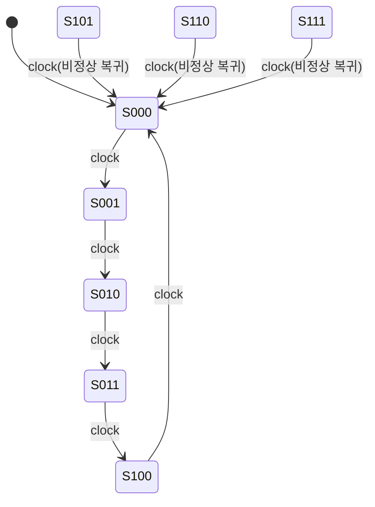

<Callout type="info">
  **이번 문서의 목표:** 이 파일을 다 읽으면 비동기 카운터와 동기 카운터의 구조·속도 차이를 설명하고, 여기표를 이용해 임의의 모듈러(mod-N) 동기 카운터를 상태표부터 논리식까지 직접 설계하며, 카운터가 정상 순환 경로를 벗어났을 때(비정상 상태) 자동으로 복귀하도록 만드는 절차를 적용할 수 있다.
</Callout>

## 왜 카운터를 "설계"까지 해야 할까

10편(컴퓨터구조 쪽에서 다룬 순서논리회로) 수준에서는 카운터를 "T 플립플롭을 나란히 연결해 클록마다 값이 하나씩 늘어나는 회로"로 직관적으로만 이해하고 넘어갔다. 하지만 독학사 시험에서 실제로 자주 나오는 문제는 "2진수 0부터 7까지 세는 카운터"처럼 딱 떨어지는 경우가 아니라, **모드 5, 모드 6, BCD(모드 10)처럼 2의 거듭제곱이 아닌 임의의 개수를 세는 카운터**를 JK 플립플롭으로 직접 설계하라는 유형이다. 이런 문제는 19편에서 배운 **여기표**(excitation table, 원하는 상태 전이를 만들려면 플립플롭 입력에 무엇을 넣어야 하는지 거꾸로 찾는 표)와 20편에서 배운 **상태표 작성법**을 그대로 응용해야 풀린다.

> **쉽게 말하면:** 카운터 설계는 "몇 개의 상태를 어떤 순서로 돌게 할지"를 먼저 정하고, 그 순서를 만들어내는 데 필요한 플립플롭 입력값을 여기표로 거꾸로 계산해서 최종 논리식을 뽑아내는 작업이다.

## 비동기 카운터와 동기 카운터: 구조부터 다시 정리

> **쉽게 말하면:** 비동기 카운터는 앞 플립플롭의 출력이 뒤 플립플롭의 클록이 되어 신호가 순서대로 전달되고, 동기 카운터는 모든 플립플롭이 똑같은 클록을 동시에 받아 한 번에 바뀐다.

**비동기 카운터**(asynchronous counter, 리플 카운터ripple counter라고도 부른다)는 가장 하위 비트를 담당하는 플립플롭만 외부 클록을 직접 받고, 그 위의 비트들은 바로 아래 비트의 출력(주로 $Q$가 1에서 0으로 떨어지는 순간)을 자신의 클록 입력으로 사용한다. 회로 구성이 단순해서(추가 게이트가 거의 필요 없다) 이해하기는 쉽지만, 클록 신호가 마치 물결(ripple)처럼 한 비트씩 순서대로 전파되므로, 비트 수가 늘어날수록 **전파 지연(propagation delay)이 계속 누적**된다. 8비트 리플 카운터라면 최상위 비트가 안정된 값을 갖기까지 플립플롭 8개의 지연 시간을 모두 합한 시간이 걸린다.

**동기 카운터**(synchronous counter)는 모든 플립플롭이 **같은 클록선**에 동시에 연결되어, 클록이 뛰는 순간 모든 비트가 한꺼번에 바뀐다. 다만 "다음 상태가 무엇이 되어야 하는가"를 각 플립플롭이 미리 알고 있어야 하므로, 비트 사이의 관계를 계산하는 **추가 논리 게이트**가 필요하다. 회로는 조금 더 복잡하지만, 모든 비트가 동시에 안정되므로 속도가 빠르고 설계자가 원하는 임의의 순서(꼭 이진수 증가가 아니어도 됨)로 상태를 돌게 만들 수 있다는 것이 결정적인 장점이다.

| 구분 | 비동기(리플) 카운터 | 동기 카운터 |
|---|---|---|
| 클록 연결 | 뒷 비트가 앞 비트의 출력을 클록으로 사용 | 모든 플립플롭이 같은 클록을 동시에 공유 |
| 회로 복잡도 | 단순(추가 게이트 거의 불필요) | 상대적으로 복잡(J, K 입력을 만드는 게이트 필요) |
| 속도 | 비트 수가 늘수록 전파 지연 누적 | 모든 비트가 동시에 바뀌어 상대적으로 빠름 |
| 임의 순서(모드 5, 6 등) 설계 | 구현이 번거로움 | 여기표 기반 절차로 체계적으로 설계 가능 |

<Callout type="warning">
  시험 함정: "리플 카운터는 회로가 단순하므로 항상 동기 카운터보다 빠르다"는 진술은 틀렸다. 회로 단순함과 동작 속도는 별개다. 리플 카운터는 비트마다 전파 지연이 누적되어, 비트 수가 많아질수록 오히려 동기 카운터보다 느려진다.
</Callout>

## 동기 카운터 설계 절차: 여기표를 거꾸로 사용한다

> **쉽게 말하면:** "이 상태에서 저 상태로 가려면 플립플롭에 뭘 넣어야 하지?"를 여기표에서 찾아 표로 정리한 뒤, 그 표를 카르노맵처럼 간소화하면 완성된 회로 논리식이 나온다.

동기 카운터 설계는 20편에서 다룬 일반적인 순차회로 설계 절차(상태도 → 상태표 → 플립플롭 입력방정식 → 출력방정식)를 그대로 따르되, **카운터는 출력이 곧 상태(Q값 자체)** 이므로 별도의 출력 논리를 만들 필요가 없다는 점이 단순화 포인트다. 절차는 다음과 같다.

<Steps>

### 1단계 — 세고 싶은 순서를 정한다

몇 개의 상태를 어떤 순서로 돌게 할지 정한다. 예를 들어 "0, 1, 2, 3, 4를 반복해서 세는 모드 5(mod-5) 카운터"를 만든다고 하자. 상태 5개를 표현하려면 $2^n \geq 5$를 만족하는 최소 비트 수 $n=3$이 필요하다(2비트로는 4개 상태밖에 못 만든다). 3비트를 쓰면 $000$부터 $111$까지 8개의 상태 조합이 생기는데, 이 중 $101$, $110$, $111$은 정상 순환 경로에 포함되지 않는 **비정상 상태(잉여 상태, unused state**)가 된다.

### 2단계 — 상태표(현재 상태 → 다음 상태)를 만든다

정상 경로는 $000 \to 001 \to 010 \to 011 \to 100 \to 000$(다시 처음으로)이다. 비정상 상태 $101$, $110$, $111$은 회로가 잡음이나 전원 투입 시 우연히 그 값에서 시작하더라도 **다음 클록에 바로 정상 경로로 복귀**하도록 전부 $000$으로 보내는 것으로 설계한다(이를 자기 보정, self-correcting 설계라고 한다).

| 현재 상태 $Q_2Q_1Q_0$ | 다음 상태 $Q_2'Q_1'Q_0'$ | 비고 |
|---|---|---|
| 000 | 001 | 정상 |
| 001 | 010 | 정상 |
| 010 | 011 | 정상 |
| 011 | 100 | 정상 |
| 100 | 000 | 정상(순환 완료) |
| 101 | 000 | 비정상 → 자동 복귀 |
| 110 | 000 | 비정상 → 자동 복귀 |
| 111 | 000 | 비정상 → 자동 복귀 |

### 3단계 — 각 플립플롭의 전이를 여기표로 변환한다

JK 플립플롭을 쓴다고 하면, 19편의 JK 여기표를 그대로 가져온다.

| $Q(t)$ | $Q(t+1)$ | $J$ | $K$ |
|---|---|---|---|
| 0 | 0 | 0 | X(무관) |
| 0 | 1 | 1 | X(무관) |
| 1 | 0 | X(무관) | 1 |
| 1 | 1 | X(무관) | 0 |

상태표의 8개 행 각각에 대해, $Q_2$, $Q_1$, $Q_0$ 세 비트가 각자 어떻게 바뀌는지를 이 여기표에 대입해 $J_2K_2$, $J_1K_1$, $J_0K_0$ 값을 채운다.

| $Q_2Q_1Q_0$ | $J_2$ | $K_2$ | $J_1$ | $K_1$ | $J_0$ | $K_0$ |
|---|---|---|---|---|---|---|
| 000 | 0 | X | 0 | X | 1 | X |
| 001 | 0 | X | 1 | X | X | 1 |
| 010 | 0 | X | X | 0 | 1 | X |
| 011 | 1 | X | X | 1 | X | 1 |
| 100 | X | 1 | 0 | X | 0 | X |
| 101 | X | 1 | 0 | X | X | 1 |
| 110 | X | 1 | X | 1 | 0 | X |
| 111 | X | 1 | X | 1 | X | 1 |

### 4단계 — 각 입력을 카르노맵으로 간소화한다

각 열($J_2, K_2, J_1, K_1, J_0, K_0$)을 $Q_2Q_1Q_0$에 대한 함수로 보고 11편·12편에서 익힌 카르노맵 절차(무관 항 포함)로 간소화하면 다음 결과를 얻는다.

$$
J_2 = Q_1 \cdot Q_0
$$

$$
K_2 = 1
$$

- $J_2$: $Q_1=1$이면서 $Q_0=1$인 행(011)에서만 $J_2=1$이 필요하고, 나머지 정의된 행은 모두 0이었다. 무관 항 111을 1로 채워 $Q_2$ 항을 지우면 $Q_1 \cdot Q_0$로 간소화된다.
- $K_2$: $Q_2=1$인 네 행(100·101·110·111)이 모두 $K_2=1$을 요구하므로, $K_2$는 상수 1이다.

$$
J_1 = Q_2' \cdot Q_0
$$

$$
K_1 = Q_0 + Q_2
$$

- $J_1$: 정의된 값 중 $J_1=1$인 행은 001뿐이었다(000, 100, 101은 0). 무관 항 011을 1로 채워 $Q_2' \cdot Q_0$으로 정리해도 000·100·101의 정의값과 모두 일치한다.
- $K_1$: 정의된 값 010=0, 011=1이고, 무관 항 110·111을 1로 채우면 $Q_0 + Q_2$(둘 중 하나라도 1이면 1)로 정리되며, 자유롭게 남는 000·001·100·101 자리는 무관 항이라 결과에 영향을 주지 않는다.

$$
J_0 = Q_2' \cdot Q_0'
$$

$$
K_0 = 1
$$

- $J_0$: 정의된 값 중 $J_0=1$인 행은 000, 010이고 $Q_2=1$인 100, 110은 0이다. 별도의 무관 항 조정 없이도 $Q_2' \cdot Q_0'$로 정확히 맞아떨어진다.
- $K_0$: $Q_0=1$인 네 행(001·011·101·111)이 모두 $K_0=1$을 요구하므로 상수 1이다.

</Steps>

<Callout type="warning">
  시험 함정: 카르노맵을 그릴 때 **무관 항(X)을 실제 회로에 존재하지 않는 상태**로 착각해서 임의로 무시하면 안 된다. 무관 항은 "그 입력 조합이 나타날 일이 없거나 나타나도 결과가 상관없다"는 뜻일 뿐, 셀 자체는 여전히 카르노맵 위에 존재하며 0 또는 1 중 간소화에 유리한 값을 자유롭게 선택해 채워 넣어야 한다.
</Callout>

## 완성된 mod-5 카운터의 회로 구성

위에서 구한 여섯 개의 입력방정식($J_2, K_2, J_1, K_1, J_0, K_0$)을 JK 플립플롭 3개의 입력에 각각 연결하면 mod-5 동기 카운터가 완성된다. $K_2 = 1$과 $K_0 = 1$은 항상 1이 걸려 있는 상수 입력이므로 별도의 게이트 없이 전원(논리 1)에 바로 연결하면 되고, 나머지 네 입력만 AND·OR 게이트로 구현하면 된다.

**결과 해석**: 상태도를 보면 정상 경로 5개 상태($000$~$100$)가 하나의 순환 고리를 이루고, 나머지 비정상 상태 3개($101$, $110$, $111$)는 모두 화살표 하나로 곧장 $000$으로 흡수된다. 이렇게 **비정상 상태에서 정상 경로까지 한 클록 안에 도달**하도록 만드는 것을 자기 보정(self-correcting) 설계라고 하며, 만약 비정상 상태들끼리 서로를 가리키며 순환하는 별도의 고리가 생겨 버리면(예: $101 \to 110 \to 101 \to \cdots$) 카운터가 정상 경로로 절대 돌아오지 못하는 **잠금(lockout)** 상태에 빠진다. 시험에서 "이 카운터 설계가 올바른가"를 묻는 문제는 종종 이 잠금 여부를 확인하라는 함정으로 나온다.

## 모듈러 카운터 개수와 필요 비트 수

> **쉽게 말하면:** N개의 상태를 세려면 $2^n \geq N$을 만족하는 최소 $n$비트가 필요하고, 남는 $2^n - N$개의 여분 상태는 항상 비정상 상태 처리 대상이 된다.

| 모드(N) | 필요 최소 비트 수 $n$ | 전체 상태 $2^n$ | 비정상(잉여) 상태 수 |
|---|---|---|---|
| 3 | 2 | 4 | 1 |
| 5 | 3 | 8 | 3 |
| 6 | 3 | 8 | 2 |
| 10(BCD) | 4 | 16 | 6 |

BCD 카운터(모드 10, 0000~1001을 반복)처럼 실제 시험에 자주 등장하는 카운터도 정확히 같은 절차(상태표 → 여기표 대입 → 카르노맵 간소화)로 설계하며, 다만 비정상 상태가 6개(1010~1111)로 늘어나 카르노맵의 무관 항이 훨씬 많아진다는 점만 다르다.

## 핵심 정리

- 비동기(리플) 카운터는 뒤 비트가 앞 비트의 출력을 클록으로 삼아 회로는 단순하지만 전파 지연이 누적되고, 동기 카운터는 모든 비트가 같은 클록을 공유해 빠르지만 입력 논리를 계산해야 한다.
- 동기 카운터 설계는 (1) 세고 싶은 순서로 상태표 작성 → (2) 각 비트 전이를 플립플롭 여기표에 대입 → (3) 카르노맵으로 J, K(또는 D, T) 입력방정식 간소화 → (4) 게이트로 구현하는 4단계 절차를 따른다.
- 모드 N 카운터는 $2^n \geq N$을 만족하는 최소 $n$비트로 만들며, 남는 $2^n - N$개의 비정상 상태는 자기 보정(다음 클록에 정상 경로로 복귀) 설계로 처리한다.
- 비정상 상태끼리 서로를 순환 참조하면 카운터가 정상 경로로 영영 돌아오지 못하는 잠금(lockout) 상태가 되므로, 설계 후에는 모든 비정상 상태의 다음 상태를 추적해 잠금 여부를 반드시 확인해야 한다.

## 마무리 복습

<Quiz
  questionNumber={1}
  question="비동기(리플) 카운터에 대한 설명으로 옳지 않은 것은?"
  options={['뒤 비트 플립플롭의 클록 입력으로 앞 비트의 출력을 사용한다', '비트 수가 늘어날수록 전파 지연이 누적된다', '모든 플립플롭이 동일한 클록선에 동시에 연결된다', '동기 카운터에 비해 추가 게이트가 거의 필요 없어 회로가 단순하다']}
  correctAnswer={3}
  explanation="옳지 않은 설명을 고르는 문제다. 모든 플립플롭이 같은 클록선에 동시에 연결되는 것은 동기 카운터의 특징이다. 비동기 카운터는 뒤 비트가 앞 비트의 출력을 클록으로 사용하므로 클록선이 공유되지 않는다."
  optionExplanations={['비동기 카운터의 실제 구조에 대한 옳은 설명이다', '비동기 카운터의 대표적인 단점에 대한 옳은 설명이다', '정답이다. 이는 동기 카운터의 정의이며 비동기 카운터와 반대되는 설명이다', '비동기 카운터의 장점에 대한 옳은 설명이다']}
/>

<Quiz
  questionNumber={2}
  question="0, 1, 2, 3, 4 다섯 개의 상태를 순환하는 mod-5 카운터를 만들 때 필요한 최소 플립플롭 개수는?"
  options={['2개', '3개', '4개', '5개']}
  correctAnswer={2}
  explanation="5개의 상태를 표현하려면 2^n &gt;= 5를 만족하는 최소 n이 필요하다. 2비트로는 2^2=4개 상태밖에 만들 수 없어 부족하고, 3비트면 2^3=8개 상태로 5개를 모두 표현할 수 있다."
  optionExplanations={['2비트로는 최대 4개 상태만 표현 가능해 5개 상태를 모두 담을 수 없다', '정답이다. 3비트면 8개 상태 중 5개를 정상 경로로, 3개를 비정상 상태로 쓸 수 있다', '3비트로 이미 충분하므로 4개는 필요 이상이다', '3비트로 이미 충분하므로 5개는 필요 이상이다']}
/>

<Quiz
  questionNumber={3}
  question="mod-5 카운터(3비트, 000~100 정상 순환)에서 비정상 상태 101이 다음 클록에 000으로 이동하도록 설계하는 이유로 가장 적절한 것은?"
  options={['회로의 게이트 수를 늘리기 위해서다', '전원 투입 시나 잡음으로 비정상 상태에 빠지더라도 정상 순환 경로로 자동 복귀시키기 위해서다', 'JK 플립플롭 대신 D 플립플롭을 쓰기 위해서다', '카운터의 모드를 8로 바꾸기 위해서다']}
  correctAnswer={2}
  explanation="비정상 상태를 정상 경로의 시작점(000)으로 되돌리도록 설계하는 것은, 회로가 어떤 이유로든 잉여 상태에 놓이더라도 다음 클록에 바로 정상 순환으로 복귀하게 만드는 자기 보정(self-correcting) 설계이기 때문이다."
  optionExplanations={['자기 보정 설계의 목적은 게이트 수 증가가 아니라 안정적인 복귀다', '정답이다. 자기 보정 설계의 핵심 목적이다', '플립플롭 종류 선택과는 무관한 설계 목적이다', '모드는 정상 상태 개수(5)로 이미 정해져 있으며 비정상 상태 처리와 모드 변경은 무관하다']}
/>

<Quiz
  questionNumber={4}
  question="카운터 설계에서 비정상 상태들이 서로를 가리키며 별도의 순환 고리를 이루어 정상 경로로 돌아오지 못하는 현상을 무엇이라 하는가?"
  options={['오버플로(overflow)', '레이스 컨디션(race condition)', '잠금(lockout)', '해저드(hazard)']}
  correctAnswer={3}
  explanation="비정상 상태들끼리 서로 순환하며 정상 경로로 영영 복귀하지 못하는 현상을 잠금(lockout)이라 한다. 카운터 설계 시 반드시 모든 비정상 상태의 다음 상태를 추적해 이 현상이 없는지 확인해야 한다."
  optionExplanations={['오버플로는 연산 결과가 표현 범위를 벗어나는 현상으로 카운터의 상태 순환 문제와는 다르다', '레이스 컨디션은 신호 전달 순서에 따라 결과가 달라지는 타이밍 문제이며 상태 순환 자체와는 별개다', '정답이다. 잠금은 비정상 상태끼리 순환해 정상 경로로 복귀하지 못하는 설계 결함을 가리킨다', '해저드는 논리 신호가 순간적으로 원치 않는 값을 거치는 현상이며 상태 순환 구조의 문제와는 다르다']}
/>

<Quiz
  questionNumber={5}
  question="JK 플립플롭의 여기표에서 현재 상태 Q(t)=1에서 다음 상태 Q(t+1)=0으로 바뀌려 할 때 필요한 J, K 값은?"
  options={['J=0, K=0', 'J=1, K=무관', 'J=무관, K=1', 'J=0, K=1']}
  correctAnswer={3}
  explanation="JK 여기표에서 Q(t)=1, Q(t+1)=0인 행은 J가 무관(X), K=1이다. K=1이면 Q(t)=1일 때 리셋되어 0이 되고, 이때 J는 무엇이든 상관없다."
  optionExplanations={['J=0, K=0은 상태 유지 조건이며 1에서 0으로의 전이를 만들지 못한다', '이는 Q(t)=0에서 1로 바뀔 때의 여기표 값이다', '정답이다. K=1이면 Q(t)=1을 0으로 리셋하며, 이때 J는 무관하다', 'K=1이 필요조건이지 J=0으로 고정되는 것은 아니다(J는 무관)']}
/>

<Quiz
  questionNumber={6}
  question="BCD(모드 10) 동기 카운터를 4비트 JK 플립플롭으로 설계할 때, 비정상(잉여) 상태의 개수는?"
  options={['2개', '4개', '6개', '10개']}
  correctAnswer={3}
  explanation="4비트로 표현 가능한 전체 상태는 2^4=16개이며, BCD 카운터는 이 중 0000~1001의 10개만 정상 경로로 사용한다. 나머지 16-10=6개(1010~1111)가 비정상 상태다."
  optionExplanations={['16개 중 10개를 뺀 값과 일치하지 않는다', '16개 중 10개를 뺀 값과 일치하지 않는다', '정답이다. 16-10=6개가 비정상 상태(1010~1111)로 남는다', '10은 정상 상태의 개수이며 비정상 상태 개수가 아니다']}
/>

<Quiz
  questionNumber={7}
  question="동기 카운터가 비동기 카운터에 비해 갖는 핵심적인 장점은?"
  options={['회로에 게이트가 전혀 필요 없다', '모든 플립플롭이 같은 클록을 동시에 공유해 전파 지연 누적이 없고 속도가 빠르다', '반드시 이진수 증가 순서로만 동작할 수 있다', '플립플롭 개수를 항상 줄일 수 있다']}
  correctAnswer={2}
  explanation="동기 카운터는 모든 플립플롭이 동일한 클록을 동시에 받아 한꺼번에 상태가 바뀌므로, 비동기 카운터처럼 비트를 거치며 전파 지연이 누적되지 않아 속도가 빠르다."
  optionExplanations={['동기 카운터는 오히려 J, K 입력을 만드는 게이트가 추가로 필요하다', '정답이다. 클록 동시 공유로 인한 전파 지연 누적 방지가 핵심 장점이다', '동기 카운터는 여기표 기반 설계로 이진수 증가가 아닌 임의의 순서(모드 5 등)도 만들 수 있다', '설계하려는 상태 개수에 따라 필요한 플립플롭 개수가 정해지며, 동기 방식이라고 항상 적은 것은 아니다']}
/>

## 참고 자료

- [국가평생교육진흥원 독학학위제 - 과목별 평가영역](https://bdes.nile.or.kr/nile/study/nStudy2_1.do)
- [국가평생교육진흥원 독학학위제 - 출제방향/수준](https://bdes.nile.or.kr/nile/study/nStudy1_1.do)
