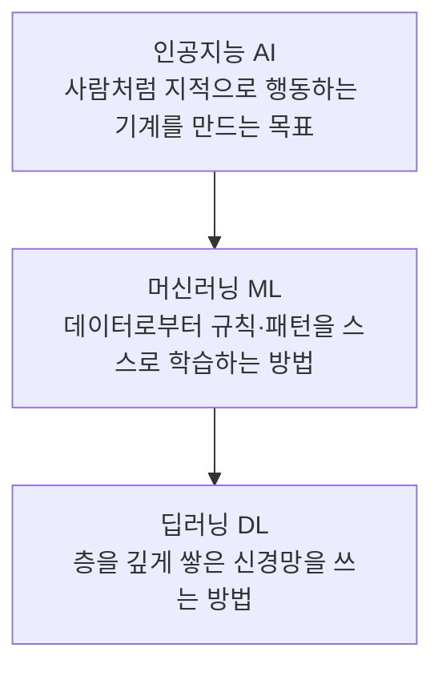
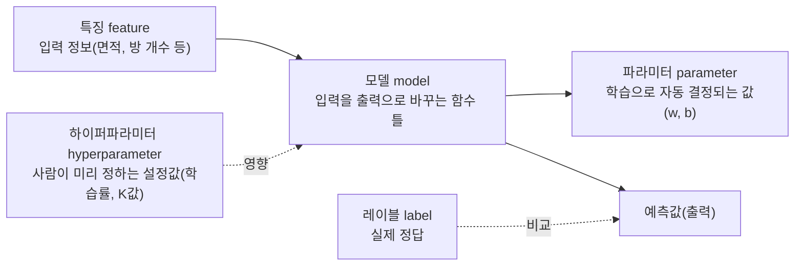

<Callout type="info">
  **이번 문서의 목표:** 이 파일을 다 읽으면 인공지능·머신러닝·딥러닝이 서로 어떤 관계인지 설명하고, 어떤 문제가 지도·비지도·강화학습 중 무엇에 해당하는지 구분하며, 이후 모든 편에서 반복될 모델·파라미터·하이퍼파라미터·특징·레이블이라는 용어를 정확히 쓸 수 있다.
</Callout>

## 왜 세 단어를 구분해야 하는가

뉴스나 광고에서는 인공지능(AI, Artificial Intelligence)과 머신러닝(ML, Machine Learning), 딥러닝(DL, Deep Learning)을 거의 같은 뜻으로 섞어 쓴다. 하지만 독학사 시험에서는 "다음 중 머신러닝에 대한 설명으로 옳은 것은?"처럼 세 개념의 **경계**를 정확히 아는지 묻는 문항이 자주 나온다. 셋을 구분하지 못하면 "딥러닝은 머신러닝의 특수한 경우다"와 "머신러닝은 딥러닝의 특수한 경우다"처럼 정반대인 두 문장 중 어느 쪽이 맞는지 헷갈리게 된다. 이 편에서는 세 개념의 포함 관계를 먼저 정리하고, 머신러닝을 학습 방식에 따라 나누는 기준(지도·비지도·강화학습), 그리고 이후 모든 편에서 계속 등장할 기본 용어(모델·파라미터·하이퍼파라미터·특징·레이블)를 정의한다.

## 인공지능·머신러닝·딥러닝의 포함 관계

> **쉽게 말하면:** 인공지능은 가장 큰 목표(사람처럼 똑똑하게 행동하기)이고, 머신러닝은 그 목표를 이루는 여러 방법 중 하나(데이터로 스스로 규칙을 찾는 방법)이며, 딥러닝은 머신러닝 중에서도 신경망(neural network)이라는 특정 도구를 깊게 쌓아 쓰는 방법이다.

**인공지능**(AI, Artificial Intelligence)은 사람이 하던 지각·추론·판단·언어 이해 같은 지적 작업을 기계가 수행하도록 만드는 것을 목표로 하는 컴퓨터과학의 한 분야다. 인공지능을 구현하는 방법은 다양한데, 초창기에는 사람이 "만약 이 조건이면 이렇게 행동하라"는 **규칙**(rule)을 하나하나 직접 프로그래밍하는 방식(전문가 시스템 등)이 주류였다.

**머신러닝**(ML, Machine Learning)은 인공지능을 구현하는 방법 중 하나로, 사람이 규칙을 직접 코딩하는 대신 **데이터**(data)로부터 규칙 또는 패턴을 컴퓨터가 스스로 찾아내게 하는 접근이다. 예를 들어 "이메일에 '무료', '당첨' 같은 단어가 3개 이상 있으면 스팸으로 분류하라"는 규칙을 사람이 일일이 정하는 대신, 스팸으로 이미 분류된 이메일 수천 건을 컴퓨터에 보여주고 컴퓨터가 스스로 "어떤 단어 조합이 스팸을 잘 구분하는가"라는 규칙을 학습하게 만드는 것이 머신러닝이다.

**딥러닝**(DL, Deep Learning)은 머신러닝 중에서도 **인공신경망**(artificial neural network)을, 그중에서도 층(layer)을 여러 겹 깊게(deep) 쌓은 신경망을 사용하는 방법을 가리킨다. "깊다(deep)"는 말은 입력층과 출력층 사이에 있는 **은닉층**(hidden layer, 계산 과정이 겉으로 드러나지 않는 중간 층)이 여러 개라는 뜻이다. 신경망 자체의 기본 구조(퍼셉트론·다층 퍼셉트론)는 이 과목 20편에서 출제기준 수준으로 다루지만, 합성곱 신경망(CNN)이나 순환 신경망(RNN) 같은 딥러닝 아키텍처의 세부 구조는 이 과목의 범위 밖이다.

세 개념의 관계를 그림으로 보면 다음과 같다.

이 그림에서 화살표는 "포함한다"는 뜻이다. 인공지능이라는 큰 원 안에 머신러닝이라는 원이 있고, 머신러닝이라는 원 안에 딥러닝이라는 원이 있는 구조다. 즉 **모든 딥러닝은 머신러닝이지만, 모든 머신러닝이 딥러닝은 아니다.** 결정트리나 K-최근접이웃(K-NN)처럼 신경망을 쓰지 않는 머신러닝 방법도 이 과목에서 많이 다루는데, 이들은 머신러닝이지만 딥러닝은 아니다. 반대로 사람이 규칙을 직접 코딩한 전통적인 전문가 시스템은 인공지능이지만 머신러닝은 아니다(데이터로부터 스스로 학습하지 않았기 때문이다).

## 학습 패러다임: 지도·비지도·강화학습

> **쉽게 말하면:** 정답(레이블)을 주고 배우면 지도학습, 정답 없이 데이터의 숨은 구조만 찾으면 비지도학습, 행동하고 그 결과로 받는 보상을 통해 배우면 강화학습이다.

머신러닝은 "무엇을 데이터로 주는가, 그리고 그 데이터에 정답이 붙어 있는가"에 따라 크게 세 가지 학습 패러다임(paradigm, 학습 방식의 틀)으로 나뉜다. 이 구분은 이후 06~20편에서 배울 모든 알고리즘을 분류하는 가장 큰 기준이므로 정확히 잡고 넘어가야 한다.

**지도학습**(supervised learning)은 입력 데이터와 그 입력에 대한 정답이 짝을 이루어 함께 주어지는 학습 방식이다. 예를 들어 집의 면적·방 개수 등 입력과 함께 실제 판매 가격(정답)이 주어지면, 모델은 "입력이 이럴 때 정답은 이렇다"는 대응 관계를 학습한다. 정답이 연속적인 숫자(가격, 온도)면 **회귀**(regression) 문제, 정답이 범주(스팸/정상, 합격/불합격)면 **분류**(classification) 문제라 부른다. 회귀와 분류는 08~13편에서 자세히 다룬다.

**비지도학습**(unsupervised learning)은 정답 없이 입력 데이터만 주어지는 학습 방식이다. 정답이 없으므로 "맞다/틀리다"를 판단할 기준이 없고, 대신 데이터 안에 숨어 있는 구조나 규칙성을 찾는 것이 목표다. 예를 들어 고객의 구매 이력만 주고(구매한 상품이 스팸인지 아닌지 같은 정답은 없다) "비슷한 성향의 고객끼리 묶어보라"고 시키면, 모델은 스스로 유사한 고객 그룹(군집, cluster)을 찾아낸다. 군집화(clustering)는 14편, 연관 규칙은 15편, 차원 축소(PCA·LDA)는 16~17편에서 다룬다.

**강화학습**(reinforcement learning)은 정답이 주어지는 대신, 에이전트(agent, 행동을 선택하는 주체)가 환경(environment)과 상호작용하며 행동을 취하고 그 결과로 **보상**(reward)을 받아, 누적 보상을 최대화하는 방향으로 행동 전략을 배우는 학습 방식이다. 바둑 게임에서 한 수를 둘 때마다 정답이 주어지는 것이 아니라, 게임이 끝난 뒤 "이겼다/졌다"는 결과로부터 거꾸로 어떤 수가 좋았는지를 배우는 것이 강화학습의 전형적인 예다. 이 과목은 강화학습의 알고리즘 구현이나 수식 전개는 다루지 않고, 정의와 지도·비지도학습과의 구분만 07편에서 출제기준 수준으로 다룬다.

세 패러다임을 표로 비교하면 다음과 같다.

| 구분 | 주어지는 데이터 | 학습 목표 | 대표 문제 |
|------|------------------|-----------|-----------|
| 지도학습 | 입력 + 정답(레이블) | 입력에서 정답으로 가는 대응 관계 학습 | 회귀, 분류 |
| 비지도학습 | 입력만(정답 없음) | 데이터 안의 숨은 구조·패턴 발견 | 군집화, 차원 축소, 연관 규칙 |
| 강화학습 | 행동에 대한 보상 신호 | 누적 보상을 최대화하는 행동 전략 학습 | 게임 플레이, 로봇 제어 |

> **자주 틀리는 점:** "정답이 있으면 무조건 지도학습"이라고 오해하기 쉽지만, 정확히는 "**입력마다 정답이 하나씩 붙어서 함께 제공되는가**"가 기준이다. 강화학습에서 받는 보상은 정답(이 행동이 정확히 옳다는 표시)이 아니라 "이 행동이 얼마나 좋았는지"에 대한 평가 신호일 뿐이며, 매 순간 정답 행동이 무엇인지 알려주지 않는다는 점에서 지도학습과 다르다.

## 머신러닝의 기본 용어: 모델·파라미터·하이퍼파라미터·특징·레이블

> **쉽게 말하면:** 모델은 규칙을 담는 그릇, 파라미터는 학습을 통해 데이터가 스스로 채우는 숫자, 하이퍼파라미터는 학습을 시작하기 전에 사람이 미리 정해두는 설정값, 특징은 입력 정보 하나하나, 레이블은 정답이다.

이 다섯 용어는 이후 모든 편에서 설명 없이 바로 쓰이므로 여기서 확실히 정의한다.

**모델**(model)은 입력을 받아 출력(예측값)을 내놓는 수학적인 함수 또는 규칙의 틀을 말한다. 예를 들어 "면적이 늘어날수록 집값도 일정 비율로 늘어난다"는 관계를 $y = wx + b$라는 직선 형태로 표현하기로 정했다면, 이 직선 형태 자체가 모델이다. 아직 $w$와 $b$의 구체적인 숫자를 정하지 않은 상태에서도 "직선 모델을 쓴다"는 것은 이미 정해진 것이다.

**파라미터**(parameter, 모수)는 모델 안에 있는 숫자값 중에서 **학습 과정을 통해 데이터로부터 자동으로 결정되는 값**이다. 위 예시에서 $w$(기울기)와 $b$(절편)가 파라미터다. 학습을 시작할 때는 파라미터를 임의의 값(또는 0)으로 두었다가, 데이터를 보면서 예측이 더 정확해지는 방향으로 파라미터 값을 조금씩 갱신해 나간다. 이 갱신 과정이 바로 "학습(training)"이 의미하는 것이다.

**하이퍼파라미터**(hyperparameter)는 파라미터와 달리 **학습이 시작되기 전에 사람이 직접 정해서 고정해 두는 값**으로, 학습 과정 중에는 데이터가 스스로 바꾸지 않는다. 예를 들어 "학습을 몇 번 반복할 것인가(반복 횟수)", "한 번에 파라미터를 얼마나 크게 갱신할 것인가(학습률)", "K-최근접이웃에서 주변 이웃을 몇 개 볼 것인가(K값)" 같은 값들이 하이퍼파라미터다. 하이퍼파라미터를 어떻게 정하느냐에 따라 같은 모델이라도 학습 결과가 크게 달라지므로, 19편에서 다룰 교차검증(cross-validation)은 바로 이 하이퍼파라미터를 데이터로 실험해 가장 좋은 값을 고르는 절차다.

**특징**(feature, 자질)은 모델에 입력으로 넣는 정보 하나하나를 말한다. 집값을 예측하는 문제라면 면적, 방 개수, 지어진 연도, 역세권 여부 등이 각각 하나의 특징이다. 여러 특징을 모아 한 데이터 샘플을 표현한 것을 **특징 벡터**(feature vector)라 하며, 이는 02편에서 특징 행렬(feature matrix)로 확장해 다룬다.

**레이블**(label, 타깃)은 지도학습에서 각 입력 샘플에 대응하는 정답을 말한다. 집값 예측이라면 실제 판매 가격이 레이블이고, 스팸 분류라면 "스팸" 또는 "정상"이 레이블이다. 레이블은 회귀 문제에서는 연속적인 숫자(가격), 분류 문제에서는 범주(스팸/정상)의 형태를 띤다는 점을 기억해 두자. 비지도학습에는 애초에 레이블이 없다.

다섯 용어의 관계를 정리하면 다음과 같다.

이 그림에서 모델은 특징을 입력받아 예측값을 내놓고, 그 예측값이 실제 레이블과 얼마나 차이 나는지를 비교해 파라미터를 갱신하는 과정이 학습이다. 하이퍼파라미터는 이 학습 과정 자체를 조절하는 손잡이 역할을 하지만, 학습 도중에는 값이 스스로 바뀌지 않는다.

**비유로 이해하기:** 요리에 비유하면, 모델은 "레시피의 형식"(재료 A와 재료 B를 몇 대 몇 비율로 섞는다는 틀)이고, 파라미터는 그 비율의 구체적인 숫자(예: 3대 1)로 여러 번 시식하며 맛있어질 때까지 조정하는 값이며, 하이퍼파라미터는 애초에 "오븐을 몇 도로 예열할 것인가", "몇 분간 구울 것인가"처럼 요리를 시작하기 전에 요리사가 정해두는 값이다. 특징은 사용하는 재료 목록 자체이고, 레이블은 "이 정도면 맛있다"는 기준(정답 맛)이다.

## 자주 틀리는 점

- "딥러닝이 머신러닝을 포함한다"고 반대로 암기하는 경우가 많다. 포함 관계는 항상 **인공지능 ⊃ 머신러닝 ⊃ 딥러닝**이다(딥러닝이 가장 좁은 개념).
- 강화학습을 "정답이 주어지는 지도학습의 일종"으로 오해한다. 강화학습은 정답이 아니라 보상(평가 신호)만 받으며, 그마저도 행동을 한 뒤 시간이 지나서 받는 경우가 많다.
- 파라미터와 하이퍼파라미터를 뒤바꿔 쓴다. **학습 중 데이터로 자동으로 정해지면 파라미터, 학습 전에 사람이 정해두면 하이퍼파라미터**라는 기준으로 항상 구분한다.
- 특징과 레이블을 혼동한다. 특징은 입력(문제), 레이블은 출력(정답)이다.

## 핵심 정리

- 인공지능은 가장 넓은 개념, 머신러닝은 데이터로 규칙을 학습하는 방법, 딥러닝은 깊은 신경망을 쓰는 머신러닝의 한 방법이다(AI ⊃ ML ⊃ DL).
- 학습 패러다임은 정답 유무와 형태에 따라 지도학습(입력+정답), 비지도학습(입력만), 강화학습(행동+보상)으로 나뉜다.
- 모델은 입력을 출력으로 바꾸는 함수의 틀이고, 파라미터는 학습으로 자동 결정되는 값, 하이퍼파라미터는 학습 전 사람이 정하는 값이다.
- 특징은 입력 정보, 레이블은 지도학습에서 주어지는 정답이다.

## 마무리 복습

<Quiz
  questionNumber={1}
  question="인공지능·머신러닝·딥러닝의 포함 관계로 옳은 것은?"
  options={['딥러닝이 머신러닝을 포함하고, 머신러닝이 인공지능을 포함한다', '인공지능이 머신러닝을 포함하고, 머신러닝이 딥러닝을 포함한다', '셋은 서로 겹치지 않는 독립된 개념이다', '머신러닝과 딥러닝은 같은 개념이고 인공지능만 다르다']}
  correctAnswer={2}
  explanation="포함 관계는 인공지능 ⊃ 머신러닝 ⊃ 딥러닝이다. 딥러닝은 머신러닝의 한 방법(깊은 신경망을 쓰는 방법)이고, 머신러닝은 인공지능을 구현하는 한 방법(데이터로 스스로 학습하는 방법)이다."
  optionExplanations={['포함 관계가 반대로 서술되어 있다', '올바른 포함 관계다', '세 개념은 서로 포함하는 관계이지 독립적이지 않다', '머신러닝과 딥러닝은 같은 개념이 아니라 딥러닝이 머신러닝의 부분집합이다']}
/>

<Quiz
  questionNumber={2}
  question="어떤 학습 방법이 딥러닝으로 분류되기 위한 핵심 조건은 무엇인가?"
  options={['정답 레이블 없이 학습해야 한다', '보상 신호를 받아 학습해야 한다', '층을 여러 겹 쌓은 신경망 구조를 사용해야 한다', '반드시 이미지 데이터를 다뤄야 한다']}
  correctAnswer={3}
  explanation="딥러닝은 은닉층을 여러 개 깊게 쌓은 인공신경망을 사용하는 머신러닝 방법을 가리킨다. 데이터 종류나 레이블 유무는 딥러닝 여부를 결정하는 기준이 아니다."
  optionExplanations={['레이블 유무는 지도·비지도학습을 구분하는 기준이지 딥러닝 여부와 무관하다', '보상 신호는 강화학습의 특징이지 딥러닝의 정의가 아니다', '층을 깊게 쌓은 신경망 사용이 딥러닝의 정의이므로 정답이다', '딥러닝은 이미지뿐 아니라 텍스트, 음성 등 다양한 데이터에도 쓰인다']}
/>

<Quiz
  questionNumber={3}
  question="고객 구매 이력 데이터만 있고 정답(구매 성향 그룹 같은 레이블)이 전혀 없는 상태에서 비슷한 고객끼리 자동으로 묶는 작업은 어떤 학습 패러다임에 해당하는가?"
  options={['지도학습', '비지도학습', '강화학습', '준지도학습']}
  correctAnswer={2}
  explanation="정답(레이블) 없이 입력 데이터만으로 데이터 안의 숨은 구조(비슷한 고객 그룹)를 찾는 작업이므로 비지도학습에 해당한다. 이런 문제를 군집화라 한다."
  optionExplanations={['지도학습은 입력과 정답이 함께 주어져야 하는데 이 문제에는 정답이 없다', '레이블 없이 구조를 찾는 문제이므로 정답이다', '강화학습은 행동과 보상이 필요한데 이 문제에는 그런 요소가 없다', '준지도학습은 이 과목의 범위에 포함되지 않는 별도 개념이다']}
/>

<Quiz
  questionNumber={4}
  question="선형회귀 모델 y=wx+b에서 학습이 진행되는 동안 데이터로부터 자동으로 값이 결정되는 대상은?"
  options={['w와 b', '학습률', '반복 횟수', 'K-최근접이웃의 K값']}
  correctAnswer={1}
  explanation="w(기울기)와 b(절편)는 모델의 파라미터로, 학습 과정에서 데이터를 보며 예측 오차를 줄이는 방향으로 자동으로 갱신되는 값이다. 학습률·반복 횟수·K값은 모두 학습 전에 사람이 정해두는 하이퍼파라미터다."
  optionExplanations={['w와 b는 학습 중 자동으로 결정되는 파라미터이므로 정답이다', '학습률은 학습 전 사람이 정하는 하이퍼파라미터다', '반복 횟수도 학습 전 사람이 정하는 하이퍼파라미터다', 'K값도 학습 전 사람이 정하는 하이퍼파라미터다']}
/>

<Quiz
  questionNumber={5}
  question="하이퍼파라미터에 대한 설명으로 옳지 않은 것은?"
  options={['학습을 시작하기 전에 사람이 미리 정해두는 값이다', '학습이 진행되는 동안 데이터에 의해 자동으로 값이 바뀐다', '같은 모델이라도 하이퍼파라미터 값에 따라 학습 결과가 달라질 수 있다', '학습률, 반복 횟수, K값 등이 대표적인 예다']}
  correctAnswer={2}
  explanation="하이퍼파라미터는 학습 전에 고정해 두는 값으로, 학습이 진행되는 동안 데이터가 그 값을 스스로 바꾸지 않는다. 학습 중 데이터에 의해 자동으로 값이 바뀌는 것은 파라미터다."
  optionExplanations={['옳은 설명이다', '하이퍼파라미터의 정의와 반대되는 설명이므로 정답(옳지 않은 것)이다', '옳은 설명으로, 실제로 하이퍼파라미터 선택이 성능을 좌우한다', '모두 하이퍼파라미터의 실제 예시로 옳다']}
/>

<Quiz
  questionNumber={6}
  question="강화학습이 지도학습과 근본적으로 다른 점은 무엇인가?"
  options={['강화학습은 데이터를 전혀 사용하지 않는다', '강화학습은 매 순간 정답 행동을 직접 알려주지 않고 행동에 대한 보상만 받는다', '강화학습은 회귀 문제만 다룬다', '강화학습에는 모델이라는 개념이 존재하지 않는다']}
  correctAnswer={2}
  explanation="지도학습은 입력마다 정답이 함께 주어지지만, 강화학습은 에이전트가 행동을 취한 결과로 보상이라는 평가 신호만 받을 뿐 '이 상황에서 정확히 어떤 행동이 정답이다'라는 정보를 직접 받지 않는다."
  optionExplanations={['강화학습도 환경과 상호작용하며 얻는 데이터(상태, 행동, 보상)를 사용한다', '보상 신호만 받고 정답 행동을 직접 알려주지 않는다는 점이 지도학습과의 핵심 차이이므로 정답이다', '강화학습은 회귀·분류가 아니라 행동 전략(정책)을 학습하는 별도의 문제 유형이다', '강화학습에도 행동을 결정하는 모델(정책)이 존재한다']}
/>

## 참고 자료

- [국가평생교육진흥원 독학학위제](https://bdes.nile.or.kr) — 독학사 2단계 머신러닝 과목 편제 및 출제기준 확인
- [scikit-learn User Guide](https://scikit-learn.org/stable/user_guide.html) — 지도·비지도학습 문제 분류와 대표 알고리즘 개요 참고
