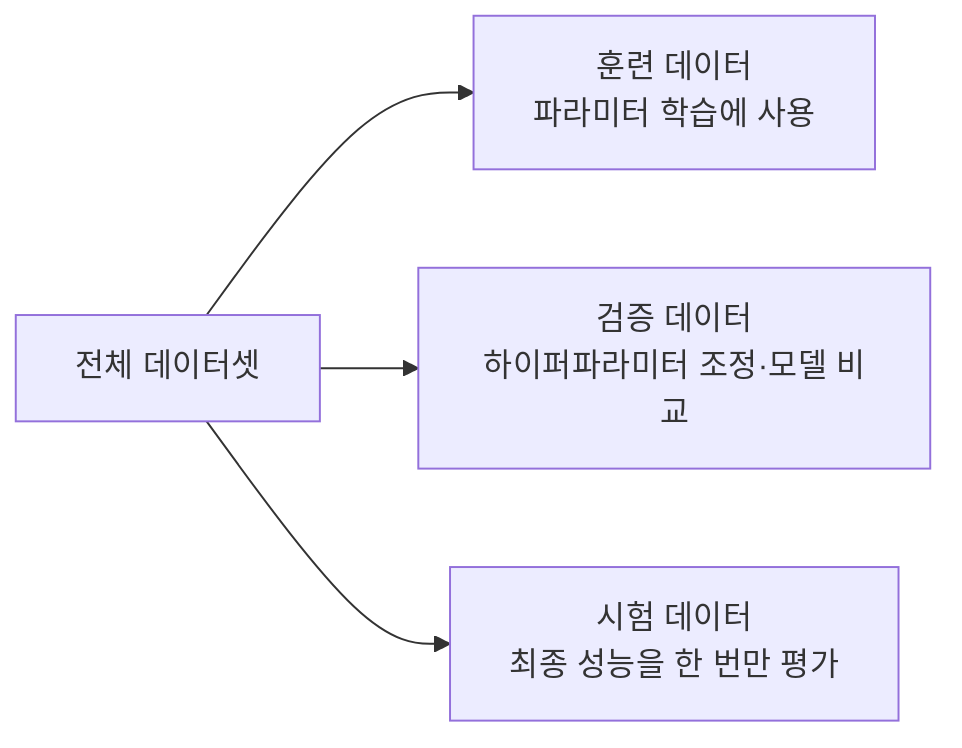

<Callout type="info">
  **이번 문서의 목표:** 이 파일을 다 읽으면 머신러닝에서 데이터를 특징 행렬과 타깃 벡터로 표현하는 방식을 설명하고, 기대값·분산을 직접 계산하며, 훈련/검증/시험 데이터를 왜 나누는지 설명할 수 있다.
</Callout>

## 왜 데이터를 표와 확률의 언어로 다시 표현해야 하는가

머신러닝 알고리즘은 수식으로 정의되어 있고, 수식은 숫자와 벡터·행렬에 대해서만 계산할 수 있다. 그런데 우리가 실제로 다루는 데이터는 "고객 이름, 나이, 구매 금액" 같은 표 형태로 존재한다. 이 편에서는 표 형태의 데이터를 머신러닝이 계산할 수 있는 형태(특징 행렬, 타깃 벡터)로 바꾸는 방법을 먼저 정리하고, 이후 편에서 손실함수·정규화 등을 이해하는 데 필요한 확률·통계 최소 용어(확률변수, 분포, 기대값, 분산)를 실제 숫자로 계산해 본다. 마지막으로 "가진 데이터를 왜 그냥 다 학습에 쓰지 않고 훈련·검증·시험 세 덩어리로 쪼개는가"라는, 이후 19편의 교차검증까지 이어지는 근본적인 질문에 답한다.

## 데이터셋·샘플·특징 행렬·타깃 벡터

> **쉽게 말하면:** 데이터셋은 표 전체, 샘플은 표의 한 행, 특징 행렬은 정답 열을 뺀 나머지 숫자 표, 타깃 벡터는 정답 열만 뽑아 세로로 세운 것이다.

**데이터셋**(dataset)은 머신러닝 학습에 사용하는 데이터 전체의 모음을 말한다. 표 형태로 생각하면, 각 행은 하나의 관측 대상(고객 한 명, 집 한 채)이고 각 열은 그 대상의 속성 하나(나이, 면적, 가격)다.

**샘플**(sample, 관측치·인스턴스)은 데이터셋을 이루는 개별 행 하나, 즉 하나의 관측 대상을 말한다. "샘플 5개로 이루어진 데이터셋"이라 하면 표에 행이 5개 있다는 뜻이다.

다음과 같이 집 5채의 면적(제곱미터)과 방 개수, 그리고 실제 판매 가격(만 원)을 모은 작은 데이터셋을 예로 들어보자.

| 샘플 | 면적($m^2$) | 방 개수 | 가격(만 원) |
|------|-------------|---------|-------------|
| 1 | 60 | 2 | 30000 |
| 2 | 85 | 3 | 45000 |
| 3 | 100 | 3 | 52000 |
| 4 | 45 | 1 | 22000 |
| 5 | 120 | 4 | 61000 |

이 표에서 "면적"과 "방 개수"는 01편에서 정의한 **특징**(feature)이고, "가격"은 우리가 맞히고 싶은 **레이블**(label, 타깃)이다. 특징들만 모아 숫자 행렬로 표현한 것을 **특징 행렬**(feature matrix, 흔히 $X$로 표기)이라 하고, 레이블만 모아 세로로 세운 것을 **타깃 벡터**(target vector, 흔히 $y$로 표기)라 한다.

$$
X = \begin{bmatrix} 60 & 2 \\ 85 & 3 \\ 100 & 3 \\ 45 & 1 \\ 120 & 4 \end{bmatrix}, \qquad y = \begin{bmatrix} 30000 \\ 45000 \\ 52000 \\ 22000 \\ 61000 \end{bmatrix}
$$

- $X$: 행이 샘플, 열이 특징인 2차원 배열(행렬). 이 예에서는 5개 샘플 $\times$ 2개 특징이므로 "5행 2열" 또는 $5\times2$ 행렬이라 부른다.
- $y$: 각 샘플에 대응하는 정답 하나씩을 순서대로 담은 1차원 배열(벡터). 샘플 개수와 같은 5개의 원소를 가진다.

여기서 $X$의 $i$번째 행(=$i$번째 샘플의 특징들)을 흔히 $x_i$로, $y$의 $i$번째 원소(=$i$번째 샘플의 정답)를 $y_i$로 표기한다. 예를 들어 $x_3 = [100, 3]$이고 $y_3 = 52000$이다. 이 $x_i$와 $y_i$의 표기법은 08편 이후 회귀·분류 수식에서 계속 그대로 쓰이므로 지금 확실히 익혀 둔다.

> **자주 틀리는 점:** 특징 행렬 $X$의 행과 열을 거꾸로 외우는 경우가 많다. **행(row)은 샘플, 열(column)은 특징**이라는 규칙은 scikit-learn을 포함한 대부분의 라이브러리에서 표준이므로, "행은 누가(샘플), 열은 무엇을(특징)"으로 기억해 두자.

## 확률변수와 확률분포

> **쉽게 말하면:** 확률변수는 결과가 아직 정해지지 않은 값에 숫자를 매긴 것이고, 확률분포는 그 숫자들이 각각 얼마나 자주 나올지를 정리한 표(또는 함수)다.

**확률변수**(random variable, 흔히 $X$로 표기하되 특징 행렬의 $X$와는 문맥으로 구분한다)는 시행의 결과에 따라 값이 정해지는 변수를 말한다. 예를 들어 동전을 두 번 던져 나오는 앞면의 개수를 확률변수 $X$라 하면, $X$는 0, 1, 2 중 하나의 값을 가진다.

**확률분포**(probability distribution)는 확률변수가 가질 수 있는 각 값에 대해 그 값이 나올 확률을 짝지어 놓은 것이다. 동전 두 번 던지기에서 나올 수 있는 모든 경우(앞앞, 앞뒤, 뒤앞, 뒤뒤)는 각각 $1/4$의 확률을 가지므로, 앞면 개수 $X$의 확률분포는 다음과 같다.

| $X$(앞면 개수) | 0 | 1 | 2 |
|---|---|---|---|
| $P(X)$ | 1/4 | 2/4 | 1/4 |

값이 0, 1, 2처럼 셀 수 있는 형태면 **이산확률분포**(discrete distribution), 키·몸무게처럼 어떤 구간 안의 모든 실수값을 가질 수 있으면 **연속확률분포**(continuous distribution)라 한다. 머신러닝에서 분류 문제의 출력(스팸일 확률)은 이산적인 범주에 대한 확률이고, 회귀 문제의 예측 오차는 흔히 연속확률분포(대표적으로 정규분포)를 따른다고 가정한다.

## 기대값: 확률로 가중 평균한 대푯값

> **쉽게 말하면:** 기대값은 확률변수가 장기적으로(무한히 반복했을 때) 평균적으로 어떤 값에 수렴하는지를 나타내는, 확률로 가중치를 준 평균이다.

**기대값**(expected value, 기호 $E[X]$)은 확률변수 $X$가 가질 수 있는 각 값에 그 값이 나올 확률을 곱한 뒤 모두 더한 값이다.

$$
E[X] = \sum_{i} x_i \, P(X=x_i)
$$

- $x_i$: 확률변수 $X$가 가질 수 있는 $i$번째 값
- $P(X=x_i)$: $X$가 정확히 $x_i$ 값을 가질 확률
- $\sum_i$: 시그마, 모든 $i$에 대해 뒤의 항을 더하라는 기호

위 동전 두 번 던지기 예제의 기대값을 계산해 보자.

$$
E[X] = 0\times\frac{1}{4} + 1\times\frac{2}{4} + 2\times\frac{1}{4} = 0 + \frac{2}{4} + \frac{2}{4} = 1
$$

**결과 해석:** 동전을 두 번 던지는 시행을 아주 많이 반복하면, 나오는 앞면 개수의 평균은 1개에 가까워진다는 뜻이다. 실제로 동전 하나가 앞면이 나올 확률이 $1/2$이므로, 두 번 던지면 평균적으로 앞면이 한 번 나오는 것이 직관과도 일치한다.

## 분산: 값이 기대값 주변에서 얼마나 퍼져 있는가

> **쉽게 말하면:** 분산은 확률변수의 값들이 기대값(평균)에서 평균적으로 얼마나 멀리 떨어져 있는지를 숫자 하나로 나타낸 것이다.

**분산**(variance, 기호 $Var(X)$ 또는 $\sigma^2$)은 각 값이 기대값에서 떨어진 정도(편차)를 제곱한 뒤, 그 제곱값의 기대값을 구한 것이다.

$$
Var(X) = E\big[(X - E[X])^2\big]
$$

- $E[X]$: 확률변수 $X$의 기대값(평균)
- $X - E[X]$: 각 값이 평균에서 떨어진 거리(편차)
- $(X-E[X])^2$: 편차를 제곱해 음수·양수 부호를 없앤 값
- $\sigma$: 시그마(소문자), 표준편차를 나타내는 기호로 관습적으로 쓰인다. $\sigma^2$는 분산을 뜻한다.

편차를 제곱하는 이유는, 그냥 편차를 더하면 평균보다 큰 값과 작은 값의 편차가 서로 상쇄되어 항상 0에 가까워지기 때문이다(실제로 편차의 기대값 $E[X-E[X]]$는 정확히 0이다). 제곱을 하면 방향(부호)에 관계없이 "얼마나 멀리 떨어져 있는가"만 남는다.

앞의 동전 두 번 던지기 예제로 분산을 계산해 보자. 기대값은 이미 $E[X]=1$로 구했다.

$$
Var(X) = (0-1)^2\times\frac{1}{4} + (1-1)^2\times\frac{2}{4} + (2-1)^2\times\frac{1}{4}
$$

$$
Var(X) = 1\times\frac{1}{4} + 0\times\frac{2}{4} + 1\times\frac{1}{4} = \frac{1}{4}+0+\frac{1}{4} = \frac{1}{2}
$$

**결과 해석:** 분산이 $1/2 = 0.5$로 나왔다. 분산은 제곱한 값이라 원래 단위(개수)와 직접 비교하기 어려우므로, 분산에 제곱근을 씌운 **표준편차**(standard deviation, $\sigma = \sqrt{Var(X)}$)를 함께 쓰는 경우가 많다. 여기서는 $\sigma = \sqrt{0.5} \approx 0.71$로, "앞면 개수는 평균 1개에서 위아래로 약 0.71개 정도 흩어져 있다"고 해석할 수 있다.

**왜 머신러닝에서 분산이 중요한가:** 09편의 릿지·라쏘 회귀, 19편의 편향-분산(bias-variance) 트레이드오프에서 "분산이 크다"는 말은 모델의 예측이 훈련 데이터가 조금만 바뀌어도 크게 흔들린다는 뜻으로 확장되어 쓰인다. 지금 이 편에서 배우는 분산의 계산 원리(기대값에서 떨어진 정도의 제곱 평균)가 그 확장된 의미의 수학적 뿌리다.

## 샘플링과 훈련/검증/시험 데이터 분할

> **쉽게 말하면:** 가진 데이터를 전부 학습에 쓰면 "이미 본 문제를 다시 푸는 시험"이 되어버리므로, 일부러 일부를 떼어내 한 번도 보여주지 않은 채로 남겨두고 그것으로 실력을 확인한다.

**샘플링**(sampling)은 전체 대상(모집단) 중 일부를 뽑아내는 과정을 말한다. 머신러닝에서는 보통 이미 수집된 데이터셋 전체에서 다시 일부를 무작위로 골라 훈련용·검증용·시험용으로 나누는 데 이 개념을 쓴다.

머신러닝 모델을 학습시킬 때는 가진 데이터를 보통 세 부분으로 나눈다.

- **훈련 데이터**(training set): 모델의 파라미터(01편에서 정의한, 데이터로부터 자동 결정되는 값)를 실제로 학습시키는 데 쓰는 데이터.
- **검증 데이터**(validation set): 학습에는 직접 쓰지 않고, 하이퍼파라미터(학습 전 사람이 정하는 값)를 조정하거나 여러 모델 중 어떤 것을 최종으로 고를지 비교하는 데 쓰는 데이터.
- **시험 데이터**(test set): 최종적으로 선택한 모델의 성능을 딱 한 번, 마지막에 평가하는 데만 쓰는 데이터. 모델을 만드는 어떤 과정에도 절대 미리 사용하지 않는다.

흔히 쓰는 분할 비율은 훈련 60~80퍼센트, 검증 10~20퍼센트, 시험 10~20퍼센트 수준이지만, 이는 절대적인 규칙이 아니라 데이터 양과 문제 상황에 따라 조정하는 관행이다. 예를 들어 데이터가 100개뿐인 작은 데이터셋과 100만 개인 데이터셋은 같은 비율을 적용해도 실제 검증·시험 데이터의 개수 차이가 커서, 데이터가 아주 많을 때는 검증·시험 비율을 오히려 낮추기도 한다.

**왜 나눠야 하는가:** 모델이 훈련 데이터에서는 정확도가 매우 높지만, 훈련 때 보지 못한 새로운 데이터에서는 정확도가 뚝 떨어지는 현상을 **과적합**(overfitting)이라 한다(19편에서 자세히 다룬다). 훈련 데이터로만 성능을 확인하면 이 문제를 전혀 눈치챌 수 없다. 학생이 기출문제를 통째로 외워서 그 문제만 다시 풀면 100점이 나오지만, 처음 보는 새 문제에서는 점수가 낮은 상황과 같다. 검증·시험 데이터는 "한 번도 공부하지 않은 새 문제"의 역할을 해서, 모델이 정말 일반적인 규칙을 배웠는지, 아니면 훈련 데이터를 그냥 통째로 외웠는지를 구분해 준다.

> **자주 틀리는 점:** 검증 데이터와 시험 데이터의 역할을 같다고 생각하는 경우가 많다. 검증 데이터는 하이퍼파라미터를 **바꿔가며 여러 번** 성능을 확인하는 데 쓰이지만, 시험 데이터는 모델을 다 완성한 뒤 **정확히 한 번만** 사용해야 한다. 시험 데이터로 결과를 보고 다시 모델을 수정한다면, 그 순간부터 시험 데이터는 검증 데이터처럼 오염되어 더 이상 "한 번도 보지 못한 데이터"가 아니게 된다.

## 자주 틀리는 점

- 특징 행렬 $X$의 행과 열을 반대로 기억한다. 행은 항상 샘플, 열은 항상 특징이다.
- 분산을 구할 때 편차를 제곱하지 않고 그냥 더해서 항상 0에 가까운 값을 얻는다. 편차의 기대값은 정의상 0에 가까우므로, 반드시 제곱한 뒤 평균을 낸다.
- 표준편차와 분산을 같은 것으로 혼동한다. 표준편차는 분산에 제곱근을 씌운 값으로 단위가 원래 데이터와 같아진다.
- 시험 데이터를 모델 개선 과정에서 반복해서 들여다본다. 이는 시험 데이터를 사실상 검증 데이터로 써버리는 실수로, 최종 성능을 부풀려 보이게 만든다.

## 핵심 정리

- 데이터셋은 샘플(행)의 모음이며, 특징 행렬 $X$(행=샘플, 열=특징)와 타깃 벡터 $y$(정답)로 나누어 표현한다.
- 확률변수는 시행 결과에 값을 매긴 것, 확률분포는 그 값들이 나올 확률을 정리한 것이다.
- 기대값 $E[X]=\sum_i x_i P(X=x_i)$은 확률로 가중한 평균이고, 분산 $Var(X)=E[(X-E[X])^2]$는 값이 기대값에서 퍼진 정도다.
- 데이터는 훈련·검증·시험으로 나누어, 훈련은 파라미터 학습, 검증은 하이퍼파라미터 조정, 시험은 최종 성능을 단 한 번 평가하는 데 쓴다.

## 마무리 복습

<Quiz
  questionNumber={1}
  question="집 5채의 면적·방 개수를 특징으로, 가격을 레이블로 하는 데이터셋에서 특징 행렬 X의 형태로 옳은 것은?"
  options={['5행 1열(방 개수만 포함)', '5행 2열(면적과 방 개수를 열로 포함)', '2행 5열(특징을 행으로 포함)', '1행 5열(가격만 포함)']}
  correctAnswer={2}
  explanation="특징 행렬은 행이 샘플, 열이 특징인 형태로 구성된다. 샘플이 5개이고 특징이 면적, 방 개수 2개이므로 5행 2열의 행렬이 된다."
  optionExplanations={['방 개수 하나만으로는 두 특징을 모두 담을 수 없다', '행은 샘플(5개), 열은 특징(2개)이므로 정답이다', '행과 열이 뒤바뀐 형태로, 특징 행렬의 표준 표현이 아니다', '가격은 특징이 아니라 타깃 벡터 y에 해당한다']}
/>

<Quiz
  questionNumber={2}
  question="주사위를 한 번 던져 나오는 눈의 수를 확률변수 X라 할 때, E[X]는 얼마인가?"
  options={['3', '3.5', '4', '6']}
  correctAnswer={2}
  explanation="주사위는 1부터 6까지 각각 1/6의 확률로 나온다. E[X] = (1+2+3+4+5+6)×(1/6) = 21/6 = 3.5다."
  optionExplanations={['정수로 반올림한 값으로, 정확한 기대값이 아니다', '(1+2+3+4+5+6)/6=3.5로 정답이다', '평균보다 큰 값으로 계산 오류다', '주사위 눈의 최댓값일 뿐 기대값이 아니다']}
/>

<Quiz
  questionNumber={3}
  question="확률변수 X가 0, 1, 2를 각각 1/4, 2/4, 1/4의 확률로 가질 때 분산 Var(X)는 얼마인가? (E[X]=1)"
  options={['0', '0.25', '0.5', '1']}
  correctAnswer={3}
  explanation="Var(X) = (0-1)²×(1/4) + (1-1)²×(2/4) + (2-1)²×(1/4) = 1×0.25 + 0 + 1×0.25 = 0.5다."
  optionExplanations={['모든 값이 같을 때만 분산이 0이 되는데 이 분포는 값이 퍼져 있다', '계산 중간값과 혼동한 결과다', '(0-1)²×0.25+(1-1)²×0.5+(2-1)²×0.25=0.5로 정답이다', 'E[X] 값과 혼동한 것이다']}
/>

<Quiz
  questionNumber={4}
  question="머신러닝에서 데이터를 훈련·검증·시험 세 부분으로 나누는 가장 근본적인 이유는?"
  options={['데이터를 저장하는 용량을 줄이기 위해서다', '모델이 훈련 데이터를 그대로 암기했는지, 새로운 데이터에도 일반화되는지 확인하기 위해서다', '계산 속도를 높이기 위해서다', '특징의 개수를 줄이기 위해서다']}
  correctAnswer={2}
  explanation="훈련 데이터로만 성능을 확인하면 모델이 데이터를 통째로 암기해 과적합되었는지 알 수 없다. 검증·시험 데이터는 학습 때 보지 못한 데이터로 모델이 새로운 데이터에도 잘 작동하는지(일반화 성능)를 확인하기 위해 분리한다."
  optionExplanations={['저장 용량 절감은 데이터 분할의 목적이 아니다', '과적합 여부와 일반화 성능을 확인하기 위함이므로 정답이다', '계산 속도 개선이 주된 목적이 아니다', '차원 축소(16~17편)의 목적이지 데이터 분할의 목적이 아니다']}
/>

<Quiz
  questionNumber={5}
  question="검증 데이터와 시험 데이터의 역할 차이를 옳게 설명한 것은?"
  options={['둘 다 파라미터를 직접 학습시키는 데 사용한다', '검증 데이터는 하이퍼파라미터 조정에 반복 사용하고, 시험 데이터는 최종 평가에 한 번만 사용한다', '검증 데이터는 한 번만 사용하고, 시험 데이터는 반복 사용한다', '둘은 완전히 같은 역할을 하므로 구분할 필요가 없다']}
  correctAnswer={2}
  explanation="검증 데이터는 하이퍼파라미터를 바꿔가며 여러 번 성능을 확인하는 데 쓰이고, 시험 데이터는 최종 모델을 완성한 뒤 성능을 딱 한 번 평가하는 데만 사용해 결과가 오염되지 않도록 한다."
  optionExplanations={['파라미터 학습에는 훈련 데이터만 사용한다', '역할이 정확히 반대로 설명되어 있지 않고 옳게 서술되어 정답이다', '역할이 반대로 뒤바뀐 설명이다', '두 데이터의 역할은 명확히 다르다']}
/>

<Quiz
  questionNumber={6}
  question="분산과 표준편차의 관계로 옳은 것은?"
  options={['표준편차는 분산에 제곱을 취한 값이다', '표준편차는 분산에 제곱근을 취한 값이다', '분산과 표준편차는 항상 같은 값이다', '표준편차가 분산보다 항상 크다']}
  correctAnswer={2}
  explanation="표준편차(σ)는 분산(σ²)에 제곱근을 씌운 값으로, 제곱으로 인해 달라졌던 단위를 원래 데이터와 같은 단위로 되돌려 해석을 쉽게 해준다."
  optionExplanations={['제곱이 아니라 제곱근 관계다', '분산에 제곱근을 취하면 표준편차가 되므로 정답이다', '분산이 1보다 작으면 오히려 표준편차가 더 크게 나오는 등 항상 같지 않다', '분산이 1보다 작을 때는 표준편차가 분산보다 크지만 일반적으로 항상 성립하는 규칙은 아니다']}
/>

## 참고 자료

- [scikit-learn User Guide](https://scikit-learn.org/stable/user_guide.html) — 특징 행렬·타깃 벡터 표기와 train_test_split을 이용한 데이터 분할 방식 참고
- [국가평생교육진흥원 독학학위제](https://bdes.nile.or.kr) — 독학사 2단계 머신러닝 출제기준 중 데이터 전처리·분할 관련 범위 확인
