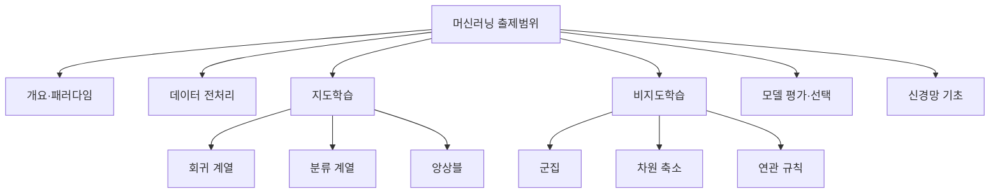

<Callout type="info">
  **이번 문서의 목표:** 독학사 시험 제도 안에서 머신러닝 과목이 어떻게 다뤄지는지 이해하고, 어떤 유형의 문항이 몇 문제쯤 나오는지 감을 잡아 앞으로의 학습 우선순위를 정할 수 있게 된다.
</Callout>

## 1. 독학사 제도와 전공·과목 편제

**독학사**(독학학위제, 獨學學位制)는 국가평생교육진흥원이 운영하는 제도로, 대학에 다니지 않고도 정해진 단계별 시험에 합격하면 학사 학위를 받을 수 있는 국가시험입니다. 정식 명칭은 **독학에 의한 학위취득에 관한 법률**에 근거한 제도입니다.

> **쉽게 말하면:** 학교를 안 다녀도 국가시험만 통과하면 대학 졸업장과 같은 학위를 주는 제도입니다.

독학사는 총 **4단계**로 이루어져 있습니다.

| 단계 | 명칭 | 성격 |
|------|------|------|
| 1단계 | 교양과정 인정시험 | 전공과 무관한 공통 교양 과목 |
| 2단계 | 전공기초과정 인정시험 | 전공의 기초 이론 과목 |
| 3단계 | 전공심화과정 인정시험 | 전공의 심화 이론 과목 |
| 4단계 | 학위취득 종합시험 | 전공 전체를 종합하는 마지막 시험 |

**머신러닝**은 컴퓨터공학 전공의 **2단계 전공기초과정**에 배치된 과목입니다. 컴퓨터공학 전공은 과거 "컴퓨터과학"이라는 명칭으로 불리다가 명칭이 바뀐 이력이 있으므로, 실제 응시 전에는 반드시 국가평생교육진흥원 공식 시험안내 페이지에서 **해당 회차의 전공·과목 편제**를 다시 확인해야 합니다. 공고는 매 회차 갱신되며, 과목 구성이나 단계가 바뀔 수 있기 때문입니다.

<Callout type="warning">
  이 문서에 적힌 단계·과목 구성은 집필 시점 기준의 일반적인 설명입니다. **실제 응시 회차의 공식 공고(시험 요강)를 반드시 재확인**하세요.
</Callout>

## 2. 머신러닝 과목의 출제 범위 요약

2단계 전공기초과정은 **해당 전공에서 반드시 알아야 하는 기초 이론**을 다룹니다. 머신러닝 과목의 출제기준은 크게 다음 영역으로 나눌 수 있습니다.

이 지도는 이 과목 전체 24편의 뼈대와 그대로 맞물립니다. **개요·패러다임**은 06~07편, **데이터 전처리**는 06편, **지도학습**은 08~13편, **비지도학습**은 14~17편, **모델 평가·선택**은 18~19편, **신경망 기초**는 20편에서 각각 다룹니다.

> **쉽게 말하면:** "이름만 아는" 알고리즘 목록이 아니라, 각 알고리즘이 왜 필요하고 어떻게 계산되고 어떤 상황에 맞는지를 묻는 시험입니다.

## 3. 문항 유형 세 가지

독학사 머신러닝 과목은 자격증 시험보다 **학문적 이해**를 더 깊게 묻습니다. 문항은 크게 세 유형으로 나뉩니다.

| 유형 | 무엇을 묻는가 | 예시 |
|------|---------------|------|
| 개념형 | 정의·구분·용어의 정확한 뜻 | "지도학습과 비지도학습을 구분하는 기준은?" |
| 계산형 | 공식에 숫자를 대입해 값을 구하는 능력 | "다음 혼동행렬에서 정밀도를 구하시오" |
| 비교형 | 두 개념·알고리즘의 공통점과 차이점 | "릿지 회귀와 라쏘 회귀의 차이로 옳은 것은?" |

세 유형은 서로 배타적이지 않습니다. 한 문항 안에 개념 확인과 계산이 함께 섞이는 경우도 흔합니다. 예를 들어 "다음 중 정밀도(precision)에 대한 설명으로 옳지 않은 것은?"이라는 문항은 정밀도의 **정의**(개념형)뿐 아니라 정밀도가 실제로 어떻게 **계산**되는지 알아야 함정 보기를 걸러낼 수 있습니다.

특히 독학사는 **"옳지 않은 것을 고르시오"** 유형의 비중이 높습니다. 이 유형은 보기 네 개 중 세 개는 맞는 설명이고 하나만 틀린 설명인데, 정의를 피상적으로만 알면 미묘하게 틀린 보기를 걸러내지 못합니다. 그래서 이 과목의 모든 본론 편은 "자주 틀리는 점"을 별도로 정리해 이런 유형에 대비합니다.

## 4. 시간 배분과 난이도 개관

독학사 각 시험은 과목당 정해진 문항 수와 시간이 배정되어 있으며, 일반적으로 **객관식 4지선다형**으로 출제됩니다. 다만 문항 수·시험 시간·배점은 회차별 공고에 따라 달라질 수 있으므로, 이 문서에서 구체적인 숫자를 단정하지 않습니다. **반드시 응시 회차의 공식 공고를 확인**하세요.

시간 관리 전략의 큰 원칙은 다음과 같습니다.

1. **개념형 문항을 먼저 빠르게 처리한다.** 정의를 안다면 몇 초 안에 풀리므로 시간을 아낄 수 있습니다.
2. **계산형 문항은 공식을 먼저 적고 대입한다.** 암산으로 건너뛰다가 부호나 항을 빠뜨리는 실수가 잦습니다. 22편에서 이런 계산 문제만 모아 집중적으로 훈련합니다.
3. **비교형 문항은 표로 그려서 비교한다.** 머릿속으로만 비교하면 두 알고리즘의 특징이 뒤섞이기 쉽습니다. 23편에서 알고리즘 비교표를 집중적으로 다룹니다.

> **쉽게 말하면:** 아는 것부터 빨리 풀고, 계산은 손으로 직접 쓰고, 비교는 표로 정리하는 세 가지 습관이 시간 안에 다 푸는 비결입니다.

## 핵심 정리

- 머신러닝은 독학사 컴퓨터공학 전공의 **2단계 전공기초과정** 과목이며, 실제 편제는 응시 전 공식 공고로 재확인해야 한다.
- 출제범위는 개요·패러다임, 데이터 전처리, 지도학습, 비지도학습, 모델 평가·선택, 신경망 기초의 여섯 갈래로 나뉜다.
- 문항은 개념형·계산형·비교형으로 나뉘며, 특히 "옳지 않은 것을 고르시오" 유형에 대비해 개념의 미묘한 경계를 정확히 익혀야 한다.
- 시험 문항 수·시간·배점은 회차마다 다를 수 있으므로 단정하지 말고 공고를 확인한다.

## 마무리 복습

<Quiz
  questionNumber={1}
  question="독학사 제도에서 머신러닝 과목이 속하는 단계로 가장 적절한 것은?"
  options={['1단계 교양과정 인정시험', '2단계 전공기초과정 인정시험', '3단계 전공심화과정 인정시험', '4단계 학위취득 종합시험']}
  correctAnswer={2}
  explanation="머신러닝은 컴퓨터공학 전공의 2단계 전공기초과정에 배치된 과목이다. 다만 회차별 공고에 따라 편제가 바뀔 수 있으므로 응시 전 재확인이 필요하다."
  optionExplanations={['1단계는 전공과 무관한 공통 교양 과목을 다루는 단계다.', '머신러닝은 전공기초 이론을 다루는 2단계 과목에 해당한다.', '3단계는 전공의 심화 이론을 다루는 단계로 머신러닝의 기본 편제와는 다르다.', '4단계는 전공 전체를 종합하는 마지막 단계다.']}
/>

<Quiz
  questionNumber={2}
  question="다음 중 '비교형' 문항의 예시로 가장 적절한 것은?"
  options={['지도학습의 정의는 무엇인가?', '혼동행렬에서 정밀도를 계산하시오', '릿지 회귀와 라쏘 회귀의 차이로 옳은 것은?', '로지스틱 함수의 식을 쓰시오']}
  correctAnswer={3}
  explanation="비교형 문항은 두 개념이나 알고리즘의 공통점·차이점을 묻는다. 릿지와 라쏘의 차이를 묻는 문항이 여기에 해당한다."
  optionExplanations={['용어의 정의를 묻는 개념형 문항이다.', '공식에 숫자를 대입해 값을 구하는 계산형 문항이다.', '두 회귀 기법의 차이를 묻는 전형적인 비교형 문항이다.', '식 자체를 묻는 개념형에 가까운 문항이다.']}
/>

<Quiz
  questionNumber={3}
  question="독학사 머신러닝 과목의 '옳지 않은 것을 고르시오' 유형에 대비하는 방법으로 가장 적절한 것은?"
  options={['보기 중 가장 길게 쓰인 문장을 정답으로 고른다', '핵심 용어의 정의와 그 경계를 정확히 익혀 미묘하게 틀린 보기를 구분한다', '항상 첫 번째 보기를 제외하고 고른다', '계산이 필요한 보기는 무조건 제외한다']}
  correctAnswer={2}
  explanation="이 유형은 보기 대부분이 맞는 설명이고 하나만 틀린 설명이므로, 정의를 피상적으로만 알면 놓치기 쉽다. 개념의 정확한 경계를 알아야 한다."
  optionExplanations={['문장 길이는 정답 여부와 아무 관련이 없다.', '정의와 경계를 정확히 아는 것이 이 유형을 푸는 핵심이다.', '보기 순서는 무작위이므로 이런 규칙은 성립하지 않는다.', '계산이 포함된 보기도 정답이거나 오답일 수 있어 이 기준은 근거가 없다.']}
/>

<Quiz
  questionNumber={4}
  question="응시 전 반드시 재확인해야 할 사항으로 가장 적절한 것은?"
  options={['이 문서에 적힌 단계·과목 편제가 항상 고정되어 있다는 점', '해당 응시 회차의 공식 시험 공고(요강)에 담긴 전공·과목·문항 수 정보', '과거 회차의 기출문제가 매 회 그대로 반복된다는 점', '독학사는 단계 구분 없이 한 번에 응시한다는 점']}
  correctAnswer={2}
  explanation="독학사는 편제와 공고가 회차별로 바뀔 수 있으므로, 항상 응시하는 회차의 공식 요강을 확인해야 한다."
  optionExplanations={['편제는 회차에 따라 바뀔 수 있으므로 고정되어 있다고 단정할 수 없다.', '회차별 공식 요강을 확인하는 것이 정확한 대비의 출발점이다.', '기출이 그대로 반복된다는 보장은 없으며 출제기준에 근거한 재구성이 원칙이다.', '독학사는 1~4단계로 나뉘어 순차적으로 응시하는 제도다.']}
/>

<Quiz
  questionNumber={5}
  question="계산형 문항을 풀 때 시간 관리 측면에서 권장되는 습관은?"
  options={['암산으로 최대한 빠르게 답만 표시한다', '공식을 먼저 적고 값을 하나씩 대입해 계산 과정을 눈으로 확인한다', '계산형 문항은 시간이 오래 걸리므로 항상 마지막까지 건너뛴다', '보기 중 가장 계산하기 쉬운 숫자를 정답으로 추정한다']}
  correctAnswer={2}
  explanation="계산형 문항은 공식을 먼저 적고 대입 과정을 눈으로 확인해야 부호나 항을 빠뜨리는 실수를 줄일 수 있다."
  optionExplanations={['암산은 부호나 항을 빠뜨리는 실수로 이어지기 쉽다.', '공식을 적고 대입 과정을 확인하는 것이 실수를 줄이는 방법이다.', '무조건 건너뛰기보다 시간 배분 안에서 우선순위를 정하는 것이 더 적절하다.', '숫자의 계산 난이도는 정답 여부와 관련이 없다.']}
/>

## 참고 자료

- [국가평생교육진흥원 독학학위제](https://bdes.nile.or.kr)
