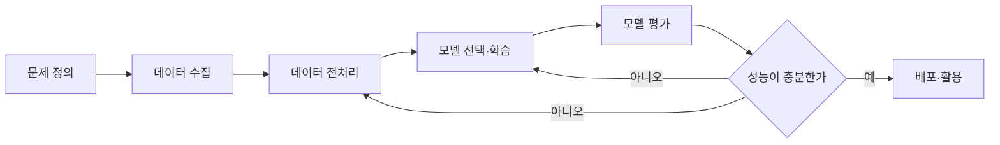

<Callout type="info">
  **이번 문서의 목표:** 머신러닝 프로젝트가 어떤 단계를 거치는지 전체 그림을 그리고, 모델에 데이터를 넣기 전에 반드시 거쳐야 하는 전처리 기법 각각이 왜 필요하고 어떻게 계산되는지 설명할 수 있게 된다.
</Callout>

## 1. 머신러닝 워크플로우 — 전체 그림 먼저

**워크플로우**(workflow, 작업 흐름)는 문제를 발견해서 실제로 쓸 수 있는 모델을 만들기까지 거치는 단계의 순서를 뜻합니다. 알고리즘 하나하나를 배우기 전에 이 흐름을 먼저 잡아 두면, 이후 편에서 배우는 각 기법이 "전체에서 어디에 쓰이는 도구인지" 헷갈리지 않습니다.

> **쉽게 말하면:** 요리에 비유하면 워크플로우는 "장보기 → 재료 손질 → 조리 → 간 보기 → 재조리"의 순서와 같습니다. 재료 손질(전처리)을 건너뛰면 아무리 좋은 조리법(알고리즘)을 써도 요리가 맛없어집니다.

각 단계를 짧게 짚습니다.

| 단계 | 하는 일 | 관련 편 |
|------|---------|---------|
| 문제 정의 | 예측할 대상이 회귀인지 분류인지, 어떤 데이터가 필요한지 결정 | 07편(학습 패러다임) |
| 데이터 수집 | 학습에 쓸 원본 데이터를 모음 | 02편(선행) |
| 데이터 전처리 | 결측치·스케일·범주형 변수·불균형을 정리 | 이 편 |
| 모델 선택·학습 | 문제에 맞는 알고리즘을 골라 데이터로 학습 | 08–20편 |
| 모델 평가 | 성능 지표로 모델의 좋고 나쁨을 판단 | 18–19편 |
| 배포·활용 | 실제 서비스나 의사결정에 모델을 사용 | (이 과목 범위 밖) |

**핵심은 화살표가 한 방향이 아니라는 점입니다.** 평가 결과가 나쁘면 전처리나 모델 선택 단계로 되돌아가 다시 시도합니다. 이 반복 구조 자체가 "머신러닝은 한 번에 완성되지 않는다"는 시험 출제 포인트입니다.

## 2. 결측치 처리 — 빈칸을 어떻게 다룰 것인가

### 왜 필요한가

실제 데이터에는 값이 비어 있는 경우가 흔합니다. 설문 응답을 건너뛰었거나, 센서가 잠깐 고장 났거나, 시스템 오류로 값이 기록되지 않은 경우입니다. 이런 빈칸을 **결측치**(missing value, 누락값)라고 합니다. 대부분의 머신러닝 알고리즘은 계산 과정에서 숫자를 요구하므로, 빈칸을 그대로 두면 학습 자체가 불가능합니다.

> **쉽게 말하면:** 결측치는 설문지에서 응답자가 빈칸으로 남긴 문항입니다. 그 문항을 어떻게 채우거나 처리할지 정해야 나머지 응답을 분석에 쓸 수 있습니다.

### 결측치의 유형

결측치를 다루기 전에, 결측이 **왜 생겼는지**를 구분하는 것이 중요합니다.

| 유형 | 이름 | 뜻 |
|------|------|-----|
| MCAR | 완전 무작위 결측(Missing Completely At Random) | 결측 여부가 다른 어떤 변수와도 관련이 없음 |
| MAR | 무작위 결측(Missing At Random) | 결측 여부가 관측된 다른 변수와는 관련 있지만, 결측된 값 자체와는 무관함 |
| MNAR | 비무작위 결측(Missing Not At Random) | 결측 여부가 바로 그 결측된 값 자체와 관련 있음 |

예를 들어 소득 설문에서 소득이 매우 높은 사람일수록 응답을 회피하는 경향이 있다면, 이는 MNAR입니다. 결측 여부가 "소득이 높다"는 결측값 자체의 성질과 관련되어 있기 때문입니다. 이 구분을 무시하고 무조건 평균으로 채우면, 특히 MNAR 상황에서는 데이터의 실제 경향을 왜곡할 수 있습니다.

### 결측치 처리 방법

| 방법 | 설명 | 장점 | 단점 |
|------|------|------|------|
| 삭제(deletion) | 결측이 있는 행 또는 열을 제거 | 구현이 간단 | 데이터 손실, 결측이 많으면 표본이 크게 줄어듦 |
| 평균·중앙값 대치 | 같은 변수의 평균이나 중앙값으로 채움 | 간단하고 빠름 | 변수의 분산을 인위적으로 줄임 |
| 최빈값 대치 | 범주형 변수에서 가장 흔한 값으로 채움 | 범주형에 적합 | 소수 범주의 정보가 사라짐 |
| 모델 기반 대치 | 다른 변수로 결측값을 예측하는 모델을 따로 학습 | 정교함 | 계산 비용이 크고 구현이 복잡 |

**자주 틀리는 점:** "결측치는 항상 삭제하는 것이 안전하다"는 오답입니다. 결측 비율이 높은 변수를 통째로 삭제하면 중요한 정보를 잃을 수 있고, 표본 크기가 작을 때는 행 삭제만으로도 학습 자체가 어려워질 수 있습니다. 상황에 따라 대치 방법을 선택해야 합니다.

## 3. 스케일링 — 변수의 단위를 맞추기

### 왜 필요한가

키(cm 단위, 대략 150~190)와 연봉(원 단위, 대략 2000만~1억)을 같은 모델에 넣는다고 합시다. 거리를 계산하는 알고리즘(12편에서 다룰 K-NN, SVM 등)은 숫자가 큰 변수에 압도적으로 더 큰 영향을 받습니다. 연봉의 차이 100만원이 키 차이 100cm보다 숫자로는 훨씬 크기 때문에, 실제로는 키가 더 중요한 요인이어도 모델이 연봉만 보게 될 수 있습니다.

> **쉽게 말하면:** 스케일링은 모든 변수를 "같은 저울"에 올려서, 원래 단위가 크다는 이유만으로 특정 변수가 부당하게 힘을 갖지 않게 만드는 작업입니다.

### 표준화(standardization)

**표준화**는 변수의 평균을 0, 표준편차를 1로 맞추는 방법입니다.

$$
z = \frac{x - \mu}{\sigma}
$$

- $z$: 표준화된 값
- $x$: 원래 값
- $\mu$ (뮤): 그 변수의 평균
- $\sigma$ (시그마): 그 변수의 표준편차

예를 들어 점수 데이터의 평균이 70, 표준편차가 10인데 어떤 학생의 점수가 85점이라면,

$$
z = \frac{85 - 70}{10} = 1.5
$$

이 학생은 **평균보다 표준편차 1.5배만큼 높은** 점수를 받았다는 뜻입니다.

### 정규화(min-max scaling)

**정규화**(min-max 스케일링)는 값을 0과 1 사이로 압축하는 방법입니다.

$$
x' = \frac{x - x_{\min}}{x_{\max} - x_{\min}}
$$

- $x'$: 정규화된 값
- $x_{\min}, x_{\max}$: 그 변수의 최솟값과 최댓값

최저 50점, 최고 100점인 시험에서 85점을 정규화하면,

$$
x' = \frac{85 - 50}{100 - 50} = 0.7
$$

**표준화와 정규화의 차이**는 자주 출제되는 비교 포인트입니다.

| 구분 | 표준화 | 정규화 |
|------|--------|--------|
| 결과 범위 | 이론상 제한 없음(평균 0, 표준편차 1 기준) | 0 이상 1 이하로 고정 |
| 이상치 영향 | 상대적으로 덜 민감 | 최댓값·최솟값이 바뀌면 전체가 흔들려 민감함 |
| 주로 쓰는 상황 | 데이터가 정규분포에 가까울 때, 회귀·SVM 계열 | 이미지 픽셀처럼 범위가 정해진 데이터, 신경망 입력 |

**자주 틀리는 점:** 스케일링은 트리 기반 알고리즘(11편의 의사결정나무, 13편의 랜덤포레스트)에는 **필수가 아닙니다.** 트리는 변수의 절대적인 크기가 아니라 "기준값보다 큰가 작은가"라는 순서만 보기 때문입니다. "모든 머신러닝 알고리즘에 스케일링이 반드시 필요하다"는 보기는 오답입니다.

## 4. 인코딩 — 범주형 변수를 숫자로

### 왜 필요한가

"서울", "부산", "대구"처럼 문자로 된 **범주형 변수**(categorical variable)는 대부분의 알고리즘이 직접 계산할 수 없습니다. 이를 숫자로 바꾸는 과정이 **인코딩**(encoding)입니다.

### 레이블 인코딩(label encoding)

각 범주에 정수를 하나씩 부여합니다. 서울=0, 부산=1, 대구=2처럼 매깁니다. 구현은 간단하지만, 문제가 있습니다. 이 숫자를 그대로 회귀나 거리 계산에 쓰면 "대구(2)가 서울(0)의 두 배"라는 **거짓 순서 관계**가 생깁니다. 지역명처럼 순서가 없는 범주에는 부적절합니다.

### 원-핫 인코딩(one-hot encoding)

범주 개수만큼 새 열을 만들어, 해당하는 범주에만 1을, 나머지에는 0을 표시합니다.

| 원본 | 서울 | 부산 | 대구 |
|------|------|------|------|
| 서울 | 1 | 0 | 0 |
| 부산 | 0 | 1 | 0 |
| 대구 | 0 | 0 | 1 |

원-핫 인코딩은 거짓 순서 관계를 만들지 않지만, 범주 개수가 많아지면 열이 지나치게 늘어나는 **차원 증가** 문제가 있습니다(16편에서 다룰 차원의 저주와 연결됩니다).

> **쉽게 말하면:** 레이블 인코딩은 지역에 번호표를 붙이는 것이고, 원-핫 인코딩은 지역마다 "이 지역인가 아닌가"를 묻는 예/아니오 질문지를 따로 만드는 것입니다.

**적용 기준:** 범주 사이에 **순서**가 있으면(예: 낮음·보통·높음) 순서를 반영한 인코딩(순서형 인코딩)이 적절하고, 순서가 없으면(예: 지역명) 원-핫 인코딩이 적절합니다. 순서가 없는 변수에 레이블 인코딩을 그대로 쓰는 것이 대표적인 함정입니다.

## 5. 데이터 불균형 — 한쪽으로 치우친 데이터

### 왜 필요한가

이상 거래 탐지 데이터를 생각해 봅시다. 정상 거래가 9,900건, 이상 거래가 100건이라면 전체의 99퍼센트가 정상입니다. 이런 상태를 **데이터 불균형**(class imbalance, 클래스 불균형)이라고 합니다.

> **쉽게 말하면:** 반 학생 100명 중 99명이 남학생이면, "무조건 남학생이라고 답하는" 성의 없는 예측조차 정답률 99퍼센트가 나옵니다. 불균형 데이터는 이렇게 게으른 모델을 착시로 좋아 보이게 만듭니다.

### 왜 문제가 되는가

모델이 "무조건 다수 범주로 예측"하도록 학습해도 **정확도**(accuracy)는 매우 높게 나옵니다. 하지만 정작 찾고 싶은 소수 범주(이상 거래)는 하나도 잡아내지 못합니다. 이 문제 때문에 불균형 데이터에서는 정확도 대신 **정밀도·재현율·F1** 같은 지표를 써야 하며, 이는 18편에서 계산까지 자세히 다룹니다.

### 대응 방법

| 방법 | 설명 |
|------|------|
| 오버샘플링(oversampling) | 소수 범주 데이터를 복제하거나 합성해 늘림(SMOTE 등) |
| 언더샘플링(undersampling) | 다수 범주 데이터 일부를 줄여 비율을 맞춤 |
| 클래스 가중치 조정 | 손실함수에서 소수 범주의 오분류에 더 큰 벌점을 줌 |
| 평가지표 변경 | 정확도 대신 정밀도·재현율·F1·ROC-AUC 사용 |

**자주 틀리는 점:** 오버샘플링과 언더샘플링을 반대로 외우는 경우가 많습니다. 오버(over, 넘치게)는 **소수 범주를 늘리는 것**, 언더(under, 모자라게)는 **다수 범주를 줄이는 것**이라고 단어 뜻 그대로 기억하면 헷갈리지 않습니다.

## 핵심 정리

- 머신러닝 워크플로우는 문제 정의 → 데이터 수집 → 전처리 → 모델 학습 → 평가 → 배포의 순서이며, 평가 결과가 나쁘면 전처리·학습 단계로 되돌아가는 반복 구조다.
- 결측치는 MCAR·MAR·MNAR로 원인을 구분한 뒤 삭제·평균 대치·모델 기반 대치 중 상황에 맞는 방법을 고른다.
- 표준화는 평균 0·표준편차 1로, 정규화는 0에서 1 사이로 맞추며, 트리 기반 알고리즘은 스케일링이 필수가 아니다.
- 순서 없는 범주형 변수는 원-핫 인코딩이 적절하고, 레이블 인코딩을 그대로 쓰면 거짓 순서 관계가 생긴다.
- 데이터 불균형에서는 정확도만으로 성능을 판단하면 안 되며, 오버·언더샘플링이나 정밀도·재현율 같은 지표를 함께 써야 한다.

## 마무리 복습

<Quiz
  questionNumber={1}
  question="머신러닝 워크플로우에 대한 설명으로 옳지 않은 것은?"
  options={['모델 평가 결과가 나쁘면 전처리나 모델 선택 단계로 되돌아갈 수 있다', '문제 정의 단계에서 회귀와 분류 중 어떤 문제인지 먼저 결정한다', '전처리 단계를 생략해도 알고리즘 성능에는 영향이 없다', '데이터 전처리는 모델 학습 이전에 이루어진다']}
  correctAnswer={3}
  explanation="전처리는 데이터의 품질을 결정하는 단계이며, 이를 생략하면 결측치나 스케일 차이 때문에 모델 학습이 불가능하거나 성능이 크게 떨어질 수 있다."
  optionExplanations={['평가 결과에 따라 이전 단계로 되돌아가는 반복 구조가 맞다.', '문제 정의 단계에서 회귀·분류 여부를 정하는 것이 맞다.', '전처리를 생략하면 성능에 큰 영향을 주므로 이 설명이 틀렸다.', '전처리는 학습 이전 단계에서 이루어지는 것이 맞다.']}
/>

<Quiz
  questionNumber={2}
  question="소득이 매우 높은 응답자일수록 소득 항목에 응답하지 않는 경향이 있을 때, 이 결측 유형으로 가장 적절한 것은?"
  options={['MCAR(완전 무작위 결측)', 'MAR(무작위 결측)', 'MNAR(비무작위 결측)', '결측치가 아니라 이상치 문제이다']}
  correctAnswer={3}
  explanation="결측 여부가 결측된 값 자체(높은 소득)와 관련되어 있으므로 MNAR에 해당한다."
  optionExplanations={['MCAR은 결측 여부가 어떤 변수와도 무관해야 하는데 이 사례는 소득과 관련이 있다.', 'MAR은 관측된 다른 변수와는 관련 있지만 결측값 자체와는 무관해야 하는데 이 사례는 결측값 자체와 관련이 있다.', '결측 여부가 결측된 값 자체의 크기와 관련 있으므로 MNAR이 정확하다.', '이 상황은 값이 아예 기록되지 않은 결측치 문제이지 이상치 문제가 아니다.']}
/>

<Quiz
  questionNumber={3}
  question="평균 70점, 표준편차 10점인 시험에서 92점을 받은 학생의 표준화 값(z-score)은?"
  options={['1.5', '2.0', '2.2', '9.2']}
  correctAnswer={3}
  explanation="z = (92 - 70) / 10 = 22 / 10 = 2.2 이다."
  optionExplanations={['1.5는 다른 점수(85점)에 해당하는 값으로 이 문제의 답이 아니다.', '2.0은 90점일 때의 값이며 92점을 대입한 값이 아니다.', '(92-70)/10을 계산하면 2.2가 되어 정답이다.', '9.2는 분모로 나누는 과정을 빠뜨린 값이다.']}
/>

<Quiz
  questionNumber={4}
  question="순서가 없는 지역명(서울·부산·대구) 변수를 회귀분석에 사용하기 위한 인코딩 방법으로 가장 적절한 것은?"
  options={['서울=0, 부산=1, 대구=2로 매기는 레이블 인코딩', '지역별로 별도의 0/1 열을 만드는 원-핫 인코딩', '지역명을 문자 그대로 모델에 입력', '결측치로 처리해 모두 삭제']}
  correctAnswer={2}
  explanation="순서가 없는 범주형 변수에 레이블 인코딩을 쓰면 거짓 순서 관계가 생긴다. 원-핫 인코딩은 범주마다 독립된 열을 만들어 이 문제를 피한다."
  optionExplanations={['레이블 인코딩은 순서가 없는 범주에 거짓 순서 관계를 만든다.', '원-핫 인코딩은 순서 없는 범주형 변수에 적절한 방법이다.', '대부분의 알고리즘은 문자열을 직접 계산할 수 없다.', '지역명은 결측치가 아니라 정상적으로 관측된 범주형 값이다.']}
/>

<Quiz
  questionNumber={5}
  question="정상 거래 9,900건과 이상 거래 100건으로 이루어진 데이터에서 나타날 수 있는 문제로 가장 적절한 것은?"
  options={['모든 거래를 정상으로 예측해도 정확도가 매우 높게 나올 수 있다', '표준화를 하지 않으면 모델이 절대 학습되지 않는다', '원-핫 인코딩을 하지 않으면 데이터를 저장할 수 없다', '결측치가 자동으로 늘어난다']}
  correctAnswer={1}
  explanation="다수 범주가 99퍼센트를 차지하므로 무조건 다수 범주로 예측해도 정확도는 99퍼센트에 가깝게 나온다. 이 때문에 불균형 데이터에서는 정확도 외의 지표가 필요하다."
  optionExplanations={['불균형 자체가 정확도를 착시처럼 높게 만드는 대표적인 문제다.', '표준화 여부와 데이터 불균형은 서로 다른 문제다.', '인코딩 여부와 데이터 저장 가능성은 관련이 없다.', '데이터 불균형은 결측치 발생과는 별개의 문제다.']}
/>

<Quiz
  questionNumber={6}
  question="오버샘플링과 언더샘플링에 대한 설명으로 옳은 것은?"
  options={['오버샘플링은 다수 범주 데이터를 줄이는 방법이다', '언더샘플링은 소수 범주 데이터를 늘리는 방법이다', '오버샘플링은 소수 범주 데이터를 복제하거나 합성해 늘리는 방법이다', '오버샘플링과 언더샘플링은 모두 결측치 처리 기법이다']}
  correctAnswer={3}
  explanation="오버샘플링은 소수 범주를 늘리는 방법이고, 언더샘플링은 다수 범주를 줄이는 방법이다. 둘 다 데이터 불균형 대응 기법이지 결측치 처리 기법이 아니다."
  optionExplanations={['오버샘플링은 소수 범주를 늘리는 방법이지 다수 범주를 줄이는 방법이 아니다.', '언더샘플링은 다수 범주를 줄이는 방법이지 소수 범주를 늘리는 방법이 아니다.', '소수 범주를 늘리는 방법이 오버샘플링이라는 설명이 정확하다.', '두 기법은 데이터 불균형 대응 기법이며 결측치 처리와는 다른 문제를 다룬다.']}
/>

## 참고 자료

- [scikit-learn User Guide — Preprocessing data](https://scikit-learn.org/stable/user_guide.html)
