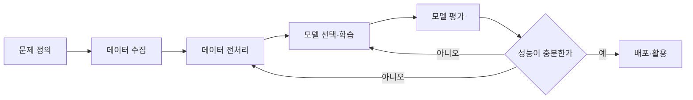

## 1. 머신러닝 워크플로우 — 전체 그림 먼저

**워크플로우**(workflow, 작업 흐름)는 문제를 발견해서 실제로 쓸 수 있는 모델을 만들기까지 거치는 단계의 순서를 뜻합니다. 알고리즘 하나하나를 배우기 전에 이 흐름을 먼저 잡아 두면, 이후 편에서 배우는 각 기법이 "전체에서 어디에 쓰이는 도구인지" 헷갈리지 않습니다.

```mermaid
graph LR
  A[문제 정의] --> B[데이터 수집]
  B --> C[데이터 전처리]
  C --> D[모델 선택·학습]
  D --> E[모델 평가]
  E --> F{성능이 충분한가}
  F -->|아니오| C
  F -->|아니오| D
  F -->|예| G[배포·활용]
```

각 단계를 짧게 짚습니다.

| 단계 | 하는 일 | 관련 편 |
|------|---------|---------|
| 문제 정의 | 예측할 대상이 회귀인지 분류인지, 어떤 데이터가 필요한지 결정 | 06편(학습 패러다임) |
| 데이터 수집 | 학습에 쓸 원본 데이터를 모음 | 02편(선행) |
| 데이터 전처리 | 결측치·스케일·범주형 변수·불균형을 정리 | 이 편 |
| 모델 선택·학습 | 문제에 맞는 알고리즘을 골라 데이터로 학습 | 07–19편 |
| 모델 평가 | 성능 지표로 모델의 좋고 나쁨을 판단 | 17–18편 |
| 배포·활용 | 실제 서비스나 의사결정에 모델을 사용 | (이 과목 범위 밖) |

**핵심은 화살표가 한 방향이 아니라는 점입니다.** 평가 결과가 나쁘면 전처리나 모델 선택 단계로 되돌아가 다시 시도합니다. 이 반복 구조 자체가 "머신러닝은 한 번에 완성되지 않는다"는 시험 출제 포인트입니다.

## 2. 결측치 처리 — 빈칸을 어떻게 다룰 것인가

### 결측치의 유형

결측치를 다루기 전에, 결측이 **왜 생겼는지**를 구분하는 것이 중요합니다.

| 유형 | 이름 | 뜻 |
|------|------|-----|
| MCAR | 완전 무작위 결측(Missing Completely At Random) | 결측 여부가 다른 어떤 변수와도 관련이 없음 |
| MAR | 무작위 결측(Missing At Random) | 결측 여부가 관측된 다른 변수와는 관련 있지만, 결측된 값 자체와는 무관함 |
| MNAR | 비무작위 결측(Missing Not At Random) | 결측 여부가 바로 그 결측된 값 자체와 관련 있음 |

예를 들어 소득 설문에서 소득이 매우 높은 사람일수록 응답을 회피하는 경향이 있다면, 이는 MNAR입니다. 결측 여부가 "소득이 높다"는 결측값 자체의 성질과 관련되어 있기 때문입니다. 이 구분을 무시하고 무조건 평균으로 채우면, 특히 MNAR 상황에서는 데이터의 실제 경향을 왜곡할 수 있습니다.

### 결측치 처리 방법

| 방법 | 설명 | 장점 | 단점 |
|------|------|------|------|
| 삭제(deletion) | 결측이 있는 행 또는 열을 제거 | 구현이 간단 | 데이터 손실, 결측이 많으면 표본이 크게 줄어듦 |
| 평균·중앙값 대치 | 같은 변수의 평균이나 중앙값으로 채움 | 간단하고 빠름 | 변수의 분산을 인위적으로 줄임 |
| 최빈값 대치 | 범주형 변수에서 가장 흔한 값으로 채움 | 범주형에 적합 | 소수 범주의 정보가 사라짐 |
| 모델 기반 대치 | 다른 변수로 결측값을 예측하는 모델을 따로 학습 | 정교함 | 계산 비용이 크고 구현이 복잡 |

**자주 틀리는 점:** "결측치는 항상 삭제하는 것이 안전하다"는 오답입니다. 결측 비율이 높은 변수를 통째로 삭제하면 중요한 정보를 잃을 수 있고, 표본 크기가 작을 때는 행 삭제만으로도 학습 자체가 어려워질 수 있습니다. 상황에 따라 대치 방법을 선택해야 합니다.

## 3. 스케일링 — 변수의 단위를 맞추기

### 표준화(standardization)

**표준화**는 변수의 평균을 0, 표준편차를 1로 맞추는 방법입니다.

$$
z = \frac{x - \mu}{\sigma}
$$

- $z$: 표준화된 값
- $x$: 원래 값
- $\mu$ (뮤): 그 변수의 평균
- $\sigma$ (시그마): 그 변수의 표준편차

예를 들어 점수 데이터의 평균이 70, 표준편차가 10인데 어떤 학생의 점수가 85점이라면,

$$
z = \frac{85 - 70}{10} = 1.5
$$

이 학생은 **평균보다 표준편차 1.5배만큼 높은** 점수를 받았다는 뜻입니다.

### 정규화(min-max scaling)

**정규화**(min-max 스케일링)는 값을 0과 1 사이로 압축하는 방법입니다.

$$
x' = \frac{x - x_{\min}}{x_{\max} - x_{\min}}
$$

- $x'$: 정규화된 값
- $x_{\min}, x_{\max}$: 그 변수의 최솟값과 최댓값

최저 50점, 최고 100점인 시험에서 85점을 정규화하면,

$$
x' = \frac{85 - 50}{100 - 50} = 0.7
$$

**표준화와 정규화의 차이**는 자주 출제되는 비교 포인트입니다.

| 구분 | 표준화 | 정규화 |
|------|--------|--------|
| 결과 범위 | 이론상 제한 없음(평균 0, 표준편차 1 기준) | 0 이상 1 이하로 고정 |
| 이상치 영향 | 상대적으로 덜 민감 | 최댓값·최솟값이 바뀌면 전체가 흔들려 민감함 |
| 주로 쓰는 상황 | 데이터가 정규분포에 가까울 때, 회귀·SVM 계열 | 이미지 픽셀처럼 범위가 정해진 데이터, 신경망 입력 |

**자주 틀리는 점:** 스케일링은 트리 기반 알고리즘(10편의 의사결정나무, 12편의 랜덤포레스트)에는 **필수가 아닙니다.** 트리는 변수의 절대적인 크기가 아니라 "기준값보다 큰가 작은가"라는 순서만 보기 때문입니다. "모든 머신러닝 알고리즘에 스케일링이 반드시 필요하다"는 보기는 오답입니다.

## 4. 인코딩 — 범주형 변수를 숫자로

### 레이블 인코딩(label encoding)

각 범주에 정수를 하나씩 부여합니다. 서울=0, 부산=1, 대구=2처럼 매깁니다. 구현은 간단하지만, 문제가 있습니다. 이 숫자를 그대로 회귀나 거리 계산에 쓰면 "대구(2)가 서울(0)의 두 배"라는 **거짓 순서 관계**가 생깁니다. 지역명처럼 순서가 없는 범주에는 부적절합니다.

### 원-핫 인코딩(one-hot encoding)

범주 개수만큼 새 열을 만들어, 해당하는 범주에만 1을, 나머지에는 0을 표시합니다.

| 원본 | 서울 | 부산 | 대구 |
|------|------|------|------|
| 서울 | 1 | 0 | 0 |
| 부산 | 0 | 1 | 0 |
| 대구 | 0 | 0 | 1 |

원-핫 인코딩은 거짓 순서 관계를 만들지 않지만, 범주 개수가 많아지면 열이 지나치게 늘어나는 **차원 증가** 문제가 있습니다(15편에서 다룰 차원의 저주와 연결됩니다).

**적용 기준:** 범주 사이에 **순서**가 있으면(예: 낮음·보통·높음) 순서를 반영한 인코딩(순서형 인코딩)이 적절하고, 순서가 없으면(예: 지역명) 원-핫 인코딩이 적절합니다. 순서가 없는 변수에 레이블 인코딩을 그대로 쓰는 것이 대표적인 함정입니다.

## 5. 데이터 불균형 — 한쪽으로 치우친 데이터

### 왜 문제가 되는가

모델이 "무조건 다수 범주로 예측"하도록 학습해도 **정확도**(accuracy)는 매우 높게 나옵니다. 하지만 정작 찾고 싶은 소수 범주(이상 거래)는 하나도 잡아내지 못합니다. 이 문제 때문에 불균형 데이터에서는 정확도 대신 **정밀도·재현율·F1** 같은 지표를 써야 하며, 이는 17편에서 계산까지 자세히 다룹니다.

### 대응 방법

| 방법 | 설명 |
|------|------|
| 오버샘플링(oversampling) | 소수 범주 데이터를 복제하거나 합성해 늘림(SMOTE 등) |
| 언더샘플링(undersampling) | 다수 범주 데이터 일부를 줄여 비율을 맞춤 |
| 클래스 가중치 조정 | 손실함수에서 소수 범주의 오분류에 더 큰 벌점을 줌 |
| 평가지표 변경 | 정확도 대신 정밀도·재현율·F1·ROC-AUC 사용 |

**자주 틀리는 점:** 오버샘플링과 언더샘플링을 반대로 외우는 경우가 많습니다. 오버(over, 넘치게)는 **소수 범주를 늘리는 것**, 언더(under, 모자라게)는 **다수 범주를 줄이는 것**이라고 단어 뜻 그대로 기억하면 헷갈리지 않습니다.

## 핵심 정리

- 머신러닝 워크플로우는 문제 정의 → 데이터 수집 → 전처리 → 모델 학습 → 평가 → 배포의 순서이며, 평가 결과가 나쁘면 전처리·학습 단계로 되돌아가는 반복 구조다.
- 결측치는 MCAR·MAR·MNAR로 원인을 구분한 뒤 삭제·평균 대치·모델 기반 대치 중 상황에 맞는 방법을 고른다.
- 표준화는 평균 0·표준편차 1로, 정규화는 0에서 1 사이로 맞추며, 트리 기반 알고리즘은 스케일링이 필수가 아니다.
- 순서 없는 범주형 변수는 원-핫 인코딩이 적절하고, 레이블 인코딩을 그대로 쓰면 거짓 순서 관계가 생긴다.
- 데이터 불균형에서는 정확도만으로 성능을 판단하면 안 되며, 오버·언더샘플링이나 정밀도·재현율 같은 지표를 함께 써야 한다.

## 마무리 복습

<Quiz
  questionNumber={1}
  question={"머신러닝 워크플로우에 대한 설명으로 옳지 않은 것은?"}
  options={["모델 평가 결과가 나쁘면 전처리나 모델 선택 단계로 되돌아갈 수 있다","문제 정의 단계에서 회귀와 분류 중 어떤 문제인지 먼저 결정한다","전처리 단계를 생략해도 알고리즘 성능에는 영향이 없다","데이터 전처리는 모델 학습 이전에 이루어진다"]}
  correctAnswer={3}
  explanation={"전처리는 데이터의 품질을 결정하는 단계이며, 이를 생략하면 결측치나 스케일 차이 때문에 모델 학습이 불가능하거나 성능이 크게 떨어질 수 있다."}
/>

<Quiz
  questionNumber={2}
  question={"소득이 매우 높은 응답자일수록 소득 항목에 응답하지 않는 경향이 있을 때, 이 결측 유형으로 가장 적절한 것은?"}
  options={["MCAR(완전 무작위 결측)","MAR(무작위 결측)","MNAR(비무작위 결측)","결측치가 아니라 이상치 문제이다"]}
  correctAnswer={3}
  explanation={"결측 여부가 결측된 값 자체(높은 소득)와 관련되어 있으므로 MNAR에 해당한다."}
/>

<Quiz
  questionNumber={3}
  question={"평균 70점, 표준편차 10점인 시험에서 92점을 받은 학생의 표준화 값(z-score)은?"}
  options={["1.5","2.0","2.2","9.2"]}
  correctAnswer={3}
  explanation={"z = (92 - 70) / 10 = 22 / 10 = 2.2 이다."}
/>

## 참고 자료

- [scikit-learn User Guide — Preprocessing data](https://scikit-learn.org/stable/user_guide.html)
