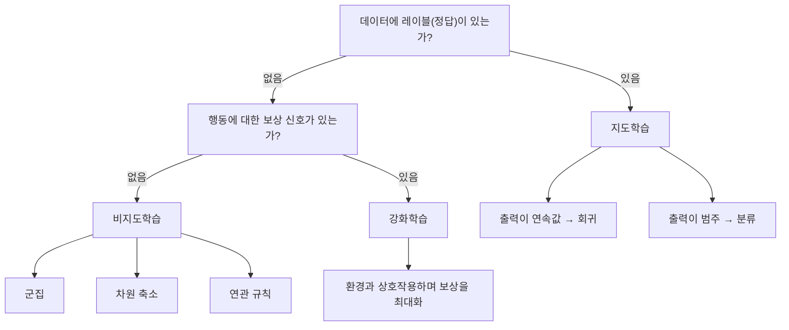
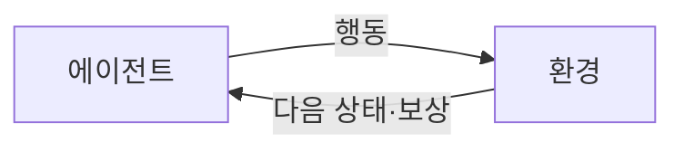

## 1. 왜 패러다임을 나누는가

**패러다임**(paradigm)은 문제를 바라보고 푸는 근본적인 틀을 뜻합니다. 머신러닝에서는 "학습에 쓰이는 데이터에 정답이 있는가, 그리고 그 정답을 누가 어떻게 평가하는가"에 따라 세 가지 큰 패러다임으로 나눕니다.

이 판단 흐름이 이 편의 핵심입니다. 어떤 문제를 마주쳤을 때 "레이블이 있는가"와 "보상 신호가 있는가"라는 두 질문만 던지면 세 패러다임 중 어디에 속하는지 바로 분류할 수 있습니다.

## 2. 지도학습 — 정답이 있는 학습

**지도학습**(supervised learning, 감독학습)은 입력값과 그에 대응하는 **정답**(레이블, label, 이름표 또는 타깃, target, 목표값)이 짝지어진 데이터로 규칙을 학습하는 방식입니다. "지도(supervise)"라는 이름은 정답을 아는 감독자가 학습자를 옆에서 채점해 주는 상황에서 따왔습니다.

**대표 문제 두 가지:**

| 구분 | 정답의 형태 | 예시 |
|------|-------------|------|
| 회귀(regression) | 연속적인 숫자 | 집값 예측, 내일 기온 예측 |
| 분류(classification) | 정해진 범주 | 스팸 여부 판정, 암 진단(양성·음성) |

집값처럼 "얼마인가"를 묻는 문제는 회귀이고, 스팸 여부처럼 "어느 범주에 속하는가"를 묻는 문제는 분류입니다. 예를 들어 07편의 선형회귀는 회귀 문제에, 09편의 로지스틱 회귀는 이름에 "회귀"가 들어가지만 실제로는 **분류** 문제에 쓰입니다.

**지도학습의 대표 알고리즘**은 이후 07~12편에서 순서대로 다룹니다. 선형·다항 회귀, 릿지·라쏘 회귀, 로지스틱 회귀, 결정트리, 나이브 베이즈, K-NN, SVM, 앙상블 기법이 모두 지도학습에 속합니다.

## 3. 비지도학습 — 정답 없이 구조를 찾는 학습

**비지도학습**(unsupervised learning)은 정답(레이블) 없이 **입력 데이터만으로** 데이터 안의 숨은 구조나 패턴을 찾는 방식입니다.

**대표 문제 세 가지:**

| 구분 | 목적 | 예시 알고리즘(다루는 편) |
|------|------|---------------------------|
| 군집(clustering) | 비슷한 데이터끼리 그룹으로 묶기 | K-means, 계층적 군집, DBSCAN(13편) |
| 차원 축소(dimensionality reduction) | 변수 개수를 줄이면서 중요한 정보는 보존 | PCA, LDA(15–16편) |
| 연관 규칙(association rule) | 함께 나타나는 항목의 패턴을 찾기 | Apriori, FP-Growth(14편) |

군집은 "이 고객들을 몇 개의 집단으로 나눌 수 있을까"를 묻고, 차원 축소는 "수백 개의 변수를 몇 개로 요약해도 정보를 크게 잃지 않을까"를 물으며, 연관 규칙은 "기저귀를 사는 고객이 맥주도 함께 사는 경향이 있는가" 같은 동시 구매 패턴을 찾습니다.

**지도학습과의 결정적 차이:** 지도학습은 모델이 낸 답을 정답과 비교해 **얼마나 틀렸는지 채점**할 수 있지만, 비지도학습은 애초에 정답이 없으므로 "이 군집이 맞았다·틀렸다"를 직접 채점할 수 없습니다. 대신 군집 내부의 응집도나 군집 간 분리도 같은 간접적인 지표로 결과의 좋고 나쁨을 판단합니다.

## 4. 강화학습 — 보상으로 배우는 학습

**강화학습**(reinforcement learning)은 **에이전트**(agent, 행동을 결정하는 주체)가 **환경**(environment)과 상호작용하면서, 특정 행동에 대해 주어지는 **보상**(reward)을 최대화하는 방향으로 행동 방식을 학습하는 방식입니다.

강화학습은 지도학습과 다르게 "이 상황에서 정답 행동은 이것이다"라고 알려주는 사람이 없습니다. 대신 행동 이후에 돌아오는 보상 신호만으로 어떤 행동이 좋았는지 나쁘었는지 스스로 판단해 나가야 합니다. 바둑 인공지능이나 로봇 제어, 자율주행의 의사결정 부분에 강화학습이 쓰입니다.

**출제 포인트:** 이 과목은 강화학습의 **구현이나 수식 전개**는 다루지 않고, 지도·비지도학습과 구분되는 **정의와 특징**까지만 다룹니다. "정답 레이블이 아니라 보상 신호로 학습한다"는 점만 정확히 기억하면 개념형 문항에는 충분히 대응할 수 있습니다.

## 5. 세 패러다임 한눈에 비교

| 구분 | 필요한 데이터 | 학습 목표 | 결과 채점 방식 |
|------|---------------|-----------|-----------------|
| 지도학습 | 입력 + 정답(레이블) | 입력에서 정답을 예측하는 규칙 학습 | 예측값과 정답의 차이(손실함수)로 직접 채점 |
| 비지도학습 | 입력만(레이블 없음) | 데이터 안의 숨은 구조·패턴 발견 | 정답이 없어 직접 채점 불가, 간접 지표로 평가 |
| 강화학습 | 환경과의 상호작용, 보상 신호 | 누적 보상을 최대화하는 행동 방식 학습 | 보상의 누적값으로 행동의 좋고 나쁨을 평가 |

**자주 틀리는 점 두 가지:**

- "군집은 정답이 있는 지도학습의 일종이다" — 오답입니다. 군집은 정답 레이블 없이 데이터의 유사성만으로 그룹을 나누는 **비지도학습**입니다.
- "강화학습은 정답 레이블을 이용해 지도학습처럼 채점한다" — 오답입니다. 강화학습은 정답 대신 **보상 신호**로 행동을 개선합니다.

## 핵심 정리

- 지도학습은 입력과 정답(레이블)이 짝지어진 데이터로 학습하며, 정답이 연속값이면 회귀, 범주면 분류다.
- 로지스틱 회귀는 이름에 회귀가 들어가지만 실제로는 분류 문제에 쓰이는 대표적인 함정 사례다.
- 비지도학습은 정답 없이 입력만으로 군집·차원 축소·연관 규칙 같은 숨은 구조를 찾는다.
- 강화학습은 에이전트가 환경과 상호작용하며 보상을 최대화하는 방향으로 행동을 학습하고, 정답 레이블이 아니라 보상 신호로 개선한다.
- "레이블이 있는가", "보상 신호가 있는가"라는 두 질문으로 세 패러다임을 구분할 수 있다.

## 마무리 복습

<Quiz
  questionNumber={1}
  question={"입력 데이터에 정답 레이블이 없고, 데이터 안의 유사한 그룹을 스스로 찾아내는 학습 방식은?"}
  options={["지도학습","비지도학습","강화학습","준지도학습"]}
  correctAnswer={2}
  explanation={"정답 레이블 없이 데이터의 유사성만으로 구조를 찾는 방식은 비지도학습이며, 군집이 대표적인 예다."}
/>

<Quiz
  questionNumber={2}
  question={"로지스틱 회귀에 대한 설명으로 옳은 것은?"}
  options={["이름에 회귀가 있으므로 항상 회귀 문제에만 사용된다","이름과 달리 실제로는 분류 문제에 주로 사용된다","비지도학습에 속하는 알고리즘이다","강화학습의 보상 함수로 사용되는 알고리즘이다"]}
  correctAnswer={2}
  explanation={"로지스틱 회귀는 이름에 회귀가 들어가지만 실제로는 범주를 예측하는 분류 문제에 사용되는 지도학습 알고리즘이다."}
/>

<Quiz
  questionNumber={3}
  question={"강화학습에서 에이전트가 행동을 개선하는 데 사용하는 신호는 무엇인가?"}
  options={["정답 레이블","보상","군집 중심점","주성분 점수"]}
  correctAnswer={2}
  explanation={"강화학습은 정답 레이블 대신 환경으로부터 받는 보상을 최대화하는 방향으로 행동을 학습한다."}
/>

## 참고 자료

- [scikit-learn User Guide — Supervised and unsupervised learning](https://scikit-learn.org/stable/user_guide.html)
