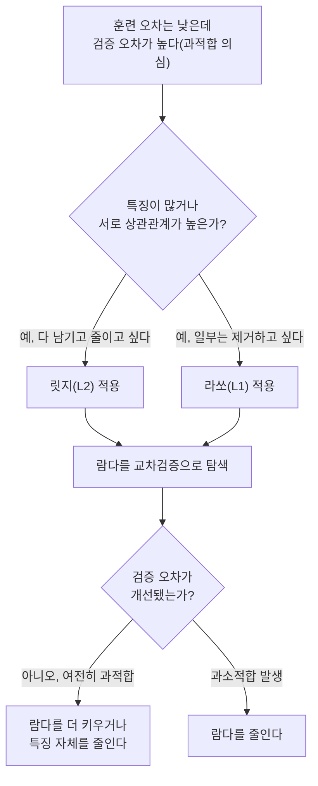

<Callout type="info">
  **이번 문서의 목표:** L2 정규화(릿지)와 L1 정규화(라쏘)가 각각 손실함수에 어떤 항을 더하는지 수식으로 설명하고, 실제 숫자로 경사하강법 한두 스텝을 갱신해 두 방법의 계수 축소 방식이 어떻게 다른지, 왜 라쏘만 계수를 정확히 0으로 만들 수 있는지 계산으로 확인한다.
</Callout>

## 왜 정규화가 필요한가 — 회귀계수가 커지는 문제

08편에서 선형회귀는 평균제곱오차(Mean Squared Error, MSE)를 최소화하는 방향으로 계수(coefficient)를 추정한다고 배웠습니다. 그런데 데이터에 노이즈가 섞여 있거나, 특징(feature)들끼리 서로 강하게 관련되어 있는 **다중공선성**(Multicollinearity, 여러 독립변수가 서로 높은 상관관계를 가지는 현상)이 있으면, 훈련 데이터의 MSE를 조금이라도 더 줄이기 위해 계수가 비정상적으로 크게 튀는 경우가 생깁니다. 계수가 크다는 것은 입력값이 아주 조금만 바뀌어도 예측값이 크게 흔들린다는 뜻이고, 이는 훈련 데이터에는 잘 맞지만 새로운 데이터에는 잘 맞지 않는 **과적합**(Overfitting, 모델이 훈련 데이터의 노이즈까지 외워버려 일반화 성능이 떨어지는 현상)으로 이어집니다.

> **쉽게 말하면:** 정규화(Regularization)는 "계수가 너무 커지지 않도록 손실함수에 벌점(penalty)을 추가하는 것"입니다.

## 1. L2 정규화와 릿지 회귀

**릿지 회귀**(Ridge Regression)는 기존 MSE 손실함수에 계수 제곱의 합을 벌점으로 더합니다. 이 벌점을 **L2 정규화**(L2 Regularization)라고 부르는데, L2는 벡터의 크기를 계수들의 제곱합의 제곱근으로 재는 유클리드 노름(Euclidean Norm)에서 따온 이름입니다.

$$
J_{ridge}(w) = \frac{1}{n}\sum_{i=1}^{n}(y_i - \hat{y}_i)^2 + \lambda \sum_{j=1}^{p} w_j^2
$$

- $J_{ridge}(w)$: 릿지 회귀의 손실함수(비용함수) 값
- $n$: 훈련 데이터의 샘플 개수
- $y_i$: $i$번째 샘플의 실제 정답값
- $\hat{y}_i$ (와이 햇): $i$번째 샘플에 대한 모델의 예측값
- $\lambda$ (람다): 정규화의 세기를 조절하는 하이퍼파라미터(사람이 학습 전에 직접 정하는 값)
- $w_j$: $j$번째 특징에 곱해지는 회귀계수, $p$: 특징(feature)의 개수

앞부분 $\frac{1}{n}\sum(y_i-\hat{y}_i)^2$은 08편에서 본 MSE와 같습니다. 뒷부분 $\lambda \sum w_j^2$이 새로 추가된 벌점항으로, 계수 $w_j$가 커질수록 이 값도 커지므로 손실함수를 최소화하려는 모델은 계수를 무작정 키우지 못하고 적당히 억제하게 됩니다.

## 2. L1 정규화와 라쏘 회귀

**라쏘 회귀**(Lasso Regression, Least Absolute Shrinkage and Selection Operator의 약자)는 계수의 제곱이 아니라 **절댓값의 합**을 벌점으로 더합니다. 이를 **L1 정규화**(L1 Regularization)라고 부릅니다.

$$
J_{lasso}(w) = \frac{1}{n}\sum_{i=1}^{n}(y_i - \hat{y}_i)^2 + \lambda \sum_{j=1}^{p} |w_j|
$$

- $|w_j|$: $j$번째 계수의 절댓값(부호를 떼고 크기만 본 값)

제곱을 쓰느냐 절댓값을 쓰느냐가 사소한 차이처럼 보이지만, 뒤에서 실제 숫자로 확인하듯 이 차이가 **변수 선택**(Feature Selection, 중요하지 않은 특징의 계수를 정확히 0으로 만들어 모델에서 사실상 제외하는 것) 가능 여부를 가릅니다.

## 3. 실제 숫자로 확인하는 경사하강법 갱신 — 릿지 vs 일반 회귀

작은 예제로 시작합니다. 공부 시간(x)과 시험 점수(y)를 나타내는 데이터 4개가 있고, 절편은 이미 처리되었다고 가정해 기울기 계수 $w$ 하나만 봅니다.

| $x$ | 1 | 2 | 3 | 4 |
|---|---|---|---|---|
| $y$ | 3 | 5 | 7 | 10 |

현재 모델은 $\hat{y} = w \cdot x$이고, 현재 계수 $w=1$, 학습률(learning rate) $\eta$ (에타) $=0.1$이라고 합시다. 경사하강법(Gradient Descent)은 손실함수의 기울기(gradient) 반대 방향으로 계수를 조금씩 움직여 최소값을 찾는 방법입니다.

**일반 선형회귀(정규화 없음)의 기울기 계산:**

예측값은 $w=1$일 때 $\hat{y}=(1,2,3,4)$이고, 오차 $(\hat{y}_i-y_i)$는 $(-2,-3,-4,-6)$입니다.

$$
\frac{\partial J}{\partial w} = \frac{2}{n}\sum_{i=1}^{n}(\hat{y}_i - y_i)x_i = \frac{2}{4}\big[(-2)(1)+(-3)(2)+(-4)(3)+(-6)(4)\big]
$$

$$
\frac{\partial J}{\partial w} = \frac{2}{4} \times (-44) = -22
$$

$$
w_{new} = w - \eta \frac{\partial J}{\partial w} = 1 - 0.1 \times (-22) = 3.2
$$

정규화가 없으면 $w$가 $1$에서 $3.2$로 크게 뛰어오릅니다.

**릿지 회귀($\lambda=0.5$)의 기울기 계산:** 릿지 벌점항 $\lambda w^2$을 $w$로 미분하면 $2\lambda w$가 더해집니다.

$$
\frac{\partial J_{ridge}}{\partial w} = -22 + 2\lambda w = -22 + 2(0.5)(1) = -21
$$

$$
w_{new,ridge} = 1 - 0.1 \times (-21) = 3.1
$$

같은 데이터, 같은 학습률인데도 릿지는 $w$를 $3.1$까지만 올립니다. 벌점항이 "너무 크게 가지 마라"고 제동을 건 셈입니다. 두 번째 스텝으로 검산해 보면 이 제동 효과가 누적됨을 확인할 수 있습니다.

**2스텝째(일반 회귀, $w=3.2$):** 예측값 $(3.2,6.4,9.6,12.8)$, 오차 $(0.2,1.4,2.6,2.8)$

$$
\frac{\partial J}{\partial w} = \frac{2}{4}\big[(0.2)(1)+(1.4)(2)+(2.6)(3)+(2.8)(4)\big] = \frac{2}{4}(22) = 11
$$

$$
w_{new} = 3.2 - 0.1 \times 11 = 2.1
$$

**2스텝째(릿지, $w=3.1$):** 예측값 $(3.1,6.2,9.3,12.4)$, 오차 $(0.1,1.2,2.3,2.4)$

$$
\frac{\partial J}{\partial w} = \frac{2}{4}\big[(0.1)(1)+(1.2)(2)+(2.3)(3)+(2.4)(4)\big] = \frac{2}{4}(19.0) = 9.5
$$

$$
\frac{\partial J_{ridge}}{\partial w} = 9.5 + 2(0.5)(3.1) = 9.5+3.1 = 12.6
$$

$$
w_{new,ridge} = 3.1 - 0.1 \times 12.6 = 1.84
$$

두 스텝이 지난 뒤 일반 회귀는 $w=2.1$, 릿지는 $w=1.84$로 수렴하는 궤적 자체가 다릅니다. 릿지의 벌점 $2\lambda w$는 **계수의 크기에 비례**하므로, $w$가 클 때는 강하게, $w$가 작아지면 약하게 제동을 겁니다. 이것이 릿지가 계수를 "0에 가깝게는 줄이지만 정확히 0으로 만들지는 못하는" 이유입니다 — 벌점 자체가 $w \to 0$이면 함께 $0$으로 사라지기 때문입니다.

## 4. 라쏘가 계수를 정확히 0으로 만드는 순간

라쏘의 벌점 $\lambda|w|$를 $w$로 미분하면 $w>0$일 때 $\lambda$, $w<0$일 때 $-\lambda$로 **부호(sign)만** 나오고 크기는 항상 일정합니다. 이 차이가 변수 선택을 만들어내는 핵심입니다. 어떤 특징이 예측에 거의 기여하지 않아 MSE 쪽 기울기가 거의 $0$이라고 합시다. 현재 그 특징의 계수가 $w=0.05$로 아주 작고, $\lambda=0.5$, $\eta=0.1$이며 MSE 쪽 기울기는 $0$에 가깝다고 가정합니다.

$$
\frac{\partial J_{lasso}}{\partial w} = 0 + \lambda \cdot \text{sign}(w) = 0.5 \times 1 = 0.5
$$

$$
w_{new} = 0.05 - 0.1 \times 0.5 = 0.05 - 0.05 = 0
$$

**정확히 $0$이 됩니다.** 같은 상황에서 릿지였다면 벌점이 $2\lambda w = 2(0.5)(0.05)=0.05$로 훨씬 작아서 $w_{new}=0.05-0.1\times0.05=0.045$처럼 아주 조금만 줄어들고 절대 정확히 $0$에 닿지 못합니다. 라쏘의 벌점은 $w$가 작아져도 크기가 줄지 않고 일정하게 밀어내므로, 기여가 작은 계수를 원점까지 밀어 넘길 수 있는 것입니다. 이 성질 때문에 라쏘는 자동으로 불필요한 특징의 계수를 $0$으로 만들어 **변수 선택** 효과를 내고, 릿지는 모든 특징을 조금씩 남겨둔 채 크기만 줄이는 **계수 축소**(Shrinkage)에 머무릅니다.

## 5. 정규화 강도 $\lambda$의 해석

$\lambda$는 "MSE를 줄이는 것"과 "계수를 작게 유지하는 것" 사이의 균형을 조절하는 손잡이입니다.

| $\lambda$ 값 | 효과 | 위험 |
|---|---|---|
| $\lambda = 0$ | 벌점이 사라져 일반 선형회귀와 동일 | 과적합 위험이 그대로 남는다 |
| $\lambda$가 작음 | 계수를 약하게만 축소 | 여전히 과적합 여지가 있다 |
| $\lambda$가 적절함 | 훈련 오차는 조금 늘어도 검증·시험 데이터 성능이 개선됨 | 교차검증(19편)으로 최적값을 찾아야 한다 |
| $\lambda$가 매우 큼 | 계수가 거의 다 $0$에 가까워짐 | 모델이 지나치게 단순해져 **과소적합**(Underfitting)이 생긴다 |

$\lambda$는 사람이 직접 정하거나 교차검증으로 탐색하는 **하이퍼파라미터**(Hyperparameter, 학습 과정에서 데이터로부터 자동으로 정해지는 파라미터와 달리 학습 전에 미리 정해두는 값)입니다. 이 값 자체를 데이터에 완전히 맡길 수 없다는 점이 자주 출제되는 포인트입니다.

## 6. 릿지·라쏘·일반 회귀 비교

| 구분 | 일반 선형회귀 | 릿지(L2) | 라쏘(L1) |
|---|---|---|---|
| 벌점항 | 없음 | $\lambda\sum w_j^2$ | $\lambda\sum \lvert w_j \rvert$ |
| 계수를 정확히 0으로 만드는가 | 해당 없음 | 만들지 못한다(축소만) | 만들 수 있다(변수 선택) |
| 다중공선성에 강한가 | 약하다 | 강하다 | 상대적으로 약하다(상관된 변수 중 하나만 남기는 경향) |
| 해석 | 계수 부호·크기 그대로 해석 | 계수가 전반적으로 작아짐 | 일부 계수가 사라져 모델이 단순해짐 |
| 적합한 상황 | 특징이 적고 과적합 우려가 낮을 때 | 특징이 많고 서로 관련이 있을 때 | 특징 중 일부만 진짜 중요할 때 |

**자주 틀리는 점:** "릿지와 라쏘 둘 다 계수를 0으로 만들 수 있다"는 설명은 틀렸습니다. 정확히 0으로 만드는 것은 라쏘의 고유한 특성이며, 릿지는 계수를 작게 줄일 뿐 0으로 만들지 못합니다. 또한 "$\lambda$가 클수록 항상 좋다"는 설명도 틀렸습니다 — $\lambda$가 지나치게 크면 과소적합이 생깁니다.

## 핵심 정리

- 릿지(L2)는 계수 제곱합 $\lambda\sum w_j^2$을, 라쏘(L1)는 계수 절댓값합 $\lambda\sum|w_j|$을 MSE에 더해 계수가 커지는 것을 억제한다.
- 실제 경사하강법 계산에서 릿지의 벌점 기울기 $2\lambda w$는 $w$에 비례해 작아지므로 정확히 0에 도달하지 못하지만, 라쏘의 벌점 기울기 $\lambda \cdot \text{sign}(w)$는 크기가 일정해 작은 계수를 정확히 0으로 밀어낼 수 있다(변수 선택).
- $\lambda$는 하이퍼파라미터로, 0이면 일반 회귀와 같고 너무 크면 과소적합이 생기므로 교차검증으로 적절한 값을 찾는다.

## 마무리 복습

<Quiz
  questionNumber={1}
  question="릿지 회귀와 라쏘 회귀의 벌점항을 옳게 짝지은 것은?"
  options={['릿지는 계수 절댓값합, 라쏘는 계수 제곱합', '릿지는 계수 제곱합, 라쏘는 계수 절댓값합', '둘 다 계수 제곱합을 사용한다', '둘 다 계수 절댓값합을 사용한다']}
  correctAnswer={2}
  explanation="릿지(L2 정규화)는 계수의 제곱합 lambda*sum(w^2)을, 라쏘(L1 정규화)는 계수의 절댓값합 lambda*sum(|w|)을 벌점으로 사용한다."
  optionExplanations={['릿지와 라쏘의 벌점항이 뒤바뀌었다', '릿지=제곱합, 라쏘=절댓값합을 정확히 짝지었다', '라쏘는 절댓값합을 사용하므로 틀렸다', '릿지는 제곱합을 사용하므로 틀렸다']}
/>

<Quiz
  questionNumber={2}
  question="본문의 경사하강법 예제에서 w=1, 학습률 0.1, MSE 기울기가 -22일 때, 람다=0.5인 릿지 회귀의 1스텝 후 계수 값은?"
  options={['3.2', '3.1', '2.9', '1.0']}
  correctAnswer={2}
  explanation="릿지 기울기는 -22 + 2(0.5)(1) = -21이다. w_new = 1 - 0.1*(-21) = 1 + 2.1 = 3.1이 된다."
  optionExplanations={['이는 정규화가 없는 일반 회귀의 결과값이다', '공식대로 계산한 정확한 릿지 회귀 결과다', '기울기 부호나 값 적용이 잘못된 계산 결과다', '학습률 적용 자체가 빠진 값이다']}
/>

<Quiz
  questionNumber={3}
  question="라쏘 회귀가 릿지 회귀와 달리 계수를 정확히 0으로 만들 수 있는 이유로 가장 적절한 것은?"
  options={['라쏘는 학습률을 항상 더 크게 설정하기 때문이다', '라쏘의 벌점 기울기는 계수 크기와 무관하게 일정하지만, 릿지의 벌점 기울기는 계수에 비례해 작아지기 때문이다', '라쏘는 손실함수에 MSE를 사용하지 않기 때문이다', '릿지는 애초에 경사하강법으로 학습할 수 없기 때문이다']}
  correctAnswer={2}
  explanation="라쏘의 벌점 기울기는 lambda*sign(w)로 계수 크기와 무관하게 일정한 크기로 밀어내지만, 릿지의 벌점 기울기 2*lambda*w는 w가 작아질수록 함께 작아져 정확히 0에 도달하지 못한다."
  optionExplanations={['학습률은 라쏘와 릿지 모두 동일하게 설정할 수 있다', '벌점 기울기의 성질 차이를 정확히 설명했다', '라쏘도 MSE를 그대로 사용하고 벌점항만 다르다', '릿지도 경사하강법으로 학습할 수 있다']}
/>

<Quiz
  questionNumber={4}
  question="정규화 강도 lambda에 대한 설명으로 옳지 않은 것은?"
  options={['lambda가 0이면 정규화가 없는 일반 회귀와 동일하다', 'lambda가 너무 크면 계수가 과도하게 축소되어 과소적합이 발생할 수 있다', 'lambda 값은 항상 클수록 검증 성능이 좋아진다', 'lambda는 학습 전에 사람이 정하거나 교차검증으로 탐색하는 하이퍼파라미터다']}
  correctAnswer={3}
  explanation="lambda가 클수록 항상 좋다는 설명은 옳지 않다. lambda가 지나치게 크면 계수가 거의 0에 가까워져 모델이 과도하게 단순해지는 과소적합이 발생한다."
  optionExplanations={['lambda=0일 때 벌점항이 사라지므로 옳은 설명이다', '과도한 lambda의 위험을 정확히 설명했으므로 옳다', 'lambda와 성능의 관계를 단정적으로 잘못 서술해 옳지 않은 설명이다', '하이퍼파라미터의 정의를 정확히 설명했으므로 옳다']}
/>

<Quiz
  questionNumber={5}
  question="다중공선성(서로 상관관계가 높은 특징들)이 있는 데이터에서 모든 특징을 유지하면서 계수만 안정적으로 줄이고 싶을 때 가장 적절한 방법은?"
  options={['정규화 없는 일반 선형회귀', '릿지(L2) 회귀', '라쏘(L1) 회귀만 단독 사용', '학습률을 0으로 설정']}
  correctAnswer={2}
  explanation="릿지는 모든 특징의 계수를 0으로 만들지 않으면서 크기만 줄이는 방식이라, 상관관계가 높은 특징들을 모두 유지하고 싶을 때 적합하다."
  optionExplanations={['정규화가 없으면 다중공선성 문제로 계수가 불안정해질 수 있다', '모든 특징을 유지하며 계수를 안정화하는 정확한 방법이다', '라쏘는 상관된 특징 중 일부를 0으로 만들어 제거하는 경향이 있어 모두 유지하려는 목적과 맞지 않는다', '학습률이 0이면 계수가 전혀 갱신되지 않는다']}
/>

<Quiz
  questionNumber={6}
  question="특징이 100개인데 실제로 예측에 기여하는 특징은 5개뿐이라고 알려져 있을 때, 변수 선택 효과를 얻기 위해 가장 적절한 방법은?"
  options={['릿지(L2) 회귀', '라쏘(L1) 회귀', '정규화 없는 일반 회귀', '학습률을 매우 크게 설정한 일반 회귀']}
  correctAnswer={2}
  explanation="라쏘는 기여가 작은 특징의 계수를 정확히 0으로 만들 수 있으므로, 다수의 특징 중 일부만 진짜 중요한 상황에서 자동으로 불필요한 특징을 제거하는 변수 선택에 적합하다."
  optionExplanations={['릿지는 계수를 축소만 할 뿐 0으로 만들지 못해 변수 선택 효과가 없다', '라쏘의 대표적인 활용 사례를 정확히 짚었다', '정규화가 없으면 불필요한 특징의 계수도 남아 과적합 위험이 커진다', '학습률을 키우는 것은 변수 선택과 무관하며 발산 위험만 커진다']}
/>

<Quiz
  questionNumber={7}
  question="릿지 회귀의 손실함수 J_ridge(w) = MSE + lambda * sum(w_j^2)에서 lambda*sum(w_j^2) 항의 역할로 가장 적절한 것은?"
  options={['훈련 데이터에 대한 예측 오차를 직접 줄인다', '계수가 커질수록 손실이 커지게 만들어 계수 크기를 억제한다', '데이터의 결측치를 자동으로 채운다', '특징의 개수를 자동으로 늘려준다']}
  correctAnswer={2}
  explanation="lambda*sum(w_j^2)은 계수의 제곱합에 비례하는 벌점으로, 계수가 커질수록 손실함수 값도 함께 커지게 만들어 모델이 계수를 무작정 키우지 못하도록 억제한다."
  optionExplanations={['예측 오차를 직접 줄이는 부분은 MSE 항이다', '벌점항의 역할을 정확히 설명했다', '결측치 처리는 06편의 전처리 영역이며 정규화 벌점과 무관하다', '정규화는 특징의 개수와 무관하게 계수 크기만 조절한다']}
/>

## 참고 자료

- [scikit-learn User Guide — Linear Models(Ridge, Lasso)](https://scikit-learn.org/stable/user_guide.html)
- [In-depth Comparison of Supervised Classification Models](https://thesai.org/Downloads/Volume16No8/Paper_62-In_Depth_Comparison_of_Supervised_Classification_Models.pdf)
