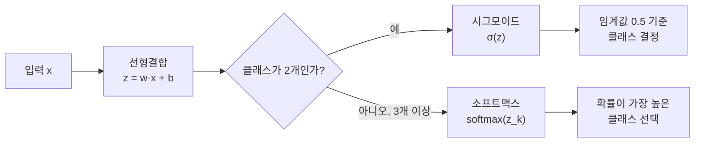

<Callout type="info">
  **이번 문서의 목표:** 로지스틱 회귀가 왜 회귀인데 분류에 쓰이는지, 시그모이드 함수·오즈·로그 오즈가 어떻게 서로 연결되는지 실제 숫자로 계산해 보이고, 이진분류의 결정경계와 다중분류의 소프트맥스 계산까지 직접 검산할 수 있게 한다.
</Callout>

## 왜 회귀로 분류를 하는가 — 선형회귀의 한계

08편에서 배운 선형회귀는 예측값 $\hat{y}$가 $-\infty$부터 $+\infty$까지 어떤 값이든 나올 수 있습니다. 그런데 "합격/불합격", "스팸/정상" 같은 분류(Classification) 문제는 예측값이 **확률**, 즉 $0$과 $1$ 사이의 값이어야 의미가 있습니다. 선형회귀의 출력 $w \cdot x + b$를 그대로 확률로 쓰면 $1.5$나 $-0.3$처럼 확률 범위를 벗어난 값이 나올 수 있어 그대로 쓸 수 없습니다.

> **쉽게 말하면:** 로지스틱 회귀(Logistic Regression)는 "선형회귀의 출력을 0과 1 사이로 눌러 담아 확률처럼 쓰는 방법"입니다. 이름에 회귀가 들어가지만 실제 용도는 분류입니다.

## 1. 시그모이드 함수 — 실수를 확률로 바꾸기

로지스틱 회귀는 선형회귀와 마찬가지로 먼저 $z = w \cdot x + b$를 계산합니다. 이 $z$를 **시그모이드 함수**(Sigmoid Function, S자 모양의 곡선이라는 뜻)에 통과시켜 확률로 바꿉니다.

$$
\sigma(z) = \frac{1}{1+e^{-z}}
$$

- $\sigma(z)$ (시그마): 시그모이드 함수의 출력값, 항상 $0$과 $1$ 사이
- $e$: 자연로그의 밑(약 $2.71828$)
- $z$: 선형결합 $w \cdot x + b$의 값

**실제 숫자로 계산해 보겠습니다.** 공부 시간(x, 시간 단위)으로 합격 여부를 예측하는 모델이 학습을 마쳐 $w=0.8$, $b=-1.5$가 나왔다고 합시다. 공부 시간이 $5$시간인 학생의 합격 확률을 구합니다.

$$
z = w \cdot x + b = 0.8 \times 5 + (-1.5) = 4 - 1.5 = 2.5
$$

$$
\sigma(2.5) = \frac{1}{1+e^{-2.5}} = \frac{1}{1+0.0821} = \frac{1}{1.0821} \approx 0.924
$$

이 학생의 합격 확률은 약 **92.4퍼센트**입니다. 시그모이드 함수는 $z$가 커질수록 $1$에 가까워지고, $z$가 작아질수록(음수로 커질수록) $0$에 가까워지며, $z=0$일 때 정확히 $0.5$가 되는 S자 곡선입니다.

## 2. 오즈와 로그 오즈 — 계수를 해석하는 방법

로지스틱 회귀의 계수 $w$가 왜 저 자리에 곱해지는지 이해하려면 **오즈**(Odds, 승산)라는 개념이 필요합니다. 오즈는 "일어날 확률이 일어나지 않을 확률의 몇 배인가"를 나타냅니다.

$$
\text{Odds} = \frac{p}{1-p}
$$

- $p$: 사건이 일어날 확률(여기서는 합격 확률)
- $1-p$: 사건이 일어나지 않을 확률(불합격 확률)

앞서 구한 $p=0.924$를 대입합니다.

$$
\text{Odds} = \frac{0.924}{1-0.924} = \frac{0.924}{0.076} \approx 12.16
$$

합격할 가능성이 불합격할 가능성의 약 $12.16$배라는 뜻입니다. 이 오즈에 자연로그를 씌운 것이 **로그 오즈**(Log-Odds, 로짓·Logit이라고도 부름)이며, 놀랍게도 이것이 처음 계산했던 $z$ 값과 정확히 같습니다.

$$
\ln(\text{Odds}) = \ln(12.16) \approx 2.5 = z
$$

즉 로지스틱 회귀는 "**로그 오즈를 $x$에 대한 직선으로 모델링**한 것"입니다. 이 관계 덕분에 계수 $w$를 다음과 같이 해석할 수 있습니다.

$$
e^{w} = e^{0.8} \approx 2.226
$$

**결과 해석:** 공부 시간이 $1$시간 늘어날 때마다 합격의 오즈가 약 $2.226$배로 곱해집니다(더해지는 것이 아니라 **곱해지는** 관계라는 점이 중요합니다). 이것이 로지스틱 회귀 계수를 "오즈비(Odds Ratio)로 해석한다"고 말하는 이유입니다.

## 3. 결정경계 — 확률을 클래스로 바꾸는 기준선

모델이 확률을 출력해도 최종적으로는 "합격" 또는 "불합격" 하나로 결론을 내려야 합니다. 보통 확률 $0.5$를 기준으로 그 이상이면 양성 클래스(1), 미만이면 음성 클래스(0)로 분류합니다. $\sigma(z)=0.5$가 되는 지점은 정확히 $z=0$인 지점이므로, **결정경계**(Decision Boundary)는 $w \cdot x + b = 0$을 만족하는 $x$입니다.

$$
0.8x - 1.5 = 0 \quad \Rightarrow \quad x = \frac{1.5}{0.8} = 1.875
$$

**결과 해석:** 이 모델은 공부 시간이 약 $1.875$시간을 넘으면 합격 쪽으로, 그보다 적으면 불합격 쪽으로 예측합니다. 로지스틱 회귀의 결정경계는 $x$가 1개 특징일 때는 하나의 점이지만, 특징이 2개면 하나의 직선, 특징이 3개면 하나의 평면이 되며, 항상 **선형**(직선·평면) 형태라는 점이 핵심 성질입니다.

## 4. 이진분류를 넘어 — 다중분류와 소프트맥스

클래스가 3개 이상이면 시그모이드 하나로는 부족합니다. 이때는 각 클래스마다 점수 $z_k$를 계산한 뒤 **소프트맥스 함수**(Softmax Function)로 전체 클래스에 대한 확률 분포를 만듭니다.

$$
\text{softmax}(z_k) = \frac{e^{z_k}}{\sum_{j=1}^{K} e^{z_j}}
$$

- $z_k$: $k$번째 클래스에 대한 선형결합 점수
- $K$: 전체 클래스 개수
- 분모 $\sum e^{z_j}$: 모든 클래스의 지수값을 더한 정규화 상수(확률의 합이 $1$이 되도록 맞춰줌)

세 클래스(사과·바나나·포도)에 대한 점수가 $z=(2.0, 1.0, 0.1)$로 나왔다고 합시다.

$$
e^{2.0} \approx 7.389, \quad e^{1.0} \approx 2.718, \quad e^{0.1} \approx 1.105
$$

$$
\text{분모} = 7.389+2.718+1.105 = 11.212
$$

$$
p_{사과} = \frac{7.389}{11.212} \approx 0.659, \quad p_{바나나} = \frac{2.718}{11.212} \approx 0.242, \quad p_{포도} = \frac{1.105}{11.212} \approx 0.099
$$

**검산:** $0.659+0.242+0.099 = 1.000$으로 확률의 합이 정확히 $1$이 됩니다. 가장 높은 확률을 가진 사과가 최종 예측 클래스가 됩니다. 이렇게 여러 클래스에 소프트맥스를 적용하는 확장을 **다항 로지스틱 회귀**(Multinomial Logistic Regression)라고 부르며, 그 외에도 이진분류기를 클래스 수만큼 여러 개 만들어 조합하는 **일대다**(One-vs-Rest, OvR) 방식도 있습니다.

## 5. 로지스틱 회귀의 가정과 장단점

| 항목 | 내용 |
|---|---|
| 핵심 가정 | 로그 오즈가 특징들의 선형결합이다(결정경계가 선형이다) |
| 장점 | 계수를 오즈비로 해석할 수 있어 설명력이 높다, 학습·예측이 빠르다, 확률값 자체를 출력한다 |
| 단점 | 클래스가 선형으로 분리되지 않는 데이터(비선형 경계)에는 성능이 떨어진다, 특징 간 다중공선성에 민감하다 |
| 대응 | 비선형 경계가 필요하면 다항 특징을 추가하거나 트리·SVM 계열(11–12편)을 검토한다 |

**자주 틀리는 점:** "로지스틱 회귀는 회귀 문제에 쓰인다"는 설명은 틀렸습니다. 이름은 회귀이지만 실제로는 **분류** 알고리즘입니다. 또한 "로지스틱 회귀 계수가 커지면 예측 확률이 그 값만큼 더해진다"는 설명도 틀렸습니다 — 계수는 확률에 더해지는 것이 아니라 **오즈에 곱해지는** 방식으로 작용합니다.

## 핵심 정리

- 로지스틱 회귀는 선형결합 $z=w \cdot x+b$를 시그모이드 함수 $\sigma(z)=1/(1+e^{-z})$에 통과시켜 확률을 출력하는 **분류** 알고리즘이다.
- 로그 오즈 $\ln(p/(1-p))$가 곧 $z$이므로, 계수 $w$는 $e^w$만큼 오즈에 곱해지는 오즈비로 해석한다.
- 결정경계는 $w \cdot x+b=0$이 되는 지점이며 항상 선형(직선·평면)이다.
- 클래스가 3개 이상이면 소프트맥스로 확장하며, 각 클래스 확률의 합은 항상 $1$이다.

## 마무리 복습

<Quiz
  questionNumber={1}
  question="로지스틱 회귀에서 z = w·x + b = 2.5일 때 시그모이드 함수 값으로 가장 가까운 것은?"
  options={['약 0.5', '약 0.924', '약 0.076', '약 2.5']}
  correctAnswer={2}
  explanation="시그모이드 함수 σ(z)=1/(1+e^(-z))에 z=2.5를 대입하면 1/(1+0.0821)=1/1.0821≈0.924가 된다."
  optionExplanations={['z=0일 때 시그모이드 값이 0.5가 된다', '공식대로 계산한 정확한 값이다', '이는 1-0.924에 해당하는 불합격 확률이지 시그모이드 값 자체가 아니다', '이는 z 값 자체이며 시그모이드를 통과하기 전 값이다']}
/>

<Quiz
  questionNumber={2}
  question="오즈(Odds)와 확률 p의 관계를 옳게 나타낸 것은?"
  options={['Odds = p + (1-p)', 'Odds = p / (1-p)', 'Odds = (1-p) / p', 'Odds = p * (1-p)']}
  correctAnswer={2}
  explanation="오즈는 사건이 일어날 확률을 일어나지 않을 확률로 나눈 값, 즉 p/(1-p)로 정의된다."
  optionExplanations={['이 합은 항상 1이 되므로 오즈의 정의가 아니다', '오즈의 정확한 정의다', '이는 오즈의 역수에 해당한다', '이는 오즈가 아니라 확률의 곱이다']}
/>

<Quiz
  questionNumber={3}
  question="로지스틱 회귀 계수 w=0.8일 때 e^w ≈ 2.226이 의미하는 것으로 가장 적절한 것은?"
  options={['특징 x가 1 증가할 때 예측 확률이 2.226만큼 더해진다', '특징 x가 1 증가할 때 사건이 일어날 오즈가 약 2.226배로 곱해진다', '특징 x가 1 증가할 때 z값이 2.226만큼 줄어든다', '특징 x와 무관하게 항상 확률이 2.226이 된다']}
  correctAnswer={2}
  explanation="로그 오즈가 z와 같으므로 계수 w는 오즈에 곱해지는 배수로 해석된다. e^w는 특징이 1단위 증가할 때 오즈가 몇 배가 되는지를 나타낸다."
  optionExplanations={['확률은 0~1 사이 값이므로 2.226만큼 더해질 수 없다', '오즈비 해석을 정확히 설명했다', 'w가 양수이므로 z는 오히려 증가한다', '확률은 x값에 따라 달라지므로 항상 일정하지 않다']}
/>

<Quiz
  questionNumber={4}
  question="본문 예제에서 w=0.8, b=-1.5인 로지스틱 회귀 모델의 결정경계(x값)로 가장 가까운 것은?"
  options={['0.8', '1.5', '1.875', '2.5']}
  correctAnswer={3}
  explanation="결정경계는 w*x+b=0이 되는 지점이다. 0.8x-1.5=0을 풀면 x=1.5/0.8=1.875가 된다."
  optionExplanations={['이는 계수 w의 값이다', '이는 절편의 절댓값이다', '방정식을 정확히 풀어낸 결정경계 값이다', '이는 x=5일 때의 z값이지 결정경계가 아니다']}
/>

<Quiz
  questionNumber={5}
  question="클래스가 3개인 다중분류에서 소프트맥스로 계산한 확률이 (0.659, 0.242, 0.099)로 나왔을 때, 이 결과에 대한 설명으로 옳지 않은 것은?"
  options={['세 확률의 합은 1이 되어야 한다', '가장 확률이 높은 첫 번째 클래스가 예측 결과가 된다', '세 값 중 하나라도 1을 넘을 수 있다', '소프트맥스는 각 클래스 점수를 지수함수로 변환한 뒤 정규화한 것이다']}
  correctAnswer={3}
  explanation="소프트맥스의 출력은 항상 0과 1 사이의 확률이며 전체 합이 1이 되도록 정규화되므로, 어떤 클래스의 확률도 1을 넘을 수 없다. 따라서 이 설명은 옳지 않다."
  optionExplanations={['소프트맥스 출력의 정규화 성질을 옳게 설명했다', '확률이 가장 높은 클래스를 선택하는 것이 옳은 설명이다', '소프트맥스 출력은 절대 1을 넘을 수 없으므로 이 설명이 옳지 않은 보기다', '소프트맥스의 계산 방식을 옳게 설명했다']}
/>

<Quiz
  questionNumber={6}
  question="로지스틱 회귀의 핵심 가정과 한계에 대한 설명으로 가장 적절한 것은?"
  options={['로지스틱 회귀는 항상 회귀 문제에만 사용된다', '로지스틱 회귀는 로그 오즈가 특징들의 선형결합이라고 가정하며, 클래스가 비선형으로 분리될 때는 성능이 떨어질 수 있다', '로지스틱 회귀는 확률이 아니라 항상 0 또는 1만 출력한다', '로지스틱 회귀는 다중공선성에 전혀 영향받지 않는다']}
  correctAnswer={2}
  explanation="로지스틱 회귀는 로그 오즈가 선형결합이라는 가정 위에서 결정경계를 선형으로 그리므로, 데이터가 비선형으로 분리되어야 하는 경우 성능 한계가 있다."
  optionExplanations={['로지스틱 회귀는 이름과 달리 분류 알고리즘이다', '핵심 가정과 한계를 정확히 설명했다', '로지스틱 회귀는 0과 1 사이의 확률을 출력하고, 임계값으로 클래스를 결정한다', '다른 선형 모델과 마찬가지로 다중공선성에 민감하다']}
/>

## 참고 자료

- [scikit-learn User Guide — Logistic Regression](https://scikit-learn.org/stable/user_guide.html)
- [scikit-learn Model Evaluation — Metrics and scoring](https://scikit-learn.org/stable/modules/model_evaluation.html)
