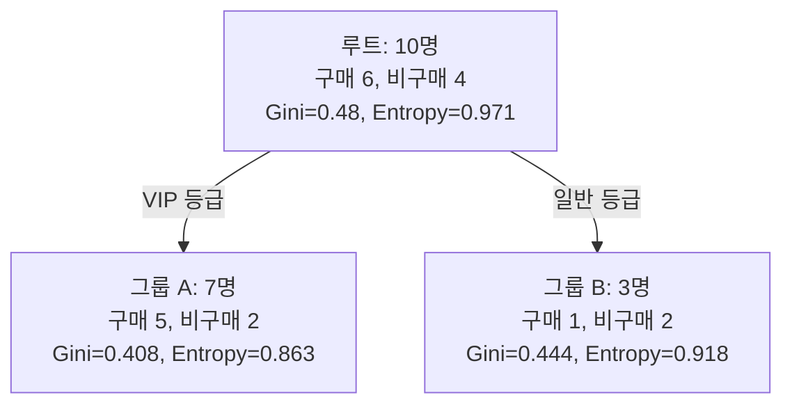

<Callout type="info">
  **이번 문서의 목표:** 결정트리가 어떤 기준으로 데이터를 나누는지 지니 지수와 엔트로피·정보이득을 실제 숫자 10개로 끝까지 계산해 검산하고, 나이브 베이즈가 조건부 독립을 가정해 어떻게 실제 확률을 계산하는지 손으로 재현할 수 있게 한다.
</Callout>

## 왜 "어떻게 나눌지"가 문제인가 — 결정트리의 출발점

06편에서 지도학습은 입력 특징으로 정답 레이블을 맞히는 문제라고 배웠습니다. **결정트리**(Decision Tree)는 스무고개처럼 "이 조건을 만족하는가?"라는 질문을 반복해서 데이터를 점점 더 순수한(한 클래스에 가까운) 그룹으로 쪼개 나가는 알고리즘입니다. 문제는 데이터를 나누는 기준이 되는 질문(어떤 특징을, 어떤 값으로 나눌지)이 무수히 많다는 점입니다. 결정트리는 **나눈 뒤 두 그룹이 얼마나 순수해지는가**를 숫자로 재서, 가장 순수해지는 질문을 고릅니다. 이 순수도를 재는 두 가지 지표가 **지니 지수**(Gini Index)와 **엔트로피**(Entropy)입니다.

> **쉽게 말하면:** 지니 지수와 엔트로피는 "한 그룹 안에 서로 다른 클래스가 얼마나 섞여 있는가"를 숫자 하나로 나타낸 것입니다. 값이 작을수록 순수합니다(한 클래스로만 몰려 있다는 뜻).

## 1. 지니 지수와 엔트로피 — 실제 숫자로 계산

쇼핑몰 고객 10명의 구매 여부 데이터가 있습니다. 이 중 6명은 "구매"(양성), 4명은 "비구매"(음성)입니다. 먼저 나누기 전 이 10명 전체(**루트 노드**)의 순수도를 계산합니다.

$$
p_{+} = \frac{6}{10} = 0.6, \quad p_{-} = \frac{4}{10} = 0.4
$$

**지니 지수**는 "무작위로 뽑은 두 샘플이 서로 다른 클래스일 확률"을 나타내며, 공식은 다음과 같습니다.

$$
Gini = 1 - \sum_{k} p_k^2
$$

- $p_k$: 클래스 $k$가 노드 안에서 차지하는 비율

$$
Gini_{root} = 1 - (0.6^2 + 0.4^2) = 1 - (0.36+0.16) = 1 - 0.52 = 0.48
$$

**엔트로피**는 정보이론에서 "불확실성의 크기"를 재는 지표로, 값이 클수록 어떤 클래스가 나올지 예측하기 어렵다는 뜻입니다.

$$
Entropy = -\sum_{k} p_k \log_2 p_k
$$

- $\log_2$: 밑이 2인 로그(정보를 이진수 비트 단위로 재기 위함)

$$
\log_2(0.6) \approx -0.737, \quad \log_2(0.4) \approx -1.322
$$

$$
Entropy_{root} = -(0.6 \times (-0.737) + 0.4 \times (-1.322)) = -(-0.442 - 0.529) = 0.971
$$

**결과 해석:** 루트 노드는 지니 $0.48$, 엔트로피 $0.971$로 순수하지 않은(섞인) 상태입니다. 만약 6:4가 아니라 10:0(한 클래스만 있음)이었다면 두 지표 모두 $0$이 되고, 5:5(완전히 반반)였다면 지니는 $0.5$, 엔트로피는 $1$로 최댓값을 가집니다.

## 2. 분할 후 정보이득 계산 — 전 과정

"회원등급이 VIP인가?"라는 질문으로 10명을 나눴더니, VIP 그룹(A) 7명 중 5명이 구매·2명이 비구매, 일반 그룹(B) 3명 중 1명이 구매·2명이 비구매로 나뉘었습니다.

**검산 1 (분할 전후 인원수 일치 확인):** $7+3=10$(전체 일치), $5+1=6$(구매자 합 일치), $2+2=4$(비구매자 합 일치). 분할이 데이터를 빠뜨리지 않고 정확히 나눴음을 확인했습니다.

**그룹 A(7명: 구매 5, 비구매 2)의 지니와 엔트로피:**

$$
p_{+}=\frac{5}{7}\approx0.714, \quad p_{-}=\frac{2}{7}\approx0.286
$$

$$
Gini_A = 1 - (0.714^2+0.286^2) = 1-(0.510+0.082) = 1-0.592 = 0.408
$$

$$
\log_2(0.714)\approx-0.485, \quad \log_2(0.286)\approx-1.807
$$

$$
Entropy_A = -(0.714\times(-0.485)+0.286\times(-1.807)) = -(-0.347-0.517) = 0.863
$$

**그룹 B(3명: 구매 1, 비구매 2)의 지니와 엔트로피:**

$$
p_{+}=\frac{1}{3}\approx0.333, \quad p_{-}=\frac{2}{3}\approx0.667
$$

$$
Gini_B = 1-(0.333^2+0.667^2) = 1-(0.111+0.444) = 1-0.556 = 0.444
$$

$$
\log_2(0.333)\approx-1.585, \quad \log_2(0.667)\approx-0.585
$$

$$
Entropy_B = -(0.333\times(-1.585)+0.667\times(-0.585)) = -(-0.528-0.390) = 0.918
$$

**전체 분할 후 가중평균**(그룹 크기 비율로 가중치를 매김):

$$
Entropy_{split} = \frac{7}{10}\times0.863 + \frac{3}{10}\times0.918 = 0.604+0.275 = 0.880
$$

$$
Gini_{split} = \frac{7}{10}\times0.408 + \frac{3}{10}\times0.444 = 0.286+0.133 = 0.419
$$

**정보이득**(Information Gain)은 분할 전 불순도에서 분할 후 가중평균 불순도를 뺀 값으로, 이 값이 클수록 좋은 분할입니다.

$$
IG_{entropy} = Entropy_{root} - Entropy_{split} = 0.971 - 0.880 = 0.091
$$

$$
IG_{gini} = Gini_{root} - Gini_{split} = 0.48 - 0.419 = 0.061
$$

**검산 2 (극단값으로 지표 확인):** 만약 VIP 그룹이 7명 전부 구매였다면 $Entropy_A=0$, $Gini_A=0$이 되어 완전히 순수한 노드가 됩니다. 위 계산에서 $Entropy_A=0.863$, $Gini_A=0.408$로 $0$보다 크게 나온 것은 이 그룹에 아직 비구매자 2명이 섞여 있기 때문이며, 실제 그룹 구성(5:2)과 방향이 일치합니다. 결정트리는 여러 후보 질문(특징) 각각에 대해 이 정보이득을 계산한 뒤, **정보이득이 가장 큰 질문**을 그 노드의 분할 기준으로 선택합니다.

## 3. 지니와 엔트로피, 무엇이 다른가

| 구분 | 지니 지수 | 엔트로피 |
|---|---|---|
| 최솟값 | $0$(완전 순수) | $0$(완전 순수) |
| 이진분류 최댓값 | $0.5$(5:5일 때) | $1$(5:5일 때) |
| 계산 비용 | 로그 계산이 없어 더 빠름 | 로그 계산이 필요해 상대적으로 느림 |
| 사용 알고리즘 | CART | ID3, C4.5 |
| 실무 차이 | 두 지표로 고른 분할 기준은 대부분 비슷하며, 결과에 큰 차이가 나는 경우는 드물다 | |

## 4. 가지치기 — 결정트리의 과적합 대응

결정트리를 끝까지(모든 노드가 완전히 순수해질 때까지) 키우면 훈련 데이터의 노이즈까지 전부 외워버려 **과적합**이 심하게 발생합니다. 이를 막는 방법을 **가지치기**(Pruning)라고 합니다.

| 방법 | 방식 |
|---|---|
| 사전 가지치기(Pre-pruning) | 트리의 최대 깊이, 노드가 갈라지기 위한 최소 샘플 수 등을 미리 제한해 트리가 너무 커지지 않게 막는다 |
| 사후 가지치기(Post-pruning) | 일단 트리를 끝까지 키운 뒤, 검증 데이터 성능이 나아지지 않는 가지를 잘라낸다 |

과적합과 편향-분산 트레이드오프의 일반적인 이론은 19편에서 교차검증과 함께 더 깊이 다룹니다. 결정트리에서는 "**깊이가 깊을수록 훈련 정확도는 올라가지만 검증 정확도는 어느 시점부터 떨어진다**"는 패턴이 대표적인 출제 포인트입니다.

## 5. 나이브 베이즈 — 조건부 독립을 가정하고 확률을 곱한다

**나이브 베이즈**(Naive Bayes)는 베이즈 정리(조건부 확률을 뒤집어 계산하는 정리)를 이용해 "이 데이터가 주어졌을 때 어떤 클래스일 확률이 가장 높은가"를 계산하는 분류 알고리즘입니다. 이름의 "나이브(순진한)"는 **모든 특징이 클래스가 주어졌을 때 서로 독립적**이라는, 실제로는 잘 맞지 않을 수 있는 순진한 가정을 그대로 밀어붙이기 때문에 붙은 이름입니다.

> **쉽게 말하면:** 나이브 베이즈는 "이 메일에 '무료'라는 단어가 있을 확률"과 "'할인'이라는 단어가 있을 확률"을 마치 서로 아무 상관 없는 것처럼 각각 따로 계산해서 곱해버립니다. 실제로는 두 단어가 함께 나오는 경향이 있어도 무시하는 것입니다.

**조건부 독립 가정**(Conditional Independence Assumption)을 수식으로 쓰면 다음과 같습니다.

$$
P(x_1,x_2|C) = P(x_1|C) \times P(x_2|C)
$$

- $C$: 클래스(예: 스팸 여부)
- $x_1, x_2$: 특징(예: 특정 단어의 등장 여부)

**실제 확률로 계산해 보겠습니다.** 스팸 메일 분류기를 만든다고 합시다. 사전 확률(Prior, 데이터를 보기 전에 이미 알고 있는 클래스 비율)과 각 단어가 클래스별로 등장할 조건부 확률(Likelihood, 우도)이 다음과 같습니다.

| 구분 | 스팸(Spam) | 정상(Ham) |
|---|---|---|
| 사전 확률 $P(C)$ | 0.4 | 0.6 |
| $P(\text{'무료'} \vert C)$ | 0.7 | 0.2 |
| $P(\text{'할인'} \vert C)$ | 0.6 | 0.3 |

새로 온 메일에 "무료"와 "할인"이 둘 다 들어 있습니다. 조건부 독립을 가정해 각 클래스에 대한 값을 계산합니다(베이즈 정리의 분모는 두 클래스에서 공통이므로 비교 목적에서는 생략하고, 분자만 계산한 뒤 마지막에 정규화합니다).

$$
P(Spam) \times P(\text{무료}|Spam) \times P(\text{할인}|Spam) = 0.4 \times 0.7 \times 0.6 = 0.168
$$

$$
P(Ham) \times P(\text{무료}|Ham) \times P(\text{할인}|Ham) = 0.6 \times 0.2 \times 0.3 = 0.036
$$

두 값을 더한 합으로 각각을 나누어 실제 확률로 **정규화**합니다.

$$
P(Spam|\text{무료,할인}) = \frac{0.168}{0.168+0.036} = \frac{0.168}{0.204} \approx 0.824
$$

$$
P(Ham|\text{무료,할인}) = \frac{0.036}{0.204} \approx 0.176
$$

**검산:** $0.824+0.176=1.000$으로 확률의 합이 정확히 $1$이 됩니다. 이 메일은 스팸일 확률이 약 **82.4퍼센트**로 계산되어 스팸으로 분류됩니다.

**자주 틀리는 함정 — 제로 확률 문제(Zero-Frequency Problem):** 만약 훈련 데이터에 "할인"이라는 단어가 스팸 메일에서 단 한 번도 등장한 적이 없어 $P(\text{할인}|Spam)=0$으로 추정되면, 조건부 독립 가정에 따라 전체 곱셈 결과가 다른 단어와 무관하게 무조건 $0$이 되어버립니다. 이를 막기 위해 모든 확률에 작은 값을 더해 $0$이 되지 않게 보정하는 **라플라스 스무딩**(Laplace Smoothing, 가산 평활화)을 함께 씁니다.

## 6. 결정트리 vs 나이브 베이즈

| 구분 | 결정트리 | 나이브 베이즈 |
|---|---|---|
| 기본 원리 | 불순도(지니·엔트로피)가 가장 크게 줄어드는 질문으로 반복 분할 | 조건부 독립을 가정하고 베이즈 정리로 사후 확률 계산 |
| 해석 가능성 | 매우 높음(질문 흐름을 그대로 사람이 읽을 수 있음) | 각 특징의 기여도를 확률로 확인 가능하나 트리만큼 직관적이지는 않음 |
| 과적합 위험 | 깊이 제한이 없으면 매우 높음(가지치기 필요) | 상대적으로 낮음(가정이 강해 오히려 과적합에 덜 취약) |
| 특징 간 상관관계 | 자연스럽게 반영됨(순차적 분할이 상호작용을 포착) | 조건부 독립 가정을 위반하면 성능이 떨어질 수 있음 |
| 대표 활용 | 신용 심사, 의료 진단 규칙처럼 근거 설명이 중요한 경우 | 스팸 필터링, 텍스트 분류처럼 특징 수가 많고 계산이 빨라야 하는 경우 |

**자주 틀리는 점:** "나이브 베이즈는 특징 간 상관관계를 반영해 더 정교하게 계산한다"는 설명은 틀렸습니다. 오히려 정반대로, 나이브 베이즈는 특징 간 상관관계를 **무시하는(독립으로 가정하는)** 알고리즘이며, 이 단순한 가정 덕분에 계산이 빠르고 적은 데이터로도 잘 작동한다는 것이 장점입니다.

## 핵심 정리

- 지니 지수 $1-\sum p_k^2$와 엔트로피 $-\sum p_k\log_2 p_k$는 노드의 불순도를 재며, 값이 작을수록 순수한 노드다. 6:4 데이터에서 지니는 $0.48$, 엔트로피는 $0.971$이다.
- 정보이득은 분할 전 불순도에서 분할 후 가중평균 불순도를 뺀 값이며, 결정트리는 정보이득이 가장 큰 질문을 분할 기준으로 선택한다.
- 결정트리는 깊이 제한 없이 키우면 과적합되므로 사전·사후 가지치기로 대응한다.
- 나이브 베이즈는 특징들이 클래스가 주어졌을 때 서로 독립이라고(조건부 독립) 가정해 우도들을 단순히 곱한 뒤 정규화해 사후 확률을 구한다. 제로 확률 문제는 라플라스 스무딩으로 보정한다.

## 마무리 복습

<Quiz
  questionNumber={1}
  question="구매 6명, 비구매 4명(총 10명)인 노드의 지니 지수로 옳은 것은?"
  options={['0.24', '0.48', '0.52', '0.96']}
  correctAnswer={2}
  explanation="Gini = 1 - (0.6^2 + 0.4^2) = 1 - (0.36+0.16) = 1 - 0.52 = 0.48이다."
  optionExplanations={['0.36과 0.16을 더하지 않고 절반만 반영한 값이다', '공식대로 계산한 정확한 지니 지수다', '이는 1에서 빼기 전의 제곱합 자체다', '이는 엔트로피 값과 혼동한 결과다']}
/>

<Quiz
  questionNumber={2}
  question="같은 10명을 VIP 그룹(7명: 구매5, 비구매2)과 일반 그룹(3명: 구매1, 비구매2)으로 나눴을 때, 분할 후 가중평균 엔트로피(약 0.880)를 이용한 정보이득으로 가장 가까운 것은? (분할 전 엔트로피는 0.971)"
  options={['0.030', '0.091', '0.150', '0.880']}
  correctAnswer={2}
  explanation="정보이득 = 분할 전 엔트로피 - 분할 후 가중평균 엔트로피 = 0.971 - 0.880 = 0.091이다."
  optionExplanations={['가중평균 계산 과정에서 오차가 누적된 값이다', '공식대로 계산한 정확한 정보이득이다', '분할 전후 값을 잘못 조합한 결과다', '이는 정보이득이 아니라 분할 후 엔트로피 값 자체다']}
/>

<Quiz
  questionNumber={3}
  question="결정트리를 제한 없이 끝까지 키웠을 때 가장 우려되는 문제와 그 대응으로 가장 적절한 것은?"
  options={['과소적합이 생기므로 트리 깊이를 늘린다', '과적합이 생기므로 사전 또는 사후 가지치기를 적용한다', '정보이득이 무한히 커지므로 계산을 멈출 수 없다', '지니 지수가 항상 0.5로 고정되어 문제가 없다']}
  correctAnswer={2}
  explanation="트리를 끝까지 키우면 훈련 데이터의 노이즈까지 학습해 과적합이 발생한다. 최대 깊이 제한 같은 사전 가지치기나, 다 키운 뒤 가지를 잘라내는 사후 가지치기로 대응한다."
  optionExplanations={['트리를 끝까지 키우는 것은 오히려 과적합, 즉 과소적합의 반대 문제를 일으킨다', '과적합 문제와 가지치기라는 정확한 대응을 설명했다', '정보이득은 각 분할마다 계산되는 값으로 무한히 커지지 않는다', '지니 지수는 노드 구성에 따라 달라지며 고정값이 아니다']}
/>

<Quiz
  questionNumber={4}
  question="나이브 베이즈 분류기의 '나이브(순진한)'라는 이름이 붙은 이유로 가장 적절한 것은?"
  options={['계산 속도가 매우 느리기 때문이다', '클래스가 주어졌을 때 모든 특징이 서로 독립이라고 가정하기 때문이다', '항상 두 개의 클래스만 분류할 수 있기 때문이다', '학습 데이터가 전혀 필요 없기 때문이다']}
  correctAnswer={2}
  explanation="나이브 베이즈는 실제로는 서로 관련이 있을 수 있는 특징들을 클래스가 주어졌을 때 서로 독립이라고 가정하고 확률을 단순히 곱하기 때문에 '순진하다(naive)'는 이름이 붙었다."
  optionExplanations={['오히려 계산이 단순해 속도가 빠른 편이다', '조건부 독립 가정을 정확히 설명했다', '나이브 베이즈는 다중분류에도 사용할 수 있다', '사전 확률과 우도를 추정하려면 학습 데이터가 필요하다']}
/>

<Quiz
  questionNumber={5}
  question="본문 예제에서 P(Spam)*P('무료'|Spam)*P('할인'|Spam)=0.168, P(Ham)*P('무료'|Ham)*P('할인'|Ham)=0.036일 때, 정규화한 P(Spam|무료,할인)로 가장 가까운 것은?"
  options={['0.168', '0.204', '0.824', '0.036']}
  correctAnswer={3}
  explanation="정규화는 각 값을 전체 합(0.168+0.036=0.204)으로 나누는 것이다. 0.168/0.204 ≈ 0.824가 된다."
  optionExplanations={['이는 정규화 이전의 분자 값이다', '이는 정규화의 분모(전체 합)이지 확률 자체가 아니다', '정규화 공식대로 계산한 정확한 사후 확률이다', '이는 Ham 쪽의 분자 값이며 정규화 전이다']}
/>

<Quiz
  questionNumber={6}
  question="훈련 데이터에 특정 단어가 스팸 메일에서 한 번도 등장하지 않아 조건부 확률이 0으로 추정되는 문제를 보정하는 방법은?"
  options={['가지치기', '라플라스 스무딩', 'PCA 차원 축소', '경사하강법']}
  correctAnswer={2}
  explanation="확률이 정확히 0이 되어 곱셈 전체가 0이 되는 제로 확률 문제는, 모든 확률 추정에 작은 값을 더해 0이 되지 않게 하는 라플라스 스무딩(가산 평활화)으로 보정한다."
  optionExplanations={['가지치기는 결정트리의 과적합 대응 기법이다', '제로 확률 문제에 대한 정확한 대응 방법이다', 'PCA는 차원 축소 기법으로 이 문제와 무관하다', '경사하강법은 반복적으로 손실을 줄이는 최적화 기법으로 이 문제와 무관하다']}
/>

<Quiz
  questionNumber={7}
  question="결정트리와 나이브 베이즈를 비교한 설명으로 옳지 않은 것은?"
  options={['결정트리는 분할 흐름을 그대로 읽을 수 있어 해석 가능성이 높다', '나이브 베이즈는 특징 간 상관관계를 적극적으로 반영해 정교하게 계산한다', '결정트리는 깊이 제한이 없으면 과적합 위험이 크다', '나이브 베이즈는 계산이 빠르고 적은 데이터로도 잘 작동하는 편이다']}
  correctAnswer={2}
  explanation="나이브 베이즈는 특징 간 상관관계를 반영하는 것이 아니라 조건부 독립으로 가정해 무시한다. 상관관계를 적극 반영한다는 설명은 옳지 않다."
  optionExplanations={['결정트리의 해석 가능성에 대한 옳은 설명이다', '조건부 독립 가정과 반대로 서술되어 옳지 않은 설명이다', '결정트리 과적합에 대한 옳은 설명이다', '나이브 베이즈의 실용적 장점에 대한 옳은 설명이다']}
/>

<Quiz
  questionNumber={8}
  question="지니 지수와 엔트로피에 대한 설명으로 옳지 않은 것은?"
  options={['두 지표 모두 노드가 완전히 순수하면 0이 된다', '엔트로피는 로그 계산이 필요해 지니 지수보다 계산 비용이 상대적으로 크다', '이진분류에서 클래스 비율이 5:5일 때 지니 지수는 1, 엔트로피는 0.5이다', '결정트리는 두 지표 중 하나를 기준으로 정보이득이 가장 큰 분할을 선택한다']}
  correctAnswer={3}
  explanation="이진분류 5:5 상황에서 지니 지수의 최댓값은 0.5, 엔트로피의 최댓값은 1이다. 두 값이 서로 뒤바뀌어 서술되어 옳지 않다."
  optionExplanations={['두 지표 모두 완전 순수 노드에서 0이 되므로 옳은 설명이다', '엔트로피 계산에는 로그가 필요하므로 옳은 설명이다', '지니와 엔트로피의 최댓값이 뒤바뀌어 있어 옳지 않은 설명이다', '정보이득이 가장 큰 분할을 선택한다는 설명은 옳다']}
/>

## 참고 자료

- [scikit-learn User Guide — Decision Trees, Naive Bayes](https://scikit-learn.org/stable/user_guide.html)
- [Classification Algorithms 비교 자료(Decision Tree, Naive Bayes 등)](https://thesai.org/Downloads/Volume16No8/Paper_62-In_Depth_Comparison_of_Supervised_Classification_Models.pdf)
