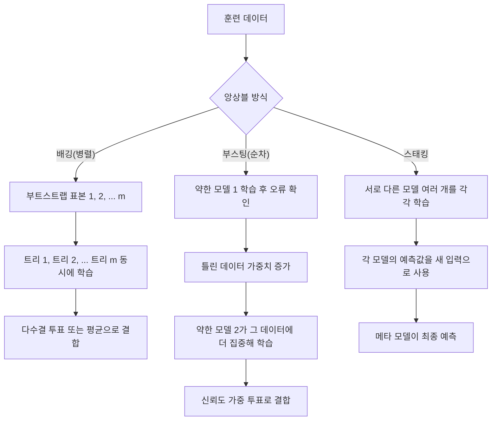

<Callout type="info">
  **이번 문서의 목표:** 배깅·부스팅·스태킹의 작동 방식과 차이를 표로 구분하고, 랜덤포레스트가 갖는 두 가지 무작위성을 설명하며, 다수결 투표와 AdaBoost 가중치 갱신을 실제 숫자로 직접 계산할 수 있다.
</Callout>

## 앙상블이란 무엇인가

### 왜 필요한가

11~12편에서 다룬 결정트리·나이브 베이즈·K-NN·SVM은 각각 하나의 모델(단일 모델, single model)이 데이터를 보고 하나의 예측을 내놓는 방식이었다. 그런데 결정트리 하나는 훈련 데이터의 작은 변화에도 구조가 크게 흔들리는 약점이 있다(분산이 크다). 반대로 아주 얕은 결정트리 하나는 데이터를 충분히 설명하지 못하는 약점이 있다(편향이 크다). 이 두 가지 약점을 동시에 줄이는 실용적인 방법이 바로 여러 모델의 예측을 하나로 합치는 것이다. 이렇게 여러 개별 모델(약한 학습기, weak learner라고도 부른다)의 예측을 결합해 하나의 최종 예측을 만드는 기법을 **앙상블**(ensemble, "합주단·집합"이라는 뜻)이라 한다.

> **쉽게 말하면:** 앙상블은 "한 명의 전문가 의견"보다 "여러 명의 의견을 모은 결론"이 더 안정적이라는 아이디어를 모델에 적용한 것이다.

### 정의와 직관

앙상블이 효과를 내는 이유는 통계학의 큰 수의 법칙과 비슷하다. 개별 모델이 서로 다른 실수를 저지르는 경향이 있다면, 그 실수들은 평균을 내거나 투표를 거치는 과정에서 서로 상쇄된다. 반대로 모든 모델이 완전히 똑같은 실수를 저지른다면 앙상블은 아무 효과가 없다. 그래서 좋은 앙상블을 만들려면 **각 모델이 서로 조금씩 다르게 학습해야 한다**는 조건이 중요하며, 이 "다르게 만드는 방법"에 따라 앙상블 기법이 갈린다.

- **배깅**(bagging, Bootstrap Aggregating의 줄임말): 데이터를 다르게 뽑아서 여러 모델을 **동시에·독립적으로** 학습시킨 뒤 결과를 평균·투표로 합친다.
- **부스팅**(boosting): 여러 모델을 **순서대로** 학습시키되, 앞 모델이 틀린 부분에 다음 모델이 더 집중하도록 만든다.
- **스태킹**(stacking): 서로 다른 종류의 모델(예: 로지스틱 회귀 + 결정트리 + SVM)의 예측 결과를 다시 입력으로 삼아, 이를 종합하는 또 다른 모델(메타 모델, meta model)을 학습시킨다.

## 배깅과 부트스트랩

### 왜 필요한가

결정트리는 훈련 데이터가 조금만 바뀌어도 분할 기준이 완전히 달라질 만큼 데이터에 민감하다(분산이 크다고 표현한다). 만약 원본 데이터 하나로 트리 하나만 만들면, 그 트리가 우연히 이상치나 노이즈에 휘둘렸을 위험을 그대로 안고 간다. 이 위험을 줄이려면 "약간씩 다른 여러 버전의 훈련 데이터"로 여러 트리를 만들어 평균을 내면 된다는 아이디어가 배깅이다.

> **쉽게 말하면:** 배깅은 같은 데이터에서 조금씩 다르게 여러 번 표본을 뽑아 여러 모델을 각각 훈련시키고, 그 결과를 평균·투표로 합치는 방법이다.

### 정의: 부트스트랩 샘플링

**부트스트랩**(bootstrap, 원래 "스스로 신발끈을 당겨 일어선다"는 관용구에서 온 통계 용어)은 원본 데이터셋에서 **복원추출**(sampling with replacement, 한 번 뽑은 표본을 다시 넣고 또 뽑는 방식)로 원본과 같은 크기의 표본을 여러 번 만드는 기법이다. 복원추출이므로 어떤 데이터는 한 번도 뽑히지 않을 수 있고, 어떤 데이터는 여러 번 중복해서 뽑힐 수 있다.

원본 데이터가 $n$개일 때, 한 번의 복원추출에서 특정 데이터 하나가 뽑히지 않을 확률은 $(1 - 1/n)$이고, $n$번 뽑는 과정 전체에서 그 데이터가 단 한 번도 뽑히지 않을 확률은 다음과 같다.

$$
P(\text{뽑히지 않음}) = \left(1 - \frac{1}{n}\right)^n
$$

- $n$: 원본 데이터의 개수(그리고 부트스트랩 표본의 크기)
- $n$이 충분히 크면 이 값은 $e^{-1} \approx 0.368$(약 36.8퍼센트)에 수렴한다. 즉 부트스트랩 표본 하나마다 원본 데이터의 **약 63.2퍼센트만 실제로 포함**되고, 나머지 약 36.8퍼센트는 그 표본에서 아예 빠진다.

빠진 데이터를 **OOB**(Out-Of-Bag, 가방 밖) 데이터라 부르며, 이 OOB 데이터는 해당 트리를 학습시킬 때 쓰이지 않았으므로 그 트리의 검증용 데이터처럼 활용할 수 있다. 이 덕분에 배깅·랜덤포레스트는 별도의 검증 세트를 나누지 않고도 OOB 오차로 성능을 어느 정도 가늠할 수 있다.

### 배깅의 예측 결합: 다수결 투표

배깅으로 여러 결정트리를 만들었다면, 분류 문제에서는 각 트리의 예측 중 **다수결 투표**(majority voting)로 최종 클래스를 정하고, 회귀 문제에서는 각 트리 예측값의 **평균**을 최종 예측으로 쓴다.

작은 예시로, 신용카드 거래가 사기(fraud)인지 아닌지 판별하는 트리 5개가 같은 거래 하나를 두고 다음과 같이 예측했다고 하자.

| 트리 | 예측 |
|---|---|
| 트리 1 | 정상 |
| 트리 2 | 정상 |
| 트리 3 | 사기 |
| 트리 4 | 정상 |
| 트리 5 | 사기 |

정상 3표, 사기 2표이므로 다수결로 최종 예측은 **정상**이다. 만약 트리 한 개(트리 1)만 썼다면 그 트리가 우연히 틀렸을 때 결과가 완전히 뒤집혔겠지만, 5개를 모으면 다수가 동의하는 방향으로 안정된다.

### 자주 틀리는 점

배깅은 "분산을 줄이는" 기법이다. 개별 트리가 원래 갖고 있던 편향(모델이 데이터의 패턴을 근본적으로 잘못 이해하는 정도)은 배깅으로 거의 줄어들지 않는다. "배깅을 쓰면 편향과 분산이 모두 크게 줄어든다"는 서술은 틀린 설명이며, **배깅은 분산 감소, 부스팅은 편향 감소**라는 역할 구분을 정확히 기억해야 한다.

## 랜덤포레스트: 두 가지 무작위성

### 왜 필요한가

배깅만으로 여러 트리를 만들면, 데이터셋에 유난히 예측력이 강한 특징(feature) 하나가 있을 경우 부트스트랩 표본이 달라져도 거의 모든 트리가 그 특징으로 첫 분할을 하게 된다. 그러면 트리들이 서로 비슷해져(상관관계가 높아져) 앙상블의 "서로 다른 실수를 상쇄한다"는 장점이 약해진다. 이 문제를 해결하기 위해 데이터 샘플링 외에 **특징까지 무작위로 제한**하는 방법이 **랜덤포레스트**(random forest)다.

> **쉽게 말하면:** 랜덤포레스트는 데이터도 무작위로 뽑고, 각 분할에서 볼 수 있는 특징까지 무작위로 제한해서 트리들을 서로 더 다르게 만든 배깅이다.

### 정의: 두 가지 무작위성

랜덤포레스트가 트리 사이의 상관관계를 낮추기 위해 사용하는 무작위성은 정확히 두 가지다.

1. **행(데이터) 방향의 무작위성**: 배깅과 동일하게, 트리마다 원본 데이터에서 부트스트랩 표본을 뽑아 서로 다른 훈련 데이터로 학습한다.
2. **열(특징) 방향의 무작위성**: 각 트리의 노드를 분할할 때, 전체 특징 $p$개 중 일부만 무작위로 골라 그 안에서만 최적 분할을 찾는다. 분류 문제에서는 보통 $\sqrt{p}$(피 전체 특징 개수의 제곱근)개, 회귀 문제에서는 보통 $p/3$개를 후보로 사용한다.

전체 특징이 $p=16$개인 분류 문제라면 각 분할마다 $\sqrt{16}=4$개의 특징만 후보로 고려한다. 이렇게 하면 예측력이 가장 강한 특징이 있어도 그 특징이 후보에 포함되지 않는 분할이 자주 생기고, 트리마다 다른 특징으로 분할하게 되어 트리 사이의 상관관계가 낮아진다. 트리 사이 상관관계가 낮을수록 평균을 냈을 때 분산이 더 많이 줄어드는 것이 통계적으로 증명되어 있으므로, 랜덤포레스트는 일반 배깅보다 대체로 더 낮은 분산·더 안정적인 성능을 보인다.

### 랜덤포레스트의 특징

- 개별 트리는 가지치기(pruning)를 하지 않고 최대한 깊게 키우는 경우가 많다(개별 트리의 편향을 낮게 유지하고, 분산을 앙상블 결합으로 줄이는 전략).
- 특징 중요도(feature importance)를 계산할 수 있어, 어떤 특징이 예측에 크게 기여했는지 해석하는 데 도움을 준다.
- 트리마다 독립적으로 학습이 가능하므로 병렬 처리가 쉽고, 데이터가 매우 크지 않다면 학습 속도도 비교적 빠르다.

### 자주 틀리는 점

"랜덤포레스트는 특징을 무작위로 고르는 것 하나만으로 이름이 랜덤이다"라는 설명은 절반만 맞다. 부트스트랩(행 무작위성)과 특징 무작위 선택(열 무작위성) **두 가지가 함께 있어야** 랜덤포레스트이며, 부트스트랩 없이 특징만 무작위로 제한하면 랜덤포레스트가 아니라 다른 변형(예: extra-trees 계열)에 가깝다.

## 부스팅: 순차적으로 틀린 부분을 보완하기

### 왜 필요한가

배깅은 이미 어느 정도 성능이 괜찮은 트리를 여러 개 평균 내 분산을 줄이는 전략이었다. 그런데 개별 모델 자체가 너무 단순해서(예: 한 번만 분할하는 매우 얕은 트리, 이를 **스텀프**(stump)라 부른다) 데이터 패턴을 제대로 못 잡는다면, 아무리 평균을 내도 편향이 줄지 않는다. 이런 상황에서는 "이전 모델이 틀린 부분에 다음 모델이 더 집중"하도록 순서를 두고 학습시키는 편이 낫다. 이 아이디어가 **부스팅**(boosting, "밀어 올리다"라는 뜻)이다.

> **쉽게 말하면:** 부스팅은 앞 모델이 틀린 문제에 가중치를 더 줘서, 다음 모델이 그 문제를 더 잘 풀도록 순서대로 훈련시키는 방법이다.

### AdaBoost의 작동 원리

**AdaBoost**(Adaptive Boosting, 적응형 부스팅)는 부스팅의 대표적인 초기 알고리즘이다. 모든 데이터에 처음에는 같은 가중치를 주고, 약한 모델을 하나 학습시킨 뒤, 그 모델이 틀린 데이터의 가중치는 높이고 맞힌 데이터의 가중치는 낮춘다. 다음 약한 모델은 가중치가 높아진(즉 틀리기 쉬운) 데이터에 더 집중해서 학습한다. 이 과정을 반복하며, 각 모델의 정확도에 따라 최종 투표에서 목소리 크기(가중치)도 다르게 부여한다.

각 약한 모델의 오류율이 $\varepsilon$(엡실론, error rate)일 때, 그 모델에 부여하는 신뢰도 가중치 $\alpha$(알파)는 다음과 같이 계산한다.

$$
\alpha = \frac{1}{2}\ln\left(\frac{1-\varepsilon}{\varepsilon}\right)
$$

- $\alpha$: 해당 약한 모델이 최종 투표에서 갖는 목소리 크기(신뢰도)
- $\varepsilon$: 해당 약한 모델의 가중 오류율(틀린 데이터의 가중치 합)
- $\ln$: 자연로그. 오류율이 낮을수록($\varepsilon \to 0$) $\alpha$는 커지고, 오류율이 0.5(동전 던지기 수준)에 가까우면 $\alpha$는 0에 가까워진다.

### 계산 예제: 가중치 갱신 한 라운드

데이터 5개가 있고, 처음에는 모두 같은 가중치 $w_i = 1/5 = 0.2$를 갖는다고 하자. 첫 번째 약한 모델을 학습시켰더니 5개 중 1개(데이터 3)만 틀리고 나머지 4개는 맞혔다.

**1단계: 가중 오류율 계산**

틀린 데이터의 가중치 합이 가중 오류율이다.

$$
\varepsilon = 0.2
$$

**2단계: 이 모델의 신뢰도 가중치 계산**

$$
\alpha = \frac{1}{2}\ln\left(\frac{1-0.2}{0.2}\right) = \frac{1}{2}\ln(4) \approx \frac{1}{2}\times 1.386 \approx 0.693
$$

**3단계: 데이터별 가중치 갱신**

맞힌 데이터는 가중치에 $e^{-\alpha}$를 곱해 줄이고, 틀린 데이터는 $e^{\alpha}$를 곱해 늘린다.

$$
e^{-0.693} \approx 0.5, \quad e^{0.693} \approx 2.0
$$

맞힌 4개 데이터의 새 가중치는 $0.2 \times 0.5 = 0.1$이고, 틀린 1개 데이터의 새 가중치는 $0.2 \times 2.0 = 0.4$다.

**4단계: 정규화(합이 1이 되도록 나누기)**

갱신된 가중치의 합은 다음과 같다.

$$
4 \times 0.1 + 0.4 = 0.8
$$

이 합으로 각 가중치를 나눠 정규화하면, 맞힌 데이터는 $0.1/0.8 = 0.125$, 틀린 데이터는 $0.4/0.8 = 0.5$가 된다.

**검산**: 정규화 후 가중치의 합은 $4 \times 0.125 + 0.5 = 0.5 + 0.5 = 1.0$이 되어야 하며, 실제로 정확히 1.0이 나온다. 또한 틀린 데이터의 가중치(0.5)가 맞힌 데이터 각각의 가중치(0.125)보다 훨씬 커졌으므로, 다음 라운드의 약한 모델은 이 틀린 데이터를 맞히는 데 더 집중하도록 유도된다.

### 그레이디언트 부스팅 계열의 직관

**그레이디언트 부스팅**(Gradient Boosting)은 AdaBoost처럼 데이터 가중치를 직접 조정하는 대신, 이전까지의 예측이 틀린 정도(잔차, residual)를 다음 모델이 예측하도록 학습시켜 오차를 점점 줄여 나간다. XGBoost·LightGBM은 이 그레이디언트 부스팅 아이디어에 정규화 항, 병렬 처리, 결측치 자동 처리 등을 더해 계산 속도와 성능을 개선한 구현체다. 독학사 시험에서는 XGBoost의 세부 구현보다 "그레이디언트 부스팅은 잔차를 순차적으로 줄여 나간다"는 개념 수준의 이해를 주로 묻는다.

### 자주 틀리는 점

부스팅은 이전 모델의 결과에 따라 다음 모델의 학습 데이터(또는 가중치)가 달라지므로 **트리를 병렬로 학습시킬 수 없다**(순차적이어야 한다). "부스팅도 배깅처럼 여러 모델을 동시에 병렬로 학습시킨다"는 서술은 틀렸다. 또한 부스팅은 이상치나 잘못 레이블링된 데이터에 가중치가 계속 커지면서 지나치게 집중할 수 있어, 배깅보다 **이상치에 더 민감하고 과적합 위험도 더 크다**는 점도 기억해야 한다.

## 스태킹: 모델의 예측을 다시 학습시키기

### 정의

**스태킹**(stacking)은 성격이 다른 여러 모델(예: 로지스틱 회귀, K-NN, 결정트리, SVM)을 각각 학습시킨 뒤, 이 모델들의 예측값을 새로운 입력 특징으로 삼아 최종 결론을 내는 **메타 모델**(meta model, 또는 블렌더blender)을 하나 더 학습시키는 기법이다. 배깅·부스팅은 보통 같은 종류의 모델(주로 결정트리)을 여러 개 쓰지만, 스태킹은 서로 다른 알고리즘을 섞어 각 알고리즘의 강점을 메타 모델이 종합하도록 하는 데 초점이 있다.

## 세 앙상블 기법 비교

| 구분 | 배깅 | 부스팅 | 스태킹 |
|---|---|---|---|
| 학습 방식 | 병렬(독립적으로 동시에) | 순차(이전 결과를 반영해 차례로) | 병렬로 여러 모델 학습 후 메타 모델 추가 학습 |
| 주로 줄이는 것 | 분산(variance) | 편향(bias), 분산도 함께 감소 | 개별 모델들의 약점을 메타 모델이 보완 |
| 데이터 샘플링 | 부트스트랩(복원추출)으로 각기 다른 표본 | 전체 데이터를 쓰되 가중치·잔차를 조정 | 보통 전체 데이터, 교차검증으로 예측값 생성 |
| 개별 모델 성격 | 보통 같은 종류(대개 결정트리) | 보통 같은 종류의 약한 모델(얕은 트리 등) | 보통 서로 다른 종류의 모델 |
| 대표 알고리즘 | 랜덤포레스트 | AdaBoost, 그레이디언트 부스팅, XGBoost | 다양한 모델 + 메타 모델(로지스틱 회귀 등) |
| 과적합·이상치 민감도 | 상대적으로 낮음 | 상대적으로 높음(이상치에 가중치 집중 위험) | 메타 모델 설계·검증 방식에 따라 다름 |

## 핵심 정리

- 앙상블은 서로 다르게 학습된 여러 모델의 예측을 결합해 단일 모델보다 안정적인 예측을 얻는 전략이다.
- 배깅은 부트스트랩(복원추출)으로 만든 표본마다 모델을 병렬로 학습시켜 **분산**을 줄이며, 데이터 약 63.2퍼센트만 각 표본에 포함되고 나머지는 OOB로 활용된다.
- 랜덤포레스트는 배깅에 **특징 무작위 선택**(열 방향 무작위성)을 더해 트리 사이 상관관계를 낮춘 것으로, 데이터(행)와 특징(열) 두 방향의 무작위성을 모두 가진다.
- 부스팅은 이전 모델이 틀린 데이터에 가중치를 높여 다음 모델이 순차적으로 보완하도록 학습시켜 **편향**을 줄이며, 순차적 특성상 병렬화가 어렵고 이상치에 더 민감하다.
- 스태킹은 서로 다른 종류의 모델 예측을 메타 모델의 입력으로 사용해 최종 결론을 낸다.

## 마무리 복습

<Quiz
  questionNumber={1}
  question="배깅(bagging)에서 부트스트랩 표본을 만들 때 사용하는 추출 방식과 그 효과로 가장 적절한 것은?"
  options={['비복원추출을 사용하며, 모든 데이터가 표본에 정확히 한 번씩 포함된다', '복원추출을 사용하며, 표본마다 원본 데이터의 일부만 포함되고 일부는 중복 포함된다', '층화추출을 사용하며, 클래스 비율을 원본과 동일하게 유지한다', '군집추출을 사용하며, 데이터를 몇 개의 군집으로 나눠 일부 군집만 뽑는다']}
  correctAnswer={2}
  explanation="배깅은 원본 데이터에서 복원추출(sampling with replacement)로 원본과 같은 크기의 표본을 여러 번 뽑는다. 복원추출이므로 어떤 데이터는 여러 번 중복되고, 어떤 데이터는 한 번도 뽑히지 않아 표본마다 약 63.2퍼센트만 원본 데이터가 포함된다."
  optionExplanations={['비복원추출을 쓰면 원본과 표본 구성이 항상 동일해져 배깅의 다양성 효과가 사라지므로 틀렸다', '복원추출과 그로 인한 표본 구성 차이를 정확히 설명했다', '층화추출은 배깅의 기본 표본 추출 방식이 아니므로 틀렸다', '군집추출은 배깅에서 사용하는 방식이 아니므로 틀렸다']}
/>

<Quiz
  questionNumber={2}
  question="사기 거래 여부를 예측하는 트리 5개가 한 거래에 대해 정상, 사기, 사기, 정상, 사기로 예측했을 때 배깅의 다수결 투표 결과는?"
  options={['정상(2표 대 3표로 정상이 이김)', '사기(3표 대 2표로 사기가 이김)', '5개 예측이 모두 다르므로 예측이 불가능하다', '가장 먼저 나온 예측인 정상을 그대로 사용한다']}
  correctAnswer={2}
  explanation="정상 2표, 사기 3표이므로 다수결 투표에서 사기가 더 많은 표를 얻어 최종 예측은 사기가 된다."
  optionExplanations={['정상은 2표에 그쳐 다수결에서 지므로 틀렸다', '사기가 3표로 다수를 차지해 최종 예측이 되므로 정답이다', '다수결 투표는 소수의 표라도 표가 갈리면 더 많은 쪽을 최종 예측으로 정할 수 있으므로 틀렸다', '배깅의 다수결 투표는 순서가 아니라 득표수로 결정하므로 틀렸다']}
/>

<Quiz
  questionNumber={3}
  question="랜덤포레스트가 일반 배깅과 구분되는 핵심 특징으로 가장 적절한 것은?"
  options={['부트스트랩 표본 추출을 사용하지 않고 원본 데이터를 그대로 사용한다', '각 분할에서 전체 특징 중 무작위로 고른 일부 특징만 후보로 사용한다', '개별 트리를 순차적으로 학습시켜 이전 트리의 오차를 보완한다', '트리마다 서로 다른 손실 함수를 사용해 학습한다']}
  correctAnswer={2}
  explanation="랜덤포레스트는 배깅의 부트스트랩 샘플링(행 방향 무작위성)에 더해, 각 노드를 분할할 때 전체 특징 중 무작위로 고른 일부만 후보로 사용하는 특징 무작위 선택(열 방향 무작위성)을 추가로 적용해 트리 사이 상관관계를 낮춘다."
  optionExplanations={['랜덤포레스트도 배깅과 마찬가지로 부트스트랩 샘플링을 사용하므로 틀렸다', '특징 무작위 선택이 랜덤포레스트를 배깅과 구분 짓는 핵심 특징이므로 정답이다', '순차 학습과 오차 보완은 부스팅의 특징이며 랜덤포레스트는 병렬로 독립 학습한다', '트리마다 다른 손실 함수를 쓰는 것은 랜덤포레스트의 정의가 아니다']}
/>

<Quiz
  questionNumber={4}
  question="AdaBoost에서 약한 모델의 가중 오류율이 0.1일 때, 이 모델의 신뢰도 가중치 알파(α)에 대한 설명으로 가장 적절한 것은?"
  options={['알파 = 0.5 × ln(0.1/0.9)이며 음수 값을 가진다', '알파 = 0.5 × ln(0.9/0.1) ≈ 1.099로, 오류율이 낮을수록 알파가 커진다', '알파는 항상 오류율과 같은 값을 가진다', '알파는 항상 1로 고정된다']}
  correctAnswer={2}
  explanation="알파 = 0.5 × ln((1-ε)/ε) 공식에 ε=0.1을 대입하면 0.5 × ln(0.9/0.1) = 0.5 × ln(9) ≈ 0.5 × 2.197 ≈ 1.099다. 오류율이 낮을수록 (1-ε)/ε 값이 커져 알파도 커진다."
  optionExplanations={['분자와 분모가 뒤바뀌었으며 오류율이 0.5 미만이면 알파는 양수가 되므로 틀렸다', '공식을 정확히 대입한 계산과 오류율-알파 관계 설명이 모두 정확하다', '알파는 오류율의 로그 함수이며 오류율과 같은 값이 아니므로 틀렸다', '알파는 오류율에 따라 달라지는 값이며 고정값이 아니므로 틀렸다']}
/>

<Quiz
  questionNumber={5}
  question="데이터 5개에 초기 가중치 0.2씩 부여하고 약한 모델을 학습시켰더니 1개만 틀렸다. 알파 ≈ 0.693일 때, 틀린 데이터의 정규화 전 새 가중치는?"
  options={['0.2 × e^(-0.693) ≈ 0.1', '0.2 × e^(0.693) ≈ 0.4', '0.2 그대로 유지된다', '0.2 ÷ 0.693 ≈ 0.289']}
  correctAnswer={2}
  explanation="틀린 데이터는 가중치에 e^α를 곱해 증가시킨다. e^0.693 ≈ 2.0이므로 0.2 × 2.0 = 0.4가 정규화 전 새 가중치다."
  optionExplanations={['e^(-α)를 곱하는 것은 맞힌 데이터의 가중치 감소 규칙이므로 틀렸다', 'e^α ≈ 2.0을 곱한 0.4가 틀린 데이터의 정규화 전 새 가중치로 정확하다', 'AdaBoost는 틀린 데이터의 가중치를 반드시 증가시키므로 유지된다는 설명은 틀렸다', '가중치 갱신은 나눗셈이 아니라 지수함수 곱셈으로 이루어지므로 틀렸다']}
/>

<Quiz
  questionNumber={6}
  question="배깅과 부스팅의 차이를 설명한 것으로 옳지 않은 것은?"
  options={['배깅은 여러 모델을 병렬로 학습시키지만, 부스팅은 순차적으로 학습시킨다', '배깅은 주로 분산을 줄이고, 부스팅은 주로 편향을 줄이는 데 효과적이다', '배깅은 이상치에 상대적으로 강하지만, 부스팅은 이상치 가중치가 계속 커져 더 민감할 수 있다', '배깅과 부스팅 모두 개별 모델의 학습 데이터나 가중치가 이전 모델의 결과와 무관하게 독립적으로 정해진다']}
  correctAnswer={4}
  explanation="부스팅은 이전 모델이 틀린 데이터의 가중치를 다음 모델의 학습에 반영하므로 개별 모델이 서로 독립적이지 않다. 독립적으로 학습되는 것은 배깅이며, 부스팅은 순차적·의존적으로 학습된다."
  optionExplanations={['배깅은 병렬, 부스팅은 순차 학습이라는 설명은 옳은 설명이므로 오답을 찾는 이 문항의 정답이 아니다', '배깅은 분산 감소, 부스팅은 편향 감소 중심이라는 설명은 옳으므로 정답이 아니다', '부스팅이 이상치에 더 민감하다는 설명은 옳으므로 정답이 아니다', '부스팅은 이전 모델의 결과에 따라 가중치가 달라지는 의존적 구조이므로 이 설명이 틀린 설명이며 정답이다']}
/>

<Quiz
  questionNumber={7}
  question="스태킹(stacking)에 대한 설명으로 가장 적절한 것은?"
  options={['같은 종류의 모델을 부트스트랩 표본으로 여러 번 학습시키는 기법이다', '이전 모델이 틀린 데이터에 가중치를 높여 다음 모델을 순차적으로 학습시키는 기법이다', '서로 다른 종류의 모델들의 예측값을 새로운 입력으로 삼아 메타 모델을 학습시키는 기법이다', '트리의 각 분할에서 특징을 무작위로 제한하는 기법이다']}
  correctAnswer={3}
  explanation="스태킹은 로지스틱 회귀, 결정트리, SVM처럼 성격이 다른 여러 모델을 각각 학습시킨 뒤, 그 예측값들을 새로운 입력 특징으로 사용해 최종 결론을 내는 메타 모델을 별도로 학습시키는 기법이다."
  optionExplanations={['같은 종류의 모델을 부트스트랩으로 학습시키는 것은 배깅에 대한 설명이다', '가중치를 높여 순차 학습시키는 것은 부스팅에 대한 설명이다', '서로 다른 모델의 예측값을 메타 모델의 입력으로 사용한다는 설명이 스태킹의 정의와 정확히 일치한다', '특징 무작위 선택은 랜덤포레스트에 대한 설명이다']}
/>

## 참고 자료

- [scikit-learn User Guide — Ensemble methods](https://scikit-learn.org/stable/modules/ensemble.html)
- [In-depth Comparison of Supervised Classification Models](https://thesai.org/Downloads/Volume16No8/Paper_62-In_Depth_Comparison_of_Supervised_Classification_Models.pdf)
