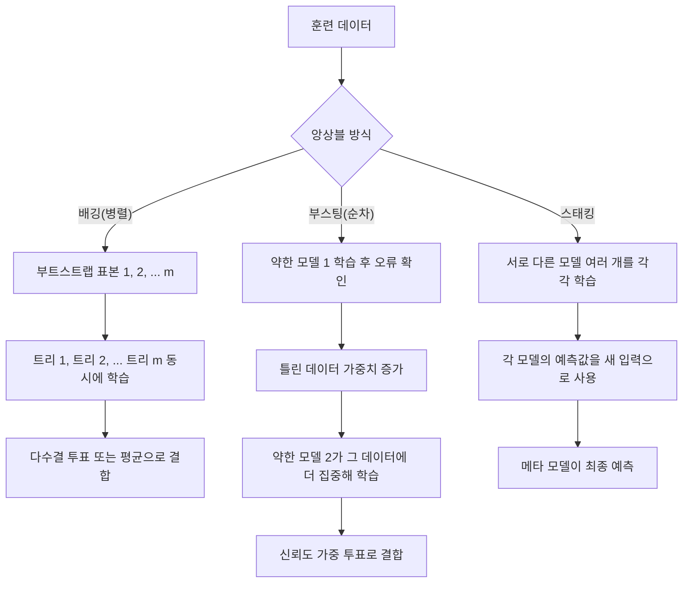

## 앙상블이란 무엇인가

### 정의와 직관

앙상블이 효과를 내는 이유는 통계학의 큰 수의 법칙과 비슷하다. 그래서 좋은 앙상블을 만들려면 **각 모델이 서로 조금씩 다르게 학습해야 한다**는 조건이 중요하며, 이 "다르게 만드는 방법"에 따라 앙상블 기법이 갈린다.

- **배깅**(bagging, Bootstrap Aggregating의 줄임말): 데이터를 다르게 뽑아서 여러 모델을 **동시에·독립적으로** 학습시킨 뒤 결과를 평균·투표로 합친다.
- **부스팅**(boosting): 여러 모델을 **순서대로** 학습시키되, 앞 모델이 틀린 부분에 다음 모델이 더 집중하도록 만든다.
- **스태킹**(stacking): 서로 다른 종류의 모델(예: 로지스틱 회귀 + 결정트리 + SVM)의 예측 결과를 다시 입력으로 삼아, 이를 종합하는 또 다른 모델(메타 모델, meta model)을 학습시킨다.

## 배깅과 부트스트랩

### 정의: 부트스트랩 샘플링

**부트스트랩**(bootstrap, 원래 "스스로 신발끈을 당겨 일어선다"는 관용구에서 온 통계 용어)은 원본 데이터셋에서 **복원추출**(sampling with replacement, 한 번 뽑은 표본을 다시 넣고 또 뽑는 방식)로 원본과 같은 크기의 표본을 여러 번 만드는 기법이다. 복원추출이므로 어떤 데이터는 한 번도 뽑히지 않을 수 있고, 어떤 데이터는 여러 번 중복해서 뽑힐 수 있다.

원본 데이터가 $n$개일 때, 한 번의 복원추출에서 특정 데이터 하나가 뽑히지 않을 확률은 $(1 - 1/n)$이고, $n$번 뽑는 과정 전체에서 그 데이터가 단 한 번도 뽑히지 않을 확률은 다음과 같다.

$$
P(\text{뽑히지 않음}) = \left(1 - \frac{1}{n}\right)^n
$$

- $n$: 원본 데이터의 개수(그리고 부트스트랩 표본의 크기)
- $n$이 충분히 크면 이 값은 $e^{-1} \approx 0.368$(약 36.8퍼센트)에 수렴한다. 즉 부트스트랩 표본 하나마다 원본 데이터의 **약 63.2퍼센트만 실제로 포함**되고, 나머지 약 36.8퍼센트는 그 표본에서 아예 빠진다.

빠진 데이터를 **OOB**(Out-Of-Bag, 가방 밖) 데이터라 부르며, 이 OOB 데이터는 해당 트리를 학습시킬 때 쓰이지 않았으므로 그 트리의 검증용 데이터처럼 활용할 수 있다. 이 덕분에 배깅·랜덤포레스트는 별도의 검증 세트를 나누지 않고도 OOB 오차로 성능을 어느 정도 가늠할 수 있다.

### 배깅의 예측 결합: 다수결 투표

배깅으로 여러 결정트리를 만들었다면, 분류 문제에서는 각 트리의 예측 중 **다수결 투표**(majority voting)로 최종 클래스를 정하고, 회귀 문제에서는 각 트리 예측값의 **평균**을 최종 예측으로 쓴다.

작은 예시로, 신용카드 거래가 사기(fraud)인지 아닌지 판별하는 트리 5개가 같은 거래 하나를 두고 다음과 같이 예측했다고 하자.

| 트리 | 예측 |
|---|---|
| 트리 1 | 정상 |
| 트리 2 | 정상 |
| 트리 3 | 사기 |
| 트리 4 | 정상 |
| 트리 5 | 사기 |

정상 3표, 사기 2표이므로 다수결로 최종 예측은 **정상**이다. 만약 트리 한 개(트리 1)만 썼다면 그 트리가 우연히 틀렸을 때 결과가 완전히 뒤집혔겠지만, 5개를 모으면 다수가 동의하는 방향으로 안정된다.

### 자주 틀리는 점

배깅은 "분산을 줄이는" 기법이다. 개별 트리가 원래 갖고 있던 편향(모델이 데이터의 패턴을 근본적으로 잘못 이해하는 정도)은 배깅으로 거의 줄어들지 않는다. "배깅을 쓰면 편향과 분산이 모두 크게 줄어든다"는 서술은 틀린 설명이며, **배깅은 분산 감소, 부스팅은 편향 감소**라는 역할 구분을 정확히 기억해야 한다.

## 랜덤포레스트: 두 가지 무작위성

### 정의: 두 가지 무작위성

랜덤포레스트가 트리 사이의 상관관계를 낮추기 위해 사용하는 무작위성은 정확히 두 가지다.

1. **행(데이터) 방향의 무작위성**: 배깅과 동일하게, 트리마다 원본 데이터에서 부트스트랩 표본을 뽑아 서로 다른 훈련 데이터로 학습한다.
2. **열(특징) 방향의 무작위성**: 각 트리의 노드를 분할할 때, 전체 특징 $p$개 중 일부만 무작위로 골라 그 안에서만 최적 분할을 찾는다. 분류 문제에서는 보통 $\sqrt{p}$(피 전체 특징 개수의 제곱근)개, 회귀 문제에서는 보통 $p/3$개를 후보로 사용한다.

전체 특징이 $p=16$개인 분류 문제라면 각 분할마다 $\sqrt{16}=4$개의 특징만 후보로 고려한다. 이렇게 하면 예측력이 가장 강한 특징이 있어도 그 특징이 후보에 포함되지 않는 분할이 자주 생기고, 트리마다 다른 특징으로 분할하게 되어 트리 사이의 상관관계가 낮아진다.

### 랜덤포레스트의 특징

- 개별 트리는 가지치기(pruning)를 하지 않고 최대한 깊게 키우는 경우가 많다(개별 트리의 편향을 낮게 유지하고, 분산을 앙상블 결합으로 줄이는 전략).
- 특징 중요도(feature importance)를 계산할 수 있어, 어떤 특징이 예측에 크게 기여했는지 해석하는 데 도움을 준다.
- 트리마다 독립적으로 학습이 가능하므로 병렬 처리가 쉽고, 데이터가 매우 크지 않다면 학습 속도도 비교적 빠르다.

### 자주 틀리는 점

"랜덤포레스트는 특징을 무작위로 고르는 것 하나만으로 이름이 랜덤이다"라는 설명은 절반만 맞다. 부트스트랩(행 무작위성)과 특징 무작위 선택(열 무작위성) **두 가지가 함께 있어야** 랜덤포레스트이며, 부트스트랩 없이 특징만 무작위로 제한하면 랜덤포레스트가 아니라 다른 변형(예: extra-trees 계열)에 가깝다.

## 부스팅: 순차적으로 틀린 부분을 보완하기

### AdaBoost의 작동 원리

**AdaBoost**(Adaptive Boosting, 적응형 부스팅)는 부스팅의 대표적인 초기 알고리즘이다. 모든 데이터에 처음에는 같은 가중치를 주고, 약한 모델을 하나 학습시킨 뒤, 그 모델이 틀린 데이터의 가중치는 높이고 맞힌 데이터의 가중치는 낮춘다.

각 약한 모델의 오류율이 $\varepsilon$(엡실론, error rate)일 때, 그 모델에 부여하는 신뢰도 가중치 $\alpha$(알파)는 다음과 같이 계산한다.

$$
\alpha = \frac{1}{2}\ln\left(\frac{1-\varepsilon}{\varepsilon}\right)
$$

- $\alpha$: 해당 약한 모델이 최종 투표에서 갖는 목소리 크기(신뢰도)
- $\varepsilon$: 해당 약한 모델의 가중 오류율(틀린 데이터의 가중치 합)
- $\ln$: 자연로그. 오류율이 낮을수록($\varepsilon \to 0$) $\alpha$는 커지고, 오류율이 0.5(동전 던지기 수준)에 가까우면 $\alpha$는 0에 가까워진다.

### 계산 예제: 가중치 갱신 한 라운드

데이터 5개가 있고, 처음에는 모두 같은 가중치 $w_i = 1/5 = 0.2$를 갖는다고 하자. 첫 번째 약한 모델을 학습시켰더니 5개 중 1개(데이터 3)만 틀리고 나머지 4개는 맞혔다.

**1단계: 가중 오류율 계산**

틀린 데이터의 가중치 합이 가중 오류율이다.

$$
\varepsilon = 0.2
$$

**2단계: 이 모델의 신뢰도 가중치 계산**

$$
\alpha = \frac{1}{2}\ln\left(\frac{1-0.2}{0.2}\right) = \frac{1}{2}\ln(4) \approx \frac{1}{2}\times 1.386 \approx 0.693
$$

**3단계: 데이터별 가중치 갱신**

맞힌 데이터는 가중치에 $e^{-\alpha}$를 곱해 줄이고, 틀린 데이터는 $e^{\alpha}$를 곱해 늘린다.

$$
e^{-0.693} \approx 0.5, \quad e^{0.693} \approx 2.0
$$

맞힌 4개 데이터의 새 가중치는 $0.2 \times 0.5 = 0.1$이고, 틀린 1개 데이터의 새 가중치는 $0.2 \times 2.0 = 0.4$다.

**4단계: 정규화(합이 1이 되도록 나누기)**

갱신된 가중치의 합은 다음과 같다.

$$
4 \times 0.1 + 0.4 = 0.8
$$

이 합으로 각 가중치를 나눠 정규화하면, 맞힌 데이터는 $0.1/0.8 = 0.125$, 틀린 데이터는 $0.4/0.8 = 0.5$가 된다.

**검산**: 정규화 후 가중치의 합은 $4 \times 0.125 + 0.5 = 0.5 + 0.5 = 1.0$이 되어야 하며, 실제로 정확히 1.0이 나온다. 또한 틀린 데이터의 가중치(0.5)가 맞힌 데이터 각각의 가중치(0.125)보다 훨씬 커졌으므로, 다음 라운드의 약한 모델은 이 틀린 데이터를 맞히는 데 더 집중하도록 유도된다.

### 그레이디언트 부스팅 계열의 직관

**그레이디언트 부스팅**(Gradient Boosting)은 AdaBoost처럼 데이터 가중치를 직접 조정하는 대신, 이전까지의 예측이 틀린 정도(잔차, residual)를 다음 모델이 예측하도록 학습시켜 오차를 점점 줄여 나간다. XGBoost·LightGBM은 이 그레이디언트 부스팅 아이디어에 정규화 항, 병렬 처리, 결측치 자동 처리 등을 더해 계산 속도와 성능을 개선한 구현체다.

### 자주 틀리는 점

부스팅은 이전 모델의 결과에 따라 다음 모델의 학습 데이터(또는 가중치)가 달라지므로 **트리를 병렬로 학습시킬 수 없다**(순차적이어야 한다). 또한 부스팅은 이상치나 잘못 레이블링된 데이터에 가중치가 계속 커지면서 지나치게 집중할 수 있어, 배깅보다 **이상치에 더 민감하고 과적합 위험도 더 크다**는 점도 기억해야 한다.

## 스태킹: 모델의 예측을 다시 학습시키기

### 정의

**스태킹**(stacking)은 성격이 다른 여러 모델(예: 로지스틱 회귀, K-NN, 결정트리, SVM)을 각각 학습시킨 뒤, 이 모델들의 예측값을 새로운 입력 특징으로 삼아 최종 결론을 내는 **메타 모델**(meta model, 또는 블렌더blender)을 하나 더 학습시키는 기법이다. 배깅·부스팅은 보통 같은 종류의 모델(주로 결정트리)을 여러 개 쓰지만, 스태킹은 서로 다른 알고리즘을 섞어 각 알고리즘의 강점을 메타 모델이 종합하도록 하는 데 초점이 있다.

## 세 앙상블 기법 비교

| 구분 | 배깅 | 부스팅 | 스태킹 |
|---|---|---|---|
| 학습 방식 | 병렬(독립적으로 동시에) | 순차(이전 결과를 반영해 차례로) | 병렬로 여러 모델 학습 후 메타 모델 추가 학습 |
| 주로 줄이는 것 | 분산(variance) | 편향(bias), 분산도 함께 감소 | 개별 모델들의 약점을 메타 모델이 보완 |
| 데이터 샘플링 | 부트스트랩(복원추출)으로 각기 다른 표본 | 전체 데이터를 쓰되 가중치·잔차를 조정 | 보통 전체 데이터, 교차검증으로 예측값 생성 |
| 개별 모델 성격 | 보통 같은 종류(대개 결정트리) | 보통 같은 종류의 약한 모델(얕은 트리 등) | 보통 서로 다른 종류의 모델 |
| 대표 알고리즘 | 랜덤포레스트 | AdaBoost, 그레이디언트 부스팅, XGBoost | 다양한 모델 + 메타 모델(로지스틱 회귀 등) |
| 과적합·이상치 민감도 | 상대적으로 낮음 | 상대적으로 높음(이상치에 가중치 집중 위험) | 메타 모델 설계·검증 방식에 따라 다름 |

```mermaid
flowchart TB
    A["훈련 데이터"] --> B{"앙상블 방식"}
    B -->|"배깅(병렬)"| C["부트스트랩 표본 1, 2, ... m"]
    C --> D["트리 1, 트리 2, ... 트리 m 동시에 학습"]
    D --> E["다수결 투표 또는 평균으로 결합"]
    B -->|"부스팅(순차)"| F["약한 모델 1 학습 후 오류 확인"]
    F --> G["틀린 데이터 가중치 증가"]
    G --> H["약한 모델 2가 그 데이터에 더 집중해 학습"]
    H --> I["신뢰도 가중 투표로 결합"]
    B -->|"스태킹"| J["서로 다른 모델 여러 개를 각각 학습"]
    J --> K["각 모델의 예측값을 새 입력으로 사용"]
    K --> L["메타 모델이 최종 예측"]
```

## 핵심 정리

- 앙상블은 서로 다르게 학습된 여러 모델의 예측을 결합해 단일 모델보다 안정적인 예측을 얻는 전략이다.
- 배깅은 부트스트랩(복원추출)으로 만든 표본마다 모델을 병렬로 학습시켜 **분산**을 줄이며, 데이터 약 63.2퍼센트만 각 표본에 포함되고 나머지는 OOB로 활용된다.
- 랜덤포레스트는 배깅에 **특징 무작위 선택**(열 방향 무작위성)을 더해 트리 사이 상관관계를 낮춘 것으로, 데이터(행)와 특징(열) 두 방향의 무작위성을 모두 가진다.
- 부스팅은 이전 모델이 틀린 데이터에 가중치를 높여 다음 모델이 순차적으로 보완하도록 학습시켜 **편향**을 줄이며, 순차적 특성상 병렬화가 어렵고 이상치에 더 민감하다.
- 스태킹은 서로 다른 종류의 모델 예측을 메타 모델의 입력으로 사용해 최종 결론을 낸다.

## 마무리 복습

<Quiz
  questionNumber={1}
  question={"배깅(bagging)에서 부트스트랩 표본을 만들 때 사용하는 추출 방식과 그 효과로 가장 적절한 것은?"}
  options={["비복원추출을 사용하며, 모든 데이터가 표본에 정확히 한 번씩 포함된다","복원추출을 사용하며, 표본마다 원본 데이터의 일부만 포함되고 일부는 중복 포함된다","층화추출을 사용하며, 클래스 비율을 원본과 동일하게 유지한다","군집추출을 사용하며, 데이터를 몇 개의 군집으로 나눠 일부 군집만 뽑는다"]}
  correctAnswer={2}
  explanation={"배깅은 원본 데이터에서 복원추출(sampling with replacement)로 원본과 같은 크기의 표본을 여러 번 뽑는다. 복원추출이므로 어떤 데이터는 여러 번 중복되고, 어떤 데이터는 한 번도 뽑히지 않아 표본마다 약 63.2퍼센트만 원본 데이터가 포함된다."}
/>

<Quiz
  questionNumber={2}
  question={"사기 거래 여부를 예측하는 트리 5개가 한 거래에 대해 정상, 사기, 사기, 정상, 사기로 예측했을 때 배깅의 다수결 투표 결과는?"}
  options={["정상(2표 대 3표로 정상이 이김)","사기(3표 대 2표로 사기가 이김)","5개 예측이 모두 다르므로 예측이 불가능하다","가장 먼저 나온 예측인 정상을 그대로 사용한다"]}
  correctAnswer={2}
  explanation={"정상 2표, 사기 3표이므로 다수결 투표에서 사기가 더 많은 표를 얻어 최종 예측은 사기가 된다."}
/>

<Quiz
  questionNumber={3}
  question={"랜덤포레스트가 일반 배깅과 구분되는 핵심 특징으로 가장 적절한 것은?"}
  options={["부트스트랩 표본 추출을 사용하지 않고 원본 데이터를 그대로 사용한다","각 분할에서 전체 특징 중 무작위로 고른 일부 특징만 후보로 사용한다","개별 트리를 순차적으로 학습시켜 이전 트리의 오차를 보완한다","트리마다 서로 다른 손실 함수를 사용해 학습한다"]}
  correctAnswer={2}
  explanation={"랜덤포레스트는 배깅의 부트스트랩 샘플링(행 방향 무작위성)에 더해, 각 노드를 분할할 때 전체 특징 중 무작위로 고른 일부만 후보로 사용하는 특징 무작위 선택(열 방향 무작위성)을 추가로 적용해 트리 사이 상관관계를 낮춘다."}
/>

## 참고 자료

- [scikit-learn User Guide — Ensemble methods](https://scikit-learn.org/stable/modules/ensemble.html)
- [In-depth Comparison of Supervised Classification Models](https://thesai.org/Downloads/Volume16No8/Paper_62-In_Depth_Comparison_of_Supervised_Classification_Models.pdf)
