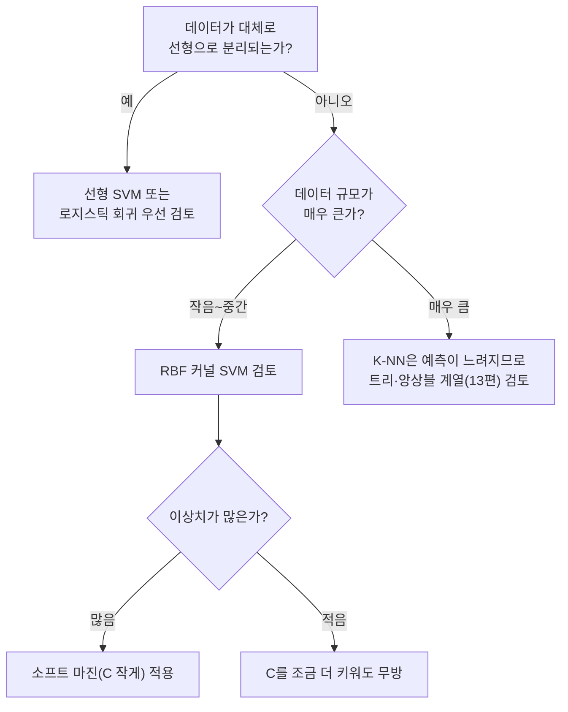

<Callout type="info">
  **이번 문서의 목표:** K-NN이 실제 좌표에서 유클리드·맨해튼 거리를 어떻게 계산해 이웃을 정하는지, k값이 편향-분산에 어떤 영향을 주는지 직접 계산으로 확인하고, SVM의 마진·서포트 벡터·커널 트릭의 직관과 하드·소프트 마진의 차이를 정리한다.
</Callout>

## 왜 "거리"로 분류하는가 — K-NN의 아이디어

**K-최근접 이웃**(K-Nearest Neighbors, K-NN)은 새로운 데이터가 어떤 클래스인지 알고 싶을 때, "이 점과 가장 가까운 이웃 $k$개는 어떤 클래스인가"를 보고 **다수결**로 정하는 알고리즘입니다. 결정트리(11편)처럼 규칙을 학습하는 것도 아니고, 로지스틱 회귀(10편)처럼 수식의 계수를 학습하는 것도 아닙니다. K-NN은 훈련 데이터를 통째로 기억해 두었다가, 새 데이터가 들어올 때마다 그때그때 거리를 재서 판단하는 **게으른 학습**(Lazy Learning, 미리 모델을 만들어두지 않고 예측 시점에 계산하는 방식)입니다.

> **쉽게 말하면:** K-NN은 "네 주변에 누가 사는지 보면 네가 어떤 사람인지 알 수 있다"는 생각을 그대로 계산으로 옮긴 것입니다.

## 1. 거리 계산 — 실제 좌표로 유클리드와 맨해튼

2차원 평면에 A반(클래스 A) 학생 3명과 B반(클래스 B) 학생 3명의 좌표(예: 수학 점수, 영어 점수를 정규화한 값)가 있고, 새로 전학 온 학생 $q$의 반을 예측하려 합니다.

| 학생 | 좌표 | 클래스 |
|---|---|---|
| A1 | (1, 1) | A |
| A2 | (2, 2) | A |
| A3 | (1, 3) | A |
| B1 | (5, 4) | B |
| B2 | (6, 6) | B |
| B3 | (3, 5) | B |
| $q$ | (3, 3) | ? |

**유클리드 거리**(Euclidean Distance, 두 점을 잇는 직선 거리)는 다음과 같이 계산합니다.

$$
d_{Euclidean}(p,q) = \sqrt{(x_p-x_q)^2+(y_p-y_q)^2}
$$

각 점에 대해 $q=(3,3)$까지의 거리를 계산합니다.

$$
d(A1,q)=\sqrt{(1-3)^2+(1-3)^2}=\sqrt{4+4}=\sqrt{8}\approx2.828
$$

$$
d(A2,q)=\sqrt{(2-3)^2+(2-3)^2}=\sqrt{1+1}=\sqrt{2}\approx1.414
$$

$$
d(A3,q)=\sqrt{(1-3)^2+(3-3)^2}=\sqrt{4+0}=\sqrt{4}=2.000
$$

$$
d(B1,q)=\sqrt{(5-3)^2+(4-3)^2}=\sqrt{4+1}=\sqrt{5}\approx2.236
$$

$$
d(B2,q)=\sqrt{(6-3)^2+(6-3)^2}=\sqrt{9+9}=\sqrt{18}\approx4.243
$$

$$
d(B3,q)=\sqrt{(3-3)^2+(5-3)^2}=\sqrt{0+4}=\sqrt{4}=2.000
$$

**맨해튼 거리**(Manhattan Distance, 바둑판 모양 도로를 격자 방향으로만 이동한 거리, 택시 거리라고도 함)는 각 축의 차이를 절댓값으로 더합니다.

$$
d_{Manhattan}(p,q) = |x_p-x_q|+|y_p-y_q|
$$

$$
d(A1,q)=|1-3|+|1-3|=2+2=4, \quad d(A2,q)=|2-3|+|2-3|=1+1=2
$$

$$
d(A3,q)=|1-3|+|3-3|=2+0=2, \quad d(B1,q)=|5-3|+|4-3|=2+1=3
$$

$$
d(B2,q)=|6-3|+|6-3|=3+3=6, \quad d(B3,q)=|3-3|+|5-3|=0+2=2
$$

**결과를 정리하면:**

| 학생 | 유클리드 거리 | 맨해튼 거리 | 클래스 |
|---|---|---|---|
| A2 | 1.414 | 2 | A |
| A3 | 2.000 | 2 | A |
| B3 | 2.000 | 2 | B |
| B1 | 2.236 | 3 | B |
| A1 | 2.828 | 4 | A |
| B2 | 4.243 | 6 | B |

**결과 해석 — 거리 기준에 따라 순위가 달라진다:** 유클리드 거리로는 A2(1.414)가 가장 가깝고 A3와 B3가 2.000으로 동률입니다. 그런데 맨해튼 거리로는 A2, A3, B3 **세 점이 모두 2로 동률**이 됩니다. 즉 같은 좌표라도 어떤 거리 척도를 쓰느냐에 따라 순위와 동률 여부가 달라질 수 있다는 것이 K-NN의 중요한 함정입니다. 좌표 축의 스케일이 서로 다른 특징(예: 나이는 0~100, 연봉은 0~100000000)을 그대로 쓰면 거리가 큰 스케일의 특징에 지배되므로, K-NN을 쓰기 전에는 반드시 06편의 **스케일링**(정규화·표준화)을 거쳐야 합니다.

## 2. k값에 따른 분류 — 편향-분산 트레이드오프

유클리드 거리 기준으로 가까운 순서는 A2(1.414) → A3=B3(2.000, 동률) → B1(2.236) → A1(2.828) → B2(4.243)입니다.

- **$k=1$:** 가장 가까운 1개는 A2 하나뿐이므로 동률 문제 없이 바로 **클래스 A**로 예측합니다.
- **$k=3$:** 가까운 3개를 뽑으면 A2, 그리고 공동 2등인 A3와 B3가 함께 포함되어 (A2, A3, B3) = A 2표, B 1표로 **클래스 A**가 다수결 승리합니다.
- **$k=5$:** 다섯 번째까지 포함하면 (A2, A3, B3, B1, A1) = A 3표, B 2표로 여전히 **클래스 A**가 다수결 승리합니다.

이 예제는 우연히 $k$를 바꿔도 결과가 같지만, $k$가 커질수록 더 먼 점들까지 투표에 참여시키므로 결과가 흔들릴 여지가 커집니다. 이것이 **편향-분산 트레이드오프**(Bias-Variance Trade-off, 19편에서 이론적으로 더 깊이 다룸)로 이어집니다.

| $k$ | 특징 | 편향(Bias) | 분산(Variance) |
|---|---|---|---|
| 작음(예: $k=1$) | 가장 가까운 단 하나의 이웃에만 의존 | 낮음(훈련 데이터의 패턴을 세밀하게 따라감) | 높음(이상치·노이즈 하나에도 예측이 크게 흔들림) |
| 큼(예: 전체 데이터 수에 가까움) | 멀리 있는 점들까지 투표에 참여 | 높음(전체 다수 클래스 쪽으로 뭉뚱그려짐, 지역적 패턴을 놓침) | 낮음(개별 이상치의 영향이 희석됨) |

> **쉽게 말하면:** $k=1$은 "바로 옆집 한 곳만 보고 판단"해서 예민하고(분산이 큼), $k$가 아주 크면 "동네 전체 여론을 따라가서" 둔감해집니다(편향이 큼).

**자주 틀리는 함정 — 짝수 k의 동률 문제:** 이진분류에서 $k$를 짝수로 두면(예: $k=6$, 전체 데이터 수와 같음) 투표가 3:3처럼 정확히 반으로 갈려 다수결을 결정할 수 없는 상황이 생길 수 있습니다. 그래서 이진분류에서는 관례적으로 $k$를 **홀수**로 설정해 동률을 피합니다.

## 3. SVM — 마진을 최대로 벌리는 경계선

**서포트 벡터 머신**(Support Vector Machine, SVM)은 두 클래스를 나누는 경계선을 그리되, 단순히 나누기만 하는 것이 아니라 **경계선에서 양쪽 클래스까지의 여백(마진)을 가장 넓게** 만드는 경계선을 찾습니다.

> **쉽게 말하면:** SVM은 두 클래스 사이에 "가장 넓은 도로"를 놓고, 그 도로의 정중앙 선을 결정경계로 삼습니다.

결정경계는 $w \cdot x + b = 0$ 형태이며, 마진의 폭은 다음과 같이 계산됩니다.

$$
\text{Margin} = \frac{2}{\lVert w \rVert}
$$

- $\lVert w \rVert$ (노름): 계수 벡터 $w$의 길이(크기), $w=(w_1,w_2,\dots)$이면 $\lVert w \rVert=\sqrt{w_1^2+w_2^2+\cdots}$

**서포트 벡터**(Support Vector)는 이 도로의 양쪽 가장자리에 정확히 걸쳐 있는, 경계선에 가장 가까운 데이터 점들입니다. 마진을 결정짓는 것은 오직 이 서포트 벡터들뿐이며, 도로에서 멀리 떨어진 다른 점들은 경계선의 위치에 전혀 영향을 주지 않습니다.

**실제 숫자로 확인해 보겠습니다.** $w=(1,1)$, $b=0$인 결정경계가 있고, 점 $(1,0)$은 양성 클래스의 서포트 벡터, 점 $(-1,0)$은 음성 클래스의 서포트 벡터라고 합시다.

$$
w \cdot (1,0) + b = (1)(1)+(1)(0)+0 = 1
$$

$$
w \cdot (-1,0) + b = (1)(-1)+(1)(0)+0 = -1
$$

서포트 벡터는 $y_i(w\cdot x_i+b)=1$을 만족해야 하는데, 양성 점은 $1\times1=1$, 음성 점은 $(-1)\times(-1)=1$로 두 점 모두 조건을 정확히 만족합니다. 이때 마진의 폭은 다음과 같습니다.

$$
\lVert w \rVert = \sqrt{1^2+1^2} = \sqrt{2} \approx 1.414
$$

$$
\text{Margin} = \frac{2}{\sqrt{2}} \approx 1.414
$$

**결과 해석:** $w$의 크기가 작을수록(계수가 작을수록) 마진 $2/\lVert w\rVert$은 커집니다. 즉 SVM이 "마진을 최대화"한다는 것은 수식으로 보면 "$\lVert w\rVert$를 최소화"하는 것과 같은 문제입니다.

## 4. 하드 마진과 소프트 마진

데이터가 실제로는 완벽하게 두 그룹으로 깔끔히 갈리지 않는 경우가 대부분입니다. 이때 SVM이 오차를 허용하는 정도에 따라 두 가지로 나뉩니다.

| 구분 | 하드 마진(Hard Margin) | 소프트 마진(Soft Margin) |
|---|---|---|
| 전제 | 두 클래스가 완벽하게 선형 분리 가능하다고 가정 | 일부 데이터가 마진 안쪽에 있거나 잘못 분류되는 것을 허용 |
| 오차 허용 | 전혀 허용하지 않음 | 슬랙 변수 $\xi$ (크시, 오차 허용량)로 위반 정도를 측정 |
| 하이퍼파라미터 $C$ | 해당 없음(위반 자체를 금지) | $C$가 클수록 위반에 대한 벌점이 커져 마진이 좁아지고 훈련 데이터에 더 민감해짐(과적합 위험), $C$가 작을수록 마진이 넓어지고 오차에 관대해짐(과소적합 위험) |
| 현실 적합성 | 노이즈가 있는 실제 데이터에는 거의 적용 불가능 | 실제 데이터에서 훨씬 널리 사용됨 |

**자주 틀리는 점:** "$C$가 클수록 항상 좋은 모델이다"라는 설명은 틀렸습니다. $C$는 09편의 정규화 강도 $\lambda$와 반대 방향으로 작동하는 하이퍼파라미터로, $C$가 지나치게 크면 훈련 데이터의 이상치까지 정확히 맞추려다 과적합이 발생합니다.

## 5. 커널 트릭 — 선형으로 못 나누는 데이터 다루기

두 클래스가 직선(또는 평면)으로 절대 나뉘지 않는 경우가 있습니다. 대표적인 예가 **XOR 문제**입니다.

| $x_1$ | $x_2$ | 클래스 |
|---|---|---|
| 0 | 0 | 0 |
| 1 | 1 | 0 |
| 0 | 1 | 1 |
| 1 | 0 | 1 |

이 4개의 점은 2차원 평면 위에서 어떤 직선을 그어도 클래스 0과 1을 완전히 나눌 수 없습니다. 그런데 여기에 새로운 특징 $x_3=x_1 \times x_2$를 추가하면, $(0,0)\to x_3=0$, $(1,1)\to x_3=1$, $(0,1)\to x_3=0$, $(1,0)\to x_3=0$이 되어 새로운 차원에서는 선형으로 분리할 실마리가 생깁니다.

**커널 트릭**(Kernel Trick)은 이처럼 데이터를 더 높은 차원으로 옮기면 선형 분리가 가능해질 수 있다는 아이디어를, 실제로 높은 차원의 좌표를 일일이 계산하지 않고도 **커널 함수**(Kernel Function)라는 지름길 계산으로 그 효과만 얻어내는 방법입니다.

> **쉽게 말하면:** 커널 트릭은 "2차원에서는 안 갈리는 두 무리를, 3차원(또는 그 이상)으로 튕겨 올려서 갈라놓고, 그 계산을 지름길로 빠르게 해내는 것"입니다.

| 커널 종류 | 직관 |
|---|---|
| 선형 커널(Linear) | 원래 공간 그대로 직선(평면)으로 나눔, 커널 트릭을 쓰지 않는 것과 사실상 같음 |
| 다항 커널(Polynomial) | 특징들의 곱(예: $x_1x_2$, $x_1^2$)까지 고려한 곡선 경계 |
| RBF 커널(가우시안 커널) | 각 점 주변에 원(또는 구) 모양의 영역을 만들어 매우 복잡한 비선형 경계까지 표현 가능 |

## 6. K-NN과 SVM 비교 및 판단 흐름

| 구분 | K-NN | SVM |
|---|---|---|
| 학습 방식 | 게으른 학습(훈련 시 계산 없음, 예측 시 거리 계산) | 학습 시 마진을 최대화하는 경계를 미리 찾아둠 |
| 예측 속도 | 데이터가 많을수록 느려짐(매번 전체와 거리 계산) | 학습은 오래 걸릴 수 있으나 예측은 빠름 |
| 스케일링 민감도 | 매우 민감(거리 기반이므로 특징 스케일을 반드시 맞춰야 함) | 마진 계산에 거리 개념이 들어가므로 마찬가지로 민감 |
| 차원이 매우 높을 때 | 거리 개념이 희미해져(차원의 저주, 16편) 성능 저하 | 커널 트릭으로 고차원에서도 비교적 강건 |
| 해석 가능성 | 가까운 이웃을 직접 보여줄 수 있어 직관적 | 서포트 벡터와 마진 개념은 있으나 결정 과정 자체는 K-NN보다 덜 직관적 |

## 핵심 정리

- K-NN은 새 데이터와 훈련 데이터 사이의 거리(유클리드·맨해튼 등)를 계산해 가장 가까운 $k$개의 다수결로 클래스를 정하는 게으른 학습이며, 스케일링이 필수다.
- $k$가 작을수록 분산이 크고(노이즈에 민감), $k$가 클수록 편향이 커진다(지역 패턴을 놓침). 이진분류에서는 동률을 피하기 위해 $k$를 홀수로 둔다.
- SVM은 마진 $2/\lVert w\rVert$을 최대화하는 결정경계를 찾으며, 마진 경계에 걸친 점만이 서포트 벡터로서 경계 위치를 결정한다.
- 하드 마진은 오차를 전혀 허용하지 않고, 소프트 마진은 하이퍼파라미터 $C$로 오차 허용 정도를 조절한다.
- 커널 트릭은 데이터를 더 높은 차원으로 옮겨 선형 분리가 가능해지는 효과를, 실제 고차원 좌표 계산 없이 커널 함수로 얻어낸다.

## 마무리 복습

<Quiz
  questionNumber={1}
  question="두 점 (1,1)과 (4,5) 사이의 유클리드 거리로 옳은 것은?"
  options={['3', '4', '5', '7']}
  correctAnswer={3}
  explanation="유클리드 거리는 루트((4-1)^2+(5-1)^2) = 루트(9+16) = 루트(25) = 5이다."
  optionExplanations={['이는 x축 차이(3)만 반영한 값이다', '이는 y축 차이(4)만 반영한 값이다', '두 축의 차이를 제곱해 더한 뒤 제곱근을 취한 정확한 값이다', '이는 맨해튼 거리(3+4=7)와 혼동한 값이다']}
/>

<Quiz
  questionNumber={2}
  question="같은 두 점 (1,1)과 (4,5) 사이의 맨해튼 거리로 옳은 것은?"
  options={['5', '7', '9', '25']}
  correctAnswer={2}
  explanation="맨해튼 거리는 |4-1|+|5-1| = 3+4 = 7이다."
  optionExplanations={['이는 유클리드 거리 값이다', '두 축 차이의 절댓값을 더한 정확한 맨해튼 거리다', '두 축 차이를 곱한 값이 아니라 더해야 한다', '이는 거리 제곱합(9+16)이다']}
/>

<Quiz
  questionNumber={3}
  question="K-NN에서 k값을 매우 작게(예: k=1) 설정했을 때 나타나는 경향으로 가장 적절한 것은?"
  options={['편향이 크고 분산이 작아진다', '편향이 작고 분산이 커져 노이즈에 민감해진다', '항상 다수결 동률이 발생한다', 'k값은 예측 결과에 전혀 영향을 주지 않는다']}
  correctAnswer={2}
  explanation="k=1은 가장 가까운 단 하나의 이웃에만 의존하므로 훈련 데이터의 세부 패턴(및 노이즈)에 민감해 분산이 크고, 그만큼 편향은 작아진다."
  optionExplanations={['이는 k가 클 때의 경향과 반대로 서술되었다', 'k=1의 편향-분산 경향을 정확히 설명했다', '동률은 k가 짝수이고 이웃 클래스가 균등할 때 생기는 문제로 k=1과는 별개다', 'k값에 따라 이웃 구성과 예측 결과가 달라진다']}
/>

<Quiz
  questionNumber={4}
  question="이진분류 K-NN에서 k를 짝수로 설정할 때 생길 수 있는 대표적인 문제는?"
  options={['거리 계산이 불가능해진다', '다수결 투표가 동률이 되어 클래스를 결정할 수 없는 상황이 생길 수 있다', '항상 훈련 정확도가 100퍼센트가 된다', '스케일링이 필요 없어진다']}
  correctAnswer={2}
  explanation="이진분류에서 k가 짝수이면 이웃들의 클래스 표가 정확히 반으로 갈리는 동률 상황이 생길 수 있어, 관례적으로 k를 홀수로 설정해 이를 피한다."
  optionExplanations={['거리 계산 자체는 k값과 무관하게 항상 가능하다', 'k가 짝수일 때 발생하는 정확한 문제점이다', '훈련 정확도는 k값이나 데이터 구성에 따라 달라진다', 'K-NN은 거리 기반이므로 k값과 무관하게 스케일링이 필요하다']}
/>

<Quiz
  questionNumber={5}
  question="SVM에서 서포트 벡터에 대한 설명으로 가장 적절한 것은?"
  options={['모든 훈련 데이터를 가리키는 다른 이름이다', '마진 경계에 가장 가깝게 걸쳐 있어 결정경계의 위치를 결정하는 데이터 점들이다', '결정경계에서 가장 멀리 떨어진 데이터 점들이다', '커널 함수를 계산할 때만 사용되는 임시 변수다']}
  correctAnswer={2}
  explanation="서포트 벡터는 마진의 경계에 정확히 걸쳐 있는 점들로, 이 점들만이 결정경계와 마진의 위치를 결정한다. 마진에서 멀리 떨어진 점은 결정경계에 영향을 주지 않는다."
  optionExplanations={['서포트 벡터는 전체 훈련 데이터 중 일부(마진 경계에 걸친 점)만을 가리킨다', '서포트 벡터의 정확한 정의다', '오히려 결정경계에 가장 가까운 점들이 서포트 벡터다', '커널 함수는 특징 변환 계산에 쓰이며 서포트 벡터의 정의와는 다른 개념이다']}
/>

<Quiz
  questionNumber={6}
  question="소프트 마진 SVM의 하이퍼파라미터 C에 대한 설명으로 옳지 않은 것은?"
  options={['C가 클수록 오차(마진 위반)에 대한 벌점이 커진다', 'C가 작을수록 마진이 넓어지고 오차에 더 관대해진다', 'C가 클수록 항상 검증 데이터 성능이 좋아진다', 'C가 지나치게 크면 훈련 데이터에 과도하게 맞춰 과적합될 위험이 있다']}
  correctAnswer={3}
  explanation="C가 클수록 항상 좋다는 설명은 옳지 않다. C가 지나치게 크면 훈련 데이터의 이상치까지 정확히 맞추려다 과적합이 발생할 수 있다."
  optionExplanations={['C가 클수록 위반에 대한 벌점이 커진다는 것은 옳은 설명이다', 'C가 작을수록 마진이 넓어진다는 것은 옳은 설명이다', 'C와 성능의 관계를 단정적으로 잘못 서술해 옳지 않은 설명이다', 'C가 매우 클 때의 위험을 정확히 설명했다']}
/>

<Quiz
  questionNumber={7}
  question="XOR 문제처럼 2차원 평면에서 직선으로 분리되지 않는 데이터를, 특징을 추가하거나 커널 함수를 사용해 분리 가능하게 만드는 아이디어를 가리키는 것은?"
  options={['가지치기', '커널 트릭', '라플라스 스무딩', '정보이득']}
  correctAnswer={2}
  explanation="커널 트릭은 데이터를 더 높은 차원으로 옮기면 선형 분리가 가능해지는 효과를, 실제 고차원 계산 없이 커널 함수로 얻어내는 SVM의 핵심 아이디어다."
  optionExplanations={['가지치기는 결정트리의 과적합 대응 기법이다', 'XOR과 같은 비선형 분리 문제에 대한 정확한 해법이다', '라플라스 스무딩은 나이브 베이즈의 제로 확률 문제 보정 기법이다', '정보이득은 결정트리의 분할 기준을 정하는 지표다']}
/>

<Quiz
  questionNumber={8}
  question="K-NN과 SVM을 비교한 설명으로 가장 적절한 것은?"
  options={['K-NN은 훈련 시 별도의 계산 없이 데이터를 저장해 두고 예측 시점에 거리를 계산하는 게으른 학습이다', 'SVM은 거리·마진 개념을 전혀 사용하지 않는다', 'K-NN은 특징의 스케일이 달라도 전혀 영향을 받지 않는다', 'SVM은 항상 선형 결정경계만 만들 수 있다']}
  correctAnswer={1}
  explanation="K-NN은 훈련 단계에서 모델을 미리 만들지 않고 데이터를 저장해 두었다가, 예측 시점에 거리를 계산해 다수결로 판단하는 게으른 학습 방식이다."
  optionExplanations={['K-NN의 게으른 학습 방식을 정확히 설명했다', 'SVM은 마진(2/||w||)을 최대화하는 방식으로 거리 개념을 핵심적으로 사용한다', 'K-NN은 거리 기반이므로 스케일에 매우 민감하다', 'SVM은 커널 트릭을 사용하면 비선형 결정경계도 만들 수 있다']}
/>

## 참고 자료

- [scikit-learn User Guide — Nearest Neighbors, Support Vector Machines](https://scikit-learn.org/stable/user_guide.html)
- [In-depth Comparison of Supervised Classification Models](https://thesai.org/Downloads/Volume16No8/Paper_62-In_Depth_Comparison_of_Supervised_Classification_Models.pdf)
